<!--
CO_OP_TRANSLATOR_METADATA:
{
  "original_hash": "3925b6a1c31c60755eaae4d578232c25",
  "translation_date": "2026-01-06T07:03:39+00:00",
  "source_file": "10-ai-framework-project/README.md",
  "language_code": "es"
}
-->
# Marco de IA

¿Alguna vez te has sentido abrumado intentando construir aplicaciones de IA desde cero? ¡No estás solo! Los marcos de IA son como tener una navaja suiza para el desarrollo de IA: son herramientas poderosas que pueden ahorrarte tiempo y dolores de cabeza al crear aplicaciones inteligentes. Piensa en un marco de IA como una biblioteca bien organizada: proporciona componentes preconstruidos, API estandarizadas y abstracciones inteligentes para que puedas concentrarte en resolver problemas en lugar de lidiar con detalles de implementación.

En esta lección, exploraremos cómo marcos como LangChain pueden convertir lo que antes eran tareas complejas de integración de IA en código limpio y legible. Descubrirás cómo abordar desafíos del mundo real como llevar el registro de conversaciones, implementar llamadas a herramientas y manejar diferentes modelos de IA a través de una interfaz unificada.

Para cuando terminemos, sabrás cuándo recurrir a marcos en lugar de llamadas directas a API, cómo usar sus abstracciones eficazmente y cómo construir aplicaciones de IA listas para uso real. Vamos a explorar lo que los marcos de IA pueden hacer por tus proyectos.

## ⚡ Lo que puedes hacer en los próximos 5 minutos

**Camino de Inicio Rápido para Desarrolladores Ocupados**

```mermaid
flowchart LR
    A[⚡ 5 minutos] --> B[Instalar LangChain]
    B --> C[Crear cliente ChatOpenAI]
    C --> D[Enviar primer mensaje]
    D --> E[Ver el poder del framework]
```


- **Minuto 1**: Instala LangChain: `pip install langchain langchain-openai`
- **Minuto 2**: Configura tu token de GitHub e importa el cliente ChatOpenAI
- **Minuto 3**: Crea una conversación sencilla con mensajes del sistema y del humano
- **Minuto 4**: Añade una herramienta básica (como una función de suma) y observa la llamada a herramientas IA
- **Minuto 5**: Experimenta la diferencia entre llamadas directas a API y abstracción del marco

**Código de prueba rápido**:
```python
from langchain_openai import ChatOpenAI
from langchain_core.messages import SystemMessage, HumanMessage

llm = ChatOpenAI(
    api_key=os.environ["GITHUB_TOKEN"],
    base_url="https://models.github.ai/inference",
    model="openai/gpt-4o-mini"
)

response = llm.invoke([
    SystemMessage(content="You are a helpful coding assistant"),
    HumanMessage(content="Explain Python functions briefly")
])
print(response.content)
```

**Por qué esto importa**: En 5 minutos, experimentarás cómo los marcos de IA transforman integraciones complejas en llamadas simples a métodos. Esta es la base que impulsa aplicaciones de IA en producción.

## ¿Por qué elegir un marco?

Entonces, estás listo para construir una app de IA, ¡genial! Pero aquí está el asunto: tienes varias rutas que puedes tomar, y cada una tiene sus pros y sus contras. Es como elegir entre caminar, andar en bici o conducir para llegar a un lugar: todos te llevarán, pero la experiencia (y el esfuerzo) será totalmente diferente.

Desglosamos las tres principales formas de integrar IA en tus proyectos:

| Enfoque | Ventajas | Ideal para | Consideraciones |
|----------|------------|----------|--------------|
| **Peticiones HTTP directas** | Control total, sin dependencias | Consultas simples, aprender fundamentos | Código más verboso, manejo manual de errores |
| **Integración con SDK** | Menos código repetitivo, optimización específica por modelo | Aplicaciones con un solo modelo | Limitado a proveedores específicos |
| **Marcos de IA** | API unificada, abstracciones incorporadas | Aplicaciones multi-modelo, flujos de trabajo complejos | Curva de aprendizaje, posible sobreabstracción |

### Beneficios de los marcos en la práctica

```mermaid
graph TD
    A[Su Aplicación] --> B[Marco de IA]
    B --> C[OpenAI GPT]
    B --> D[Anthropic Claude]
    B --> E[Modelos de GitHub]
    B --> F[Modelos Locales]
    
    B --> G[Herramientas Integradas]
    G --> H[Gestión de Memoria]
    G --> I[Historial de Conversación]
    G --> J[Llamado de Funciones]
    G --> K[Manejo de Errores]
```


**Por qué importan los marcos:**
- **Unifica** múltiples proveedores de IA bajo una sola interfaz
- **Maneja** automáticamente la memoria de las conversaciones
- **Proporciona** herramientas listas para tareas comunes como embeddings y llamadas a funciones
- **Gestiona** el manejo de errores y lógica de reintentos
- **Convierte** flujos de trabajo complejos en llamadas a métodos legibles

> 💡 **Consejo profesional**: Usa marcos al cambiar entre diferentes modelos de IA o construyendo características complejas como agentes, memoria o llamadas a herramientas. Usa APIs directas cuando aprendas lo básico o construyas aplicaciones simples y focalizadas.

**En resumen**: como elegir entre herramientas especializadas de un artesano y un taller completo, se trata de adaptar la herramienta a la tarea. Los marcos destacan en aplicaciones complejas y ricas en funciones, mientras que las APIs directas funcionan bien para casos simples.

## 🗺️ Tu viaje de aprendizaje hacia el dominio de marcos de IA


**Destino de tu viaje**: Al final de esta lección, habrás dominado el desarrollo con marcos de IA y podrás construir aplicaciones sofisticadas y listas para producción que compiten con asistentes comerciales de IA.

## Introducción

En esta lección aprenderemos a:

- Usar un marco común de IA.
- Abordar problemas comunes como conversaciones de chat, uso de herramientas, memoria y contexto.
- Aprovechar esto para construir aplicaciones de IA.

## 🧠 Ecosistema de desarrollo de marcos de IA

```mermaid
mindmap
  root((AI Frameworks))
    Beneficios de la Abstracción
      Simplificación del Código
        APIs Unificadas
        Manejo de Errores Integrado
        Patrones Consistentes
        Reducción de Código Repetitivo
      Soporte Multi-Modelo
        Independiente del Proveedor
        Cambio Fácil
        Opciones de Respaldo
        Optimización de Costos
    Componentes Principales
      Gestión de Conversaciones
        Tipos de Mensajes
        Sistemas de Memoria
        Seguimiento de Contexto
        Persistencia de Historial
      Integración de Herramientas
        Llamadas a Funciones
        Conexiones API
        Herramientas Personalizadas
        Automatización de Flujos de Trabajo
    Funciones Avanzadas
      Salida Estructurada
        Modelos Pydantic
        Esquemas JSON
        Seguridad de Tipos
        Reglas de Validación
      Procesamiento de Documentos
        Embeddings
        Almacenes Vectoriales
        Búsqueda por Similitud
        Sistemas RAG
    Patrones de Producción
      Arquitectura de Aplicaciones
        Diseño Modular
        Límites de Error
        Operaciones Asíncronas
        Gestión de Estado
      Estrategias de Despliegue
        Escalabilidad
        Monitoreo
        Rendimiento
        Seguridad
```


**Principio central**: Los marcos de IA abstraen la complejidad mientras proveen potentes abstracciones para gestión de conversaciones, integración de herramientas y procesamiento de documentos, permitiendo a los desarrolladores construir aplicaciones sofisticadas de IA con código limpio y mantenible.

## Tu primer prompt de IA

Comencemos con los fundamentos creando tu primera aplicación de IA que envía una pregunta y recibe una respuesta. Como Arquímedes descubriendo el principio de desplazamiento en su baño, a veces las observaciones más simples conducen a las ideas más poderosas, y los marcos hacen que estas ideas sean accesibles.

### Configurando LangChain con GitHub Models

Vamos a usar LangChain para conectarnos a GitHub Models, lo cual es genial porque te da acceso gratuito a varios modelos de IA. ¿Lo mejor? Solo necesitas unos pocos parámetros de configuración para comenzar:

```python
from langchain_openai import ChatOpenAI
import os

llm = ChatOpenAI(
    api_key=os.environ["GITHUB_TOKEN"],
    base_url="https://models.github.ai/inference",
    model="openai/gpt-4o-mini",
)

# Enviar un mensaje simple
response = llm.invoke("What's the capital of France?")
print(response.content)
```

**Analicemos lo que sucede aquí:**
- **Crea** un cliente LangChain usando la clase `ChatOpenAI`: ¡es tu puerta de entrada a la IA!
- **Configura** la conexión a GitHub Models con tu token de autenticación
- **Especifica** qué modelo de IA usar (`gpt-4o-mini`) — piensa en esto como elegir tu asistente de IA
- **Envía** tu pregunta mediante el método `invoke()` — aquí ocurre la magia
- **Extrae** y muestra la respuesta — ¡y voilà, estás chateando con IA!

> 🔧 **Nota de configuración**: Si usas GitHub Codespaces, tienes suerte: ¡el `GITHUB_TOKEN` ya está configurado para ti! ¿Trabajando localmente? No te preocupes, solo necesitas crear un token de acceso personal con los permisos adecuados.

**Salida esperada:**
```text
The capital of France is Paris.
```


```mermaid
sequenceDiagram
    participant App as Tu App de Python
    participant LC as LangChain
    participant GM as GitHub Models
    participant AI as GPT-4o-mini
    
    App->>LC: llm.invoke("¿Cuál es la capital de Francia?")
    LC->>GM: solicitud HTTP con prompt
    GM->>AI: Procesar prompt
    AI->>GM: Respuesta generada
    GM->>LC: Devolver respuesta
    LC->>App: response.content
```

## Construyendo IA conversacional

Ese primer ejemplo muestra lo básico, pero es solo un intercambio: haces una pregunta, recibes una respuesta y eso es todo. En aplicaciones reales, quieres que tu IA recuerde lo que han estado discutiendo, como Watson y Holmes construían sus conversaciones investigativas a lo largo del tiempo.

Aquí es donde LangChain se vuelve especialmente útil. Proporciona diferentes tipos de mensajes que ayudan a estructurar las conversaciones y permiten darle a tu IA una personalidad. Construirás experiencias de chat que mantienen contexto y carácter.

### Comprendiendo los tipos de mensajes

Piensa en estos tipos de mensajes como diferentes "sombreros" que usan los participantes en una conversación. LangChain usa distintas clases de mensajes para registrar quién dice qué:

| Tipo de mensaje | Propósito | Caso de uso |
|--------------|---------|------------------|
| `SystemMessage` | Define la personalidad y comportamiento de la IA | "Eres un asistente de codificación útil" |
| `HumanMessage` | Representa la entrada del usuario | "Explica cómo funcionan las funciones" |
| `AIMessage` | Guarda las respuestas de la IA | Respuestas previas de IA en la conversación |

### Creando tu primera conversación

Creamos una conversación donde nuestra IA asume un rol específico. Le haremos encarnar al Capitán Picard, personaje conocido por su sabiduría diplomática y liderazgo:

```python
messages = [
    SystemMessage(content="You are Captain Picard of the Starship Enterprise"),
    HumanMessage(content="Tell me about you"),
]
```

**Desglosando esta configuración de conversación:**
- **Establece** el rol y la personalidad de la IA mediante `SystemMessage`
- **Proporciona** la consulta inicial del usuario vía `HumanMessage`
- **Crea** una base para una conversación de múltiples turnos

El código completo de este ejemplo es así:

```python
from langchain_core.messages import HumanMessage, SystemMessage
from langchain_openai import ChatOpenAI
import os

llm = ChatOpenAI(
    api_key=os.environ["GITHUB_TOKEN"],
    base_url="https://models.github.ai/inference",
    model="openai/gpt-4o-mini",
)

messages = [
    SystemMessage(content="You are Captain Picard of the Starship Enterprise"),
    HumanMessage(content="Tell me about you"),
]


# funciona
response  = llm.invoke(messages)
print(response.content)
```

Deberías ver un resultado similar a:

```text
I am Captain Jean-Luc Picard, the commanding officer of the USS Enterprise (NCC-1701-D), a starship in the United Federation of Planets. My primary mission is to explore new worlds, seek out new life and new civilizations, and boldly go where no one has gone before. 

I believe in the importance of diplomacy, reason, and the pursuit of knowledge. My crew is diverse and skilled, and we often face challenges that test our resolve, ethics, and ingenuity. Throughout my career, I have encountered numerous species, grappled with complex moral dilemmas, and have consistently sought peaceful solutions to conflicts.

I hold the ideals of the Federation close to my heart, believing in the importance of cooperation, understanding, and respect for all sentient beings. My experiences have shaped my leadership style, and I strive to be a thoughtful and just captain. How may I assist you further?
```

Para mantener la continuidad de la conversación (en lugar de reiniciar el contexto cada vez), necesitas seguir agregando respuestas a tu lista de mensajes. Como las tradiciones orales que preservaron historias a través de generaciones, este enfoque construye una memoria duradera:

```python
from langchain_core.messages import HumanMessage, SystemMessage
from langchain_openai import ChatOpenAI
import os

llm = ChatOpenAI(
    api_key=os.environ["GITHUB_TOKEN"],
    base_url="https://models.github.ai/inference",
    model="openai/gpt-4o-mini",
)

messages = [
    SystemMessage(content="You are Captain Picard of the Starship Enterprise"),
    HumanMessage(content="Tell me about you"),
]


# funciona
response  = llm.invoke(messages)

print(response.content)

print("---- Next ----")

messages.append(response)
messages.append(HumanMessage(content="Now that I know about you, I'm Chris, can I be in your crew?"))

response  = llm.invoke(messages)

print(response.content)

```

Bastante genial, ¿verdad? Lo que sucede aquí es que llamamos al LLM dos veces: primero solo con nuestros dos mensajes iniciales, pero luego de nuevo con el historial completo de la conversación. ¡Es como si la IA realmente estuviera siguiendo nuestro chat!

Al ejecutar este código obtendrás una segunda respuesta que suena algo así:

```text
Welcome aboard, Chris! It's always a pleasure to meet those who share a passion for exploration and discovery. While I cannot formally offer you a position on the Enterprise right now, I encourage you to pursue your aspirations. We are always in need of talented individuals with diverse skills and backgrounds. 

If you are interested in space exploration, consider education and training in the sciences, engineering, or diplomacy. The values of curiosity, resilience, and teamwork are crucial in Starfleet. Should you ever find yourself on a starship, remember to uphold the principles of the Federation: peace, understanding, and respect for all beings. Your journey can lead you to remarkable adventures, whether in the stars or on the ground. Engage!
```


```mermaid
sequenceDiagram
    participant User
    participant App
    participant LangChain
    participant AI
    
    User->>App: "Cuéntame sobre ti"
    App->>LangChain: [SystemMessage, HumanMessage]
    LangChain->>AI: Conversación formateada
    AI->>LangChain: Respuesta del Capitán Picard
    LangChain->>App: Objeto AIMessage
    App->>User: Mostrar respuesta
    
    Note over App: Añadir AIMessage a la conversación
    
    User->>App: "¿Puedo unirme a tu tripulación?"
    App->>LangChain: [SystemMessage, HumanMessage, AIMessage, HumanMessage]
    LangChain->>AI: Contexto completo de la conversación
    AI->>LangChain: Respuesta contextual
    LangChain->>App: Nuevo AIMessage
    App->>User: Mostrar respuesta contextual
```

Tomaré eso como un tal vez ;)

## Respuestas en streaming

¿Has notado que ChatGPT parece "escribir" sus respuestas en tiempo real? Eso es streaming en acción. Como ver a un calígrafo experimentado trabajar —viendo los caracteres aparecer trazo a trazo en vez de materializarse instantáneamente— el streaming hace que la interacción se sienta más natural y ofrece retroalimentación inmediata.

### Implementando streaming con LangChain

```python
from langchain_openai import ChatOpenAI
import os

llm = ChatOpenAI(
    api_key=os.environ["GITHUB_TOKEN"],
    base_url="https://models.github.ai/inference",
    model="openai/gpt-4o-mini",
    streaming=True
)

# Transmitir la respuesta
for chunk in llm.stream("Write a short story about a robot learning to code"):
    print(chunk.content, end="", flush=True)
```

**Por qué el streaming es genial:**
- **Muestra** el contenido mientras se crea —¡nada de esperas incómodas!
- **Hace** que los usuarios sientan que algo está ocurriendo realmente
- **Da** la sensación de mayor velocidad, aunque técnicamente no lo sea
- **Permite** que los usuarios empiecen a leer mientras la IA aún está "pensando"

> 💡 **Consejo de experiencia de usuario**: El streaming brilla especialmente con respuestas largas como explicaciones de código, escritura creativa o tutoriales detallados. ¡Tus usuarios amarán ver el progreso en lugar de mirar una pantalla en blanco!

### 🎯 Reflexión pedagógica: Beneficios de la abstracción del marco

**Pausa y reflexiona**: Acabas de experimentar el poder de las abstracciones en marcos de IA. Compara lo aprendido con las llamadas directas a APIs de lecciones previas.

**Autodiagnóstico rápido**:
- ¿Puedes explicar cómo LangChain simplifica la gestión de conversaciones en comparación con el seguimiento manual de mensajes?
- ¿Cuál es la diferencia entre los métodos `invoke()` y `stream()`, y cuándo usarías cada uno?
- ¿Cómo mejora el sistema de tipos de mensajes del marco la organización del código?

**Conexión con el mundo real**: Los patrones de abstracción que aprendiste (tipos de mensajes, interfaces de streaming, memoria de conversaciones) se usan en todas las grandes aplicaciones de IA, desde la interfaz de ChatGPT hasta la asistencia de código de GitHub Copilot. Estás dominando los mismos patrones arquitectónicos que usan los equipos profesionales de desarrollo de IA.

**Pregunta de desafío**: ¿Cómo diseñarías una abstracción de marco para manejar distintos proveedores de modelos IA (OpenAI, Anthropic, Google) con una sola interfaz? Considera beneficios y compensaciones.

## Plantillas de prompt

Las plantillas de prompt funcionan como las estructuras retóricas usadas en la oratoria clásica —piensa en cómo Cicerón adaptaba sus patrones de discurso para distintas audiencias manteniendo el mismo marco persuasivo. Te permiten crear prompts reutilizables donde puedes cambiar piezas de información sin reescribir todo desde cero. Una vez configurada la plantilla, solo llenas las variables con los valores que necesites.

### Creando prompts reutilizables

```python
from langchain_core.prompts import ChatPromptTemplate

# Define una plantilla para explicaciones de código
template = ChatPromptTemplate.from_messages([
    ("system", "You are an expert programming instructor. Explain concepts clearly with examples."),
    ("human", "Explain {concept} in {language} with a practical example for {skill_level} developers")
])

# Usa la plantilla con diferentes valores
questions = [
    {"concept": "functions", "language": "JavaScript", "skill_level": "beginner"},
    {"concept": "classes", "language": "Python", "skill_level": "intermediate"},
    {"concept": "async/await", "language": "JavaScript", "skill_level": "advanced"}
]

for question in questions:
    prompt = template.format_messages(**question)
    response = llm.invoke(prompt)
    print(f"Topic: {question['concept']}\n{response.content}\n---\n")
```

**Por qué te encantarán las plantillas:**
- **Mantienen** tu prompt consistente en toda tu app
- **Nada más** de concatenaciones complicadas — solo variables limpias y simples
- **Tu IA** se comporta de manera predecible porque la estructura se mantiene igual
- **Actualizar** es muy fácil — cambias la plantilla una vez y queda fija en todos lados

## Salida estructurada

¿Alguna vez te frustraste intentando parsear respuestas de IA que vienen como texto sin estructura? La salida estructurada es como enseñar a tu IA a seguir el enfoque sistemático que Linneo usó para la clasificación biológica —organizado, predecible y fácil de manejar. Puedes pedir JSON, estructuras de datos específicas o cualquier formato que necesites.

### Definiendo esquemas de salida

```python
from langchain_core.prompts import ChatPromptTemplate
from langchain_core.output_parsers import JsonOutputParser
from pydantic import BaseModel, Field

class CodeReview(BaseModel):
    score: int = Field(description="Code quality score from 1-10")
    strengths: list[str] = Field(description="List of code strengths")
    improvements: list[str] = Field(description="List of suggested improvements")
    overall_feedback: str = Field(description="Summary feedback")

# Configurar el analizador
parser = JsonOutputParser(pydantic_object=CodeReview)

# Crear indicación con instrucciones de formato
prompt = ChatPromptTemplate.from_messages([
    ("system", "You are a code reviewer. {format_instructions}"),
    ("human", "Review this code: {code}")
])

# Formatear la indicación con instrucciones
chain = prompt | llm | parser

# Obtener respuesta estructurada
code_sample = """
def calculate_average(numbers):
    return sum(numbers) / len(numbers)
"""

result = chain.invoke({
    "code": code_sample,
    "format_instructions": parser.get_format_instructions()
})

print(f"Score: {result['score']}")
print(f"Strengths: {', '.join(result['strengths'])}")
```

**Por qué la salida estructurada es revolucionaria:**
- **Nunca más** adivinarás el formato que recibirás — es consistente siempre
- **Se conecta** directamente a tus bases de datos y APIs sin trabajo adicional
- **Detecta** respuestas extrañas antes de que rompan tu app
- **Limpia** tu código porque sabes exactamente con qué estás trabajando

## Llamadas a herramientas

Ahora llegamos a una de las características más poderosas: las herramientas. Así le das a tu IA capacidades prácticas más allá de la conversación. Como los gremios medievales desarrollaban herramientas especializadas para oficios específicos, puedes equipar a tu IA con instrumentos enfocados. Describes qué herramientas están disponibles y cuando alguien solicita algo que coincide, tu IA puede actuar.

### Usando Python

Vamos a añadir algunas herramientas así:

```python
from typing_extensions import Annotated, TypedDict

class add(TypedDict):
    """Add two integers."""

    # Las anotaciones deben tener el tipo y pueden incluir opcionalmente un valor predeterminado y una descripción (en ese orden).
    a: Annotated[int, ..., "First integer"]
    b: Annotated[int, ..., "Second integer"]

tools = [add]

functions = {
    "add": lambda a, b: a + b
}
```

¿Qué está pasando aquí? Estamos creando un plano para una herramienta llamada `add`. Al heredar de `TypedDict` y usar esos tipos `Annotated` para `a` y `b`, le damos al LLM una idea clara de lo que hace esta herramienta y qué necesita. El diccionario `functions` es como nuestra caja de herramientas: le dice a nuestro código exactamente qué hacer cuando la IA decide usar una herramienta específica.

Veamos cómo llamamos al LLM con esta herramienta a continuación:

```python
llm = ChatOpenAI(
    api_key=os.environ["GITHUB_TOKEN"],
    base_url="https://models.github.ai/inference",
    model="openai/gpt-4o-mini",
)

llm_with_tools = llm.bind_tools(tools)
```

Aquí llamamos a `bind_tools` con nuestro arreglo `tools` y así el LLM `llm_with_tools` ahora tiene conocimiento de esta herramienta.

Para usar este nuevo LLM, podemos escribir el siguiente código:

```python
query = "What is 3 + 12?"

res = llm_with_tools.invoke(query)
if(res.tool_calls):
    for tool in res.tool_calls:
        print("TOOL CALL: ", functions[tool["name"]](../../../10-ai-framework-project/**tool["args"]))
print("CONTENT: ",res.content)
```

Ahora que llamamos a `invoke` en este nuevo llm, que tiene herramientas, quizá la propiedad `tool_calls` esté poblada. Si es así, cualquier herramienta identificada tiene una propiedad `name` y `args` que indica qué herramienta se debe llamar y con qué argumentos. El código completo es así:

```python
from langchain_core.messages import HumanMessage, SystemMessage
from langchain_openai import ChatOpenAI
import os
from typing_extensions import Annotated, TypedDict

class add(TypedDict):
    """Add two integers."""

    # Las anotaciones deben tener el tipo y opcionalmente pueden incluir un valor predeterminado y una descripción (en ese orden).
    a: Annotated[int, ..., "First integer"]
    b: Annotated[int, ..., "Second integer"]

tools = [add]

functions = {
    "add": lambda a, b: a + b
}

llm = ChatOpenAI(
    api_key=os.environ["GITHUB_TOKEN"],
    base_url="https://models.github.ai/inference",
    model="openai/gpt-4o-mini",
)

llm_with_tools = llm.bind_tools(tools)

query = "What is 3 + 12?"

res = llm_with_tools.invoke(query)
if(res.tool_calls):
    for tool in res.tool_calls:
        print("TOOL CALL: ", functions[tool["name"]](../../../10-ai-framework-project/**tool["args"]))
print("CONTENT: ",res.content)
```

Al ejecutar este código, deberías ver una salida similar a:

```text
TOOL CALL:  15
CONTENT: 
```

La IA examinó "¿Qué es 3 + 12?" y reconoció esta tarea para la herramienta `add`. Como un bibliotecario experto que sabe qué referencia consultar según el tipo de pregunta, hizo esta determinación a partir del nombre, descripción y especificaciones de campo de la herramienta. El resultado de 15 proviene de nuestro diccionario `functions` ejecutando la herramienta:

```python
print("TOOL CALL: ", functions[tool["name"]](../../../10-ai-framework-project/**tool["args"]))
```

### Una herramienta más interesante que llama a una API web
Agregar números demuestra el concepto, pero las herramientas reales típicamente realizan operaciones más complejas, como llamar a APIs web. Ampliemos nuestro ejemplo para que la IA obtenga contenido de internet, similar a cómo los operadores de telégrafo conectaban ubicaciones distantes:

```python
class joke(TypedDict):
    """Tell a joke."""

    # Las anotaciones deben tener el tipo y opcionalmente pueden incluir un valor predeterminado y una descripción (en ese orden).
    category: Annotated[str, ..., "The joke category"]

def get_joke(category: str) -> str:
    response = requests.get(f"https://api.chucknorris.io/jokes/random?category={category}", headers={"Accept": "application/json"})
    if response.status_code == 200:
        return response.json().get("value", f"Here's a {category} joke!")
    return f"Here's a {category} joke!"

functions = {
    "add": lambda a, b: a + b,
    "joke": lambda category: get_joke(category)
}

query = "Tell me a joke about animals"

# el resto del código es el mismo
```

Ahora, si ejecutas este código, obtendrás una respuesta que dice algo como:

```text
TOOL CALL:  Chuck Norris once rode a nine foot grizzly bear through an automatic car wash, instead of taking a shower.
CONTENT:  
```

```mermaid
flowchart TD
    A[Consulta del Usuario: "Cuéntame un chiste sobre animales"] --> B[Análisis LangChain]
    B --> C{¿Herramienta disponible?}
    C -->|Sí| D[Seleccionar herramienta de chistes]
    C -->|No| E[Generar respuesta directa]
    
    D --> F[Extraer Parámetros]
    F --> G[Llamar a chiste(categoría="animales")]
    G --> H[Solicitud API a chucknorris.io]
    H --> I[Devolver contenido del chiste]
    I --> J[Mostrar al usuario]
    
    E --> K[Respuesta generada por IA]
    K --> J
    
    subgraph "Capa de Definición de Herramienta"
        L[Esquema TypedDict]
        M[Implementación de Función]
        N[Validación de Parámetros]
    end
    
    D --> L
    F --> N
    G --> M
```
Aquí está el código en su totalidad:

```python
from langchain_openai import ChatOpenAI
import requests
import os
from typing_extensions import Annotated, TypedDict

class add(TypedDict):
    """Add two integers."""

    # Las anotaciones deben tener el tipo y opcionalmente pueden incluir un valor predeterminado y una descripción (en ese orden).
    a: Annotated[int, ..., "First integer"]
    b: Annotated[int, ..., "Second integer"]

class joke(TypedDict):
    """Tell a joke."""

    # Las anotaciones deben tener el tipo y opcionalmente pueden incluir un valor predeterminado y una descripción (en ese orden).
    category: Annotated[str, ..., "The joke category"]

tools = [add, joke]

def get_joke(category: str) -> str:
    response = requests.get(f"https://api.chucknorris.io/jokes/random?category={category}", headers={"Accept": "application/json"})
    if response.status_code == 200:
        return response.json().get("value", f"Here's a {category} joke!")
    return f"Here's a {category} joke!"

functions = {
    "add": lambda a, b: a + b,
    "joke": lambda category: get_joke(category)
}

llm = ChatOpenAI(
    api_key=os.environ["GITHUB_TOKEN"],
    base_url="https://models.github.ai/inference",
    model="openai/gpt-4o-mini",
)

llm_with_tools = llm.bind_tools(tools)

query = "Tell me a joke about animals"

res = llm_with_tools.invoke(query)
if(res.tool_calls):
    for tool in res.tool_calls:
        # print("LLAMADA A HERRAMIENTA: ", tool)
        print("TOOL CALL: ", functions[tool["name"]](../../../10-ai-framework-project/**tool["args"]))
print("CONTENT: ",res.content)
```

## Embeddings y procesamiento de documentos

Los embeddings representan una de las soluciones más elegantes en la IA moderna. Imagina si pudieras tomar cualquier fragmento de texto y convertirlo en coordenadas numéricas que capturen su significado. Eso es exactamente lo que hacen los embeddings: transforman texto en puntos en un espacio multidimensional donde los conceptos similares se agrupan. Es como tener un sistema de coordenadas para ideas, recordando cómo Mendeléyev organizó la tabla periódica según propiedades atómicas.

### Creación y uso de embeddings

```python
from langchain_openai import OpenAIEmbeddings
from langchain_community.vectorstores import FAISS
from langchain_community.document_loaders import TextLoader
from langchain.text_splitter import CharacterTextSplitter

# Inicializar incrustaciones
embeddings = OpenAIEmbeddings(
    api_key=os.environ["GITHUB_TOKEN"],
    base_url="https://models.github.ai/inference",
    model="text-embedding-3-small"
)

# Cargar y dividir documentos
loader = TextLoader("documentation.txt")
documents = loader.load()

text_splitter = CharacterTextSplitter(chunk_size=1000, chunk_overlap=0)
texts = text_splitter.split_documents(documents)

# Crear almacén vectorial
vectorstore = FAISS.from_documents(texts, embeddings)

# Realizar búsqueda de similitud
query = "How do I handle user authentication?"
similar_docs = vectorstore.similarity_search(query, k=3)

for doc in similar_docs:
    print(f"Relevant content: {doc.page_content[:200]}...")
```

### Cargadores de documentos para varios formatos

```python
from langchain_community.document_loaders import (
    PyPDFLoader,
    CSVLoader,
    JSONLoader,
    WebBaseLoader
)

# Cargar diferentes tipos de documentos
pdf_loader = PyPDFLoader("manual.pdf")
csv_loader = CSVLoader("data.csv")
json_loader = JSONLoader("config.json")
web_loader = WebBaseLoader("https://example.com/docs")

# Procesar todos los documentos
all_documents = []
for loader in [pdf_loader, csv_loader, json_loader, web_loader]:
    docs = loader.load()
    all_documents.extend(docs)
```

**Lo que puedes hacer con los embeddings:**
- **Construir** búsquedas que realmente entiendan lo que quieres decir, no solo coincidan por palabras clave
- **Crear** IA que pueda responder preguntas sobre tus documentos
- **Hacer** sistemas de recomendación que sugieran contenido verdaderamente relevante
- **Organizar y categorizar** automáticamente tu contenido

```mermaid
flowchart LR
    A[Documentos] --> B[Divisor de Texto]
    B --> C[Crear Embeddings]
    C --> D[Almacén Vectorial]
    
    E[Consulta del Usuario] --> F[Embedding de Consulta]
    F --> G[Búsqueda por Similitud]
    G --> D
    D --> H[Documentos Relevantes]
    H --> I[Respuesta de IA]
    
    subgraph "Espacio Vectorial"
        J[Documento A: [0.1, 0.8, 0.3...]]
        K[Documento B: [0.2, 0.7, 0.4...]]
        L[Consulta: [0.15, 0.75, 0.35...]]
    end
    
    C --> J
    C --> K
    F --> L
    G --> J
    G --> K
```
## Construyendo una aplicación de IA completa

Ahora integraremos todo lo que has aprendido en una aplicación integral: un asistente de codificación que puede responder preguntas, usar herramientas y mantener la memoria de la conversación. Así como la imprenta combinó tecnologías existentes (tipografía móvil, tinta, papel y presión) en algo transformador, combinaremos nuestros componentes de IA en algo práctico y útil.

### Ejemplo de aplicación completa

```python
from langchain_openai import ChatOpenAI, OpenAIEmbeddings
from langchain_core.prompts import ChatPromptTemplate
from langchain_core.messages import HumanMessage, SystemMessage, AIMessage
from langchain_community.vectorstores import FAISS
from typing_extensions import Annotated, TypedDict
import os
import requests

class CodingAssistant:
    def __init__(self):
        self.llm = ChatOpenAI(
            api_key=os.environ["GITHUB_TOKEN"],
            base_url="https://models.github.ai/inference",
            model="openai/gpt-4o-mini"
        )
        
        self.conversation_history = [
            SystemMessage(content="""You are an expert coding assistant. 
            Help users learn programming concepts, debug code, and write better software.
            Use tools when needed and maintain a helpful, encouraging tone.""")
        ]
        
        # Definir herramientas
        self.setup_tools()
    
    def setup_tools(self):
        class web_search(TypedDict):
            """Search for programming documentation or examples."""
            query: Annotated[str, "Search query for programming help"]
        
        class code_formatter(TypedDict):
            """Format and validate code snippets."""
            code: Annotated[str, "Code to format"]
            language: Annotated[str, "Programming language"]
        
        self.tools = [web_search, code_formatter]
        self.llm_with_tools = self.llm.bind_tools(self.tools)
    
    def chat(self, user_input: str):
        # Agregar mensaje del usuario a la conversación
        self.conversation_history.append(HumanMessage(content=user_input))
        
        # Obtener respuesta de la IA
        response = self.llm_with_tools.invoke(self.conversation_history)
        
        # Manejar llamadas a herramientas si las hay
        if response.tool_calls:
            for tool_call in response.tool_calls:
                tool_result = self.execute_tool(tool_call)
                print(f"🔧 Tool used: {tool_call['name']}")
                print(f"📊 Result: {tool_result}")
        
        # Agregar respuesta de la IA a la conversación
        self.conversation_history.append(response)
        
        return response.content
    
    def execute_tool(self, tool_call):
        tool_name = tool_call['name']
        args = tool_call['args']
        
        if tool_name == 'web_search':
            return f"Found documentation for: {args['query']}"
        elif tool_name == 'code_formatter':
            return f"Formatted {args['language']} code: {args['code'][:50]}..."
        
        return "Tool execution completed"

# Ejemplo de uso
assistant = CodingAssistant()

print("🤖 Coding Assistant Ready! Type 'quit' to exit.\n")

while True:
    user_input = input("You: ")
    if user_input.lower() == 'quit':
        break
    
    response = assistant.chat(user_input)
    print(f"🤖 Assistant: {response}\n")
```

**Arquitectura de la aplicación:**


**Características clave que hemos implementado:**
- **Recuerda** toda tu conversación para continuidad de contexto
- **Realiza acciones** mediante llamadas a herramientas, no solo conversación
- **Sigue** patrones de interacción predecibles
- **Gestiona** el manejo de errores y flujos de trabajo complejos automáticamente

### 🎯 Revisión pedagógica: Arquitectura de IA para producción

**Comprensión de la arquitectura**: Has construido una aplicación de IA completa que combina gestión de la conversación, llamadas a herramientas y flujos de trabajo estructurados. Esto representa un desarrollo de aplicaciones de IA a nivel de producción.

**Conceptos clave dominados**:
- **Arquitectura basada en clases**: estructura organizativa y mantenible para aplicaciones de IA
- **Integración de herramientas**: funcionalidad personalizada más allá de la conversación
- **Gestión de memoria**: contexto persistente de la conversación
- **Manejo de errores**: comportamiento robusto de la aplicación

**Conexión con la industria**: Los patrones arquitectónicos que has implementado (clases de conversación, sistemas de herramientas, gestión de memoria) son los mismos patrones usados en aplicaciones empresariales de IA como el asistente de IA de Slack, GitHub Copilot y Microsoft Copilot. Estás construyendo con un pensamiento arquitectónico de nivel profesional.

**Pregunta de reflexión**: ¿Cómo extenderías esta aplicación para manejar múltiples usuarios, almacenamiento persistente o integración con bases de datos externas? Considera desafíos de escalabilidad y gestión de estado.

## Tarea: Construye tu propio asistente de estudio potenciado por IA

**Objetivo**: Crear una aplicación de IA que ayude a estudiantes a aprender conceptos de programación proporcionando explicaciones, ejemplos de código y cuestionarios interactivos.

### Requisitos

**Características principales (Obligatorias):**
1. **Interfaz conversacional**: Implementar un sistema de chat que mantenga el contexto a través de múltiples preguntas
2. **Herramientas educativas**: Crear al menos dos herramientas que ayuden con el aprendizaje:
   - Herramienta de explicación de código
   - Generador de cuestionarios de conceptos
3. **Aprendizaje personalizado**: Usar mensajes del sistema para adaptar respuestas a diferentes niveles de habilidad
4. **Formato de respuesta**: Implementar salida estructurada para preguntas de cuestionarios

### Pasos para la implementación

**Paso 1: Configura tu entorno**
```bash
pip install langchain langchain-openai
```

**Paso 2: Funcionalidad básica de chat**
- Crear una clase `StudyAssistant`
- Implementar memoria de conversación
- Añadir configuración de personalidad para soporte educativo

**Paso 3: Añadir herramientas educativas**
- **Explicador de código**: Desglosa código en partes comprensibles
- **Generador de cuestionarios**: Crea preguntas sobre conceptos de programación
- **Rastreador de progreso**: Lleva control de los temas cubiertos

**Paso 4: Características mejoradas (Opcional)**
- Implementar respuestas en streaming para mejor experiencia de usuario
- Añadir carga de documentos para incorporar materiales del curso
- Crear embeddings para recuperación de contenido basada en similitud

### Criterios de evaluación

| Característica | Excelente (4) | Bueno (3) | Satisfactorio (2) | Necesita Mejorar (1) |
|----------------|---------------|-----------|-------------------|----------------------|
| **Flujo de conversación** | Respuestas naturales y conscientes del contexto | Buena retención de contexto | Conversación básica | Sin memoria entre intercambios |
| **Integración de herramientas** | Varias herramientas útiles funcionando sin problemas | 2+ herramientas implementadas correctamente | 1-2 herramientas básicas | Herramientas no funcionales |
| **Calidad del código** | Código limpio, bien documentado, manejo de errores | Buena estructura, algo de documentación | Funcionalidad básica | Mala estructura, sin manejo de errores |
| **Valor educativo** | Realmente útil para el aprendizaje, adaptativo | Buen soporte para aprendizaje | Explicaciones básicas | Beneficio educativo limitado |

### Estructura de código de ejemplo

```python
class StudyAssistant:
    def __init__(self, skill_level="beginner"):
        # Inicializar LLM, herramientas y memoria de conversación
        pass
    
    def explain_code(self, code, language):
        # Herramienta: Explicar cómo funciona el código
        pass
    
    def generate_quiz(self, topic, difficulty):
        # Herramienta: Crear preguntas de práctica
        pass
    
    def chat(self, user_input):
        # Interfaz principal de conversación
        pass

# Ejemplo de uso
assistant = StudyAssistant(skill_level="intermediate")
response = assistant.chat("Explain how Python functions work")
```

**Desafíos adicionales:**
- Añadir capacidades de entrada/salida de voz
- Implementar una interfaz web usando Streamlit o Flask
- Crear una base de conocimiento a partir de materiales del curso usando embeddings
- Añadir seguimiento de progreso y caminos de aprendizaje personalizados

## 📈 Tu línea de tiempo para el dominio del desarrollo de frameworks de IA

```mermaid
timeline
    title Viaje de Desarrollo del Marco de IA de Producción
    
    section Fundamentos del Marco
        Comprensión de Abstracciones
            : Decisiones entre marco maestro vs API
            : Aprender conceptos clave de LangChain
            : Implementar sistemas de tipos de mensajes
        
        Integración Básica
            : Conectar con proveedores de IA
            : Manejar la autenticación
            : Gestionar la configuración
    
    section Sistemas de Conversación
        Gestión de Memoria
            : Construir historial de conversación
            : Implementar seguimiento del contexto
            : Manejar la persistencia de sesión
        
        Interacciones Avanzadas
            : Dominar respuestas en streaming
            : Crear plantillas de indicaciones
            : Implementar salida estructurada
    
    section Integración de Herramientas
        Desarrollo de Herramientas Personalizadas
            : Diseñar esquemas de herramientas
            : Implementar llamadas a funciones
            : Manejar APIs externas
        
        Automatización de Flujo de Trabajo
            : Encadenar múltiples herramientas
            : Crear árboles de decisión
            : Construir comportamientos de agentes
    
    section Aplicaciones en Producción
        Arquitectura Completa del Sistema
            : Combinar todas las características del marco
            : Implementar límites de errores
            : Crear código mantenible
        
        Preparación Empresarial
            : Manejar preocupaciones de escalabilidad
            : Implementar monitoreo
            : Construir estrategias de despliegue
```


**🎓 Hito de graduación**: Has dominado el desarrollo de frameworks de IA usando las mismas herramientas y patrones que impulsan las aplicaciones modernas de IA. Estas habilidades representan lo más avanzado en desarrollo de aplicaciones de IA y te preparan para construir sistemas inteligentes empresariales de grado profesional.

**🔄 Capacidades del siguiente nivel**:
- Listo para explorar arquitecturas avanzadas de IA (agentes, sistemas multiagente)
- Preparado para construir sistemas RAG con bases de datos vectoriales
- Equipado para crear aplicaciones de IA multimodales
- Fundación sólida para escalar y optimizar aplicaciones de IA

## Resumen

🎉 Ahora has dominado los fundamentos del desarrollo de frameworks de IA y aprendido cómo construir aplicaciones sofisticadas usando LangChain. Como completar un aprendizaje integral, has adquirido un conjunto sustancial de habilidades. Repasemos lo que has logrado.

### Lo que has aprendido

**Conceptos centrales del framework:**
- **Beneficios del framework**: Entender cuándo elegir frameworks en lugar de llamadas directas a APIs
- **Fundamentos de LangChain**: Configuración y conexión con modelos de IA
- **Tipos de mensajes**: Uso de `SystemMessage`, `HumanMessage` y `AIMessage` para conversaciones estructuradas

**Funciones avanzadas:**
- **Llamada a herramientas**: Creación e integración de herramientas personalizadas para capacidades ampliadas de IA
- **Memoria de conversación**: Mantener contexto a través de múltiples turnos de conversación
- **Respuestas en streaming**: Implementar entrega de respuestas en tiempo real
- **Plantillas de prompts**: Construcción de prompts reutilizables y dinámicos
- **Salida estructurada**: Garantizar respuestas de IA consistentes y parseables
- **Embeddings**: Crear capacidades de búsqueda semántica y procesamiento de documentos

**Aplicaciones prácticas:**
- **Construcción de aplicaciones completas**: Combinar múltiples características en aplicaciones listas para producción
- **Manejo de errores**: Implementar gestión robusta de errores y validación
- **Integración de herramientas**: Crear herramientas personalizadas que amplían las capacidades de la IA

### Puntos clave

> 🎯 **Recuerda**: Frameworks de IA como LangChain son básicamente tus mejores amigos que ocultan la complejidad y ofrecen muchas funcionalidades. Son perfectos cuando necesitas memoria de conversación, llamadas a herramientas o trabajar con múltiples modelos de IA sin perder la cordura.

**Marco de decisión para la integración de IA:**

```mermaid
flowchart TD
    A[Necesidad de integración de IA] --> B{¿Consulta única simple?}
    B -->|Sí| C[Llamadas API directas]
    B -->|No| D{¿Necesita memoria de conversación?}
    D -->|No| E[Integración SDK]
    D -->|Sí| F{¿Necesita herramientas o funciones complejas?}
    F -->|No| G[Framework con configuración básica]
    F -->|Sí| H[Implementación completa del framework]
    
    C --> I[Solicitudes HTTP, dependencias mínimas]
    E --> J[SDK del proveedor, específico del modelo]
    G --> K[Chat básico de LangChain]
    H --> L[LangChain con herramientas, memoria, agentes]
```


### ¿A dónde vas desde aquí?

**Comienza a construir ahora mismo:**
- Toma estos conceptos y crea algo que TE emocione
- Experimenta con diferentes modelos de IA a través de LangChain, es como tener un parque de juegos de modelos de IA
- Crea herramientas que resuelvan problemas reales que enfrentes en tu trabajo o proyectos

**¿Listo para el siguiente nivel?**
- **Agentes de IA**: Construye sistemas de IA que puedan planificar y ejecutar tareas complejas por sí mismos
- **RAG (Generación aumentada por recuperación)**: Combina IA con tus propias bases de conocimiento para aplicaciones superpotentes
- **IA multimodal**: Trabaja con texto, imágenes y audio juntos; ¡las posibilidades son infinitas!
- **Despliegue en producción**: Aprende a escalar tus aplicaciones de IA y monitorearlas en el mundo real

**Únete a la comunidad:**
- La comunidad de LangChain es fantástica para mantenerte actualizado y aprender buenas prácticas
- GitHub Models te da acceso a capacidades de IA de vanguardia, perfecto para experimentar
- Sigue practicando con diferentes casos de uso; cada proyecto te enseñará algo nuevo

Ahora tienes el conocimiento para construir aplicaciones inteligentes y conversacionales que pueden ayudar a las personas a resolver problemas reales. Como los artesanos del Renacimiento que combinaron visión artística con habilidad técnica, ahora puedes fusionar capacidades de IA con aplicación práctica. La pregunta es: ¿qué crearás tú? 🚀

## Desafío GitHub Copilot Agent 🚀

Usa el modo Agente para completar el siguiente desafío:

**Descripción:** Construye un asistente avanzado de revisión de código potenciado por IA que combine múltiples características de LangChain, incluyendo llamada a herramientas, salida estructurada y memoria de conversación para proporcionar retroalimentación completa sobre envíos de código.

**Prompt:** Crea una clase CodeReviewAssistant que implemente:
1. Una herramienta para analizar la complejidad del código y sugerir mejoras
2. Una herramienta para verificar el código según mejores prácticas
3. Salida estructurada usando modelos Pydantic para formato consistente de revisión
4. Memoria de conversación para rastrear sesiones de revisión
5. Una interfaz principal de chat que pueda manejar envíos de código y proporcionar retroalimentación detallada y accionable

El asistente debe poder revisar código en múltiples lenguajes de programación, mantener contexto a través de múltiples envíos de código en una sesión, y proporcionar tanto puntuaciones resumen como sugerencias detalladas de mejora.

Aprende más sobre [modo agente](https://code.visualstudio.com/blogs/2025/02/24/introducing-copilot-agent-mode) aquí.

---

<!-- CO-OP TRANSLATOR DISCLAIMER START -->
**Descargo de responsabilidad**:
Este documento ha sido traducido utilizando el servicio de traducción automática [Co-op Translator](https://github.com/Azure/co-op-translator). Aunque nos esforzamos por la precisión, tenga en cuenta que las traducciones automáticas pueden contener errores o imprecisiones. El documento original en su idioma nativo debe considerarse la fuente autorizada. Para información crítica, se recomienda una traducción profesional realizada por humanos. No nos hacemos responsables de ningún malentendido o interpretación errónea que surja del uso de esta traducción.
<!-- CO-OP TRANSLATOR DISCLAIMER END -->