<!--
CO_OP_TRANSLATOR_METADATA:
{
  "original_hash": "672b0bb6e8b431075f3bdb7130590d2d",
  "translation_date": "2026-01-06T07:13:55+00:00",
  "source_file": "2-js-basics/1-data-types/README.md",
  "language_code": "es"
}
-->
# Fundamentos de JavaScript: Tipos de Datos


> Sketchnote por [Tomomi Imura](https://twitter.com/girlie_mac)

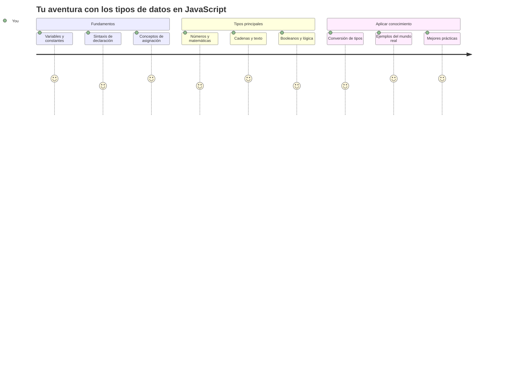
Los tipos de datos son uno de los conceptos fundamentales en JavaScript que encontrarás en cada programa que escribas. Piensa en los tipos de datos como el sistema de archivo que usaban los antiguos bibliotecarios en Alejandría: tenían lugares específicos para pergaminos que contenían poesía, matemáticas y registros históricos. JavaScript organiza la información de manera similar con diferentes categorías para distintos tipos de datos.

En esta lección, exploraremos los tipos de datos principales que hacen que JavaScript funcione. Aprenderás cómo manejar números, texto, valores verdadero/falso y entenderás por qué elegir el tipo correcto es esencial para tus programas. Estos conceptos pueden parecer abstractos al principio, pero con práctica, se volverán naturales.

Comprender los tipos de datos aclarará todo lo demás en JavaScript. Así como los arquitectos necesitan entender diferentes materiales antes de construir una catedral, estos fundamentos sostendrán todo lo que construyas en adelante.

## Cuestionario previo a la lección
[Cuestionario previo a la lección](https://ff-quizzes.netlify.app/web/)

Esta lección cubre los conceptos básicos de JavaScript, el lenguaje que proporciona interactividad en la web.

> ¡Puedes tomar esta lección en [Microsoft Learn](https://docs.microsoft.com/learn/modules/web-development-101-variables/?WT.mc_id=academic-77807-sagibbon)!

[](https://youtube.com/watch?v=JNIXfGiDWM8 "Variables en JavaScript")

[](https://youtube.com/watch?v=AWfA95eLdq8 "Tipos de datos en JavaScript")

> 🎥 Haz clic en las imágenes arriba para ver videos sobre variables y tipos de datos

¡Comencemos con las variables y los tipos de datos que las llenan!

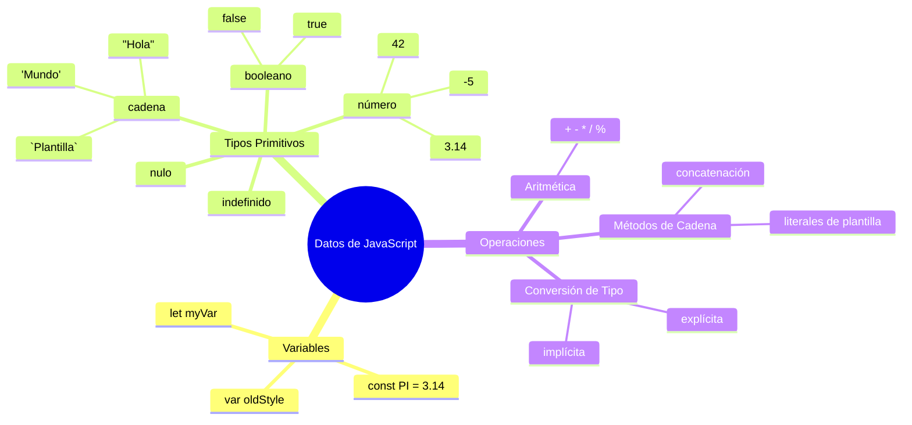
## Variables

Las variables son bloques de construcción fundamentales en la programación. Como los frascos etiquetados que los alquimistas medievales usaban para guardar diferentes sustancias, las variables te permiten almacenar información y darle un nombre descriptivo para que puedas referenciarla después. ¿Necesitas recordar la edad de alguien? Almacénala en una variable llamada `age`. ¿Quieres rastrear el nombre de un usuario? Guárdalo en una variable llamada `userName`.

Nos enfocaremos en el enfoque moderno para crear variables en JavaScript. Las técnicas que aprenderás aquí representan años de evolución del lenguaje y mejores prácticas desarrolladas por la comunidad de programación.

Crear y **declarar** una variable tiene la siguiente sintaxis **[keyword] [name]**. Se compone de dos partes:

- **Palabra clave (Keyword)**. Usa `let` para variables que pueden cambiar, o `const` para valores que permanecen iguales.
- **El nombre de la variable**, este es un nombre descriptivo que eliges tú mismo.

✅ La palabra clave `let` fue introducida en ES6 y da a tu variable un llamado _alcance de bloque_. Se recomienda usar `let` o `const` en lugar de la antigua palabra clave `var`. Cubriremos los alcances de bloque con más profundidad en partes futuras.

### Tarea - trabajando con variables

1. **Declara una variable**. Comencemos creando nuestra primera variable:

    ```javascript
    let myVariable;
    ```

   **Lo que esto logra:**
   - Esto indica a JavaScript que cree una ubicación de almacenamiento llamada `myVariable`
   - JavaScript asigna espacio en memoria para esta variable
   - La variable actualmente no tiene valor (undefined)

2. **Asígnale un valor**. Ahora pongamos algo en nuestra variable:

    ```javascript
    myVariable = 123;
    ```

   **Cómo funciona la asignación:**
   - El operador `=` asigna el valor 123 a nuestra variable
   - La variable ahora contiene este valor en lugar de estar indefinida
   - Puedes referenciar este valor en todo tu código usando `myVariable`

   > Nota: el uso de `=` en esta lección significa que utilizamos un "operador de asignación", usado para establecer un valor a una variable. No denota igualdad.

3. **Hazlo de la manera inteligente**. En realidad, combinemos esos dos pasos:

    ```javascript
    let myVariable = 123;
    ```

    **Este enfoque es más eficiente:**
    - Estás declarando la variable y asignando un valor en una sola declaración
    - Esta es la práctica estándar entre desarrolladores
    - Reduce la longitud del código mientras mantiene la claridad

4. **Cambia de opinión**. ¿Y si queremos almacenar un número diferente?

   ```javascript
   myVariable = 321;
   ```

   **Entendiendo la re-asignación:**
   - La variable ahora contiene 321 en lugar de 123
   - El valor anterior es reemplazado – las variables almacenan solo un valor a la vez
   - Esta mutabilidad es la característica clave de las variables declaradas con `let`

   ✅ ¡Pruébalo! Puedes escribir JavaScript directamente en tu navegador. Abre una ventana del navegador y navega a Herramientas de desarrollador. En la consola, encontrarás un prompt; escribe `let myVariable = 123`, presiona enter, luego escribe `myVariable`. ¿Qué pasa? Nota, aprenderás más sobre estos conceptos en lecciones siguientes.

### 🧠 **Chequeo de dominio sobre variables: Sentirse cómodo**

**Veamos cómo te sientes acerca de las variables:**
- ¿Puedes explicar la diferencia entre declarar y asignar una variable?
- ¿Qué sucede si intentas usar una variable antes de declararla?
- ¿Cuándo elegirías `let` en lugar de `const` para una variable?

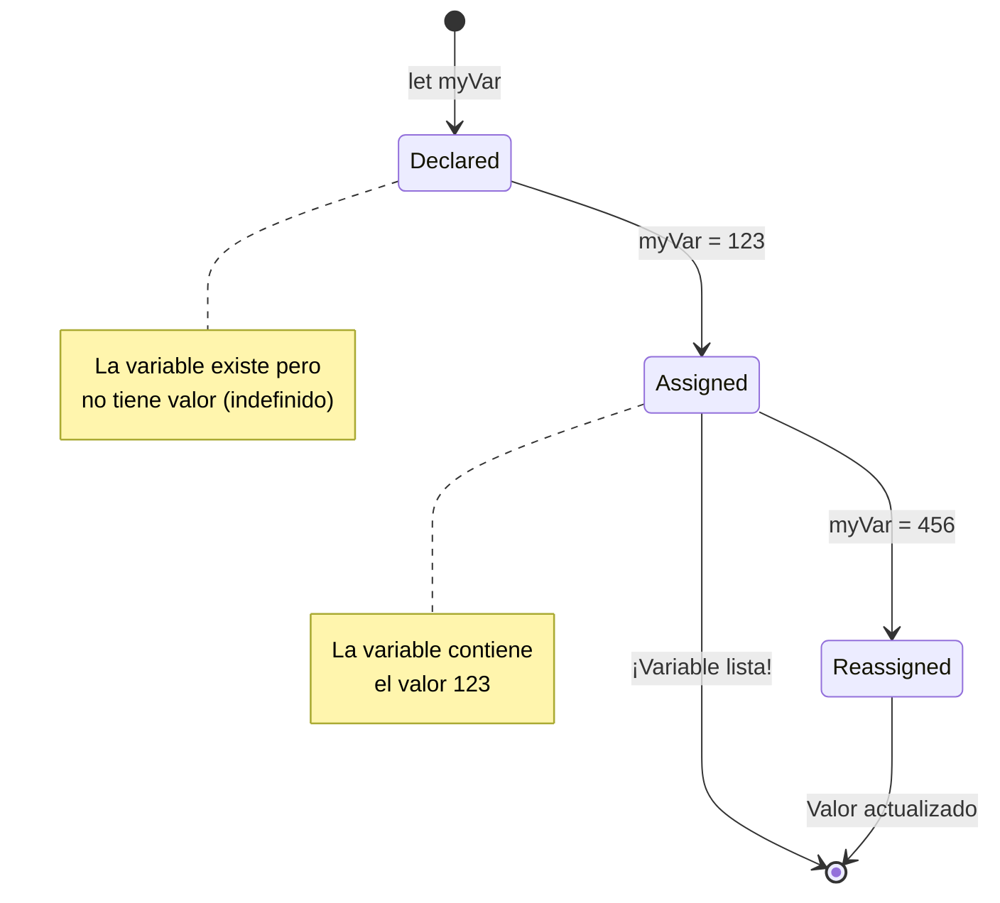
> **Consejo rápido**: Piensa en las variables como cajas de almacenamiento etiquetadas. Creas la caja (`let`), pones algo en ella (`=`), ¡y luego puedes reemplazar el contenido si es necesario!

## Constantes

A veces necesitas almacenar información que nunca debería cambiar durante la ejecución del programa. Piensa en las constantes como los principios matemáticos que Euclides estableció en la antigua Grecia – una vez probados y documentados, permanecieron fijos para referencia futura.

Las constantes funcionan de manera similar a las variables, pero con una restricción importante: una vez que asignas su valor, no puede cambiar. Esta inmutabilidad ayuda a prevenir modificaciones accidentales a valores críticos en tu programa.

La declaración e inicialización de una constante sigue los mismos conceptos que una variable, salvo que se usa la palabra clave `const`. Normalmente las constantes se declaran con todas las letras en mayúsculas.

```javascript
const MY_VARIABLE = 123;
```

**Esto es lo que hace este código:**
- **Crea** una constante llamada `MY_VARIABLE` con el valor 123
- **Usa** la convención de nombres en mayúsculas para constantes
- **Impide** cualquier cambio futuro a este valor

Las constantes tienen dos reglas principales:

- **Debes darle un valor de inmediato** – no se permiten constantes vacías
- **Nunca puedes cambiar ese valor** – JavaScript lanzará un error si lo intentas. Veamos a qué me refiero:

   **Valor simple** - Lo siguiente NO está permitido:
   
      ```javascript
      const PI = 3;
      PI = 4; // no permitido
      ```

   **Lo que necesitas recordar:**
   - **Los intentos** de re-asignar una constante causarán un error
   - **Protege** valores importantes de cambios accidentales
   - **Garantiza** que el valor permanezca consistente en tu programa
 
   **Referencia a objeto protegida** - Lo siguiente NO está permitido:
   
      ```javascript
      const obj = { a: 3 };
      obj = { b: 5 } // no permitido
      ```

   **Entendiendo estos conceptos:**
   - **Evita** reemplazar el objeto entero por uno nuevo
   - **Protege** la referencia al objeto original
   - **Mantiene** la identidad del objeto en memoria

    **El valor dentro del objeto no está protegido** - Lo siguiente SÍ está permitido:
    
      ```javascript
      const obj = { a: 3 };
      obj.a = 5;  // permitido
      ```

      **Desglosando lo que pasa aquí:**
      - **Modifica** el valor de la propiedad dentro del objeto
      - **Mantiene** la misma referencia al objeto
      - **Demuestra** que el contenido del objeto puede cambiar mientras la referencia permanece constante

   > Nota, un `const` significa que la referencia está protegida de re-asignación. El valor no es _inmutable_ y puede cambiar, especialmente si es una estructura compleja como un objeto.

## Tipos de datos

JavaScript organiza la información en diferentes categorías llamadas tipos de datos. Este concepto es paralelo a cómo los antiguos eruditos categorizaban el conocimiento – Aristóteles distinguía entre diferentes tipos de razonamiento, sabiendo que los principios lógicos no podían aplicarse uniformemente a la poesía, las matemáticas y la filosofía natural.

Los tipos de datos importan porque diferentes operaciones funcionan con diferentes tipos de información. Así como no puedes hacer aritmética con el nombre de una persona o alfabetizar una ecuación matemática, JavaScript requiere el tipo de dato apropiado para cada operación. Entender esto previene errores y hace tu código más fiable.

Las variables pueden almacenar muchos tipos diferentes de valores, como números y texto. Estos diversos tipos de valores se conocen como **tipo de dato**. Los tipos de datos son una parte importante del desarrollo de software porque ayudan a los desarrolladores a decidir cómo se debe escribir el código y cómo debe funcionar el software. Además, algunos tipos de datos tienen características únicas que ayudan a transformar o extraer información adicional de un valor.

✅ Los tipos de datos también son referidos como primitivas de datos de JavaScript, ya que son los tipos de datos de nivel más bajo proporcionados por el lenguaje. Hay 7 tipos de datos primitivos: string, number, bigint, boolean, undefined, null y symbol. Tómate un minuto para visualizar qué podría representar cada uno de estos primitivos. ¿Qué es una `cebra`? ¿Y `0`? ¿`true`?

### Números

Los números son el tipo de dato más directo en JavaScript. Ya sea que estés trabajando con números enteros como 42, decimales como 3.14 o números negativos como -5, JavaScript los maneja de forma uniforme.

¿Recuerdas nuestra variable de antes? Ese 123 que almacenamos era en realidad del tipo número:

```javascript
let myVariable = 123;
```

**Características clave:**
- JavaScript reconoce automáticamente los valores numéricos
- Puedes realizar operaciones matemáticas con estas variables
- No se requiere declarar el tipo explícitamente

Las variables pueden almacenar todo tipo de números, incluyendo decimales o negativos. Los números también pueden usarse con operadores aritméticos, cubiertos en la [sección siguiente](../../../../2-js-basics/1-data-types).

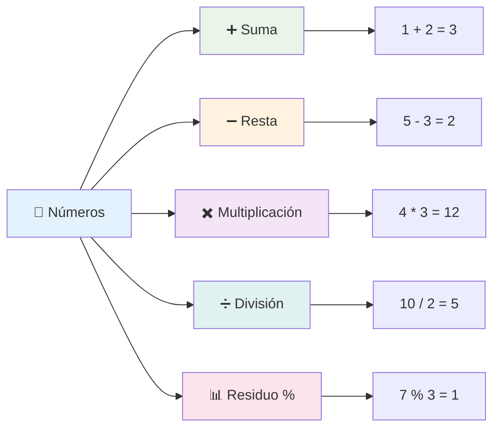
### Operadores aritméticos

Los operadores aritméticos te permiten realizar cálculos matemáticos en JavaScript. Estos operadores siguen los mismos principios que los matemáticos han usado por siglos – los mismos símbolos que aparecieron en las obras de eruditos como Al-Juarismi, quien desarrolló la notación algebraica.

Los operadores funcionan como esperarías en la matemática tradicional: más para suma, menos para resta, y así sucesivamente.

Hay varios tipos de operadores para usar al realizar funciones aritméticas, y algunos son listados aquí:

| Símbolo | Descripción                                                              | Ejemplo                          |
| ------ | ------------------------------------------------------------------------ | -------------------------------- |
| `+`    | **Adición**: Calcula la suma de dos números                              | `1 + 2 //respuesta esperada 3`   |
| `-`    | **Sustracción**: Calcula la diferencia de dos números                    | `1 - 2 //respuesta esperada -1`  |
| `*`    | **Multiplicación**: Calcula el producto de dos números                   | `1 * 2 //respuesta esperada 2`   |
| `/`    | **División**: Calcula el cociente de dos números                         | `1 / 2 //respuesta esperada 0.5` |
| `%`    | **Residuo**: Calcula el residuo de la división entre dos números         | `1 % 2 //respuesta esperada 1`   |

✅ ¡Pruébalo! Intenta una operación aritmética en la consola de tu navegador. ¿Te sorprenden los resultados?

### 🧮 **Chequeo de habilidades matemáticas: Calculando con confianza**

**Pon a prueba tu comprensión aritmética:**
- ¿Cuál es la diferencia entre `/` (división) y `%` (residuo)?
- ¿Puedes predecir qué valor tiene `10 % 3`? (Pista: no es 3.33...)
- ¿Por qué podría ser útil el operador residuo en programación?

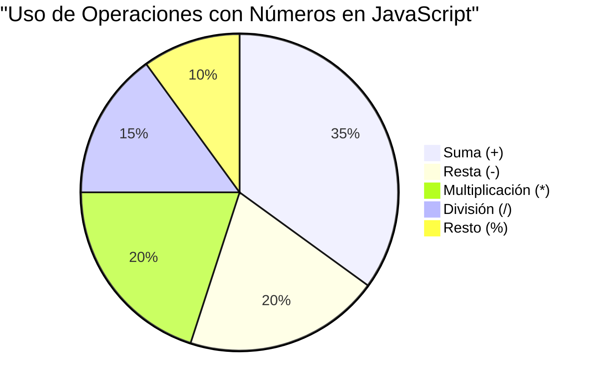
> **Perspectiva del mundo real**: El operador residuo (%) es súper útil para verificar si los números son pares/impares, crear patrones o recorrer arreglos cíclicamente.

### Cadenas (Strings)

En JavaScript, los datos textuales se representan como cadenas. El término "string" proviene del concepto de caracteres enlazados en secuencia, muy parecido a cómo los escribas en monasterios medievales unían letras para formar palabras y oraciones en sus manuscritos.

Las cadenas son fundamentales para el desarrollo web. Cada pieza de texto mostrada en un sitio web – nombres de usuario, etiquetas de botones, mensajes de error, contenido – se maneja como datos de tipo string. Entender las cadenas es esencial para crear interfaces funcionales.

Las cadenas son conjuntos de caracteres que residen entre comillas simples o dobles.

```javascript
'This is a string'
"This is also a string"
let myString = 'This is a string value stored in a variable';
```

**Entendiendo estos conceptos:**
- **Usa** comillas simples `'` o dobles `"` para definir cadenas
- **Almacena** datos de texto que pueden incluir letras, números y símbolos
- **Asigna** valores string a variables para uso posterior
- **Requiere** comillas para distinguir texto de nombres de variables

Recuerda usar comillas al escribir una cadena, o de lo contrario JavaScript asumirá que es un nombre de variable.

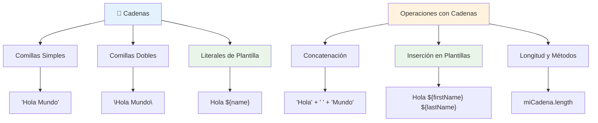
### Formateando cadenas

La manipulación de cadenas te permite combinar elementos de texto, incorporar variables y crear contenido dinámico que responde al estado del programa. Esta técnica te permite construir texto programáticamente.

A menudo necesitas unir varias cadenas juntas – este proceso se llama concatenación.
Para **concatenar** dos o más cadenas, o unirlas, usa el operador `+`.

```javascript
let myString1 = "Hello";
let myString2 = "World";

myString1 + myString2 + "!"; //¡HolaMundo!
myString1 + " " + myString2 + "!"; //¡Hola Mundo!
myString1 + ", " + myString2 + "!"; //¡Hola, Mundo!
```

**Paso a paso, esto es lo que sucede:**
- **Combina** múltiples cadenas usando el operador `+`
- **Une** cadenas directamente sin espacios en el primer ejemplo
- **Agrega** caracteres de espacio `" "` entre cadenas para legibilidad
- **Inserta** puntuación como comas para crear un formato apropiado

✅ ¿Por qué `1 + 1 = 2` en JavaScript, pero `'1' + '1' = 11`? Piénsalo. ¿Y `'1' + 1`?

**Los literales de plantilla** son otra forma de formatear cadenas, excepto que en lugar de comillas se utilizan las comillas invertidas (backticks). Cualquier cosa que no sea texto plano debe ir dentro de los marcadores `${ }`. Esto incluye cualquier variable que pueda ser una cadena.

```javascript
let myString1 = "Hello";
let myString2 = "World";

`${myString1} ${myString2}!` //¡Hola Mundo!
`${myString1}, ${myString2}!` //¡Hola, Mundo!
```

**Entendamos cada parte:**
- **Usa** comillas invertidas `` ` `` en lugar de comillas normales para crear literales de plantilla
- **Inserta** variables directamente usando la sintaxis `${}`
- **Preserva** espacios y formato exactamente como se escribe
- **Proporciona** una forma más limpia de crear cadenas complejas con variables

Puedes lograr tus objetivos de formato con cualquiera de los dos métodos, pero los literales de plantilla respetarán cualquier espacio y salto de línea.

✅ ¿Cuándo usarías un literal de plantilla frente a una cadena simple?

### 🔤 **Chequeo de Maestría de Cadenas: Confianza en Manipulación de Texto**

**Evalúa tus habilidades con cadenas:**
- ¿Puedes explicar por qué `'1' + '1'` es igual a `'11'` en lugar de `2`?
- ¿Qué método de cadenas te parece más legible: concatenación o literales de plantilla?
- ¿Qué pasa si olvidas las comillas alrededor de una cadena?

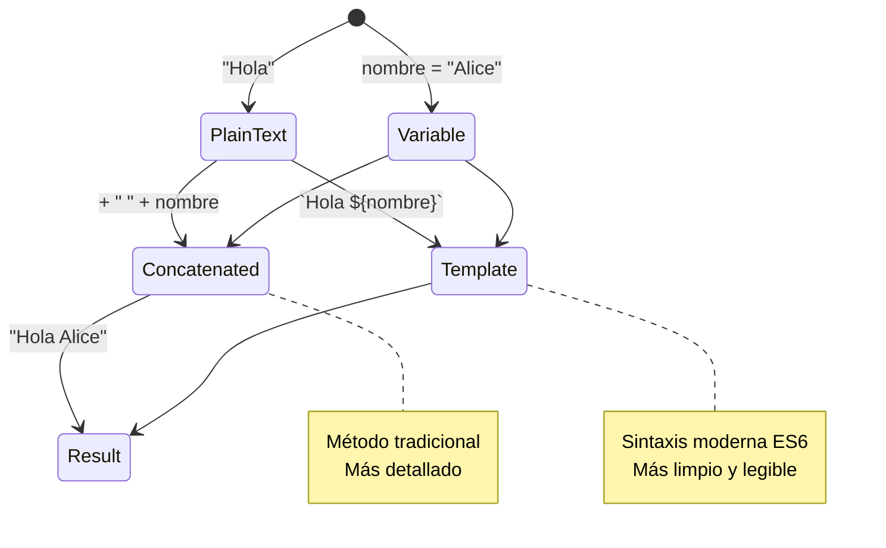
> **Consejo profesional**: Los literales de plantilla generalmente se prefieren para construir cadenas complejas porque son más legibles y manejan cadenas multilínea de manera hermosa.

### Booleanos

Los booleanos representan la forma más simple de datos: solo pueden tener uno de dos valores – `true` o `false`. Este sistema de lógica binaria se remonta al trabajo de George Boole, un matemático del siglo XIX que desarrolló el álgebra booleana.

A pesar de su simplicidad, los booleanos son esenciales para la lógica de los programas. Permiten que tu código tome decisiones basadas en condiciones – si un usuario ha iniciado sesión, si se hizo clic en un botón o si ciertos criterios se cumplen.

Los booleanos solo pueden tener dos valores: `true` o `false`. Los booleanos pueden ayudar a decidir qué líneas de código deben ejecutarse cuando se cumplen ciertas condiciones. En muchos casos, los [operadores](../../../../2-js-basics/1-data-types) ayudan a establecer el valor de un booleano y a menudo notarás y escribirás variables que se inicializan o actualizan con un operador.

```javascript
let myTrueBool = true;
let myFalseBool = false;
```

**En lo anterior, hemos:**
- **Creado** una variable que almacena el valor booleano `true`
- **Demostrado** cómo almacenar el valor booleano `false`
- **Usado** las palabras clave exactas `true` y `false` (sin comillas)
- **Preparado** estas variables para usarse en declaraciones condicionales

✅ Una variable puede considerarse ‘truthy’ si se evalúa como booleano `true`. Curiosamente, en JavaScript, [todos los valores son truthy a menos que se definan como falsy](https://developer.mozilla.org/docs/Glossary/Truthy).

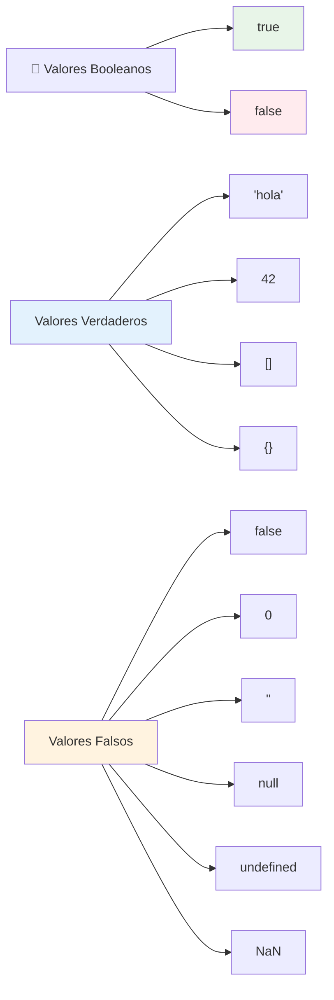
### 🎯 **Chequeo de Lógica Booleana: Habilidades para Tomar Decisiones**

**Pon a prueba tu comprensión de booleanos:**
- ¿Por qué crees que JavaScript tiene valores “truthy” y “falsy” además de solo `true` y `false`?
- ¿Puedes predecir cuál de estos es falsy: `0`, `"0"`, `[]`, `"false"`?
- ¿Cómo podrían ser útiles los booleanos para controlar el flujo del programa?

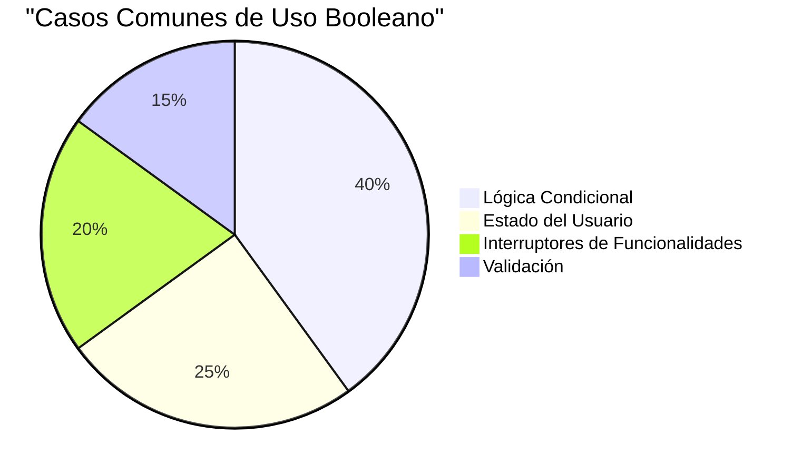
> **Recuerda**: En JavaScript, solo 6 valores son falsy: `false`, `0`, `""`, `null`, `undefined` y `NaN`. ¡Todo lo demás es truthy!

---

## 📊 **Resumen de tu Kit de Herramientas de Tipos de Datos**

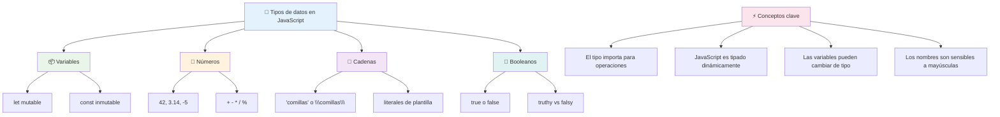
## Desafío de Agente GitHub Copilot 🚀

Usa el modo Agente para completar el siguiente desafío:

**Descripción:** Crea un administrador de información personal que demuestre todos los tipos de datos de JavaScript que has aprendido en esta lección manejando escenarios de datos del mundo real.

**Enunciado:** Construye un programa JavaScript que cree un objeto de perfil de usuario que contenga: el nombre de una persona (cadena), edad (número), estado de estudiante (booleano), colores favoritos como arreglo, y un objeto de dirección con propiedades de calle, ciudad y código postal. Incluye funciones para mostrar la información del perfil y actualizar campos individuales. Asegúrate de demostrar concatenación de cadenas, literales de plantilla, operaciones aritméticas con la edad y lógica booleana para el estado de estudiante.

Aprende más sobre el [modo agente](https://code.visualstudio.com/blogs/2025/02/24/introducing-copilot-agent-mode) aquí.

## 🚀 Desafío

JavaScript tiene ciertos comportamientos que pueden sorprender a los desarrolladores. Aquí hay un ejemplo clásico para explorar: intenta escribir esto en la consola de tu navegador: `let age = 1; let Age = 2; age == Age` y observa el resultado. Devuelve `false` – ¿puedes determinar por qué?

Esto representa uno de muchos comportamientos de JavaScript que vale la pena entender. La familiaridad con estas peculiaridades te ayudará a escribir código más confiable y a depurar problemas con mayor eficacia.

## Examen Post-Lección
[Examen post-lección](https://ff-quizzes.netlify.app)

## Repaso y Autoestudio

Consulta [esta lista de ejercicios de JavaScript](https://css-tricks.com/snippets/javascript/) y prueba uno. ¿Qué aprendiste?

## Tarea

[Práctica de Tipos de Datos](assignment.md)

## 🚀 Tu Cronograma de Maestría en Tipos de Datos de JavaScript

### ⚡ **Qué puedes hacer en los próximos 5 minutos**
- [ ] Abre la consola de tu navegador y crea 3 variables con diferentes tipos de datos
- [ ] Intenta el desafío: `let age = 1; let Age = 2; age == Age` y descubre por qué es falso
- [ ] Practica la concatenación de cadenas con tu nombre y número favorito
- [ ] Prueba qué pasa cuando sumas un número a una cadena

### 🎯 **Qué puedes lograr en esta hora**
- [ ] Completa el examen post-lección y repasa cualquier concepto confuso
- [ ] Crea una mini calculadora que sume, reste, multiplique y divida dos números
- [ ] Construye un formato simple de nombre usando literales de plantilla
- [ ] Explora las diferencias entre los operadores de comparación `==` y `===`
- [ ] Practica la conversión entre diferentes tipos de datos

### 📅 **Tu Fundamento de JavaScript para Toda la Semana**
- [ ] Completa la tarea con confianza y creatividad
- [ ] Crea un objeto de perfil personal usando todos los tipos de datos aprendidos
- [ ] Practica con [ejercicios de JavaScript de CSS-Tricks](https://css-tricks.com/snippets/javascript/)
- [ ] Crea un validador de formularios simple usando lógica booleana
- [ ] Experimenta con tipos de datos arreglo y objeto (vista previa de próximas lecciones)
- [ ] Únete a una comunidad de JavaScript y haz preguntas sobre tipos de datos

### 🌟 **Tu Transformación Mensual**
- [ ] Integra el conocimiento de tipos de datos en proyectos de programación más grandes
- [ ] Entiende cuándo y por qué usar cada tipo de dato en aplicaciones reales
- [ ] Ayuda a otros principiantes a comprender los fundamentos de JavaScript
- [ ] Construye una pequeña aplicación que administre diferentes tipos de datos del usuario
- [ ] Explora conceptos avanzados de tipos de datos como coerción de tipos y igualdad estricta
- [ ] Contribuye a proyectos JavaScript de código abierto mejorando la documentación

### 🧠 **Chequeo Final de Maestría en Tipos de Datos**

**Celebra tu base en JavaScript:**
- ¿Qué tipo de dato te sorprendió más por su comportamiento?
- ¿Qué tan cómodo te sientes explicando variables versus constantes a un amigo?
- ¿Cuál es la cosa más interesante que descubriste sobre el sistema de tipos de JavaScript?
- ¿Qué aplicación del mundo real imaginas construir con estos fundamentos?

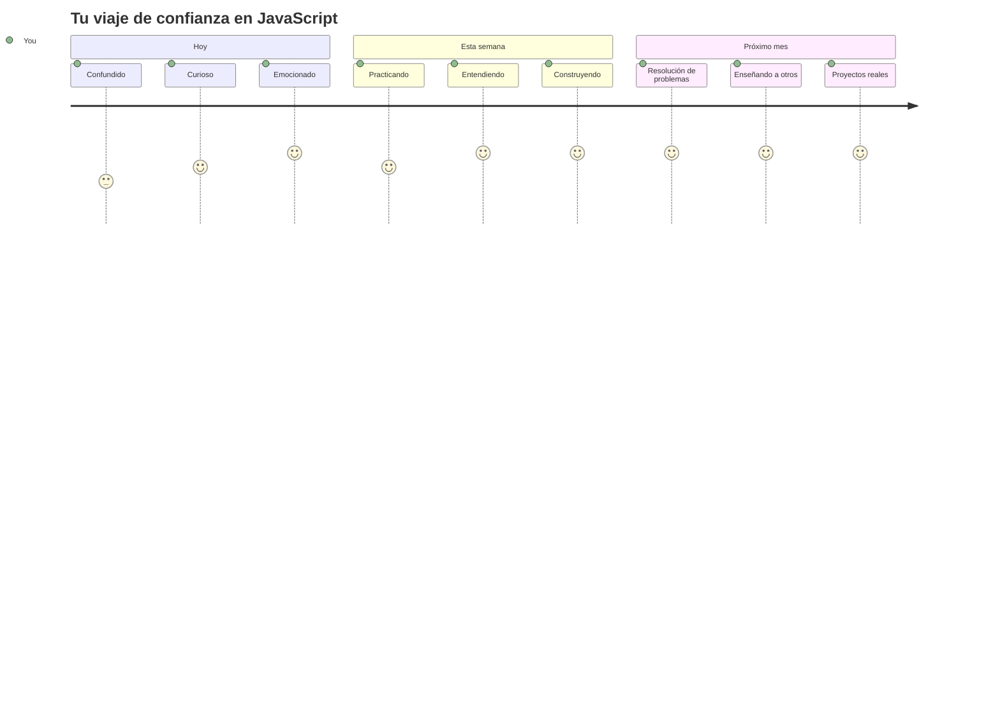
> 💡 **¡Has construido la base!** Entender los tipos de datos es como aprender el alfabeto antes de escribir historias. Cada programa en JavaScript que escribas usará estos conceptos fundamentales. Ahora tienes los bloques para crear sitios web interactivos, aplicaciones dinámicas y resolver problemas del mundo real con código. ¡Bienvenido al maravilloso mundo de JavaScript! 🎉

---

<!-- CO-OP TRANSLATOR DISCLAIMER START -->
**Aviso Legal**:
Este documento ha sido traducido utilizando el servicio de traducción automática [Co-op Translator](https://github.com/Azure/co-op-translator). Aunque nos esforzamos por la precisión, tenga en cuenta que las traducciones automáticas pueden contener errores o inexactitudes. El documento original en su idioma nativo debe considerarse la fuente autorizada. Para información crítica, se recomienda la traducción profesional realizada por humanos. No nos hacemos responsables de malentendidos o interpretaciones erróneas derivadas del uso de esta traducción.
<!-- CO-OP TRANSLATOR DISCLAIMER END -->