<!--
CO_OP_TRANSLATOR_METADATA:
{
  "original_hash": "71f7d7dafa1c7194d79ddac87f669ff9",
  "translation_date": "2026-01-06T07:11:44+00:00",
  "source_file": "2-js-basics/2-functions-methods/README.md",
  "language_code": "es"
}
-->
# Fundamentos de JavaScript: Métodos y Funciones

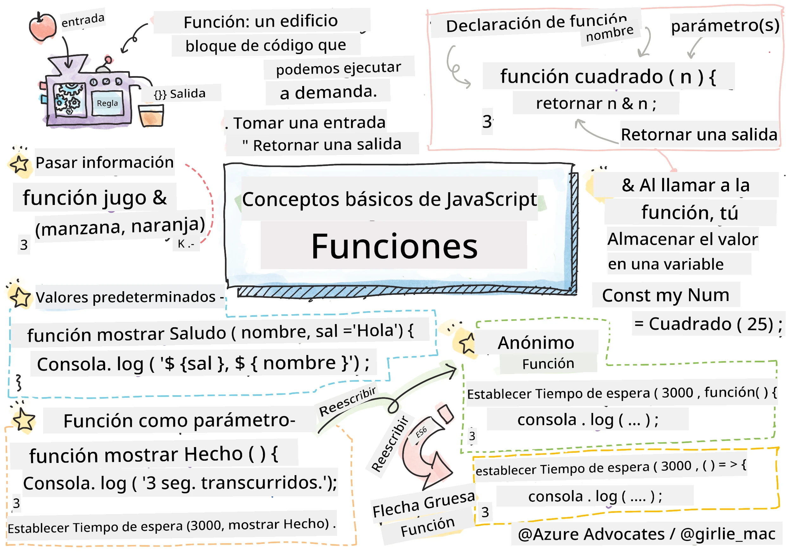
> Sketchnote por [Tomomi Imura](https://twitter.com/girlie_mac)

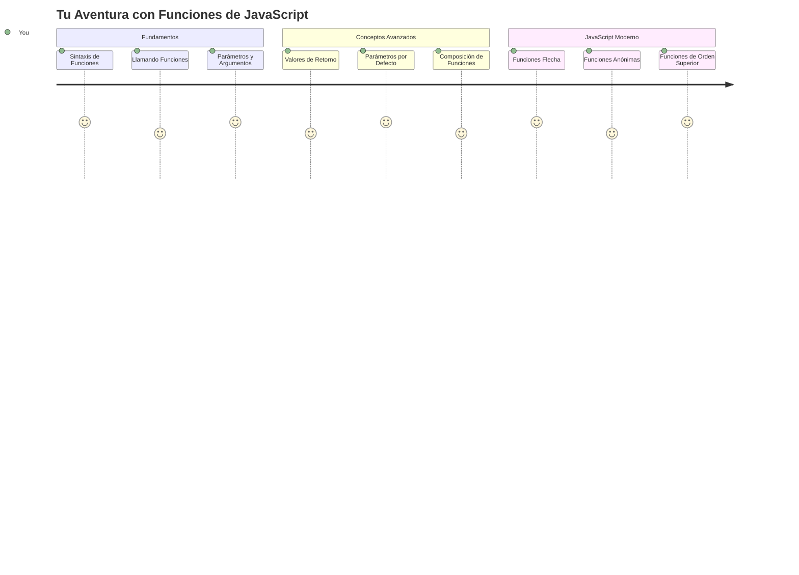
## Cuestionario Pre-Clase
[Cuestionario pre-clase](https://ff-quizzes.netlify.app)

Escribir el mismo código repetidamente es una de las frustraciones más comunes de la programación. Las funciones resuelven este problema al permitirte empaquetar código en bloques reutilizables. Piensa en las funciones como las partes estandarizadas que hicieron revolucionaria la línea de ensamblaje de Henry Ford: una vez que creas un componente confiable, puedes usarlo donde sea necesario sin reconstruir desde cero.

Las funciones te permiten agrupar fragmentos de código para que puedas reutilizarlos a lo largo de tu programa. En lugar de copiar y pegar la misma lógica en todas partes, puedes crear una función una vez y llamarla cuando la necesites. Este enfoque mantiene tu código organizado y facilita mucho las actualizaciones.

En esta lección, aprenderás a crear tus propias funciones, pasarles información y obtener resultados útiles. Descubrirás la diferencia entre funciones y métodos, conocerás enfoques modernos de sintaxis y verás cómo las funciones pueden trabajar con otras funciones. Construiremos estos conceptos paso a paso.

[](https://youtube.com/watch?v=XgKsD6Zwvlc "Methods and Functions")

> 🎥 Haz clic en la imagen de arriba para un video sobre métodos y funciones.

> Puedes tomar esta lección en [Microsoft Learn](https://docs.microsoft.com/learn/modules/web-development-101-functions/?WT.mc_id=academic-77807-sagibbon)!

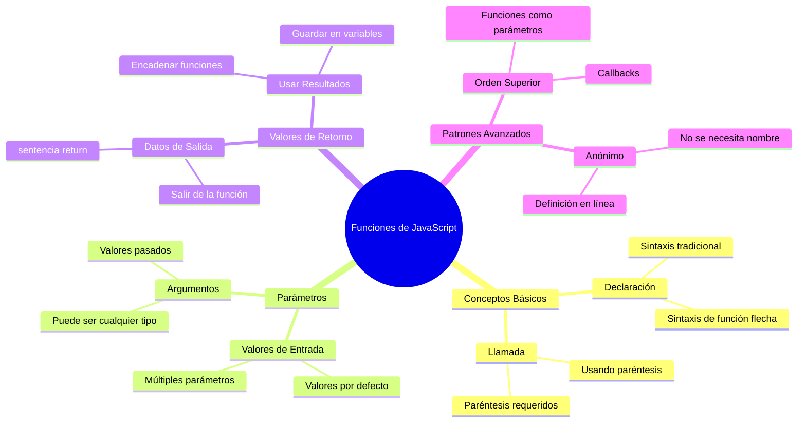
## Funciones

Una función es un bloque de código autónomo que realiza una tarea específica. Encapsula lógica que puedes ejecutar cuando sea necesario.

En lugar de escribir el mismo código múltiples veces a lo largo de tu programa, puedes empaquetarlo en una función y llamar a esa función cuando la necesites. Este enfoque mantiene tu código limpio y facilita mucho las actualizaciones. Considera el desafío que sería mantener la lógica si tuvieras que cambiarla en 20 lugares diferentes de tu base de código.

Nombrar tus funciones de forma descriptiva es esencial. Una función bien nombrada comunica su propósito claramente: cuando ves `cancelTimer()`, entiendes inmediatamente lo que hace, así como un botón claramente etiquetado te dice exactamente qué sucederá cuando lo presiones.

## Crear y llamar a una función

Examinemos cómo crear una función. La sintaxis sigue un patrón consistente:

```javascript
function nameOfFunction() { // definición de función
 // definición/cuerpo de la función
}
```

Desglosemos esto:
- La palabra clave `function` le dice a JavaScript "¡Oye, estoy creando una función!"
- `nameOfFunction` es donde le das a tu función un nombre descriptivo
- Los paréntesis `()` son donde puedes agregar parámetros (luego veremos esto)
- Las llaves `{}` contienen el código real que se ejecuta cuando llamas a la función

Vamos a crear una función simple de saludo para ver esto en acción:

```javascript
function displayGreeting() {
  console.log('Hello, world!');
}
```

Esta función imprime "Hello, world!" en la consola. Una vez que la defines, puedes usarla tantas veces como necesites.

Para ejecutar (o "llamar") tu función, escribe su nombre seguido de paréntesis. JavaScript te permite definir tu función antes o después de llamarla; el motor de JavaScript manejará el orden de ejecución.

```javascript
// llamando a nuestra función
displayGreeting();
```

Cuando ejecutas esta línea, se ejecuta todo el código dentro de tu función `displayGreeting`, mostrando "Hello, world!" en la consola de tu navegador. Puedes llamar esta función repetidamente.

### 🧠 **Chequeo de Fundamentos de Funciones: Construyendo tus Primeras Funciones**

**Veamos cómo te sientes respecto a funciones básicas:**
- ¿Puedes explicar por qué usamos llaves `{}` en las definiciones de funciones?
- ¿Qué sucede si escribes `displayGreeting` sin los paréntesis?
- ¿Por qué podrías querer llamar a la misma función varias veces?

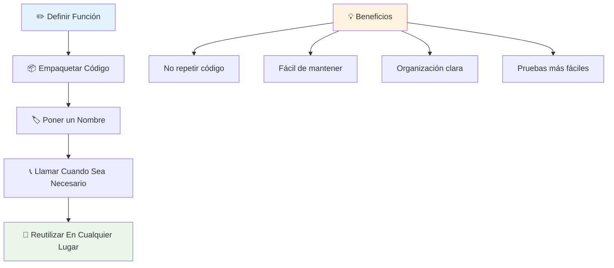
> **Nota:** Has estado usando **métodos** a lo largo de estas lecciones. `console.log()` es un método, esencialmente una función que pertenece al objeto `console`. La diferencia clave es que los métodos están ligados a objetos, mientras que las funciones son independientes. Muchos desarrolladores usan estos términos indistintamente en conversaciones casuales.

### Buenas prácticas para funciones

Aquí tienes algunos consejos para ayudarte a escribir funciones excelentes:

- Dale a tus funciones nombres claros y descriptivos; tu yo futuro te lo agradecerá.
- Usa **camelCase** para nombres de varias palabras (como `calculateTotal` en lugar de `calculate_total`)
- Mantén cada función enfocada en hacer una sola cosa bien

## Pasar información a una función

Nuestra función `displayGreeting` es limitada, solo puede mostrar "Hello, world!" para todos. Los parámetros nos permiten hacer que las funciones sean más flexibles y útiles.

Los **parámetros** actúan como marcadores de posición donde puedes insertar diferentes valores cada vez que usas la función. De esta forma, la misma función puede funcionar con información diferente en cada llamada.

Listas los parámetros dentro de los paréntesis al definir tu función, separando múltiples parámetros con comas:

```javascript
function name(param, param2, param3) {

}
```

Cada parámetro actúa como un marcador de posición: cuando alguien llama a tu función, proporciona valores reales que se insertan en esos lugares.

Actualicemos nuestra función de saludo para aceptar el nombre de alguien:

```javascript
function displayGreeting(name) {
  const message = `Hello, ${name}!`;
  console.log(message);
}
```

Fíjate cómo estamos usando las comillas invertidas (`` ` ``) y `${}` para insertar el nombre directamente en nuestro mensaje; esto se llama literal de plantilla, y es una forma muy útil de construir cadenas con variables mezcladas.

Ahora, cuando llamamos a nuestra función, podemos pasar cualquier nombre:

```javascript
displayGreeting('Christopher');
// muestra "¡Hola, Christopher!" cuando se ejecuta
```

JavaScript toma la cadena `'Christopher'`, la asigna al parámetro `name` y crea el mensaje personalizado "Hello, Christopher!"

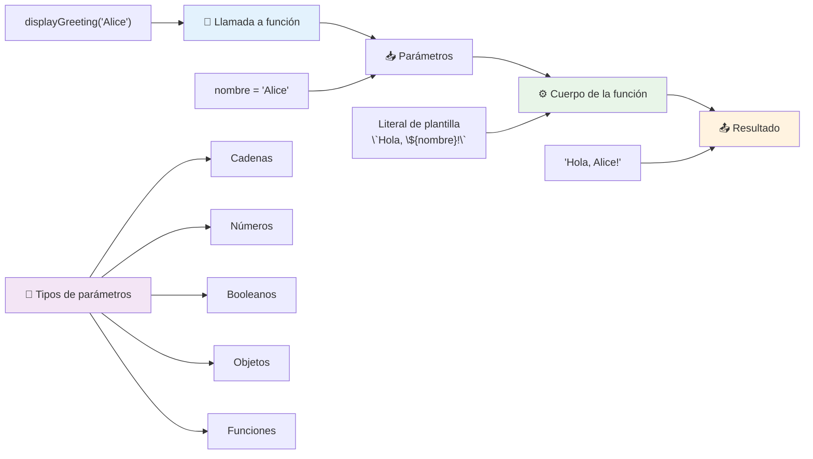
## Valores predeterminados

¿Qué pasa si queremos hacer que algunos parámetros sean opcionales? ¡Ahí es donde los valores predeterminados son útiles!

Digamos que queremos que las personas puedan personalizar la palabra de saludo, pero si no especifican una, simplemente usaremos "Hello" como valor por defecto. Puedes establecer valores predeterminados usando el signo igual, igual que al definir una variable:

```javascript
function displayGreeting(name, salutation='Hello') {
  console.log(`${salutation}, ${name}`);
}
```

Aquí, `name` sigue siendo obligatorio, pero `salutation` tiene un valor de respaldo `'Hello'` si nadie provee un saludo diferente.

Ahora podemos llamar a esta función de dos formas diferentes:

```javascript
displayGreeting('Christopher');
// muestra "Hola, Christopher"

displayGreeting('Christopher', 'Hi');
// muestra "Hola, Christopher"
```

En la primera llamada, JavaScript usa el "Hello" predeterminado porque no especificamos un saludo. En la segunda llamada, usa nuestro "Hi" personalizado. Esta flexibilidad hace que las funciones sean adaptables a diferentes escenarios.

### 🎛️ **Chequeo de Maestría en Parámetros: Haciendo Funciones Flexibles**

**Pon a prueba tu comprensión sobre parámetros:**
- ¿Cuál es la diferencia entre un parámetro y un argumento?
- ¿Por qué los valores predeterminados son útiles en programación real?
- ¿Puedes predecir qué ocurre si pasas más argumentos que parámetros?

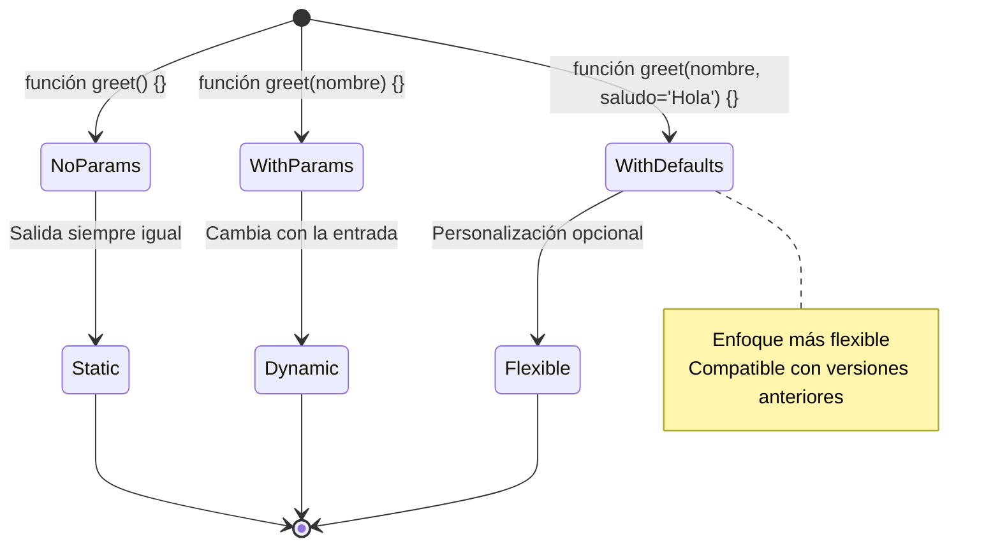
> **Consejo profesional**: Los parámetros predeterminados hacen que tus funciones sean más amigables para el usuario. Los usuarios pueden comenzar rápidamente con valores sensatos, pero aún personalizar cuando sea necesario.

## Valores de retorno

Nuestras funciones hasta ahora solo imprimían mensajes en la consola, pero ¿qué pasa si quieres que una función calcule algo y te devuelva el resultado?

Ahí es donde entran los **valores de retorno**. En lugar de solo mostrar algo, una función puede entregarte un valor que puedes almacenar en una variable o usar en otras partes de tu código.

Para enviar un valor de vuelta, usas la palabra clave `return` seguida de lo que quieres devolver:

```javascript
return myVariable;
```

Esto es algo importante: cuando una función encuentra una instrucción `return`, inmediatamente deja de ejecutarse y envía ese valor a quien la llamó.

Modifiquemos nuestra función de saludo para que devuelva el mensaje en lugar de imprimirlo:

```javascript
function createGreetingMessage(name) {
  const message = `Hello, ${name}`;
  return message;
}
```

Ahora, en lugar de imprimir el saludo, esta función crea el mensaje y lo devuelve.

Para usar el valor devuelto, podemos almacenarlo en una variable igual que cualquier otro valor:

```javascript
const greetingMessage = createGreetingMessage('Christopher');
```

Ahora `greetingMessage` contiene "Hello, Christopher" y podemos usarlo en cualquier lugar de nuestro código: mostrarlo en una página web, incluirlo en un correo o pasarlo a otra función.

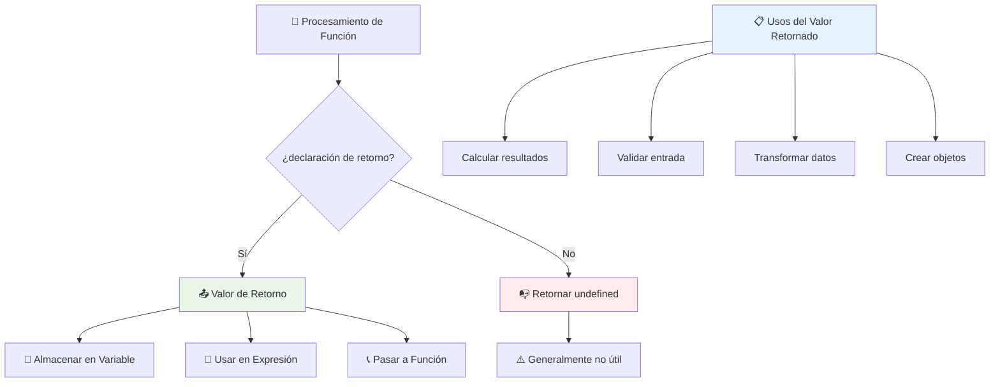
### 🔄 **Chequeo de Valores de Retorno: Obtener Resultados**

**Evalúa tu comprensión sobre valores de retorno:**
- ¿Qué pasa con el código después de una instrucción `return` en una función?
- ¿Por qué es mejor retornar valores en lugar de solo imprimir en consola?
- ¿Puede una función devolver diferentes tipos de valores (cadena, número, booleano)?

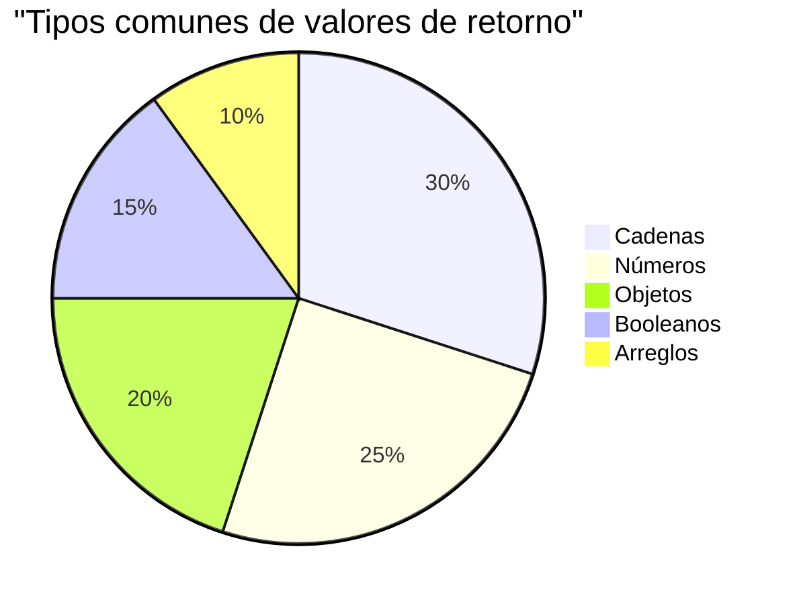
> **Insight clave**: Las funciones que devuelven valores son más versátiles porque quien llama decide qué hacer con el resultado. Esto hace tu código más modular y reutilizable.

## Funciones como parámetros para funciones

Las funciones pueden ser pasadas como parámetros a otras funciones. Aunque este concepto puede parecer complejo al principio, es una característica poderosa que permite patrones de programación flexibles.

Este patrón es muy común cuando quieres decir "cuando algo suceda, haz esta otra cosa". Por ejemplo, "cuando el temporizador termine, ejecuta este código" o "cuando el usuario haga clic en el botón, llama a esta función".

Veamos `setTimeout`, que es una función integrada que espera un cierto tiempo y luego ejecuta algún código. Tenemos que decirle qué código ejecutar, ¡perfecto para pasar una función!

Prueba este código: después de 3 segundos, verás un mensaje:

```javascript
function displayDone() {
  console.log('3 seconds has elapsed');
}
// el valor del temporizador está en milisegundos
setTimeout(displayDone, 3000);
```

Fíjate cómo pasamos `displayDone` (sin paréntesis) a `setTimeout`. No estamos llamando a la función nosotros mismos, estamos entregándola a `setTimeout` y diciendo "llama a esto en 3 segundos".

### Funciones anónimas

A veces necesitas una función para una sola cosa y no quieres darle un nombre. Piénsalo: si solo vas a usar una función una vez, ¿por qué saturar tu código con un nombre extra?

JavaScript te permite crear **funciones anónimas**: funciones sin nombre que puedes definir justo donde las necesitas.

Así podemos reescribir nuestro ejemplo del temporizador usando una función anónima:

```javascript
setTimeout(function() {
  console.log('3 seconds has elapsed');
}, 3000);
```

Esto logra el mismo resultado, pero la función está definida directamente dentro de la llamada `setTimeout`, eliminando la necesidad de una declaración de función separada.

### Funciones flecha

JavaScript moderno tiene una forma aún más corta de escribir funciones llamada **funciones flecha**. Usan `=>` (que parece una flecha – ¿ves?) y son muy populares entre los desarrolladores.

Las funciones flecha te permiten omitir la palabra clave `function` y escribir código más conciso.

Aquí nuestro ejemplo del temporizador usando una función flecha:

```javascript
setTimeout(() => {
  console.log('3 seconds has elapsed');
}, 3000);
```

Los `()` son donde irían los parámetros (vacíos en este caso), luego viene la flecha `=>` y finalmente el cuerpo de la función entre llaves. Esto proporciona la misma funcionalidad con una sintaxis más concisa.

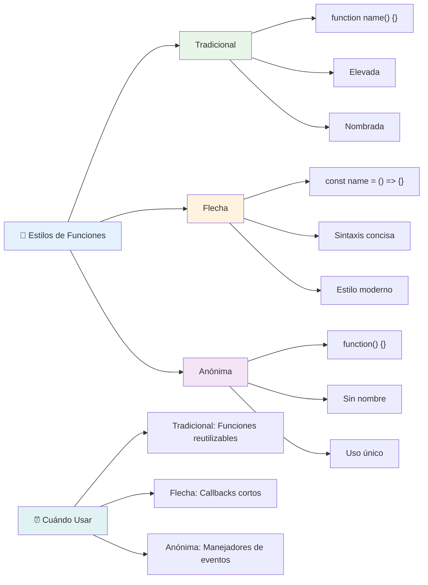
### Cuándo usar cada estrategia

¿Cuándo deberías usar cada enfoque? Una regla práctica: si vas a usar la función varias veces, dale un nombre y defínela por separado. Si es para un uso específico, considera una función anónima. Ambas, funciones flecha y la sintaxis tradicional, son opciones válidas, aunque las funciones flecha predominan en las bases de código modernas de JavaScript.

### 🎨 **Chequeo de Maestría en Estilos de Funciones: Elegir la Sintaxis Correcta**

**Pon a prueba tu comprensión de sintaxis:**
- ¿Cuándo podrías preferir funciones flecha sobre la sintaxis tradicional?
- ¿Cuál es la principal ventaja de las funciones anónimas?
- ¿Puedes pensar en una situación donde una función nombrada es mejor que una anónima?

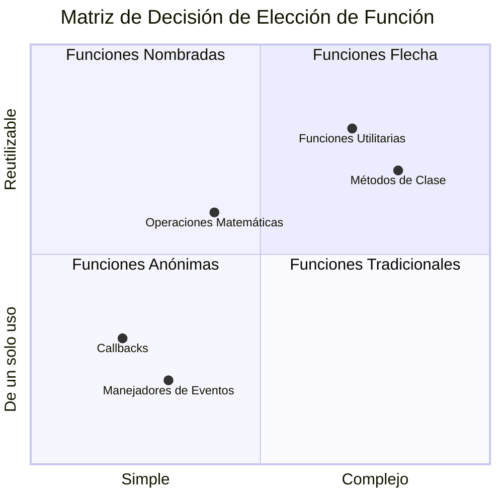
> **Tendencia moderna**: Las funciones flecha se están convirtiendo en la opción predeterminada para muchos desarrolladores debido a su sintaxis concisa, pero las funciones tradicionales aún tienen su lugar.

---


## 🚀 Desafío

¿Puedes articular en una oración la diferencia entre funciones y métodos? ¡Inténtalo!

## Desafío del Agente GitHub Copilot 🚀

Usa el modo Agente para completar el siguiente desafío:

**Descripción:** Crea una biblioteca de utilidades matemáticas que demuestre diferentes conceptos de funciones cubiertos en esta lección, incluyendo parámetros, valores predeterminados, valores de retorno y funciones flecha.

**Indicaciones:** Crea un archivo JavaScript llamado `mathUtils.js` que contenga las siguientes funciones:
1. Una función `add` que tome dos parámetros y devuelva su suma
2. Una función `multiply` con valores de parámetro predeterminados (el segundo parámetro predeterminado a 1)
3. Una función flecha `square` que tome un número y devuelva su cuadrado
4. Una función `calculate` que acepte otra función como parámetro y dos números, luego aplique la función a esos números
5. Demuestra la llamada a cada función con casos de prueba apropiados

Aprende más sobre [modo agente](https://code.visualstudio.com/blogs/2025/02/24/introducing-copilot-agent-mode) aquí.

## Cuestionario Post-Clase
[Cuestionario post-clase](https://ff-quizzes.netlify.app)

## Repaso y Autoestudio

Vale la pena [leer un poco más sobre funciones flecha](https://developer.mozilla.org/docs/Web/JavaScript/Reference/Functions/Arrow_functions), ya que se usan cada vez más en las bases de código. Practica escribir una función y luego reescribirla con esta sintaxis.

## Tarea

[Diviértete con las Funciones](assignment.md)

---

## 🧰 **Resumen de tu Kit de Herramientas de Funciones en JavaScript**

```mermaid
graph TD
    A["🎯 Funciones de JavaScript"] --> B["📋 Declaración de Función"]
    A --> C["📥 Parámetros"]
    A --> D["📤 Valores de Retorno"]
    A --> E["🎨 Sintaxis Moderna"]
    
    B --> B1["function nombre() {}"]
    B --> B2["Nomenclatura descriptiva"]
    B --> B3["Bloques de código reutilizables"]
    
    C --> C1["Datos de entrada"]
    C --> C2["Valores por defecto"]
    C --> C3["Múltiples parámetros"]
    
    D --> D1["instrucción return"]
    D --> D2["Salida de función"]
    D --> D3["Devolver datos"]
    
    E --> E1["Funciones flecha: () =>"]
    E --> E2["Funciones anónimas"]
    E --> E3["Funciones de orden superior"]
    
    F["⚡ Beneficios clave"] --> F1["Reutilización de código"]
    F --> F2["Mejor organización"]
    F --> F3["Pruebas más fáciles"]
    F --> F4["Diseño modular"]
    
    style A fill:#e3f2fd
    style B fill:#e8f5e8
    style C fill:#fff3e0
    style D fill:#f3e5f5
    style E fill:#e0f2f1
    style F fill:#fce4ec
```
---

## 🚀 Tu Cronograma de Maestría en Funciones de JavaScript

### ⚡ **Lo que Puedes Hacer en los Próximos 5 Minutos**
- [ ] Escribir una función simple que devuelva tu número favorito
- [ ] Crear una función con dos parámetros que los sume juntos
- [ ] Intenta convertir una función tradicional a la sintaxis de función flecha
- [ ] Practica el desafío: explica la diferencia entre funciones y métodos

### 🎯 **Lo que puedes lograr en esta hora**
- [ ] Completa el cuestionario posterior a la lección y revisa cualquier concepto confuso
- [ ] Construye la biblioteca de utilidades matemáticas del desafío de GitHub Copilot
- [ ] Crea una función que use otra función como parámetro
- [ ] Practica escribir funciones con parámetros por defecto
- [ ] Experimenta con literales de plantilla en valores de retorno de funciones

### 📅 **Tu dominio de funciones en una semana**
- [ ] Completa la tarea "Diversión con funciones" con creatividad
- [ ] Refactoriza algún código repetitivo que hayas escrito en funciones reutilizables
- [ ] Construye una calculadora pequeña usando solo funciones (sin variables globales)
- [ ] Practica funciones flecha con métodos de arreglos como `map()` y `filter()`
- [ ] Crea una colección de funciones utilitarias para tareas comunes
- [ ] Estudia funciones de orden superior y conceptos de programación funcional

### 🌟 **Tu transformación en un mes**
- [ ] Domina conceptos avanzados de funciones como cierres y alcance
- [ ] Construye un proyecto que use fuertemente la composición de funciones
- [ ] Contribuye al código abierto mejorando la documentación de funciones
- [ ] Enseña a alguien más sobre funciones y diferentes estilos de sintaxis
- [ ] Explora paradigmas de programación funcional en JavaScript
- [ ] Crea una biblioteca personal de funciones reutilizables para futuros proyectos

### 🏆 **Revisión final del campeón de funciones**

**Celebra tu dominio de las funciones:**
- ¿Cuál es la función más útil que has creado hasta ahora?
- ¿Cómo ha cambiado tu forma de pensar sobre la organización del código el aprendizaje sobre funciones?
- ¿Qué sintaxis de función prefieres y por qué?
- ¿Qué problema del mundo real resolverías escribiendo una función?

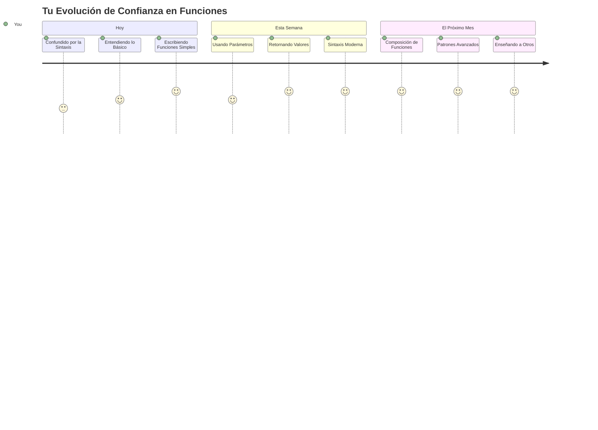
> 🎉 **¡Has dominado uno de los conceptos más poderosos de la programación!** Las funciones son los bloques de construcción de programas más grandes. Cada aplicación que construyas usará funciones para organizar, reutilizar y estructurar el código. Ahora entiendes cómo empaquetar lógica en componentes reutilizables, haciéndote un programador más eficiente y efectivo. ¡Bienvenido al mundo de la programación modular! 🚀

---

<!-- CO-OP TRANSLATOR DISCLAIMER START -->
**Aviso Legal**:
Este documento ha sido traducido utilizando el servicio de traducción automática [Co-op Translator](https://github.com/Azure/co-op-translator). Aunque nos esforzamos por lograr precisión, tenga en cuenta que las traducciones automáticas pueden contener errores o inexactitudes. El documento original en su idioma nativo debe considerarse la fuente autorizada. Para información crítica, se recomienda una traducción profesional realizada por humanos. No nos hacemos responsables por malentendidos o interpretaciones erróneas derivadas del uso de esta traducción.
<!-- CO-OP TRANSLATOR DISCLAIMER END -->