<!--
CO_OP_TRANSLATOR_METADATA:
{
  "original_hash": "c688385d15dd3645e924ea0ffee8967f",
  "translation_date": "2026-01-06T07:15:56+00:00",
  "source_file": "2-js-basics/3-making-decisions/README.md",
  "language_code": "es"
}
-->
# Conceptos Básicos de JavaScript: Tomando Decisiones

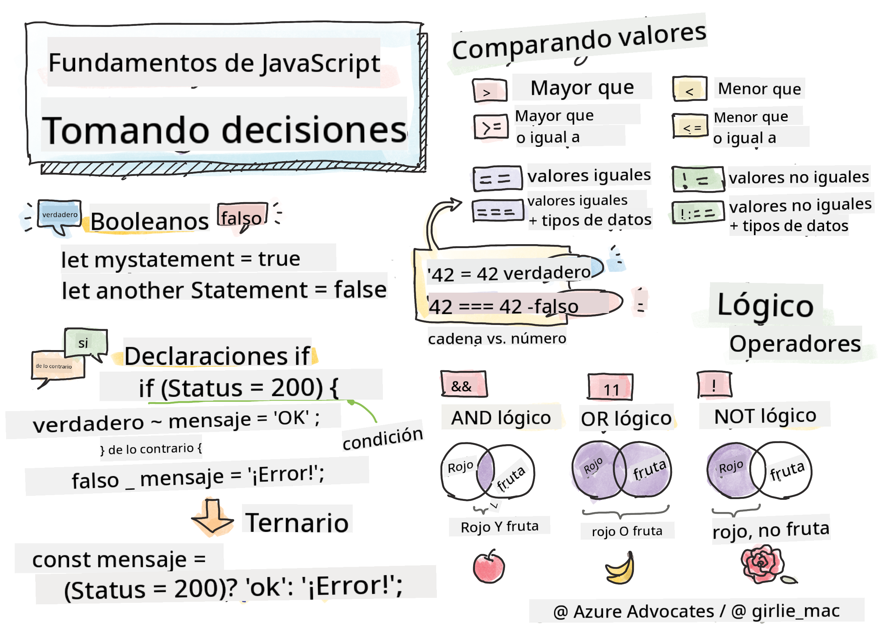

> Sketchnote por [Tomomi Imura](https://twitter.com/girlie_mac)

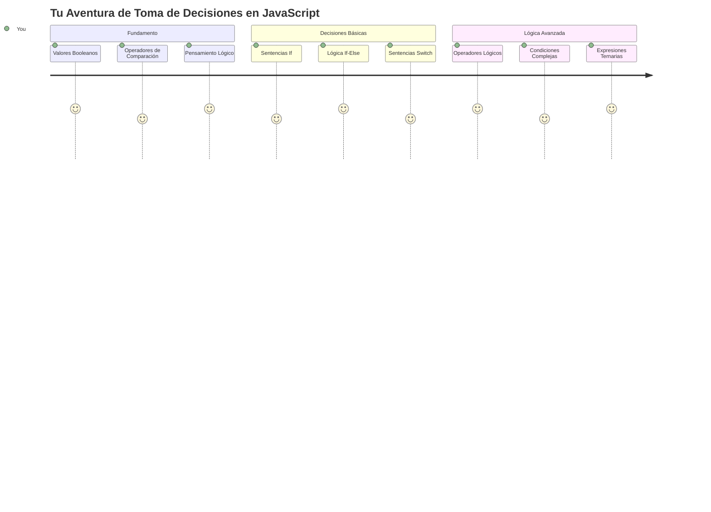
¿Alguna vez te has preguntado cómo las aplicaciones toman decisiones inteligentes? Como cómo un sistema de navegación elige la ruta más rápida, o cómo un termostato decide cuándo encender la calefacción. Este es el concepto fundamental de toma de decisiones en programación.

Así como la Máquina Analítica de Charles Babbage fue diseñada para seguir diferentes secuencias de operaciones basadas en condiciones, los programas modernos de JavaScript necesitan tomar decisiones basadas en circunstancias cambiantes. Esta capacidad de ramificar y tomar decisiones es lo que transforma el código estático en aplicaciones inteligentes y sensibles.

En esta lección, aprenderás cómo implementar lógica condicional en tus programas. Exploraremos sentencias condicionales, operadores de comparación y expresiones lógicas que permiten a tu código evaluar situaciones y responder adecuadamente.

## Cuestionario Previo a la Lección

[Cuestionario previo a la lección](https://ff-quizzes.netlify.app/web/quiz/11)

La capacidad de tomar decisiones y controlar el flujo del programa es un aspecto fundamental de la programación. Esta sección cubre cómo controlar la ruta de ejecución de tus programas JavaScript usando valores Booleanos y lógica condicional.

[](https://youtube.com/watch?v=SxTp8j-fMMY "Making Decisions")

> 🎥 Haz clic en la imagen de arriba para un video sobre la toma de decisiones.

> ¡Puedes tomar esta lección en [Microsoft Learn](https://docs.microsoft.com/learn/modules/web-development-101-if-else/?WT.mc_id=academic-77807-sagibbon)!

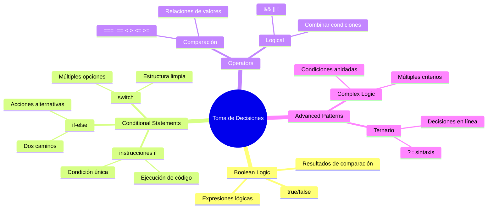
## Un Breve Repaso sobre Booleanos

Antes de explorar la toma de decisiones, repasemos los valores Booleanos de nuestra lección anterior. Llamados así por el matemático George Boole, estos valores representan estados binarios – o `true` o `false`. No hay ambigüedad, no hay un término medio.

Estos valores binarios forman la base de toda lógica computacional. Cada decisión que toma tu programa en última instancia se reduce a una evaluación Booleana.

Crear variables Booleanas es sencillo:

```javascript
let myTrueBool = true;
let myFalseBool = false;
```

Esto crea dos variables con valores Booleanos explícitos.

✅ Los booleanos llevan el nombre del matemático, filósofo y lógico inglés George Boole (1815–1864).

## Operadores de Comparación y Booleanos

En la práctica, rara vez asignarás manualmente valores Booleanos. En su lugar, los generarás evaluando condiciones: "¿Es este número mayor que aquel?" o "¿Son estos valores iguales?"

Los operadores de comparación permiten estas evaluaciones. Comparan valores y devuelven resultados Booleanos basados en la relación entre los operandos.

| Símbolo | Descripción                                                                                                                                                     | Ejemplo             |
| ------- | --------------------------------------------------------------------------------------------------------------------------------------------------------------- | ------------------- |
| `<`     | **Menor que**: Compara dos valores y devuelve el tipo de dato Booleano `true` si el valor a la izquierda es menor que el de la derecha                         | `5 < 6 // true`     |
| `<=`    | **Menor o igual que**: Compara dos valores y devuelve el tipo de dato Booleano `true` si el valor a la izquierda es menor o igual que el de la derecha          | `5 <= 6 // true`    |
| `>`     | **Mayor que**: Compara dos valores y devuelve el tipo de dato Booleano `true` si el valor a la izquierda es mayor que el de la derecha                         | `5 > 6 // false`    |
| `>=`    | **Mayor o igual que**: Compara dos valores y devuelve el tipo de dato Booleano `true` si el valor a la izquierda es mayor o igual que el de la derecha          | `5 >= 6 // false`   |
| `===`   | **Igualdad estricta**: Compara dos valores y devuelve el tipo de dato Booleano `true` si los valores de la derecha y la izquierda son iguales Y del mismo tipo. | `5 === 6 // false`  |
| `!==`   | **Desigualdad**: Compara dos valores y devuelve el valor Booleano opuesto al que devolvería un operador de igualdad estricta                                   | `5 !== 6 // true`   |

✅ Comprueba tu conocimiento escribiendo algunas comparaciones en la consola de tu navegador. ¿Te sorprende alguno de los valores devueltos?

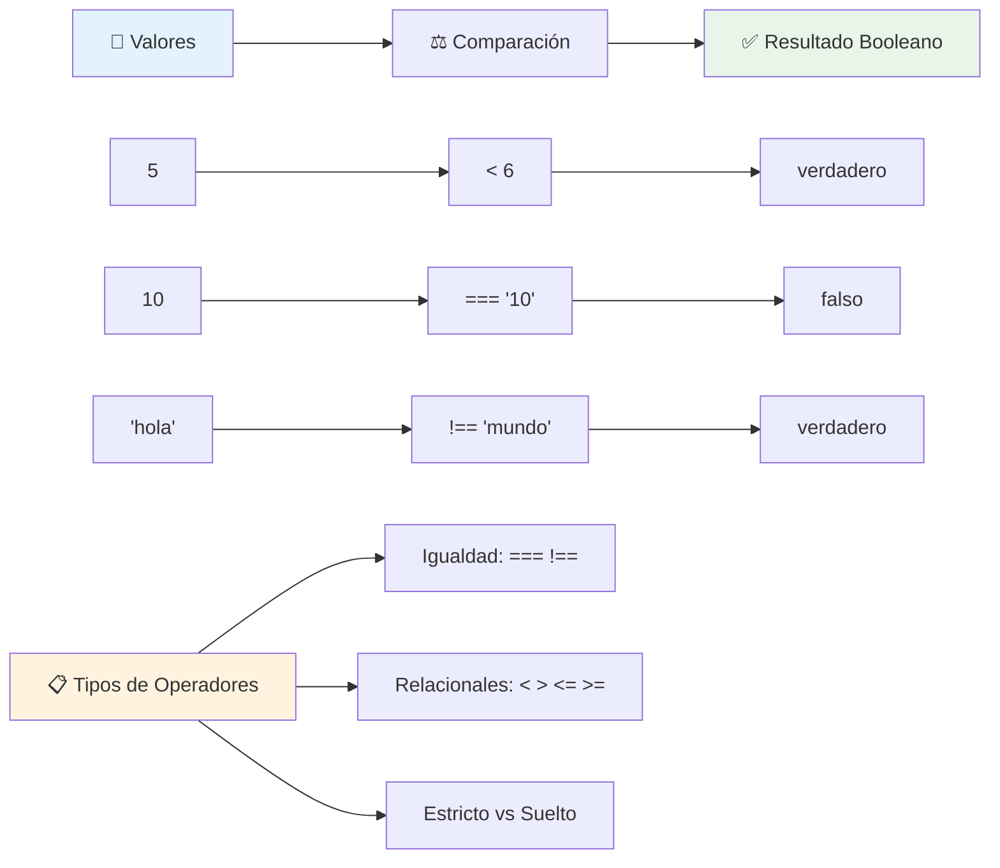
### 🧠 **Chequeo de Dominio de Comparaciones: Entendiendo la Lógica Booleana**

**Pon a prueba tu comprensión de comparaciones:**
- ¿Por qué crees que `===` (igualdad estricta) se prefiere generalmente sobre `==` (igualdad laxa)?
- ¿Puedes predecir qué devuelve `5 === '5'`? ¿Y `5 == '5'`?
- ¿Cuál es la diferencia entre `!==` y `!=`?

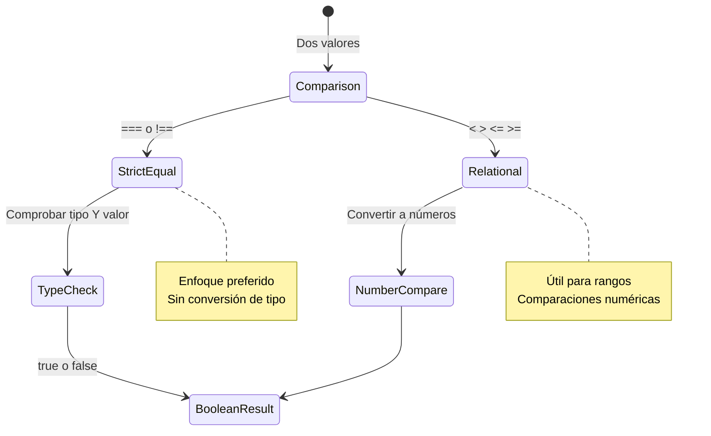
> **Consejo profesional**: Siempre usa `===` y `!==` para comparaciones de igualdad a menos que específicamente necesites conversión de tipo. ¡Esto previene comportamientos inesperados!

## Sentencia If

La sentencia `if` es como hacer una pregunta en tu código. "Si esta condición es verdadera, entonces haz esto." Probablemente es la herramienta más importante que usarás para tomar decisiones en JavaScript.

Así funciona:

```javascript
if (condition) {
  // La condición es verdadera. El código en este bloque se ejecutará.
}
```

La condición va dentro de los paréntesis, y si es `true`, JavaScript ejecuta el código dentro de las llaves. Si es `false`, JavaScript simplemente salta ese bloque completo.

A menudo usarás operadores de comparación para crear estas condiciones. Veamos un ejemplo práctico:

```javascript
let currentMoney = 1000;
let laptopPrice = 800;

if (currentMoney >= laptopPrice) {
  // La condición es verdadera. El código en este bloque se ejecutará.
  console.log("Getting a new laptop!");
}
```

Como `1000 >= 800` se evalúa a `true`, el código dentro del bloque se ejecuta, mostrando "¡Consiguiendo una laptop nueva!" en la consola.

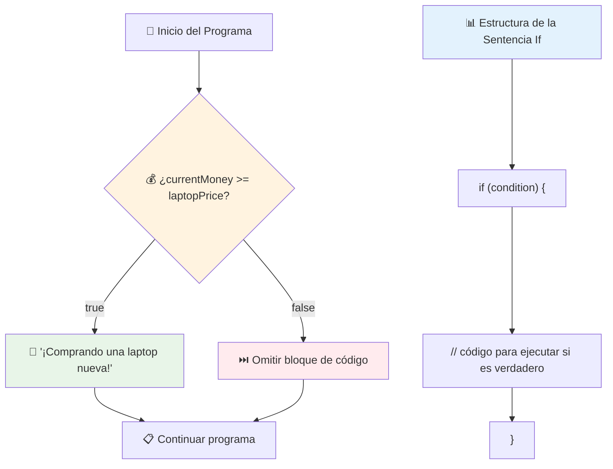
## Sentencia If..Else

¿Pero qué pasa si quieres que tu programa haga algo diferente cuando la condición es falsa? Ahí es donde entra `else` – es como tener un plan de respaldo.

La sentencia `else` te da una forma de decir "si esta condición no es verdadera, haz esta otra cosa en su lugar."

```javascript
let currentMoney = 500;
let laptopPrice = 800;

if (currentMoney >= laptopPrice) {
  // La condición es verdadera. El código en este bloque se ejecutará.
  console.log("Getting a new laptop!");
} else {
  // La condición es falsa. El código en este bloque se ejecutará.
  console.log("Can't afford a new laptop, yet!");
}
```

Ahora, dado que `500 >= 800` es `false`, JavaScript salta el primer bloque y ejecuta el bloque `else` en su lugar. Verás "¡No puedo permitirme una laptop nueva, todavía!" en la consola.

✅ Prueba tu comprensión de este código y el siguiente ejecutándolos en la consola de un navegador. Cambia los valores de las variables currentMoney y laptopPrice para modificar la salida de `console.log()`.

### 🎯 **Chequeo de Lógica If-Else: Caminos Ramificados**

**Evalúa tu comprensión de lógica condicional:**
- ¿Qué pasa si `currentMoney` es exactamente igual a `laptopPrice`?
- ¿Puedes pensar en un escenario del mundo real donde la lógica if-else sería útil?
- ¿Cómo podrías extender esto para manejar múltiples rangos de precio?

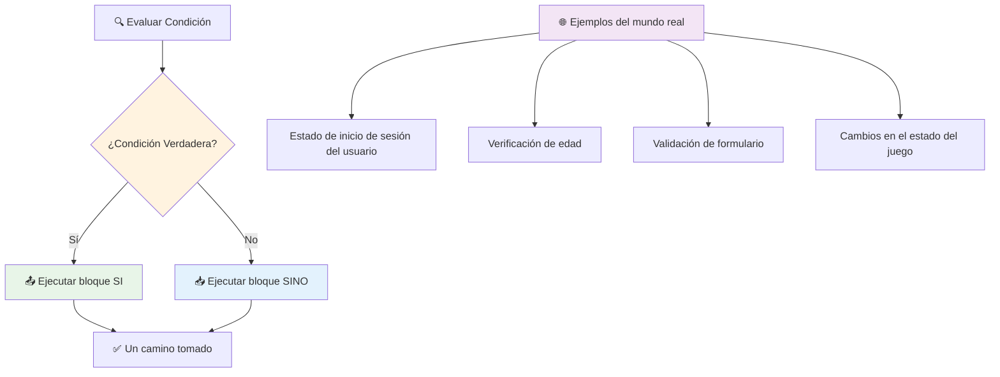
> **Perspectiva clave**: If-else garantiza que se tome exactamente un camino. ¡Esto asegura que tu programa siempre tiene una respuesta para cualquier condición!

## Sentencia Switch

A veces necesitas comparar un valor contra múltiples opciones. Mientras podrías encadenar varias sentencias `if..else`, este enfoque se vuelve difícil de manejar. La sentencia `switch` proporciona una estructura más limpia para manejar múltiples valores discretos.

El concepto se asemeja a los sistemas mecánicos de conmutación usados en los primeros intercambios telefónicos – un valor de entrada determina qué ruta específica seguirá la ejecución.

```javascript
switch (expression) {
  case x:
    // bloque de código
    break;
  case y:
    // bloque de código
    break;
  default:
    // bloque de código
}
```

Está estructurado así:
- JavaScript evalúa la expresión una vez
- Busca en cada `case` para encontrar una coincidencia
- Cuando encuentra una coincidencia, ejecuta ese bloque de código
- El `break` le dice a JavaScript que pare y salga del switch
- Si ningún caso coincide, ejecuta el bloque `default` (si tienes uno)

```javascript
// Programa usando la declaración switch para el día de la semana
let dayNumber = 2;
let dayName;

switch (dayNumber) {
  case 1:
    dayName = "Monday";
    break;
  case 2:
    dayName = "Tuesday";
    break;
  case 3:
    dayName = "Wednesday";
    break;
  default:
    dayName = "Unknown day";
    break;
}
console.log(`Today is ${dayName}`);
```

En este ejemplo, JavaScript ve que `dayNumber` es `2`, encuentra el `case 2` correspondiente, asigna "Tuesday" a `dayName`, y luego sale del switch. El resultado? "Today is Tuesday" se muestra en la consola.

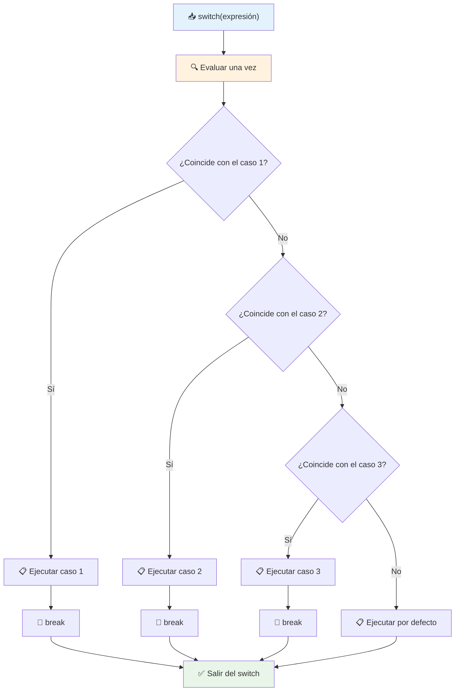
✅ Prueba tu comprensión de este código y el siguiente ejecutándolos en la consola de un navegador. Cambia el valor de la variable a para modificar la salida de `console.log()`.

### 🔄 **Dominio de la Sentencia Switch: Múltiples Opciones**

**Pon a prueba tu comprensión del switch:**
- ¿Qué pasa si olvidas un `break`?
- ¿Cuándo usarías `switch` en lugar de múltiples sentencias `if-else`?
- ¿Por qué es útil el caso `default` incluso si piensas que cubriste todas las posibilidades?

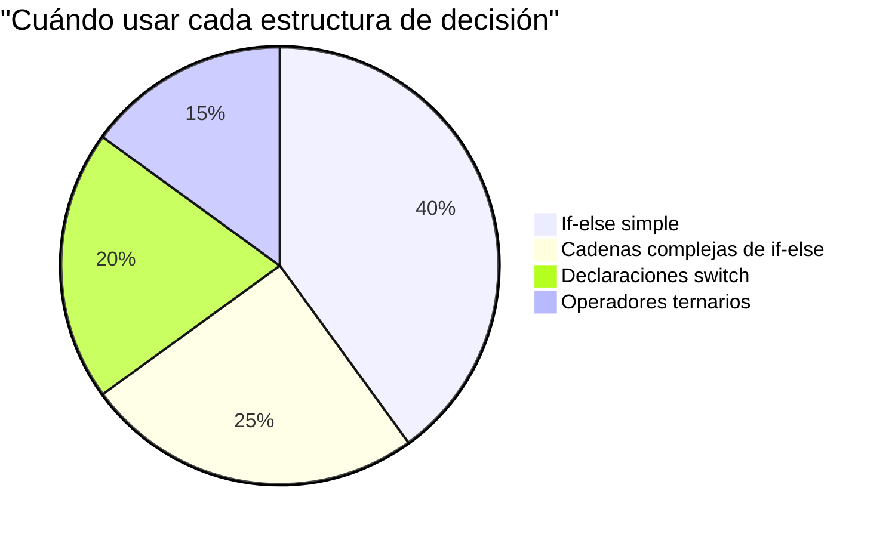
> **Mejor práctica**: Usa `switch` cuando compares una variable contra múltiples valores específicos. Usa `if-else` para rangos o condiciones complejas.

## Operadores Lógicos y Booleanos

Las decisiones complejas a menudo requieren evaluar múltiples condiciones simultáneamente. Así como el álgebra Booleana permite a los matemáticos combinar expresiones lógicas, la programación proporciona operadores lógicos para conectar múltiples condiciones Booleanas.

Estos operadores permiten lógica condicional sofisticada combinando evaluaciones simples de verdadero/falso.

| Símbolo | Descripción                                                                                      | Ejemplo                                                                |
| ------- | ------------------------------------------------------------------------------------------------ | ---------------------------------------------------------------------- |
| `&&`    | **AND lógico**: Compara dos expresiones Booleanas. Devuelve verdadero **solo** si ambos lados son verdaderos | `(5 > 3) && (5 < 10) // Ambos lados son verdaderos. Devuelve true`     |
| `\|\|`  | **OR lógico**: Compara dos expresiones Booleanas. Devuelve verdadero si al menos un lado es verdadero | `(5 > 10) \|\| (5 < 10) // Un lado es falso, otro verdadero. Devuelve true` |
| `!`     | **NOT lógico**: Devuelve el valor opuesto de una expresión Booleana                              | `!(5 > 10) // 5 no es mayor que 10, entonces "!" lo convierte en true` |

Estos operadores te permiten combinar condiciones de maneras útiles:
- AND (`&&`) significa que ambas condiciones deben ser verdaderas
- OR (`||`) significa que al menos una condición debe ser verdadera  
- NOT (`!`) invierte true a false (y viceversa)

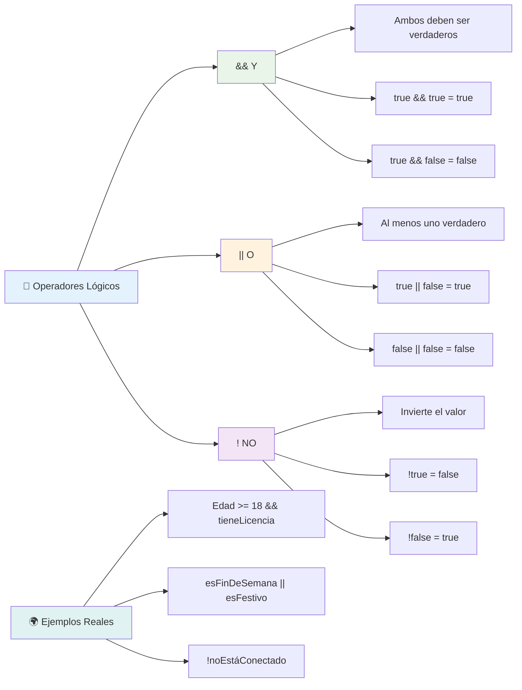
## Condiciones y Decisiones con Operadores Lógicos

Veamos estos operadores lógicos en acción con un ejemplo más realista:

```javascript
let currentMoney = 600;
let laptopPrice = 800;
let laptopDiscountPrice = laptopPrice - (laptopPrice * 0.2); // Precio del portátil con un 20 por ciento de descuento

if (currentMoney >= laptopPrice || currentMoney >= laptopDiscountPrice) {
  // La condición es verdadera. El código en este bloque se ejecutará.
  console.log("Getting a new laptop!");
} else {
  // La condición es falsa. El código en este bloque se ejecutará.
  console.log("Can't afford a new laptop, yet!");
}
```

En este ejemplo: calculamos un precio con descuento del 20% (640), luego evaluamos si nuestros fondos disponibles cubren el precio completo O el precio descontado. Como 600 no alcanza el umbral de precio descontado de 640, la condición se evalúa como falsa.

### 🧮 **Chequeo de Operadores Lógicos: Combinando Condiciones**

**Pon a prueba tu comprensión de operadores lógicos:**
- En la expresión `A && B`, ¿qué pasa si A es falso? ¿Se evalúa B?
- ¿Puedes pensar en una situación donde necesites usar los tres operadores (&&, ||, !) juntos?
- ¿Cuál es la diferencia entre `!user.isActive` y `user.isActive !== true`?

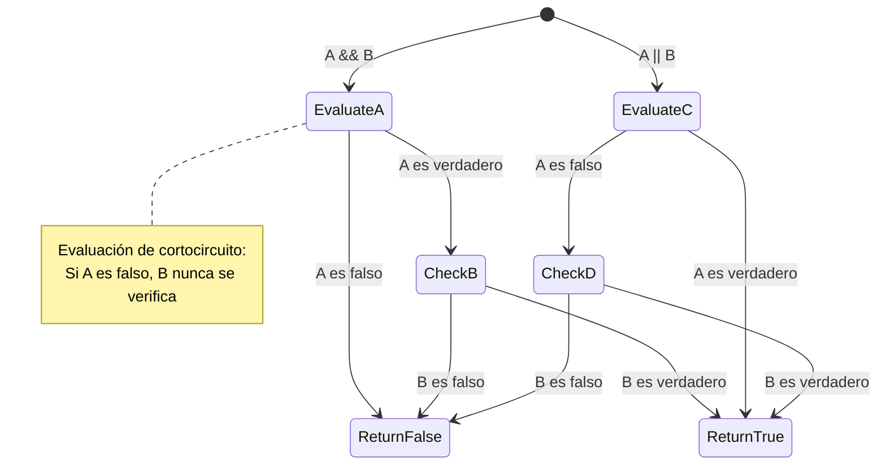
> **Consejo de rendimiento**: JavaScript usa "evaluación de corto circuito" - en `A && B`, si A es falso, B ni siquiera se evalúa. ¡Usa esto a tu favor!

### Operador de Negación

A veces es más fácil pensar en cuándo algo NO es verdadero. En vez de preguntar "¿El usuario está conectado?", podrías querer preguntar "¿El usuario NO está conectado?" El operador de exclamación (`!`) invierte la lógica por ti.

```javascript
if (!condition) {
  // se ejecuta si la condición es falsa
} else {
  // se ejecuta si la condición es verdadera
}
```

El operador `!` es como decir "lo opuesto de..." – si algo es `true`, `!` lo convierte en `false`, y viceversa.

### Expresiones Ternarias

Para asignaciones condicionales simples, JavaScript provee el **operador ternario**. Esta sintaxis concisa te permite escribir una expresión condicional en una sola línea, útil cuando necesitas asignar uno de dos valores según una condición.

```javascript
let variable = condition ? returnThisIfTrue : returnThisIfFalse;
```

Se lee como una pregunta: "¿Esta condición es verdadera? Si sí, usa este valor. Si no, usa aquel valor."

A continuación un ejemplo más tangible:

```javascript
let firstNumber = 20;
let secondNumber = 10;
let biggestNumber = firstNumber > secondNumber ? firstNumber : secondNumber;
```

✅ Tómate un minuto para leer este código varias veces. ¿Entiendes cómo funcionan estos operadores?

Esto es lo que dice esta línea: "¿`firstNumber` es mayor que `secondNumber`? Si sí, pon `firstNumber` en `biggestNumber`. Si no, pon `secondNumber` en `biggestNumber`."

El operador ternario es solo una forma más corta de escribir esta declaración tradicional `if..else`:

```javascript
let biggestNumber;
if (firstNumber > secondNumber) {
  biggestNumber = firstNumber;
} else {
  biggestNumber = secondNumber;
}
```

Ambos enfoques producen resultados idénticos. El operador ternario ofrece concisión, mientras que la estructura if-else tradicional puede ser más legible para condiciones complejas.

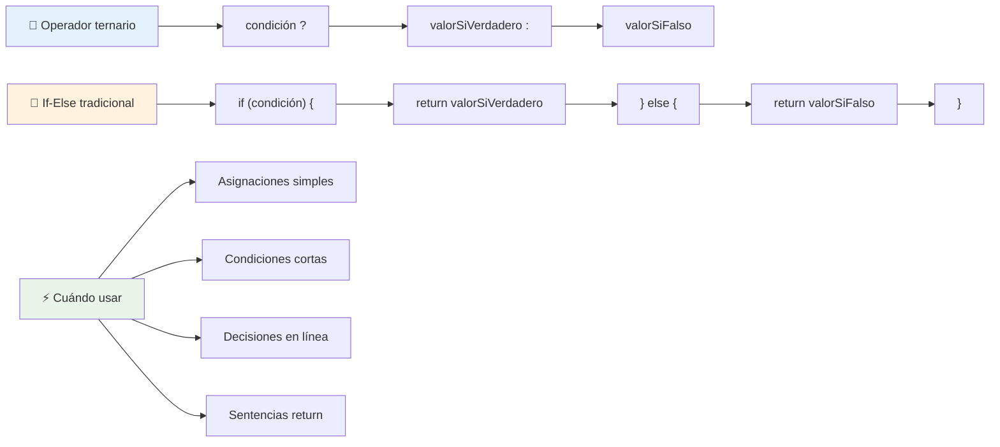
---


## 🚀 Desafío

Crea un programa que primero esté escrito con operadores lógicos, y luego réescribelo usando una expresión ternaria. ¿Cuál es tu sintaxis preferida?

---

## Desafío GitHub Copilot Agent 🚀

Usa el modo Agente para completar el siguiente desafío:

**Descripción:** Crea una calculadora de calificaciones completa que demuestre múltiples conceptos de toma de decisiones de esta lección, incluyendo sentencias if-else, sentencias switch, operadores lógicos y expresiones ternarias.

**Prompt:** Escribe un programa en JavaScript que tome la puntuación numérica de un estudiante (0-100) y determine su calificación letra usando los siguientes criterios:
- A: 90-100
- B: 80-89  
- C: 70-79
- D: 60-69
- F: Menor a 60

Requisitos:
1. Usa una sentencia if-else para determinar la calificación letra
2. Usa operadores lógicos para verificar si el estudiante aprueba (grade >= 60) Y tiene honores (grade >= 90)  
3. Usa una sentencia switch para proporcionar retroalimentación específica para cada calificación en letra  
4. Usa un operador ternario para determinar si el estudiante es elegible para el siguiente curso (grade >= 70)  
5. Incluye validación de entrada para asegurar que la puntuación esté entre 0 y 100  

Prueba tu programa con varias puntuaciones, incluyendo casos límite como 59, 60, 89, 90, y entradas inválidas.  

Aprende más sobre [el modo agente](https://code.visualstudio.com/blogs/2025/02/24/introducing-copilot-agent-mode) aquí.  


## Examen posterior a la clase  

[Examen posterior a la clase](https://ff-quizzes.netlify.app/web/quiz/12)  

## Revisión y autoestudio  

Lee más sobre los muchos operadores disponibles para el usuario [en MDN](https://developer.mozilla.org/docs/Web/JavaScript/Reference/Operators).  

¡Revisa el maravilloso [buscador de operadores](https://joshwcomeau.com/operator-lookup/) de Josh Comeau!  

## Tarea  

[Operadores](assignment.md)  

---

## 🧠 **Resumen de tu kit de herramientas para la toma de decisiones**  

```mermaid
graph TD
    A["🎯 Decisiones en JavaScript"] --> B["🔍 Lógica Booleana"]
    A --> C["📊 Sentencias Condicionales"]
    A --> D["🔗 Operadores Lógicos"]
    A --> E["⚡ Patrones Avanzados"]
    
    B --> B1["valores true/false"]
    B --> B2["Operadores de comparación"]
    B --> B3["Conceptos de veracidad"]
    
    C --> C1["sentencias if"]
    C --> C2["cadenas if-else"]
    C --> C3["sentencias switch"]
    
    D --> D1["&& (Y)"]
    D --> D2["|| (O)"]
    D --> D3["! (NO)"]
    
    E --> E1["Operador ternario"]
    E --> E2["Evaluación de corto circuito"]
    E --> E3["Condiciones complejas"]
    
    F["💡 Principios Clave"] --> F1["Condiciones claras y legibles"]
    F --> F2["Estilo de comparación consistente"]
    F --> F3["Precedencia adecuada de operadores"]
    F --> F4["Orden eficiente de evaluación"]
    
    style A fill:#e3f2fd
    style B fill:#e8f5e8
    style C fill:#fff3e0
    style D fill:#f3e5f5
    style E fill:#e0f2f1
    style F fill:#fce4ec
```  
---

## 🚀 Tu línea de tiempo para dominar la toma de decisiones en JavaScript  

### ⚡ **Lo que puedes hacer en los próximos 5 minutos**  
- [ ] Practica operadores de comparación en la consola de tu navegador  
- [ ] Escribe una declaración if-else simple que verifique tu edad  
- [ ] Intenta el desafío: reescribe un if-else usando un operador ternario  
- [ ] Prueba qué sucede con diferentes valores "truthy" y "falsy"  

### 🎯 **Lo que puedes lograr en esta hora**  
- [ ] Completa el examen posterior a la lección y repasa los conceptos confusos  
- [ ] Construye el calculador de notas completo del desafío de GitHub Copilot  
- [ ] Crea un árbol de decisiones simple para un escenario del mundo real (como elegir qué ropa usar)  
- [ ] Practica combinando múltiples condiciones con operadores lógicos  
- [ ] Experimenta con sentencias switch para diferentes casos de uso  

### 📅 **Tu dominio lógico para toda la semana**  
- [ ] Completa la tarea de operadores con ejemplos creativos  
- [ ] Construye una mini aplicación de cuestionario usando varias estructuras condicionales  
- [ ] Crea un validador de formularios que verifique múltiples condiciones de entrada  
- [ ] Practica los ejercicios del [buscador de operadores](https://joshwcomeau.com/operator-lookup/) de Josh Comeau  
- [ ] Refactoriza código existente para usar estructuras condicionales más apropiadas  
- [ ] Estudia la evaluación de corto circuito y las implicaciones en rendimiento  

### 🌟 **Tu transformación durante el mes**  
- [ ] Domina condiciones anidadas complejas y mantiene la legibilidad del código  
- [ ] Construye una aplicación con lógica de toma de decisiones sofisticada  
- [ ] Contribuye al código abierto mejorando la lógica condicional en proyectos existentes  
- [ ] Enseña a alguien más sobre las diferentes estructuras condicionales y cuándo usar cada una  
- [ ] Explora enfoques de programación funcional para lógica condicional  
- [ ] Crea una guía de referencia personal para las mejores prácticas condicionales  

### 🏆 **Chequeo final para campeón de la toma de decisiones**  

**Celebra tu dominio del pensamiento lógico:**  
- ¿Cuál es la lógica de decisión más compleja que has implementado con éxito?  
- ¿Qué estructura condicional te resulta más natural y por qué?  
- ¿Cómo ha cambiado tu enfoque para resolver problemas tras aprender sobre operadores lógicos?  
- ¿Qué aplicación del mundo real se beneficiaría de una lógica de toma de decisiones sofisticada?  

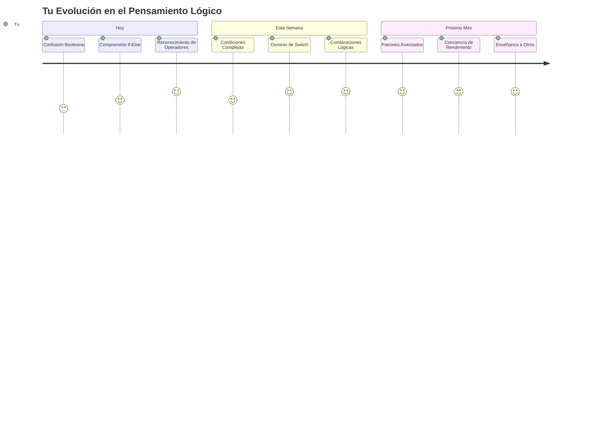
> 🧠 **¡Has dominado el arte de la toma de decisiones digitales!** Toda aplicación interactiva se basa en lógica condicional para responder inteligentemente a acciones del usuario y condiciones cambiantes. Ahora entiendes cómo hacer que tus programas piensen, evalúen y elijan respuestas apropiadas. ¡Esta base lógica impulsará cada aplicación dinámica que construyas! 🎉

---

<!-- CO-OP TRANSLATOR DISCLAIMER START -->
**Aviso legal**:
Este documento ha sido traducido utilizando el servicio de traducción automática [Co-op Translator](https://github.com/Azure/co-op-translator). Aunque nos esforzamos por la exactitud, tenga en cuenta que las traducciones automáticas pueden contener errores o inexactitudes. El documento original en su idioma nativo debe considerarse la fuente autorizada. Para información crítica, se recomienda traducción profesional humana. No nos hacemos responsables de ningún malentendido o interpretación errónea derivada del uso de esta traducción.
<!-- CO-OP TRANSLATOR DISCLAIMER END -->