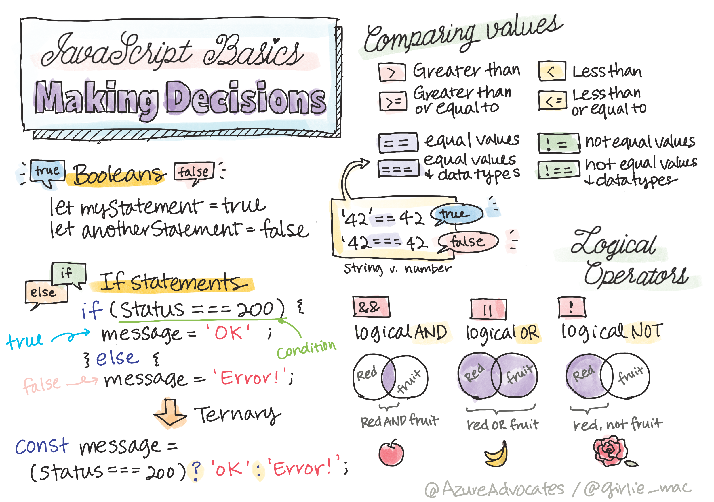

<!--
CO_OP_TRANSLATOR_METADATA:
{
  "original_hash": "f7009631b73556168ca435120a231c98",
  "translation_date": "2025-08-29T13:57:00+00:00",
  "source_file": "2-js-basics/3-making-decisions/README.md",
  "language_code": "es"
}
-->
# Conceptos básicos de JavaScript: Tomando decisiones



> Sketchnote por [Tomomi Imura](https://twitter.com/girlie_mac)

## Cuestionario previo a la clase

[Cuestionario previo a la clase](https://ff-quizzes.netlify.app/web/quiz/11)

Tomar decisiones y controlar el orden en el que se ejecuta tu código hace que este sea reutilizable y robusto. Esta sección cubre la sintaxis para controlar el flujo de datos en JavaScript y su importancia al usar tipos de datos Booleanos.

[](https://youtube.com/watch?v=SxTp8j-fMMY "Tomando decisiones")

> 🎥 Haz clic en la imagen de arriba para ver un video sobre cómo tomar decisiones.

> Puedes tomar esta lección en [Microsoft Learn](https://docs.microsoft.com/learn/modules/web-development-101-if-else/?WT.mc_id=academic-77807-sagibbon)!

## Un breve repaso sobre los Booleanos

Los Booleanos solo pueden tener dos valores: `true` o `false`. Los Booleanos ayudan a tomar decisiones sobre qué líneas de código deben ejecutarse cuando se cumplen ciertas condiciones.

Define tu Booleano como verdadero o falso de esta manera:

`let myTrueBool = true`  
`let myFalseBool = false`

✅ Los Booleanos llevan su nombre en honor al matemático, filósofo y lógico inglés George Boole (1815–1864).

## Operadores de comparación y Booleanos

Los operadores se utilizan para evaluar condiciones haciendo comparaciones que generarán un valor Booleano. A continuación, se muestra una lista de operadores que se usan con frecuencia.

| Símbolo | Descripción                                                                                                                                                   | Ejemplo            |
| ------- | ------------------------------------------------------------------------------------------------------------------------------------------------------------- | ------------------ |
| `<`     | **Menor que**: Compara dos valores y devuelve el valor Booleano `true` si el valor del lado izquierdo es menor que el del lado derecho                        | `5 < 6 // true`    |
| `<=`    | **Menor o igual que**: Compara dos valores y devuelve el valor Booleano `true` si el valor del lado izquierdo es menor o igual que el del lado derecho        | `5 <= 6 // true`   |
| `>`     | **Mayor que**: Compara dos valores y devuelve el valor Booleano `true` si el valor del lado izquierdo es mayor que el del lado derecho                        | `5 > 6 // false`   |
| `>=`    | **Mayor o igual que**: Compara dos valores y devuelve el valor Booleano `true` si el valor del lado izquierdo es mayor o igual que el del lado derecho        | `5 >= 6 // false`  |
| `===`   | **Igualdad estricta**: Compara dos valores y devuelve el valor Booleano `true` si los valores del lado derecho e izquierdo son iguales Y del mismo tipo de dato | `5 === 6 // false` |
| `!==`   | **Desigualdad**: Compara dos valores y devuelve el valor Booleano opuesto al que devolvería un operador de igualdad estricta                                  | `5 !== 6 // true`  |

✅ Pon a prueba tu conocimiento escribiendo algunas comparaciones en la consola de tu navegador. ¿Algún dato devuelto te sorprende?

## Declaración If

La declaración `if` ejecutará el código dentro de sus bloques si la condición es verdadera.

```javascript
if (condition) {
  //Condition is true. Code in this block will run.
}
```

Los operadores lógicos se utilizan frecuentemente para formar la condición.

```javascript
let currentMoney;
let laptopPrice;

if (currentMoney >= laptopPrice) {
  //Condition is true. Code in this block will run.
  console.log("Getting a new laptop!");
}
```

## Declaración If..Else

La declaración `else` ejecutará el código dentro de sus bloques cuando la condición sea falsa. Es opcional con una declaración `if`.

```javascript
let currentMoney;
let laptopPrice;

if (currentMoney >= laptopPrice) {
  //Condition is true. Code in this block will run.
  console.log("Getting a new laptop!");
} else {
  //Condition is false. Code in this block will run.
  console.log("Can't afford a new laptop, yet!");
}
```

✅ Pon a prueba tu comprensión de este código y del siguiente ejecutándolo en la consola de tu navegador. Cambia los valores de las variables `currentMoney` y `laptopPrice` para modificar el resultado de `console.log()`.

## Declaración Switch

La declaración `switch` se utiliza para realizar diferentes acciones según diferentes condiciones. Usa la declaración `switch` para seleccionar uno de varios bloques de código que se ejecutarán.

```javascript
switch (expression) {
  case x:
    // code block
    break;
  case y:
    // code block
    break;
  default:
  // code block
}
```

```javascript
// program using switch statement
let a = 2;

switch (a) {
  case 1:
    a = "one";
    break;
  case 2:
    a = "two";
    break;
  default:
    a = "not found";
    break;
}
console.log(`The value is ${a}`);
```

✅ Pon a prueba tu comprensión de este código y del siguiente ejecutándolo en la consola de tu navegador. Cambia los valores de la variable `a` para modificar el resultado de `console.log()`.

## Operadores lógicos y Booleanos

Las decisiones pueden requerir más de una comparación y pueden encadenarse con operadores lógicos para producir un valor Booleano.

| Símbolo | Descripción                                                                                     | Ejemplo                                                                 |
| ------- | ----------------------------------------------------------------------------------------------- | ----------------------------------------------------------------------- |
| `&&`    | **Lógico AND**: Compara dos expresiones Booleanas. Devuelve `true` **solo** si ambos lados son verdaderos | `(5 > 6) && (5 < 6 ) //Un lado es falso, el otro es verdadero. Devuelve false` |
| `\|\|`  | **Lógico OR**: Compara dos expresiones Booleanas. Devuelve `true` si al menos uno de los lados es verdadero | `(5 > 6) \|\| (5 < 6) //Un lado es falso, el otro es verdadero. Devuelve true` |
| `!`     | **Lógico NOT**: Devuelve el valor opuesto de una expresión Booleana                             | `!(5 > 6) // 5 no es mayor que 6, pero "!" devolverá true`              |

## Condiciones y decisiones con operadores lógicos

Los operadores lógicos pueden usarse para formar condiciones en declaraciones `if..else`.

```javascript
let currentMoney;
let laptopPrice;
let laptopDiscountPrice = laptopPrice - laptopPrice * 0.2; //Laptop price at 20 percent off

if (currentMoney >= laptopPrice || currentMoney >= laptopDiscountPrice) {
  //Condition is true. Code in this block will run.
  console.log("Getting a new laptop!");
} else {
  //Condition is true. Code in this block will run.
  console.log("Can't afford a new laptop, yet!");
}
```

### Operador de negación

Hasta ahora has visto cómo puedes usar una declaración `if...else` para crear lógica condicional. Todo lo que se incluye en un `if` necesita evaluarse como verdadero o falso. Usando el operador `!` puedes _negar_ la expresión. Se vería así:

```javascript
if (!condition) {
  // runs if condition is false
} else {
  // runs if condition is true
}
```

### Expresiones ternarias

`if...else` no es la única forma de expresar lógica de decisiones. También puedes usar algo llamado operador ternario. La sintaxis se ve así:

```javascript
let variable = condition ? <return this if true> : <return this if false>
```

A continuación, se muestra un ejemplo más tangible:

```javascript
let firstNumber = 20;
let secondNumber = 10;
let biggestNumber = firstNumber > secondNumber ? firstNumber : secondNumber;
```

✅ Tómate un minuto para leer este código varias veces. ¿Entiendes cómo funcionan estos operadores?

Lo anterior establece que:

- si `firstNumber` es mayor que `secondNumber`
- entonces asigna `firstNumber` a `biggestNumber`
- de lo contrario, asigna `secondNumber`.

La expresión ternaria es solo una forma compacta de escribir el siguiente código:

```javascript
let biggestNumber;
if (firstNumber > secondNumber) {
  biggestNumber = firstNumber;
} else {
  biggestNumber = secondNumber;
}
```

---

## 🚀 Desafío

Crea un programa que primero esté escrito con operadores lógicos y luego reescríbelo usando una expresión ternaria. ¿Cuál es tu sintaxis preferida?

---

## Cuestionario posterior a la clase

[Cuestionario posterior a la clase](https://ff-quizzes.netlify.app/web/quiz/12)

## Revisión y autoestudio

Lee más sobre los muchos operadores disponibles para el usuario [en MDN](https://developer.mozilla.org/docs/Web/JavaScript/Reference/Operators).

Revisa el maravilloso [buscador de operadores](https://joshwcomeau.com/operator-lookup/) de Josh Comeau.

## Tarea

[Operadores](assignment.md)

---

**Descargo de responsabilidad**:  
Este documento ha sido traducido utilizando el servicio de traducción automática [Co-op Translator](https://github.com/Azure/co-op-translator). Si bien nos esforzamos por lograr precisión, tenga en cuenta que las traducciones automáticas pueden contener errores o imprecisiones. El documento original en su idioma nativo debe considerarse como la fuente autorizada. Para información crítica, se recomienda una traducción profesional realizada por humanos. No nos hacemos responsables de malentendidos o interpretaciones erróneas que puedan surgir del uso de esta traducción.