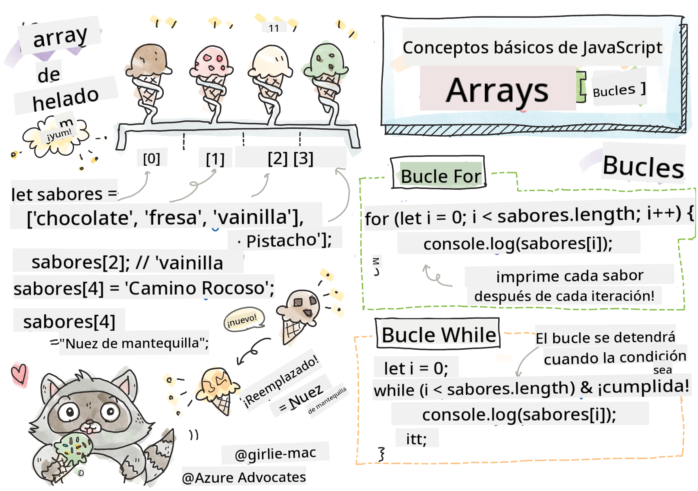

<!--
CO_OP_TRANSLATOR_METADATA:
{
  "original_hash": "9029f96b0e034839c1799f4595e4bb66",
  "translation_date": "2025-08-29T13:57:57+00:00",
  "source_file": "2-js-basics/4-arrays-loops/README.md",
  "language_code": "es"
}
-->
# Conceptos básicos de JavaScript: Arreglos y Bucles


> Sketchnote por [Tomomi Imura](https://twitter.com/girlie_mac)

## Cuestionario previo a la lección
[Cuestionario previo a la lección](https://ff-quizzes.netlify.app/web/quiz/13)

Esta lección cubre los conceptos básicos de JavaScript, el lenguaje que proporciona interactividad en la web. En esta lección, aprenderás sobre arreglos y bucles, que se utilizan para manipular datos.

[](https://youtube.com/watch?v=1U4qTyq02Xw "Arreglos")

[](https://www.youtube.com/watch?v=Eeh7pxtTZ3k "Bucles")

> 🎥 Haz clic en las imágenes de arriba para ver videos sobre arreglos y bucles.

> ¡Puedes tomar esta lección en [Microsoft Learn](https://docs.microsoft.com/learn/modules/web-development-101-arrays/?WT.mc_id=academic-77807-sagibbon)!

## Arreglos

Trabajar con datos es una tarea común en cualquier lenguaje, y es mucho más fácil cuando los datos están organizados en un formato estructurado, como los arreglos. Con los arreglos, los datos se almacenan en una estructura similar a una lista. Una gran ventaja de los arreglos es que puedes almacenar diferentes tipos de datos en un solo arreglo.

✅ ¡Los arreglos están en todas partes! ¿Puedes pensar en un ejemplo de la vida real de un arreglo, como un conjunto de paneles solares?

La sintaxis para un arreglo es un par de corchetes.

```javascript
let myArray = [];
```

Este es un arreglo vacío, pero los arreglos pueden declararse ya poblados con datos. Los valores múltiples en un arreglo están separados por una coma.

```javascript
let iceCreamFlavors = ["Chocolate", "Strawberry", "Vanilla", "Pistachio", "Rocky Road"];
```

Los valores del arreglo tienen un valor único llamado **índice**, un número entero que se asigna según su distancia desde el inicio del arreglo. En el ejemplo anterior, el valor de cadena "Chocolate" tiene un índice de 0, y el índice de "Rocky Road" es 4. Usa el índice con corchetes para recuperar, cambiar o insertar valores en el arreglo.

✅ ¿Te sorprende que los arreglos comiencen en el índice cero? En algunos lenguajes de programación, los índices comienzan en 1. Hay una historia interesante al respecto, que puedes [leer en Wikipedia](https://en.wikipedia.org/wiki/Zero-based_numbering).

```javascript
let iceCreamFlavors = ["Chocolate", "Strawberry", "Vanilla", "Pistachio", "Rocky Road"];
iceCreamFlavors[2]; //"Vanilla"
```

Puedes usar el índice para cambiar un valor, así:

```javascript
iceCreamFlavors[4] = "Butter Pecan"; //Changed "Rocky Road" to "Butter Pecan"
```

Y puedes insertar un nuevo valor en un índice dado de esta manera:

```javascript
iceCreamFlavors[5] = "Cookie Dough"; //Added "Cookie Dough"
```

✅ Una forma más común de agregar valores a un arreglo es utilizando operadores de arreglos como array.push()

Para saber cuántos elementos hay en un arreglo, usa la propiedad `length`.

```javascript
let iceCreamFlavors = ["Chocolate", "Strawberry", "Vanilla", "Pistachio", "Rocky Road"];
iceCreamFlavors.length; //5
```

✅ ¡Pruébalo tú mismo! Usa la consola de tu navegador para crear y manipular un arreglo de tu propia creación.

## Bucles

Los bucles nos permiten realizar tareas repetitivas o **iterativas**, y pueden ahorrar mucho tiempo y código. Cada iteración puede variar en sus variables, valores y condiciones. Hay diferentes tipos de bucles en JavaScript, y todos tienen pequeñas diferencias, pero esencialmente hacen lo mismo: recorrer datos.

### Bucle For

El bucle `for` requiere 3 partes para iterar:
- `contador` Una variable que generalmente se inicializa con un número que cuenta el número de iteraciones.
- `condición` Expresión que utiliza operadores de comparación para hacer que el bucle se detenga cuando sea `false`.
- `expresión de iteración` Se ejecuta al final de cada iteración, generalmente se usa para cambiar el valor del contador.
  
```javascript
// Counting up to 10
for (let i = 0; i < 10; i++) {
  console.log(i);
}
```

✅ Ejecuta este código en la consola de tu navegador. ¿Qué sucede cuando haces pequeños cambios al contador, la condición o la expresión de iteración? ¿Puedes hacer que funcione al revés, creando una cuenta regresiva?

### Bucle While

A diferencia de la sintaxis del bucle `for`, los bucles `while` solo requieren una condición que detendrá el bucle cuando la condición se vuelva `false`. Las condiciones en los bucles generalmente dependen de otros valores como contadores, y deben manejarse durante el bucle. Los valores iniciales para los contadores deben crearse fuera del bucle, y cualquier expresión para cumplir una condición, incluido el cambio del contador, debe mantenerse dentro del bucle.

```javascript
//Counting up to 10
let i = 0;
while (i < 10) {
 console.log(i);
 i++;
}
```

✅ ¿Por qué elegirías un bucle for en lugar de un bucle while? 17,000 usuarios tuvieron la misma pregunta en StackOverflow, y algunas de las opiniones [podrían interesarte](https://stackoverflow.com/questions/39969145/while-loops-vs-for-loops-in-javascript).

## Bucles y Arreglos

Los arreglos se usan a menudo con bucles porque la mayoría de las condiciones requieren la longitud del arreglo para detener el bucle, y el índice también puede ser el valor del contador.

```javascript
let iceCreamFlavors = ["Chocolate", "Strawberry", "Vanilla", "Pistachio", "Rocky Road"];

for (let i = 0; i < iceCreamFlavors.length; i++) {
  console.log(iceCreamFlavors[i]);
} //Ends when all flavors are printed
```

✅ Experimenta recorriendo un arreglo de tu propia creación en la consola de tu navegador.

---

## 🚀 Desafío

Existen otras formas de recorrer arreglos además de los bucles for y while. Hay [forEach](https://developer.mozilla.org/docs/Web/JavaScript/Reference/Global_Objects/Array/forEach), [for-of](https://developer.mozilla.org/docs/Web/JavaScript/Reference/Statements/for...of), y [map](https://developer.mozilla.org/docs/Web/JavaScript/Reference/Global_Objects/Array/map). Reescribe tu bucle de arreglo utilizando una de estas técnicas.

## Cuestionario posterior a la lección
[Cuestionario posterior a la lección](https://ff-quizzes.netlify.app/web/quiz/14)

## Repaso y autoestudio

Los arreglos en JavaScript tienen muchos métodos asociados a ellos, que son extremadamente útiles para la manipulación de datos. [Lee sobre estos métodos](https://developer.mozilla.org/docs/Web/JavaScript/Reference/Global_Objects/Array) y prueba algunos de ellos (como push, pop, slice y splice) en un arreglo de tu creación.

## Tarea

[Recorrer un Arreglo](assignment.md)

---

**Descargo de responsabilidad**:  
Este documento ha sido traducido utilizando el servicio de traducción automática [Co-op Translator](https://github.com/Azure/co-op-translator). Si bien nos esforzamos por lograr precisión, tenga en cuenta que las traducciones automáticas pueden contener errores o imprecisiones. El documento original en su idioma nativo debe considerarse como la fuente autorizada. Para información crítica, se recomienda una traducción profesional realizada por humanos. No nos hacemos responsables de malentendidos o interpretaciones erróneas que puedan surgir del uso de esta traducción.