<!--
CO_OP_TRANSLATOR_METADATA:
{
  "original_hash": "1710a50a519a6e4a1b40a5638783018d",
  "translation_date": "2026-01-06T07:18:33+00:00",
  "source_file": "2-js-basics/4-arrays-loops/README.md",
  "language_code": "es"
}
-->
# Conceptos Básicos de JavaScript: Arrays y Bucles


> Sketchnote por [Tomomi Imura](https://twitter.com/girlie_mac)

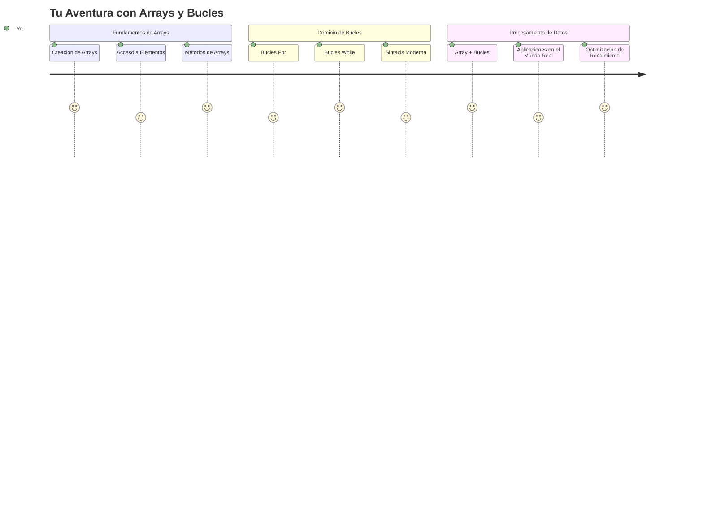
## Cuestionario Preclase
[Cuestionario preclase](https://ff-quizzes.netlify.app/web/quiz/13)

¿Alguna vez te has preguntado cómo las páginas web llevan la cuenta de los artículos en un carrito de compras o muestran tu lista de amigos? Ahí es donde entran en juego los arrays y los bucles. Los arrays son como contenedores digitales que almacenan múltiples piezas de información, mientras que los bucles te permiten trabajar con todos esos datos de manera eficiente sin tener que escribir código repetitivo.

Juntos, estos dos conceptos forman la base para manejar información en tus programas. Aprenderás a pasar de escribir manualmente cada paso a crear código inteligente y eficiente que pueda procesar cientos o incluso miles de elementos rápidamente.

Al final de esta lección, entenderás cómo realizar tareas complejas con datos usando sólo unas pocas líneas de código. Exploremos estos conceptos esenciales de programación.

[](https://youtube.com/watch?v=1U4qTyq02Xw "Arrays")

[](https://www.youtube.com/watch?v=Eeh7pxtTZ3k "Bucles")

> 🎥 Haz clic en las imágenes arriba para ver videos sobre arrays y bucles.

> Puedes tomar esta lección en [Microsoft Learn](https://docs.microsoft.com/learn/modules/web-development-101-arrays/?WT.mc_id=academic-77807-sagibbon)!

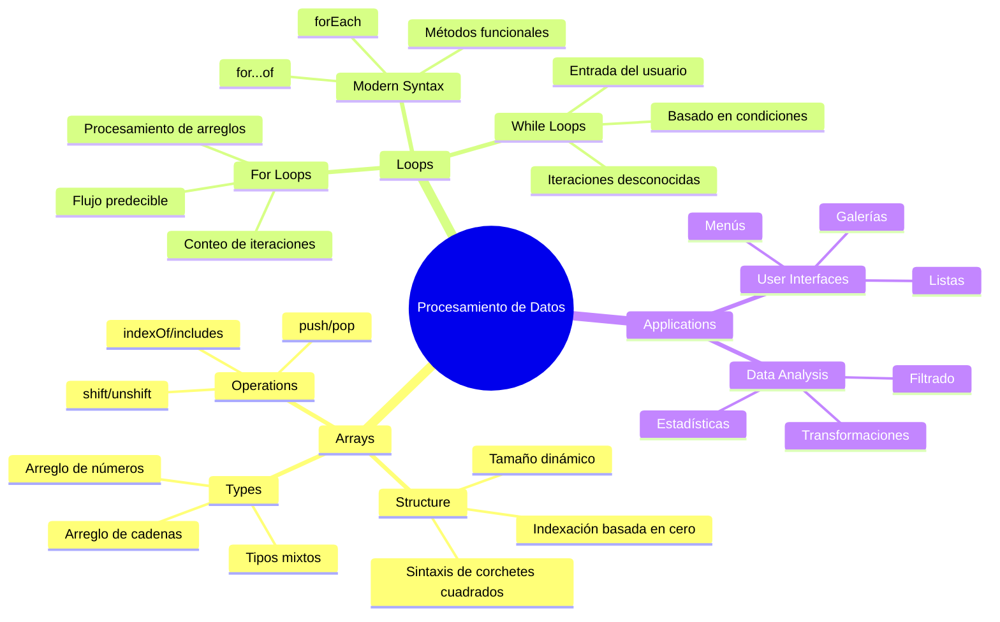
## Arrays

Piensa en los arrays como un archivador digital: en lugar de almacenar un documento por cajón, puedes organizar múltiples elementos relacionados en un solo contenedor estructurado. En términos de programación, los arrays te permiten guardar múltiples piezas de información en un paquete organizado.

Ya sea que estés construyendo una galería de fotos, gestionando una lista de tareas o llevando la cuenta de puntajes altos en un juego, los arrays proporcionan la base para la organización de datos. Veamos cómo funcionan.

✅ ¡Los arrays están por todas partes! ¿Puedes pensar en un ejemplo real de un array, como una matriz de paneles solares?

### Creando Arrays

Crear un array es súper sencillo: ¡solo usa corchetes!

```javascript
// Arreglo vacío - como un carrito de compras vacío esperando artículos
const myArray = [];
```

**¿Qué está pasando aquí?**
Acabas de crear un contenedor vacío usando esos corchetes `[]`. Piensa que es como una estantería vacía en una biblioteca: está lista para contener los libros que quieras organizar allí.

También puedes llenar tu array con valores iniciales desde el principio:

```javascript
// El menú de sabores de tu heladería
const iceCreamFlavors = ["Chocolate", "Strawberry", "Vanilla", "Pistachio", "Rocky Road"];

// Información del perfil de un usuario (mezclando diferentes tipos de datos)
const userData = ["John", 25, true, "developer"];

// Puntuaciones de las pruebas para tu clase favorita
const scores = [95, 87, 92, 78, 85];
```

**Cosas interesantes a notar:**
- Puedes almacenar texto, números o incluso valores verdadero/falso en un mismo array
- Solo separa cada ítem con una coma, ¡fácil!
- Los arrays son perfectos para mantener información relacionada junta

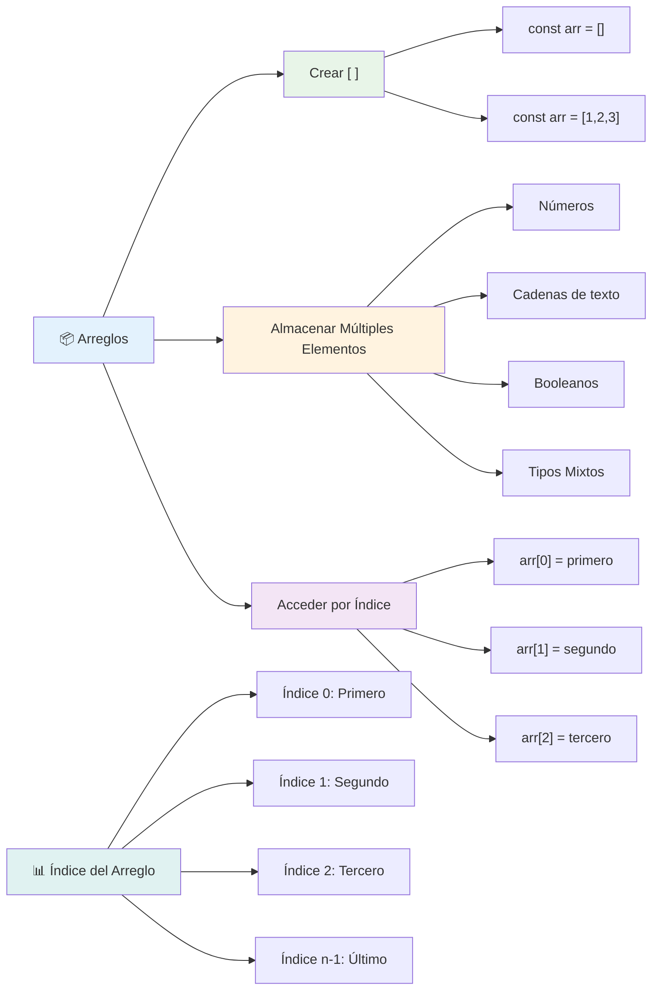
### Indexación de Arrays

Aquí hay algo que puede parecer inusual al principio: los arrays numeran sus elementos empezando desde 0, no desde 1. Esta indexación basada en cero tiene su raíz en cómo funciona la memoria de la computadora, y ha sido una convención en la programación desde los primeros días de lenguajes como C. Cada posición en el array recibe su propio número de dirección llamado **índice**.

| Índice | Valor | Descripción |
|--------|-------|-------------|
| 0      | "Chocolate" | Primer elemento |
| 1      | "Fresa" | Segundo elemento |
| 2      | "Vainilla" | Tercer elemento |
| 3      | "Pistacho" | Cuarto elemento |
| 4      | "Rocky Road" | Quinto elemento |

✅ ¿Te sorprende que los arrays comiencen en el índice cero? En algunos lenguajes de programación, los índices empiezan en 1. Hay una historia interesante sobre esto, que puedes [leer en Wikipedia](https://en.wikipedia.org/wiki/Zero-based_numbering).

**Accediendo a Elementos del Array:**

```javascript
const iceCreamFlavors = ["Chocolate", "Strawberry", "Vanilla", "Pistachio", "Rocky Road"];

// Acceder a elementos individuales usando la notación de corchetes
console.log(iceCreamFlavors[0]); // "Chocolate" - primer elemento
console.log(iceCreamFlavors[2]); // "Vainilla" - tercer elemento
console.log(iceCreamFlavors[4]); // "Rocky Road" - último elemento
```

**Desglosando lo que sucede aquí:**
- **Utiliza** la notación de corchetes con el número de índice para acceder a elementos
- **Devuelve** el valor almacenado en esa posición específica del array
- **Cuenta** comenzando desde 0, haciendo que el primer elemento sea el índice 0

**Modificando Elementos del Array:**

```javascript
// Cambiar un valor existente
iceCreamFlavors[4] = "Butter Pecan";
console.log(iceCreamFlavors[4]); // "Pacana con mantequilla"

// Agregar un nuevo elemento al final
iceCreamFlavors[5] = "Cookie Dough";
console.log(iceCreamFlavors[5]); // "Masa de galleta"
```

**En lo anterior hemos:**
- **Modificado** el elemento en el índice 4 de "Rocky Road" a "Butter Pecan"
- **Añadido** un nuevo elemento "Cookie Dough" en el índice 5
- **Expandido** la longitud del array automáticamente al añadir elementos fuera de los límites actuales

### Longitud del Array y Métodos Comunes

Los arrays vienen con propiedades y métodos incorporados que facilitan mucho el trabajo con datos.

**Encontrar la Longitud del Array:**

```javascript
const iceCreamFlavors = ["Chocolate", "Strawberry", "Vanilla", "Pistachio", "Rocky Road"];
console.log(iceCreamFlavors.length); // 5

// La longitud se actualiza automáticamente a medida que cambia el arreglo
iceCreamFlavors.push("Mint Chip");
console.log(iceCreamFlavors.length); // 6
```

**Puntos clave para recordar:**
- **Devuelve** el número total de elementos en el array
- **Se actualiza** automáticamente cuando se añaden o eliminan elementos
- **Proporciona** un conteo dinámico útil para bucles y validación

**Métodos Esenciales de Array:**

```javascript
const fruits = ["apple", "banana", "orange"];

// Agregar elementos
fruits.push("grape");           // Añade al final: ["manzana", "banana", "naranja", "uva"]
fruits.unshift("strawberry");   // Añade al principio: ["fresa", "manzana", "banana", "naranja", "uva"]

// Eliminar elementos
const lastFruit = fruits.pop();        // Elimina y devuelve "uva"
const firstFruit = fruits.shift();     // Elimina y devuelve "fresa"

// Encontrar elementos
const index = fruits.indexOf("banana"); // Devuelve 1 (posición de "banana")
const hasApple = fruits.includes("apple"); // Devuelve verdadero
```

**Comprendiendo estos métodos:**
- **Añade** elementos con `push()` (al final) y `unshift()` (al principio)
- **Elimina** elementos con `pop()` (al final) y `shift()` (al principio)
- **Ubica** elementos con `indexOf()` y verifica existencia con `includes()`
- **Devuelve** valores útiles como elementos removidos o índices de posición

✅ ¡Pruébalo tú mismo! Usa la consola de tu navegador para crear y manipular un array de creación propia.

### 🧠 **Chequeo de Fundamentos de Array: Organizando tus Datos**

**Pon a prueba tu comprensión de arrays:**
- ¿Por qué crees que los arrays comienzan a contar desde 0 en lugar de 1?
- ¿Qué sucede si intentas acceder a un índice que no existe (como `arr[100]` en un array de 5 elementos)?
- ¿Puedes pensar en tres escenarios del mundo real donde los arrays serían útiles?

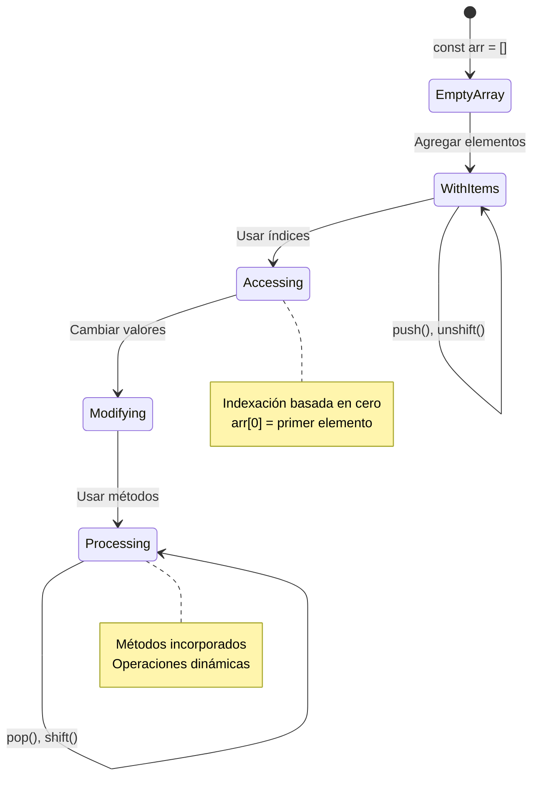
> **Insight del mundo real**: ¡Los arrays están en todas partes en la programación! Feeds de redes sociales, carritos de compras, galerías de fotos, canciones en listas de reproducción: ¡todos son arrays detrás de escena!

## Bucles

Piensa en el famoso castigo de las novelas de Charles Dickens donde los estudiantes tenían que escribir líneas repetidamente en una pizarra. Imagina si pudieras simplemente decirle a alguien "escribe esta frase 100 veces" y que se hiciera automáticamente. Eso es exactamente lo que hacen los bucles para tu código.

Los bucles son como tener un asistente incansable que puede repetir tareas sin error. Ya sea que necesites revisar cada artículo en un carrito de compras o mostrar todas las fotos de un álbum, los bucles manejan la repetición de manera eficiente.

JavaScript ofrece varios tipos de bucles para elegir. Analicemos cada uno y entendamos cuándo usarlos.

```mermaid
flowchart TD
    A["🔄 Tipos de bucles"] --> B["Bucle For"]
    A --> C["Bucle While"]
    A --> D["Bucle For...of"]
    A --> E["Método forEach"]
    
    B --> B1["Iteraciones conocidas"]
    B --> B2["Basado en contador"]
    B --> B3["for(init; condición; incremento)"]
    
    C --> C1["Iteraciones desconocidas"]
    C --> C2["Basado en condición"]
    C --> C3["while(condición)"]
    
    D --> D1["Moderno ES6+"]
    D --> D2["Iteración de arrays"]
    D --> D3["for(elemento de array)"]
    
    E --> E1["Estilo funcional"]
    E --> E2["Método de array"]
    E --> E3["array.forEach(callback)"]
    
    F["⏰ Cuándo usar"] --> F1["For: Conteo, índices"]
    F --> F2["While: Entrada usuario, búsqueda"]
    F --> F3["For...of: Iteración simple"]
    F --> F4["forEach: Programación funcional"]
    
    style A fill:#e3f2fd
    style B fill:#e8f5e8
    style C fill:#fff3e0
    style D fill:#f3e5f5
    style E fill:#e0f2f1
    style F fill:#fce4ec
```
### Bucle For

El bucle `for` es como poner un temporizador: sabes exactamente cuántas veces quieres que algo suceda. Es súper organizado y predecible, lo que lo hace perfecto cuando trabajas con arrays o necesitas contar cosas.

**Estructura del bucle For:**

| Componente       | Propósito          | Ejemplo          |
|------------------|--------------------|------------------|
| **Inicialización** | Define el punto de inicio | `let i = 0`      |
| **Condición**     | Cuándo continuar   | `i < 10`         |
| **Incremento**    | Cómo actualizar   | `i++`            |

```javascript
// Contando del 0 al 9
for (let i = 0; i < 10; i++) {
  console.log(`Count: ${i}`);
}

// Ejemplo más práctico: procesando puntuaciones
const testScores = [85, 92, 78, 96, 88];
for (let i = 0; i < testScores.length; i++) {
  console.log(`Student ${i + 1}: ${testScores[i]}%`);
}
```

**Paso a paso, esto es lo que sucede:**
- **Inicializa** la variable contador `i` en 0 al inicio
- **Verifica** la condición `i < 10` antes de cada iteración
- **Ejecuta** el bloque de código cuando la condición es verdadera
- **Incrementa** `i` en 1 después de cada iteración con `i++`
- **Se detiene** cuando la condición se vuelve falsa (cuando `i` alcanza 10)

✅ Ejecuta este código en la consola de un navegador. ¿Qué sucede cuando haces pequeños cambios al contador, la condición o la expresión de iteración? ¿Puedes hacer que funcione hacia atrás, creando una cuenta regresiva?

### 🗓️ **Chequeo de Maestría en For: Repetición Controlada**

**Evalúa tu comprensión del bucle for:**
- ¿Cuáles son las tres partes de un bucle for, y qué hace cada una?
- ¿Cómo recorrerías un array de atrás hacia adelante?
- ¿Qué pasa si olvidas la parte de incremento (`i++`)?

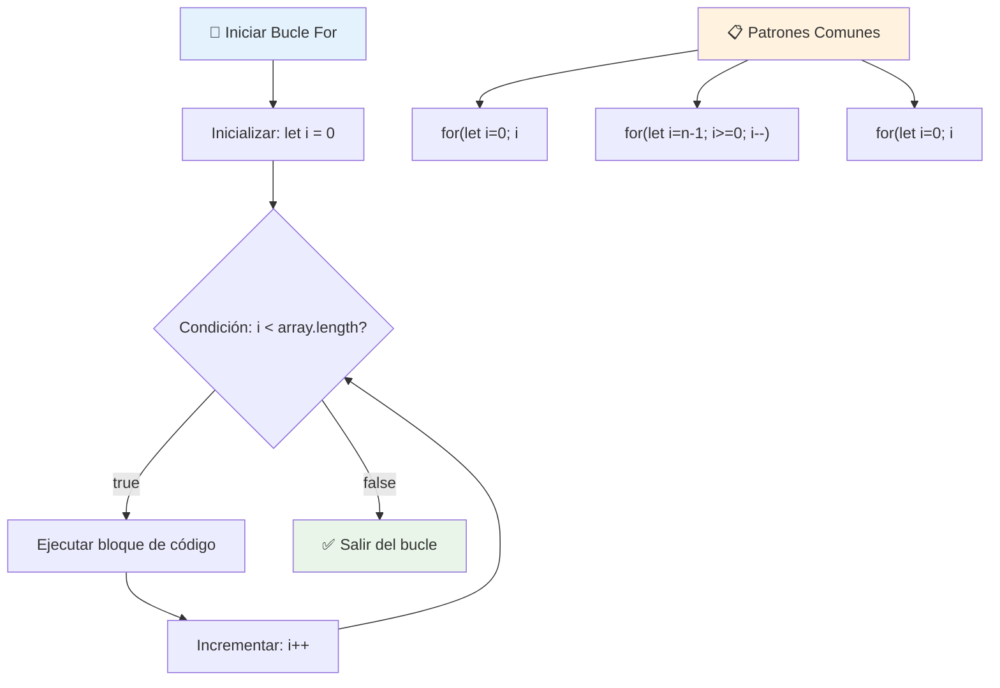
> **Sabiduría sobre bucles**: ¡Los bucles for son perfectos cuando sabes exactamente cuántas veces necesitas repetir algo! Son la opción más común para procesar arrays.

### Bucle While

El bucle `while` es como decir "sigue haciendo esto hasta que..." - puede que no sepas exactamente cuántas veces se ejecutará, pero sabes cuándo detenerlo. Es perfecto para cosas como pedir entrada al usuario hasta que proporcione lo necesario, o buscar datos hasta encontrar lo que buscas.

**Características del bucle While:**
- **Continúa** ejecutando mientras la condición sea verdadera
- **Requiere** manejar manualmente las variables contador
- **Verifica** la condición antes de cada iteración
- **Riesgo** de bucles infinitos si la condición nunca se vuelve falsa

```javascript
// Ejemplo básico de conteo
let i = 0;
while (i < 10) {
  console.log(`While count: ${i}`);
  i++; // ¡No olvides incrementar!
}

// Ejemplo más práctico: procesar la entrada del usuario
let userInput = "";
let attempts = 0;
const maxAttempts = 3;

while (userInput !== "quit" && attempts < maxAttempts) {
  userInput = prompt(`Enter 'quit' to exit (attempt ${attempts + 1}):`);
  attempts++;
}

if (attempts >= maxAttempts) {
  console.log("Maximum attempts reached!");
}
```

**Comprendiendo estos ejemplos:**
- **Gestiona** la variable contador `i` manualmente dentro del cuerpo del bucle
- **Incrementa** el contador para evitar bucles infinitos
- **Demuestra** un caso práctico con entrada del usuario y límite de intentos
- **Incluye** mecanismos de seguridad para prevenir ejecuciones interminables

### ♾️ **Chequeo de Sabiduría en While: Repetición Basada en Condición**

**Pon a prueba tu comprensión del bucle while:**
- ¿Cuál es el principal peligro al usar bucles while?
- ¿Cuándo elegirías un bucle while en lugar de un for?
- ¿Cómo puedes prevenir bucles infinitos?

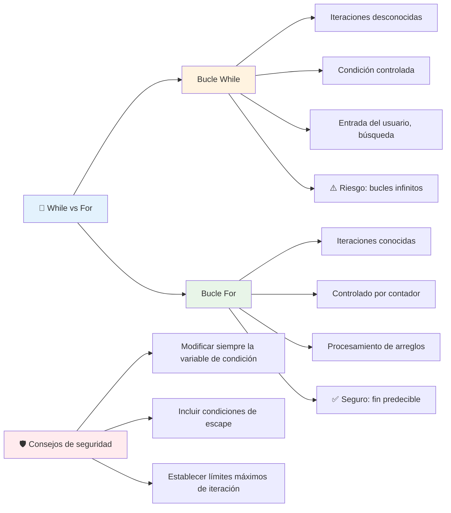
> **Seguridad primero**: Los bucles while son poderosos pero requieren un manejo cuidadoso de la condición. ¡Siempre asegúrate de que la condición de tu bucle eventualmente se vuelva falsa!

### Alternativas Modernas de Bucles

JavaScript ofrece sintaxis moderna de bucles que puede hacer tu código más legible y menos propenso a errores.

**Bucle For...of (ES6+):**

```javascript
const colors = ["red", "green", "blue", "yellow"];

// Enfoque moderno - más limpio y seguro
for (const color of colors) {
  console.log(`Color: ${color}`);
}

// Comparar con bucle for tradicional
for (let i = 0; i < colors.length; i++) {
  console.log(`Color: ${colors[i]}`);
}
```

**Ventajas clave de for...of:**
- **Elimina** la gestión de índices y posibles errores de off-by-one
- **Proporciona** acceso directo a los elementos del array
- **Mejora** la legibilidad del código y reduce la complejidad sintáctica

**Método forEach:**

```javascript
const prices = [9.99, 15.50, 22.75, 8.25];

// Usando forEach para un estilo de programación funcional
prices.forEach((price, index) => {
  console.log(`Item ${index + 1}: $${price.toFixed(2)}`);
});

// forEach con funciones flecha para operaciones simples
prices.forEach(price => console.log(`Price: $${price}`));
```

**Lo que necesitas saber sobre forEach:**
- **Ejecuta** una función para cada elemento del array
- **Proporciona** tanto el valor del elemento como el índice como parámetros
- **No puede** ser detenido anticipadamente (a diferencia de bucles tradicionales)
- **Devuelve** undefined (no crea un nuevo array)

✅ ¿Por qué elegirías un bucle for en lugar de un bucle while? 17 mil espectadores tuvieron la misma pregunta en StackOverflow, y algunas de las opiniones [podrían interesarte](https://stackoverflow.com/questions/39969145/while-loops-vs-for-loops-in-javascript).

### 🎨 **Chequeo de Sintaxis Moderna: Adoptando ES6+**

**Evalúa tu comprensión del JavaScript moderno:**
- ¿Cuáles son las ventajas de `for...of` sobre los bucles for tradicionales?
- ¿Cuándo podrías preferir bucles for tradicionales?
- ¿Cuál es la diferencia entre `forEach` y `map`?

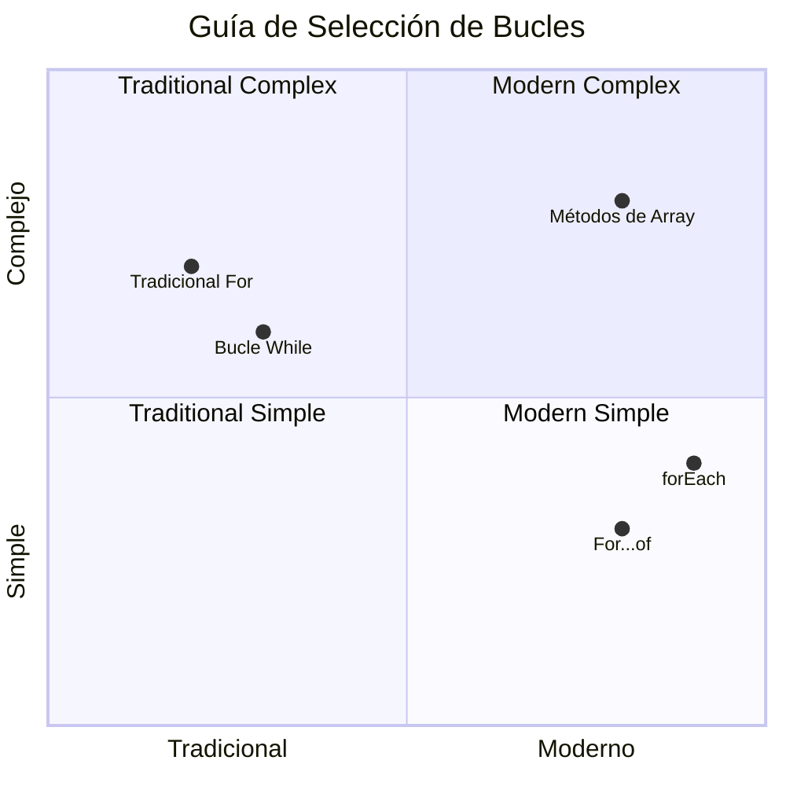
> **Tendencia moderna**: La sintaxis ES6+ como `for...of` y `forEach` se está convirtiendo en el enfoque preferido para iterar arrays porque es más limpia y menos propensa a errores.

## Bucles y Arrays

Combinar arrays con bucles crea potentes capacidades para procesar datos. Esta combinación es fundamental para muchas tareas de programación, desde mostrar listas hasta calcular estadísticas.

**Procesamiento Tradicional de Arrays:**

```javascript
const iceCreamFlavors = ["Chocolate", "Strawberry", "Vanilla", "Pistachio", "Rocky Road"];

// Enfoque clásico con bucle for
for (let i = 0; i < iceCreamFlavors.length; i++) {
  console.log(`Flavor ${i + 1}: ${iceCreamFlavors[i]}`);
}

// Enfoque moderno con for...of
for (const flavor of iceCreamFlavors) {
  console.log(`Available flavor: ${flavor}`);
}
```

**Entendamos cada enfoque:**
- **Utiliza** la propiedad de longitud del array para determinar el límite del bucle
- **Accede** a elementos por índice en bucles for tradicionales
- **Proporciona** acceso directo a elementos en bucles for...of
- **Procesa** cada elemento del array exactamente una vez

**Ejemplo Práctico de Procesamiento de Datos:**

```javascript
const studentGrades = [85, 92, 78, 96, 88, 73, 89];
let total = 0;
let highestGrade = studentGrades[0];
let lowestGrade = studentGrades[0];

// Procesar todas las calificaciones con un solo bucle
for (let i = 0; i < studentGrades.length; i++) {
  const grade = studentGrades[i];
  total += grade;
  
  if (grade > highestGrade) {
    highestGrade = grade;
  }
  
  if (grade < lowestGrade) {
    lowestGrade = grade;
  }
}

const average = total / studentGrades.length;
console.log(`Average: ${average.toFixed(1)}`);
console.log(`Highest: ${highestGrade}`);
console.log(`Lowest: ${lowestGrade}`);
```

**Así funciona este código:**
- **Inicializa** variables para el seguimiento de suma y extremos
- **Procesa** cada nota con un único bucle eficiente
- **Acumula** el total para calcular el promedio
- **Sigue** el valor más alto y más bajo durante la iteración
- **Calcula** estadísticas finales después de completar el bucle

✅ Experimenta haciendo un bucle sobre un array de tu propia creación en la consola de tu navegador.

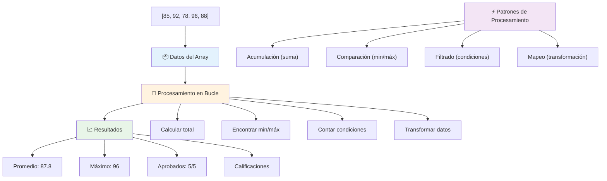
---

## Desafío del Agente GitHub Copilot 🚀

Usa el modo Agente para completar el siguiente desafío:

**Descripción:** Construye una función integral de procesamiento de datos que combine arrays y bucles para analizar un conjunto de datos y generar conclusiones significativas.

**Prompt:** Crea una función llamada `analyzeGrades` que reciba un array de objetos de notas de estudiantes (cada uno con propiedades nombre y puntuación) y devuelva un objeto con estadísticas incluyendo la puntuación más alta, la más baja, el promedio, el conteo de estudiantes aprobados (puntuación >= 70) y un array con los nombres de los estudiantes que obtuvieron una puntuación superior al promedio. Usa al menos dos tipos diferentes de bucles en tu solución.

Aprende más sobre [modo agente](https://code.visualstudio.com/blogs/2025/02/24/introducing-copilot-agent-mode) aquí.

## 🚀 Desafío
JavaScript ofrece varios métodos modernos de arrays que pueden reemplazar los bucles tradicionales para tareas específicas. Explora [forEach](https://developer.mozilla.org/docs/Web/JavaScript/Reference/Global_Objects/Array/forEach), [for-of](https://developer.mozilla.org/docs/Web/JavaScript/Reference/Statements/for...of), [map](https://developer.mozilla.org/docs/Web/JavaScript/Reference/Global_Objects/Array/map), [filter](https://developer.mozilla.org/docs/Web/JavaScript/Reference/Global_Objects/Array/filter) y [reduce](https://developer.mozilla.org/docs/Web/JavaScript/Reference/Global_Objects/Array/reduce).

**Tu desafío:** Refactoriza el ejemplo de calificaciones de estudiantes usando al menos tres métodos diferentes de arrays. Observa lo mucho más limpio y legible que se vuelve el código con la sintaxis moderna de JavaScript.

## Examen posterior a la clase
[Examen posterior a la clase](https://ff-quizzes.netlify.app/web/quiz/14)


## Revisión y autoestudio

Los arrays en JavaScript tienen muchos métodos asociados que son extremadamente útiles para la manipulación de datos. [Lee sobre estos métodos](https://developer.mozilla.org/docs/Web/JavaScript/Reference/Global_Objects/Array) y prueba algunos de ellos (como push, pop, slice y splice) en un array de tu creación.

## Tarea

[Loop an Array](assignment.md)

---

## 📊 **Resumen de tu Kit de Herramientas de Arrays y Bucles**

```mermaid
graph TD
    A["🎯 Dominio de Arrays y Bucles"] --> B["📦 Fundamentos de Arrays"]
    A --> C["🔄 Tipos de Bucles"]
    A --> D["🔗 Procesamiento de Datos"]
    A --> E["🎨 Técnicas Modernas"]
    
    B --> B1["Creación: [ ]"]
    B --> B2["Indexación: arr[0]"]
    B --> B3["Métodos: push, pop"]
    B --> B4["Propiedades: length"]
    
    C --> C1["For: Iteraciones conocidas"]
    C --> C2["While: Basado en condición"]
    C --> C3["For...of: Acceso directo"]
    C --> C4["forEach: Funcional"]
    
    D --> D1["Cálculo de estadísticas"]
    D --> D2["Transformación de datos"]
    D --> D3["Filtrado y búsqueda"]
    D --> D4["Procesamiento en tiempo real"]
    
    E --> E1["Funciones flecha"]
    E --> E2["Encadenamiento de métodos"]
    E --> E3["Desestructuración"]
    E --> E4["Literales de plantilla"]
    
    F["💡 Beneficios Clave"] --> F1["Manejo eficiente de datos"]
    F --> F2["Reducción de repetición de código"]
    F --> F3["Soluciones escalables"]
    F --> F4["Sintaxis más limpia"]
    
    style A fill:#e3f2fd
    style B fill:#e8f5e8
    style C fill:#fff3e0
    style D fill:#f3e5f5
    style E fill:#e0f2f1
    style F fill:#fce4ec
```
---

## 🚀 Línea de tiempo de tu dominio de Arrays y Bucles

### ⚡ **Lo que puedes hacer en los próximos 5 minutos**
- [ ] Crea un array de tus películas favoritas y accede a elementos específicos
- [ ] Escribe un bucle for que cuente del 1 al 10
- [ ] Intenta el desafío de métodos modernos de arrays de la lección
- [ ] Practica el indexado de arrays en la consola de tu navegador

### 🎯 **Lo que puedes lograr en esta hora**
- [ ] Completa el examen posterior a la lección y repasa los conceptos difíciles
- [ ] Construye el analizador completo de calificaciones del desafío GitHub Copilot
- [ ] Crea un carrito de compras simple que añada y elimine artículos
- [ ] Practica la conversión entre diferentes tipos de bucles
- [ ] Experimenta con métodos de arrays como `push`, `pop`, `slice` y `splice`

### 📅 **Tu recorrido de procesamiento de datos durante la semana**
- [ ] Completa la tarea "Loop an Array" con mejoras creativas
- [ ] Construye una aplicación de lista de tareas usando arrays y bucles
- [ ] Crea una calculadora simple de estadísticas para datos numéricos
- [ ] Practica con [métodos de arrays MDN](https://developer.mozilla.org/docs/Web/JavaScript/Reference/Global_Objects/Array)
- [ ] Construye una galería de fotos o interfaz de lista de reproducción musical
- [ ] Explora la programación funcional con `map`, `filter` y `reduce`

### 🌟 **Tu transformación durante el mes**
- [ ] Domina operaciones avanzadas de arrays y optimización de rendimiento
- [ ] Crea un panel completo de visualización de datos
- [ ] Contribuye a proyectos de código abierto relacionados con procesamiento de datos
- [ ] Enseña a alguien más sobre arrays y bucles con ejemplos prácticos
- [ ] Crea una biblioteca personal de funciones reutilizables para procesamiento de datos
- [ ] Explora algoritmos y estructuras de datos basadas en arrays

### 🏆 **Chequeo final del campeón en procesamiento de datos**

**Celebra tu dominio de arrays y bucles:**
- ¿Cuál es la operación con arrays más útil que has aprendido para aplicaciones del mundo real?
- ¿Qué tipo de bucle te resulta más natural y por qué?
- ¿Cómo ha cambiado tu enfoque para organizar datos al entender arrays y bucles?
- ¿Qué tarea compleja de procesamiento de datos te gustaría abordar a continuación?

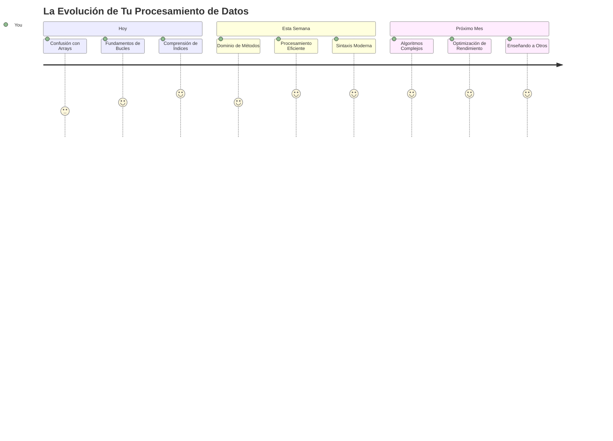
> 📦 **¡Has desbloqueado el poder de la organización y procesamiento de datos!** Los arrays y bucles son la base de casi todas las aplicaciones que construirás alguna vez. Desde listas simples hasta análisis de datos complejos, ahora tienes las herramientas para manejar la información de manera eficiente y elegante. Cada sitio web dinámico, aplicación móvil y aplicación basada en datos depende de estos conceptos fundamentales. ¡Bienvenido al mundo del procesamiento de datos escalable! 🎉

---

<!-- CO-OP TRANSLATOR DISCLAIMER START -->
**Aviso Legal**:  
Este documento ha sido traducido utilizando el servicio de traducción automática [Co-op Translator](https://github.com/Azure/co-op-translator). Aunque nos esforzamos por la precisión, tenga en cuenta que las traducciones automáticas pueden contener errores o inexactitudes. El documento original en su idioma nativo debe considerarse la fuente autorizada. Para información crítica, se recomienda la traducción profesional realizada por humanos. No nos hacemos responsables de ningún malentendido o interpretación errónea que surja del uso de esta traducción.
<!-- CO-OP TRANSLATOR DISCLAIMER END -->