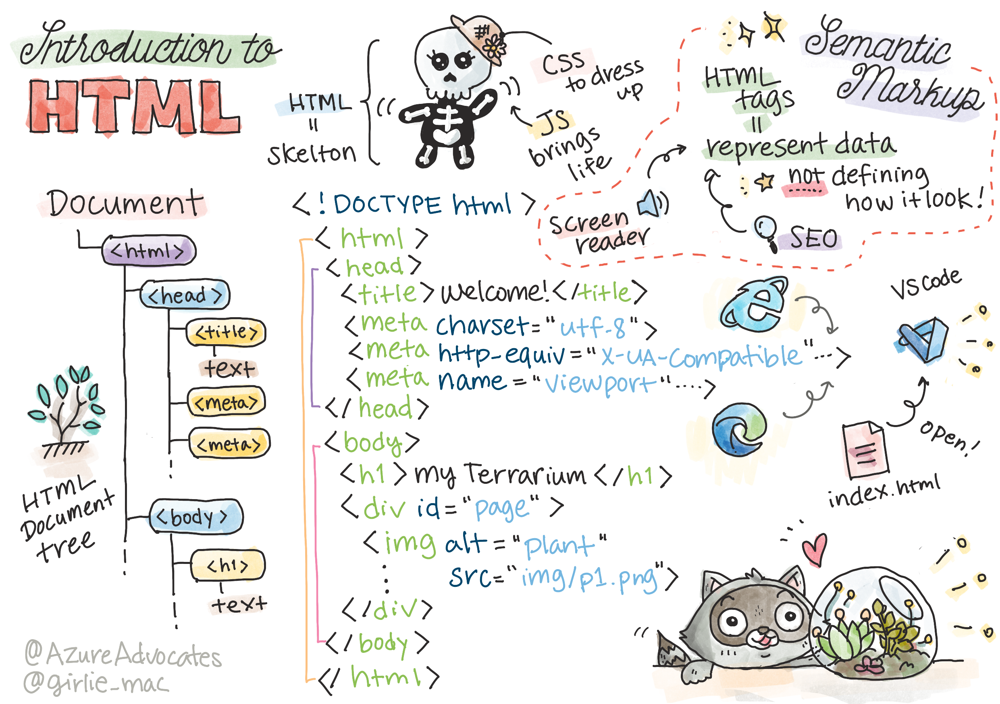

<!--
CO_OP_TRANSLATOR_METADATA:
{
  "original_hash": "89f7f9f800ce7c9f149e98baaae8491a",
  "translation_date": "2025-08-29T13:58:19+00:00",
  "source_file": "3-terrarium/1-intro-to-html/README.md",
  "language_code": "es"
}
-->
# Proyecto Terrario Parte 1: Introducción a HTML


> Sketchnote por [Tomomi Imura](https://twitter.com/girlie_mac)

## Cuestionario Previo a la Clase

[Cuestionario previo a la clase](https://ff-quizzes.netlify.app/web/quiz/15)

> Mira el video

> 
> [](https://www.youtube.com/watch?v=1TvxJKBzhyQ)

### Introducción

HTML, o Lenguaje de Marcado de Hipertexto, es el 'esqueleto' de la web. Si CSS 'viste' tu HTML y JavaScript le da vida, HTML es el cuerpo de tu aplicación web. Incluso la sintaxis de HTML refleja esta idea, ya que incluye etiquetas como "head", "body" y "footer".

En esta lección, usaremos HTML para estructurar el 'esqueleto' de la interfaz de nuestro terrario virtual. Tendrá un título y tres columnas: una columna derecha y una izquierda donde estarán las plantas que se pueden arrastrar, y un área central que será el terrario con apariencia de vidrio. Al final de esta lección, podrás ver las plantas en las columnas, pero la interfaz se verá un poco extraña; no te preocupes, en la siguiente sección agregarás estilos CSS para mejorar su apariencia.

### Tarea

En tu computadora, crea una carpeta llamada 'terrarium' y dentro de ella, un archivo llamado 'index.html'. Puedes hacerlo en Visual Studio Code después de crear tu carpeta terrarium abriendo una nueva ventana de VS Code, haciendo clic en 'abrir carpeta' y navegando hasta tu nueva carpeta. Haz clic en el pequeño botón de 'archivo' en el panel Explorador y crea el nuevo archivo:


O

Usa estos comandos en tu terminal git bash:
* `mkdir terrarium`
* `cd terrarium`
* `touch index.html`
* `code index.html` o `nano index.html`

> Los archivos index.html indican a un navegador que es el archivo predeterminado en una carpeta; URLs como `https://anysite.com/test` podrían estar construidas usando una estructura de carpetas que incluye una carpeta llamada `test` con un archivo `index.html` dentro; `index.html` no tiene que aparecer en la URL.

---

## El DocType y las etiquetas html

La primera línea de un archivo HTML es su doctype. Es un poco sorprendente que necesites tener esta línea en la parte superior del archivo, pero le indica a los navegadores antiguos que deben renderizar la página en un modo estándar, siguiendo la especificación actual de HTML.

> Consejo: en VS Code, puedes pasar el cursor sobre una etiqueta y obtener información sobre su uso desde las guías de referencia de MDN.

La segunda línea debe ser la etiqueta de apertura `<html>`, seguida ahora por su etiqueta de cierre `</html>`. Estas etiquetas son los elementos raíz de tu interfaz.

### Tarea

Agrega estas líneas en la parte superior de tu archivo `index.html`:

```HTML
<!DOCTYPE html>
<html></html>
```

✅ Existen algunos modos diferentes que se pueden determinar configurando el DocType con una cadena de consulta: [Modo Quirks y Modo Estándar](https://developer.mozilla.org/docs/Web/HTML/Quirks_Mode_and_Standards_Mode). Estos modos solían ser compatibles con navegadores muy antiguos que ya no se usan normalmente (Netscape Navigator 4 e Internet Explorer 5). Puedes ceñirte a la declaración estándar de doctype.

---

## El 'head' del documento

El área 'head' del documento HTML incluye información crucial sobre tu página web, también conocida como [metadatos](https://developer.mozilla.org/docs/Web/HTML/Element/meta). En nuestro caso, le indicamos al servidor web al que se enviará esta página para ser renderizada, estas cuatro cosas:

-   el título de la página
-   metadatos de la página, incluyendo:
    -   el 'conjunto de caracteres', que indica qué codificación de caracteres se usa en la página
    -   información del navegador, incluyendo `x-ua-compatible`, que indica que el navegador IE=edge es compatible
    -   información sobre cómo debe comportarse el viewport cuando se carga. Configurar el viewport con una escala inicial de 1 controla el nivel de zoom cuando se carga la página por primera vez.

### Tarea

Agrega un bloque 'head' a tu documento entre las etiquetas de apertura y cierre `<html>`.

```html
<head>
	<title>Welcome to my Virtual Terrarium</title>
	<meta charset="utf-8" />
	<meta http-equiv="X-UA-Compatible" content="IE=edge" />
	<meta name="viewport" content="width=device-width, initial-scale=1" />
</head>
```

✅ ¿Qué pasaría si configuraras una etiqueta meta de viewport como esta: `<meta name="viewport" content="width=600">`? Lee más sobre el [viewport](https://developer.mozilla.org/docs/Web/HTML/Viewport_meta_tag).

---

## El `body` del documento

### Etiquetas HTML

En HTML, agregas etiquetas a tu archivo .html para crear elementos de una página web. Cada etiqueta generalmente tiene una etiqueta de apertura y cierre, como esta: `<p>hola</p>` para indicar un párrafo. Crea el cuerpo de tu interfaz agregando un conjunto de etiquetas `<body>` dentro del par de etiquetas `<html>`; tu marcado ahora se verá así:

### Tarea

```html
<!DOCTYPE html>
<html>
	<head>
		<title>Welcome to my Virtual Terrarium</title>
		<meta charset="utf-8" />
		<meta http-equiv="X-UA-Compatible" content="IE=edge" />
		<meta name="viewport" content="width=device-width, initial-scale=1" />
	</head>
	<body></body>
</html>
```

Ahora, puedes comenzar a construir tu página. Normalmente, usas etiquetas `<div>` para crear los elementos separados en una página. Crearemos una serie de elementos `<div>` que contendrán imágenes.

### Imágenes

Una etiqueta html que no necesita una etiqueta de cierre es la etiqueta ``, porque tiene un elemento `src` que contiene toda la información que la página necesita para renderizar el elemento.

Crea una carpeta en tu aplicación llamada `images` y dentro de ella, agrega todas las imágenes de la [carpeta de código fuente](../../../../3-terrarium/solution/images); (hay 14 imágenes de plantas).

### Tarea

Agrega esas imágenes de plantas en dos columnas entre las etiquetas `<body></body>`:

```html
<div id="page">
	<div id="left-container" class="container">
		<div class="plant-holder">
			
		</div>
		<div class="plant-holder">
			
		</div>
		<div class="plant-holder">
			
		</div>
		<div class="plant-holder">
			
		</div>
		<div class="plant-holder">
			
		</div>
		<div class="plant-holder">
			
		</div>
		<div class="plant-holder">
			
		</div>
	</div>
	<div id="right-container" class="container">
		<div class="plant-holder">
			
		</div>
		<div class="plant-holder">
			
		</div>
		<div class="plant-holder">
			
		</div>
		<div class="plant-holder">
			
		</div>
		<div class="plant-holder">
			
		</div>
		<div class="plant-holder">
			
		</div>
		<div class="plant-holder">
			
		</div>
	</div>
</div>
```

> Nota: Spans vs. Divs. Los Divs se consideran elementos 'de bloque', y los Spans son 'en línea'. ¿Qué pasaría si transformaras estos divs en spans?

Con este marcado, las plantas ahora aparecen en la pantalla. Se ve bastante mal, porque aún no están estilizadas con CSS, y lo haremos en la próxima lección.

Cada imagen tiene texto alternativo que aparecerá incluso si no puedes ver o renderizar una imagen. Este es un atributo importante para incluir por razones de accesibilidad. Aprende más sobre accesibilidad en lecciones futuras; por ahora, recuerda que el atributo alt proporciona información alternativa para una imagen si un usuario, por alguna razón, no puede verla (debido a una conexión lenta, un error en el atributo src, o si el usuario utiliza un lector de pantalla).

✅ ¿Notaste que cada imagen tiene el mismo texto alternativo? ¿Es esto una buena práctica? ¿Por qué o por qué no? ¿Puedes mejorar este código?

---

## Marcado semántico

En general, es preferible usar 'semántica' significativa al escribir HTML. ¿Qué significa esto? Significa que usas etiquetas HTML para representar el tipo de datos o interacción para los que fueron diseñadas. Por ejemplo, el texto principal de un título en una página debería usar una etiqueta `<h1>`.

Agrega la siguiente línea justo debajo de tu etiqueta de apertura `<body>`:

```html
<h1>My Terrarium</h1>
```

Usar marcado semántico, como tener encabezados con `<h1>` y listas no ordenadas renderizadas como `<ul>`, ayuda a los lectores de pantalla a navegar por una página. En general, los botones deberían escribirse como `<button>` y las listas como `<li>`. Aunque es _posible_ usar elementos `<span>` especialmente estilizados con controladores de clic para simular botones, es mejor para los usuarios con discapacidades usar tecnologías que determinen dónde se encuentra un botón en una página e interactuar con él, si el elemento aparece como un botón. Por esta razón, intenta usar marcado semántico tanto como sea posible.

✅ Echa un vistazo a un lector de pantalla y [cómo interactúa con una página web](https://www.youtube.com/watch?v=OUDV1gqs9GA). ¿Puedes ver por qué tener un marcado no semántico podría frustrar al usuario?

## El terrario

La última parte de esta interfaz implica crear un marcado que será estilizado para crear un terrario.

### Tarea:

Agrega este marcado encima de la última etiqueta `</div>`:

```html
<div id="terrarium">
	<div class="jar-top"></div>
	<div class="jar-walls">
		<div class="jar-glossy-long"></div>
		<div class="jar-glossy-short"></div>
	</div>
	<div class="dirt"></div>
	<div class="jar-bottom"></div>
</div>
```

✅ Aunque agregaste este marcado a la pantalla, no ves absolutamente nada renderizado. ¿Por qué?

---

## 🚀Desafío

Existen algunas etiquetas 'antiguas' en HTML que todavía son divertidas de usar, aunque no deberías usar etiquetas obsoletas como [estas etiquetas](https://developer.mozilla.org/docs/Web/HTML/Element#Obsolete_and_deprecated_elements) en tu marcado. Aun así, ¿puedes usar la antigua etiqueta `<marquee>` para hacer que el título h1 se desplace horizontalmente? (si lo haces, no olvides eliminarlo después).

## Cuestionario Posterior a la Clase

[Cuestionario posterior a la clase](https://ff-quizzes.netlify.app/web/quiz/16)

## Revisión y Autoestudio

HTML es el sistema de bloques de construcción 'probado y verdadero' que ha ayudado a construir la web tal como la conocemos hoy. Aprende un poco sobre su historia estudiando algunas etiquetas antiguas y nuevas. ¿Puedes averiguar por qué algunas etiquetas fueron obsoletas y otras añadidas? ¿Qué etiquetas podrían introducirse en el futuro?

Aprende más sobre cómo construir sitios para la web y dispositivos móviles en [Microsoft Learn](https://docs.microsoft.com/learn/modules/build-simple-website/?WT.mc_id=academic-77807-sagibbon).

## Tarea

[Practica tu HTML: Crea un diseño de blog](assignment.md)

---

**Descargo de responsabilidad**:  
Este documento ha sido traducido utilizando el servicio de traducción automática [Co-op Translator](https://github.com/Azure/co-op-translator). Si bien nos esforzamos por lograr precisión, tenga en cuenta que las traducciones automáticas pueden contener errores o imprecisiones. El documento original en su idioma nativo debe considerarse como la fuente autorizada. Para información crítica, se recomienda una traducción profesional realizada por humanos. No nos hacemos responsables de malentendidos o interpretaciones erróneas que puedan surgir del uso de esta traducción.