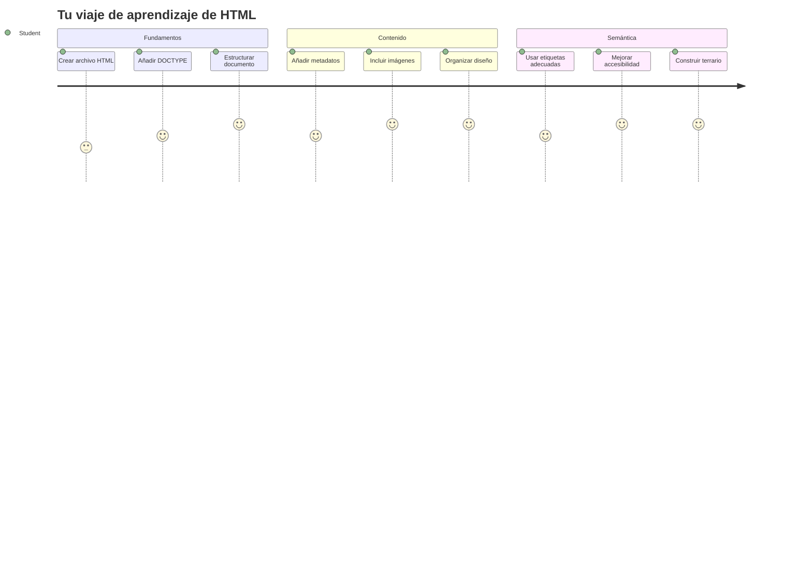
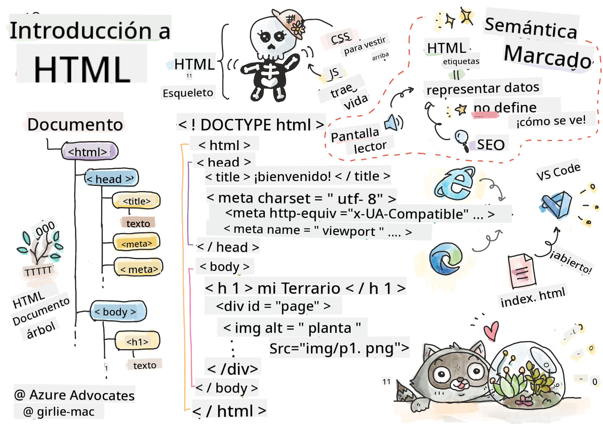
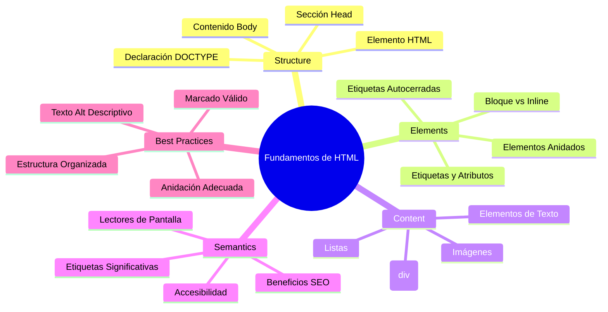
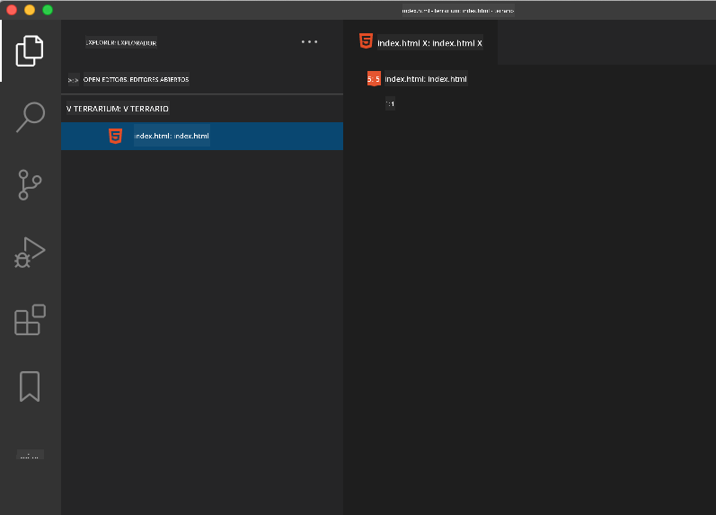
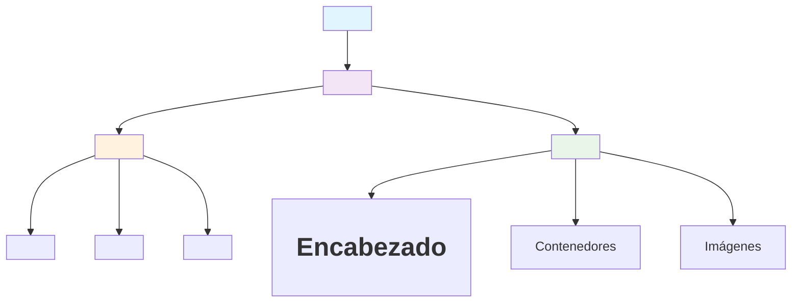
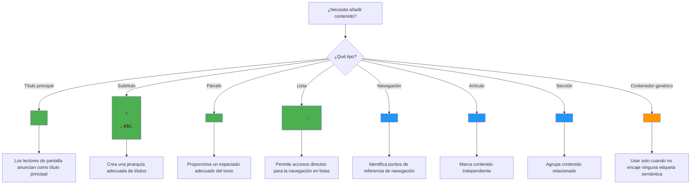
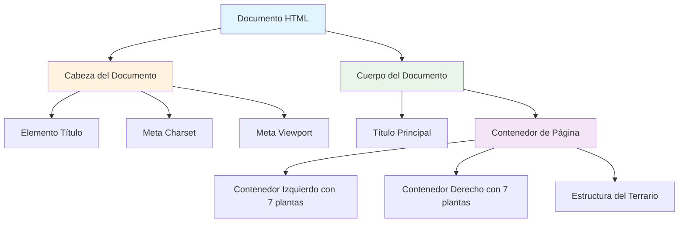
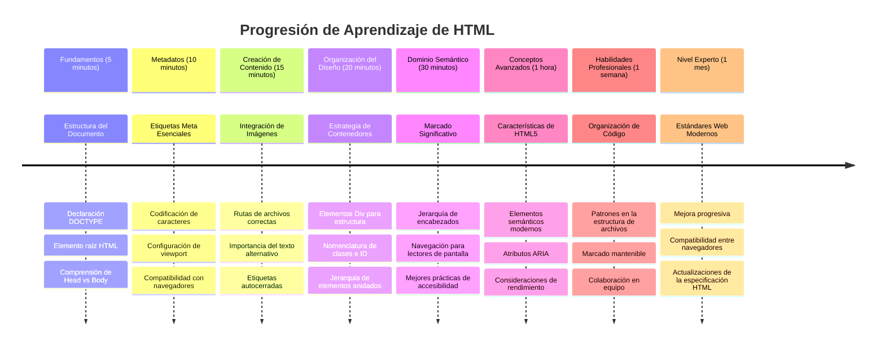

<!--
CO_OP_TRANSLATOR_METADATA:
{
  "original_hash": "3fcfa99c4897e051b558b5eaf1e8cc74",
  "translation_date": "2026-01-06T07:56:08+00:00",
  "source_file": "3-terrarium/1-intro-to-html/README.md",
  "language_code": "es"
}
-->
# Proyecto Terrario Parte 1: Introducción a HTML



> Sketchnote por [Tomomi Imura](https://twitter.com/girlie_mac)

HTML, o Lenguaje de Marcado de Hipertexto, es la base de cada sitio web que hayas visitado. Piensa en HTML como el esqueleto que da estructura a las páginas web: define dónde va el contenido, cómo se organiza y qué representa cada pieza. Mientras que CSS más adelante "vestirá" tu HTML con colores y diseños, y JavaScript le dará vida con interactividad, HTML proporciona la estructura esencial que hace posible todo lo demás.

En esta lección, crearás la estructura HTML para una interfaz virtual de terrario. Este proyecto práctico te enseñará conceptos fundamentales de HTML mientras construyes algo visualmente atractivo. Aprenderás a organizar contenido usando elementos semánticos, trabajar con imágenes y crear la base para una aplicación web interactiva.

Al final de esta lección, tendrás una página HTML funcional que muestra imágenes de plantas organizadas en columnas, lista para ser estilizada en la próxima lección. No te preocupes si se ve básica al principio, eso es exactamente lo que HTML debería hacer antes de que CSS añada el acabado visual.


## Cuestionario Previo a la Clase

[Cuestionario previo a la clase](https://ff-quizzes.netlify.app/web/quiz/15)

> 📺 **Mira y Aprende**: Consulta este video útil para una visión general
> 
> [](https://www.youtube.com/watch?v=1TvxJKBzhyQ)

## Configurando Tu Proyecto

Antes de sumergirnos en el código HTML, vamos a configurar un espacio de trabajo adecuado para tu proyecto de terrario. Crear una estructura de archivos organizada desde el inicio es un hábito crucial que te servirá durante todo tu camino en el desarrollo web.

### Tarea: Crea La Estructura de Tu Proyecto

Crearás una carpeta dedicada para tu proyecto terrario y agregarás tu primer archivo HTML. Aquí tienes dos formas de hacerlo:

**Opción 1: Usando Visual Studio Code**
1. Abre Visual Studio Code
2. Haz clic en "Archivo" → "Abrir carpeta" o usa `Ctrl+K, Ctrl+O` (Windows/Linux) o `Cmd+K, Cmd+O` (Mac)
3. Crea una nueva carpeta llamada `terrarium` y selecciónala
4. En el panel Explorador, haz clic en el ícono "Nuevo archivo"
5. Nombra tu archivo `index.html`



**Opción 2: Usando comandos en la Terminal**
```bash
mkdir terrarium
cd terrarium
touch index.html
code index.html
```

**Esto es lo que hacen estos comandos:**
- **Crea** un nuevo directorio llamado `terrarium` para tu proyecto
- **Navega** dentro del directorio terrarium
- **Crea** un archivo vacío `index.html`
- **Abre** el archivo en Visual Studio Code para editarlo

> 💡 **Consejo profesional**: El nombre de archivo `index.html` es especial en desarrollo web. Cuando alguien visita un sitio, los navegadores buscan automáticamente `index.html` como la página predeterminada para mostrar. Esto significa que una URL como `https://misitio.com/projects/` servirá automáticamente el archivo `index.html` de la carpeta `projects` sin necesidad de especificar el nombre del archivo en la URL.

## Entendiendo la Estructura del Documento HTML

Cada documento HTML sigue una estructura específica que los navegadores necesitan para entender y mostrar correctamente. Piensa en esta estructura como una carta formal: tiene elementos requeridos en un orden particular que ayudan al destinatario (en este caso, el navegador) a procesar el contenido adecuadamente.


Comencemos agregando los fundamentos esenciales que todo documento HTML necesita.

### La Declaración DOCTYPE y el Elemento Raíz

Las primeras dos líneas de cualquier archivo HTML sirven como la "introducción" del documento para el navegador:

```html
<!DOCTYPE html>
<html></html>
```

**Entendiendo qué hace este código:**
- **Declara** el tipo de documento como HTML5 usando `<!DOCTYPE html>`
- **Crea** el elemento raíz `<html>` que contendrá todo el contenido de la página
- **Establece** estándares web modernos para un renderizado adecuado en navegadores
- **Garantiza** una visualización consistente en diferentes navegadores y dispositivos

> 💡 **Consejo VS Code**: Pasa el cursor sobre cualquier etiqueta HTML en VS Code para ver información útil de MDN Web Docs, incluyendo ejemplos de uso y detalles de compatibilidad en navegadores.

> 📚 **Aprende Más**: La declaración DOCTYPE evita que los navegadores entren en "modo peculiar", usado para soportar sitios muy antiguos. El desarrollo web moderno usa la simple declaración `<!DOCTYPE html>` para asegurar un [renderizado conforme a estándares](https://developer.mozilla.org/docs/Web/HTML/Quirks_Mode_and_Standards_Mode).

### 🔄 **Chequeo Pedagógico**
**Pausa y Reflexiona**: Antes de continuar, asegúrate de entender:
- ✅ Por qué cada documento HTML necesita una declaración DOCTYPE
- ✅ Qué contiene el elemento raíz `<html>`
- ✅ Cómo esta estructura ayuda a los navegadores a renderizar páginas correctamente

**Autoevaluación Rápida**: ¿Puedes explicar con tus propias palabras qué significa "renderizado conforme a estándares"?

## Agregando Metadatos Esenciales al Documento

La sección `<head>` de un documento HTML contiene información crucial que los navegadores y motores de búsqueda necesitan, pero que los visitantes no ven directamente en la página. Piensa en ella como la información "detrás de escena" que ayuda a tu página web a funcionar correctamente y a aparecer bien en diferentes dispositivos y plataformas.

Estos metadatos indican a los navegadores cómo mostrar tu página, qué codificación de caracteres usar y cómo manejar distintos tamaños de pantalla; todo esto es esencial para crear páginas web profesionales y accesibles.

### Tarea: Agrega el Head del Documento

Inserta esta sección `<head>` entre tus etiquetas de apertura y cierre `<html>`:

```html
<head>
	<title>Welcome to my Virtual Terrarium</title>
	<meta charset="utf-8" />
	<meta http-equiv="X-UA-Compatible" content="IE=edge" />
	<meta name="viewport" content="width=device-width, initial-scale=1" />
</head>
```

**Desglose de lo que logra cada elemento:**
- **Establece** el título de la página que aparece en las pestañas del navegador y resultados de búsqueda
- **Especifica** la codificación UTF-8 para mostrar el texto correctamente en todo el mundo
- **Asegura** compatibilidad con versiones modernas de Internet Explorer
- **Configura** el diseño responsivo al definir el viewport para ajustarse al ancho del dispositivo
- **Controla** el nivel inicial de zoom para mostrar contenido en su tamaño natural

> 🤔 **Piensa en Esto**: ¿Qué pasaría si defines una meta etiqueta viewport así: `<meta name="viewport" content="width=600">`? ¡Esto forzaría la página a tener siempre 600 píxeles de ancho, rompiendo el diseño responsivo! Aprende más sobre [configuración correcta del viewport](https://developer.mozilla.org/docs/Web/HTML/Viewport_meta_tag).

## Construyendo el Cuerpo del Documento

El elemento `<body>` contiene todo el contenido visible de tu página web — todo lo que los usuarios verán e interactuarán. Mientras que la sección `<head>` daba instrucciones al navegador, la sección `<body>` contiene el contenido real: texto, imágenes, botones y otros elementos que crean tu interfaz de usuario.

Agreguemos la estructura del body y entendamos cómo las etiquetas HTML trabajan juntas para crear contenido significativo.

### Entendiendo la Estructura de Etiquetas HTML

HTML usa etiquetas pareadas para definir elementos. La mayoría tienen una etiqueta de apertura como `<p>` y una etiqueta de cierre como `</p>`, con contenido intermedio: `<p>¡Hola, mundo!</p>`. Esto crea un elemento párrafo que contiene el texto "¡Hola, mundo!".

### Tarea: Agrega el Elemento Body

Actualiza tu archivo HTML para incluir el elemento `<body>`:

```html
<!DOCTYPE html>
<html>
	<head>
		<title>Welcome to my Virtual Terrarium</title>
		<meta charset="utf-8" />
		<meta http-equiv="X-UA-Compatible" content="IE=edge" />
		<meta name="viewport" content="width=device-width, initial-scale=1" />
	</head>
	<body></body>
</html>
```

**Esto es lo que proporciona esta estructura completa:**
- **Establece** el marco básico del documento HTML5
- **Incluye** metadatos esenciales para un renderizado adecuado en navegadores
- **Crea** un cuerpo vacío listo para tu contenido visible
- **Sigue** las mejores prácticas modernas de desarrollo web

Ahora estás listo para añadir los elementos visibles de tu terrario. Usaremos elementos `<div>` como contenedores para organizar diferentes secciones de contenido, y elementos `` para mostrar las imágenes de las plantas.

### Trabajando con Imágenes y Contenedores de Diseño

Las imágenes son especiales en HTML porque usan etiquetas "autocerradas". A diferencia de elementos como `<p></p>` que envuelven contenido, la etiqueta `` contiene toda la información necesaria dentro de la propia etiqueta usando atributos como `src` para la ruta del archivo de imagen y `alt` para la accesibilidad.

Antes de agregar imágenes a tu HTML, necesitarás organizar tus archivos del proyecto correctamente creando una carpeta de imágenes y añadiendo los gráficos de plantas.

**Primero, configura tus imágenes:**
1. Crea una carpeta llamada `images` dentro de la carpeta de tu proyecto terrario
2. Descarga las imágenes de plantas desde la [carpeta solución](../../../../3-terrarium/solution/images) (14 imágenes de plantas en total)
3. Copia todas las imágenes de plantas en tu nueva carpeta `images`

### Tarea: Crea el Diseño para Mostrar las Plantas

Ahora añade las imágenes de las plantas organizadas en dos columnas entre tus etiquetas `<body></body>`:

```html
<div id="page">
	<div id="left-container" class="container">
		<div class="plant-holder">
			
		</div>
		<div class="plant-holder">
			
		</div>
		<div class="plant-holder">
			
		</div>
		<div class="plant-holder">
			
		</div>
		<div class="plant-holder">
			
		</div>
		<div class="plant-holder">
			
		</div>
		<div class="plant-holder">
			
		</div>
	</div>
	<div id="right-container" class="container">
		<div class="plant-holder">
			
		</div>
		<div class="plant-holder">
			
		</div>
		<div class="plant-holder">
			
		</div>
		<div class="plant-holder">
			
		</div>
		<div class="plant-holder">
			
		</div>
		<div class="plant-holder">
			
		</div>
		<div class="plant-holder">
			
		</div>
	</div>
</div>
```

**Paso a paso, esto es lo que ocurre en este código:**
- **Crea** un contenedor principal de la página con `id="page"` para contener todo el contenido
- **Establece** dos contenedores para columnas: `left-container` y `right-container`
- **Organiza** 7 plantas en la columna izquierda y 7 plantas en la columna derecha
- **Envuelve** cada imagen de planta en un div `plant-holder` para posicionamiento individual
- **Aplica** nombres de clase consistentes para estilos CSS en la próxima lección
- **Asigna** IDs únicas a cada imagen de planta para interacción con JavaScript después
- **Incluye** rutas correctas apuntando a la carpeta de imágenes

> 🤔 **Considera Esto**: Observa que todas las imágenes tienen el mismo texto alternativo "plant". Esto no es ideal para accesibilidad. Los usuarios de lectores de pantalla oirían "plant" repetido 14 veces sin saber qué planta específica muestra cada imagen. ¿Puedes pensar en textos alternativos mejores y más descriptivos para cada imagen?

> 📝 **Tipos de Elementos HTML**: Los elementos `<div>` son "de nivel bloque" y ocupan todo el ancho disponible, mientras que los `<span>` son "inline" y solo ocupan el espacio necesario. ¿Qué crees que pasaría si cambiaras todos estos `<div>` por `<span>`?

### 🔄 **Chequeo Pedagógico**
**Entendiendo la Estructura**: Tómate un momento para revisar la estructura HTML:
- ✅ ¿Puedes identificar los contenedores principales en tu diseño?
- ✅ ¿Entiendes por qué cada imagen tiene un ID único?
- ✅ ¿Cómo describirías el propósito de los divs `plant-holder`?

**Inspección Visual**: Abre tu archivo HTML en un navegador. Debes ver:
- Una lista básica de imágenes de plantas
- Imágenes organizadas en dos columnas
- Diseño simple y sin estilos

**Recuerda**: ¡Esta apariencia sencilla es exactamente cómo HTML debe verse antes de aplicar estilos CSS!

Con este marcado agregado, las plantas aparecerán en pantalla, aunque no se verán pulidas aún — eso es tarea de CSS en la próxima lección. Por ahora, tienes una sólida base HTML que organiza correctamente tu contenido y sigue las mejores prácticas de accesibilidad.

## Usando HTML Semántico para la Accesibilidad

HTML semántico significa elegir elementos HTML según su significado y propósito, no solo su apariencia. Cuando usas marcado semántico, comunicas la estructura y el sentido de tu contenido a navegadores, motores de búsqueda y tecnologías de asistencia como lectores de pantalla.


Este enfoque hace tus sitios más accesibles para usuarios con discapacidades y ayuda a los motores de búsqueda a entender mejor tu contenido. Es un principio fundamental del desarrollo web moderno que crea mejores experiencias para todos.

### Agregando un Título Semántico a la Página

Vamos a agregar un encabezado apropiado para tu página de terrario. Inserta esta línea justo después de tu etiqueta de apertura `<body>`:

```html
<h1>My Terrarium</h1>
```

**Por qué importa el marcado semántico:**
- **Ayuda** a los lectores de pantalla a navegar y entender la estructura de la página
- **Mejora** la optimización para motores de búsqueda (SEO) al clarificar la jerarquía del contenido
- **Aumenta** la accesibilidad para usuarios con discapacidades visuales o cognitivas
- **Crea** mejores experiencias de usuario en todos los dispositivos y plataformas
- **Sigue** estándares web y mejores prácticas para desarrollo profesional

**Ejemplos de elecciones semánticas vs. no semánticas:**

| Propósito | ✅ Elección Semántica | ❌ Elección No Semántica |
|---------|-------------------|------------------------|
| Encabezado principal | `<h1>Título</h1>` | `<div class="big-text">Título</div>` |
| Navegación | `<nav><ul><li></li></ul></nav>` | `<div class="menu"><div></div></div>` |
| Botón | `<button>Haz clic</button>` | `<span onclick="...">Haz clic</span>` |
| Contenido de artículo | `<article><p></p></article>` | `<div class="content"><div></div></div>` |

> 🎥 **Míralo en Acción**: Mira [cómo los lectores de pantalla interactúan con páginas web](https://www.youtube.com/watch?v=OUDV1gqs9GA) para entender por qué el marcado semántico es crucial para la accesibilidad. Observa cómo una estructura HTML correcta ayuda a los usuarios a navegar eficientemente.

## Creando el Contenedor del Terrario

Ahora añadamos la estructura HTML para el terrario mismo — el contenedor de vidrio donde eventualmente se colocarán las plantas. Esta sección demuestra un concepto importante: HTML proporciona estructura, pero sin estilos CSS estos elementos aún no serán visibles.

El marcado del terrario usa nombres de clase descriptivos que harán que el estilo CSS sea intuitivo y mantenible en la próxima lección.

### Tarea: Agrega la Estructura del Terrario

Inserta este marcado antes de la última etiqueta `</div>` (antes de la etiqueta de cierre del contenedor de la página):

```html
<div id="terrarium">
	<div class="jar-top"></div>
	<div class="jar-walls">
		<div class="jar-glossy-long"></div>
		<div class="jar-glossy-short"></div>
	</div>
	<div class="dirt"></div>
	<div class="jar-bottom"></div>
</div>
```

**Entendiendo esta estructura del terrario:**
- **Crea** un contenedor principal de terrario con un ID único para el estilo
- **Define** elementos separados para cada componente visual (parte superior, paredes, tierra, parte inferior)
- **Incluye** elementos anidados para efectos de reflexión en el vidrio (elementos brillantes)
- **Usa** nombres de clases descriptivos que indiquen claramente la función de cada elemento
- **Prepara** la estructura para el estilo CSS que creará la apariencia del terrario de vidrio

> 🤔 **¿Notas algo?**: ¡Aunque agregaste esta marcación, no ves nada nuevo en la página! Esto ilustra perfectamente cómo el HTML proporciona la estructura mientras que el CSS proporciona la apariencia. Estos elementos `<div>` existen pero aún no tienen estilo visual — ¡eso llegará en la siguiente lección!


### 🔄 **Chequeo Pedagógico**
**Dominio de la Estructura HTML**: Antes de avanzar, asegúrate de que puedes:
- ✅ Explicar la diferencia entre la estructura HTML y la apariencia visual
- ✅ Identificar elementos HTML semánticos y no semánticos
- ✅ Describir cómo una marcación adecuada beneficia la accesibilidad
- ✅ Reconocer la estructura completa del árbol del documento

**Pon a prueba tu comprensión**: Intenta abrir tu archivo HTML en un navegador con JavaScript deshabilitado y sin CSS. ¡Esto te muestra la pura estructura semántica que has creado!

---

## Desafío del Agente GitHub Copilot

Usa el modo Agente para completar el siguiente desafío:

**Descripción:** Crea una estructura HTML semántica para una sección de guía de cuidado de plantas que pueda añadirse al proyecto del terrario.

**Instrucción:** Crea una sección HTML semántica que incluya un encabezado principal "Guía de Cuidado de Plantas", tres subsecciones con los encabezados "Riego", "Requisitos de Luz" y "Cuidado del Suelo", cada una con un párrafo de información sobre el cuidado de plantas. Usa etiquetas HTML semánticas correctas como `<section>`, `<h2>`, `<h3>`, y `<p>` para estructurar el contenido adecuadamente.

Aprende más sobre el [modo agente](https://code.visualstudio.com/blogs/2025/02/24/introducing-copilot-agent-mode) aquí.

## Desafío Explorar Historia de HTML

**Aprendiendo sobre la evolución web**

HTML ha evolucionado significativamente desde que Tim Berners-Lee creó el primer navegador web en el CERN en 1990. Algunas etiquetas antiguas como `<marquee>` ahora están obsoletas porque no funcionan bien con los estándares modernos de accesibilidad ni con los principios de diseño responsivo.

**Prueba este experimento:**
1. Envuelve temporalmente tu título `<h1>` en una etiqueta `<marquee>`: `<marquee><h1>Mi Terrario</h1></marquee>`
2. Abre tu página en un navegador y observa el efecto de desplazamiento
3. Considera por qué esta etiqueta fue desaconsejada (pista: piensa en la experiencia del usuario y accesibilidad)
4. Elimina la etiqueta `<marquee>` y regresa a una marcación semántica

**Preguntas para reflexionar:**
- ¿Cómo podría afectar un título desplazante a usuarios con discapacidades visuales o sensibilidad al movimiento?
- ¿Qué técnicas modernas de CSS podrían lograr efectos visuales similares de forma más accesible?
- ¿Por qué es importante usar estándares web actuales en lugar de elementos obsoletos?

Explora más sobre los [elementos HTML obsoletos y desaconsejados](https://developer.mozilla.org/docs/Web/HTML/Element#Obsolete_and_deprecated_elements) para entender cómo los estándares web evolucionan para mejorar la experiencia del usuario.


## Quiz Post-Clase

[Quiz post-clase](https://ff-quizzes.netlify.app/web/quiz/16)

## Repaso y Autoestudio

**Profundiza tu conocimiento en HTML**

HTML ha sido la base de la web por más de 30 años, evolucionando de un simple lenguaje de marcado de documentos a una plataforma sofisticada para construir aplicaciones interactivas. Entender esta evolución te ayuda a apreciar los estándares web modernos y tomar mejores decisiones de desarrollo.

**Rutas de aprendizaje recomendadas:**

1. **Historia y evolución de HTML**
   - Investiga la línea de tiempo desde HTML 1.0 hasta HTML5
   - Explora por qué ciertas etiquetas fueron desaconsejadas (accesibilidad, optimización móvil, mantenibilidad)
   - Investiga características emergentes y propuestas de HTML

2. **Profundización en HTML semántico**
   - Estudia la lista completa de [elementos semánticos HTML5](https://developer.mozilla.org/docs/Web/HTML/Element)
   - Practica identificar cuándo usar `<article>`, `<section>`, `<aside>`, y `<main>`
   - Aprende sobre atributos ARIA para mejorar la accesibilidad

3. **Desarrollo web moderno**
   - Explora cómo [construir sitios web responsivos](https://docs.microsoft.com/learn/modules/build-simple-website/?WT.mc_id=academic-77807-sagibbon) en Microsoft Learn
   - Entiende cómo HTML se integra con CSS y JavaScript
   - Aprende sobre mejores prácticas de rendimiento web y SEO

**Preguntas para reflexionar:**
- ¿Qué etiquetas HTML desaconsejadas descubriste y por qué fueron eliminadas?
- ¿Qué nuevas características HTML se están proponiendo para futuras versiones?
- ¿Cómo contribuye el HTML semántico a la accesibilidad web y SEO?

### ⚡ **Lo que puedes hacer en los próximos 5 minutos**
- [ ] Abre las DevTools (F12) e inspecciona la estructura HTML de tu sitio web favorito
- [ ] Crea un archivo HTML simple con etiquetas básicas: `<h1>`, `<p>`, y ``
- [ ] Valida tu HTML usando el validador HTML del W3C en línea
- [ ] Intenta añadir un comentario a tu HTML usando `<!-- comentario -->`

### 🎯 **Lo que puedes lograr esta hora**
- [ ] Completa el quiz post-lección y repasa conceptos de HTML semántico
- [ ] Construye una página web sencilla sobre ti usando una estructura HTML correcta
- [ ] Experimenta con diferentes niveles de encabezados y etiquetas de formato de texto
- [ ] Añade imágenes y enlaces para practicar la integración multimedia
- [ ] Investiga características de HTML5 que aún no hayas probado

### 📅 **Tu viaje semanal con HTML**
- [ ] Completa el proyecto del terrario con marcación semántica
- [ ] Crea una página accesible usando etiquetas y roles ARIA
- [ ] Practica la creación de formularios con diferentes tipos de entrada
- [ ] Explora APIs de HTML5 como localStorage o geolocalización
- [ ] Estudia patrones HTML responsivos y diseño mobile-first
- [ ] Revisa el código HTML de otros desarrolladores para mejores prácticas

### 🌟 **Tu base web mensual**
- [ ] Construye un portafolio que muestre tu dominio de HTML
- [ ] Aprende plantillas HTML con un framework como Handlebars
- [ ] Contribuye a proyectos open source mejorando documentación HTML
- [ ] Domina conceptos avanzados como elementos personalizados en HTML
- [ ] Integra HTML con frameworks CSS y bibliotecas JavaScript
- [ ] Mentorea a otros que están aprendiendo fundamentos de HTML

## 🎯 Tu cronograma para dominar HTML


### 🛠️ Resumen de tu kit de herramientas HTML

Después de completar esta lección, ahora tienes:
- **Estructura de Documento**: Fundamentos HTML5 completos con el DOCTYPE correcto
- **Marcado Semántico**: Etiquetas significativas que mejoran la accesibilidad y SEO
- **Integración de Imágenes**: Organización adecuada de archivos y prácticas de texto alternativo
- **Contenedores de Disposición**: Uso estratégico de divs con nombres de clases descriptivos
- **Conciencia de Accesibilidad**: Entendimiento de la navegación para lectores de pantalla
- **Estándares Modernos**: Prácticas actuales de HTML5 y conocimiento de etiquetas desaconsejadas
- **Base de Proyecto**: Sólida base para el estilo CSS y la interactividad con JavaScript

**Próximos pasos**: ¡Tu estructura HTML está lista para el estilo CSS! La base semántica que construiste facilitará mucho la próxima lección.


## Tarea

[Practica tu HTML: Construye un prototipo de blog](assignment.md)

---

<!-- CO-OP TRANSLATOR DISCLAIMER START -->
**Descargo de responsabilidad**:
Este documento ha sido traducido utilizando el servicio de traducción automática [Co-op Translator](https://github.com/Azure/co-op-translator). Aunque nos esforzamos por lograr precisión, tenga en cuenta que las traducciones automáticas pueden contener errores o inexactitudes. El documento original en su idioma nativo debe considerarse la fuente autorizada. Para información crítica, se recomienda la traducción profesional realizada por humanos. No nos hacemos responsables de ningún malentendido o interpretación errónea que surja del uso de esta traducción.
<!-- CO-OP TRANSLATOR DISCLAIMER END -->