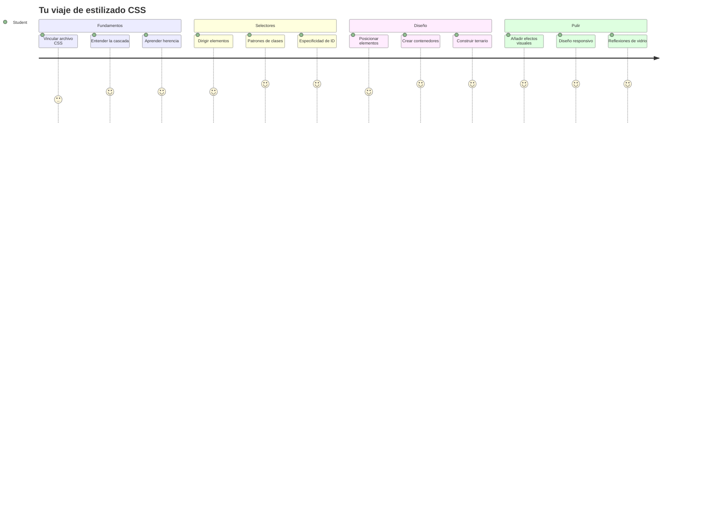
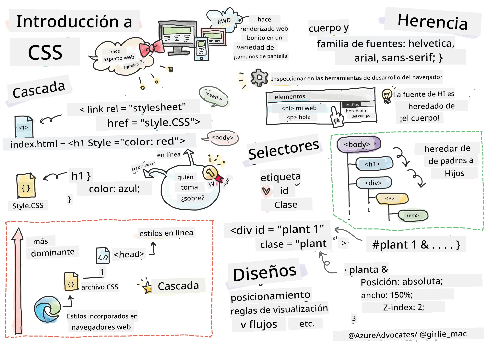
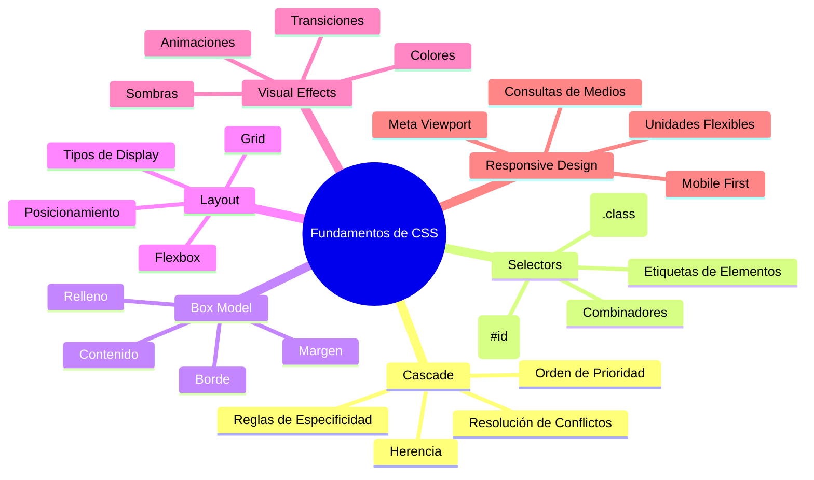
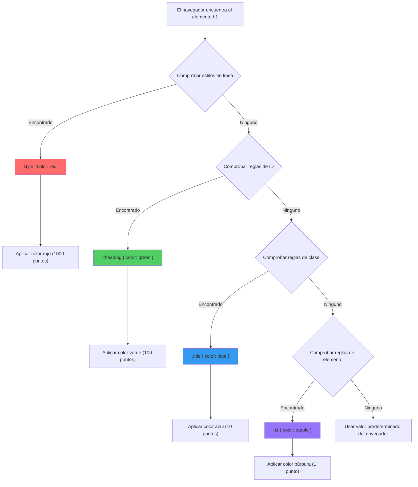
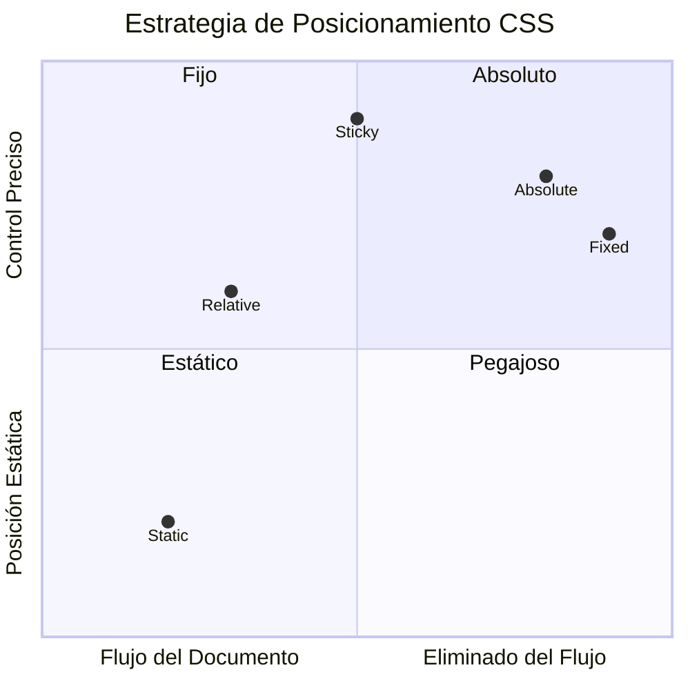
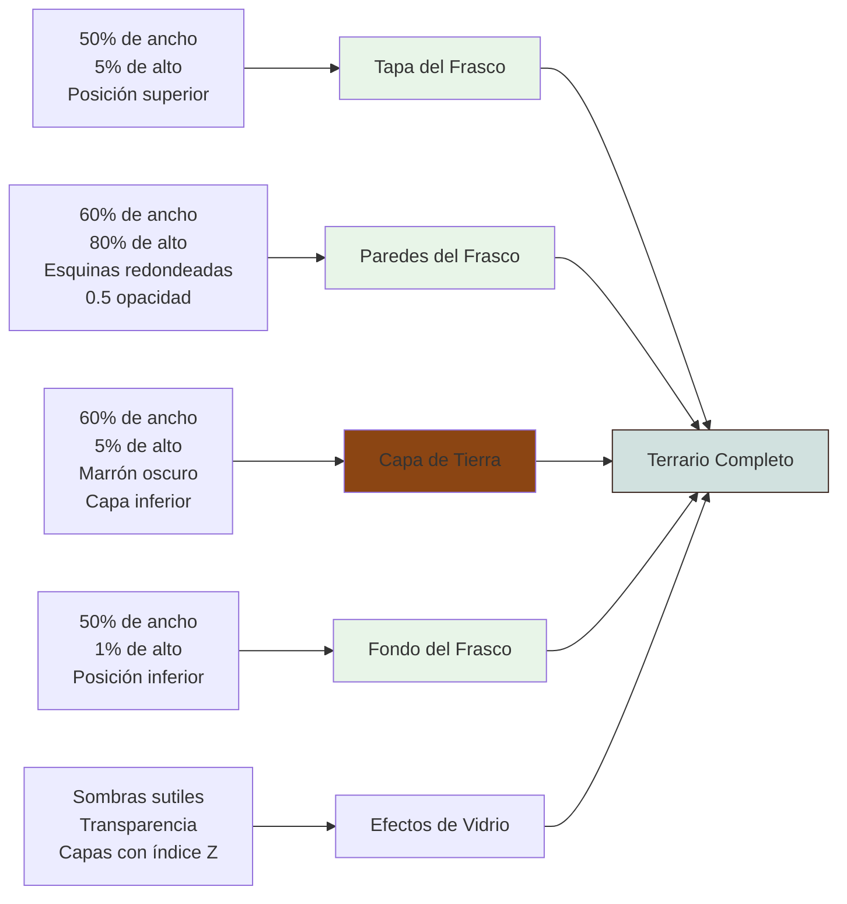
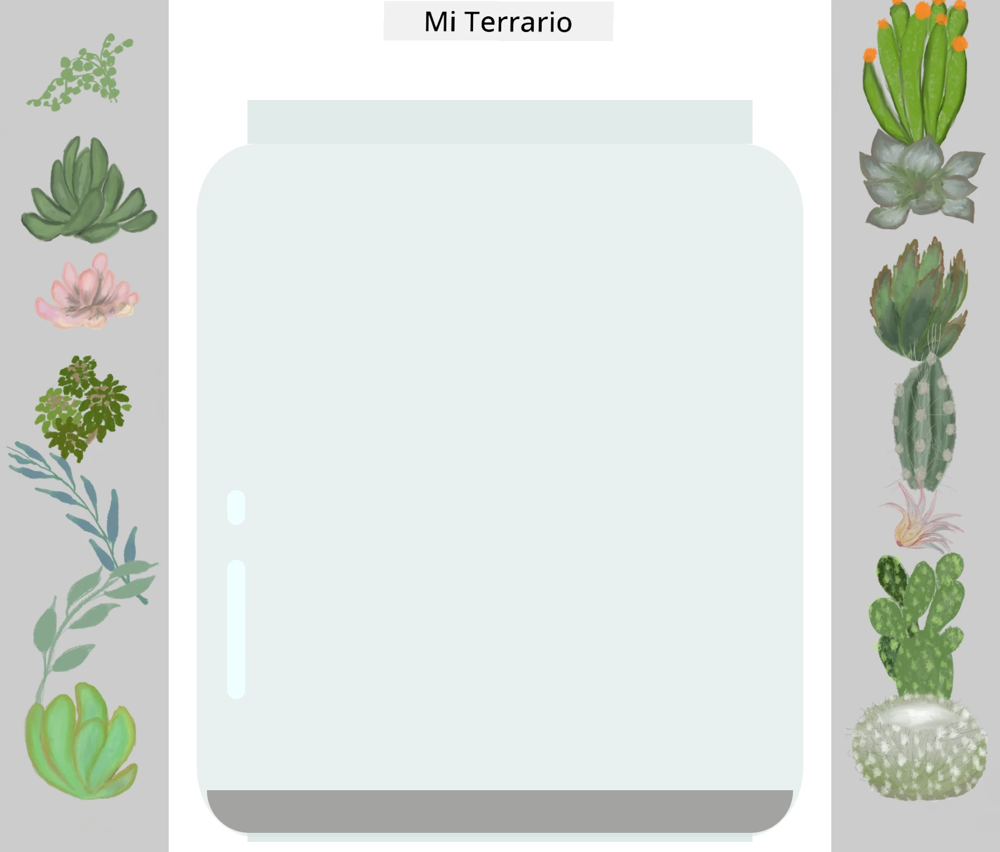
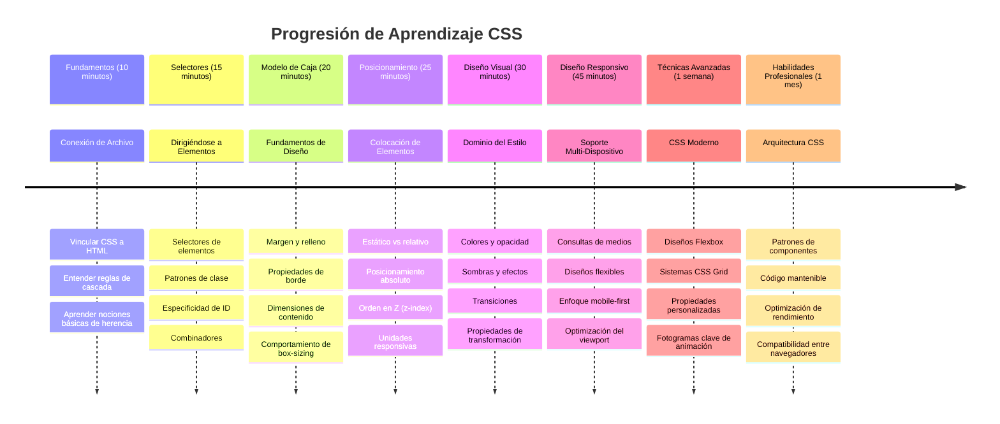

<!--
CO_OP_TRANSLATOR_METADATA:
{
  "original_hash": "e39f3a4e3bcccf94639e3af1248f8a4d",
  "translation_date": "2026-01-06T08:01:27+00:00",
  "source_file": "3-terrarium/2-intro-to-css/README.md",
  "language_code": "es"
}
-->
# Proyecto Terrario Parte 2: Introducción a CSS



> Sketchnote por [Tomomi Imura](https://twitter.com/girlie_mac)

¿Recuerdas cómo se veía tu terrario HTML bastante básico? CSS es donde transformamos esa estructura simple en algo visualmente atractivo.

Si HTML es como construir el armazón de una casa, entonces CSS es todo lo que hace que se sienta como un hogar: los colores de pintura, la disposición de los muebles, la iluminación y cómo se conectan las habitaciones. Piensa en cómo el Palacio de Versalles empezó como una simple cabaña de caza, pero la atención cuidadosa a la decoración y la distribución lo transformó en uno de los edificios más magníficos del mundo.

Hoy, transformaremos tu terrario de funcional a pulido. Aprenderás cómo posicionar elementos con precisión, hacer que los diseños respondan a diferentes tamaños de pantalla y crear el atractivo visual que hace que los sitios web sean cautivadores.

Al final de esta lección, verás cómo un estilo CSS estratégico puede mejorar dramáticamente tu proyecto. Vamos a darle estilo a tu terrario.


## Cuestionario Previo a la Lección

[Cuestionario previo a la lección](https://ff-quizzes.netlify.app/web/quiz/17)

## Primeros Pasos con CSS

CSS a menudo se piensa solo como "hacer que las cosas se vean bonitas", pero cumple un propósito mucho más amplio. CSS es como ser el director de una película: controlas no solo cómo se ve todo, sino cómo se mueve, responde a las interacciones y se adapta a diferentes situaciones.

El CSS moderno es notablemente capaz. Puedes escribir código que ajusta automáticamente los diseños para teléfonos, tabletas y computadoras de escritorio. Puedes crear animaciones suaves que guían la atención de los usuarios donde se necesita. Los resultados pueden ser bastante impresionantes cuando todo funciona junto.

> 💡 **Consejo Profesional**: CSS está siempre evolucionando con nuevas características y capacidades. Siempre verifica [CanIUse.com](https://caniuse.com) para confirmar la compatibilidad del navegador con las funciones CSS más recientes antes de usarlas en proyectos en producción.

**Esto es lo que lograremos en esta lección:**
- **Crea** un diseño visual completo para tu terrario usando técnicas modernas de CSS
- **Explora** conceptos fundamentales como la cascada, herencia y selectores CSS
- **Implementa** estrategias responsivas de posicionamiento y diseño
- **Construye** el contenedor del terrario usando formas y estilos CSS

### Requisito previo

Debes haber completado la estructura HTML de tu terrario en la lección anterior y tenerla lista para estilizar.

> 📺 **Video Recurso**: Mira este útil video explicativo  
>  
> [](https://www.youtube.com/watch?v=6yIdOIV9p1I)

### Configurando tu Archivo CSS

Antes de empezar a estilizar, necesitamos conectar CSS a nuestro HTML. Esta conexión le dice al navegador dónde encontrar las instrucciones de estilo para nuestro terrario.

En tu carpeta del terrario, crea un nuevo archivo llamado `style.css`, luego enlázalo en la sección `<head>` de tu documento HTML:

```html
<link rel="stylesheet" href="./style.css" />
```

**Esto hace el código:**
- **Crea** una conexión entre tus archivos HTML y CSS
- **Indica** al navegador que cargue y aplique los estilos de `style.css`
- **Usa** el atributo `rel="stylesheet"` para especificar que es un archivo CSS
- **Referencia** la ruta del archivo con `href="./style.css"`

## Comprendiendo la Cascada CSS

¿Alguna vez te has preguntado por qué CSS se llama Hojas de Estilo en Cascada? Los estilos caen como una cascada y a veces entran en conflicto entre sí.

Considera cómo funcionan las estructuras de mando militar: una orden general podría decir "todas las tropas usen verde", pero una orden específica para tu unidad podría decir "usen uniforme azul para la ceremonia". La instrucción más específica tiene precedencia. CSS sigue una lógica similar, y comprender esta jerarquía hace que depurar sea mucho más manejable.

### Experimentando con la Prioridad de la Cascada

Veamos la cascada en acción creando un conflicto de estilos. Primero, añade un estilo inline a tu etiqueta `<h1>`:

```html
<h1 style="color: red">My Terrarium</h1>
```

**Esto hace el código:**
- **Aplica** un color rojo directamente al elemento `<h1>` usando estilo inline
- **Usa** el atributo `style` para incrustar CSS directamente en el HTML
- **Crea** la regla de estilo con la prioridad más alta para este elemento específico

Luego, agrega esta regla a tu archivo `style.css`:

```css
h1 {
  color: blue;
}
```

**En el ejemplo anterior:**
- **Definimos** una regla CSS que apunta a todos los elementos `<h1>`
- **Establecemos** el color del texto a azul usando una hoja de estilos externa
- **Creamos** una regla con prioridad más baja comparada con estilos inline

✅ **Chequeo de Conocimiento**: ¿Qué color se muestra en tu aplicación web? ¿Por qué gana ese color? ¿Puedes pensar en escenarios donde quisieras sobreescribir estilos?


> 💡 **Orden de Prioridad de CSS (de mayor a menor):**
> 1. **Estilos inline** (atributo style)
> 2. **IDs** (#myId)
> 3. **Clases** (.myClass) y atributos
> 4. **Selectores de elementos** (h1, div, p)
> 5. **Valores predeterminados del navegador**

## Herencia CSS en Acción

La herencia CSS funciona como la genética: los elementos heredan ciertas propiedades de sus elementos padres. Si estableces la familia tipográfica en el elemento body, todo el texto dentro usa automáticamente esa misma fuente. Es similar a cómo la mandíbula distintiva de la familia Habsburgo apareció en generaciones sin ser especificada para cada individuo.

Sin embargo, no todo se hereda. Los estilos de texto como fuentes y colores sí se heredan, pero propiedades de diseño como márgenes y bordes no. Al igual que los hijos pueden heredar rasgos físicos pero no las elecciones de moda de sus padres.

### Observando la Herencia de la Fuente

Veamos la herencia en acción estableciendo una familia tipográfica en el elemento `<body>`:

```css
body {
  font-family: 'Segoe UI', Tahoma, Geneva, Verdana, sans-serif;
}
```

**Desglose de lo que sucede aquí:**
- **Establece** la familia tipográfica para toda la página apuntando al elemento `<body>`
- **Utiliza** una pila de fuentes con opciones de respaldo para mejor compatibilidad de navegadores
- **Aplica** fuentes modernas del sistema que lucen bien en distintos sistemas operativos
- **Garantiza** que todos los elementos hijos hereden esta fuente a menos que se sobrescriba específicamente

Abre las herramientas de desarrollo de tu navegador (F12), navega a la pestaña de Elementos, e inspecciona tu `<h1>`. Verás que hereda la familia tipográfica del body:


✅ **Tiempo de Experimento**: Prueba establecer otras propiedades heredables en el `<body>` como `color`, `line-height` o `text-align`. ¿Qué pasa con tu encabezado y otros elementos?

> 📝 **Propiedades Heredables Incluyen**: `color`, `font-family`, `font-size`, `line-height`, `text-align`, `visibility`
>
> **Propiedades No Heredables Incluyen**: `margin`, `padding`, `border`, `width`, `height`, `position`

### 🔄 **Chequeo Pedagógico**
**Comprensión de la Base de CSS**: Antes de pasar a los selectores, asegúrate de que puedes:
- ✅ Explicar la diferencia entre cascada y herencia
- ✅ Predecir cuál estilo ganará en un conflicto de especificidad
- ✅ Identificar qué propiedades se heredan de elementos padres
- ✅ Conectar archivos CSS correctamente al HTML

**Prueba Rápida**: Si tienes estos estilos, ¿de qué color será un `<h1>` dentro de un `<div class="special">`?
```css
div { color: blue; }
.special { color: green; }
h1 { color: red; }
```
*Respuesta: Rojo (el selector de elemento apunta directamente a h1)*

## Dominando los Selectores CSS

Los selectores CSS son tu forma de apuntar a elementos específicos para estilizar. Funcionan como dar direcciones precisas: en lugar de decir "la casa", dirías "la casa azul con la puerta roja en Maple Street".

CSS provee diferentes formas de ser específico, y elegir el selector correcto es como elegir la herramienta apropiada para la tarea. A veces necesitas estilizar cada puerta del vecindario, y otras solo una puerta específica.

### Selectores de Elemento (Etiquetas)

Los selectores de elemento apuntan a los elementos HTML por su nombre de etiqueta. Son perfectos para establecer estilos base que se aplican ampliamente en tu página:

```css
body {
  font-family: 'Segoe UI', Tahoma, Geneva, Verdana, sans-serif;
  margin: 0;
  padding: 0;
}

h1 {
  color: #3a241d;
  text-align: center;
  font-size: 2.5rem;
  margin-bottom: 1rem;
}
```

**Comprendiendo estos estilos:**
- **Establece** tipografía consistente en toda la página con el selector `body`
- **Quita** márgenes y rellenos predeterminados del navegador para mejor control
- **Estiliza** todos los encabezados con color, alineación y espaciado
- **Usa** unidades `rem` para tamaños de fuente escalables y accesibles

Mientras los selectores de elemento funcionan bien para estilos generales, necesitarás selectores más específicos para estilizar componentes individuales como las plantas de tu terrario.

### Selectores ID para Elementos Únicos

Los selectores ID usan el símbolo `#` y apuntan a elementos con atributos `id` específicos. Como los IDs deben ser únicos en la página, son perfectos para estilizar elementos individuales y especiales como los contenedores de plantas izquierdo y derecho.

Creamos el estilo para los contenedores laterales de nuestro terrario donde vivirán las plantas:

```css
#left-container {
  background-color: #f5f5f5;
  width: 15%;
  left: 0;
  top: 0;
  position: absolute;
  height: 100vh;
  padding: 1rem;
  box-sizing: border-box;
}

#right-container {
  background-color: #f5f5f5;
  width: 15%;
  right: 0;
  top: 0;
  position: absolute;
  height: 100vh;
  padding: 1rem;
  box-sizing: border-box;
}
```

**Esto logra este código:**
- **Posiciona** los contenedores en los extremos izquierdo y derecho usando posicionamiento `absolute`
- **Usa** unidades `vh` (altura de ventana) para una altura responsiva que se adapta al tamaño de pantalla
- **Aplica** `box-sizing: border-box` para incluir el padding en el ancho total
- **Elimina** unidades `px` innecesarias en valores cero para código más limpio
- **Define** un color de fondo sutil que es menos agresivo que un gris fuerte

✅ **Desafío de Calidad de Código**: Nota cómo este CSS viola el principio DRY (No te repitas). ¿Puedes refactorizarlo usando tanto un ID como una clase?

**Enfoque mejorado:**
```html
<div id="left-container" class="container"></div>
<div id="right-container" class="container"></div>
```

```css
.container {
  background-color: #f5f5f5;
  width: 15%;
  top: 0;
  position: absolute;
  height: 100vh;
  padding: 1rem;
  box-sizing: border-box;
}

#left-container {
  left: 0;
}

#right-container {
  right: 0;
}
```

### Selectores de Clase para Estilos Reutilizables

Los selectores de clase usan el símbolo `.` y son perfectos cuando quieres aplicar el mismo estilo a múltiples elementos. A diferencia de los IDs, las clases pueden usarse varias veces en tu HTML, lo que las hace ideales para patrones de estilo consistentes.

En nuestro terrario, cada planta necesita un estilo similar pero también necesita posicionamiento individual. Usaremos una combinación de clases para estilos compartidos y IDs para posicionamiento único.

**Esta es la estructura HTML para cada planta:**
```html
<div class="plant-holder">
  
</div>
```

**Elementos clave explicados:**
- **Usa** `class="plant-holder"` para un estilo consistente del contenedor en todas las plantas
- **Aplica** `class="plant"` para el estilo e interacción compartida de las imágenes
- **Incluye** un único `id="plant1"` para posicionamiento individual e interacción JavaScript
- **Proporciona** texto alternativo descriptivo para accesibilidad en lectores de pantalla

Ahora agrega estos estilos a tu archivo `style.css`:

```css
.plant-holder {
  position: relative;
  height: 13%;
  left: -0.6rem;
}

.plant {
  position: absolute;
  max-width: 150%;
  max-height: 150%;
  z-index: 2;
  transition: transform 0.3s ease;
}

.plant:hover {
  transform: scale(1.05);
}
```

**Desglose de estos estilos:**
- **Crea** posicionamiento relativo para el contenedor de planta y establecer el contexto de posicionamiento
- **Establece** la altura de cada contenedor de planta en 13%, asegurando que todas las plantas quepan verticalmente sin scroll
- **Desplaza** ligeramente los contenedores a la izquierda para centrar mejor las plantas dentro
- **Permite** que las plantas se escalen responsivamente con propiedades `max-width` y `max-height`
- **Usa** `z-index` para colocar las plantas encima de otros elementos del terrario
- **Añade** un sutil efecto hover con transiciones CSS para mejor interacción del usuario

✅ **Pensamiento Crítico**: ¿Por qué necesitamos ambos selectores `.plant-holder` y `.plant`? ¿Qué pasaría si intentáramos usar solo uno?

> 💡 **Patrón de Diseño**: El contenedor (`.plant-holder`) controla el diseño y posicionamiento, mientras el contenido (`.plant`) controla la apariencia y el escalado. Esta separación hace el código más mantenible y flexible.

## Entendiendo el Posicionamiento CSS

El posicionamiento CSS es como ser el director del escenario en una obra de teatro: decides dónde se para cada actor y cómo se mueve por el escenario. Algunos actores siguen la formación estándar, mientras que otros necesitan posicionamiento específico para un efecto dramático.

Una vez que entiendes el posicionamiento, muchos desafíos de diseño se vuelven manejables. ¿Necesitas una barra de navegación que se quede arriba mientras el usuario hace scroll? El posicionamiento lo maneja. ¿Quieres un tooltip que aparezca en un lugar específico? Eso también es manejo de posicionamiento.

### Los Cinco Valores de Posición


| Valor de Posición | Comportamiento | Caso de Uso |
|------------------|----------------|-------------|
| `static` | Flujo predeterminado, ignora top/left/right/bottom | Diseño normal del documento |
| `relative` | Posicionado relativo a su posición normal | Ajustes pequeños, crear contexto de posicionamiento |
| `absolute` | Posicionado relativo al ancestro más cercano posicionado | Ubicación precisa, superposiciones |
| `fixed` | Posicionado relativo a la ventana del navegador | Barras de navegación, elementos flotantes |
| `sticky` | Cambia entre relativo y fijo según scroll | Encabezados que se quedan pegados al desplazar |

### Posicionamiento en Nuestro Terrario

Nuestro terrario usa una combinación estratégica de tipos de posicionamiento para crear el diseño deseado:

```css
/* Container positioning */
.container {
  position: absolute; /* Removes from normal flow */
  /* ... other styles ... */
}

/* Plant holder positioning */
.plant-holder {
  position: relative; /* Creates positioning context */
  /* ... other styles ... */
}

/* Plant positioning */
.plant {
  position: absolute; /* Allows precise placement within holder */
  /* ... other styles ... */
}
```

**Entendiendo la estrategia de posicionamiento:**
- **Contenedores absolutos** están fuera del flujo normal y anclados a los bordes de la pantalla
- **Contenedores de plantas relativos** crean un contexto de posicionamiento manteniéndose en el flujo del documento
- **Plantas absolutas** pueden posicionarse con precisión dentro de sus contenedores relativos
- **Esta combinación** permite que las plantas se apilen verticalmente y sean posicionables individualmente

> 🎯 **Por qué es Importante**: Los elementos `plant` necesitan posicionamiento absoluto para poder ser arrastrables en la próxima lección. El posicionamiento absoluto los saca del flujo normal, permitiendo interacciones de arrastrar y soltar.

✅ **Tiempo de Experimento**: Prueba cambiar los valores de posicionamiento y observa los resultados:
- ¿Qué pasa si cambias `.container` de `absolute` a `relative`?
- ¿Cómo cambia el diseño si `.plant-holder` usa `absolute` en lugar de `relative`?
- ¿Qué ocurre cuando cambias la posición de `.plant` a `relative`?

### 🔄 **Chequeo Pedagógico**
**Dominio de Posicionamiento CSS**: Pausa para verificar tu comprensión:
- ✅ ¿Puedes explicar por qué las plantas necesitan posicionamiento absoluto para drag-and-drop?
- ✅ ¿Entiendes cómo los contenedores relativos crean contexto de posicionamiento?
- ✅ ¿Por qué los contenedores laterales usan posicionamiento absoluto?
- ✅ ¿Qué pasaría si eliminaras completamente las declaraciones de posición?

**Conexión con el Mundo Real**: Piensa en cómo el posicionamiento CSS refleja el diseño del mundo real:
- **Static**: Libros en una estantería (orden natural)
- **Relative**: Mover ligeramente un libro pero mantener su lugar
- **Absolute**: Colocar un marcador en una página exacta
- **Fixed**: Una nota adhesiva que permanece visible mientras pasas las páginas

## Construyendo el Terrario con CSS

Ahora construiremos un frasco de vidrio usando solo CSS, sin imágenes ni software gráfico.

Crear efectos realistas de vidrio, sombras y profundidad usando posicionamiento y transparencia demuestra las capacidades visuales de CSS. Esta técnica es similar a cómo los arquitectos del movimiento Bauhaus usaban formas geométricas simples para crear estructuras complejas y bellas. Una vez que comprendas estos principios, reconocerás las técnicas CSS detrás de muchos diseños web.


### Creando los Componentes del Frasco de Vidrio

Construyamos el frasco del terrario pieza por pieza. Cada parte usa posicionamiento absoluto y tamaños basados en porcentajes para diseño responsivo:

```css
.jar-walls {
  height: 80%;
  width: 60%;
  background: #d1e1df;
  border-radius: 1rem;
  position: absolute;
  bottom: 0.5%;
  left: 20%;
  opacity: 0.5;
  z-index: 1;
  box-shadow: inset 0 0 2rem rgba(0, 0, 0, 0.1);
}

.jar-top {
  width: 50%;
  height: 5%;
  background: #d1e1df;
  position: absolute;
  bottom: 80.5%;
  left: 25%;
  opacity: 0.7;
  z-index: 1;
  border-radius: 0.5rem 0.5rem 0 0;
}

.jar-bottom {
  width: 50%;
  height: 1%;
  background: #d1e1df;
  position: absolute;
  bottom: 0;
  left: 25%;
  opacity: 0.7;
  border-radius: 0 0 0.5rem 0.5rem;
}

.dirt {
  width: 60%;
  height: 5%;
  background: #3a241d;
  position: absolute;
  border-radius: 0 0 1rem 1rem;
  bottom: 1%;
  left: 20%;
  opacity: 0.7;
  z-index: -1;
}
```

**Entendiendo la construcción del terrario:**
- **Usa** dimensiones basadas en porcentajes para un escalado responsivo en todos los tamaños de pantalla
- **Posiciona** los elementos absolutamente para apilarlos y alinearlos con precisión
- **Aplica** distintos valores de opacidad para crear el efecto de transparencia del vidrio
- **Implementa** capas con `z-index` para que las plantas aparezcan dentro del frasco
- **Agrega** sombras sutiles y bordes redondeados refinados para una apariencia más realista

### Diseño Responsivo con Porcentajes

Observa cómo todas las dimensiones usan porcentajes en lugar de valores fijos en píxeles:

**Por qué esto importa:**
- **Garantiza** que el terrario escale proporcionalmente en cualquier tamaño de pantalla
- **Mantiene** las relaciones visuales entre los componentes del frasco
- **Proporciona** una experiencia coherente desde móviles hasta grandes monitores de escritorio
- **Permite** que el diseño se adapte sin romper el layout visual

### Unidades CSS en Acción

Estamos usando unidades `rem` para el `border-radius`, que escalan en relación al tamaño de fuente raíz. Esto crea diseños más accesibles que respetan las preferencias de fuente del usuario. Aprende más sobre [unidades relativas en CSS](https://www.w3.org/TR/css-values-3/#font-relative-lengths) en la especificación oficial.

✅ **Experimentación Visual**: Intenta modificar estos valores y observa los efectos:
- Cambia la opacidad del frasco de 0.5 a 0.8 – ¿cómo afecta esto la apariencia del vidrio?
- Ajusta el color de la tierra de `#3a241d` a `#8B4513` – ¿qué impacto visual tiene?
- Modifica el `z-index` de la tierra a 2 – ¿qué ocurre con el orden de las capas?

### 🔄 **Chequeo Pedagógico**
**Comprensión Visual CSS**: Confirma tu entendimiento del diseño visual en CSS:
- ✅ ¿Cómo las dimensiones basadas en porcentaje crean diseño responsivo?
- ✅ ¿Por qué la opacidad crea el efecto de transparencia del vidrio?
- ✅ ¿Qué rol juega el z-index en la superposición de elementos?
- ✅ ¿Cómo los valores de border-radius crean la forma del frasco?

**Principio de Diseño**: Observa cómo construimos visuales complejos a partir de formas simples:
1. **Rectángulos** → **Rectángulos redondeados** → **Componentes del frasco**
2. **Colores planos** → **Opacidad** → **Efecto vidrio**
3. **Elementos individuales** → **Composición en capas** → **Apariencia 3D**

---

## Reto GitHub Copilot Agent 🚀

Usa el modo Agent para completar el siguiente reto:

**Descripción:** Crea una animación CSS que haga que las plantas del terrario se muevan suavemente de un lado a otro, simulando una brisa natural. Esto te ayudará a practicar animaciones CSS, transformaciones y keyframes mientras mejoras el atractivo visual de tu terrario.

**Indicaciones:** Añade animaciones keyframe en CSS para que las plantas del terrario se balanceen suavemente de lado a lado. Crea una animación de balanceo que rote cada planta ligeramente (2-3 grados) hacia la izquierda y derecha con una duración de 3-4 segundos, y aplícalo a la clase `.plant`. Asegúrate de que la animación se repita infinitamente y tenga una función de easing para un movimiento natural.

Aprende más sobre [modo agent](https://code.visualstudio.com/blogs/2025/02/24/introducing-copilot-agent-mode) aquí.

## 🚀 Reto: Agregar Reflejos al Vidrio

¿Listo para mejorar tu terrario con reflejos realistas en el vidrio? Esta técnica añadirá profundidad y realismo al diseño.

Crearás reflejos sutiles que simulan cómo la luz se refleja en las superficies de vidrio. Este enfoque es similar a cómo los pintores renacentistas como Jan van Eyck usaban la luz y reflexión para dar volumen tridimensional a los vidrios pintados. Esto es lo que buscas lograr:



**Tu desafío:**
- **Crear** formas ovaladas sutiles blancas o de colores claros para los reflejos del vidrio
- **Posicionarlas** estratégicamente en el lado izquierdo del frasco
- **Aplicar** opacidad y efectos de desenfoque apropiados para reflejos realistas
- **Usar** `border-radius` para crear formas orgánicas tipo burbuja
- **Experimentar** con degradados o sombras para mayor realismo

## Quiz Posterior a la Clase

[Quiz posterior a la clase](https://ff-quizzes.netlify.app/web/quiz/18)

## Amplía Tu Conocimiento en CSS

CSS puede resultar complejo al principio, pero comprender estos conceptos básicos proporciona una base sólida para técnicas más avanzadas.

**Tus próximas áreas de aprendizaje CSS:**
- **Flexbox** - simplifica la alineación y distribución de elementos
- **CSS Grid** - ofrece herramientas potentes para crear layouts complejos
- **Variables CSS** - reduce la repetición y mejora el mantenimiento
- **Diseño responsivo** - asegura que los sitios funcionen bien en diferentes tamaños de pantalla

### Recursos Interactivos de Aprendizaje

Practica estos conceptos con estos juegos atractivos y prácticos:
- 🐸 [Flexbox Froggy](https://flexboxfroggy.com/) - Domina Flexbox con desafíos divertidos
- 🌱 [Grid Garden](https://codepip.com/games/grid-garden/) - Aprende CSS Grid cultivando zanahorias virtuales
- 🎯 [CSS Battle](https://cssbattle.dev/) - Pon a prueba tus habilidades CSS con desafíos de código

### Aprendizaje Adicional

Para fundamentos completos de CSS, completa este módulo de Microsoft Learn: [Estiliza tu app HTML con CSS](https://docs.microsoft.com/learn/modules/build-simple-website/4-css-basics/?WT.mc_id=academic-77807-sagibbon)

### ⚡ **Lo que puedes hacer en los próximos 5 minutos**
- [ ] Abre DevTools e inspecciona estilos CSS en cualquier sitio web usando el panel Elementos
- [ ] Crea un archivo CSS simple y enlázalo a una página HTML
- [ ] Prueba cambiar colores usando diferentes métodos: hex, RGB y nombres de colores
- [ ] Practica el modelo de caja añadiendo padding y margen a un div

### 🎯 **Lo que puedes lograr en esta hora**
- [ ] Completa el quiz post-lección y repasa fundamentos CSS
- [ ] Estiliza tu página HTML con fuentes, colores y espacios
- [ ] Crea un layout simple usando flexbox o grid
- [ ] Experimenta con transiciones CSS para efectos suaves
- [ ] Practica diseño responsivo con media queries

### 📅 **Tu aventura CSS de una semana**
- [ ] Completa la tarea de estilizado del terrario con creatividad
- [ ] Domina CSS Grid construyendo un layout de galería de fotos
- [ ] Aprende animaciones CSS para dar vida a tus diseños
- [ ] Explora preprocesadores CSS como Sass o Less
- [ ] Estudia principios de diseño y aplícalos a tu CSS
- [ ] Analiza y recrea diseños interesantes que encuentres en línea

### 🌟 **Tu dominio del diseño en un mes**
- [ ] Construye un sistema completo de diseño web responsivo
- [ ] Aprende CSS-in-JS o frameworks utility-first como Tailwind
- [ ] Contribuye a proyectos open source mejorando CSS
- [ ] Domina conceptos avanzados como propiedades personalizadas y containment
- [ ] Crea bibliotecas de componentes reutilizables con CSS modular
- [ ] Mentoriza a otros aprendiendo CSS y comparte conocimientos de diseño

## 🎯 Tu Cronograma para Dominar CSS


### 🛠️ Resumen de tu Caja de Herramientas CSS

Después de completar esta lección, ahora tienes:
- **Comprensión del Cascade**: Cómo los estilos heredan y se sobreescriben
- **Dominio de Selectores**: Dirección precisa con elementos, clases e IDs
- **Habilidades de Posicionamiento**: Colocación estratégica y orden de elementos
- **Diseño Visual**: Creación de efectos de vidrio, sombras y transparencia
- **Técnicas Responsivas**: Layouts basados en porcentajes que se adaptan a cualquier pantalla
- **Organización de Código**: CSS limpio y mantenible
- **Prácticas Modernas**: Uso de unidades relativas y patrones de diseño accesibles

**Próximos Pasos**: Tu terrario ahora tiene estructura (HTML) y estilo (CSS). ¡La lección final añadirá interactividad con JavaScript!

## Tarea

[Refactorización CSS](assignment.md)

---

<!-- CO-OP TRANSLATOR DISCLAIMER START -->
**Aviso Legal**:
Este documento ha sido traducido utilizando el servicio de traducción automática [Co-op Translator](https://github.com/Azure/co-op-translator). Aunque nos esforzamos por lograr precisión, tenga en cuenta que las traducciones automatizadas pueden contener errores o imprecisiones. El documento original en su idioma nativo debe considerarse la fuente autorizada. Para información crítica, se recomienda la traducción profesional humana. No nos responsabilizamos por malentendidos o interpretaciones erróneas derivadas del uso de esta traducción.
<!-- CO-OP TRANSLATOR DISCLAIMER END -->