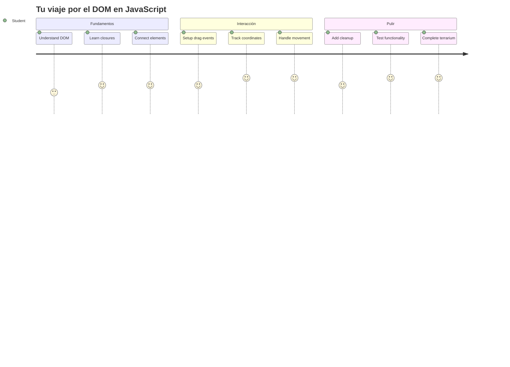
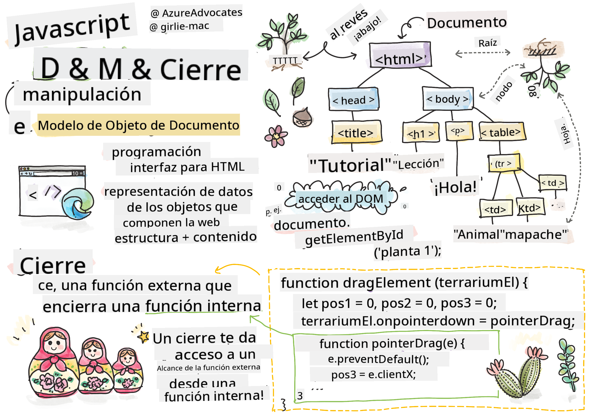
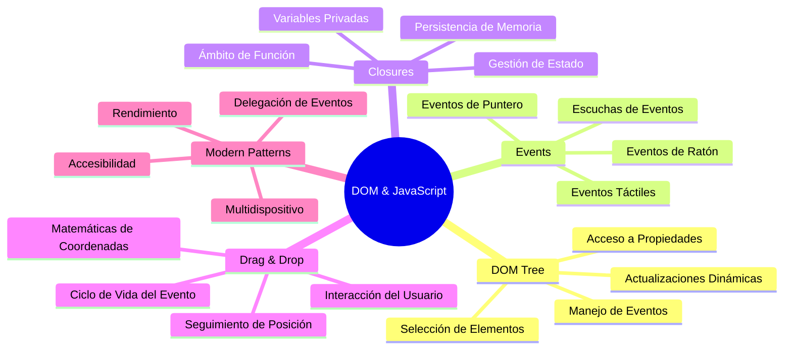
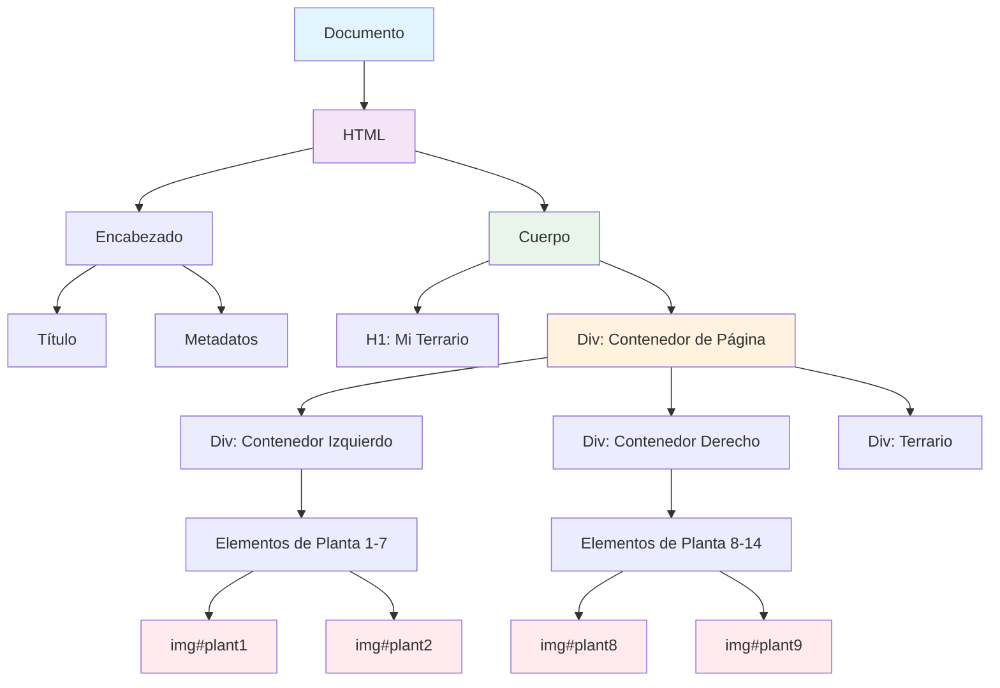
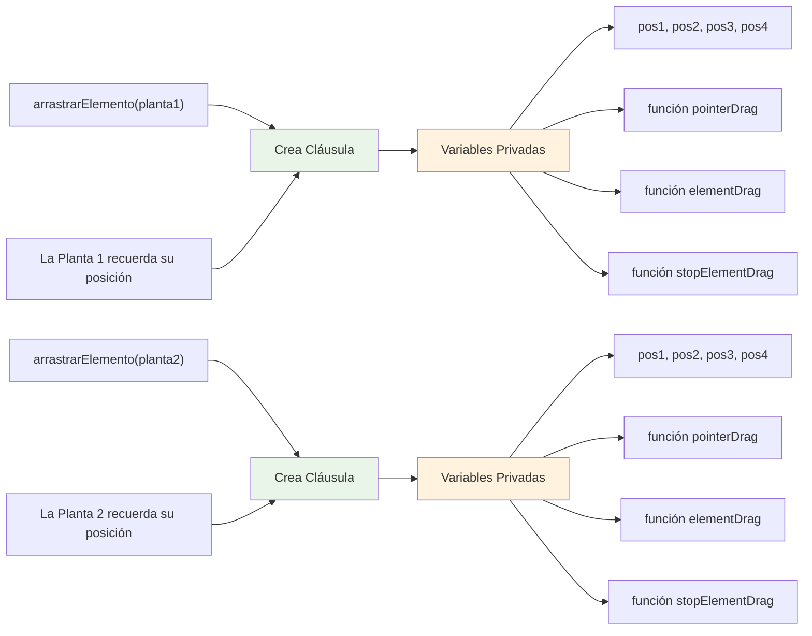
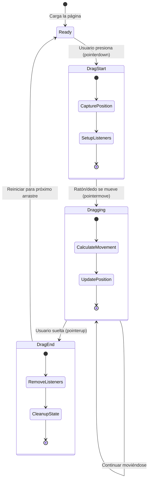
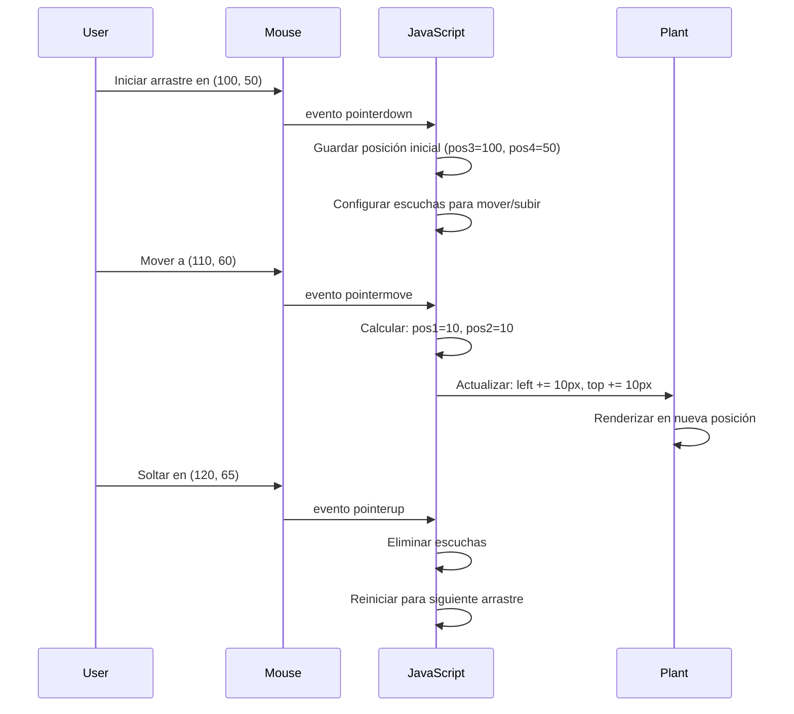
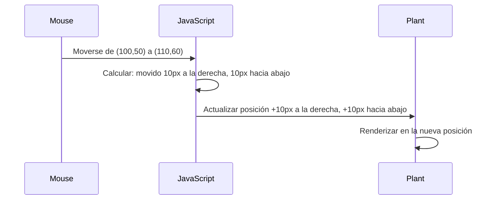
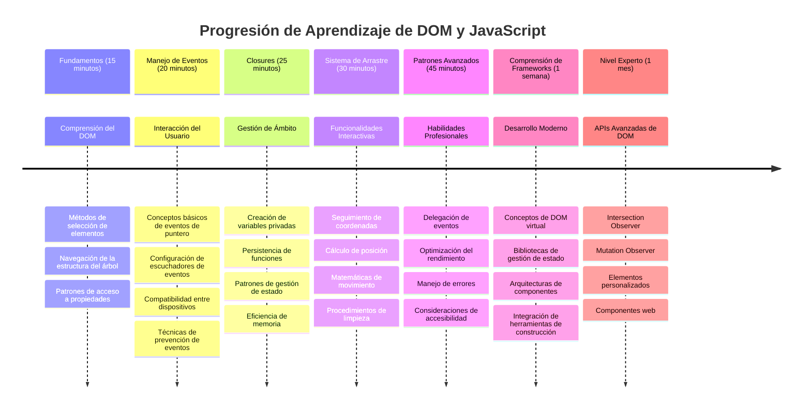

<!--
CO_OP_TRANSLATOR_METADATA:
{
  "original_hash": "973e48ad87d67bf5bb819746c9f8e302",
  "translation_date": "2026-01-06T07:58:23+00:00",
  "source_file": "3-terrarium/3-intro-to-DOM-and-closures/README.md",
  "language_code": "es"
}
-->
# Proyecto Terrario Parte 3: Manipulación del DOM y Closures en JavaScript



> Sketchnote por [Tomomi Imura](https://twitter.com/girlie_mac)

Bienvenido a uno de los aspectos más atractivos del desarrollo web: ¡hacer que las cosas sean interactivas! El Modelo de Objetos del Documento (DOM) es como un puente entre tu HTML y JavaScript, y hoy lo usaremos para dar vida a tu terrario. Cuando Tim Berners-Lee creó el primer navegador web, imaginó una web donde los documentos pudieran ser dinámicos e interactivos; el DOM hace posible esa visión.

También exploraremos los closures en JavaScript, que pueden sonar intimidantes al principio. Piensa en los closures como la creación de "bolsillos de memoria" donde tus funciones pueden recordar información importante. Es como si cada planta en tu terrario tuviera su propio registro de datos para rastrear su posición. Al final de esta lección, entenderás lo naturales y útiles que son.

Esto es lo que vamos a construir: un terrario donde los usuarios puedan arrastrar y soltar plantas donde quieran. Aprenderás las técnicas de manipulación del DOM que impulsan desde cargas de archivos arrastrando hasta juegos interactivos. Hagamos que tu terrario cobre vida.


## Cuestionario Previo a la Lección

[Cuestionario previo a la lección](https://ff-quizzes.netlify.app/web/quiz/19)

## Entendiendo el DOM: Tu Puerta a Páginas Web Interactivas

El Modelo de Objetos del Documento (DOM) es la forma en que JavaScript se comunica con tus elementos HTML. Cuando tu navegador carga una página HTML, crea una representación estructurada de esa página en memoria: eso es el DOM. Piénsalo como un árbol genealógico donde cada elemento HTML es un miembro de la familia al que JavaScript puede acceder, modificar o reorganizar.

La manipulación del DOM transforma páginas estáticas en sitios web interactivos. Cada vez que ves un botón cambiar de color al pasar el cursor, contenido que se actualiza sin refrescar la página o elementos que puedes arrastrar, eso es manipulación del DOM en acción.




> Una representación del DOM y el marcado HTML que lo referencia. De [Olfa Nasraoui](https://www.researchgate.net/publication/221417012_Profile-Based_Focused_Crawler_for_Social_Media-Sharing_Websites)

**Esto es lo que hace poderoso al DOM:**
- **Proporciona** una manera estructurada de acceder a cualquier elemento en tu página
- **Permite** actualizaciones dinámicas de contenido sin refrescar la página
- **Facilita** respuestas en tiempo real a interacciones del usuario como clics y arrastres
- **Crea** la base para aplicaciones web interactivas modernas

## Closures en JavaScript: Creando Código Organizado y Potente

Un [closure en JavaScript](https://developer.mozilla.org/docs/Web/JavaScript/Closures) es como darle a una función su propio espacio privado de trabajo con memoria persistente. Considera cómo los pinzones de Darwin en las Islas Galápagos desarrollaron picos especializados según su ambiente específico: los closures funcionan de manera similar, creando funciones especializadas que "recuerdan" su contexto específico incluso después de que su función padre ha terminado.

En nuestro terrario, los closures ayudan a que cada planta recuerde su propia posición independientemente. Este patrón aparece a lo largo del desarrollo profesional de JavaScript, haciéndolo un concepto valioso a entender.


> 💡 **Entendiendo los Closures**: Los closures son un tema importante en JavaScript, y muchos desarrolladores los usan durante años antes de comprender completamente todos sus aspectos teóricos. Hoy nos concentramos en la aplicación práctica: verás closures emerger naturalmente mientras construimos nuestras características interactivas. La comprensión se desarrollará a medida que veas cómo solucionan problemas reales.


> Una representación del DOM y el marcado HTML que lo referencia. De [Olfa Nasraoui](https://www.researchgate.net/publication/221417012_Profile-Based_Focused_Crawler_for_Social_Media-Sharing_Websites)

En esta lección, completaremos nuestro proyecto interactivo de terrario creando el JavaScript que permitirá a un usuario manipular las plantas en la página.

## Antes de Comenzar: Preparándonos para el Éxito

Necesitarás tus archivos HTML y CSS de las lecciones anteriores del terrario: estamos a punto de hacer que ese diseño estático sea interactivo. Si te unes por primera vez, completar esas lecciones primero te dará un contexto importante.

Esto es lo que construiremos:
- **Arrastrar y soltar suave** para todas las plantas del terrario
- **Rastreo de coordenadas** para que las plantas recuerden sus posiciones
- **Una interfaz interactiva completa** usando JavaScript puro (vanilla)
- **Código limpio y organizado** usando patrones de closure

## Configurando Tu Archivo JavaScript

Vamos a crear el archivo JavaScript que hará que tu terrario sea interactivo.

**Paso 1: Crea tu archivo de script**

En tu carpeta del terrario, crea un nuevo archivo llamado `script.js`.

**Paso 2: Vincula el JavaScript a tu HTML**

Agrega esta etiqueta de script en la sección `<head>` de tu archivo `index.html`:

```html
<script src="./script.js" defer></script>
```

**Por qué es importante el atributo `defer`:**
- **Garantiza** que tu JavaScript espere hasta que todo el HTML esté cargado
- **Previene** errores donde JavaScript busca elementos que aún no están listos
- **Asegura** que todos tus elementos de plantas estén disponibles para interacción
- **Ofrece** mejor rendimiento que colocar scripts al final de la página

> ⚠️ **Nota Importante**: El atributo `defer` previene problemas comunes de sincronización. Sin él, JavaScript podría intentar acceder a elementos HTML antes de que estén cargados, causando errores.

---

## Conectando JavaScript con Tus Elementos HTML

Antes de que podamos hacer que los elementos sean arrastrables, JavaScript necesita localizarlos en el DOM. Piénsalo como un sistema de catálogo en una biblioteca: una vez que tienes el número del catálogo, puedes encontrar exactamente el libro que necesitas y acceder a todo su contenido.

Usaremos el método `document.getElementById()` para hacer estas conexiones. Es como tener un sistema de archivo preciso: proporcionas un ID y localiza exactamente el elemento que necesitas en tu HTML.

### Habilitando la Funcionalidad de Arrastrar para Todas las Plantas

Agrega este código a tu archivo `script.js`:

```javascript
// Habilitar la funcionalidad de arrastrar para las 14 plantas
dragElement(document.getElementById('plant1'));
dragElement(document.getElementById('plant2'));
dragElement(document.getElementById('plant3'));
dragElement(document.getElementById('plant4'));
dragElement(document.getElementById('plant5'));
dragElement(document.getElementById('plant6'));
dragElement(document.getElementById('plant7'));
dragElement(document.getElementById('plant8'));
dragElement(document.getElementById('plant9'));
dragElement(document.getElementById('plant10'));
dragElement(document.getElementById('plant11'));
dragElement(document.getElementById('plant12'));
dragElement(document.getElementById('plant13'));
dragElement(document.getElementById('plant14'));
```

**Esto es lo que logra este código:**
- **Localiza** cada elemento de planta en el DOM usando su ID único
- **Recupera** una referencia JavaScript a cada elemento HTML
- **Pasa** cada elemento a una función `dragElement` (que crearemos a continuación)
- **Prepara** cada planta para la interacción de arrastrar y soltar
- **Conecta** tu estructura HTML con la funcionalidad JavaScript

> 🎯 **¿Por qué Usar IDs en Lugar de Clases?** Los IDs proporcionan identificadores únicos para elementos específicos, mientras que las clases CSS están diseñadas para estilizar grupos de elementos. Cuando JavaScript necesita manipular elementos individuales, los IDs ofrecen la precisión y el rendimiento que necesitamos.

> 💡 **Consejo Profesional**: Observa cómo llamamos a `dragElement()` para cada planta individualmente. Este enfoque asegura que cada planta tenga su propio comportamiento independiente al arrastrar, lo cual es esencial para una interacción fluida del usuario.

### 🔄 **Chequeo Pedagógico**
**Entendiendo la Conexión DOM**: Antes de pasar a la funcionalidad de arrastrar, verifica que puedes:
- ✅ Explicar cómo `document.getElementById()` localiza elementos HTML
- ✅ Entender por qué usamos IDs únicos para cada planta
- ✅ Describir el propósito del atributo `defer` en las etiquetas de script
- ✅ Reconocer cómo JavaScript y HTML se conectan a través del DOM

**Autoevaluación Rápida**: ¿Qué ocurriría si dos elementos tuvieran el mismo ID? ¿Por qué `getElementById()` devuelve solo un elemento?  
*Respuesta: Los IDs deben ser únicos; si hay duplicados, solo se devuelve el primer elemento*

---

## Construyendo el Closure para el Elemento Arrastrable

Ahora crearemos el núcleo de nuestra funcionalidad de arrastre: un closure que maneja el comportamiento de arrastrar para cada planta. Este closure contendrá varias funciones internas que trabajan juntas para rastrear movimientos del mouse y actualizar posiciones de elementos.

Los closures son perfectos para esta tarea porque nos permiten crear variables "privadas" que persisten entre llamadas de función, dando a cada planta su propio sistema independiente de rastreo de coordenadas.

### Entendiendo los Closures con un Ejemplo Simple

Déjame mostrarte closures con un ejemplo simple que ilustra el concepto:

```javascript
function createCounter() {
    let count = 0; // Esto es como una variable privada
    
    function increment() {
        count++; // La función interna recuerda la variable externa
        return count;
    }
    
    return increment; // Estamos devolviendo la función interna
}

const myCounter = createCounter();
console.log(myCounter()); // 1
console.log(myCounter()); // 2
```

**Esto es lo que está ocurriendo en este patrón de closure:**
- **Crea** una variable privada `count` que solo existe dentro de este closure
- **La función interna** puede acceder y modificar esa variable externa (mecanismo del closure)
- **Cuando retornamos** la función interna, mantiene su conexión con esos datos privados
- **Incluso después** de que `createCounter()` termina su ejecución, `count` persiste y recuerda su valor

### Por Qué los Closures Son Perfectos para Funcionalidad de Arrastre

Para nuestro terrario, cada planta necesita recordar sus coordenadas actuales de posición. Los closures brindan la solución perfecta:

**Beneficios clave para nuestro proyecto:**
- **Mantiene** variables de posición privadas para cada planta independientemente
- **Preserva** los datos de coordenadas entre eventos de arrastre
- **Previene** conflictos de variables entre diferentes elementos arrastrables
- **Crea** una estructura de código limpia y organizada

> 🎯 **Meta de Aprendizaje**: No necesitas dominar todos los aspectos de los closures ahora mismo. Enfócate en ver cómo nos ayudan a organizar el código y mantener el estado para nuestra funcionalidad de arrastrar.


### Creando la Función dragElement

Ahora construyamos la función principal que manejará toda la lógica del arrastre. Añade esta función debajo de las declaraciones de tus elementos planta:

```javascript
function dragElement(terrariumElement) {
    // Inicializar variables de seguimiento de posición
    let pos1 = 0,  // Posición X previa del ratón
        pos2 = 0,  // Posición Y previa del ratón
        pos3 = 0,  // Posición X actual del ratón
        pos4 = 0;  // Posición Y actual del ratón
    
    // Configurar el listener inicial del evento de arrastre
    terrariumElement.onpointerdown = pointerDrag;
}
```

**Entendiendo el sistema de rastreo de posición:**
- **`pos1` y `pos2`**: Almacenan la diferencia entre las posiciones vieja y nueva del mouse
- **`pos3` y `pos4`**: Rastrean las coordenadas actuales del mouse
- **`terrariumElement`**: El elemento específico de la planta que hacemos arrastrable
- **`onpointerdown`**: El evento que se dispara cuando el usuario empieza a arrastrar

**Así funciona el patrón closure:**
- **Crea** variables de posición privadas para cada elemento planta
- **Mantiene** estas variables durante todo el ciclo de vida del arrastre
- **Asegura** que cada planta rastree sus propias coordenadas independientemente
- **Proporciona** una interfaz limpia mediante la función `dragElement`

### ¿Por Qué Usar Eventos Pointer?

Podrías preguntarte por qué usamos `onpointerdown` en lugar del más conocido `onclick`. Aquí la razón:

| Tipo de Evento | Más Adecuado Para | La Trampa |
|----------------|-------------------|-----------|
| `onclick`      | Clics simples en botones | No maneja arrastrar (solo clics y liberaciones) |
| `onpointerdown`| Mouse y tacto      | Nuevo, pero bien soportado actualmente |
| `onmousedown`  | Solo mouse de escritorio | Deja fuera a usuarios móviles |

**Por qué los eventos pointer son perfectos para lo que estamos construyendo:**
- **Funciona bien** ya sea que el usuario use mouse, dedo o incluso un stylus
- **Se siente igual** en una laptop, tableta o teléfono
- **Maneja** el movimiento real de arrastre (no solo clic y listo)
- **Crea** una experiencia fluida que los usuarios esperan de aplicaciones web modernas

> 💡 **Preparándonos para el Futuro**: Los eventos pointer son la manera moderna de manejar interacciones de usuario. En vez de escribir código separado para mouse y táctil, obtienes ambos gratis. Bastante genial, ¿verdad?

### 🔄 **Chequeo Pedagógico**
**Entendiendo el Manejo de Eventos**: Pausa para confirmar tu comprensión sobre eventos:
- ✅ ¿Por qué usamos eventos pointer en vez de eventos mouse?
- ✅ ¿Cómo persisten las variables closure entre llamadas de función?
- ✅ ¿Qué papel juega `preventDefault()` en un arrastre fluido?
- ✅ ¿Por qué adjuntamos listeners al documento en vez de a elementos individuales?

**Conexión al Mundo Real**: Piensa en interfaces de arrastrar y soltar que usas a diario:
- **Cargas de archivos**: arrastrar archivos a una ventana del navegador
- **Tableros Kanban**: mover tareas entre columnas
- **Galerías de imágenes**: reorganizar el orden de las fotos
- **Interfaces móviles**: deslizar y arrastrar en pantallas táctiles

---

## La Función pointerDrag: Capturando el Inicio de un Arrastre

Cuando un usuario presiona sobre una planta (ya sea con clic de mouse o toque con dedo), la función `pointerDrag` entra en acción. Esta función captura las coordenadas iniciales y configura el sistema de arrastre.

Agrega esta función dentro de tu closure `dragElement`, justo después de la línea `terrariumElement.onpointerdown = pointerDrag;`:

```javascript
function pointerDrag(e) {
    // Prevenir el comportamiento predeterminado del navegador (como la selección de texto)
    e.preventDefault();
    
    // Capturar la posición inicial del ratón/tacto
    pos3 = e.clientX;  // Coordenada X donde comenzó el arrastre
    pos4 = e.clientY;  // Coordenada Y donde comenzó el arrastre
    
    // Configurar los escuchas de eventos para el proceso de arrastre
    document.onpointermove = elementDrag;
    document.onpointerup = stopElementDrag;
}
```

**Paso a paso, esto es lo que sucede:**
- **Previene** comportamientos predeterminados del navegador que podrían interferir con el arrastre
- **Registra** las coordenadas exactas donde el usuario comenzó el gesto de arrastrar
- **Establece** listeners para el movimiento continuo del arrastre
- **Prepara** el sistema para rastrear el movimiento del mouse/dedo en todo el documento

### Entendiendo la Prevención de Eventos

La línea `e.preventDefault()` es crucial para un arrastre fluido:

**Sin esta prevención, los navegadores podrían:**
- **Seleccionar** texto al arrastrar sobre la página
- **Mostrar** menús contextuales al arrastrar con clic derecho
- **Interferir** con nuestro comportamiento personalizado de arrastrar
- **Crear** artefactos visuales durante la operación de arrastre

> 🔍 **Experimento**: Después de completar esta lección, intenta quitar `e.preventDefault()` y observa cómo afecta la experiencia de arrastre. Verás rápidamente por qué esta línea es esencial.

### Sistema de Rastreo de Coordenadas

Las propiedades `e.clientX` y `e.clientY` nos dan coordenadas precisas del mouse/tacto:

| Propiedad | Qué Mide | Caso de Uso |
|-----------|-----------|-------------|
| `clientX` | Posición horizontal relativa a la ventana | Rastrear movimiento de izquierda a derecha |
| `clientY` | Posición vertical relativa a la ventana | Rastrear movimiento de arriba a abajo |
**Entendiendo estas coordenadas:**
- **Proporciona** información de posicionamiento pixel perfect
- **Se actualiza** en tiempo real a medida que el usuario mueve su puntero
- **Permanece** consistente en diferentes tamaños de pantalla y niveles de zoom
- **Permite** interacciones de arrastre suaves y responsivas

### Configurando los escuchadores de eventos a nivel de documento

Note cómo adjuntamos los eventos de movimiento y parada al `document` completo, no solo al elemento planta:

```javascript
document.onpointermove = elementDrag;
document.onpointerup = stopElementDrag;
```

**Por qué adjuntarlo al documento:**
- **Continúa** el seguimiento incluso cuando el ratón sale del elemento planta
- **Evita** la interrupción del arrastre si el usuario se mueve rápidamente
- **Proporciona** un arrastre fluido en toda la pantalla
- **Maneja** casos límite donde el cursor se mueve fuera de la ventana del navegador

> ⚡ **Nota de rendimiento**: Limpiaremos estos escuchadores a nivel de documento cuando el arrastre se detenga para evitar fugas de memoria y problemas de rendimiento.

## Completando el sistema de arrastre: movimiento y limpieza

Ahora añadiremos las dos funciones restantes que manejan el movimiento real de arrastre y la limpieza cuando el arrastre se detiene. Estas funciones trabajan juntas para crear un movimiento suave y responsivo de las plantas dentro de tu terrario.

### La función elementDrag: seguimiento del movimiento

Agrega la función `elementDrag` justo después de la llave de cierre de `pointerDrag`:

```javascript
function elementDrag(e) {
    // Calcular la distancia recorrida desde el último evento
    pos1 = pos3 - e.clientX;  // Distancia horizontal recorrida
    pos2 = pos4 - e.clientY;  // Distancia vertical recorrida
    
    // Actualizar el seguimiento de la posición actual
    pos3 = e.clientX;  // Nueva posición actual en X
    pos4 = e.clientY;  // Nueva posición actual en Y
    
    // Aplicar el movimiento a la posición del elemento
    terrariumElement.style.top = (terrariumElement.offsetTop - pos2) + 'px';
    terrariumElement.style.left = (terrariumElement.offsetLeft - pos1) + 'px';
}
```

**Entendiendo la matemática de las coordenadas:**
- **`pos1` y `pos2`**: Calculan qué tanto se ha movido el ratón desde la última actualización
- **`pos3` y `pos4`**: Guardan la posición actual del ratón para el próximo cálculo
- **`offsetTop` y `offsetLeft`**: Obtienen la posición actual del elemento en la página
- **Lógica de resta**: Mueve el elemento la misma cantidad que se movió el ratón


**Aquí tienes el desglose del cálculo de movimiento:**
1. **Mide** la diferencia entre las posiciones vieja y nueva del ratón
2. **Calcula** cuánto mover el elemento basado en el movimiento del ratón
3. **Actualiza** las propiedades CSS de posición del elemento en tiempo real
4. **Guarda** la nueva posición como base para el próximo cálculo de movimiento

### Representación visual de la matemática


### La función stopElementDrag: limpieza

Agrega la función de limpieza después de la llave de cierre de `elementDrag`:

```javascript
function stopElementDrag() {
    // Eliminar los escuchadores de eventos a nivel de documento
    document.onpointerup = null;
    document.onpointermove = null;
}
```

**Por qué la limpieza es esencial:**
- **Evita** fugas de memoria por escuchadores de eventos que permanecen
- **Detiene** el comportamiento de arrastre cuando el usuario suelta la planta
- **Permite** que otros elementos sean arrastrados independientemente
- **Reinicia** el sistema para la siguiente operación de arrastre

**Qué sucede sin la limpieza:**
- Los escuchadores de eventos siguen activos incluso después de detener el arrastre
- El rendimiento se degrada a medida que se acumulan escuchadores sin uso
- Comportamiento inesperado al interactuar con otros elementos
- Recursos del navegador se desperdician en manejo innecesario de eventos

### Entendiendo las propiedades CSS de posición

Nuestro sistema de arrastre manipula dos propiedades clave de CSS:

| Propiedad | Qué controla | Cómo la usamos |
|----------|--------------|----------------|
| `top` | Distancia desde el borde superior | Posicionamiento vertical durante el arrastre |
| `left` | Distancia desde el borde izquierdo | Posicionamiento horizontal durante el arrastre |

**Datos importantes sobre las propiedades offset:**
- **`offsetTop`**: Distancia actual desde la parte superior del elemento padre posicionado
- **`offsetLeft`**: Distancia actual desde la parte izquierda del elemento padre posicionado
- **Contexto de posicionamiento**: Estos valores son relativos al ancestro posicionado más cercano
- **Actualizaciones en tiempo real**: Cambian inmediatamente cuando modificamos las propiedades CSS

> 🎯 **Filosofía de diseño**: Este sistema de arrastre es intencionalmente flexible – no existen "zonas de soltado" ni restricciones. Los usuarios pueden colocar plantas en cualquier lugar, dándoles control creativo completo sobre su diseño de terrario.

## Integrándolo todo: tu sistema completo de arrastre

¡Felicidades! Acabas de construir un sistema sofisticado de arrastrar y soltar usando JavaScript puro. Tu función completa `dragElement` ahora contiene un cierre poderoso que administra:

**Qué logra tu cierre:**
- **Mantiene** variables de posición privadas para cada planta de forma independiente
- **Maneja** todo el ciclo de vida del arrastre de inicio a fin
- **Proporciona** un movimiento suave y responsivo por toda la pantalla
- **Limpia** recursos adecuadamente para prevenir fugas de memoria
- **Crea** una interfaz intuitiva y creativa para diseñar tu terrario

### Probando tu terrario interactivo

¡Ahora prueba tu terrario interactivo! Abre tu archivo `index.html` en un navegador web y prueba la funcionalidad:

1. **Haz clic y mantén pulsado** cualquier planta para comenzar a arrastrar
2. **Mueve tu ratón o dedo** y observa cómo la planta sigue suavemente
3. **Suelta** para colocar la planta en su nueva posición
4. **Experimenta** con distintos arreglos para explorar la interfaz

🥇 **Logro**: Has creado una aplicación web completamente interactiva usando conceptos fundamentales que los desarrolladores profesionales utilizan diariamente. Esa funcionalidad de arrastrar y soltar usa los mismos principios detrás de las subidas de archivos, tableros kanban y muchas otras interfaces interactivas.

### 🔄 **Chequeo Pedagógico**
**Comprensión Completa del Sistema**: Verifica tu dominio sobre el sistema completo de arrastre:
- ✅ ¿Cómo mantienen los cierres un estado independiente para cada planta?
- ✅ ¿Por qué es necesaria la matemática del cálculo de coordenadas para un movimiento suave?
- ✅ ¿Qué pasaría si olvidáramos limpiar los escuchadores de eventos?
- ✅ ¿Cómo escala este patrón a interacciones más complejas?

**Reflexión sobre la Calidad del Código**: Revisa tu solución completa:
- **Diseño modular**: Cada planta tiene su propia instancia del cierre
- **Eficiencia de eventos**: Configuración y limpieza correcta de escuchadores
- **Soporte multi-dispositivo**: Funciona en escritorio y móvil
- **Conciencia de rendimiento**: Sin fugas de memoria ni cálculos redundantes


---

## Reto GitHub Copilot Agent 🚀

Usa el modo Agente para completar el siguiente reto:

**Descripción:** Mejora el proyecto del terrario añadiendo una función de reinicio que devuelva todas las plantas a sus posiciones originales con animaciones suaves.

**Instrucción:** Crea un botón de reinicio que, al hacer clic, anime todas las plantas de vuelta a sus posiciones originales en la barra lateral usando transiciones CSS. La función debe guardar las posiciones originales cuando la página cargue y hacer la transición suave a esas posiciones en 1 segundo cuando se presione el botón de reinicio.

Aprende más sobre [modo agente](https://code.visualstudio.com/blogs/2025/02/24/introducing-copilot-agent-mode) aquí.

## 🚀 Reto adicional: Amplía tus habilidades

¿Listo para llevar tu terrario al siguiente nivel? Prueba implementar estas mejoras:

**Extensiones creativas:**
- **Doble clic** en una planta para traerla al frente (manipulación de z-index)
- **Añade retroalimentación visual** como un resplandor sutil al pasar el cursor sobre las plantas
- **Implementa límites** para evitar que las plantas sean arrastradas fuera del terrario
- **Crea una función de guardado** que recuerde las posiciones de las plantas usando localStorage
- **Añade efectos de sonido** al recoger y colocar las plantas

> 💡 **Oportunidad de aprendizaje**: Cada uno de estos retos te enseñará nuevos aspectos de manipulación del DOM, manejo de eventos y diseño de experiencia de usuario.

## Quiz Post-Clase

[Quiz post-clase](https://ff-quizzes.netlify.app/web/quiz/20)

## Revisión y Autoestudio: Profundizando tu entendimiento

Has dominado los fundamentos de la manipulación del DOM y cierres, ¡pero siempre hay más por explorar! Aquí algunas vías para expandir tus conocimientos y habilidades.

### Enfoques alternativos para arrastrar y soltar

Usamos eventos pointer para máxima flexibilidad, pero el desarrollo web ofrece múltiples opciones:

| Enfoque | Mejor para | Valor de aprendizaje |
|----------|------------|---------------------|
| [API Drag and Drop de HTML](https://developer.mozilla.org/docs/Web/API/HTML_Drag_and_Drop_API) | Subida de archivos, zonas formales de arrastre | Entender capacidades nativas de navegadores |
| [Eventos Touch](https://developer.mozilla.org/docs/Web/API/Touch_events) | Interacciones específicas para móviles | Patrones de desarrollo mobile-first |
| Propiedades CSS `transform` | Animaciones suaves | Técnicas de optimización de rendimiento |

### Temas avanzados en manipulación del DOM

**Siguientes pasos en tu aprendizaje:**
- **Delegación de eventos**: Manejo eficiente para múltiples elementos
- **Intersection Observer**: Detectar cuando elementos entran/salen del viewport
- **Mutation Observer**: Vigilar cambios en la estructura del DOM
- **Componentes Web**: Crear elementos UI reutilizables y encapsulados
- **Conceptos de Virtual DOM**: Entender cómo frameworks optimizan actualizaciones del DOM

### Recursos esenciales para continuar aprendiendo

**Documentación técnica:**
- [Guía MDN de eventos pointer](https://developer.mozilla.org/docs/Web/API/Pointer_events) - Referencia completa de eventos pointer
- [Especificación W3C Events Pointer](https://www.w3.org/TR/pointerevents1/) - Documentación oficial de estándares
- [Profundización en closures JavaScript](https://developer.mozilla.org/docs/Web/JavaScript/Closures) - Patrones avanzados de cierre

**Compatibilidad de navegadores:**
- [CanIUse.com](https://caniuse.com/) - Ver soporte de características en navegadores
- [Datos de compatibilidad MDN](https://github.com/mdn/browser-compat-data) - Información detallada

**Oportunidades para practicar:**
- **Construye** un juego de rompecabezas con mecánicas similares de arrastre
- **Crea** un tablero kanban con gestión de tareas drag-and-drop
- **Diseña** una galería de imágenes con arreglos de fotos arrastrables
- **Experimenta** con gestos táctiles para interfaces móviles

> 🎯 **Estrategia de aprendizaje**: La mejor forma de afianzar estos conceptos es practicar. Prueba construir variantes de interfaces arrastrables – cada proyecto te enseñará algo nuevo sobre interacción de usuario y manipulación del DOM.

### ⚡ **Qué puedes hacer en los próximos 5 minutos**
- [ ] Abre las DevTools del navegador y escribe `document.querySelector('body')` en la consola
- [ ] Intenta cambiar el texto de una página web usando `innerHTML` o `textContent`
- [ ] Añade un escuchador de eventos click a cualquier botón o enlace en una página
- [ ] Inspecciona la estructura del árbol DOM usando el panel Elementos

### 🎯 **Qué puedes lograr esta hora**
- [ ] Completar el quiz post-lección y repasar conceptos de manipulación del DOM
- [ ] Crear una página web interactiva que responda a clics del usuario
- [ ] Practicar manejo de eventos con distintos tipos (click, mouseover, keypress)
- [ ] Construir una lista de tareas o contador básico usando manipulación del DOM
- [ ] Explorar la relación entre elementos HTML y objetos JavaScript

### 📅 **Tu viaje JavaScript a lo largo de la semana**
- [ ] Completar el proyecto terrario interactivo con funcionalidad drag-and-drop
- [ ] Dominar la delegación de eventos para manejo eficiente
- [ ] Aprender sobre el event loop y JavaScript asíncrono
- [ ] Practicar cierres creando módulos con estado privado
- [ ] Explorar APIs modernas del DOM como Intersection Observer
- [ ] Construir componentes interactivos sin frameworks

### 🌟 **Tu maestría JavaScript en un mes**
- [ ] Crear una aplicación compleja de página única usando JavaScript puro
- [ ] Aprender un framework moderno (React, Vue o Angular) y compararlo con DOM puro
- [ ] Contribuir a proyectos JavaScript de código abierto
- [ ] Dominar conceptos avanzados como web components y elementos personalizados
- [ ] Construir aplicaciones web performantes con patrones óptimos en el DOM
- [ ] Enseñar a otros sobre manipulación del DOM y fundamentos de JavaScript

## 🎯 Tu línea de tiempo para dominar JavaScript DOM


### 🛠️ Resumen de tu kit de herramientas JavaScript

Después de completar esta lección, ahora tienes:
- **Dominio del DOM**: Selección de elementos, manipulación de propiedades y navegación en el árbol
- **Experiencia en eventos**: Manejo de interacciones cross-device con eventos pointer
- **Entendimiento de closures**: Gestión privada de estado y persistencia de funciones
- **Sistemas interactivos**: Implementación completa de arrastrar y soltar desde cero
- **Conciencia de rendimiento**: Limpieza adecuada de eventos y manejo de memoria
- **Patrones modernos**: Técnicas de organización de código usadas en desarrollo profesional
- **Experiencia de usuario**: Creación de interfaces intuitivas y responsivas

**Habilidades profesionales obtenidas**: Construiste características usando las mismas técnicas que:
- **Trello/tableros Kanban**: Arrastrar tarjetas entre columnas
- **Sistemas de subida de archivos**: Manejo drag-and-drop de archivos
- **Galerías de imágenes**: Interfaces para ordenar fotos arrastrables
- **Apps móviles**: Patrones de interacción táctil

**Siguiente nivel**: ¡Estás listo para explorar frameworks modernos como React, Vue o Angular que se basan en estos fundamentos de manipulación del DOM!

## Asignación

[Trabaja un poco más con el DOM](assignment.md)

---

<!-- CO-OP TRANSLATOR DISCLAIMER START -->
**Aviso Legal**:  
Este documento ha sido traducido utilizando el servicio de traducción automática [Co-op Translator](https://github.com/Azure/co-op-translator). Aunque nos esforzamos por lograr precisión, tenga en cuenta que las traducciones automáticas pueden contener errores o inexactitudes. El documento original en su idioma nativo debe considerarse la fuente autorizada. Para información crítica, se recomienda la traducción profesional realizada por humanos. No nos hacemos responsables de malentendidos o interpretaciones erróneas derivadas del uso de esta traducción.
<!-- CO-OP TRANSLATOR DISCLAIMER END -->