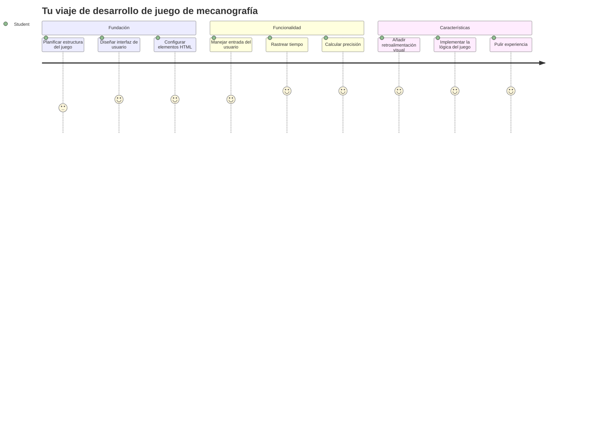
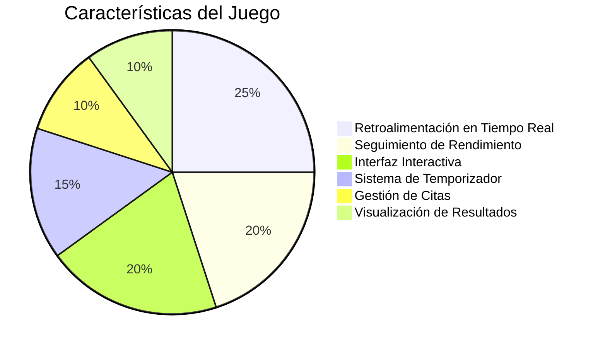
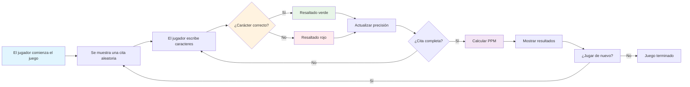
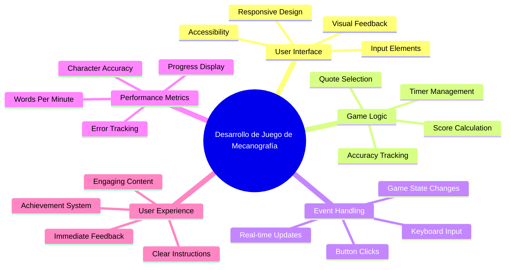
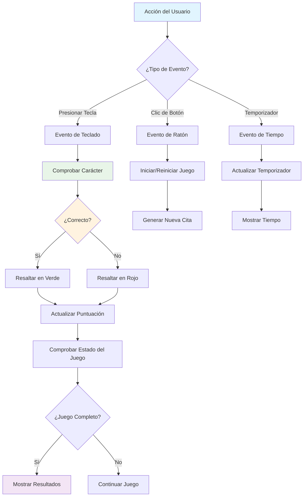
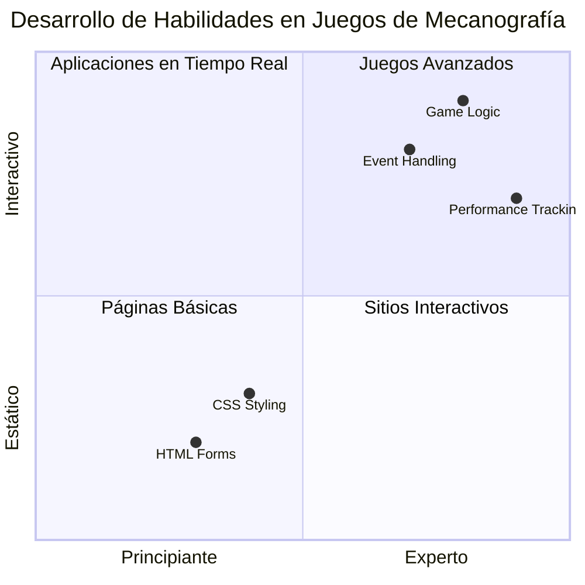
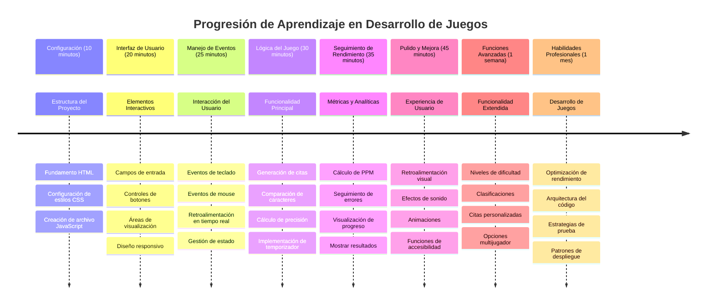

<!--
CO_OP_TRANSLATOR_METADATA:
{
  "original_hash": "efa2ab875b8bb5a7883816506da6b6d2",
  "translation_date": "2026-01-06T07:06:03+00:00",
  "source_file": "4-typing-game/README.md",
  "language_code": "es"
}
-->
# Programación Orientada a Eventos - Construye un Juego de Escritura

## Introducción

Aquí hay algo que todo desarrollador sabe pero casi nunca habla: ¡escribir rápido es un superpoder! 🚀 Piénsalo: cuanto más rápido puedas llevar tus ideas desde tu cerebro hasta tu editor de código, más fluye tu creatividad. Es como tener una conexión directa entre tus pensamientos y la pantalla.

¿Quieres saber una de las mejores formas de mejorar esta habilidad? Lo adivinaste: ¡vamos a construir un juego!

> ¡Vamos a crear un increíble juego de escritura juntos!

¿Listo para poner en práctica todas esas habilidades de JavaScript, HTML y CSS que has estado aprendiendo? Vamos a construir un juego de escritura que te desafiará con citas aleatorias del legendario detective [Sherlock Holmes](https://en.wikipedia.org/wiki/Sherlock_Holmes). El juego medirá qué tan rápido y preciso puedes escribir, ¡y créeme, es más adictivo de lo que podrías pensar!

## Lo Que Necesitarás Saber

Antes de empezar, asegúrate de sentirte cómodo con estos conceptos (no te preocupes si necesitas un repaso rápido, ¡todos hemos pasado por eso!):

- Crear controles de entrada de texto y botones
- CSS y establecer estilos usando clases  
- Conceptos básicos de JavaScript
  - Crear un arreglo
  - Crear un número aleatorio
  - Obtener la hora actual

Si alguno de estos te suena un poco oxidado, ¡no hay problema! A veces la mejor forma de consolidar tus conocimientos es lanzándote a un proyecto y descubriéndolo sobre la marcha.

### 🔄 **Chequeo Pedagógico**
**Evaluación de Fundamentos**: Antes de comenzar el desarrollo, asegúrate de entender:
- ✅ Cómo funcionan los formularios y elementos de entrada en HTML
- ✅ Clases CSS y estilos dinámicos
- ✅ Listeners y manejadores de eventos en JavaScript
- ✅ Manipulación de arreglos y selección aleatoria
- ✅ Medición de tiempo y cálculos

**Autoevaluación Rápida**: ¿Puedes explicar cómo funcionan juntos estos conceptos en un juego interactivo?
- **Eventos** se disparan cuando los usuarios interactúan con los elementos
- **Manejadores** procesan esos eventos y actualizan el estado del juego
- **CSS** proporciona retroalimentación visual para las acciones del usuario
- **Temporización** permite medir el rendimiento y la progresión del juego

## ¡Vamos a Construir Esto!

[Creando un juego de escritura usando programación orientada a eventos](./typing-game/README.md)

### ⚡ **Lo Que Puedes Hacer en los Próximos 5 Minutos**
- [ ] Abre la consola de tu navegador y prueba escuchar eventos del teclado con `addEventListener`
- [ ] Crea una página HTML simple con un campo de entrada y prueba la detección de escritura
- [ ] Practica la manipulación de cadenas comparando texto escrito con texto objetivo
- [ ] Experimenta con `setTimeout` para entender funciones de temporización

### 🎯 **Lo Que Puedes Lograr Esta Hora**
- [ ] Completa el quiz posterior a la lección y comprende la programación orientada a eventos
- [ ] Construye una versión básica del juego de escritura con validación de palabras
- [ ] Añade retroalimentación visual para escritura correcta e incorrecta
- [ ] Implementa un sistema simple de puntuación basado en velocidad y precisión
- [ ] Estiliza tu juego con CSS para hacerlo visualmente atractivo

### 📅 **Tu Desarrollo del Juego en una Semana**
- [ ] Completa el juego de escritura con todas las características y detalles finales
- [ ] Añade niveles de dificultad con complejidad variable de palabras
- [ ] Implementa seguimiento de estadísticas de usuario (PPM, precisión a lo largo del tiempo)
- [ ] Crea efectos de sonido y animaciones para mejorar la experiencia del usuario
- [ ] Haz que tu juego sea responsivo para dispositivos táctiles
- [ ] Comparte tu juego en línea y recoge feedback de usuarios

### 🌟 **Tu Desarrollo Interactivo a lo Largo del Mes**
- [ ] Construye varios juegos explorando diferentes patrones de interacción
- [ ] Aprende sobre bucles de juego, gestión de estado y optimización de rendimiento
- [ ] Contribuye a proyectos de desarrollo de juegos de código abierto
- [ ] Domina conceptos avanzados de temporización y animaciones fluidas
- [ ] Crea un portafolio mostrando varias aplicaciones interactivas
- [ ] Mentoriza a otros interesados en desarrollo de juegos e interacción con usuarios

## 🎯 Tu Cronograma de Maestría en el Juego de Escritura

### 🛠️ Resumen de tu Kit de Herramientas para Desarrollo de Juegos

Después de completar este proyecto, habrás dominado:
- **Programación Orientada a Eventos**: Interfaces de usuario responsivas que reaccionan a la entrada
- **Retroalimentación en Tiempo Real**: Actualizaciones visuales e instantáneas de rendimiento
- **Medición de Rendimiento**: Sistemas precisos de temporización y puntuación
- **Gestión del Estado del Juego**: Control del flujo de la aplicación y experiencia del usuario
- **Diseño Interactivo**: Creación de experiencias de usuario atractivas y adictivas
- **APIs Web Modernas**: Utilización de capacidades del navegador para interacciones ricas
- **Patrones de Accesibilidad**: Diseño inclusivo para todos los usuarios

**Aplicaciones Reales**: Estas habilidades se aplican directamente a:
- **Aplicaciones Web**: Cualquier interfaz o panel interactivo
- **Software Educativo**: Plataformas de aprendizaje y herramientas de evaluación de habilidades
- **Herramientas de Productividad**: Editores de texto, IDEs y software de colaboración
- **Industria del Juego**: Juegos en navegador y entretenimiento interactivo
- **Desarrollo Móvil**: Interfaces táctiles y manejo de gestos

**Nivel Siguiente**: ¡Estás listo para explorar frameworks de juegos avanzados, sistemas multijugador en tiempo real o aplicaciones interactivas complejas!

## Créditos

Escrito con ♥️ por [Christopher Harrison](http://www.twitter.com/geektrainer)

---

<!-- CO-OP TRANSLATOR DISCLAIMER START -->
**Descargo de responsabilidad**:  
Este documento ha sido traducido utilizando el servicio de traducción automática [Co-op Translator](https://github.com/Azure/co-op-translator). Aunque nos esforzamos por la precisión, tenga en cuenta que las traducciones automáticas pueden contener errores o inexactitudes. El documento original en su idioma nativo debe considerarse la fuente autorizada. Para información crítica, se recomienda una traducción profesional realizada por un humano. No nos hacemos responsables de ningún malentendido o interpretación errónea derivada del uso de esta traducción.
<!-- CO-OP TRANSLATOR DISCLAIMER END -->