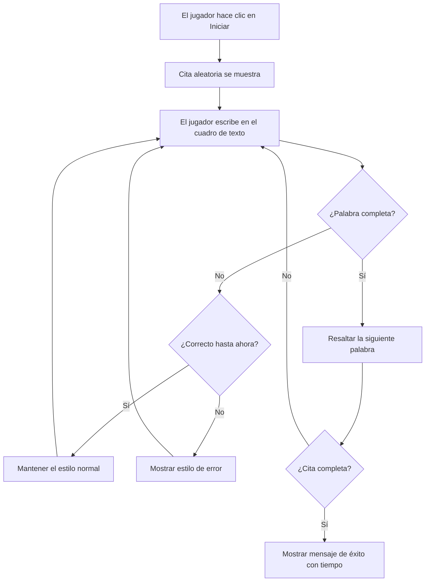
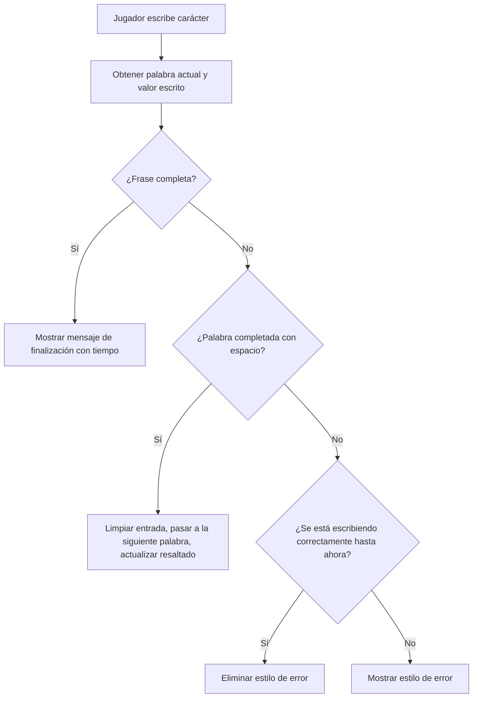
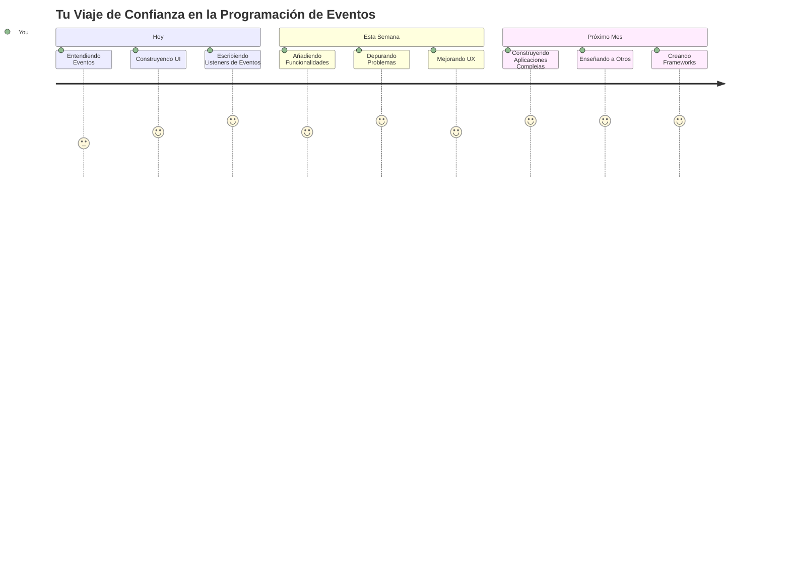

# Crear un juego usando eventos

¿Alguna vez te has preguntado cómo saben los sitios web cuándo haces clic en un botón o escribes en un cuadro de texto? ¡Esa es la magia de la programación orientada a eventos! ¿Qué mejor manera de aprender esta habilidad esencial que construyendo algo útil: un juego de velocidad de escritura que reacciona a cada pulsación de tecla que haces?

Vas a ver de primera mano cómo los navegadores web "hablan" con tu código JavaScript. Cada vez que haces clic, escribes o mueves el ratón, el navegador envía pequeños mensajes (los llamamos eventos) a tu código, ¡y tú decides cómo responder!

Cuando terminemos aquí, habrás construido un juego real de mecanografía que rastrea tu velocidad y precisión. Más importante aún, comprenderás los conceptos fundamentales que impulsan todos los sitios web interactivos que alguna vez has usado. ¡Vamos a sumergirnos!

## Cuestionario previo a la clase

[Pre-lecture quiz](https://ff-quizzes.netlify.app/web/quiz/21)

## Programación orientada a eventos

Piensa en tu aplicación o sitio web favorito: ¿qué hace que se sienta vivo y receptivo? ¡Todo se trata de cómo reacciona a lo que haces! Cada toque, clic, deslizamiento o pulsación de tecla crea lo que llamamos un "evento", y ahí es donde sucede la verdadera magia del desarrollo web.

Esto es lo que hace que programar para la web sea tan interesante: nunca sabemos cuándo alguien hará clic en ese botón o empezará a escribir en un cuadro de texto. ¡Puede que hagan clic de inmediato, esperen cinco minutos o tal vez nunca hagan clic! Esta imprevisibilidad significa que necesitamos pensar de forma diferente sobre cómo escribir nuestro código.

En lugar de escribir código que se ejecute de arriba a abajo como una receta, escribimos código que se sienta pacientemente esperando a que algo suceda. Es similar a cómo los operadores de telégrafo en el siglo XIX se sentaban junto a sus máquinas, listos para responder en el momento en que llegara un mensaje por cable.

Entonces, ¿qué es exactamente un "evento"? Simplemente, ¡es algo que sucede! Cuando haces clic en un botón, ese es un evento. Cuando escribes una letra, ese es un evento. Cuando mueves el ratón, ese es otro evento.

La programación orientada a eventos nos permite configurar nuestro código para escuchar y responder. Creamos funciones especiales llamadas **escuchas de eventos (event listeners)** que esperan pacientemente a que sucedan cosas específicas, y luego saltan a la acción cuando ocurren.

Piensa en los escuchas de eventos como tener un timbre para tu código. Configuras el timbre (`addEventListener()`), le dices a qué sonido debe escuchar (como un 'click' o 'keypress'), y luego especificas qué debe suceder cuando alguien lo toca (tu función personalizada).

**Así es como funcionan los escuchas de eventos:**
- **Escuchan** acciones específicas del usuario como clics, pulsaciones de tecla o movimientos del ratón
- **Ejecutan** tu código personalizado cuando ocurre el evento especificado
- **Responden** inmediatamente a las interacciones del usuario, creando una experiencia fluida
- **Manejan** múltiples eventos en el mismo elemento usando diferentes escuchas

> **NOTA:** Vale la pena destacar que existen muchas maneras de crear escuchas de eventos. Puedes usar funciones anónimas o crear funciones con nombre. Puedes usar varios accesos directos, como establecer la propiedad `click`, o usar `addEventListener()`. En nuestro ejercicio nos vamos a enfocar en `addEventListener()` y funciones anónimas, ya que probablemente es la técnica más común que usan los desarrolladores web. También es la más flexible, pues `addEventListener()` funciona para todos los eventos, y el nombre del evento puede proporcionarse como un parámetro.

### Eventos comunes

Aunque los navegadores web ofrecen docenas de eventos diferentes para escuchar, la mayoría de las aplicaciones interactivas dependen sólo de un puñado de eventos esenciales. Comprender estos eventos básicos te dará la base para construir interacciones sofisticadas de usuario.

Hay [docenas de eventos](https://developer.mozilla.org/docs/Web/Events) disponibles para que escuches cuando creas una aplicación. Básicamente, cualquier cosa que un usuario haga en una página genera un evento, lo que te da mucho poder para asegurar que tengan la experiencia que deseas. Afortunadamente, normalmente sólo necesitarás un pequeño grupo de eventos. Aquí algunos comunes (incluyendo los dos que usaremos para crear nuestro juego):

| Evento | Descripción | Casos de uso comunes |
|--------|-------------|--------------------|
| `click` | El usuario hizo clic en algo | Botones, enlaces, elementos interactivos |
| `contextmenu` | El usuario hizo clic con el botón derecho del ratón | Menús contextuales personalizados |
| `select` | El usuario destacó algo de texto | Edición de texto, operaciones de copiar |
| `input` | El usuario ingresó texto | Validación de formularios, búsqueda en tiempo real |

**Entendiendo estos tipos de eventos:**
- **Se activan** cuando los usuarios interactúan con elementos específicos en la página
- **Proporcionan** información detallada sobre la acción del usuario a través de objetos de evento
- **Te permiten** crear aplicaciones web interactivas y receptivas
- **Funcionan** consistentemente en diferentes navegadores y dispositivos

## Creando el juego

Ahora que entiendes cómo funcionan los eventos, pongamos ese conocimiento en práctica creando algo útil. Vamos a crear un juego de velocidad de escritura que demuestre el manejo de eventos mientras te ayuda a desarrollar una habilidad importante para los desarrolladores.

Vamos a crear un juego para explorar cómo funcionan los eventos en JavaScript. Nuestro juego probará la habilidad de escritura del jugador, que es una de las habilidades más subestimadas que todo desarrollador debería tener. Dato curioso: el diseño del teclado QWERTY que usamos hoy en día fue diseñado en la década de 1870 para máquinas de escribir, y ¡las buenas habilidades de escritura siguen siendo igual de valiosas para los programadores hoy! El flujo general del juego será así:


**Así funcionará nuestro juego:**
- **Comienza** cuando el jugador hace clic en el botón de inicio y muestra una cita aleatoria
- **Rastrea** el progreso de escritura del jugador palabra por palabra en tiempo real
- **Resalta** la palabra actual para guiar la concentración del jugador
- **Proporciona** retroalimentación visual inmediata para errores de mecanografía
- **Calcula** y muestra el tiempo total cuando se completa la cita

¡Construyamos nuestro juego y aprendamos sobre eventos!

### Estructura de archivos

Antes de empezar a programar, ¡pongámonos organizados! Tener una estructura de archivos limpia desde el principio te ahorrará dolores de cabeza más adelante y hará que tu proyecto luzca más profesional. 😊

Vamos a mantenerlo simple con sólo tres archivos: `index.html` para la estructura de la página, `script.js` para toda la lógica del juego, y `style.css` para hacer que todo luzca genial. ¡Este es el trío clásico que impulsa la mayoría de la web!

**Crea una carpeta nueva para tu trabajo abriendo una consola o terminal y ejecutando el siguiente comando:**

```bash
# Linux o macOS
mkdir typing-game && cd typing-game

# Windows
md typing-game && cd typing-game
```

**Esto es lo que hacen estos comandos:**
- **Crea** un nuevo directorio llamado `typing-game` para los archivos de tu proyecto
- **Navega** automáticamente al directorio recién creado
- **Configura** un espacio de trabajo limpio para el desarrollo de tu juego

**Abre Visual Studio Code:**

```bash
code .
```

**Este comando:**
- **Inicia** Visual Studio Code en el directorio actual
- **Abre** la carpeta del proyecto en el editor
- **Proporciona** acceso a todas las herramientas de desarrollo que necesitarás

**Agrega tres archivos a la carpeta en Visual Studio Code con los siguientes nombres:**
- `index.html` - Contiene la estructura y contenido del juego
- `script.js` - Maneja toda la lógica del juego y los escuchas de eventos
- `style.css` - Define la apariencia visual y el estilo

## Crear la interfaz de usuario

Ahora construyamos el escenario donde sucederá toda la acción de nuestro juego. Piensa en esto como diseñar el panel de control de una nave espacial: tenemos que asegurarnos que todo lo que nuestros jugadores necesiten esté justo donde esperan.

Vamos a definir qué necesita nuestro juego. Si estuvieras jugando un juego de mecanografía, ¿qué te gustaría ver en la pantalla? Esto es lo que necesitaremos:

| Elemento UI | Propósito | Elemento HTML |
|-------------|-----------|--------------|
| Visualizador de la cita | Muestra el texto a escribir | `<p>` con `id="quote"` |
| Área de mensajes | Muestra estados y mensajes de éxito | `<p>` con `id="message"` |
| Entrada de texto | Donde los jugadores escriben la cita | `<input>` con `id="typed-value"` |
| Botón de inicio | Comienza el juego | `<button>` con `id="start"` |

**Entendiendo la estructura de la UI:**
- **Organiza** el contenido de forma lógica de arriba a abajo
- **Asigna** IDs únicas a los elementos para manipulación con JavaScript
- **Proporciona** una jerarquía visual clara para una mejor experiencia de usuario
- **Incluye** elementos HTML semánticos para accesibilidad

Cada uno necesitará IDs para que podamos trabajar con ellos en nuestro JavaScript. También añadiremos referencias a los archivos CSS y JavaScript que vamos a crear.

Crea un archivo nuevo llamado `index.html`. Agrega el siguiente HTML:

```html
<!-- inside index.html -->
<html>
<head>
  <title>Typing game</title>
  <link rel="stylesheet" href="style.css">
</head>
<body>
  <h1>Typing game!</h1>
  <p>Practice your typing skills with a quote from Sherlock Holmes. Click **start** to begin!</p>
  <p id="quote"></p> <!-- This will display our quote -->
  <p id="message"></p> <!-- This will display any status messages -->
  <div>
    <input type="text" aria-label="current word" id="typed-value" /> <!-- The textbox for typing -->
    <button type="button" id="start">Start</button> <!-- To start the game -->
  </div>
  <script src="script.js"></script>
</body>
</html>
```

**Desglose de lo que esta estructura HTML logra:**
- **Enlaza** la hoja de estilos CSS en el `<head>` para el estilo visual
- **Crea** un encabezado claro e instrucciones para los usuarios
- **Establece** párrafos de marcador con IDs específicos para contenido dinámico
- **Incluye** un campo de entrada con atributos de accesibilidad
- **Proporciona** un botón de inicio para activar el juego
- **Carga** el archivo JavaScript al final para un rendimiento óptimo

### Lanzar la aplicación

Probar tu aplicación frecuentemente durante el desarrollo te ayuda a detectar problemas temprano y ver tu progreso en tiempo real. Live Server es una herramienta invaluable que refresca automáticamente tu navegador cada vez que guardas cambios, haciendo el desarrollo mucho más eficiente.

Siempre es mejor desarrollar de forma iterativa para ver cómo se ve todo. Vamos a lanzar nuestra aplicación. Hay una maravillosa extensión para Visual Studio Code llamada [Live Server](https://marketplace.visualstudio.com/items?itemName=ritwickdey.LiveServer&WT.mc_id=academic-77807-sagibbon) que alojará tu aplicación localmente y refrescará el navegador cada vez que guardes.

**Instala [Live Server](https://marketplace.visualstudio.com/items?itemName=ritwickdey.LiveServer&WT.mc_id=academic-77807-sagibbon) siguiendo el enlace y haciendo clic en Instalar:**

**Esto sucede durante la instalación:**
- **Solicita** que tu navegador abra Visual Studio Code
- **Te guía** durante el proceso de instalación de la extensión
- **Puede requerir** reiniciar Visual Studio Code para completar la configuración

**Una vez instalado, en Visual Studio Code haz clic en Ctrl-Shift-P (o Cmd-Shift-P) para abrir la paleta de comandos:**

**Entendiendo la paleta de comandos:**
- **Proporciona** acceso rápido a todos los comandos de VS Code
- **Busca** comandos mientras escribes
- **Ofrece** atajos de teclado para un desarrollo más rápido

**Escribe "Live Server: Open with Live Server":**

**Qué hace Live Server:**
- **Inicia** un servidor de desarrollo local para tu proyecto
- **Refresca automáticamente** el navegador cuando guardas archivos
- **Sirve** tus archivos desde una URL local (típicamente `localhost:5500`)

**Abre un navegador y navega a `https://localhost:5500`:**

¡Ahora deberías ver la página que creaste! Vamos a agregar funcionalidad.

## Agregar el CSS

Ahora hagamos que las cosas luzcan bien. La retroalimentación visual ha sido crucial para las interfaces de usuario desde los primeros días de la informática. En la década de 1980, los investigadores descubrieron que la retroalimentación visual inmediata mejora dramáticamente el rendimiento del usuario y reduce errores. Eso es justo lo que vamos a crear.

Nuestro juego debe ser súper claro sobre lo que está sucediendo. Los jugadores deberían saber inmediatamente qué palabra deben escribir, y si cometen un error, deberían verlo de inmediato. Vamos a crear un estilo simple pero efectivo:

Crea un archivo nuevo llamado `style.css` y añade la siguiente sintaxis.

```css
/* inside style.css */
.highlight {
  background-color: yellow;
}

.error {
  background-color: lightcoral;
  border: red;
}
```

**Entendiendo estas clases CSS:**
- **Resalta** la palabra actual con un fondo amarillo para una guía visual clara
- **Señala** los errores de escritura con un fondo color coral claro
- **Proporciona** retroalimentación inmediata sin interrumpir el flujo de escritura del usuario
- **Usa** colores contrastantes para accesibilidad y comunicación visual clara

✅ En cuanto a CSS, puedes diseñar tu página como prefieras. Tómate un tiempo y haz que la página se vea más atractiva:

- Elige una fuente diferente
- Colorea los encabezados
- Cambia el tamaño de los elementos

## JavaScript

¡Aquí es donde las cosas se ponen interesantes! 🎉 Tenemos nuestra estructura HTML y el estilo CSS, pero ahora nuestro juego es como un auto bonito sin motor. JavaScript será ese motor: es lo que hace que todo realmente funcione y responda a lo que los jugadores hacen.

Aquí verás tu creación cobrar vida. Lo abordaremos paso a paso para que nada te abrume:

| Paso | Propósito | Lo que aprenderás |
|------|-----------|-------------------|
| [Crear las constantes](../../../../4-typing-game/typing-game) | Configurar citas y referencias DOM | Gestión de variables y selección del DOM |
| [Escucha de eventos para iniciar el juego](../../../../4-typing-game/typing-game) | Manejar la inicialización del juego | Manejo de eventos y actualizaciones de UI |
| [Escucha de eventos para la escritura](../../../../4-typing-game/typing-game) | Procesar la entrada del usuario en tiempo real | Validación de entrada y retroalimentación dinámica |

**Este enfoque estructurado te ayuda a:**
- **Organizar** tu código en secciones lógicas y manejables
- **Construir** funcionalidad de forma incremental para facilitar la depuración
- **Comprender** cómo diferentes partes de tu aplicación trabajan en conjunto
- **Crear** patrones reutilizables para proyectos futuros

Pero primero, crea un archivo nuevo llamado `script.js`.

### Agregar las constantes

Antes de sumergirnos en la acción, ¡reunamos todos nuestros recursos! Al igual que el control de misión de la NASA prepara todos sus sistemas de monitoreo antes del lanzamiento, es mucho más fácil cuando tienes todo preparado y listo. Esto nos evita buscar cosas más tarde y ayuda a prevenir errores tipográficos.

Esto es lo que necesitamos configurar primero:

| Tipo de dato | Propósito | Ejemplo |
| Matriz de citas | Almacena todas las posibles citas para el juego | `['Quote 1', 'Quote 2', ...]` |
| Matriz de palabras | Divide la cita actual en palabras individuales | `['When', 'you', 'have', ...]` |
| Índice de palabra | Rastrear qué palabra está escribiendo el jugador | `0, 1, 2, 3...` |
| Tiempo de inicio | Calcular tiempo transcurrido para puntuar | `Date.now()` |

**También necesitaremos referencias a nuestros elementos de la interfaz de usuario:**
| Elemento | ID | Propósito |
|---------|----|-----------|
| Entrada de texto | `typed-value` | Donde los jugadores escriben |
| Visualización de cita | `quote` | Muestra la cita para escribir |
| Área de mensaje | `message` | Muestra actualizaciones de estado |

```javascript
// dentro de script.js
// todas nuestras citas
const quotes = [
    'When you have eliminated the impossible, whatever remains, however improbable, must be the truth.',
    'There is nothing more deceptive than an obvious fact.',
    'I ought to know by this time that when a fact appears to be opposed to a long train of deductions it invariably proves to be capable of bearing some other interpretation.',
    'I never make exceptions. An exception disproves the rule.',
    'What one man can invent another can discover.',
    'Nothing clears up a case so much as stating it to another person.',
    'Education never ends, Watson. It is a series of lessons, with the greatest for the last.',
];
// almacenar la lista de palabras y el índice de la palabra que el jugador está escribiendo actualmente
let words = [];
let wordIndex = 0;
// el tiempo de inicio
let startTime = Date.now();
// elementos de la página
const quoteElement = document.getElementById('quote');
const messageElement = document.getElementById('message');
const typedValueElement = document.getElementById('typed-value');
```

**Desglosando lo que logra este código de configuración:**
- **Almacena** un array de citas de Sherlock Holmes usando `const` ya que las citas no cambiarán
- **Inicializa** variables de seguimiento con `let` ya que estos valores se actualizarán durante el juego
- **Captura** referencias a elementos DOM usando `document.getElementById()` para acceso eficiente
- **Establece** la base para toda la funcionalidad del juego con nombres de variables claros y descriptivos
- **Organiza** datos y elementos relacionados lógicamente para facilitar el mantenimiento del código

✅ Adelante, añade más citas a tu juego

> 💡 **Consejo profesional**: Podemos obtener los elementos cuando queramos en el código usando `document.getElementById()`. Debido a que nos referiremos a estos elementos con regularidad, evitaremos errores de tipeo con literales de cadena usando constantes. Frameworks como [Vue.js](https://vuejs.org/) o [React](https://reactjs.org/) te pueden ayudar a gestionar mejor la centralización de tu código.
>
**Por qué este enfoque funciona tan bien:**
- **Previene** errores ortográficos al referenciar elementos varias veces
- **Mejora** la legibilidad del código con nombres constantes descriptivos
- **Permite** mejor soporte del IDE con autocompletado y verificación de errores
- **Facilita** la refactorización si los ID de elementos cambian posteriormente

Tómate un minuto para ver un video sobre el uso de `const`, `let` y `var`

[](https://youtube.com/watch?v=JNIXfGiDWM8 "Tipos de variables")

> 🎥 Haz clic en la imagen arriba para un video sobre variables.

### Añadir lógica de inicio

¡Aquí es donde todo encaja! 🚀 Estás a punto de escribir tu primer listener de eventos real, y hay algo muy satisfactorio en ver tu código responder a un clic de botón.

Piénsalo: en algún lugar, un jugador va a hacer clic en el botón "Start", y tu código debe estar listo para ello. No sabemos cuándo lo hará, puede ser de inmediato o después de tomar un café, pero cuando lo haga, tu juego cobrará vida.

Cuando el usuario haga clic en `start`, necesitamos seleccionar una cita, configurar la interfaz de usuario y preparar el seguimiento para la palabra actual y el tiempo. Abajo está el JavaScript que debes añadir; lo discutimos justo después del bloque de código.

```javascript
// al final de script.js
document.getElementById('start').addEventListener('click', () => {
  // obtener una cita
  const quoteIndex = Math.floor(Math.random() * quotes.length);
  const quote = quotes[quoteIndex];
  // Poner la cita en un arreglo de palabras
  words = quote.split(' ');
  // reiniciar el índice de palabras para seguimiento
  wordIndex = 0;

  // actualizaciones de la interfaz de usuario
  // Crear un arreglo de elementos span para poder asignar una clase
  const spanWords = words.map(function(word) { return `<span>${word} </span>`});
  // Convertir a cadena y establecer como innerHTML en la visualización de la cita
  quoteElement.innerHTML = spanWords.join('');
  // Resaltar la primera palabra
  quoteElement.childNodes[0].className = 'highlight';
  // Borrar cualquier mensaje previo
  messageElement.innerText = '';

  // Configurar el cuadro de texto
  // Limpiar el cuadro de texto
  typedValueElement.value = '';
  // establecer el foco
  typedValueElement.focus();
  // establecer el manejador de eventos

  // Iniciar el temporizador
  startTime = new Date().getTime();
});
```

**Desglosemos el código en secciones lógicas:**

**📊 Configuración del seguimiento de palabras:**
- **Selecciona** una cita aleatoria usando `Math.floor()` y `Math.random()` para variedad
- **Convierte** la cita en una matriz de palabras individuales usando `split(' ')`
- **Reinicia** `wordIndex` a 0 ya que los jugadores comienzan con la primera palabra
- **Prepara** el estado del juego para una nueva ronda

**🎨 Configuración y visualización de la UI:**
- **Crea** una matriz de elementos `<span>`, envolviendo cada palabra para estilo individual
- **Une** los elementos span en un solo string para actualización eficiente del DOM
- **Resalta** la primera palabra agregando la clase CSS `highlight`
- **Limpia** cualquier mensaje de juego previo para un estado limpio

**⌨️ Preparación de la caja de texto:**
- **Limpia** cualquier texto existente en el campo de entrada
- **Enfoca** el cuadro de texto para que los jugadores puedan empezar a escribir inmediatamente
- **Prepara** el área de entrada para la nueva sesión del juego

**⏱️ Inicialización del temporizador:**
- **Captura** el timestamp actual usando `new Date().getTime()`
- **Permite** cálculo preciso de velocidad de escritura y tiempo de finalización
- **Inicia** el seguimiento del rendimiento para la sesión del juego

### Añadir lógica de tipeo

Aquí abordamos el corazón de nuestro juego. No te preocupes si parece mucho al principio; repasaremos cada parte, y al final verás lo lógico que es todo.

Lo que construimos aquí es bastante sofisticado: cada vez que alguien escribe una letra, nuestro código va a verificar qué escribió, darle feedback y decidir qué hacer después. Es similar a cómo los primeros procesadores de texto como WordStar en los años 70 proporcionaban retroalimentación en tiempo real a los mecanógrafos.

```javascript
// al final de script.js
typedValueElement.addEventListener('input', () => {
  // Obtener la palabra actual
  const currentWord = words[wordIndex];
  // obtener el valor actual
  const typedValue = typedValueElement.value;

  if (typedValue === currentWord && wordIndex === words.length - 1) {
    // fin de la oración
    // Mostrar éxito
    const elapsedTime = new Date().getTime() - startTime;
    const message = `CONGRATULATIONS! You finished in ${elapsedTime / 1000} seconds.`;
    messageElement.innerText = message;
  } else if (typedValue.endsWith(' ') && typedValue.trim() === currentWord) {
    // fin de la palabra
    // limpiar el elemento typedValueElement para la nueva palabra
    typedValueElement.value = '';
    // pasar a la siguiente palabra
    wordIndex++;
    // reiniciar el nombre de clase para todos los elementos en la cita
    for (const wordElement of quoteElement.childNodes) {
      wordElement.className = '';
    }
    // resaltar la nueva palabra
    quoteElement.childNodes[wordIndex].className = 'highlight';
  } else if (currentWord.startsWith(typedValue)) {
    // actualmente correcto
    // resaltar la siguiente palabra
    typedValueElement.className = '';
  } else {
    // estado de error
    typedValueElement.className = 'error';
  }
});
```

**Entendiendo el flujo de la lógica de tipeo:**

Esta función usa un enfoque cascada, revisando condiciones de la más específica a la más general. Desglosemos cada escenario:


**🏁 Cita completada (Escenario 1):**
- **Verifica** si el valor tipeado coincide con la palabra actual Y si estamos en la última palabra
- **Calcula** el tiempo transcurrido restando el tiempo de inicio del tiempo actual
- **Convierte** milisegundos a segundos dividiendo por 1,000
- **Muestra** mensaje de felicitación con tiempo de finalización

**✅ Palabra completada (Escenario 2):**
- **Detecta** la palabra completada cuando la entrada termina con un espacio
- **Valida** que el texto recortado coincida exactamente con la palabra actual
- **Limpia** el campo de entrada para la siguiente palabra
- **Avanza** a la palabra siguiente incrementando `wordIndex`
- **Actualiza** el resaltado visual quitando todas las clases y resaltando la nueva palabra

**📝 Escribiendo en progreso (Escenario 3):**
- **Verifica** que la palabra actual comienza con lo que se ha tipeado hasta ahora
- **Elimina** cualquier estilo de error para indicar que la entrada es correcta
- **Permite** continuar escribiendo sin interrupción

**❌ Estado de error (Escenario 4):**
- **Se activa** cuando el texto tipeado no coincide con el inicio esperado de la palabra
- **Aplica** clase CSS de error para proporcionar retroalimentación visual inmediata
- **Ayuda** a los jugadores a identificar y corregir errores rápidamente

## Prueba tu aplicación

¡Mira lo que lograste! 🎉 Acabas de construir un juego de tipeo real y funcional desde cero usando programación orientada a eventos. Tómate un momento para apreciarlo: ¡esto no es poca cosa!

Ahora viene la fase de pruebas. ¿Funcionará como esperas? ¿Se nos pasó algo? Lo importante: si algo no funciona perfecto de inmediato, es totalmente normal. Incluso desarrolladores experimentados encuentran errores regularmente. Es parte del proceso de desarrollo.

Haz clic en `start` y comienza a escribir. Debería parecerse un poco a la animación que vimos antes.


**Qué probar en tu aplicación:**
- **Verifica** que al hacer clic en Start se muestre una cita aleatoria
- **Confirma** que al escribir se resalte correctamente la palabra actual
- **Revisa** que aparezca estilo de error al escribir incorrectamente
- **Asegura** que al completar palabras avance el resaltado correctamente
- **Prueba** que al terminar la cita aparezca el mensaje de finalización con tiempo

**Consejos comunes para depurar:**
- **Revisa** la consola del navegador (F12) por errores de JavaScript
- **Verifica** que los nombres de archivos coincidan exactamente (sensible a mayúsculas)
- **Asegura** que Live Server se esté ejecutando y refrescando correctamente
- **Prueba** diferentes citas para confirmar que la selección aleatoria funcione

---

## Desafío GitHub Copilot Agent 🎮

Usa el modo Agente para completar el siguiente desafío:

**Descripción:** Extiende el juego de tipeo implementando un sistema de dificultad que ajuste el juego basado en el desempeño del jugador. Este desafío te ayudará a practicar manejo avanzado de eventos, análisis de datos y actualizaciones dinámicas de la interfaz.

**Instrucción:** Crea un sistema de ajuste de dificultad para el juego de tipeo que:
1. Rastree la velocidad de tipeo del jugador (palabras por minuto) y porcentaje de precisión
2. Se ajuste automáticamente a tres niveles de dificultad: Fácil (citas simples), Medio (citas actuales), Difícil (citas complejas con puntuación)
3. Muestre el nivel de dificultad actual y estadísticas del jugador en la UI
4. Implemente un contador de rachas que aumente la dificultad tras 3 buenos desempeños consecutivos
5. Añada retroalimentación visual (colores, animaciones) para indicar cambios de dificultad

Agrega los elementos HTML necesarios, estilos CSS y funciones JavaScript para implementar esta característica. Incluye manejo adecuado de errores y asegura que el juego sea accesible con etiquetas ARIA apropiadas.

Aprende más sobre [modo agente](https://code.visualstudio.com/blogs/2025/02/24/introducing-copilot-agent-mode) aquí.

## 🚀 Desafío

¿Listo para llevar tu juego de tipeo al siguiente nivel? Intenta implementar estas características avanzadas para profundizar tu comprensión del manejo de eventos y manipulación del DOM:

**Añade más funcionalidad:**

| Función | Descripción | Habilidades que practicarás |
|---------|-------------|-----------------------------|
| **Control de entrada** | Deshabilita el listener del evento `input` al completar, y vuelve a habilitarlo al hacer clic en el botón | Manejo de eventos y control de estado |
| **Gestión del estado UI** | Deshabilita la caja de texto cuando el jugador termine la cita | Manipulación de propiedades DOM |
| **Diálogo modal** | Muestra un cuadro de diálogo modal con el mensaje de éxito | Patrones avanzados de UI y accesibilidad |
| **Sistema de puntajes altos** | Guarda los puntajes altos usando `localStorage` | APIs de almacenamiento del navegador y persistencia de datos |

**Consejos para implementación:**
- **Investiga** `localStorage.setItem()` y `localStorage.getItem()` para almacenamiento persistente
- **Practica** agregar y remover listeners de eventos dinámicamente
- **Explora** elementos dialog de HTML o patrones de modal en CSS
- **Considera** la accesibilidad al deshabilitar y habilitar controles de formulario

## Cuestionario post-lectura

[Cuestionario post-lectura](https://ff-quizzes.netlify.app/web/quiz/22)

---

## 🚀 Tu cronograma para dominar el juego de tipeo

### ⚡ **Qué puedes hacer en los próximos 5 minutos**
- [ ] Prueba tu juego con diferentes citas para asegurar que funcione bien
- [ ] Experimenta con el estilo CSS - prueba cambiar los colores de resaltado y error
- [ ] Abre las DevTools de tu navegador (F12) y observa la Consola mientras juegas
- [ ] Rétate a completar una cita lo más rápido posible

### ⏰ **Qué puedes lograr en esta hora**
- [ ] Añade más citas al array (quizá de tus libros o películas favoritas)
- [ ] Implementa el sistema de puntajes altos en localStorage desde el desafío
- [ ] Crea un calculador de palabras por minuto que se muestre tras cada juego
- [ ] Añade efectos de sonido para tipeo correcto, errores y finalización

### 📅 **Tu aventura de una semana**
- [ ] Construye una versión multijugador donde amigos compitan lado a lado
- [ ] Crea diferentes niveles de dificultad con complejidad variable en las citas
- [ ] Añade una barra de progreso que muestre qué tanto de la cita está completa
- [ ] Implementa cuentas de usuario con seguimiento estadístico personal
- [ ] Diseña temas personalizados y permite a los usuarios elegir su estilo preferido

### 🗓️ **Tu transformación en un mes**
- [ ] Crea un curso de tipeo con lecciones que enseñen progresivamente la colocación correcta de los dedos
- [ ] Construye análisis que muestren qué letras o palabras causan más errores
- [ ] Añade soporte para diferentes idiomas y distribuciones de teclado
- [ ] Integra APIs educativas para obtener citas de bases de datos literarias
- [ ] Publica tu juego de tipeo mejorado para que otros lo usen y disfruten

### 🎯 **Chequeo final de reflexión**

**Antes de continuar, tómate un momento para celebrar:**
- ¿Cuál fue el momento más satisfactorio al construir este juego?
- ¿Cómo te sientes respecto a la programación orientada a eventos en comparación con cuando empezaste?
- ¿Qué característica te entusiasma añadir para hacer este juego único?
- ¿Cómo podrías aplicar conceptos de manejo de eventos en otros proyectos?


> 🌟 **Recuerda**: Acabas de dominar uno de los conceptos centrales que impulsan cada sitio web y aplicación interactiva. La programación orientada a eventos es lo que hace que la web se sienta viva y sensible. Cada vez que ves un menú desplegable, un formulario que valida mientras escribes o un juego que responde a tus clics, ahora entiendes la magia detrás de eso. No solo estás aprendiendo a programar, ¡estás aprendiendo a crear experiencias que se sienten intuitivas y atractivas! 🎉

---

## Repaso y autoestudio

Lee sobre [todos los eventos disponibles](https://developer.mozilla.org/docs/Web/Events) para el desarrollador a través del navegador web, y considera los escenarios en los que usarías cada uno.

## Tarea

[Crea un nuevo juego de teclado](assignment.md)

---

<!-- CO-OP TRANSLATOR DISCLAIMER START -->
**Descargo de responsabilidad**:
Este documento ha sido traducido utilizando el servicio de traducción automática [Co-op Translator](https://github.com/Azure/co-op-translator). Aunque nos esforzamos por lograr precisión, tenga en cuenta que las traducciones automáticas pueden contener errores o inexactitudes. El documento original en su idioma nativo debe considerarse la fuente autorizada. Para información crítica, se recomienda una traducción humana profesional. No nos responsabilizamos por malentendidos o interpretaciones erróneas derivadas del uso de esta traducción.
<!-- CO-OP TRANSLATOR DISCLAIMER END -->