<!--
CO_OP_TRANSLATOR_METADATA:
{
  "original_hash": "00aa85715e1efd4930c17a23e3012e69",
  "translation_date": "2026-01-06T07:40:44+00:00",
  "source_file": "5-browser-extension/1-about-browsers/README.md",
  "language_code": "es"
}
-->
# Browser Extension Project Part 1: Todo sobre Navegadores

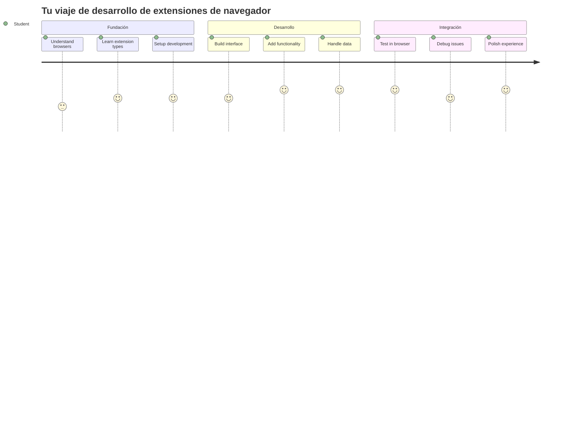
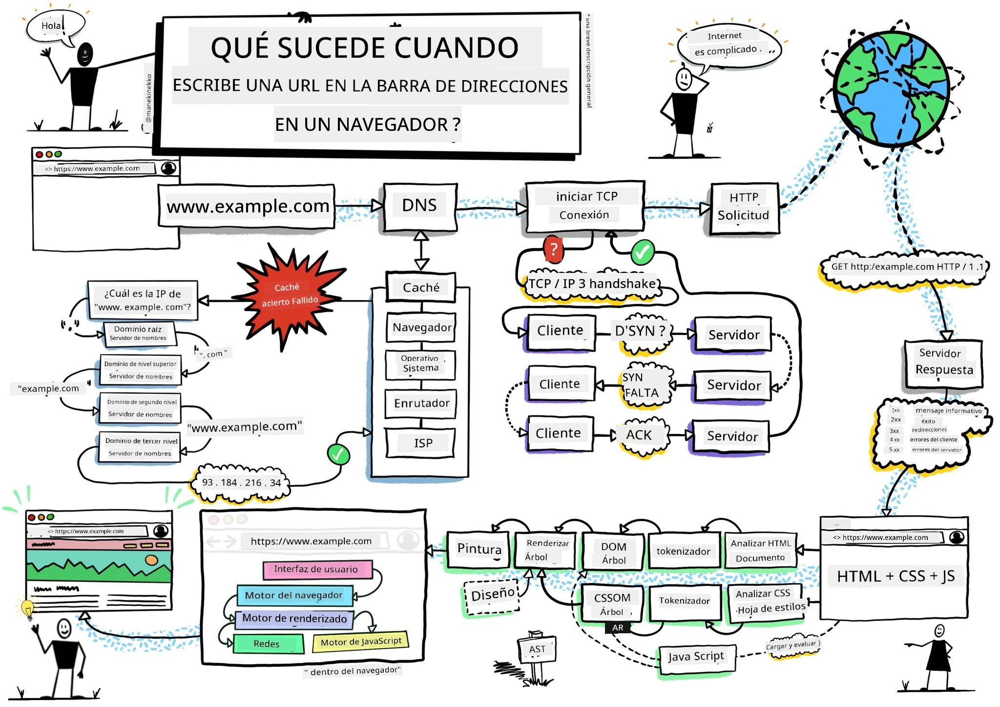
> Sketchnote por [Wassim Chegham](https://dev.to/wassimchegham/ever-wondered-what-happens-when-you-type-in-a-url-in-an-address-bar-in-a-browser-3dob)

## Pre-Lecture Quiz

[Pre-lecture quiz](https://ff-quizzes.netlify.app/web/quiz/23)

### Introducción

Las extensiones de navegador son mini-aplicaciones que mejoran tu experiencia de navegación web. Al igual que la visión original de Tim Berners-Lee de una web interactiva, las extensiones amplían las capacidades del navegador más allá de la simple visualización de documentos. Desde gestores de contraseñas que mantienen tus cuentas seguras hasta selectores de colores que ayudan a diseñadores a obtener tonos perfectos, las extensiones resuelven desafíos cotidianos de navegación.

Antes de construir tu primera extensión, entendamos cómo funcionan los navegadores. Igual que Alexander Graham Bell necesitó entender la transmisión del sonido antes de inventar el teléfono, conocer los fundamentos del navegador te ayudará a crear extensiones que se integren perfectamente con los sistemas existentes del navegador.

Al final de esta lección, comprenderás la arquitectura del navegador y habrás empezado a construir tu primera extensión.

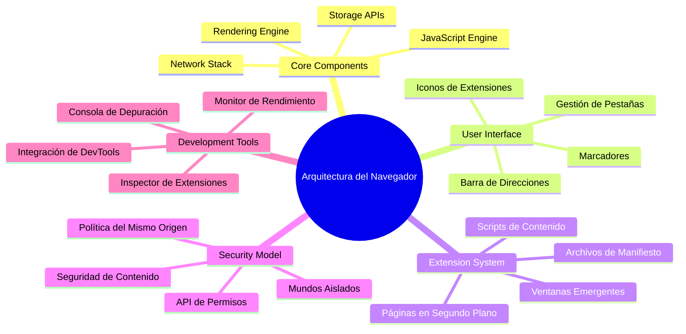
## Entendiendo los Navegadores Web

Un navegador web es esencialmente un intérprete sofisticado de documentos. Cuando escribes “google.com” en la barra de direcciones, el navegador realiza una compleja serie de operaciones: solicita contenido a servidores alrededor del mundo, luego analiza y renderiza ese código en las páginas web interactivas que ves.

Este proceso refleja cómo se diseñó el primer navegador web, WorldWideWeb, por Tim Berners-Lee en 1990 para hacer accesibles los documentos hipervinculados a todos.

✅ **Un poco de historia**: El primer navegador se llamó 'WorldWideWeb' y fue creado por Sir Timothy Berners-Lee en 1990.

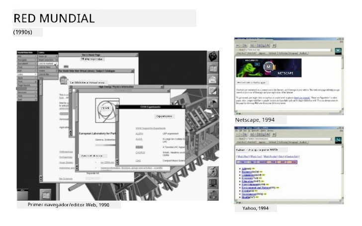
> Algunos navegadores tempranos, vía [Karen McGrane](https://www.slideshare.net/KMcGrane/week-4-ixd-history-personal-computing)

### Cómo los Navegadores Procesan Contenido Web

El proceso entre ingresar una URL y ver una página web involucra varios pasos coordinados que suceden en segundos:

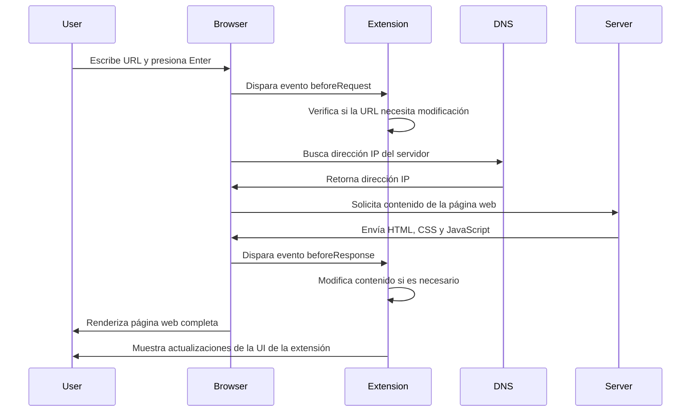
**Esto es lo que este proceso realiza:**
- **Traduce** la URL legible por humanos en una dirección IP de servidor mediante búsqueda DNS
- **Establece** una conexión segura con el servidor web usando protocolos HTTP o HTTPS
- **Solicita** el contenido específico de la página web al servidor
- **Recibe** el marcado HTML, el estilo CSS y el código JavaScript del servidor
- **Renderiza** todo el contenido en la página web interactiva que ves

### Características Principales del Navegador

Los navegadores modernos ofrecen numerosas características que los desarrolladores de extensiones pueden aprovechar:

| Característica | Propósito | Oportunidades para Extensiones |
|---------|---------|------------------------|
| **Motor de Renderizado** | Muestra HTML, CSS y JavaScript | Modificación de contenido, inyección de estilos |
| **Motor de JavaScript** | Ejecuta código JavaScript | Scripts personalizados, interacciones con APIs |
| **Almacenamiento Local** | Guarda datos localmente | Preferencias de usuario, datos en caché |
| **Pila de Red** | Maneja solicitudes web | Monitorización de solicitudes, análisis de datos |
| **Modelo de Seguridad** | Protege a usuarios de contenido malicioso | Filtrado de contenido, mejoras de seguridad |

**Entender estas características te ayuda a:**
- **Identificar** dónde tu extensión puede agregar mayor valor
- **Elegir** las APIs correctas del navegador para la funcionalidad de tu extensión
- **Diseñar** extensiones que trabajen eficientemente con los sistemas del navegador
- **Asegurar** que tu extensión siga las mejores prácticas de seguridad del navegador

### Consideraciones para Desarrollo Multi-Navegador

Diferentes navegadores implementan los estándares con ligeras variaciones, similar a cómo diferentes lenguajes de programación pueden manejar el mismo algoritmo de forma distinta. Chrome, Firefox y Safari tienen características únicas que los desarrolladores deben considerar durante el desarrollo de extensiones.

> 💡 **Consejo Profesional**: Usa [caniuse.com](https://www.caniuse.com) para verificar qué tecnologías web son compatibles en diferentes navegadores. ¡Esto es invaluable al planificar las funciones de tu extensión!

**Consideraciones clave para el desarrollo de extensiones:**
- **Prueba** tu extensión en navegadores Chrome, Firefox y Edge
- **Adáptate** a diferentes APIs de extensión y formatos de manifiesto
- **Gestiona** características y limitaciones de rendimiento variadas
- **Proporciona** alternativas para características específicas de navegadores que puedan no estar disponibles

✅ **Insight Analítico**: Puedes determinar qué navegadores prefieren tus usuarios instalando paquetes de análisis en tus proyectos de desarrollo web. Estos datos te ayudan a priorizar qué navegadores soportar primero.

## Entendiendo las Extensiones de Navegador

Las extensiones de navegador resuelven desafíos comunes de navegación web añadiendo funcionalidad directamente a la interfaz del navegador. En lugar de requerir aplicaciones separadas o flujos de trabajo complejos, las extensiones proporcionan acceso inmediato a herramientas y funciones.

Este concepto refleja cómo los pioneros de la informática como Douglas Engelbart imaginaron aumentar las capacidades humanas con tecnología; las extensiones aumentan la funcionalidad básica de tu navegador.

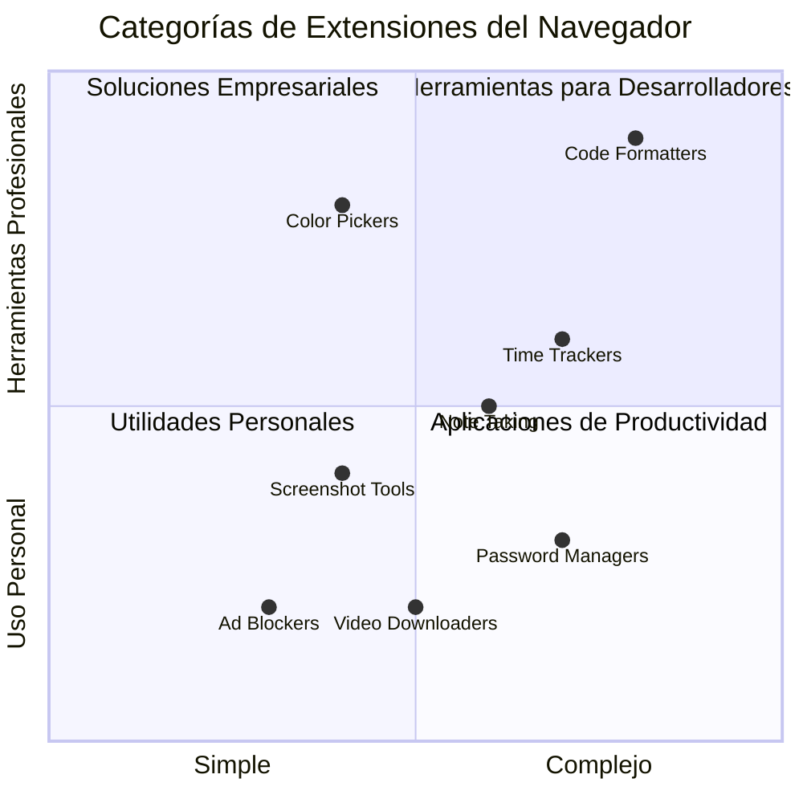
**Categorías populares de extensiones y sus beneficios:**
- **Herramientas de Productividad**: Gestores de tareas, aplicaciones de notas y rastreadores de tiempo que te ayudan a mantenerte organizado
- **Mejoras de Seguridad**: Gestores de contraseñas, bloqueadores de anuncios y herramientas de privacidad que protegen tus datos
- **Herramientas para Desarrolladores**: Formateadores de código, selectores de color y utilidades de depuración que agilizan el desarrollo
- **Mejoras de Contenido**: Modos de lectura, descargadores de video y herramientas para capturas de pantalla que mejoran tu experiencia web

✅ **Pregunta de Reflexión**: ¿Cuáles son tus extensiones favoritas? ¿Qué tareas específicas realizan y cómo mejoran tu experiencia de navegación?

### 🔄 **Chequéo Pedagógico**
**Comprensión de la Arquitectura del Navegador**: Antes de avanzar en el desarrollo de extensiones, asegúrate de que puedes:
- ✅ Explicar cómo los navegadores procesan solicitudes web y renderizan contenido
- ✅ Identificar los componentes principales de la arquitectura del navegador
- ✅ Entender cómo las extensiones se integran con la funcionalidad del navegador
- ✅ Reconocer el modelo de seguridad que protege a los usuarios

**Autoevaluación Rápida**: ¿Puedes trazar el camino desde escribir una URL hasta ver una página web?
1. La **búsqueda DNS** convierte la URL en dirección IP
2. La **solicitud HTTP** obtiene contenido del servidor
3. El **análisis** procesa HTML, CSS y JavaScript
4. El **renderizado** muestra la página final
5. Las **extensiones** pueden modificar contenido en varios pasos

## Instalación y Gestión de Extensiones

Entender el proceso de instalación de extensiones te ayuda a anticipar la experiencia del usuario cuando las personas instalen tu extensión. El proceso de instalación está estandarizado en navegadores modernos, con ligeras variaciones en el diseño de interfaz.

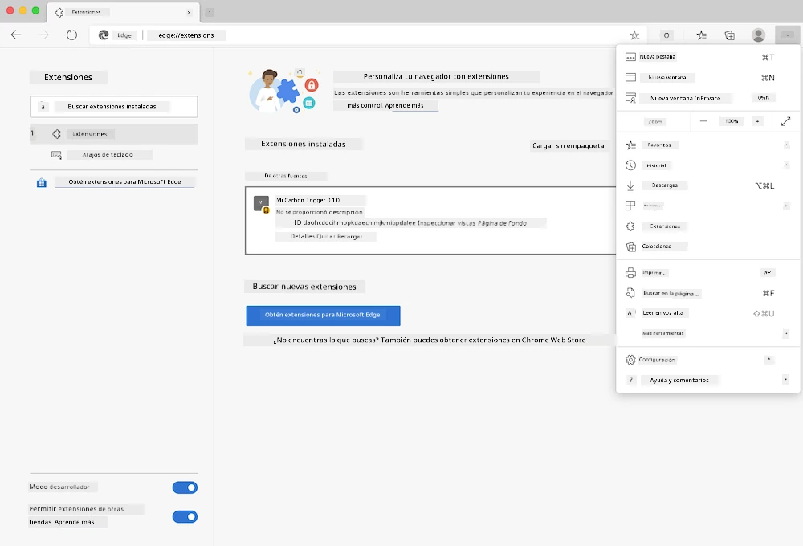

> **Importante**: Asegúrate de activar el modo desarrollador y permitir extensiones de otras tiendas al probar tus propias extensiones.

### Proceso de Instalación para Extensiones en Desarrollo

Cuando desarrollas y pruebas tus propias extensiones, sigue este flujo de trabajo:

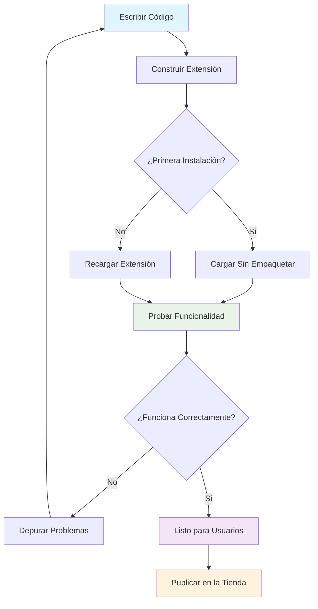
```bash
# Paso 1: Construye tu extensión
npm run build
```

**Lo que logra este comando:**
- **Compila** tu código fuente en archivos listos para el navegador
- **Agrupa** módulos de JavaScript en paquetes optimizados
- **Genera** los archivos finales de la extensión en la carpeta `/dist`
- **Prepara** tu extensión para instalación y pruebas

**Paso 2: Navega a Extensiones del Navegador**
1. **Abre** la página de gestión de extensiones del navegador
2. **Haz clic** en el botón "Configuración y más" (ícono `...`) en la parte superior derecha
3. **Selecciona** "Extensiones" en el menú desplegable

**Paso 3: Carga tu Extensión**
- **Para instalaciones nuevas**: Elige `load unpacked` y selecciona tu carpeta `/dist`
- **Para actualizaciones**: Haz clic en `reload` junto a tu extensión ya instalada
- **Para pruebas**: Habilita "Modo desarrollador" para acceder a funciones adicionales de depuración

### Instalación de Extensiones en Producción

> ✅ **Nota**: Estas instrucciones de desarrollo son específicamente para extensiones que construyes tú mismo. Para instalar extensiones publicadas, visita las tiendas oficiales de extensiones como la [Microsoft Edge Add-ons store](https://microsoftedge.microsoft.com/addons/Microsoft-Edge-Extensions-Home).

**Entendiendo la diferencia:**
- Las **instalaciones de desarrollo** te permiten probar extensiones no publicadas durante el desarrollo
- Las **instalaciones desde tienda** ofrecen extensiones verificadas y publicadas con actualizaciones automáticas
- El **sideloading** permite instalar extensiones fuera de las tiendas oficiales (requiere modo desarrollador)

## Construyendo tu Extensión de Huella de Carbono

Crearemos una extensión del navegador que muestra la huella de carbono del uso energético de tu región. Este proyecto demuestra conceptos esenciales de desarrollo de extensiones mientras creas una herramienta práctica para la conciencia ambiental.

Este enfoque sigue el principio de "aprender haciendo" que ha demostrado ser efectivo desde las teorías educativas de John Dewey: combinar habilidades técnicas con aplicaciones significativas en el mundo real.

### Requisitos del Proyecto

Antes de comenzar el desarrollo, reunamos los recursos y dependencias necesarios:

**Acceso API Requerido:**
- **[Clave API de CO2 Signal](https://www.co2signal.com/)**: Ingresa tu correo electrónico para recibir tu clave API gratuita
- **[Código de región](http://api.electricitymap.org/v3/zones)**: Encuentra el código de tu región usando el [Electricity Map](https://www.electricitymap.org/map) (por ejemplo, Boston usa 'US-NEISO')

**Herramientas de Desarrollo:**
- **[Node.js y NPM](https://www.npmjs.com)**: Herramienta de gestión de paquetes para instalar dependencias del proyecto
- **[Código inicial](../../../../5-browser-extension/start)**: Descarga la carpeta `start` para comenzar el desarrollo

✅ **Aprende Más**: Mejora tus habilidades de gestión de paquetes con este [módulo completo de Learn](https://docs.microsoft.com/learn/modules/create-nodejs-project-dependencies/?WT.mc_id=academic-77807-sagibbon)

### Entendiendo la Estructura del Proyecto

Entender la estructura del proyecto ayuda a organizar el trabajo de desarrollo eficientemente. Así como la Biblioteca de Alejandría estaba organizada para facilitar el acceso al conocimiento, una base de código bien estructurada hace más eficiente el desarrollo:

```
project-root/
├── dist/                    # Built extension files
│   ├── manifest.json        # Extension configuration
│   ├── index.html           # User interface markup
│   ├── background.js        # Background script functionality
│   └── main.js              # Compiled JavaScript bundle
├── src/                     # Source development files
│   └── index.js             # Your main JavaScript code
├── package.json             # Project dependencies and scripts
└── webpack.config.js        # Build configuration
```

**Desglosando lo que hace cada archivo:**
- **`manifest.json`**: **Define** metadatos, permisos y puntos de entrada de la extensión
- **`index.html`**: **Crea** la interfaz de usuario que aparece al hacer clic en la extensión
- **`background.js`**: **Maneja** tareas en segundo plano y escuchas de eventos del navegador
- **`main.js`**: **Contiene** el JavaScript final empaquetado tras la compilación
- **`src/index.js`**: **Alberga** tu código principal de desarrollo que se compila en `main.js`

> 💡 **Consejo de Organización**: Guarda tu clave API y código de región en una nota segura para referencia fácil durante el desarrollo. Necesitarás estos valores para probar la funcionalidad de tu extensión.

✅ **Nota de Seguridad**: Nunca subas claves API ni credenciales sensibles a tu repositorio de código. Te mostraremos cómo manejarlas con seguridad en los siguientes pasos.

## Creando la Interfaz de la Extensión

Ahora construiremos los componentes de interfaz de usuario. La extensión usa un enfoque de dos pantallas: una pantalla de configuración para la configuración inicial y una pantalla de resultados para mostrar datos.

Esto sigue el principio de divulgación progresiva usado en diseño de interfaces desde los primeros días de la informática: revelar información y opciones en secuencia lógica para evitar abrumar a los usuarios.

### Visión General de Vistas de la Extensión

**Vista de Configuración** - Configuración inicial para usuarios primerizos:
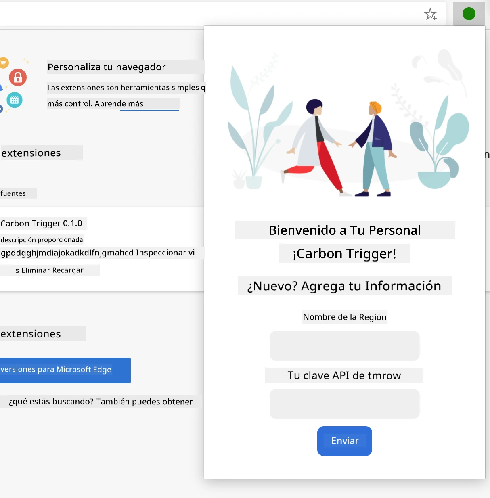

**Vista de Resultados** - Visualización de datos de huella de carbono:
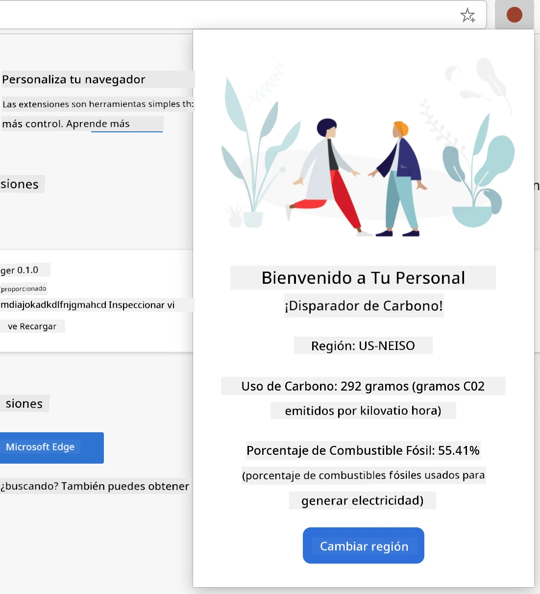

### Construyendo el Formulario de Configuración

El formulario de configuración recopila datos de configuración del usuario durante el uso inicial. Una vez configurada, esta información persiste en el almacenamiento del navegador para sesiones futuras.

En el archivo `/dist/index.html`, agrega esta estructura de formulario:

```html
<form class="form-data" autocomplete="on">
    <div>
        <h2>New? Add your Information</h2>
    </div>
    <div>
        <label for="region">Region Name</label>
        <input type="text" id="region" required class="region-name" />
    </div>
    <div>
        <label for="api">Your API Key from tmrow</label>
        <input type="text" id="api" required class="api-key" />
    </div>
    <button class="search-btn">Submit</button>
</form>
```

**Esto es lo que logra este formulario:**
- **Crea** una estructura de formulario semántica con etiquetas adecuadas y asociaciones de entrada
- **Habilita** la función de autocompletado del navegador para mejorar la experiencia de usuario
- **Requiere** que ambos campos se llenen antes de enviar usando el atributo `required`
- **Organiza** las entradas con nombres de clases descriptivos para facilitar estilos y apuntado de JavaScript
- **Proporciona** instrucciones claras para usuarios configurando la extensión por primera vez

### Construyendo la Visualización de Resultados

A continuación, crea el área de resultados que mostrará los datos de huella de carbono. Añade este HTML debajo del formulario:

```html
<div class="result">
    <div class="loading">loading...</div>
    <div class="errors"></div>
    <div class="data"></div>
    <div class="result-container">
        <p><strong>Region: </strong><span class="my-region"></span></p>
        <p><strong>Carbon Usage: </strong><span class="carbon-usage"></span></p>
        <p><strong>Fossil Fuel Percentage: </strong><span class="fossil-fuel"></span></p>
    </div>
    <button class="clear-btn">Change region</button>
</div>
```

**Desglosando lo que esta estructura provee:**
- **`loading`**: **Muestra** un mensaje de carga mientras se obtienen datos de la API
- **`errors`**: **Muestra** mensajes de error si las llamadas a la API fallan o los datos son inválidos
- **`data`**: **Contiene** datos crudos para depuración durante el desarrollo
- **`result-container`**: **Presenta** la información formateada de huella de carbono a los usuarios
- **`clear-btn`**: **Permite** a los usuarios cambiar su región y reconfigurar la extensión

### Configurando el Proceso de Construcción

Ahora instalemos las dependencias del proyecto y probemos el proceso de construcción:

```bash
npm install
```

**Lo que logra este proceso de instalación:**
- **Descarga** Webpack y otras dependencias de desarrollo especificadas en `package.json`
- **Configura** la cadena de herramientas para compilar JavaScript moderno
- **Prepara** el entorno de desarrollo para construcción y prueba de extensiones
- **Habilita** empaquetado de código, optimización y características de compatibilidad entre navegadores

> 💡 **Insight sobre el Proceso de Construcción**: Webpack agrupa tu código fuente desde `/src/index.js` en `/dist/main.js`. Este proceso optimiza tu código para producción y asegura compatibilidad con navegadores.

### Probando tu Progreso

En este punto, puedes probar tu extensión:
1. **Ejecuta** el comando de compilación para compilar tu código  
2. **Carga** la extensión en tu navegador usando el modo desarrollador  
3. **Verifica** que el formulario se muestre correctamente y tenga un aspecto profesional  
4. **Revisa** que todos los elementos del formulario estén correctamente alineados y funcionales  

**Lo que has logrado:**  
- **Construiste** la estructura HTML fundamental para tu extensión  
- **Creaste** tanto las interfaces de configuración como de resultados con marcado semántico adecuado  
- **Configuraste** un flujo de trabajo moderno usando herramientas estándar de la industria  
- **Preparaste** la base para añadir funcionalidad interactiva en JavaScript  

### 🔄 **Chequeo pedagógico**  
**Progreso en el desarrollo de la extensión**: Verifica tu comprensión antes de continuar:  
- ✅ ¿Puedes explicar el propósito de cada archivo en la estructura del proyecto?  
- ✅ ¿Entiendes cómo el proceso de compilación transforma tu código fuente?  
- ✅ ¿Por qué separamos configuración y resultados en diferentes secciones de la interfaz?  
- ✅ ¿Cómo apoya la estructura del formulario tanto la usabilidad como la accesibilidad?  

**Comprensión del flujo de trabajo de desarrollo**: Ahora deberías poder:  
1. **Modificar** el HTML y CSS de la interfaz de tu extensión  
2. **Ejecutar** el comando de compilación para compilar tus cambios  
3. **Recargar** la extensión en tu navegador para probar actualizaciones  
4. **Depurar** problemas usando las herramientas para desarrolladores del navegador  

Has completado la primera fase del desarrollo de extensiones para navegador. Así como los hermanos Wright primero necesitaron entender la aerodinámica antes de lograr el vuelo, comprender estos conceptos fundamentales te prepara para construir características interactivas más complejas en la próxima lección.  

## Desafío del Agente GitHub Copilot 🚀  

Usa el modo Agente para completar el siguiente desafío:  

**Descripción:** Mejora la extensión del navegador añadiendo validación de formularios y funciones de retroalimentación para el usuario con el fin de mejorar la experiencia al ingresar claves API y códigos de región.  

**Indicaciones:** Crea funciones de validación en JavaScript que verifiquen si el campo de clave API contiene al menos 20 caracteres y si el código de región sigue el formato correcto (como 'US-NEISO'). Añade retroalimentación visual cambiando el borde del input a verde para entradas válidas y rojo para las inválidas. También agrega una función de alternancia para mostrar/ocultar la clave API por motivos de seguridad.  

Aprende más sobre [modo agente](https://code.visualstudio.com/blogs/2025/02/24/introducing-copilot-agent-mode) aquí.  

## 🚀 Desafío  

Mira una tienda de extensiones para navegador y instala una en tu navegador. Puedes examinar sus archivos de formas interesantes. ¿Qué descubres?  

## Quiz Posterior a la Lección  

[Quiz posterior a la lección](https://ff-quizzes.netlify.app/web/quiz/24)  

## Repaso y Estudio Autónomo  

En esta lección aprendiste un poco sobre la historia del navegador web; aprovecha esta oportunidad para aprender cómo los inventores de la World Wide Web imaginaron su uso leyendo más sobre su historia. Algunos sitios útiles incluyen:  

[La historia de los navegadores web](https://www.mozilla.org/firefox/browsers/browser-history/)  

[Historia de la Web](https://webfoundation.org/about/vision/history-of-the-web/)  

[Una entrevista con Tim Berners-Lee](https://www.theguardian.com/technology/2019/mar/12/tim-berners-lee-on-30-years-of-the-web-if-we-dream-a-little-we-can-get-the-web-we-want)  

### ⚡ **Lo que puedes hacer en los próximos 5 minutos**  
- [ ] Abre la página de extensiones de Chrome/Edge (chrome://extensions) y explora las que tienes instaladas  
- [ ] Observa la pestaña de Red en las DevTools de tu navegador mientras cargas una página web  
- [ ] Intenta ver el código fuente de la página (Ctrl+U) para ver la estructura HTML  
- [ ] Inspecciona cualquier elemento de una página web y modifica su CSS en las DevTools  

### 🎯 **Lo que puedes lograr en esta hora**  
- [ ] Completar el quiz posterior a la lección y entender los fundamentos del navegador  
- [ ] Crear un archivo manifest.json básico para una extensión de navegador  
- [ ] Construir una extensión simple de "Hola Mundo" que muestre un popup  
- [ ] Probar la carga de tu extensión en modo desarrollador  
- [ ] Explorar la documentación de extensiones del navegador elegido  

### 📅 **Tu recorrido semanal desarrollando extensiones**  
- [ ] Completar una extensión funcional con utilidad real  
- [ ] Aprender sobre scripts de contenido, scripts de fondo e interacciones en popups  
- [ ] Dominar APIs del navegador como almacenamiento, pestañas y mensajería  
- [ ] Diseñar interfaces amigables para el usuario en tu extensión  
- [ ] Probar tu extensión en diferentes sitios web y escenarios  
- [ ] Publicar tu extensión en la tienda de extensiones del navegador  

### 🌟 **Tu desarrollo mensual en navegador**  
- [ ] Construir múltiples extensiones que resuelvan diferentes problemas de usuario  
- [ ] Aprender APIs avanzadas y mejores prácticas de seguridad  
- [ ] Contribuir a proyectos de extensiones open source y estándares web  
- [ ] Dominar compatibilidad entre navegadores y mejora progresiva  
- [ ] Crear herramientas y plantillas para desarrollo de extensiones para otros  
- [ ] Convertirte en un experto en extensiones de navegador que ayuda a otros desarrolladores  

## 🎯 Tu cronograma de maestría en extensiones de navegador  

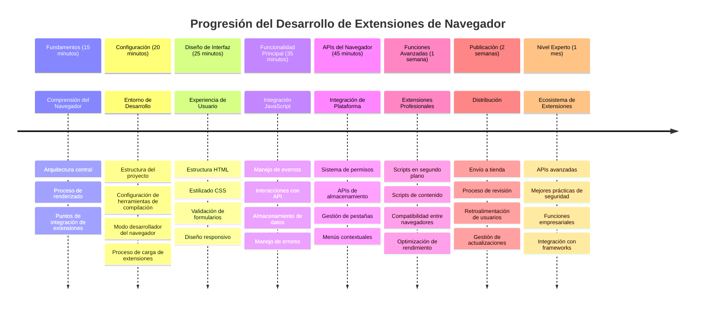
### 🛠️ Resumen de tu kit de herramientas para desarrollo de extensiones  

Después de completar esta lección, ahora cuentas con:  
- **Conocimiento de la arquitectura del navegador**: Entendimiento de motores de renderizado, modelos de seguridad e integración de extensiones  
- **Entorno de desarrollo**: Cadena de herramientas modernas con Webpack, NPM y capacidades de depuración  
- **Fundamentos UI/UX**: Estructura HTML semántica con patrones de revelado progresivo  
- **Conciencia de seguridad**: Entendimiento de permisos y prácticas seguras de desarrollo  
- **Conceptos cross-browser**: Conocimiento de consideraciones de compatibilidad y enfoques de prueba  
- **Integración de API**: Base para trabajar con fuentes de datos externas  
- **Flujo de trabajo profesional**: Procedimientos estándar de la industria para desarrollo y pruebas  

**Aplicaciones en el mundo real**: Estas habilidades se aplican directamente a:  
- **Desarrollo web**: Aplicaciones de página única y aplicaciones web progresivas  
- **Aplicaciones de escritorio**: Electron y software de escritorio basado en web  
- **Desarrollo móvil**: Aplicaciones híbridas y soluciones móviles basadas en web  
- **Herramientas empresariales**: Aplicaciones de productividad internas y automatización de flujos de trabajo  
- **Código abierto**: Contribuciones a proyectos de extensiones y estándares web  

**Siguiente nivel**: ¡Estás listo para añadir funcionalidad interactiva, trabajar con APIs del navegador y crear extensiones que resuelvan problemas reales de usuarios!  

## Tarea  

[Vuelve a dar estilo a tu extensión](assignment.md)

---

<!-- CO-OP TRANSLATOR DISCLAIMER START -->
**Aviso Legal**:
Este documento ha sido traducido utilizando el servicio de traducción por IA [Co-op Translator](https://github.com/Azure/co-op-translator). Aunque nos esforzamos por la precisión, tenga en cuenta que las traducciones automatizadas pueden contener errores o inexactitudes. El documento original en su idioma nativo debe considerarse la fuente autorizada. Para información crítica, se recomienda una traducción profesional realizada por humanos. No nos responsabilizamos por malentendidos o interpretaciones erróneas derivadas del uso de esta traducción.
<!-- CO-OP TRANSLATOR DISCLAIMER END -->