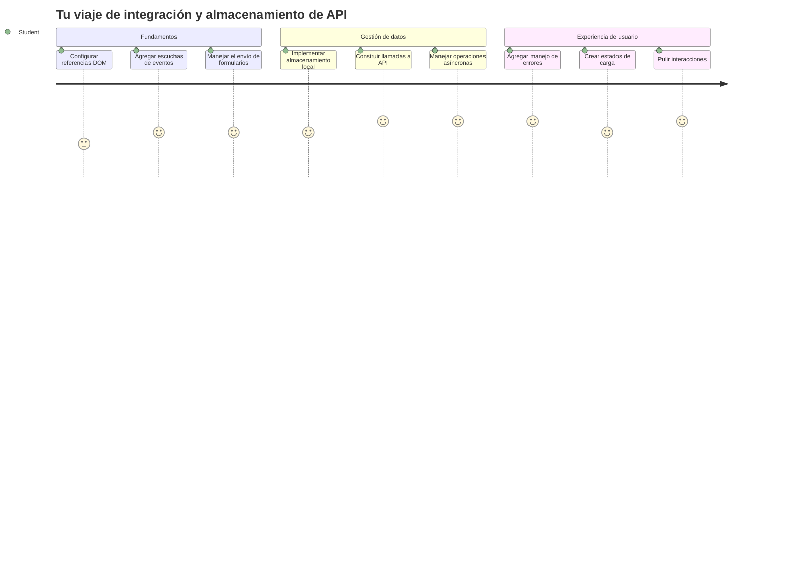
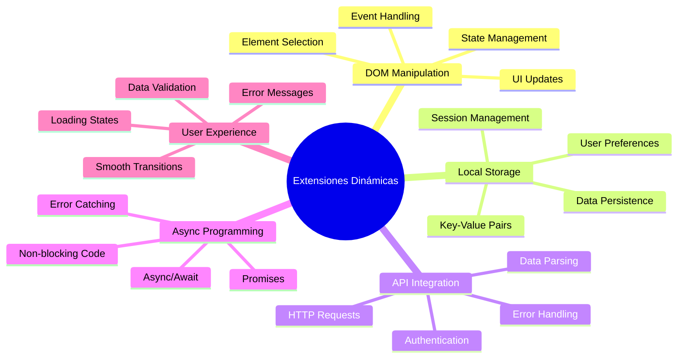
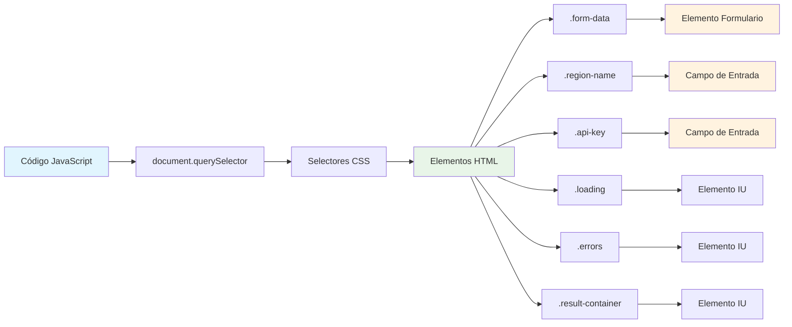
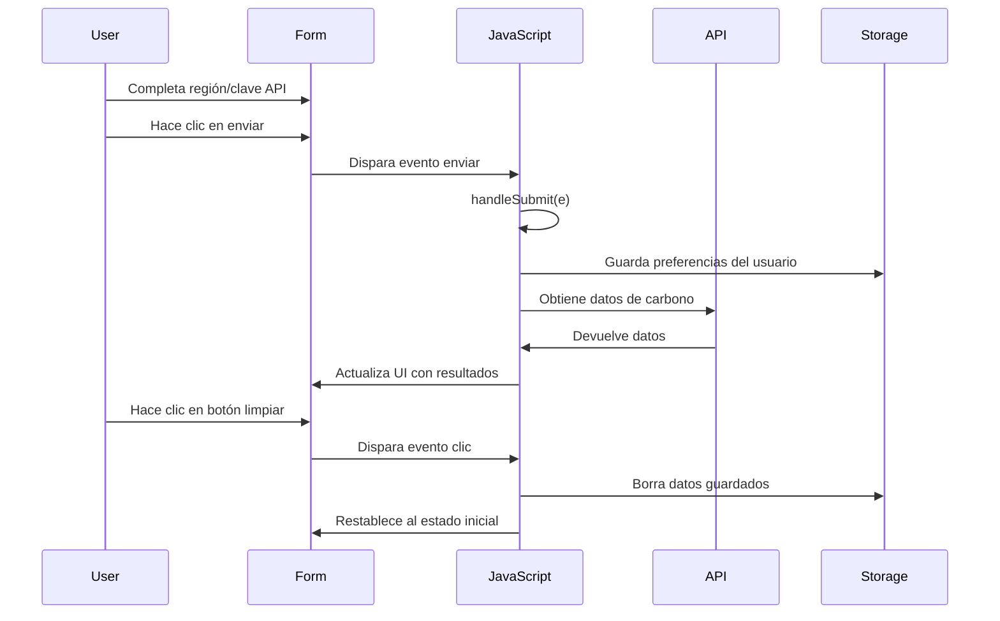
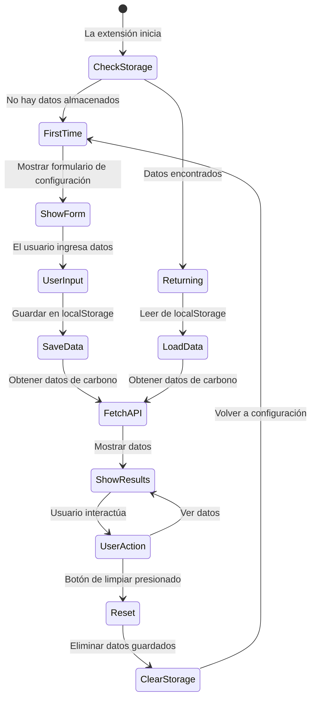
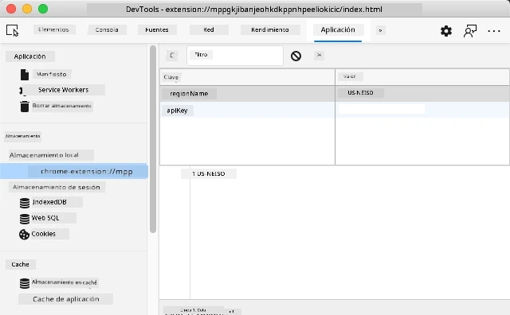
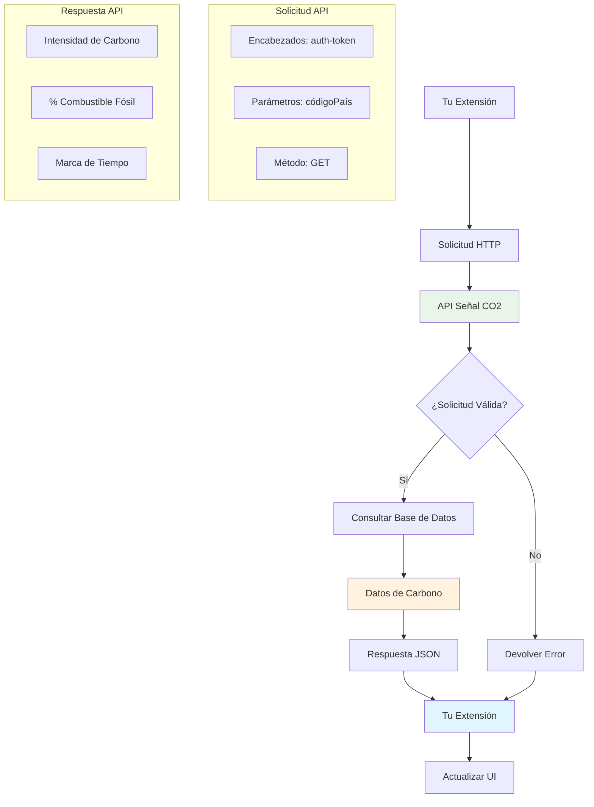
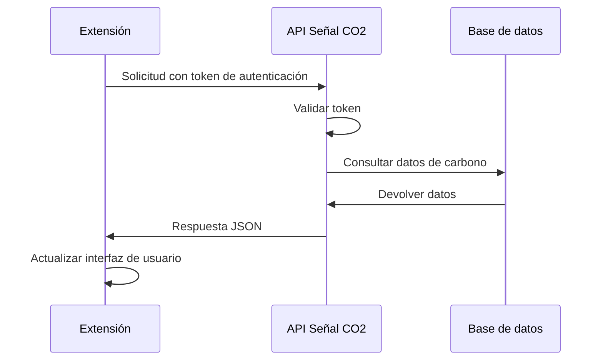
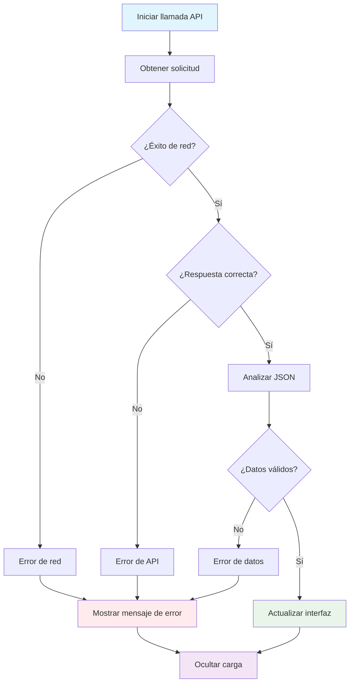
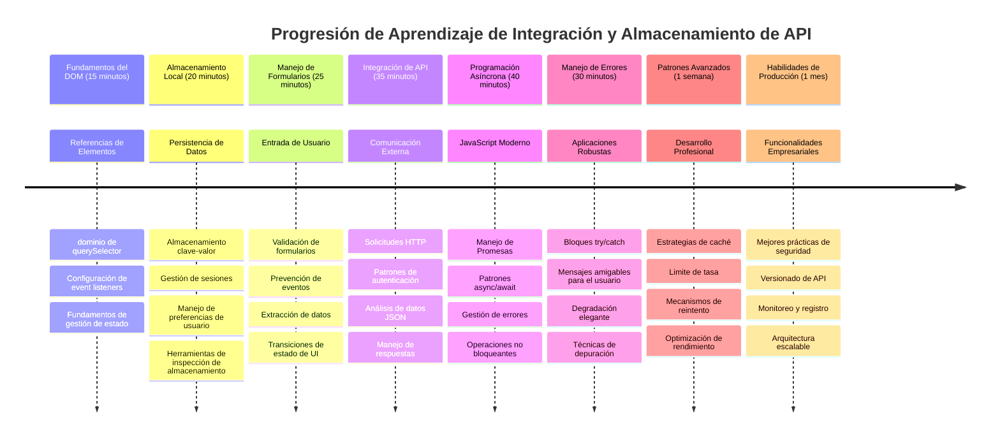

<!--
CO_OP_TRANSLATOR_METADATA:
{
  "original_hash": "2b6203a48c48d8234e0948353b47d84e",
  "translation_date": "2026-01-06T07:36:20+00:00",
  "source_file": "5-browser-extension/2-forms-browsers-local-storage/README.md",
  "language_code": "es"
}
-->
# Proyecto de Extensión del Navegador Parte 2: Llamar a una API, usar Almacenamiento Local


## Cuestionario Pre-Clase

[Cuestionario pre-clase](https://ff-quizzes.netlify.app/web/quiz/25)

## Introducción

¿Recuerdas esa extensión del navegador que comenzaste a construir? Ahora mismo tienes un formulario de buen aspecto, pero es esencialmente estático. Hoy le daremos vida conectándolo a datos reales y dándole memoria.

Piensa en las computadoras de control de misión Apolo; no solo mostraban información fija. Se comunicaban constantemente con la nave espacial, se actualizaban con datos telemétricos y recordaban parámetros críticos de la misión. Ese es el tipo de comportamiento dinámico que construiremos hoy. Tu extensión accederá a internet, obtendrá datos ambientales reales y recordará tus configuraciones para la próxima vez.

La integración con API puede parecer compleja, pero en realidad solo es enseñar a tu código a comunicarse con otros servicios. Ya sea que estés obteniendo datos meteorológicos, feeds de redes sociales o información sobre la huella de carbono como haremos hoy, todo se trata de establecer estas conexiones digitales. También exploraremos cómo los navegadores pueden conservar información, similar a como las bibliotecas han usado catálogos de fichas para recordar dónde van los libros.

Al final de esta lección, tendrás una extensión de navegador que obtiene datos reales, almacena preferencias de usuario y proporciona una experiencia fluida. ¡Comencemos!


✅ Sigue los segmentos numerados en los archivos correspondientes para saber dónde colocar tu código

## Configura los elementos a manipular en la extensión

Antes de que tu JavaScript pueda manipular la interfaz, necesita referencias a elementos HTML específicos. Piensa en ello como un telescopio que necesita apuntar a estrellas particulares; antes de que Galileo pudiera estudiar las lunas de Júpiter, tuvo que localizar y enfocar el propio Júpiter.

En tu archivo `index.js`, crearemos variables `const` que capturan referencias a cada elemento importante del formulario. Esto es parecido a cómo los científicos etiquetan su equipo; en lugar de buscar en todo el laboratorio cada vez, pueden acceder directamente a lo que necesitan.


```javascript
// campos del formulario
const form = document.querySelector('.form-data');
const region = document.querySelector('.region-name');
const apiKey = document.querySelector('.api-key');

// resultados
const errors = document.querySelector('.errors');
const loading = document.querySelector('.loading');
const results = document.querySelector('.result-container');
const usage = document.querySelector('.carbon-usage');
const fossilfuel = document.querySelector('.fossil-fuel');
const myregion = document.querySelector('.my-region');
const clearBtn = document.querySelector('.clear-btn');
```

**Esto es lo que hace este código:**
- **Captura** elementos del formulario usando `document.querySelector()` con selectores de clases CSS
- **Crea** referencias a campos de entrada para el nombre de la región y la clave API
- **Establece** conexiones con elementos para mostrar resultados de datos de uso de carbono
- **Prepara** el acceso a elementos de la UI como indicadores de carga y mensajes de error
- **Almacena** cada referencia en una variable `const` para reutilización fácil en todo tu código

## Añade escuchadores de eventos

Ahora haremos que tu extensión responda a acciones del usuario. Los escuchadores de eventos son la forma en que tu código monitorea las interacciones del usuario. Piensa en ellos como los operadores en los antiguos centrales telefónicas; escuchaban llamadas entrantes y conectaban los circuitos correctos cuando alguien quería hacer una conexión.


```javascript
form.addEventListener('submit', (e) => handleSubmit(e));
clearBtn.addEventListener('click', (e) => reset(e));
init();
```

**Entendiendo estos conceptos:**
- **Adjunta** un escuchador de envío (`submit`) al formulario que se activa cuando los usuarios presionan Enter o hacen clic en enviar
- **Conecta** un escuchador de clic al botón de limpiar para restablecer el formulario
- **Pasa** el objeto evento `(e)` a las funciones manejadoras para control adicional
- **Llama** a la función `init()` inmediatamente para configurar el estado inicial de tu extensión

✅ Observa la sintaxis corta de función flecha usada aquí. Este enfoque moderno de JavaScript es más limpio que las expresiones de función tradicionales, ¡pero ambos funcionan igual de bien!

### 🔄 **Chequeo Pedagógico**
**Comprensión del Manejo de Eventos**: Antes de continuar a la inicialización, asegúrate de poder:
- ✅ Explicar cómo `addEventListener` conecta acciones del usuario a funciones JavaScript
- ✅ Entender por qué pasamos el objeto evento `(e)` a las funciones manejadoras
- ✅ Reconocer la diferencia entre eventos `submit` y `click`
- ✅ Describir cuándo se ejecuta la función `init()` y por qué

**Autoevaluación Rápida**: ¿Qué pasaría si olvidaras `e.preventDefault()` en una sumisión de formulario?
*Respuesta: La página se recargaría, perdiendo todo el estado de JavaScript e interrumpiendo la experiencia del usuario*

## Construye las funciones de inicialización y restablecimiento

Vamos a crear la lógica de inicialización para tu extensión. La función `init()` es como el sistema de navegación de un barco que revisa sus instrumentos; determina el estado actual y ajusta la interfaz en consecuencia. Verifica si alguien ha usado tu extensión antes y carga sus configuraciones previas.

La función `reset()` ofrece a los usuarios un nuevo comienzo, parecido a cómo los científicos reinician sus instrumentos entre experimentos para asegurar datos limpios.

```javascript
function init() {
	// Verificar si el usuario ha guardado previamente las credenciales de la API
	const storedApiKey = localStorage.getItem('apiKey');
	const storedRegion = localStorage.getItem('regionName');

	// Establecer el icono de la extensión a verde genérico (marcador de posición para la lección futura)
	// TODO: Implementar la actualización del icono en la próxima lección

	if (storedApiKey === null || storedRegion === null) {
		// Usuario por primera vez: mostrar el formulario de configuración
		form.style.display = 'block';
		results.style.display = 'none';
		loading.style.display = 'none';
		clearBtn.style.display = 'none';
		errors.textContent = '';
	} else {
		// Usuario recurrente: cargar sus datos guardados automáticamente
		displayCarbonUsage(storedApiKey, storedRegion);
		results.style.display = 'none';
		form.style.display = 'none';
		clearBtn.style.display = 'block';
	}
}

function reset(e) {
	e.preventDefault();
	// Borrar la región almacenada para permitir que el usuario elija una nueva ubicación
	localStorage.removeItem('regionName');
	// Reiniciar el proceso de inicialización
	init();
}
```

**Desglose de lo que sucede aquí:**
- **Recupera** la clave API y región almacenadas del almacenamiento local del navegador
- **Verifica** si es un usuario por primera vez (sin credenciales almacenadas) o un usuario recurrente
- **Muestra** el formulario de configuración para nuevos usuarios y oculta otros elementos de la interfaz
- **Carga** los datos guardados automáticamente para usuarios que regresan y muestra la opción de restablecer
- **Gestiona** el estado de la interfaz de usuario según los datos disponibles

**Conceptos claves sobre Local Storage:**
- **Persiste** datos entre sesiones del navegador (a diferencia del almacenamiento de sesión)
- **Almacena** datos como pares clave-valor usando `getItem()` y `setItem()`
- **Devuelve** `null` cuando no hay datos para una clave dada
- **Proporciona** una manera simple de recordar preferencias y configuraciones del usuario

> 💡 **Entendiendo el Almacenamiento en el Navegador**: [LocalStorage](https://developer.mozilla.org/docs/Web/API/Window/localStorage) es como darle a tu extensión memoria persistente. Considera cómo la antigua Biblioteca de Alejandría almacenaba rollos; la información permanecía disponible incluso cuando los eruditos se iban y regresaban.
>
> **Características clave:**
> - **Persiste** datos incluso después de cerrar el navegador
> - **Sobrevive** a reinicios de la computadora y caídas del navegador
> - **Proporciona** espacio de almacenamiento considerable para preferencias del usuario
> - **Ofrece** acceso instantáneo sin retrasos de red

> **Nota Importante**: Tu extensión de navegador tiene su propio almacenamiento local aislado que es independiente de las páginas web regulares. Esto proporciona seguridad y previene conflictos con otros sitios.

Puedes ver tus datos almacenados abriendo las Herramientas de Desarrollo del navegador (F12), navegando a la pestaña **Aplicación** y expandiendo la sección **Almacenamiento Local**.




> ⚠️ **Consideración de Seguridad**: En aplicaciones de producción, almacenar claves API en LocalStorage implica riesgos de seguridad ya que JavaScript puede acceder a estos datos. Para propósitos de aprendizaje, este enfoque funciona bien, pero las aplicaciones reales deberían usar almacenamiento seguro del lado del servidor para credenciales sensibles.

## Maneja el envío del formulario

Ahora manejaremos lo que sucede cuando alguien envía tu formulario. Por defecto, los navegadores recargan la página al enviar formularios, pero interceptaremos este comportamiento para crear una experiencia más fluida.

Este enfoque refleja cómo el control de misión maneja las comunicaciones con la nave espacial; en lugar de reiniciar todo el sistema para cada transmisión, mantienen operación continua mientras procesan nueva información.

Crea una función que capture el evento de envío del formulario y extraiga la entrada del usuario:

```javascript
function handleSubmit(e) {
	e.preventDefault();
	setUpUser(apiKey.value, region.value);
}
```

**En lo anterior, hemos:**
- **Previene** el comportamiento predeterminado de envío del formulario que recargaría la página
- **Extrae** los valores introducidos por el usuario en los campos clave API y región
- **Pasa** los datos del formulario a la función `setUpUser()` para su procesamiento
- **Mantiene** el comportamiento de aplicación de una sola página evitando recargas

✅ Recuerda que tus campos de formulario HTML incluyen el atributo `required`, por lo que el navegador valida automáticamente que el usuario proporcione tanto la clave API como la región antes de que esta función se ejecute.

## Configura las preferencias del usuario

La función `setUpUser` se encarga de guardar las credenciales del usuario e iniciar la primera llamada a la API. Esto crea una transición suave desde la configuración hasta mostrar resultados.

```javascript
function setUpUser(apiKey, regionName) {
	// Guardar credenciales del usuario para futuras sesiones
	localStorage.setItem('apiKey', apiKey);
	localStorage.setItem('regionName', regionName);
	
	// Actualizar la interfaz para mostrar el estado de carga
	loading.style.display = 'block';
	errors.textContent = '';
	clearBtn.style.display = 'block';
	
	// Obtener datos de uso de carbono con las credenciales del usuario
	displayCarbonUsage(apiKey, regionName);
}
```

**Paso a paso, esto es lo que ocurre:**
- **Guarda** la clave API y el nombre de la región en el almacenamiento local para uso futuro
- **Muestra** un indicador de carga para informar a los usuarios que se están obteniendo datos
- **Limpia** cualquier mensaje de error anterior que estuviera en pantalla
- **Revela** el botón de limpiar para que los usuarios puedan restablecer sus configuraciones después
- **Inicia** la llamada a la API para obtener datos reales de uso de carbono

Esta función crea una experiencia de usuario fluida gestionando tanto la persistencia de datos como las actualizaciones de la interfaz en una acción coordinada.

## Muestra datos de uso de carbono

Ahora conectaremos tu extensión a fuentes externas de datos mediante APIs. Esto transforma tu extensión de una herramienta independiente en algo que puede acceder a información en tiempo real desde toda la internet.

**Entendiendo las APIs**

[Las APIs](https://www.webopedia.com/TERM/A/API.html) son la forma en que diferentes aplicaciones se comunican entre sí. Piensa en ellas como el sistema de telégrafo que conectaba ciudades distantes en el siglo XIX; los operadores enviaban solicitudes a estaciones lejanas y recibían respuestas con la información pedida. Cada vez que revisas redes sociales, haces una pregunta a un asistente de voz o usas una app de entregas, las APIs están facilitando esos intercambios de datos.


**Conceptos clave sobre APIs REST:**
- **REST** significa 'Representational State Transfer'
- **Usa** métodos HTTP estándar (GET, POST, PUT, DELETE) para interactuar con datos
- **Devuelve** datos en formatos predecibles, típicamente JSON
- **Proporciona** puntos finales consistentes basados en URLs para distintos tipos de solicitudes

✅ La [API CO2 Signal](https://www.co2signal.com/) que usaremos provee datos en tiempo real sobre la intensidad de carbono de las redes eléctricas en todo el mundo. ¡Esto ayuda a los usuarios a entender el impacto ambiental de su consumo eléctrico!

> 💡 **Entendiendo JavaScript Asíncrono**: La palabra clave [`async`](https://developer.mozilla.org/docs/Web/JavaScript/Reference/Statements/async_function) permite que tu código maneje múltiples operaciones simultáneamente. Cuando solicitas datos a un servidor, no quieres que toda tu extensión se congele; eso sería como el control de tráfico aéreo deteniendo todas las operaciones mientras espera que un avión responda.
>
> **Beneficios clave:**
> - **Mantiene** la capacidad de respuesta de la extensión mientras se cargan datos
> - **Permite** que otro código continúe ejecutándose durante solicitudes de red
> - **Mejora** la legibilidad del código comparado con patrones tradicionales de callbacks
> - **Facilita** manejar errores de forma elegante ante problemas de red

Aquí un video rápido sobre `async`:

[](https://youtube.com/watch?v=YwmlRkrxvkk "Async y Await para manejar promesas")

> 🎥 Haz clic en la imagen arriba para un video sobre async/await.

### 🔄 **Chequeo Pedagógico**
**Comprensión de Programación Asíncrona**: Antes de sumergirte en la función API, verifica que entiendes:
- ✅ Por qué usamos `async/await` en lugar de bloquear toda la extensión
- ✅ Cómo los bloques `try/catch` manejan errores de red elegantemente
- ✅ La diferencia entre operaciones síncronas y asíncronas
- ✅ Por qué las llamadas a API pueden fallar y cómo manejar esas fallas

**Conexión con el Mundo Real**: Considera estos ejemplos cotidianos asíncronos:
- **Pedir comida**: No esperas en la cocina, recibes un recibo y continúas con otras actividades
- **Enviar correos**: Tu app de email no se congela al enviar, puedes redactar más correos
- **Cargar páginas web**: Las imágenes cargan progresivamente mientras ya puedes leer el texto

**Flujo de Autenticación API**:

Crea la función para obtener y mostrar datos de uso de carbono:

```javascript
// Enfoque moderno con la API fetch (no se necesitan dependencias externas)
async function displayCarbonUsage(apiKey, region) {
	try {
		// Obtener datos de intensidad de carbono de la API CO2 Signal
		const response = await fetch('https://api.co2signal.com/v1/latest', {
			method: 'GET',
			headers: {
				'auth-token': apiKey,
				'Content-Type': 'application/json'
			},
			// Añadir parámetros de consulta para la región específica
			...new URLSearchParams({ countryCode: region }) && {
				url: `https://api.co2signal.com/v1/latest?countryCode=${region}`
			}
		});

		// Verificar si la solicitud a la API fue exitosa
		if (!response.ok) {
			throw new Error(`API request failed: ${response.status}`);
		}

		const data = await response.json();
		const carbonData = data.data;

		// Calcular el valor redondeado de la intensidad de carbono
		const carbonIntensity = Math.round(carbonData.carbonIntensity);

		// Actualizar la interfaz de usuario con los datos obtenidos
		loading.style.display = 'none';
		form.style.display = 'none';
		myregion.textContent = region.toUpperCase();
		usage.textContent = `${carbonIntensity} grams (grams CO₂ emitted per kilowatt hour)`;
		fossilfuel.textContent = `${carbonData.fossilFuelPercentage.toFixed(2)}% (percentage of fossil fuels used to generate electricity)`;
		results.style.display = 'block';

		// TODO: calculateColor(carbonIntensity) - implementar en la próxima lección

	} catch (error) {
		console.error('Error fetching carbon data:', error);
		
		// Mostrar mensaje de error amigable para el usuario
		loading.style.display = 'none';
		results.style.display = 'none';
		errors.textContent = 'Sorry, we couldn\'t fetch data for that region. Please check your API key and region code.';
	}
}
```

**Desglose de lo que sucede aquí:**
- **Usa** la moderna API `fetch()` en vez de librerías externas como Axios para un código más limpio y sin dependencias
- **Implementa** verificación de errores adecuadamente con `response.ok` para detectar fallos de API temprano
- **Maneja** operaciones asíncronas con `async/await` para un flujo de código más legible
- **Se autentica** con la API CO2 Signal usando el encabezado `auth-token`
- **Parses** la respuesta JSON y extrae información de intensidad de carbono
- **Actualiza** múltiples elementos de la UI con datos ambientales formateados
- **Proporciona** mensajes de error amigables cuando las llamadas a la API fallan

**Conceptos modernos de JavaScript demostrados:**
- **Literales de plantilla** con sintaxis `${}` para formatéos limpios de cadenas
- **Manejo de errores** con bloques try/catch para aplicaciones robustas
- **Patrón async/await** para manejar peticiones de red con elegancia
- **Desestructuración de objetos** para extraer datos específicos de respuestas API
- **Encadenamiento de métodos** para múltiples manipulaciones del DOM

✅ Esta función demuestra varios conceptos clave en desarrollo web: comunicar con servidores externos, manejar autenticación, procesar datos, actualizar interfaces y gestionar errores elegantemente. Estas son habilidades fundamentales que los desarrolladores profesionales usan regularmente.


### 🔄 **Chequeo Pedagógico**
**Comprensión Completa del Sistema**: Verifica tu dominio de todo el flujo:
- ✅ Cómo las referencias DOM permiten que JavaScript controle la interfaz
- ✅ Por qué el almacenamiento local crea persistencia entre sesiones del navegador
- ✅ Cómo async/await hace llamadas API sin congelar la extensión
- ✅ Qué pasa cuando las llamadas a API fallan y cómo se manejan errores
- ✅ Por qué la experiencia de usuario incluye estados de carga y mensajes de error

🎉 **Lo que has logrado:** Has creado una extensión de navegador que:
- **Se conecta** a internet y obtiene datos ambientales reales
- **Persiste** configuraciones del usuario entre sesiones
- **Maneja** errores elegantemente en vez de fallar
- **Proporciona** una experiencia de usuario fluida y profesional

Prueba tu trabajo ejecutando `npm run build` y recargando tu extensión en el navegador. Ahora tienes un rastreador funcional de huella de carbono. La siguiente lección agregará funcionalidad dinámica al ícono para completar la extensión.

---

## Desafío GitHub Copilot Agent 🚀

Usa el modo Agente para completar el siguiente desafío:
**Descripción:** Mejora la extensión del navegador añadiendo mejoras en el manejo de errores y funciones para la experiencia del usuario. Este desafío te ayudará a practicar el trabajo con APIs, almacenamiento local y manipulación del DOM usando patrones modernos de JavaScript.

**Indicaciones:** Crea una versión mejorada de la función displayCarbonUsage que incluya: 1) Un mecanismo de reintento para llamadas a la API fallidas con retroceso exponencial, 2) Validación de entrada para el código de región antes de realizar la llamada a la API, 3) Una animación de carga con indicadores de progreso, 4) Caché de respuestas de la API en localStorage con marcas de tiempo de expiración (caché por 30 minutos), y 5) Una función para mostrar datos históricos de llamadas previas a la API. También agrega comentarios JSDoc al estilo TypeScript para documentar todos los parámetros de la función y tipos de retorno.

Aprende más sobre [agent mode](https://code.visualstudio.com/blogs/2025/02/24/introducing-copilot-agent-mode) aquí.

## 🚀 Desafío

Amplía tu comprensión de las APIs explorando la gran variedad de APIs disponibles en el navegador para el desarrollo web. Elige una de estas APIs del navegador y crea una pequeña demostración:

- [Geolocation API](https://developer.mozilla.org/docs/Web/API/Geolocation_API) - Obtén la ubicación actual del usuario
- [Notification API](https://developer.mozilla.org/docs/Web/API/Notifications_API) - Envía notificaciones de escritorio
- [HTML Drag and Drop API](https://developer.mozilla.org/docs/Web/API/HTML_Drag_and_Drop_API) - Crea interfaces interactivas de arrastrar y soltar
- [Web Storage API](https://developer.mozilla.org/docs/Web/API/Web_Storage_API) - Técnicas avanzadas de almacenamiento local
- [Fetch API](https://developer.mozilla.org/docs/Web/API/Fetch_API) - Alternativa moderna a XMLHttpRequest

**Preguntas de investigación a considerar:**
- ¿Qué problemas reales resuelve esta API?
- ¿Cómo maneja la API los errores y casos límite?
- ¿Qué consideraciones de seguridad existen al usar esta API?
- ¿Qué tan ampliamente soportada está esta API en diferentes navegadores?

Después de tu investigación, identifica qué características hacen que una API sea amigable para desarrolladores y confiable.

## Cuestionario Post-Lección

[Cuestionario post-lección](https://ff-quizzes.netlify.app/web/quiz/26)

## Revisión y Autoestudio

Aprendiste sobre LocalStorage y APIs en esta lección, ambas muy útiles para el desarrollador web profesional. ¿Puedes pensar en cómo estas dos cosas funcionan juntas? Piensa en cómo arquitectarías un sitio web que almacene elementos para ser usados por una API.

### ⚡ **Lo que puedes hacer en los próximos 5 minutos**
- [ ] Abre la pestaña Aplicación de DevTools y explora localStorage en cualquier sitio web
- [ ] Crea un formulario HTML simple y prueba la validación del formulario en el navegador
- [ ] Intenta almacenar y recuperar datos usando localStorage en la consola del navegador
- [ ] Inspecciona los datos del formulario enviados usando la pestaña Red

### 🎯 **Lo que puedes lograr esta hora**
- [ ] Completa el cuestionario post-lección y comprende conceptos de manejo de formularios
- [ ] Construye un formulario para extensión de navegador que guarde las preferencias del usuario
- [ ] Implementa validación de formularios del lado cliente con mensajes de error útiles
- [ ] Practica usando la API chrome.storage para persistencia de datos en extensiones
- [ ] Crea una interfaz de usuario que responda a configuraciones guardadas del usuario

### 📅 **Tu construcción de extensión semanal**
- [ ] Completa una extensión de navegador con funcionalidad de formulario
- [ ] Domina diferentes opciones de almacenamiento: local, sincronizado y de sesión
- [ ] Implementa funciones avanzadas de formularios como autocompletado y validación
- [ ] Agrega funcionalidad de importación/exportación para datos de usuario
- [ ] Prueba tu extensión exhaustivamente en distintos navegadores
- [ ] Mejora la experiencia de usuario y el manejo de errores de tu extensión

### 🌟 **Tu maestría mensual en APIs web**
- [ ] Construye aplicaciones complejas usando varias APIs de almacenamiento del navegador
- [ ] Aprende sobre patrones de desarrollo offline-first
- [ ] Contribuye a proyectos de código abierto relacionados con persistencia de datos
- [ ] Domina desarrollo enfocado en privacidad y cumplimiento GDPR
- [ ] Crea librerías reutilizables para manejo de formularios y administración de datos
- [ ] Comparte conocimiento sobre APIs web y desarrollo de extensiones

## 🎯 Tu cronograma de maestría en desarrollo de extensiones


### 🛠️ Resumen de tu kit de herramientas para desarrollo Full-Stack

Después de completar esta lección, ahora cuentas con:
- **Dominio del DOM**: Dirección y manipulación precisa de elementos
- **Experiencia en almacenamiento**: Gestión persistente de datos con localStorage
- **Integración de APIs**: Obtención y autenticación de datos en tiempo real
- **Programación asíncrona**: Operaciones no bloqueantes con JavaScript moderno
- **Manejo de errores**: Aplicaciones robustas que gestionan fallos con gracia
- **Experiencia de usuario**: Estados de carga, validación e interacciones fluidas
- **Patrones modernos**: fetch API, async/await y funcionalidades ES6+

**Habilidades profesionales adquiridas**: Has implementado patrones usados en:
- **Aplicaciones web**: Apps de página única con fuentes de datos externas
- **Desarrollo móvil**: Apps basadas en APIs con capacidades offline
- **Software de escritorio**: Apps Electron con almacenamiento persistente
- **Sistemas empresariales**: Autenticación, caché y manejo de errores
- **Frameworks modernos**: Patrones de gestión de datos en React/Vue/Angular

**Siguiente nivel**: ¡Estás listo para explorar temas avanzados como estrategias de caché, conexiones WebSocket en tiempo real o administración compleja de estado!

## Tarea

[Adoptar una API](assignment.md)

---

<!-- CO-OP TRANSLATOR DISCLAIMER START -->
**Aviso Legal**:  
Este documento ha sido traducido utilizando el servicio de traducción automática [Co-op Translator](https://github.com/Azure/co-op-translator). Aunque nos esforzamos por la precisión, tenga en cuenta que las traducciones automáticas pueden contener errores o inexactitudes. El documento original en su idioma nativo debe considerarse la fuente autorizada. Para información crítica, se recomienda la traducción profesional humana. No nos hacemos responsables de malentendidos o interpretaciones erróneas que puedan surgir del uso de esta traducción.
<!-- CO-OP TRANSLATOR DISCLAIMER END -->