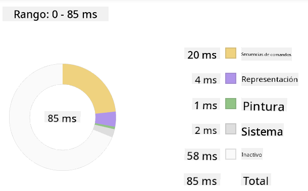

<!--
CO_OP_TRANSLATOR_METADATA:
{
  "original_hash": "49b58721a71cfda824e2f3e1f46908c6",
  "translation_date": "2025-08-29T13:53:04+00:00",
  "source_file": "5-browser-extension/3-background-tasks-and-performance/README.md",
  "language_code": "es"
}
-->
# Proyecto de Extensión para Navegador Parte 3: Aprende sobre Tareas en Segundo Plano y Rendimiento

## Cuestionario Previo a la Clase

[Cuestionario previo a la clase](https://ff-quizzes.netlify.app/web/quiz/27)

### Introducción

En las dos últimas lecciones de este módulo, aprendiste a construir un formulario y un área de visualización para datos obtenidos de una API. Es una forma muy estándar de crear una presencia web. Incluso aprendiste a manejar la obtención de datos de forma asíncrona. Tu extensión para navegador está casi completa.

Queda gestionar algunas tareas en segundo plano, como actualizar el color del ícono de la extensión, por lo que este es un buen momento para hablar sobre cómo el navegador maneja este tipo de tareas. Pensemos en estas tareas del navegador en el contexto del rendimiento de tus recursos web mientras los desarrollas.

## Conceptos Básicos sobre el Rendimiento Web

> "El rendimiento de un sitio web se trata de dos cosas: qué tan rápido carga la página y qué tan rápido se ejecuta el código en ella." -- [Zack Grossbart](https://www.smashingmagazine.com/2012/06/javascript-profiling-chrome-developer-tools/)

El tema de cómo hacer que tus sitios web sean increíblemente rápidos en todo tipo de dispositivos, para todo tipo de usuarios y en todo tipo de situaciones, es, como era de esperarse, muy amplio. Aquí hay algunos puntos a tener en cuenta mientras construyes un proyecto web estándar o una extensión para navegador.

Lo primero que necesitas hacer para asegurarte de que tu sitio funciona de manera eficiente es recopilar datos sobre su rendimiento. El primer lugar para hacerlo es en las herramientas de desarrollo de tu navegador web. En Edge, puedes seleccionar el botón "Configuración y más" (el ícono de tres puntos en la parte superior derecha del navegador), luego navegar a Más herramientas > Herramientas para desarrolladores y abrir la pestaña Rendimiento. También puedes usar los atajos de teclado `Ctrl` + `Shift` + `I` en Windows o `Option` + `Command` + `I` en Mac para abrir las herramientas de desarrollo.

La pestaña Rendimiento contiene una herramienta de Perfilado. Abre un sitio web (prueba, por ejemplo, [https://www.microsoft.com](https://www.microsoft.com/?WT.mc_id=academic-77807-sagibbon)) y haz clic en el botón 'Grabar', luego actualiza el sitio. Detén la grabación en cualquier momento y podrás ver las rutinas generadas para 'script', 'renderizar' y 'pintar' el sitio:


✅ Visita la [Documentación de Microsoft](https://docs.microsoft.com/microsoft-edge/devtools-guide/performance/?WT.mc_id=academic-77807-sagibbon) sobre el panel de Rendimiento en Edge.

> Consejo: para obtener una lectura precisa del tiempo de inicio de tu sitio web, limpia la caché de tu navegador.

Selecciona elementos de la línea de tiempo del perfil para acercarte a los eventos que ocurren mientras tu página se carga.

Obtén una instantánea del rendimiento de tu página seleccionando una parte de la línea de tiempo del perfil y observando el panel de resumen:



Revisa el panel de Registro de Eventos para ver si algún evento tomó más de 15 ms:


✅ ¡Familiarízate con tu perfilador! Abre las herramientas de desarrollo en este sitio y verifica si hay cuellos de botella. ¿Cuál es el recurso que carga más lento? ¿El más rápido?

## Verificaciones de Perfilado

En general, hay algunas "áreas problemáticas" que todo desarrollador web debería vigilar al construir un sitio para evitar sorpresas desagradables al momento de desplegar en producción.

**Tamaños de recursos**: La web se ha vuelto más 'pesada' y, por ende, más lenta en los últimos años. Parte de este peso tiene que ver con el uso de imágenes.

✅ Revisa el [Archivo de Internet](https://httparchive.org/reports/page-weight) para una vista histórica del peso de las páginas y más.

Una buena práctica es asegurarte de que tus imágenes estén optimizadas y se entreguen en el tamaño y resolución adecuados para tus usuarios.

**Recorridos del DOM**: El navegador tiene que construir su Modelo de Objeto de Documento (DOM) basado en el código que escribes, por lo que es importante para el buen rendimiento de la página mantener tus etiquetas al mínimo, usando y estilizando solo lo que la página necesita. En este sentido, el exceso de CSS asociado con una página podría optimizarse; los estilos que solo se necesitan en una página no necesitan incluirse en la hoja de estilos principal, por ejemplo.

**JavaScript**: Todo desarrollador de JavaScript debería vigilar los scripts que bloquean el renderizado y que deben cargarse antes de que el resto del DOM pueda ser recorrido y pintado en el navegador. Considera usar `defer` con tus scripts en línea (como se hace en el módulo Terrarium).

✅ Prueba algunos sitios en un [sitio de prueba de velocidad](https://www.webpagetest.org/) para aprender más sobre las verificaciones comunes que se realizan para determinar el rendimiento de un sitio.

Ahora que tienes una idea de cómo el navegador renderiza los recursos que le envías, veamos las últimas cosas que necesitas hacer para completar tu extensión:

### Crear una función para calcular el color

Trabajando en `/src/index.js`, agrega una función llamada `calculateColor()` después de la serie de variables `const` que configuraste para acceder al DOM:

```JavaScript
function calculateColor(value) {
	let co2Scale = [0, 150, 600, 750, 800];
	let colors = ['#2AA364', '#F5EB4D', '#9E4229', '#381D02', '#381D02'];

	let closestNum = co2Scale.sort((a, b) => {
		return Math.abs(a - value) - Math.abs(b - value);
	})[0];
	console.log(value + ' is closest to ' + closestNum);
	let num = (element) => element > closestNum;
	let scaleIndex = co2Scale.findIndex(num);

	let closestColor = colors[scaleIndex];
	console.log(scaleIndex, closestColor);

	chrome.runtime.sendMessage({ action: 'updateIcon', value: { color: closestColor } });
}
```

¿Qué está pasando aquí? Pasas un valor (la intensidad de carbono) desde la llamada a la API que completaste en la última lección, y luego calculas qué tan cerca está su valor del índice presentado en el array de colores. Luego envías ese valor de color más cercano al runtime de Chrome.

El runtime de Chrome tiene [una API](https://developer.chrome.com/extensions/runtime) que maneja todo tipo de tareas en segundo plano, y tu extensión está aprovechando eso:

> "Usa la API chrome.runtime para recuperar la página de fondo, devolver detalles sobre el manifiesto y escuchar y responder a eventos en el ciclo de vida de la aplicación o extensión. También puedes usar esta API para convertir la ruta relativa de URLs en URLs completamente calificadas."

✅ Si estás desarrollando esta extensión para Edge, podría sorprenderte que estés usando una API de Chrome. Las versiones más recientes del navegador Edge se ejecutan en el motor del navegador Chromium, por lo que puedes aprovechar estas herramientas.

> Nota: si deseas perfilar una extensión para navegador, lanza las herramientas de desarrollo desde dentro de la propia extensión, ya que es una instancia de navegador separada.

### Establecer un color de ícono predeterminado

Ahora, en la función `init()`, configura el ícono para que sea genéricamente verde al inicio llamando nuevamente a la acción `updateIcon` de Chrome:

```JavaScript
chrome.runtime.sendMessage({
	action: 'updateIcon',
		value: {
			color: 'green',
		},
});
```

### Llamar a la función, ejecutar la llamada

A continuación, llama a esa función que acabas de crear agregándola a la promesa devuelta por la API C02Signal:

```JavaScript
//let CO2...
calculateColor(CO2);
```

Y finalmente, en `/dist/background.js`, agrega el listener para estas llamadas de acción en segundo plano:

```JavaScript
chrome.runtime.onMessage.addListener(function (msg, sender, sendResponse) {
	if (msg.action === 'updateIcon') {
		chrome.browserAction.setIcon({ imageData: drawIcon(msg.value) });
	}
});
//borrowed from energy lollipop extension, nice feature!
function drawIcon(value) {
	let canvas = document.createElement('canvas');
	let context = canvas.getContext('2d');

	context.beginPath();
	context.fillStyle = value.color;
	context.arc(100, 100, 50, 0, 2 * Math.PI);
	context.fill();

	return context.getImageData(50, 50, 100, 100);
}
```

En este código, estás agregando un listener para cualquier mensaje que llegue al gestor de tareas en segundo plano. Si se llama 'updateIcon', entonces se ejecuta el siguiente código para dibujar un ícono del color adecuado utilizando la API de Canvas.

✅ Aprenderás más sobre la API de Canvas en las [lecciones del Juego Espacial](../../6-space-game/2-drawing-to-canvas/README.md).

Ahora, reconstruye tu extensión (`npm run build`), actualiza y lanza tu extensión, y observa cómo cambia el color. ¿Es un buen momento para hacer un recado o lavar los platos? ¡Ahora lo sabes!

¡Felicidades! Has construido una extensión útil para navegador y aprendido más sobre cómo funciona el navegador y cómo perfilar su rendimiento.

---

## 🚀 Desafío

Investiga algunos sitios web de código abierto que han existido durante mucho tiempo y, basándote en su historial de GitHub, ve si puedes determinar cómo se optimizaron a lo largo de los años para el rendimiento, si es que lo hicieron. ¿Cuál es el punto problemático más común?

## Cuestionario Posterior a la Clase

[Cuestionario posterior a la clase](https://ff-quizzes.netlify.app/web/quiz/28)

## Repaso y Autoestudio

Considera suscribirte a un [boletín de rendimiento](https://perf.email/).

Investiga algunas de las formas en que los navegadores evalúan el rendimiento web revisando las pestañas de rendimiento en sus herramientas web. ¿Encuentras alguna diferencia importante?

## Tarea

[Analiza un sitio para evaluar su rendimiento](assignment.md)

---

**Descargo de responsabilidad**:  
Este documento ha sido traducido utilizando el servicio de traducción automática [Co-op Translator](https://github.com/Azure/co-op-translator). Si bien nos esforzamos por lograr precisión, tenga en cuenta que las traducciones automáticas pueden contener errores o imprecisiones. El documento original en su idioma nativo debe considerarse como la fuente autorizada. Para información crítica, se recomienda una traducción profesional realizada por humanos. No nos hacemos responsables de malentendidos o interpretaciones erróneas que puedan surgir del uso de esta traducción.