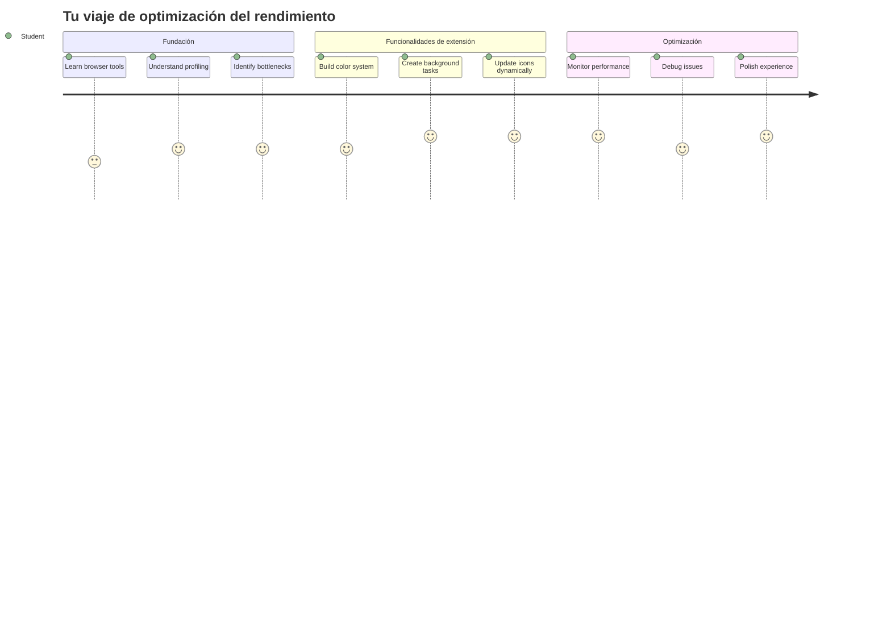
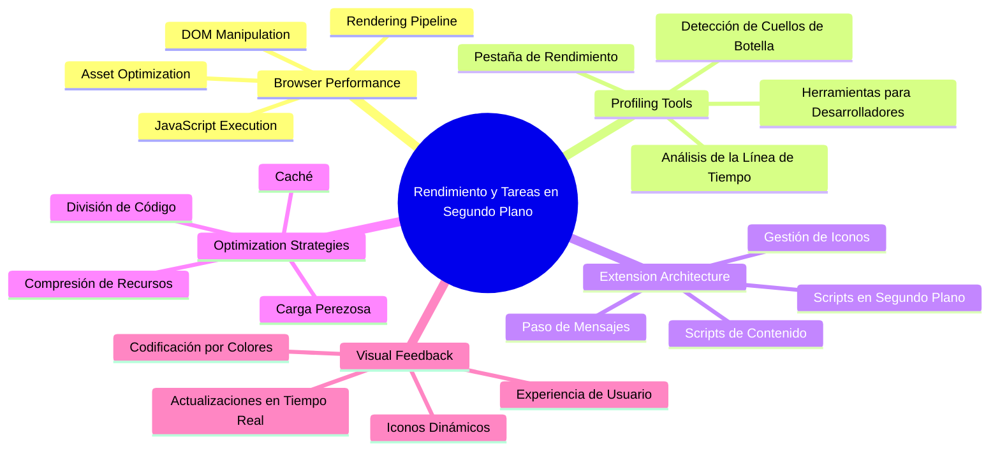
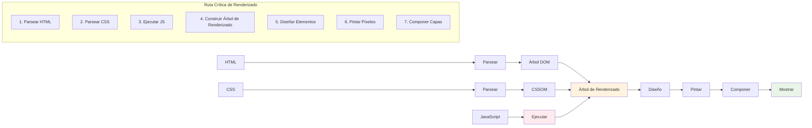
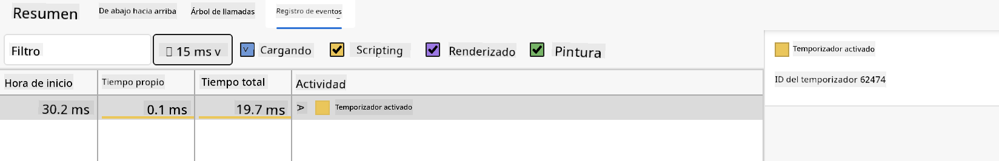
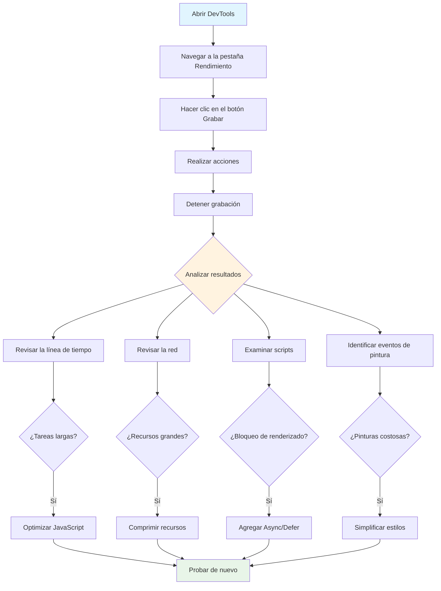
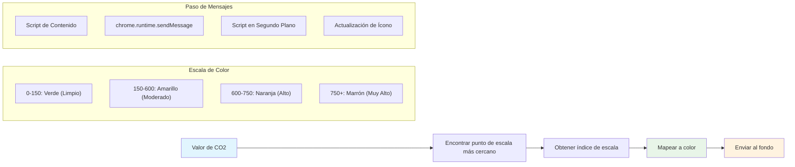
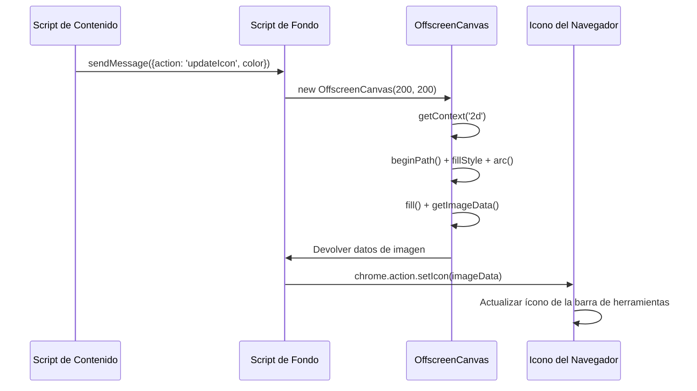
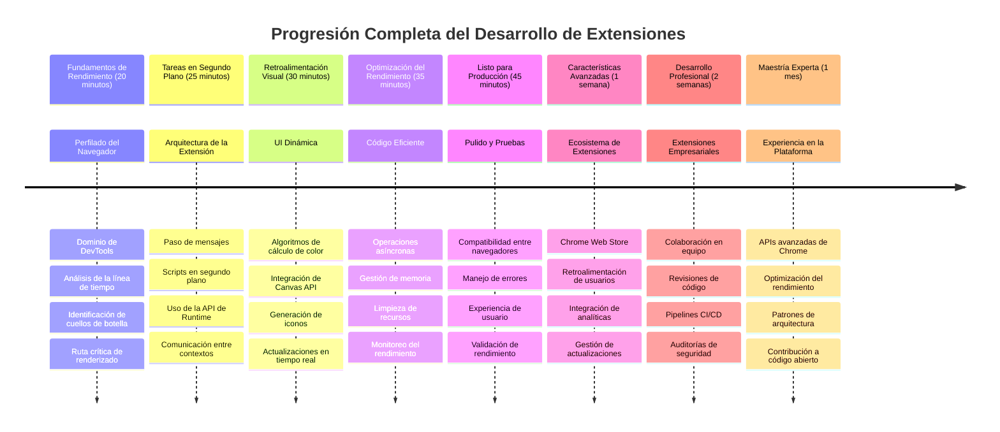

<!--
CO_OP_TRANSLATOR_METADATA:
{
  "original_hash": "b275fed2c6fc90d2b9b6661a3225faa2",
  "translation_date": "2026-01-06T07:38:29+00:00",
  "source_file": "5-browser-extension/3-background-tasks-and-performance/README.md",
  "language_code": "es"
}
-->
# Proyecto de Extensión de Navegador Parte 3: Aprende sobre Tareas en Segundo Plano y Rendimiento


¿Alguna vez te has preguntado qué hace que algunas extensiones de navegador se sientan ágiles y sensibles mientras que otras parecen lentas? El secreto está en lo que sucede detrás de escenas. Mientras los usuarios hacen clic en la interfaz de tu extensión, hay todo un mundo de procesos en segundo plano gestionando silenciosamente la obtención de datos, la actualización de íconos y los recursos del sistema.

Esta es nuestra última lección de la serie de extensiones de navegador, y vamos a hacer que tu rastreador de huella de carbono funcione sin problemas. Añadirás actualizaciones dinámicas del ícono y aprenderás a detectar problemas de rendimiento antes de que se conviertan en problemas graves. Es como afinar un auto de carrera: pequeñas optimizaciones pueden hacer una gran diferencia en cómo todo funciona.

Para cuando terminemos, tendrás una extensión pulida y entenderás los principios de rendimiento que separan a las buenas aplicaciones web de las excelentes. Vamos a sumergirnos en el mundo de la optimización del navegador.

## Cuestionario Previo a la Conferencia

[Cuestionario previo a la conferencia](https://ff-quizzes.netlify.app/web/quiz/27)

### Introducción

En nuestras lecciones anteriores, construiste un formulario, lo conectaste a una API y abordaste la obtención asíncrona de datos. Tu extensión está tomando forma de manera muy sólida.

Ahora necesitamos añadir los toques finales, como hacer que el ícono de la extensión cambie de color según los datos de carbono. Esto me recuerda cómo la NASA tenía que optimizar cada sistema en la nave espacial Apolo. No podían permitirse ciclos o memoria desperdiciados porque vidas dependían del rendimiento. Aunque nuestra extensión de navegador no es tan crítica, los mismos principios aplican: un código eficiente crea mejores experiencias para el usuario.


## Conceptos Básicos de Rendimiento Web

Cuando tu código funciona de manera eficiente, la gente puede realmente *sentir* la diferencia. ¿Conoces ese momento cuando una página carga instantáneamente o una animación fluye suavemente? Eso es buen rendimiento en acción.

El rendimiento no es solo sobre velocidad, sino sobre crear experiencias web que se sientan naturales en lugar de torpes y frustrantes. En los primeros días de la computación, Grace Hopper mantenía en su escritorio una nanosegundos (un trozo de cable de aproximadamente un pie de largo) para mostrar lo lejos que la luz viaja en una milmillonésima de segundo. Era su forma de explicar por qué cada microsegundo importa en computación. Exploremos las herramientas detectives que te ayudan a descubrir qué está ralentizando todo.

> "El rendimiento de un sitio web se trata de dos cosas: qué tan rápido carga la página y qué tan rápido se ejecuta el código en ella." -- [Zack Grossbart](https://www.smashingmagazine.com/2012/06/javascript-profiling-chrome-developer-tools/)

El tema de cómo hacer que tus sitios web sean increíblemente rápidos en todo tipo de dispositivos, para todo tipo de usuarios, y en todo tipo de situaciones, es, como era de esperar, vasto. Aquí hay algunos puntos para tener en cuenta mientras construyes un proyecto web estándar o una extensión de navegador.

El primer paso para optimizar tu sitio es entender qué es lo que realmente pasa bajo el capó. Afortunadamente, tu navegador viene con herramientas detectives poderosas incorporadas.


Para abrir las Herramientas de Desarrollador en Edge, haz clic en esos tres puntos en la esquina superior derecha, luego ve a Más Herramientas > Herramientas de Desarrollador. O usa el atajo de teclado: `Ctrl` + `Shift` + `I` en Windows o `Option` + `Command` + `I` en Mac. Una vez ahí, haz clic en la pestaña de Rendimiento – aquí es donde harás tu investigación.

**Aquí tienes tu kit de herramientas detectives de rendimiento:**
- **Abre** las Herramientas de Desarrollador (¡las usarás constantemente como desarrollador!)
- **Dirígete** a la pestaña de Rendimiento – piensa en ella como el rastreador de fitness de tu aplicación web
- **Presiona** ese botón de Grabar y observa tu página en acción
- **Estudia** los resultados para detectar qué está ralentizando las cosas

Probémoslo. Abre un sitio web (Microsoft.com funciona bien para esto) y haz clic en el botón 'Grabar'. Ahora recarga la página y observa cómo el perfilador captura todo lo que sucede. Cuando detienes la grabación, verás un desglose detallado de cómo el navegador 'ejecuta scripts', 'renderiza' y 'pinta' el sitio. Me recuerda a cómo el control de misión monitorea cada sistema durante un lanzamiento de cohete: obtienes datos en tiempo real sobre exactamente qué está pasando y cuándo.


✅ La [Documentación de Microsoft](https://docs.microsoft.com/microsoft-edge/devtools-guide/performance/?WT.mc_id=academic-77807-sagibbon) tiene muchos más detalles si quieres profundizar

> Consejo profesional: Limpia la caché de tu navegador antes de probar para ver cómo tu sitio funciona para los visitantes por primera vez; generalmente es bastante diferente de las visitas repetidas.

Selecciona elementos de la línea de tiempo del perfil para acercarte a eventos que ocurren mientras tu página carga.

Obtén una instantánea del rendimiento de tu página seleccionando una parte de la línea de tiempo del perfil y mirando el panel de resumen:


Chequea el panel de Registro de Eventos para ver si algún evento tardó más de 15 ms:



✅ ¡Conoce tu perfilador! Abre las herramientas de desarrollador en este sitio y ve si hay cuellos de botella. ¿Cuál es el recurso que carga más lento? ¿El más rápido?


## Qué Buscar al Hacer Perfilado

Ejecutar el perfilador es solo el comienzo: la verdadera habilidad está en saber qué te están diciendo esos gráficos coloridos. No te preocupes, aprenderás a leerlos. Los desarrolladores experimentados han aprendido a detectar señales de advertencia antes de que se conviertan en problemas graves.

Hablemos de los sospechosos habituales: los causantes de problemas de rendimiento que suelen colarse en proyectos web. Como Marie Curie debía monitorear cuidadosamente los niveles de radiación en su laboratorio, necesitamos vigilar ciertos patrones que indican problemas en ciernes. Detectarlos temprano te ahorrará a ti (y a tus usuarios) mucha frustración.

**Tamaños de activos**: Los sitios web han ido haciéndose cada vez más "pesados" con los años, y gran parte de ese peso extra proviene de las imágenes. Es como si estuviéramos metiendo cada vez más cosas en nuestras maletas digitales.

✅ Consulta el [Internet Archive](https://httparchive.org/reports/page-weight) para ver cómo han crecido los tamaños de página a lo largo del tiempo – es bastante revelador.

**Cómo mantener optimizados tus activos:**
- **Comprime** esas imágenes! Los formatos modernos como WebP pueden reducir dramáticamente el tamaño de archivo
- **Sirve** el tamaño correcto de imagen para cada dispositivo – no hay necesidad de enviar imágenes de escritorio enormes a teléfonos
- **Minimiza** tu CSS y JavaScript – cada byte cuenta
- **Usa** carga diferida para que las imágenes solo se descarguen cuando los usuarios realmente hagan scroll hacia ellas

**Recorridos del DOM**: El navegador debe construir su Modelo de Objetos del Documento basado en el código que escribes, por lo que es de interés para un buen rendimiento de página mantener tus etiquetas mínimas, usando y estilizando solo lo que la página necesita. En este sentido, el CSS extra asociado a una página podría optimizarse; por ejemplo, los estilos que solo se necesitan en una página no deben incluirse en la hoja de estilos principal.

**Estrategias clave para optimizar el DOM:**
- **Minimiza** el número de elementos HTML y niveles de anidamiento
- **Elimina** reglas CSS no usadas y consolida hojas de estilo eficientemente
- **Organiza** el CSS para cargar solo lo necesario en cada página
- **Estructura** el HTML semánticamente para un mejor análisis del navegador

**JavaScript**: Todo desarrollador de JavaScript debe vigilar los scripts que bloquean el renderizado y que deben cargarse antes de que el DOM pueda ser recorrido y pintado en el navegador. Considera usar `defer` con tus scripts en línea (como se hace en el módulo Terrarium).

**Técnicas modernas de optimización de JavaScript:**
- **Usa** el atributo `defer` para cargar scripts después del análisis del DOM
- **Implementa** división de código para cargar solo el JavaScript necesario
- **Aplica** carga diferida para funcionalidades no críticas
- **Minimiza** el uso de librerías y frameworks pesados cuando sea posible

✅ Prueba algunos sitios en un [Sitio de Prueba de Velocidad](https://www.webpagetest.org/) para aprender más sobre las verificaciones comunes que se hacen para determinar el rendimiento del sitio.

### 🔄 **Chequeo Pedagógico**
**Entendimiento del Rendimiento**: Antes de construir funciones para la extensión, asegúrate de que puedes:
- ✅ Explicar la ruta crítica de renderizado desde HTML a píxeles
- ✅ Identificar cuellos de botella comunes de rendimiento en aplicaciones web
- ✅ Usar las herramientas de desarrollador del navegador para perfilar el rendimiento de la página
- ✅ Entender cómo el tamaño del activo y la complejidad del DOM afectan la velocidad

**Autoevaluación Rápida**: ¿Qué sucede cuando tienes JavaScript que bloquea el renderizado?
*Respuesta: El navegador debe descargar y ejecutar el script antes de poder continuar analizando el HTML y renderizando la página*

**Impacto Real en el Rendimiento**:
- **Retraso de 100 ms**: Los usuarios notan la ralentización
- **Retraso de 1 segundo**: Los usuarios empiezan a perder foco
- **Más de 3 segundos**: El 40% de los usuarios abandona la página
- **Redes móviles**: El rendimiento es aún más importante

Ahora que tienes una idea de cómo el navegador renderiza los activos que le envías, veamos las últimas cosas que debes hacer para completar tu extensión:

### Crea una función para calcular color

Ahora crearemos una función que convierta datos numéricos en colores significativos. Piensa en ello como un sistema de semáforo: verde para energía limpia, rojo para alta intensidad de carbono.

Esta función tomará los datos de CO2 de nuestra API y determinará qué color representa mejor el impacto ambiental. Es similar a cómo los científicos usan la codificación por colores en mapas de calor para visualizar patrones complejos de datos – desde temperaturas oceánicas hasta formación de estrellas. Añadamos esto en `/src/index.js`, justo después de esas variables `const` que configuramos antes:


```javascript
function calculateColor(value) {
	// Definir escala de intensidad de CO2 (gramos por kWh)
	const co2Scale = [0, 150, 600, 750, 800];
	// Colores correspondientes desde verde (limpio) hasta marrón oscuro (alto carbono)
	const colors = ['#2AA364', '#F5EB4D', '#9E4229', '#381D02', '#381D02'];

	// Encontrar el valor de escala más cercano a nuestra entrada
	const closestNum = co2Scale.sort((a, b) => {
		return Math.abs(a - value) - Math.abs(b - value);
	})[0];
	
	console.log(`${value} is closest to ${closestNum}`);
	
	// Encontrar el índice para el mapeo de colores
	const num = (element) => element > closestNum;
	const scaleIndex = co2Scale.findIndex(num);

	const closestColor = colors[scaleIndex];
	console.log(scaleIndex, closestColor);

	// Enviar mensaje de actualización de color al script de fondo
	chrome.runtime.sendMessage({ action: 'updateIcon', value: { color: closestColor } });
}
```

**Desglosemos esta ingeniosa función:**
- **Establece** dos arreglos – uno para niveles de CO2, otro para colores (verde = limpio, marrón = sucio!)
- **Encuentra** la coincidencia más cercana a nuestro valor real de CO2 usando un ordenamiento elegante de arreglos
- **Obtiene** el color correspondiente usando el método findIndex()
- **Envía** un mensaje al script de fondo de Chrome con el color elegido
- **Usa** literales de plantilla (esas comillas invertidas) para formateo de cadenas más limpio
- **Mantiene** todo organizado con declaraciones const

La [API](https://developer.chrome.com/extensions/runtime) de `chrome.runtime` es como el sistema nervioso de tu extensión: maneja toda la comunicación y tareas detrás de escena:

> "Usa la API chrome.runtime para recuperar la página de fondo, devolver detalles sobre el manifiesto, y escuchar y responder a eventos en el ciclo de vida de la aplicación o extensión. También puedes usar esta API para convertir rutas relativas de URLs a URLs completamente calificadas."

**Por qué la API de Chrome Runtime es tan útil:**
- **Permite** que diferentes partes de tu extensión se comuniquen entre sí
- **Gestiona** el trabajo en segundo plano sin congelar la interfaz de usuario
- **Maneja** los eventos del ciclo de vida de tu extensión
- **Facilita** el paso de mensajes entre scripts de manera súper sencilla

✅ Si estás desarrollando esta extensión para Edge, quizá te sorprenda que uses una API de chrome. Las versiones más nuevas de Edge funcionan con el motor Chromium, así que puedes aprovechar estas herramientas.

```mermaid
architecture-beta
    group browser(logos:chrome)[Navegador]
    
    service popup(logos:html5)[Interfaz Emergente] in browser
    service content(logos:javascript)[Script de Contenido] in browser
    service background(database)[Script en Segundo Plano] in browser
    service api(logos:api)[API Externa] in browser
    
    popup:R -- L:content
    content:R -- L:background
    background:T -- B:api
    content:T -- B:api
    
    junction junctionCenter in browser
    popup:R -- L:junctionCenter
    junctionCenter:R -- L:background
```


> **Consejo Profesional**: Si quieres perfilar una extensión de navegador, lanza las herramientas de desarrollador desde dentro de la propia extensión, ya que es su propia instancia separada del navegador. Esto te da acceso a métricas de rendimiento específicas de la extensión.

### Establece un color de ícono predeterminado

Antes de comenzar a obtener datos reales, demos a nuestra extensión un punto de partida. A nadie le gusta mirar un ícono en blanco o que parezca roto. Empezaremos con un color verde para que los usuarios sepan que la extensión está funcionando desde el momento en que la instalan.

En tu función `init()`, configuremos ese ícono verde por defecto:

```javascript
chrome.runtime.sendMessage({
	action: 'updateIcon',
	value: {
		color: 'green',
	},
});
```

**Lo que logra esta inicialización:**
- **Establece** un color verde neutro como estado predeterminado
- **Proporciona** retroalimentación visual inmediata cuando la extensión carga
- **Establece** el patrón de comunicación con el script de fondo
- **Garantiza** que los usuarios vean una extensión funcional antes de que carguen los datos

### Llama a la función, ejecuta la llamada

Ahora conectemos todo para que cuando lleguen nuevos datos de CO2, tu ícono se actualice automáticamente con el color correcto. Es como conectar el circuito final en un dispositivo electrónico: de repente todos los componentes trabajan como un solo sistema.

Agrega esta línea justo después de obtener los datos de CO2 de la API:

```javascript
// Después de recuperar los datos de CO2 de la API
// let CO2 = data.data[0].intensity.actual;
calculateColor(CO2);
```

**Esta integración hace:**
- **Conecta** el flujo de datos de la API con el sistema indicador visual
- **Dispara** actualizaciones del ícono automáticamente cuando llegan datos nuevos
- **Garantiza** retroalimentación visual en tiempo real basada en la intensidad actual de carbono
- **Mantiene** la separación de responsabilidades entre la obtención de datos y la lógica de visualización

Y finalmente, en `/dist/background.js`, añade el listener para estas llamadas de acción en segundo plano:

```javascript
// Escuchar mensajes del script de contenido
chrome.runtime.onMessage.addListener(function (msg, sender, sendResponse) {
	if (msg.action === 'updateIcon') {
		chrome.action.setIcon({ imageData: drawIcon(msg.value) });
	}
});

// Dibujar icono dinámico usando la API Canvas
// Tomado de la extensión energy lollipop - ¡buena característica!
function drawIcon(value) {
	// Crear un canvas fuera de pantalla para mejor rendimiento
	const canvas = new OffscreenCanvas(200, 200);
	const context = canvas.getContext('2d');

	// Dibujar un círculo coloreado que representa la intensidad de carbono
	context.beginPath();
	context.fillStyle = value.color;
	context.arc(100, 100, 50, 0, 2 * Math.PI);
	context.fill();

	// Devolver los datos de la imagen para el icono del navegador
	return context.getImageData(50, 50, 100, 100);
}
```

**Esto es lo que hace este script en segundo plano:**
- **Escucha** mensajes de tu script principal (como un recepcionista que atiende llamadas)
- **Procesa** esas solicitudes 'updateIcon' para cambiar el ícono de tu barra de herramientas
- **Crea** íconos nuevos al vuelo usando la API de Canvas
- **Dibuja** un círculo colorido simple que muestra la intensidad de carbono actual
- **Actualiza** la barra de herramientas del navegador con el ícono nuevo
- **Usa** OffscreenCanvas para un rendimiento fluido (sin bloquear la interfaz)

✅ Aprenderás más sobre la API de Canvas en las [lecciones del Juego Espacial](../../6-space-game/2-drawing-to-canvas/README.md).


### 🔄 **Chequeo Pedagógico**
**Comprensión Completa de la Extensión**: Verifica tu dominio de todo el sistema:
- ✅ ¿Cómo funciona el paso de mensajes entre los diferentes scripts de la extensión?
- ✅ ¿Por qué usamos OffscreenCanvas en lugar de Canvas regular para el rendimiento?
- ✅ ¿Qué papel juega la API de Chrome Runtime en la arquitectura de extensiones?
- ✅ ¿Cómo el algoritmo de cálculo de colores mapea datos a retroalimentación visual?

**Consideraciones de rendimiento**: Tu extensión ahora demuestra:
- **Mensajería eficiente**: Comunicación limpia entre contextos de script
- **Renderizado optimizado**: OffscreenCanvas evita bloqueos en la interfaz
- **Actualizaciones en tiempo real**: Cambios dinámicos en el ícono basados en datos en vivo
- **Gestión de memoria**: Limpieza adecuada y manejo de recursos

**Hora de probar tu extensión:**
- **Construye** todo con `npm run build`
- **Recarga** tu extensión en el navegador (no olvides este paso)
- **Abre** tu extensión y observa cómo cambia el color del ícono
- **Verifica** cómo responde a datos reales de carbono de todo el mundo

Ahora sabrás de un vistazo si es un buen momento para esa carga de ropa o si deberías esperar energía más limpia. Acabas de construir algo realmente útil y aprendiste sobre rendimiento en navegadores en el proceso.

## Desafío de GitHub Copilot Agent 🚀

Usa el modo Agente para completar el siguiente desafío:

**Descripción:** Mejora las capacidades de monitoreo de rendimiento de la extensión del navegador agregando una función que rastree y muestre los tiempos de carga para diferentes componentes de la extensión.

**Indicaciones:** Crea un sistema de monitoreo de rendimiento para la extensión del navegador que mida y registre el tiempo que tarda en obtener datos de CO2 de la API, calcular colores y actualizar el ícono. Agrega una función llamada `performanceTracker` que use la API de Performance para medir estas operaciones y muestre los resultados en la consola del navegador con marcas de tiempo y métricas de duración.

Aprende más sobre el [modo agente](https://code.visualstudio.com/blogs/2025/02/24/introducing-copilot-agent-mode) aquí.

## 🚀 Desafío

Aquí tienes una interesante misión de detective: elige algunos sitios web de código abierto que hayan estado funcionando por años (piensa en Wikipedia, GitHub o Stack Overflow) y examina su historial de commits. ¿Puedes detectar dónde hicieron mejoras de rendimiento? ¿Qué problemas se repetían?

**Tu método de investigación:**
- **Busca** mensajes de commits con palabras como "optimizar", "rendimiento" o "más rápido"
- **Observa** patrones: ¿siguen corrigiendo los mismos tipos de problemas?
- **Identifica** los culpables comunes que ralentizan los sitios web
- **Comparte** tus hallazgos para que otros desarrolladores aprendan de ejemplos reales

## Cuestionario posterior a la conferencia

[Cuestionario posterior a la conferencia](https://ff-quizzes.netlify.app/web/quiz/28)

## Revisión y autoestudio

Considera suscribirte a un [boletín de rendimiento](https://perf.email/)

Investiga algunas de las formas en que los navegadores miden el rendimiento web explorando las pestañas de rendimiento en sus herramientas para desarrolladores. ¿Notas alguna diferencia importante?

### ⚡ **Lo que puedes hacer en los próximos 5 minutos**
- [ ] Abre el Administrador de tareas del navegador (Shift+Esc en Chrome) para ver el uso de recursos de las extensiones
- [ ] Usa la pestaña de Rendimiento en DevTools para grabar y analizar el rendimiento de páginas web
- [ ] Revisa la página de Extensiones del navegador para ver qué extensiones afectan el tiempo de inicio
- [ ] Prueba desactivar extensiones temporalmente para ver diferencias de rendimiento

### 🎯 **Lo que puedes lograr en esta hora**
- [ ] Completa el cuestionario posterior a la lección y comprende conceptos de rendimiento
- [ ] Implementa un script en segundo plano para tu extensión del navegador
- [ ] Aprende a usar browser.alarms para tareas en segundo plano eficientes
- [ ] Practica el paso de mensajes entre scripts de contenido y scripts en segundo plano
- [ ] Mide y optimiza el uso de recursos de tu extensión

### 📅 **Tu viaje de rendimiento durante la semana**
- [ ] Completa una extensión del navegador de alto rendimiento con funcionalidad en segundo plano
- [ ] Domina los service workers y la arquitectura moderna de extensiones
- [ ] Implementa estrategias eficientes de sincronización y almacenamiento en caché de datos
- [ ] Aprende técnicas avanzadas de depuración para el rendimiento de extensiones
- [ ] Optimiza tu extensión tanto en funcionalidad como en eficiencia de recursos
- [ ] Crea pruebas exhaustivas para escenarios de rendimiento en extensiones

### 🌟 **Tu dominio de optimización en un mes**
- [ ] Construye extensiones para navegadores de nivel empresarial con rendimiento óptimo
- [ ] Aprende sobre Web Workers, Service Workers y rendimiento web moderno
- [ ] Contribuye a proyectos de código abierto enfocados en optimización de rendimiento
- [ ] Domina los internals del navegador y técnicas avanzadas de depuración
- [ ] Crea herramientas de monitoreo de rendimiento y guías de mejores prácticas
- [ ] Conviértete en un experto en rendimiento que ayuda a optimizar aplicaciones web

## 🎯 Tu línea de tiempo para dominar extensiones de navegador


### 🛠️ Tu kit completo para desarrollo de extensiones

Después de completar esta trilogía, ahora dominas:
- **Arquitectura del navegador**: Entendimiento profundo de cómo las extensiones se integran con sistemas del navegador
- **Perfilado de rendimiento**: Habilidad para identificar y solucionar cuellos de botella usando herramientas de desarrollador
- **Programación asincrónica**: Patrones modernos de JavaScript para operaciones responsivas y no bloqueantes
- **Integración de API**: Obtención de datos externos con autenticación y manejo de errores
- **Diseño visual**: Actualizaciones dinámicas de UI y generación gráfica basada en Canvas
- **Paso de mensajes**: Comunicación entre scripts en arquitecturas de extensiones
- **Experiencia de usuario**: Estados de carga, manejo de errores e interacciones intuitivas
- **Habilidades de producción**: Pruebas, depuración y optimización para despliegue real

**Aplicaciones en el mundo real**: Tus habilidades de desarrollo en extensiones aplican directamente a:
- **Aplicaciones web progresivas**: Arquitectura y patrones de rendimiento similares
- **Apps de escritorio con Electron**: Aplicaciones multiplataforma usando tecnologías web
- **Apps móviles híbridas**: Desarrollo Cordova/PhoneGap usando APIs web
- **Aplicaciones web empresariales**: Herramientas complejas de paneles y productividad
- **Extensiones para Chrome DevTools**: Herramientas avanzadas para desarrolladores y depuración
- **Integración Web API**: Cualquier aplicación que comunique con servicios externos

**Impacto profesional**: Ahora puedes:
- **Construir** extensiones para navegador listas para producción desde concepto hasta despliegue
- **Optimizar** rendimiento web usando herramientas estándar de perfilado
- **Arquitectar** sistemas escalables con adecuada separación de responsabilidades
- **Depurar** operaciones asincrónicas complejas y comunicación entre contextos
- **Contribuir** en proyectos de extensiones open source y estándares de navegadores

**Oportunidades nivel superior**:
- **Desarrollador para la Chrome Web Store**: Publica extensiones para millones de usuarios
- **Ingeniero de rendimiento web**: Especialízate en optimización y experiencia de usuario
- **Desarrollador de plataforma de navegador**: Contribuye al desarrollo del motor del navegador
- **Creador de frameworks para extensiones**: Construye herramientas que ayuden a otros desarrolladores
- **Relaciones con desarrolladores**: Comparte conocimiento mediante enseñanza y creación de contenido

🌟 **Logro desbloqueado**: ¡Has construido una extensión de navegador completa y funcional que demuestra prácticas profesionales de desarrollo y estándares web modernos!

## Asignación

[Analiza un sitio para rendimiento](assignment.md)

---

<!-- CO-OP TRANSLATOR DISCLAIMER START -->
**Aviso Legal**:  
Este documento ha sido traducido utilizando el servicio de traducción automática [Co-op Translator](https://github.com/Azure/co-op-translator). Aunque nos esforzamos por la precisión, tenga en cuenta que las traducciones automáticas pueden contener errores o inexactitudes. El documento original en su idioma nativo debe considerarse la fuente autorizada. Para información crítica, se recomienda la traducción profesional realizada por humanos. No nos hacemos responsables de malentendidos o interpretaciones erróneas que puedan surgir del uso de esta traducción.
<!-- CO-OP TRANSLATOR DISCLAIMER END -->