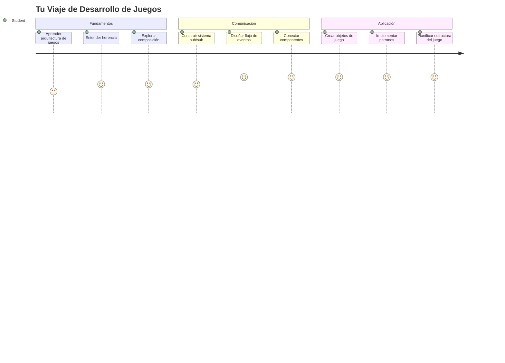
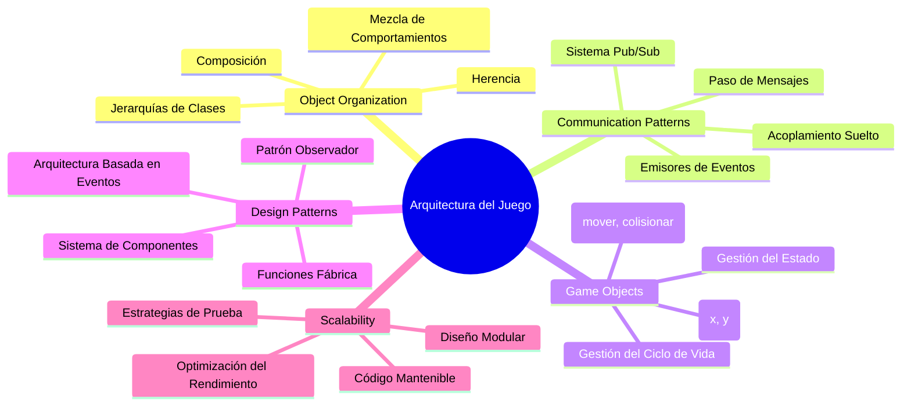
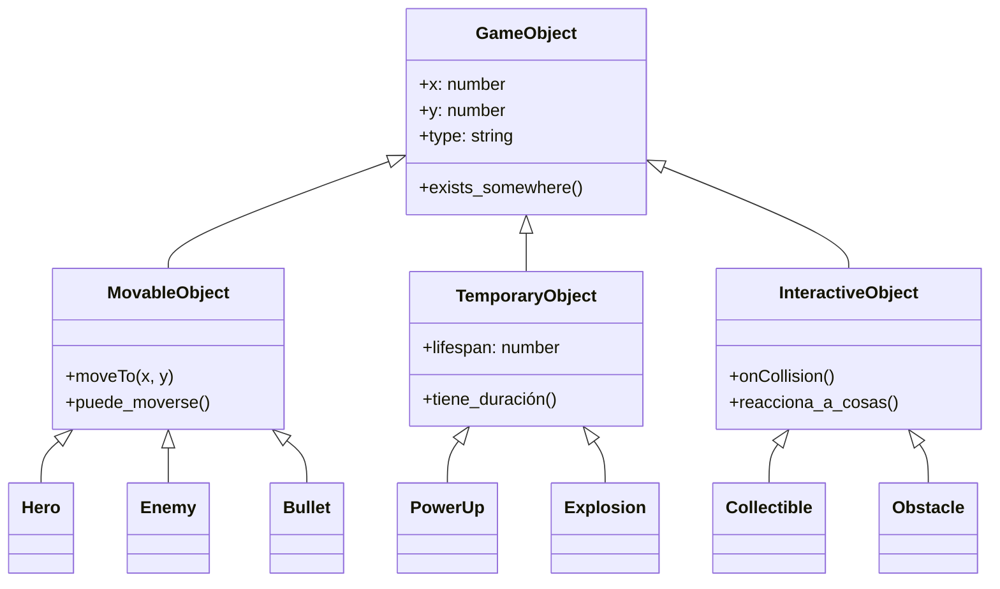
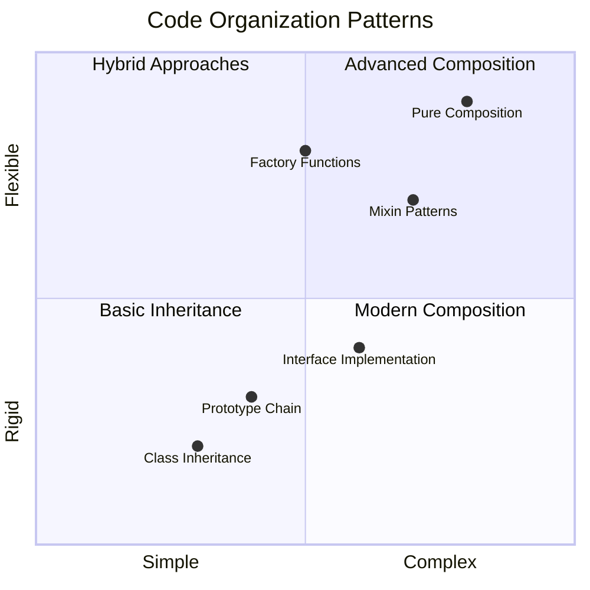
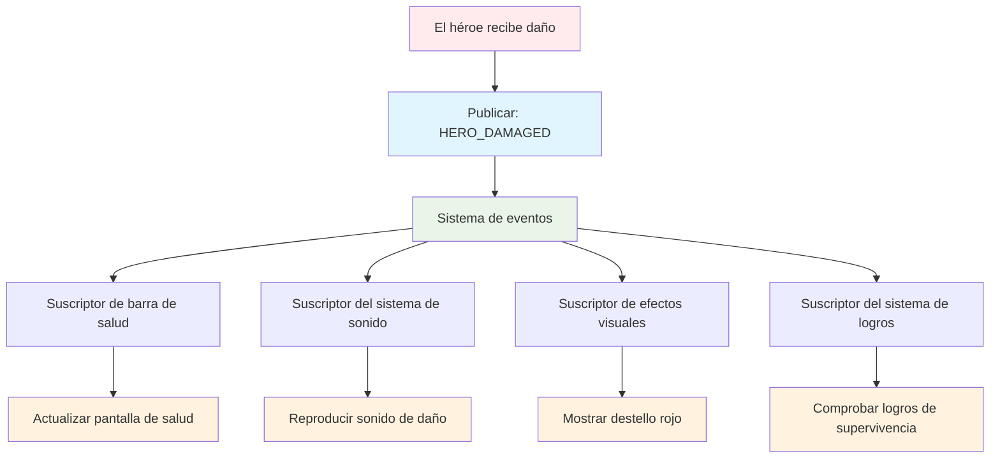
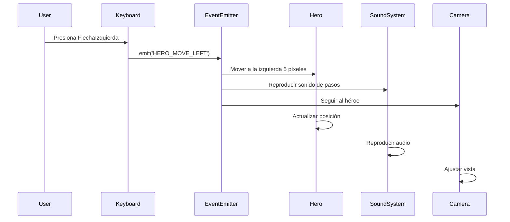
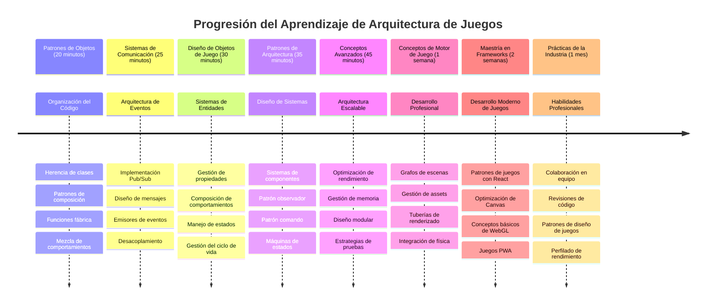

# Construye un Juego Espacial Parte 1: Introducción




Así como el centro de control de la NASA coordina múltiples sistemas durante un lanzamiento espacial, vamos a construir un juego espacial que demuestre cómo diferentes partes de un programa pueden trabajar juntas sin problemas. Mientras creas algo que realmente puedas jugar, aprenderás conceptos esenciales de programación que se aplican a cualquier proyecto de software.

Exploraremos dos enfoques fundamentales para organizar el código: herencia y composición. Estos no son solo conceptos académicos: son los mismos patrones que impulsan todo, desde videojuegos hasta sistemas bancarios. También implementaremos un sistema de comunicación llamado pub/sub que funciona como las redes de comunicación usadas en las naves espaciales, permitiendo que diferentes componentes compartan información sin crear dependencias.

Al final de esta serie, comprenderás cómo construir aplicaciones que pueden escalar y evolucionar, ya sea que desarrolles juegos, aplicaciones web o cualquier otro sistema de software.


## Cuestionario Pre-Clase

[Cuestionario pre-clase](https://ff-quizzes.netlify.app/web/quiz/29)

## Herencia y Composición en el Desarrollo de Juegos

A medida que los proyectos crecen en complejidad, la organización del código se vuelve crítica. Lo que comienza como un script simple puede volverse difícil de mantener sin una estructura adecuada, tal como las misiones Apolo requerían una cuidadosa coordinación entre miles de componentes.

Exploraremos dos enfoques fundamentales para organizar el código: herencia y composición. Cada uno tiene ventajas distintivas, y entenderlos a ambos te ayuda a elegir el enfoque correcto para diferentes situaciones. Demostraremos estos conceptos mediante nuestro juego espacial, donde héroes, enemigos, power-ups y otros objetos deben interactuar eficientemente.

✅ Uno de los libros de programación más famosos jamás escritos trata sobre [patrones de diseño](https://en.wikipedia.org/wiki/Design_Patterns).

En cualquier juego, tienes `objetos de juego` – los elementos interactivos que pueblan tu mundo de juego. Héroes, enemigos, power-ups y efectos visuales son todos objetos de juego. Cada uno existe en coordenadas específicas en pantalla usando valores `x` y `y`, similar a graficar puntos en un plano cartesiano.

A pesar de sus diferencias visuales, estos objetos a menudo comparten comportamientos fundamentales:

- **Existen en algún lugar** – Cada objeto tiene coordenadas x y y para que el juego sepa dónde dibujarlo
- **Muchos pueden moverse** – Héroes corren, enemigos persiguen, balas vuelan por la pantalla
- **Tienen una vida útil** – Algunos permanecen para siempre, otros (como explosiones) aparecen brevemente y desaparecen
- **Reaccionan a cosas** – Cuando chocan, se recogen power-ups, se actualizan barras de salud

✅ Piensa en un juego como Pac-Man. ¿Puedes identificar los cuatro tipos de objetos listados arriba en este juego?


### Expresando Comportamiento a Través del Código

Ahora que entiendes los comportamientos comunes que comparten los objetos de juego, exploremos cómo implementar esos comportamientos en JavaScript. Puedes expresar el comportamiento de un objeto mediante métodos adjuntos ya sea a clases o a objetos individuales, y hay varios enfoques para elegir.

**El Enfoque Basado en Clases**

Las clases y la herencia proveen un enfoque estructurado para organizar objetos de juego. Al igual que el sistema de clasificación taxonómica desarrollado por Carl Linnaeus, comienzas con una clase base que contiene propiedades comunes y luego creas clases especializadas que heredan esos fundamentos mientras agregan capacidades específicas.

✅ La herencia es un concepto importante para entender. Aprende más en el [artículo de MDN sobre herencia](https://developer.mozilla.org/docs/Web/JavaScript/Inheritance_and_the_prototype_chain).

Aquí te mostramos cómo puedes implementar objetos de juego usando clases y herencia:

```javascript
// Paso 1: Crear la clase base GameObject
class GameObject {
  constructor(x, y, type) {
    this.x = x;
    this.y = y;
    this.type = type;
  }
}
```

**Desglosemos esto paso a paso:**
- Estamos creando una plantilla básica que cada objeto de juego puede usar
- El constructor guarda dónde está el objeto (`x`, `y`) y qué tipo de cosa es
- Esto se convierte en la base sobre la que se construirán todos tus objetos de juego

```javascript
// Paso 2: Añadir capacidad de movimiento mediante herencia
class Movable extends GameObject {
  constructor(x, y, type) {
    super(x, y, type); // Llamar al constructor del padre
  }

  // Añadir la capacidad de moverse a una nueva posición
  moveTo(x, y) {
    this.x = x;
    this.y = y;
  }
}
```

**En lo anterior, hemos:**
- **Extendido** la clase GameObject para añadir funcionalidad de movimiento
- **Llamado** al constructor padre usando `super()` para inicializar propiedades heredadas
- **Añadido** un método `moveTo()` que actualiza la posición del objeto

```javascript
// Paso 3: Crear tipos específicos de objetos de juego
class Hero extends Movable {
  constructor(x, y) {
    super(x, y, 'Hero'); // Establecer tipo automáticamente
  }
}

class Tree extends GameObject {
  constructor(x, y) {
    super(x, y, 'Tree'); // Los árboles no necesitan movimiento
  }
}

// Paso 4: Usa tus objetos de juego
const hero = new Hero(0, 0);
hero.moveTo(5, 5); // ¡El héroe puede moverse!

const tree = new Tree(10, 15);
// tree.moveTo() causaría un error - los árboles no pueden moverse
```

**Comprendiendo estos conceptos:**
- **Crea** tipos de objetos especializados que heredan comportamientos apropiados
- **Demuestra** cómo la herencia permite inclusión selectiva de características
- **Muestra** que los héroes pueden moverse mientras los árboles permanecen inmóviles
- **Ilustra** cómo la jerarquía de clases evita acciones inapropiadas

✅ Tómate unos minutos para reimaginar un héroe de Pac-Man (Inky, Pinky o Blinky, por ejemplo) y cómo se escribiría en JavaScript.

**El Enfoque de Composición**

La composición sigue una filosofía de diseño modular, similar a cómo los ingenieros diseñan naves espaciales con componentes intercambiables. En lugar de heredar de una clase padre, combinas comportamientos específicos para crear objetos con exactamente la funcionalidad que necesitan. Este enfoque ofrece flexibilidad sin restricciones jerárquicas rígidas.

```javascript
// Paso 1: Crear objetos de comportamiento base
const gameObject = {
  x: 0,
  y: 0,
  type: ''
};

const movable = {
  moveTo(x, y) {
    this.x = x;
    this.y = y;
  }
};
```

**Esto es lo que hace este código:**
- **Define** un `gameObject` base con propiedades de posición y tipo
- **Crea** un objeto de comportamiento `movable` separado con funcionalidad de movimiento
- **Separa** preocupaciones manteniendo los datos de posición y la lógica de movimiento independientes

```javascript
// Paso 2: Componer objetos combinando comportamientos
const movableObject = { ...gameObject, ...movable };

// Paso 3: Crear funciones fábrica para diferentes tipos de objetos
function createHero(x, y) {
  return {
    ...movableObject,
    x,
    y,
    type: 'Hero'
  };
}

function createStatic(x, y, type) {
  return {
    ...gameObject,
    x,
    y,
    type
  };
}
```

**En lo anterior, hemos:**
- **Combinado** propiedades del objeto base con comportamiento de movimiento usando sintaxis spread
- **Creado** funciones fábrica que retornan objetos personalizados
- **Habilitado** la creación flexible de objetos sin jerarquías rígidas de clase
- **Permitido** que los objetos tengan exactamente los comportamientos que necesitan

```javascript
// Paso 4: Crea y usa tus objetos compuestos
const hero = createHero(10, 10);
hero.moveTo(5, 5); // ¡Funciona perfectamente!

const tree = createStatic(0, 0, 'Tree');
// tree.moveTo() no está definido - no se compuso ningún comportamiento de movimiento
```

**Puntos clave para recordar:**
- **Compone** objetos mezclando comportamientos en lugar de heredarlos
- **Proporciona** más flexibilidad que jerarquías de herencia rígidas
- **Permite** que los objetos tengan exactamente las características que necesitan
- **Usa** la sintaxis moderna spread de JavaScript para una combinación limpia de objetos

```

**Which Pattern Should You Choose?**

**Which Pattern Should You Choose?**



> 💡 **Consejo Profesional**: Ambos patrones tienen su lugar en el desarrollo moderno de JavaScript. Las clases funcionan bien para jerarquías claramente definidas, mientras que la composición brilla cuando necesitas máxima flexibilidad.
> 
**Cuándo usar cada enfoque:**
- **Elige** la herencia cuando tienes relaciones claras de tipo "es un" (un Héroe *es un* objeto Movible)
- **Selecciona** la composición cuando necesitas relaciones "tiene un" (un Héroe *tiene* habilidades de movimiento)
- **Considera** las preferencias de tu equipo y los requisitos del proyecto
- **Recuerda** que puedes mezclar ambos enfoques en la misma aplicación

### 🔄 **Chequeo Pedagógico**
**Comprensión de la Organización de Objetos**: Antes de pasar a los patrones de comunicación, asegúrate de que puedes:
- ✅ Explicar la diferencia entre herencia y composición
- ✅ Identificar cuándo usar clases vs funciones fábrica
- ✅ Entender cómo funciona la palabra clave `super()` en herencia
- ✅ Reconocer los beneficios de cada enfoque para el desarrollo de juegos

**Autoevaluación Rápida**: ¿Cómo crearías un Enemigo Volador que pueda moverse y volar?
- **Enfoque de herencia**: `class FlyingEnemy extends Movable`
- **Enfoque de composición**: `{ ...movable, ...flyable, ...gameObject }`

**Conexión con el Mundo Real**: Estos patrones aparecen en todas partes:
- **Componentes de React**: Props (composición) vs herencia de clases
- **Motores de Juego**: Sistemas entidad-componente usan composición
- **Apps Móviles**: Frameworks UI a menudo usan jerarquías de herencia

## Patrones de Comunicación: El Sistema Pub/Sub

A medida que las aplicaciones se vuelven complejas, manejar la comunicación entre componentes se vuelve desafiante. El patrón publicar-suscribir (pub/sub) resuelve este problema usando principios similares a la radiodifusión — un transmisor puede llegar a múltiples receptores sin saber quién está escuchando.

Considera lo que pasa cuando un héroe recibe daño: la barra de salud se actualiza, se reproducen efectos de sonido, aparece retroalimentación visual. En lugar de vincular el objeto héroe directamente a estos sistemas, pub/sub permite que el héroe transmita un mensaje de "daño recibido". Cualquier sistema que necesite responder puede suscribirse a este tipo de mensaje y reaccionar en consecuencia.

✅ **Pub/Sub** significa 'publicar-suscribir'


### Entendiendo la Arquitectura Pub/Sub

El patrón pub/sub mantiene diferentes partes de tu aplicación poco acopladas, lo que significa que pueden trabajar juntas sin depender directamente unas de otras. Esta separación hace que tu código sea más mantenible, testeable y flexible a cambios.

**Los jugadores clave en pub/sub:**
- **Mensajes** – Etiquetas de texto simples como `'PLAYER_SCORED'` que describen lo que sucedió (más cualquier información extra)
- **Publicadores** – Los objetos que gritan "¡Algo sucedió!" a cualquiera que esté escuchando
- **Suscriptores** – Los objetos que dicen "Me importa ese evento" y reaccionan cuando ocurre
- **Sistema de Eventos** – El intermediario que asegura que los mensajes lleguen a los oyentes correctos

### Construyendo un Sistema de Eventos

Creemos un sistema de eventos simple pero poderoso que demuestre estos conceptos:

```javascript
// Paso 1: Crear la clase EventEmitter
class EventEmitter {
  constructor() {
    this.listeners = {}; // Almacenar todos los oyentes de eventos
  }
  
  // Registrar un oyente para un tipo de mensaje específico
  on(message, listener) {
    if (!this.listeners[message]) {
      this.listeners[message] = [];
    }
    this.listeners[message].push(listener);
  }
  
  // Enviar un mensaje a todos los oyentes registrados
  emit(message, payload = null) {
    if (this.listeners[message]) {
      this.listeners[message].forEach(listener => {
        listener(message, payload);
      });
    }
  }
}
```

**Desglose de lo que ocurre aquí:**
- **Crea** un sistema central de gestión de eventos usando una clase simple
- **Almacena** oyentes en un objeto organizado por tipo de mensaje
- **Registra** nuevos oyentes usando el método `on()`
- **Difunde** mensajes a todos los oyentes interesados usando `emit()`
- **Soporta** cargas de datos opcionales para pasar información relevante

### Poniendo Todo Junto: Un Ejemplo Práctico

¡Muy bien, veamos esto en acción! Construiremos un sistema de movimiento simple que muestre lo limpio y flexible que puede ser pub/sub:

```javascript
// Paso 1: Define tus tipos de mensajes
const Messages = {
  HERO_MOVE_LEFT: 'HERO_MOVE_LEFT',
  HERO_MOVE_RIGHT: 'HERO_MOVE_RIGHT',
  ENEMY_SPOTTED: 'ENEMY_SPOTTED'
};

// Paso 2: Crea tu sistema de eventos y objetos del juego
const eventEmitter = new EventEmitter();
const hero = createHero(0, 0);
```

**Esto es lo que hace este código:**
- **Define** un objeto de constantes para evitar errores tipográficos en nombres de mensajes
- **Crea** una instancia de emitidor de eventos para manejar toda la comunicación
- **Inicializa** un objeto héroe en la posición inicial

```javascript
// Paso 3: Configurar los oyentes de eventos (suscriptores)
eventEmitter.on(Messages.HERO_MOVE_LEFT, () => {
  hero.moveTo(hero.x - 5, hero.y);
  console.log(`Hero moved to position: ${hero.x}, ${hero.y}`);
});

eventEmitter.on(Messages.HERO_MOVE_RIGHT, () => {
  hero.moveTo(hero.x + 5, hero.y);
  console.log(`Hero moved to position: ${hero.x}, ${hero.y}`);
});
```

**En lo anterior, hemos:**
- **Registrado** oyentes de eventos que responden a mensajes de movimiento
- **Actualizado** la posición del héroe basado en la dirección del movimiento
- **Añadido** registros en consola para rastrear los cambios de posición del héroe
- **Separado** la lógica de movimiento del manejo de entrada

```javascript
// Paso 4: Conectar la entrada del teclado a los eventos (publicadores)
window.addEventListener('keydown', (event) => {
  switch(event.key) {
    case 'ArrowLeft':
      eventEmitter.emit(Messages.HERO_MOVE_LEFT);
      break;
    case 'ArrowRight':
      eventEmitter.emit(Messages.HERO_MOVE_RIGHT);
      break;
  }
});
```

**Comprendiendo estos conceptos:**
- **Conecta** la entrada del teclado a eventos del juego sin acoplamiento fuerte
- **Permite** que el sistema de entrada se comunique indirectamente con los objetos del juego
- **Facilita** que múltiples sistemas respondan a los mismos eventos del teclado
- **Hace** fácil cambiar atajos de teclado o añadir nuevos métodos de entrada


> 💡 **Consejo Profesional**: ¡La belleza de este patrón es la flexibilidad! Puedes fácilmente añadir efectos de sonido, sacudidas de pantalla o efectos de partículas simplemente agregando más oyentes de eventos, sin necesidad de modificar el código existente del teclado o movimiento.
> 
**Por qué te encantará este enfoque:**
- Añadir nuevas funcionalidades se vuelve muy fácil – solo escucha los eventos que te interesan
- Varias cosas pueden reaccionar al mismo evento sin interferir entre sí
- Las pruebas se simplifican ya que cada pieza trabaja independientemente
- Cuando algo falla, sabes exactamente dónde buscar

### Por qué Pub/Sub Escala de Manera Efectiva

El patrón pub/sub mantiene la simplicidad incluso cuando las aplicaciones crecen en complejidad. Ya sea gestionando docenas de enemigos, actualizaciones dinámicas de UI o sistemas de sonido, el patrón maneja el aumento de escala sin cambios arquitectónicos. Nuevas funciones se integran en el sistema de eventos existente sin afectar la funcionalidad establecida.

> ⚠️ **Error Común**: No crees demasiados tipos de mensajes específicos al principio. Comienza con categorías amplias y refínalas conforme las necesidades de tu juego se esclarecen.
> 
**Buenas prácticas a seguir:**
- **Agrupa** mensajes relacionados en categorías lógicas
- **Usa** nombres descriptivos que indiquen claramente qué ocurrió
- **Mantén** las cargas de mensajes simples y focalizadas
- **Documenta** tus tipos de mensajes para colaborar en equipo

### 🔄 **Chequeo Pedagógico**
**Comprensión de Arquitectura Basada en Eventos**: Verifica tu entendimiento del sistema completo:
- ✅ ¿Cómo previene el patrón pub/sub el acoplamiento fuerte entre componentes?
- ✅ ¿Por qué es más fácil añadir nuevas características con arquitectura basada en eventos?
- ✅ ¿Qué rol juega el EventEmitter en el flujo de comunicación?
- ✅ ¿Cómo previenen los constantes de mensajes errores y mejoran la mantenibilidad?

**Desafío de Diseño**: ¿Cómo manejarías estos escenarios de juego con pub/sub?
1. **Enemigo muere**: Actualizar puntuación, reproducir sonido, generar power-up, eliminar de la pantalla
2. **Nivel completado**: Detener música, mostrar interfaz, guardar progreso, cargar próximo nivel
3. **Power-up recogido**: Mejorar habilidades, actualizar UI, reproducir efecto, iniciar temporizador

**Conexión Profesional**: Este patrón aparece en:
- **Frameworks Frontend**: sistemas de eventos en React/Vue
- **Servicios Backend**: comunicación en microservicios
- **Motores de Juegos**: sistema de eventos de Unity
- **Desarrollo Móvil**: sistemas de notificación en iOS/Android

---

## Desafío GitHub Copilot Agent 🚀

Usa el modo Agente para completar el siguiente desafío:

**Descripción:** Crea un sistema simple de objetos de juego usando tanto herencia como el patrón pub/sub. Implementarás un juego básico donde diferentes objetos puedan comunicarse mediante eventos sin conocerse directamente.

**Solicitud:** Crea un sistema de juego en JavaScript con los siguientes requisitos: 1) Crear una clase base GameObject con coordenadas x, y y una propiedad tipo. 2) Crear una clase Hero que extienda GameObject y pueda moverse. 3) Crear una clase Enemy que extienda GameObject y pueda perseguir al héroe. 4) Implementar una clase EventEmitter para el patrón pub/sub. 5) Configurar oyentes de eventos para que cuando el héroe se mueva, los enemigos cercanos reciban un evento 'HERO_MOVED' y actualicen su posición para acercarse al héroe. Incluye declaraciones console.log para mostrar la comunicación entre objetos.

Aprende más sobre [modo agente](https://code.visualstudio.com/blogs/2025/02/24/introducing-copilot-agent-mode) aquí.

## 🚀 Desafío
Considera cómo el patrón pub-sub puede mejorar la arquitectura del juego. Identifica qué componentes deberían emitir eventos y cómo debería responder el sistema. Diseña un concepto de juego y mapea los patrones de comunicación entre sus componentes.

## Quiz Post-Clase

[Quiz post-clase](https://ff-quizzes.netlify.app/web/quiz/30)

## Repaso y Autoestudio

Aprende más sobre Pub/Sub [leyendo sobre ello](https://docs.microsoft.com/azure/architecture/patterns/publisher-subscriber/?WT.mc_id=academic-77807-sagibbon).

### ⚡ **Lo que Puedes Hacer en los Próximos 5 Minutos**
- [ ] Abre cualquier juego HTML5 en línea e inspecciona su código usando DevTools
- [ ] Crea un elemento Canvas HTML5 simple y dibuja una forma básica
- [ ] Prueba usar `setInterval` para crear un bucle de animación simple
- [ ] Explora la documentación del API de Canvas y prueba un método de dibujo

### 🎯 **Lo que Puedes Lograr en Esta Hora**
- [ ] Completa el quiz post-lección y comprende conceptos de desarrollo de juegos
- [ ] Configura la estructura de tu proyecto de juego con archivos HTML, CSS y JavaScript
- [ ] Crea un bucle de juego básico que actualice y renderice continuamente
- [ ] Dibuja tus primeros sprites de juego en el canvas
- [ ] Implementa carga básica de assets para imágenes y sonidos

### 📅 **Tu Creación de Juego en Una Semana**
- [ ] Completa el juego espacial completo con todas las funciones planificadas
- [ ] Añade gráficos pulidos, efectos de sonido y animaciones suaves
- [ ] Implementa estados de juego (pantalla de inicio, jugabilidad, fin de juego)
- [ ] Crea un sistema de puntuación y seguimiento del progreso del jugador
- [ ] Haz que tu juego sea responsive y accesible en diferentes dispositivos
- [ ] Comparte tu juego en línea y recopila retroalimentación de los jugadores

### 🌟 **Tu Desarrollo de Juego en Un Mes**
- [ ] Crea múltiples juegos explorando diferentes géneros y mecánicas
- [ ] Aprende un framework de desarrollo de juegos como Phaser o Three.js
- [ ] Contribuye a proyectos de desarrollo de juegos de código abierto
- [ ] Domina patrones avanzados de programación de juegos y optimización
- [ ] Crea un portafolio que muestre tus habilidades en desarrollo de juegos
- [ ] Mentorea a otros interesados en desarrollo de juegos y medios interactivos

## 🎯 Tu Cronograma de Maestría en Desarrollo de Juegos


### 🛠️ Resumen de Tu Kit de Herramientas de Arquitectura de Juegos

Después de completar esta lección, ahora cuentas con:
- **Dominio de Patrones de Diseño**: Comprensión de compromisos entre herencia y composición
- **Arquitectura Orientada a Eventos**: Implementación pub/sub para comunicación escalable
- **Diseño Orientado a Objetos**: Jerarquías de clases y composición de comportamientos
- **JavaScript Moderno**: Funciones fábrica, spread syntax y patrones ES6+
- **Arquitectura Escalable**: Principios de desacoplamiento y diseño modular
- **Fundamentos de Desarrollo de Juegos**: Sistemas de entidades y patrones de componentes
- **Patrones Profesionales**: Enfoques estándar de la industria para organización de código

**Aplicaciones en el Mundo Real**: Estos patrones se aplican directamente a:
- **Frameworks Frontend**: Arquitectura de componentes y gestión de estado en React/Vue
- **Servicios Backend**: Comunicación entre microservicios y sistemas orientados a eventos
- **Desarrollo Móvil**: Arquitectura de apps iOS/Android y sistemas de notificaciones
- **Motores de Juego**: Desarrollo de juegos con Unity, Unreal y basados en web
- **Software Empresarial**: Event sourcing y diseño de sistemas distribuidos
- **Diseño de APIs**: Servicios RESTful y comunicación en tiempo real

**Habilidades Profesionales Adquiridas**: Ahora puedes:
- **Diseñar** arquitecturas de software escalables usando patrones comprobados
- **Implementar** sistemas orientados a eventos que manejan interacciones complejas
- **Elegir** estrategias adecuadas de organización de código para distintos escenarios
- **Depurar** y mantener sistemas desacoplados eficazmente
- **Comunicar** decisiones técnicas usando terminología estándar de la industria

**Siguiente Nivel**: Estás listo para implementar estos patrones en un juego real, explorar temas avanzados de desarrollo de juegos, o aplicar estos conceptos arquitectónicos a aplicaciones web!

🌟 **Logro Desbloqueado**: ¡Has dominado patrones fundamentales de arquitectura de software que impulsan desde juegos simples hasta complejos sistemas empresariales!

## Asignación

[Mock up a game](assignment.md)

---

<!-- CO-OP TRANSLATOR DISCLAIMER START -->
**Aviso legal**:
Este documento ha sido traducido utilizando el servicio de traducción automática [Co-op Translator](https://github.com/Azure/co-op-translator). Aunque nos esforzamos por la precisión, tenga en cuenta que las traducciones automáticas pueden contener errores o inexactitudes. El documento original en su idioma nativo debe considerarse la fuente autorizada. Para información crítica, se recomienda la traducción profesional realizada por humanos. No nos hacemos responsables de ningún malentendido o interpretación errónea derivada del uso de esta traducción.
<!-- CO-OP TRANSLATOR DISCLAIMER END -->