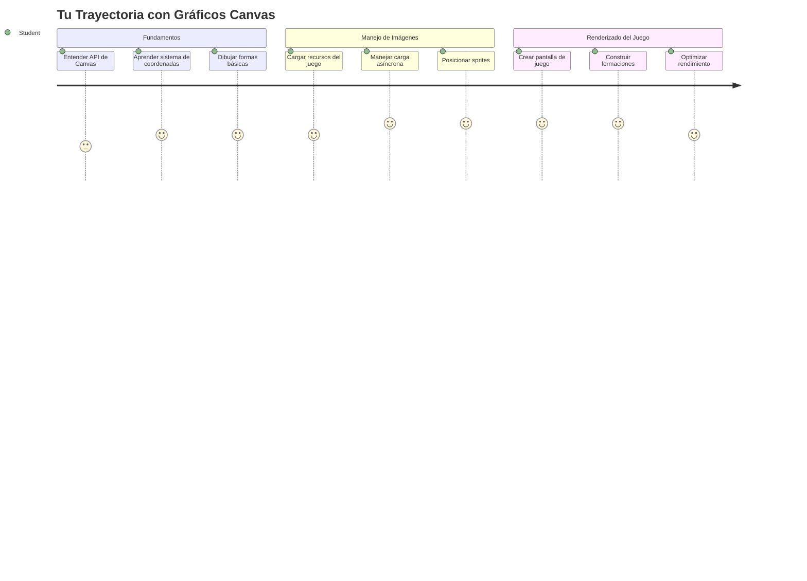
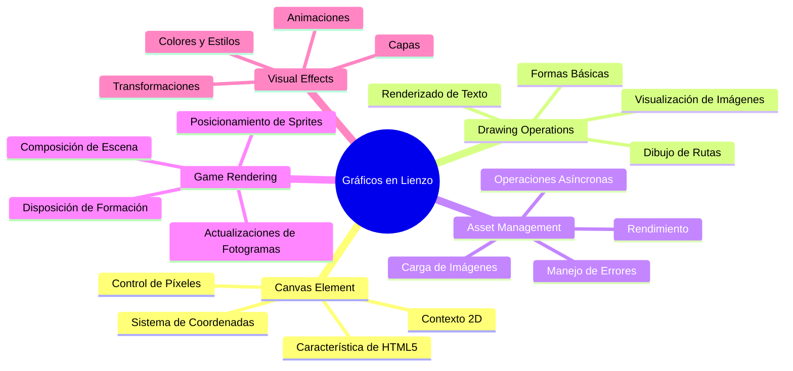
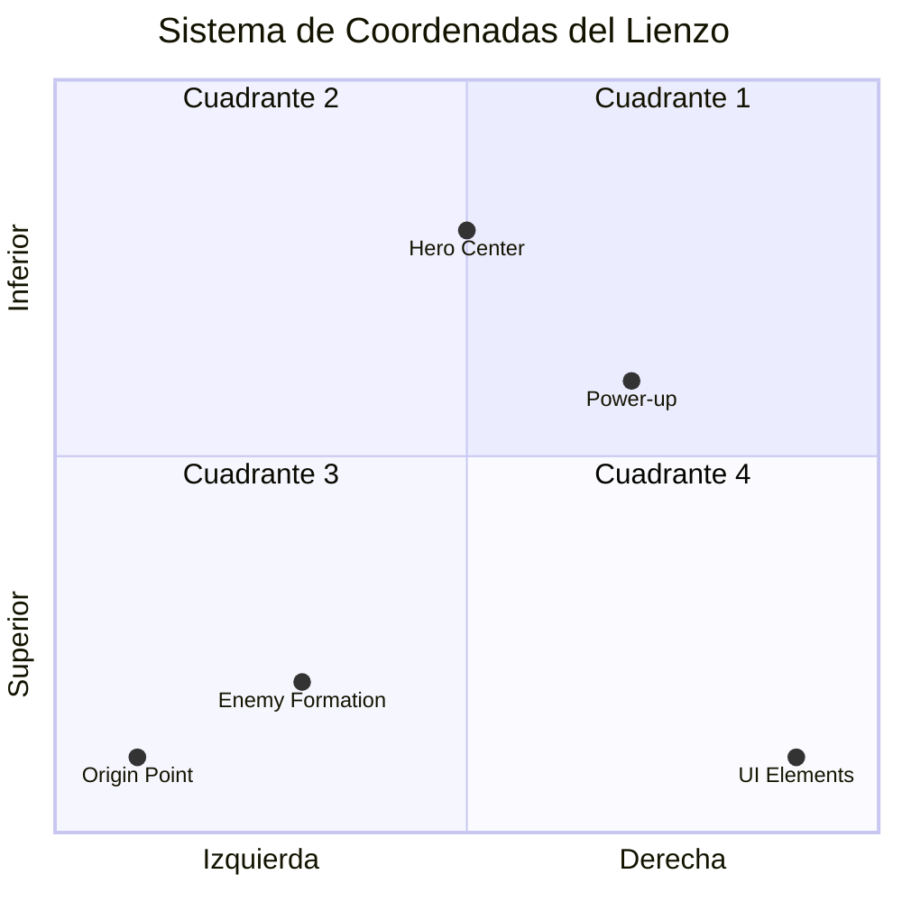
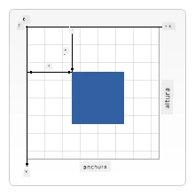
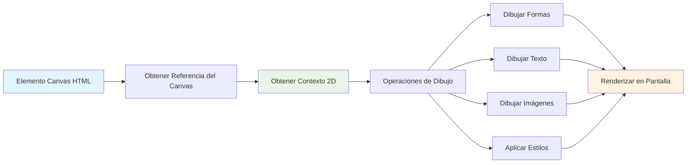
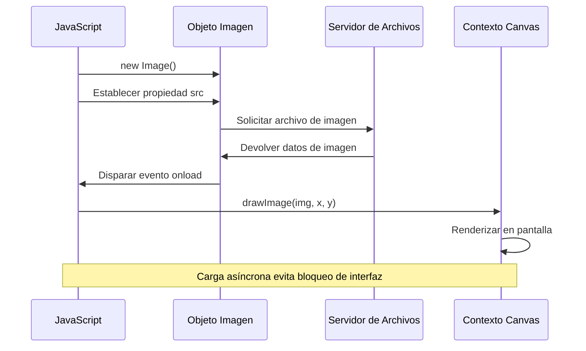
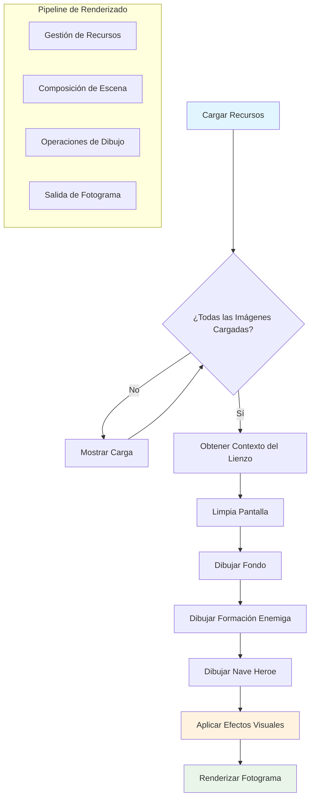
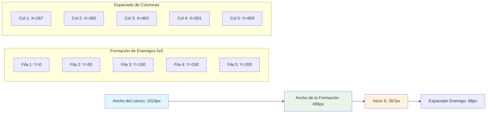
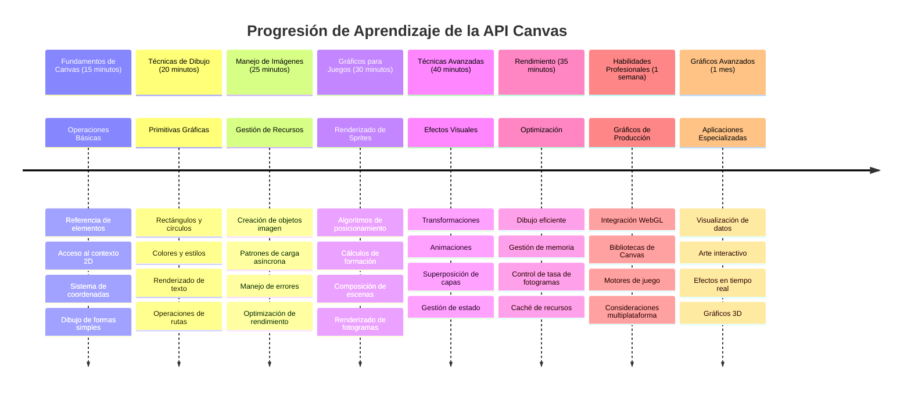

# Construye un Juego Espacial Parte 2: Dibuja Héroe y Monstruos en el Canvas


La API Canvas es una de las características más poderosas del desarrollo web para crear gráficos dinámicos e interactivos directamente en tu navegador. En esta lección, transformaremos ese elemento HTML `<canvas>` en blanco en un mundo de juego lleno de héroes y monstruos. Piensa en el canvas como tu tablero digital de arte donde el código se convierte en visual.

Estamos construyendo sobre lo que aprendiste en la lección anterior, y ahora profundizaremos en los aspectos visuales. Aprenderás cómo cargar y mostrar sprites de juego, posicionar elementos con precisión y crear la base visual para tu juego espacial. Esto conecta la brecha entre páginas web estáticas y experiencias dinámicas e interactivas.

Al final de esta lección, tendrás una escena de juego completa con tu nave heroica posicionada correctamente y formaciones enemigas listas para la batalla. Entenderás cómo los juegos modernos renderizan gráficos en navegadores y adquirirás habilidades para crear tus propias experiencias visuales interactivas. ¡Vamos a explorar los gráficos del canvas y darle vida a tu juego espacial!


## Cuestionario Previo a la Clase

[Cuestionario previo a la clase](https://ff-quizzes.netlify.app/web/quiz/31)

## El Canvas

¿Entonces qué es exactamente este elemento `<canvas>`? Es la solución de HTML5 para crear gráficos dinámicos y animaciones en navegadores web. A diferencia de imágenes o videos regulares que son estáticos, el canvas te da control a nivel de píxel sobre todo lo que aparece en pantalla. Esto lo hace perfecto para juegos, visualizaciones de datos y arte interactivo. Piensa en él como una superficie de dibujo programable donde JavaScript es tu pincel.

Por defecto, un elemento canvas se ve como un rectángulo transparente y en blanco en tu página. ¡Pero ahí reside su potencial! Su verdadero poder emerge cuando usas JavaScript para dibujar formas, cargar imágenes, crear animaciones y hacer que las cosas respondan a interacciones del usuario. Es similar a cómo los pioneros de gráficos de computadora en Bell Labs en los años 60 tenían que programar cada píxel para crear las primeras animaciones digitales.

✅ Lee [más sobre la API Canvas](https://developer.mozilla.org/docs/Web/API/Canvas_API) en MDN.

Así es como normalmente se declara, como parte del cuerpo de la página:

```html
<canvas id="myCanvas" width="200" height="100"></canvas>
```

**Esto es lo que hace este código:**
- **Establece** el atributo `id` para que puedas referenciar específicamente este elemento canvas en JavaScript
- **Define** el `width` en píxeles para controlar el tamaño horizontal del canvas
- **Establece** el `height` en píxeles para determinar las dimensiones verticales del canvas

## Dibujando Geometría Simple

Ahora que sabes qué es el elemento canvas, ¡exploremos cómo dibujar en él! El canvas usa un sistema de coordenadas que podría ser familiar de la clase de matemáticas, pero hay un giro importante específico de gráficos por computadora.

El canvas usa coordenadas cartesianas con un eje x (horizontal) y un eje y (vertical) para posicionar todo lo que dibujas. Pero aquí está la diferencia clave: a diferencia del sistema de coordenadas de matemáticas, el punto de origen `(0,0)` empieza en la esquina superior izquierda, con valores x aumentando al moverse a la derecha y valores y aumentando al moverse hacia abajo. Este enfoque remonta a los primeros monitores de computadora donde los haces de electrones barrían de arriba hacia abajo, haciendo de la esquina superior izquierda el punto natural de inicio.



> Imagen de [MDN](https://developer.mozilla.org/docs/Web/API/Canvas_API/Tutorial/Drawing_shapes)

Para dibujar en el elemento canvas, seguirás el mismo proceso de tres pasos que forma la base de todos los gráficos en canvas. Una vez que lo hagas unas cuantas veces, se vuelve algo natural:


1. **Obtener una referencia** a tu elemento Canvas desde el DOM (igual que cualquier otro elemento HTML)
2. **Obtener el contexto de renderizado 2D** – esto provee todos los métodos para dibujar
3. **¡Comenzar a dibujar!** Usa los métodos incorporados del contexto para crear tus gráficos

Así queda en código:

```javascript
// Paso 1: Obtener el elemento canvas
const canvas = document.getElementById("myCanvas");

// Paso 2: Obtener el contexto de renderizado 2D
const ctx = canvas.getContext("2d");

// Paso 3: Establecer el color de relleno y dibujar un rectángulo
ctx.fillStyle = 'red';
ctx.fillRect(0, 0, 200, 200); // x, y, ancho, alto
```

**Desglosemos paso a paso:**
- **Capturamos** nuestro elemento canvas usando su ID y lo almacenamos en una variable
- **Obtenemos** el contexto de renderizado 2D – este es nuestro kit de herramientas con métodos para dibujar
- **Indicamos** al canvas que queremos llenar con rojo usando la propiedad `fillStyle`
- **Dibujamos** un rectángulo comenzando en la esquina superior izquierda (0,0) que es de 200 píxeles de ancho y alto

✅ La API Canvas se centra mayormente en formas 2D, pero también puedes dibujar elementos 3D en un sitio web; para esto, podrías usar la [API WebGL](https://developer.mozilla.org/docs/Web/API/WebGL_API).

Con la API Canvas puedes dibujar todo tipo de cosas como:

- **Formas geométricas**, ya mostramos cómo dibujar un rectángulo, pero hay mucho más que puedes dibujar.
- **Texto**, puedes dibujar texto con cualquier fuente y color que desees.
- **Imágenes**, puedes dibujar una imagen basada en un recurso como un archivo .jpg o .png, por ejemplo.

✅ ¡Pruébalo! Ya sabes dibujar un rectángulo, ¿puedes dibujar un círculo en una página? Mira algunos dibujos interesantes en Canvas en CodePen. Aquí hay un [ejemplo particularmente impresionante](https://codepen.io/dissimulate/pen/KrAwx).

### 🔄 **Chequeo Pedagógico**
**Comprensión de los Fundamentos del Canvas**: Antes de pasar a la carga de imágenes, asegúrate de que puedes:
- ✅ Explicar cómo el sistema de coordenadas del canvas difiere de las coordenadas matemáticas
- ✅ Entender el proceso de tres pasos para las operaciones de dibujo en canvas
- ✅ Identificar qué provee el contexto de renderizado 2D
- ✅ Describir cómo funcionan juntos fillStyle y fillRect

**Autoevaluación rápida**: ¿Cómo dibujarías un círculo azul en la posición (100, 50) con radio 25?
```javascript
ctx.fillStyle = 'blue';
ctx.beginPath();
ctx.arc(100, 50, 25, 0, 2 * Math.PI);
ctx.fill();
```

**Métodos de dibujo en Canvas que ahora conoces**:
- **fillRect()**: Dibuja rectángulos rellenos
- **fillStyle**: Establece colores y patrones
- **beginPath()**: Comienza nuevos caminos de dibujo
- **arc()**: Crea círculos y curvas

## Cargar y Dibujar un Recurso de Imagen

Dibujar formas básicas es útil para comenzar, ¡pero la mayoría de los juegos necesitan imágenes reales! Los sprites, fondos, y texturas son lo que le dan a los juegos su atractivo visual. Cargar y mostrar imágenes en el canvas funciona diferente a dibujar formas geométricas, pero es sencillo una vez que entiendes el proceso.

Necesitamos crear un objeto `Image`, cargar nuestro archivo de imagen (esto ocurre de forma asíncrona, es decir, "en segundo plano"), y luego dibujarlo en el canvas una vez que esté listo. Este enfoque asegura que tus imágenes se muestren correctamente sin bloquear tu aplicación mientras cargan.


### Carga Básica de Imágenes

```javascript
const img = new Image();
img.src = 'path/to/my/image.png';
img.onload = () => {
  // Imagen cargada y lista para ser usada
  console.log('Image loaded successfully!');
};
```

**Esto es lo que pasa en este código:**
- **Creamos** un nuevo objeto Image para contener nuestro sprite o textura
- **Le indicamos** qué archivo de imagen cargar estableciendo la ruta de origen
- **Esperamos** el evento de carga para saber exactamente cuándo la imagen está lista para usar

### Una Forma Mejor de Cargar Imágenes

Aquí tienes una manera más robusta de manejar la carga de imágenes que los desarrolladores profesionales usan comúnmente. Envolveremos la carga de la imagen en una función basada en Promesas – este enfoque, popularizado cuando las Promesas en JavaScript se volvieron estándar en ES6, hace que tu código esté más organizado y maneja errores de forma elegante:

```javascript
function loadAsset(path) {
  return new Promise((resolve, reject) => {
    const img = new Image();
    img.src = path;
    img.onload = () => {
      resolve(img);
    };
    img.onerror = () => {
      reject(new Error(`Failed to load image: ${path}`));
    };
  });
}

// Uso moderno con async/await
async function initializeGame() {
  try {
    const heroImg = await loadAsset('hero.png');
    const monsterImg = await loadAsset('monster.png');
    // Las imágenes están ahora listas para usar
  } catch (error) {
    console.error('Failed to load game assets:', error);
  }
}
```

**Lo que hicimos aquí:**
- **Envolvimos** toda esa lógica de carga en una Promesa para poder manejarla mejor
- **Agregamos** manejo de errores que realmente nos dice si algo sale mal
- **Usamos** la sintaxis moderna async/await porque es mucho más limpia de leer
- **Incluimos** bloques try/catch para manejar con gracia cualquier inconveniente al cargar

Una vez que tus imágenes están cargadas, dibujarlas en el canvas es realmente sencillo:

```javascript
async function renderGameScreen() {
  try {
    // Cargar recursos del juego
    const heroImg = await loadAsset('hero.png');
    const monsterImg = await loadAsset('monster.png');

    // Obtener el lienzo y el contexto
    const canvas = document.getElementById("myCanvas");
    const ctx = canvas.getContext("2d");

    // Dibujar imágenes en posiciones específicas
    ctx.drawImage(heroImg, canvas.width / 2, canvas.height / 2);
    ctx.drawImage(monsterImg, 0, 0);
  } catch (error) {
    console.error('Failed to render game screen:', error);
  }
}
```

**Recorramos esto paso a paso:**
- **Cargamos** tanto las imágenes de héroe como de monstruo en segundo plano usando await
- **Capturamos** nuestro elemento canvas y obtenemos el contexto 2D que necesitamos
- **Posicionamos** la imagen del héroe justo en el centro usando un poco de matemáticas de coordenadas
- **Colocamos** la imagen del monstruo en la esquina superior izquierda para empezar nuestra formación enemiga
- **Capturamos** cualquier error que pueda ocurrir durante la carga o el renderizado


## Ahora es el Momento de Empezar a Construir Tu Juego

Ahora juntaremos todo para crear la base visual de tu juego espacial. Tienes una buena comprensión de los fundamentos del canvas y técnicas de carga de imágenes, así que esta sección práctica te guiará para construir una pantalla de juego completa con sprites posicionados adecuadamente.

### Qué Construir

Construirás una página web con un elemento Canvas. Debe mostrar una pantalla negra de `1024*768`. Te hemos proporcionado dos imágenes:

- Nave héroe

   

- Monstruo 5x5

   

### Pasos recomendados para comenzar desarrollo

Ubica los archivos iniciales que se han creado para ti en la subcarpeta `your-work`. La estructura de tu proyecto debería contener:

```bash
your-work/
├── assets/
│   ├── enemyShip.png
│   └── player.png
├── index.html
├── app.js
└── package.json
```

**Esto es con lo que trabajarás:**
- **Los sprites del juego** están en la carpeta `assets/` para que todo esté organizado
- **Tu archivo HTML principal** configura el elemento canvas y prepara todo
- **Un archivo JavaScript** donde escribirás toda la magia de renderizado del juego
- **Un package.json** que configura un servidor de desarrollo para que puedas probar localmente

Abre esta carpeta en Visual Studio Code para comenzar el desarrollo. Necesitarás un entorno de desarrollo local con Visual Studio Code, NPM y Node.js instalados. Si no tienes `npm` configurado en tu computadora, [aquí tienes cómo instalarlo](https://www.npmjs.com/get-npm).

Inicia tu servidor de desarrollo navegando a la carpeta `your-work`:

```bash
cd your-work
npm start
```

**Este comando hace cosas bastante útiles:**
- **Inicia** un servidor local en `http://localhost:5000` para que puedas probar tu juego
- **Sirve** todos tus archivos correctamente para que el navegador pueda cargarlos bien
- **Vigila** tus archivos para cambios para que puedas desarrollar sin problemas
- **Te da** un entorno profesional de desarrollo para probar todo

> 💡 **Nota**: Tu navegador mostrará una página en blanco inicialmente – ¡esto es esperado! A medida que agregues código, refresca tu navegador para ver tus cambios. Este enfoque de desarrollo iterativo es similar a cómo la NASA construyó la computadora de guía Apollo – probando cada componente antes de integrarlo al sistema más grande.

### Añadir código

Agrega el código requerido en `your-work/app.js` para completar las siguientes tareas:

1. **Dibujar un canvas con fondo negro**
   > 💡 **Así se hace**: Encuentra el TODO en `/app.js` y añade solo dos líneas. Establece `ctx.fillStyle` a negro, luego usa `ctx.fillRect()` comenzando en (0,0) con las dimensiones de tu canvas. ¡Fácil!

2. **Cargar texturas del juego**
   > 💡 **Así se hace**: Usa `await loadAsset()` para cargar tus imágenes de jugador y enemigo. Almacénalas en variables para usarlas después. Recuerda – no aparecerán hasta que realmente las dibujes.

3. **Dibujar la nave héroe en el centro inferior**
   > 💡 **Así se hace**: Usa `ctx.drawImage()` para posicionar tu héroe. Para la coordenada x, prueba `canvas.width / 2 - 45` para centrarla, y para la coordenada y usa `canvas.height - canvas.height / 4` para ponerla en la parte inferior.

4. **Dibujar una formación 5×5 de naves enemigas**
   > 💡 **Así se hace**: Encuentra la función `createEnemies` y configura un bucle anidado. Necesitarás hacer algunos cálculos para el espacio y la posición, pero no te preocupes – ¡te mostraré exactamente cómo!

Primero, establece constantes para el formato adecuado de la formación enemiga:

```javascript
const ENEMY_TOTAL = 5;
const ENEMY_SPACING = 98;
const FORMATION_WIDTH = ENEMY_TOTAL * ENEMY_SPACING;
const START_X = (canvas.width - FORMATION_WIDTH) / 2;
const STOP_X = START_X + FORMATION_WIDTH;
```

**Esto es lo que hacen estas constantes:**
- **Establecemos** 5 enemigos por fila y columna (una bonita cuadrícula 5×5)
- **Definimos** cuánto espacio poner entre enemigos para que no se vean amontonados
- **Calculamos** qué tan ancha será toda nuestra formación
- **Determinar** dónde empezar y terminar para que la formación se vea centrada


Luego, crea bucles anidados para dibujar la formación enemiga:

```javascript
for (let x = START_X; x < STOP_X; x += ENEMY_SPACING) {
  for (let y = 0; y < 50 * 5; y += 50) {
    ctx.drawImage(enemyImg, x, y);
  }
}
```

**Esto es lo que hace este bucle anidado:**
- El bucle externo **se mueve** de izquierda a derecha a través de nuestra formación
- El bucle interno **va** de arriba a abajo para crear filas ordenadas
- **Dibujamos** cada sprite enemigo en las coordenadas x,y exactas que calculamos
- Todo se mantiene **uniformemente espaciado** para que se vea profesional y organizado

### 🔄 **Chequeo Pedagógico**
**Dominio del Renderizado de Juegos**: Verifica tu comprensión del sistema completo de renderizado:
- ✅ ¿Cómo previene la carga asíncrona de imágenes que la interfaz se bloquee durante el inicio del juego?
- ✅ ¿Por qué calculamos las posiciones de formación enemiga usando constantes en lugar de codificar directamente?
- ✅ ¿Qué rol juega el contexto de renderizado 2D en las operaciones de dibujo?
- ✅ ¿Cómo crean los bucles anidados formaciones de sprites organizadas?

**Consideraciones de Rendimiento**: Tu juego ahora demuestra:
- **Carga eficiente de recursos**: gestión de imágenes basada en Promesas
- **Renderizado organizado**: operaciones de dibujo estructuradas
- **Posicionamiento matemático**: ubicación calculada de sprites
- **Manejo de errores**: gestión elegante de fallos

**Conceptos de Programación Visual**: Has aprendido:
- **Sistemas de coordenadas**: Traduciendo matemáticas a posiciones en pantalla
- **Gestión de sprites**: Carga y visualización de gráficos del juego
- **Algoritmos de formación**: Patrones matemáticos para diseños organizados
- **Operaciones asíncronas**: JavaScript moderno para una experiencia de usuario fluida

## Resultado

El resultado final debería verse así:


## Solución

Intenta resolverlo tú mismo primero, pero si te quedas atascado, echa un vistazo a una [solución](../../../../6-space-game/2-drawing-to-canvas/solution/app.js)

---

## Desafío GitHub Copilot Agent 🚀

Usa el modo Agent para completar el siguiente desafío:

**Descripción:** Mejora el lienzo de tu juego espacial añadiendo efectos visuales y elementos interactivos usando las técnicas de la API Canvas que has aprendido.

**Indicaciones:** Crea un nuevo archivo llamado `enhanced-canvas.html` con un lienzo que muestre estrellas animadas de fondo, una barra de salud pulsante para la nave heroica y naves enemigas que se desplazan lentamente hacia abajo. Incluye código JavaScript que dibuje estrellas titilantes usando posiciones y opacidad aleatorias, implemente una barra de salud que cambie de color según el nivel de salud (verde > amarillo > rojo), y anime las naves enemigas para que se muevan hacia abajo a diferentes velocidades.

Aprende más sobre el [modo agent](https://code.visualstudio.com/blogs/2025/02/24/introducing-copilot-agent-mode) aquí.

## 🚀 Desafío

Has aprendido a dibujar con la API Canvas enfocada en 2D; échale un vistazo a la [API WebGL](https://developer.mozilla.org/docs/Web/API/WebGL_API), y trata de dibujar un objeto 3D.

## Cuestionario posterior a la lección

[Cuestionario posterior a la lección](https://ff-quizzes.netlify.app/web/quiz/32)

## Revisión y Autoestudio

Aprende más sobre la API Canvas leyendo sobre ella en [este enlace](https://developer.mozilla.org/docs/Web/API/Canvas_API).

### ⚡ **Lo que puedes hacer en los próximos 5 minutos**
- [ ] Abre la consola del navegador y crea un elemento canvas con `document.createElement('canvas')`
- [ ] Prueba a dibujar un rectángulo usando `fillRect()` sobre un contexto de canvas
- [ ] Experimenta con diferentes colores usando la propiedad `fillStyle`
- [ ] Dibuja un círculo simple usando el método `arc()`

### 🎯 **Lo que puedes lograr en esta hora**
- [ ] Completa el cuestionario posterior a la lección y entiende los fundamentos del canvas
- [ ] Crea una aplicación de dibujo en canvas con varias formas y colores
- [ ] Implementa carga de imágenes y renderizado de sprites para tu juego
- [ ] Construye una animación sencilla que mueva objetos a través del canvas
- [ ] Practica transformaciones de canvas como escalado, rotación y traslación

### 📅 **Tu viaje de una semana con Canvas**
- [ ] Completa el juego espacial con gráficos pulidos y animaciones de sprites
- [ ] Domina técnicas avanzadas de canvas como degradados, patrones y composición
- [ ] Crea visualizaciones interactivas usando canvas para representación de datos
- [ ] Aprende técnicas de optimización de canvas para un rendimiento fluido
- [ ] Construye una aplicación de dibujo o pintura con varias herramientas
- [ ] Explora patrones de programación creativa y arte generativo con canvas

### 🌟 **Tu dominio gráfico en un mes**
- [ ] Crea aplicaciones visuales complejas usando Canvas 2D y WebGL
- [ ] Aprende conceptos de programación gráfica y fundamentos de shaders
- [ ] Contribuye a bibliotecas gráficas de código abierto y herramientas de visualización
- [ ] Domina la optimización de rendimiento para aplicaciones gráficas intensivas
- [ ] Crea contenido educativo sobre programación canvas y gráficos por computadora
- [ ] Conviértete en un experto en programación gráfica que ayuda a otros a crear experiencias visuales

## 🎯 Tu línea de tiempo para dominar gráficos con Canvas


### 🛠️ Resumen de tu kit de herramientas de gráficos Canvas

Después de completar esta lección, ahora tienes:
- **Dominio de la API Canvas**: Entendimiento completo de la programación gráfica 2D
- **Matemáticas de coordenadas**: Posicionamiento preciso y algoritmos de distribución
- **Gestión de recursos**: Carga profesional de imágenes y manejo de errores
- **Pipeline de renderizado**: Enfoque estructurado para la composición de escenas
- **Gráficos para juegos**: Posicionamiento de sprites y cálculos de formaciones
- **Programación asíncrona**: Patrones modernos de JavaScript para rendimiento fluido
- **Programación visual**: Traducción de conceptos matemáticos a gráficos en pantalla

**Aplicaciones del mundo real**: Tus habilidades de Canvas se aplican directamente a:
- **Visualización de datos**: Gráficos, diagramas y paneles interactivos
- **Desarrollo de juegos**: Juegos 2D, simulaciones y experiencias interactivas
- **Arte digital**: Programación creativa y proyectos de arte generativo
- **Diseño UI/UX**: Gráficos personalizados y elementos interactivos
- **Software educativo**: Herramientas visuales y simulaciones de aprendizaje
- **Aplicaciones web**: Gráficos dinámicos y visualizaciones en tiempo real

**Habilidades profesionales adquiridas**: Ahora puedes:
- **Crear** soluciones gráficas personalizadas sin bibliotecas externas
- **Optimizar** el rendimiento del renderizado para experiencias de usuario fluidas
- **Depurar** problemas visuales complejos usando herramientas de desarrollador del navegador
- **Diseñar** sistemas gráficos escalables usando principios matemáticos
- **Integrar** gráficos Canvas con frameworks modernos de aplicaciones web

**Métodos de la API Canvas que dominas**:
- **Gestión de elementos**: getElementById, getContext
- **Operaciones de dibujo**: fillRect, drawImage, fillStyle
- **Carga de recursos**: Objetos Image, patrones con Promise
- **Posicionamiento matemático**: Cálculos de coordenadas, algoritmos de formación

**Próximo nivel**: ¡Estás listo para añadir animación, interacción del usuario, detección de colisiones o explorar WebGL para gráficos 3D!

🌟 **Logro desbloqueado**: ¡Has construido un sistema completo de renderizado de juegos usando técnicas fundamentales de la API Canvas!

## Tarea

[Juega con la API Canvas](assignment.md)

---

<!-- CO-OP TRANSLATOR DISCLAIMER START -->
**Descargo de responsabilidad**:  
Este documento ha sido traducido utilizando el servicio de traducción automática [Co-op Translator](https://github.com/Azure/co-op-translator). Aunque nos esforzamos por la precisión, tenga en cuenta que las traducciones automáticas pueden contener errores o inexactitudes. El documento original en su idioma nativo debe considerarse la fuente autorizada. Para información crítica, se recomienda la traducción profesional realizada por humanos. No nos hacemos responsables de ningún malentendido o interpretación errónea que pueda surgir del uso de esta traducción.
<!-- CO-OP TRANSLATOR DISCLAIMER END -->