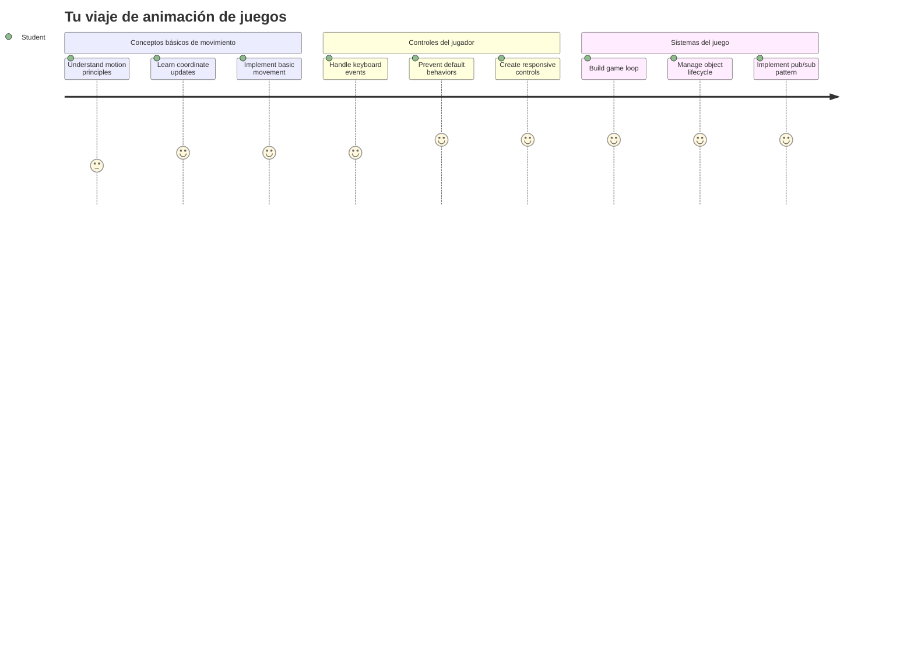
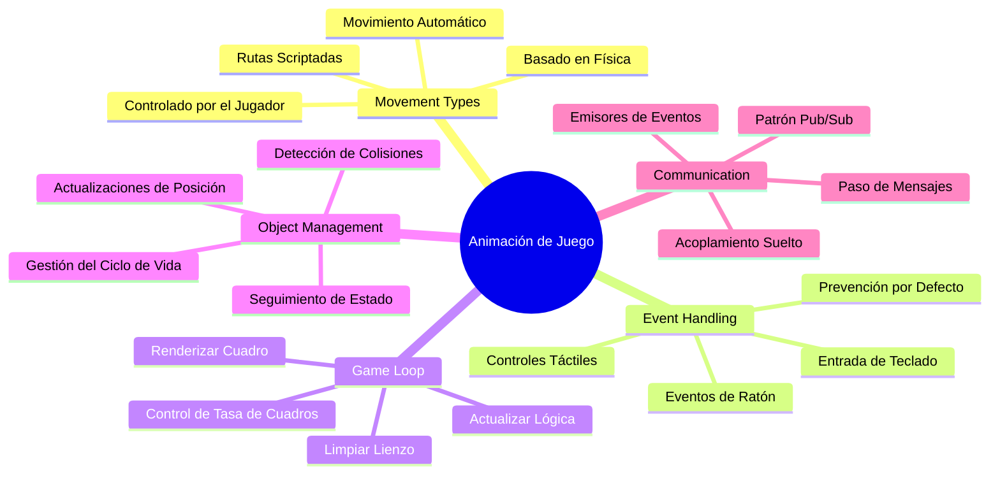
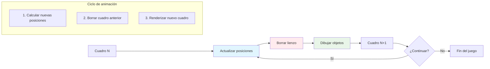
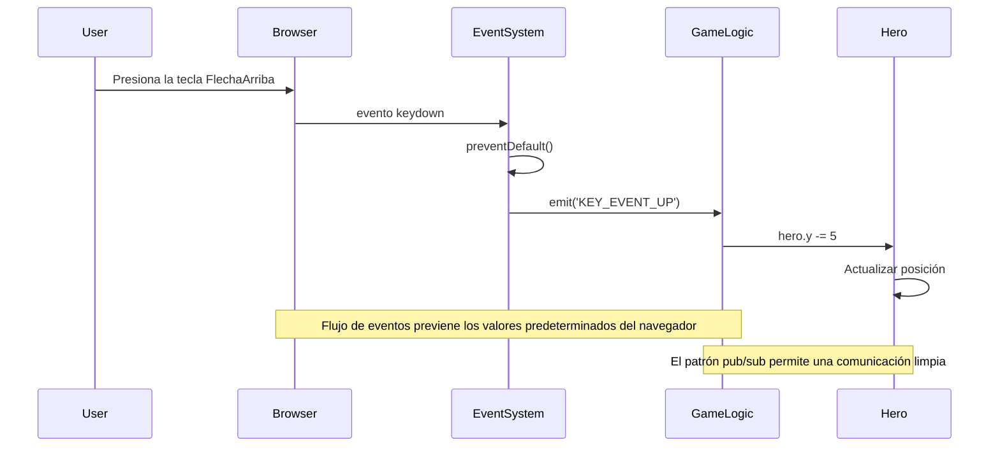
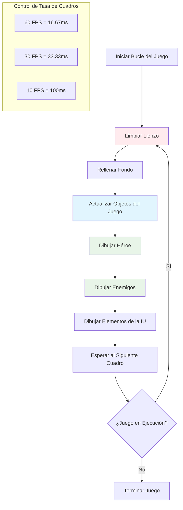
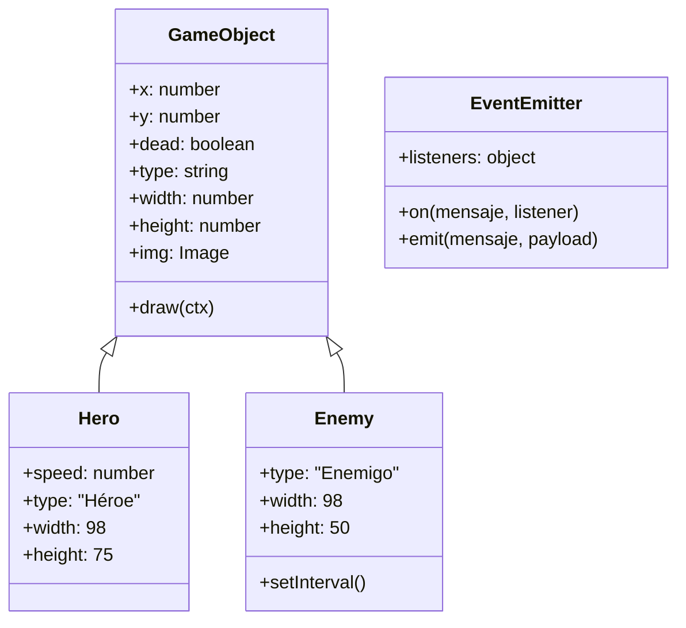
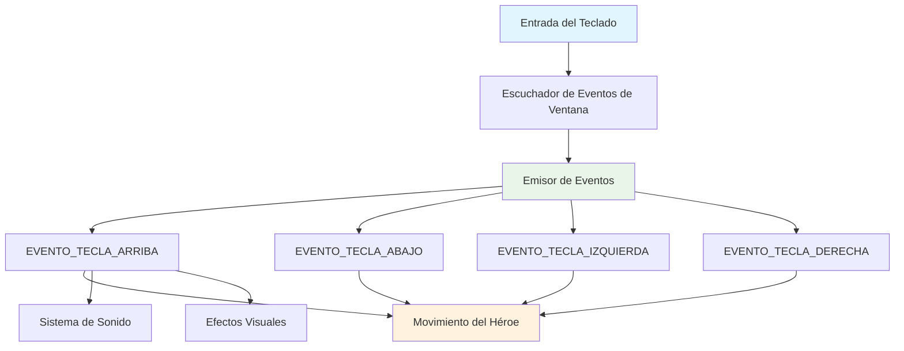
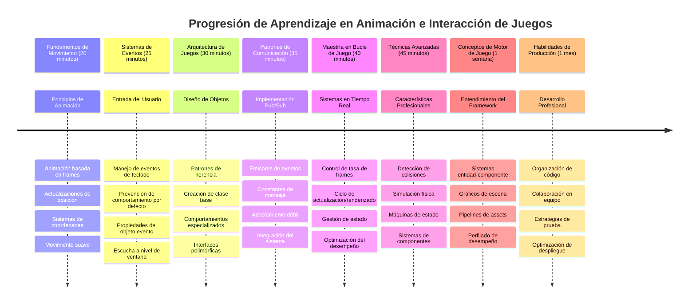

<!--
CO_OP_TRANSLATOR_METADATA:
{
  "original_hash": "8c55a2bd4bc0ebe4c88198fd563a9e09",
  "translation_date": "2026-01-06T07:34:10+00:00",
  "source_file": "6-space-game/3-moving-elements-around/README.md",
  "language_code": "es"
}
-->
# Construir un Juego Espacial Parte 3: Añadiendo Movimiento


Piensa en tus juegos favoritos: lo que los hace cautivadores no son solo los gráficos bonitos, sino la forma en que todo se mueve y responde a tus acciones. Ahora mismo, tu juego espacial es como una pintura hermosa, pero estamos a punto de agregar movimiento que le dará vida.

Cuando los ingenieros de la NASA programaron la computadora de guía para las misiones Apolo, enfrentaron un desafío similar: ¿cómo hacer que una nave espacial responda al piloto mientras mantiene automáticamente correcciones de rumbo? Los principios que aprenderemos hoy reflejan esos mismos conceptos: gestionar el movimiento controlado por el jugador junto con comportamientos automáticos del sistema.

En esta lección, aprenderás cómo hacer que las naves espaciales se deslicen por la pantalla, respondan a los comandos del jugador y creen patrones de movimiento suaves. Desglosaremos todo en conceptos manejables que se construyen uno sobre otro de forma natural.

Al final, tendrás jugadores pilotando su nave heroica alrededor de la pantalla mientras las naves enemigas patrullan arriba. Más importante aún, comprenderás los principios básicos que impulsan los sistemas de movimiento en los juegos.


## Cuestionario previo a la clase

[Cuestionario previo a la clase](https://ff-quizzes.netlify.app/web/quiz/33)

## Comprender el Movimiento en Juegos

Los juegos cobran vida cuando las cosas empiezan a moverse, y fundamentalmente existen dos maneras en que esto ocurre:

- **Movimiento controlado por el jugador**: Cuando presionas una tecla o haces clic con el ratón, algo se mueve. Esta es la conexión directa entre tú y el mundo del juego.
- **Movimiento automático**: Cuando el propio juego decide mover cosas, como esas naves enemigas que necesitan patrullar la pantalla, hagas algo o no.

Hacer que los objetos se muevan en una pantalla de computadora es más simple de lo que piensas. ¿Recuerdas esas coordenadas x e y de la clase de matemáticas? Eso es exactamente con lo que estamos trabajando. Cuando Galileo siguió las lunas de Júpiter en 1610, esencialmente estaba haciendo lo mismo: trazar posiciones en el tiempo para entender patrones de movimiento.

Mover cosas en pantalla es como crear una animación tipo libro de imágenes: necesitas seguir estos tres simples pasos:


1. **Actualizar la posición** – Cambiar dónde debe estar tu objeto (quizás moverlo 5 píxeles a la derecha)
2. **Borrar el cuadro antiguo** – Limpiar la pantalla para que no veas rastros fantasmales por todas partes
3. **Dibujar el cuadro nuevo** – Colocar tu objeto en su nueva posición

Haz esto lo suficientemente rápido, ¡y boom! Tendrás movimiento suave que se siente natural para los jugadores.

Aquí tienes cómo podría verse en código:

```javascript
// Establecer la ubicación del héroe
hero.x += 5;
// Borrar el rectángulo que alberga al héroe
ctx.clearRect(0, 0, canvas.width, canvas.height);
// Volver a dibujar el fondo del juego y al héroe
ctx.fillRect(0, 0, canvas.width, canvas.height);
ctx.fillStyle = "black";
ctx.drawImage(heroImg, hero.x, hero.y);
```

**Esto es lo que hace este código:**
- **Actualiza** la coordenada x del héroe en 5 píxeles para moverlo horizontalmente
- **Limpia** toda el área del canvas para eliminar el cuadro anterior
- **Rellena** el canvas con un color de fondo negro
- **Redibuja** la imagen del héroe en su nueva posición

✅ ¿Puedes pensar en una razón por la cual redibujar a tu héroe muchas veces por segundo podría acarrear costos de rendimiento? Lee sobre [alternativas a este patrón](https://developer.mozilla.org/en-US/docs/Web/API/Canvas_API/Tutorial/Optimizing_canvas).

## Manejar eventos del teclado

Aquí es donde conectamos la entrada del jugador con la acción del juego. Cuando alguien presiona la barra espaciadora para disparar un láser o pulsa una tecla de flecha para esquivar un asteroide, tu juego necesita detectar y responder a esa entrada.

Los eventos del teclado ocurren a nivel de ventana, lo que significa que toda la ventana del navegador está escuchando esas pulsaciones. Los clics del ratón, en cambio, pueden estar vinculados a elementos específicos (como un botón). Para nuestro juego espacial, nos enfocaremos en controles de teclado ya que eso ofrece a los jugadores esa sensación clásica de arcade.

Esto me recuerda a cómo los operadores de telégrafo en los 1800 tenían que traducir señales en código Morse a mensajes que tenían sentido: estamos haciendo algo similar, traduciendo pulsaciones de tecla en comandos del juego.

Para manejar un evento necesitas usar el método `addEventListener()` de la ventana y proporcionar dos parámetros de entrada. El primer parámetro es el nombre del evento, por ejemplo `keyup`. El segundo parámetro es la función que debe invocarse cuando el evento ocurre.

Aquí tienes un ejemplo:

```javascript
window.addEventListener('keyup', (evt) => {
  // evt.key = representación en cadena de la tecla
  if (evt.key === 'ArrowUp') {
    // hacer algo
  }
});
```

**Desglose de lo que sucede aquí:**
- **Escucha** eventos del teclado en toda la ventana
- **Captura** el objeto evento que contiene información sobre qué tecla fue presionada
- **Verifica** si la tecla presionada coincide con una tecla específica (en este caso, la flecha arriba)
- **Ejecuta** código cuando la condición se cumple

Para eventos de teclado hay dos propiedades en el evento que puedes usar para ver qué tecla fue presionada:

- `key` - esta es una representación en cadena de la tecla presionada, por ejemplo `'ArrowUp'`
- `keyCode` - esta es una representación numérica, por ejemplo `37`, que corresponde a `ArrowLeft`

✅ La manipulación de eventos de tecla es útil fuera del desarrollo de juegos. ¿Qué otros usos se te ocurren para esta técnica?


### ¡Teclas especiales: una advertencia!

Algunas teclas tienen comportamientos incorporados del navegador que pueden interferir con tu juego. Las teclas de flechas desplazan la página y la barra espaciadora salta hacia abajo, comportamientos que no quieres cuando alguien está pilotando su nave espacial.

Podemos prevenir estos comportamientos por defecto y dejar que nuestro juego maneje la entrada en su lugar. Esto es similar a cómo los primeros programadores de computadoras tenían que sobrescribir interrupciones del sistema para crear comportamientos personalizados; nosotros solo lo hacemos a nivel de navegador. Así es como se hace:

```javascript
const onKeyDown = function (e) {
  console.log(e.keyCode);
  switch (e.keyCode) {
    case 37:
    case 39:
    case 38:
    case 40: // Teclas de flecha
    case 32:
      e.preventDefault();
      break; // Espacio
    default:
      break; // no bloquear otras teclas
  }
};

window.addEventListener('keydown', onKeyDown);
```

**Entendiendo este código de prevención:**
- **Verifica** códigos de tecla específicos que podrían causar comportamiento no deseado del navegador
- **Previene** la acción por defecto del navegador para las teclas de flecha y barra espaciadora
- **Permite** que otras teclas funcionen normalmente
- **Usa** `e.preventDefault()` para detener el comportamiento incorporado del navegador

### 🔄 **Chequeo pedagógico**
**Comprensión del manejo de eventos**: Antes de avanzar al movimiento automático, asegúrate de que puedes:
- ✅ Explicar la diferencia entre eventos `keydown` y `keyup`
- ✅ Entender por qué prevenimos comportamientos por defecto del navegador
- ✅ Describir cómo los listeners de eventos conectan la entrada del usuario con la lógica del juego
- ✅ Identificar qué teclas podrían interferir con los controles del juego

**Autoevaluación rápida**: ¿Qué ocurriría si no previenes el comportamiento por defecto para las teclas de flecha?  
*Respuesta: El navegador desplazará la página, interfiriendo con el movimiento del juego*

**Arquitectura del sistema de eventos**: Ahora entiendes:  
- **Escucha a nivel ventana**: Captura eventos a nivel del navegador  
- **Propiedades del objeto evento**: cadenas `key` vs números `keyCode`  
- **Prevención de acciones por defecto**: Detener comportamientos indeseados del navegador  
- **Lógica condicional**: Responder a combinaciones de teclas específicas  

## Movimiento inducido por el juego

Ahora hablemos de objetos que se mueven sin entrada del jugador. Piensa en naves enemigas que cruzan la pantalla, balas volando en línea recta o nubes que flotan en el fondo. Este movimiento autónomo hace que tu mundo de juego se sienta vivo incluso cuando nadie toca los controles.

Usamos los temporizadores incorporados de JavaScript para actualizar posiciones a intervalos regulares. Este concepto es parecido a cómo funcionan los relojes de péndulo: un mecanismo regular que desencadena acciones consistentes y temporizadas. Así de simple puede ser:

```javascript
const id = setInterval(() => {
  // Mueve al enemigo en el eje y
  enemy.y += 10;
}, 100);
```

**Esto es lo que hace este código de movimiento:**
- **Crea** un temporizador que corre cada 100 milisegundos
- **Actualiza** la coordenada y del enemigo en 10 píxeles cada vez
- **Almacena** el ID del intervalo para poder detenerlo más tarde si es necesario
- **Mueve** al enemigo hacia abajo en la pantalla automáticamente

## El ciclo del juego

Aquí está el concepto que une todo – el ciclo del juego. Si tu juego fuera una película, el ciclo del juego sería el proyector de cine, mostrando cuadro tras cuadro tan rápido que todo parece moverse suavemente.

Cada juego tiene uno de estos ciclos corriendo en segundo plano. Es una función que actualiza todos los objetos del juego, redibuja la pantalla y repite este proceso continuamente. Esto mantiene el seguimiento de tu héroe, todos los enemigos, cualquier láser volando alrededor: todo el estado del juego.

Este concepto me recuerda a cómo los animadores de cine temprano como Walt Disney tenían que redibujar personajes cuadro por cuadro para crear la ilusión de movimiento. Nosotros hacemos lo mismo, solo que con código en lugar de lápices.

Así es como un ciclo de juego típicamente puede verse, expresado en código:


```javascript
const gameLoopId = setInterval(() => {
  function gameLoop() {
    ctx.clearRect(0, 0, canvas.width, canvas.height);
    ctx.fillStyle = "black";
    ctx.fillRect(0, 0, canvas.width, canvas.height);
    drawHero();
    drawEnemies();
    drawStaticObjects();
  }
  gameLoop();
}, 200);
```

**Entendiendo la estructura del ciclo del juego:**
- **Limpia** todo el canvas para eliminar el cuadro anterior
- **Rellena** el fondo con un color sólido
- **Dibuja** todos los objetos del juego en sus posiciones actuales
- **Repite** este proceso cada 200 milisegundos para crear una animación suave
- **Gestiona** la tasa de fotogramas controlando el tiempo del intervalo

## Continuando el Juego Espacial

Ahora añadiremos movimiento a la escena estática que construiste previamente. Vamos a transformarla de una captura de pantalla a una experiencia interactiva. Trabajaremos paso a paso para asegurar que cada parte se construya sobre la anterior.

Toma el código donde lo dejamos en la lección anterior (o empieza con el código en la carpeta [Parte II - código inicial](../../../../6-space-game/3-moving-elements-around/your-work) si necesitas un inicio fresco).

**Esto es lo que construiremos hoy:**
- **Controles del héroe**: Las flechas pilotarán tu nave espacial alrededor de la pantalla
- **Movimiento de enemigos**: Esas naves alienígenas comenzarán su avance

Comencemos implementando estas funciones.

## Pasos recomendados

Localiza los archivos que han sido creados para ti en la subcarpeta `your-work`. Debería contener lo siguiente:

```bash
-| assets
  -| enemyShip.png
  -| player.png
-| index.html
-| app.js
-| package.json
```

Empiezas tu proyecto en la carpeta `your-work` escribiendo:

```bash
cd your-work
npm start
```

**Esto es lo que hace este comando:**
- **Navega** hasta tu directorio de proyecto
- **Inicia** un servidor HTTP en la dirección `http://localhost:5000`
- **Sirve** tus archivos de juego para que puedas probarlos en un navegador

Lo anterior iniciará un servidor HTTP en la dirección `http://localhost:5000`. Abre un navegador e ingresa esa dirección, ahora debería mostrar el héroe y todos los enemigos; ¡aún nada se mueve!

### Añadir código

1. **Añade objetos dedicados** para `hero`, `enemy` y `game object`, deben tener propiedades `x` y `y`. (Recuerda la sección sobre [Herencia o composición](../README.md)).

   *PISTA* `game object` debe ser el que tenga `x` y `y` y la capacidad de dibujarse a un canvas.

   > **Consejo**: Comienza agregando una nueva clase `GameObject` con su constructor definido como abajo, y luego dibújala en el canvas:

    ```javascript
    class GameObject {
      constructor(x, y) {
        this.x = x;
        this.y = y;
        this.dead = false;
        this.type = "";
        this.width = 0;
        this.height = 0;
        this.img = undefined;
      }
    
      draw(ctx) {
        ctx.drawImage(this.img, this.x, this.y, this.width, this.height);
      }
    }
    ```

    **Entendiendo esta clase base:**
    - **Define** propiedades comunes que comparten todos los objetos del juego (posición, tamaño, imagen)
    - **Incluye** una bandera `dead` para rastrear si el objeto debe ser removido
    - **Proporciona** un método `draw()` que renderea el objeto en el canvas
    - **Establece** valores por defecto para todas las propiedades que las clases hijas pueden sobrescribir


    Ahora extiende esta `GameObject` para crear el `Hero` y el `Enemy`:
    
    ```javascript
    class Hero extends GameObject {
      constructor(x, y) {
        super(x, y);
        this.width = 98;
        this.height = 75;
        this.type = "Hero";
        this.speed = 5;
      }
    }
    ```

    ```javascript
    class Enemy extends GameObject {
      constructor(x, y) {
        super(x, y);
        this.width = 98;
        this.height = 50;
        this.type = "Enemy";
        const id = setInterval(() => {
          if (this.y < canvas.height - this.height) {
            this.y += 5;
          } else {
            console.log('Stopped at', this.y);
            clearInterval(id);
          }
        }, 300);
      }
    }
    ```

    **Conceptos clave en estas clases:**
    - **Hereda** de `GameObject` usando la palabra clave `extends`
    - **Llama** al constructor padre con `super(x, y)`
    - **Establece** dimensiones y propiedades específicas para cada tipo de objeto
    - **Implementa** movimiento automático para los enemigos usando `setInterval()`

2. **Añade manejadores de eventos de tecla** para manejar la navegación por teclado (mover héroe arriba/abajo/izquierda/derecha)

   *RECUERDA* es un sistema cartesiano, arriba-izquierda es `0,0`. También recuerda añadir código para detener el *comportamiento por defecto*.

   > **Consejo**: Crea tu función `onKeyDown` y adjúntala a la ventana:

   ```javascript
   const onKeyDown = function (e) {
     console.log(e.keyCode);
     // Agrega el código de la lección anterior para detener el comportamiento predeterminado
     switch (e.keyCode) {
       case 37:
       case 39:
       case 38:
       case 40: // Teclas de flecha
       case 32:
         e.preventDefault();
         break; // Espacio
       default:
         break; // no bloquees otras teclas
     }
   };

   window.addEventListener("keydown", onKeyDown);
   ```
    
   **Esto es lo que hace este manejador de eventos:**
   - **Escucha** eventos keydown en toda la ventana
   - **Registra** el código de tecla para ayudarte a depurar qué teclas se presionan
   - **Previene** comportamiento por defecto del navegador para teclas de flecha y barra espaciadora
   - **Permite** que otras teclas funcionen normalmente
   
   Observa la consola de tu navegador en este punto, y mira cómo se registran las pulsaciones.

3. **Implementa** el [patrón Pub-Sub](../README.md), esto mantendrá tu código limpio mientras sigues las partes restantes.

   El patrón Publicar-Suscribirse ayuda a organizar tu código separando la detección de eventos del manejo de eventos. Esto hace tu código más modular y fácil de mantener.

   Para hacer esta última parte, puedes:

   1. **Añadir un event listener** en la ventana:

       ```javascript
       window.addEventListener("keyup", (evt) => {
         if (evt.key === "ArrowUp") {
           eventEmitter.emit(Messages.KEY_EVENT_UP);
         } else if (evt.key === "ArrowDown") {
           eventEmitter.emit(Messages.KEY_EVENT_DOWN);
         } else if (evt.key === "ArrowLeft") {
           eventEmitter.emit(Messages.KEY_EVENT_LEFT);
         } else if (evt.key === "ArrowRight") {
           eventEmitter.emit(Messages.KEY_EVENT_RIGHT);
         }
       });
       ```

   **Esto es lo que hace este sistema de eventos:**
   - **Detecta** entrada del teclado y la convierte en eventos de juego personalizados
   - **Separa** la detección de entrada de la lógica del juego
   - **Facilita** cambiar los controles después sin afectar el código del juego
   - **Permite** que múltiples sistemas respondan a la misma entrada


   2. **Crear una clase EventEmitter** para publicar y suscribirse a mensajes:

       ```javascript
       class EventEmitter {
         constructor() {
           this.listeners = {};
         }
       
         on(message, listener) {
           if (!this.listeners[message]) {
             this.listeners[message] = [];
           }
           this.listeners[message].push(listener);
         }
       
   3. **Añadir constantes** y configurar el EventEmitter:

       ```javascript
       const Messages = {
         KEY_EVENT_UP: "KEY_EVENT_UP",
         KEY_EVENT_DOWN: "KEY_EVENT_DOWN",
         KEY_EVENT_LEFT: "KEY_EVENT_LEFT",
         KEY_EVENT_RIGHT: "KEY_EVENT_RIGHT",
       };
       
       let heroImg, 
           enemyImg, 
           laserImg,
           canvas, ctx, 
           gameObjects = [], 
           hero, 
           eventEmitter = new EventEmitter();
       ```

   **Entendiendo la configuración:**
   - **Define** constantes de mensajes para evitar errores tipográficos y facilitar refactorizaciones
   - **Declara** variables para imágenes, contexto del canvas y estado del juego
   - **Crea** un emisor de eventos global para el sistema pub-sub
   - **Inicializa** un arreglo para contener todos los objetos del juego

   4. **Inicializa el juego**

       ```javascript
       function initGame() {
         gameObjects = [];
         createEnemies();
         createHero();
       
         eventEmitter.on(Messages.KEY_EVENT_UP, () => {
           hero.y -= 5;
         });
       
         eventEmitter.on(Messages.KEY_EVENT_DOWN, () => {
           hero.y += 5;
         });
       
         eventEmitter.on(Messages.KEY_EVENT_LEFT, () => {
           hero.x -= 5;
         });
       
4. **Configura el bucle del juego**

   Refactoriza la función `window.onload` para inicializar el juego y configurar un bucle de juego con un intervalo adecuado. También agregarás un rayo láser:

    ```javascript
    window.onload = async () => {
      canvas = document.getElementById("canvas");
      ctx = canvas.getContext("2d");
      heroImg = await loadTexture("assets/player.png");
      enemyImg = await loadTexture("assets/enemyShip.png");
      laserImg = await loadTexture("assets/laserRed.png");
    
      initGame();
      const gameLoopId = setInterval(() => {
        ctx.clearRect(0, 0, canvas.width, canvas.height);
        ctx.fillStyle = "black";
        ctx.fillRect(0, 0, canvas.width, canvas.height);
        drawGameObjects(ctx);
      }, 100);
    };
    ```

   **Entendiendo la configuración del juego:**
   - **Espera** a que la página cargue completamente antes de comenzar
   - **Obtiene** el elemento canvas y su contexto de renderizado 2D
   - **Carga** todos los recursos de imagen de forma asincrónica usando `await`
   - **Inicia** el bucle del juego que corre a intervalos de 100ms (10 FPS)
   - **Limpia** y redibuja toda la pantalla en cada fotograma

5. **Agrega código** para mover a los enemigos a un cierto intervalo

    Refactoriza la función `createEnemies()` para crear a los enemigos y añadirlos a la nueva clase de gameObjects:

    ```javascript
    function createEnemies() {
      const MONSTER_TOTAL = 5;
      const MONSTER_WIDTH = MONSTER_TOTAL * 98;
      const START_X = (canvas.width - MONSTER_WIDTH) / 2;
      const STOP_X = START_X + MONSTER_WIDTH;
    
      for (let x = START_X; x < STOP_X; x += 98) {
        for (let y = 0; y < 50 * 5; y += 50) {
          const enemy = new Enemy(x, y);
          enemy.img = enemyImg;
          gameObjects.push(enemy);
        }
      }
    }
    ```

    **Lo que hace la creación de enemigos:**
    - **Calcula** posiciones para centrar a los enemigos en la pantalla
    - **Crea** una cuadrícula de enemigos usando bucles anidados
    - **Asigna** la imagen del enemigo a cada objeto enemigo
    - **Añade** cada enemigo al arreglo global de objetos del juego
    
    y agrega una función `createHero()` para hacer un proceso similar con el héroe.
    
    ```javascript
    function createHero() {
      hero = new Hero(
        canvas.width / 2 - 45,
        canvas.height - canvas.height / 4
      );
      hero.img = heroImg;
      gameObjects.push(hero);
    }
    ```

    **Lo que hace la creación del héroe:**
    - **Posiciona** al héroe en el centro inferior de la pantalla
    - **Asigna** la imagen del héroe al objeto héroe
    - **Añade** el héroe al arreglo de objetos del juego para su renderizado

    y finalmente, agrega una función `drawGameObjects()` para empezar el dibujo:

    ```javascript
    function drawGameObjects(ctx) {
      gameObjects.forEach(go => go.draw(ctx));
    }
    ```

    **Entendiendo la función de dibujo:**
    - **Itera** a través de todos los objetos del juego en el arreglo
    - **Llama** al método `draw()` de cada objeto
    - **Pasa** el contexto del canvas para que los objetos puedan renderizarse

    ### 🔄 **Chequeo pedagógico**
    **Comprensión completa del sistema de juego**: Verifica tu dominio de toda la arquitectura:
    - ✅ ¿Cómo permite la herencia que Hero y Enemy compartan propiedades comunes de GameObject?
    - ✅ ¿Por qué el patrón pub/sub hace que tu código sea más mantenible?
    - ✅ ¿Qué función cumple el bucle del juego para crear una animación fluida?
    - ✅ ¿Cómo conectan los event listeners la entrada del usuario con el comportamiento de los objetos del juego?

    **Integración del sistema**: Tu juego ahora demuestra:
    - **Diseño Orientado a Objetos**: Clases base con herencia especializada
    - **Arquitectura basada en eventos**: Patrón pub/sub para desacoplamiento
    - **Marco de animación**: Bucle de juego con actualizaciones constantes
    - **Manejo de entrada**: Eventos de teclado con prevención por defecto
    - **Gestión de recursos**: Carga de imágenes y renderizado de sprites

    **Patrones profesionales**: Has implementado:
    - **Separación de responsabilidades**: Entrada, lógica y renderizado separados
    - **Polimorfismo**: Todos los objetos del juego comparten una interfaz común de dibujo
    - **Paso de mensajes**: Comunicación limpia entre componentes
    - **Gestión de recursos**: Manejo eficiente de sprites y animaciones

    ¡Tus enemigos deberían comenzar a avanzar en tu nave espacial del héroe!
      }
    }
    ```
    
    and add a `createHero()` function to do a similar process for the hero.
    
    ```javascript
    function createHero() {
      hero = new Hero(
        canvas.width / 2 - 45,
        canvas.height - canvas.height / 4
      );
      hero.img = heroImg;
      gameObjects.push(hero);
    }
    ```

    y finalmente, agrega una función `drawGameObjects()` para empezar el dibujo:

    ```javascript
    function drawGameObjects(ctx) {
      gameObjects.forEach(go => go.draw(ctx));
    }
    ```

    ¡Tus enemigos deberían comenzar a avanzar en tu nave espacial del héroe!

---

## Desafío del Agente de GitHub Copilot 🚀

Aquí tienes un desafío que mejorará el pulido de tu juego: añadir límites y controles suaves. Actualmente, tu héroe puede salir de la pantalla, y el movimiento puede sentirse entrecortado.

**Tu misión:** Haz que tu nave espacial se sienta más realista implementando límites de pantalla y un movimiento fluido. Esto es similar a cómo los sistemas de control de vuelo de la NASA evitan que las naves espaciales excedan parámetros operativos seguros.

**Esto es lo que debes construir:** Crea un sistema que mantenga a tu nave heroica dentro de la pantalla y que haga que los controles sean fluidos. Cuando los jugadores mantengan presionada una tecla de flecha, la nave debería deslizarse continuamente en lugar de moverse en pasos discretos. Considera añadir retroalimentación visual cuando la nave alcance los límites de la pantalla, tal vez un efecto sutil que indique el borde del área de juego.

Aprende más sobre [el modo agente](https://code.visualstudio.com/blogs/2025/02/24/introducing-copilot-agent-mode) aquí.

## 🚀 Desafío

La organización del código se vuelve cada vez más importante a medida que los proyectos crecen. Tal vez hayas notado que tu archivo se llena de funciones, variables y clases todas mezcladas. Esto me recuerda a cómo los ingenieros que organizaron el código de la misión Apolo tuvieron que crear sistemas claros y mantenibles en los que múltiples equipos pudieran trabajar al mismo tiempo.

**Tu misión:**
Piensa como un arquitecto de software. ¿Cómo organizarías tu código para que, dentro de seis meses, tú (o un compañero) pueda entender qué está pasando? Incluso si todo permanece en un solo archivo por ahora, puedes crear una mejor organización:

- **Agrupar funciones relacionadas** juntas con encabezados de comentarios claros
- **Separar responsabilidades** - mantener la lógica del juego separada del renderizado
- **Usar convenciones de nombres** consistentes para variables y funciones
- **Crear módulos** o espacios de nombres para organizar diferentes aspectos de tu juego
- **Añadir documentación** que explique el propósito de cada sección mayor

**Preguntas para la reflexión:**
- ¿Qué partes de tu código son las más difíciles de entender cuando vuelves a ellas?
- ¿Cómo podrías organizar tu código para que sea más fácil para alguien más contribuir?
- ¿Qué pasaría si quisieras añadir nuevas características como potenciadores o diferentes tipos de enemigos?

## Quiz post-clase

[Quiz post-clase](https://ff-quizzes.netlify.app/web/quiz/34)

## Repaso y autoaprendizaje

Hemos estado construyendo todo desde cero, lo cual es fantástico para aprender, pero aquí hay un pequeño secreto: existen algunos increíbles frameworks de JavaScript que pueden encargarse de gran parte del trabajo pesado por ti. Una vez que te sientas cómodo con los fundamentos que hemos cubierto, vale la pena [explorar lo que hay disponible](https://github.com/collections/javascript-game-engines).

Piensa en los frameworks como tener una caja de herramientas bien equipada en lugar de hacer cada herramienta a mano. Pueden resolver muchos de esos desafíos de organización de código que mencionamos, además de ofrecer características que te tomarían semanas desarrollar por ti mismo.

**Cosas que vale la pena explorar:**
- Cómo los motores de juego organizan el código – te sorprenderán los patrones inteligentes que usan
- Trucos de rendimiento para hacer que los juegos en canvas funcionen de forma muy fluida
- Funciones modernas de JavaScript que pueden hacer tu código más limpio y mantenible
- Diferentes enfoques para manejar los objetos de juego y sus relaciones

## 🎯 Tu Línea de Tiempo de Maestría en Animación de Juegos


### 🛠️ Resumen de tu Kit de Desarrollo de Juegos

Después de completar esta lección, ahora dominas:
- **Principios de animación**: Movimiento basado en fotogramas y transiciones suaves
- **Programación orientada a eventos**: Manejo de entradas de teclado con gestión adecuada de eventos
- **Diseño orientado a objetos**: Jerarquías de herencia e interfaces polimórficas
- **Patrones de comunicación**: Arquitectura pub/sub para código mantenible
- **Arquitectura del bucle de juego**: Ciclos de actualización y renderizado en tiempo real
- **Sistemas de entrada**: Mapeo de controles de usuario con prevención del comportamiento por defecto
- **Gestión de recursos**: Carga de sprites y técnicas de renderizado eficientes

### ⚡ **Lo que puedes hacer en los próximos 5 minutos**
- [ ] Abre la consola del navegador y prueba `addEventListener('keydown', console.log)` para ver eventos de teclado
- [ ] Crea un elemento div simple y muévelo usando las teclas de flecha
- [ ] Experimenta con `setInterval` para crear un movimiento continuo
- [ ] Prueba prevenir el comportamiento por defecto con `event.preventDefault()`

### 🎯 **Lo que puedes lograr esta hora**
- [ ] Completar el quiz post-lección y entender la programación orientada a eventos
- [ ] Construir la nave espacial heroica con controles completos de teclado
- [ ] Implementar patrones de movimiento suave de enemigos
- [ ] Añadir límites para evitar que los objetos del juego salgan de la pantalla
- [ ] Crear detección básica de colisiones entre objetos del juego

### 📅 **Tu viaje de animación durante una semana**
- [ ] Completar el juego espacial completo con movimiento e interacciones pulidas
- [ ] Añadir patrones avanzados de movimiento como curvas, aceleración y física
- [ ] Implementar transiciones suaves y funciones de easing
- [ ] Crear efectos de partículas y sistemas de retroalimentación visual
- [ ] Optimizar el rendimiento del juego para un gameplay fluido a 60fps
- [ ] Añadir controles táctiles móviles y diseño responsivo

### 🌟 **Tu desarrollo interactivo durante un mes**
- [ ] Construir aplicaciones interactivas complejas con sistemas avanzados de animación
- [ ] Aprender bibliotecas de animación como GSAP o crear tu propio motor de animación
- [ ] Contribuir a proyectos open source de desarrollo de juegos y animación
- [ ] Dominar la optimización de rendimiento para aplicaciones gráficas intensivas
- [ ] Crear contenido educativo sobre desarrollo de juegos y animación
- [ ] Construir un portafolio mostrando habilidades avanzadas de programación interactiva

**Aplicaciones en el mundo real**: Tus habilidades en animación de juegos se aplican directamente a:
- **Aplicaciones web interactivas**: Paneles dinámicos e interfaces en tiempo real
- **Visualización de datos**: Gráficos animados y gráficos interactivos
- **Software educativo**: Simulaciones interactivas y herramientas de aprendizaje
- **Desarrollo móvil**: Juegos táctiles y manejo de gestos
- **Aplicaciones de escritorio**: Apps Electron con animaciones suaves
- **Animaciones web**: Bibliotecas de animación en CSS y JavaScript

**Habilidades profesionales adquiridas**: Ahora puedes:
- **Arquitectar** sistemas orientados a eventos que escalen con la complejidad
- **Implementar** animaciones suaves usando principios matemáticos
- **Depurar** sistemas de interacción complejos usando las herramientas de desarrollo del navegador
- **Optimizar** el rendimiento del juego para diferentes dispositivos y navegadores
- **Diseñar** estructuras de código mantenibles usando patrones probados

**Conceptos de desarrollo de juegos dominados**:
- **Gestión de tasa de fotogramas**: Entender FPS y controles de tiempo
- **Manejo de entrada**: Sistemas de teclado y eventos multiplataforma
- **Ciclo de vida del objeto**: Patrones de creación, actualización y destrucción
- **Sincronización de estado**: Mantener el estado del juego consistente entre fotogramas
- **Arquitectura de eventos**: Comunicación desacoplada entre sistemas del juego

**Siguiente nivel**: ¡Estás listo para añadir detección de colisiones, sistemas de puntuación, efectos de sonido, o explorar frameworks modernos de juegos como Phaser o Three.js!

🌟 **Logro desbloqueado**: ¡Has construido un sistema completo de juego interactivo con patrones arquitectónicos profesionales!

## Asignación

[Comenta tu código](assignment.md)

---

<!-- CO-OP TRANSLATOR DISCLAIMER START -->
**Descargo de responsabilidad**:  
Este documento ha sido traducido utilizando el servicio de traducción automática [Co-op Translator](https://github.com/Azure/co-op-translator). Aunque nos esforzamos por la precisión, tenga en cuenta que las traducciones automáticas pueden contener errores o inexactitudes. El documento original en su idioma nativo debe considerarse la fuente autorizada. Para información crítica, se recomienda la traducción profesional realizada por un humano. No somos responsables de cualquier malentendido o interpretación errónea que surja del uso de esta traducción.
<!-- CO-OP TRANSLATOR DISCLAIMER END -->