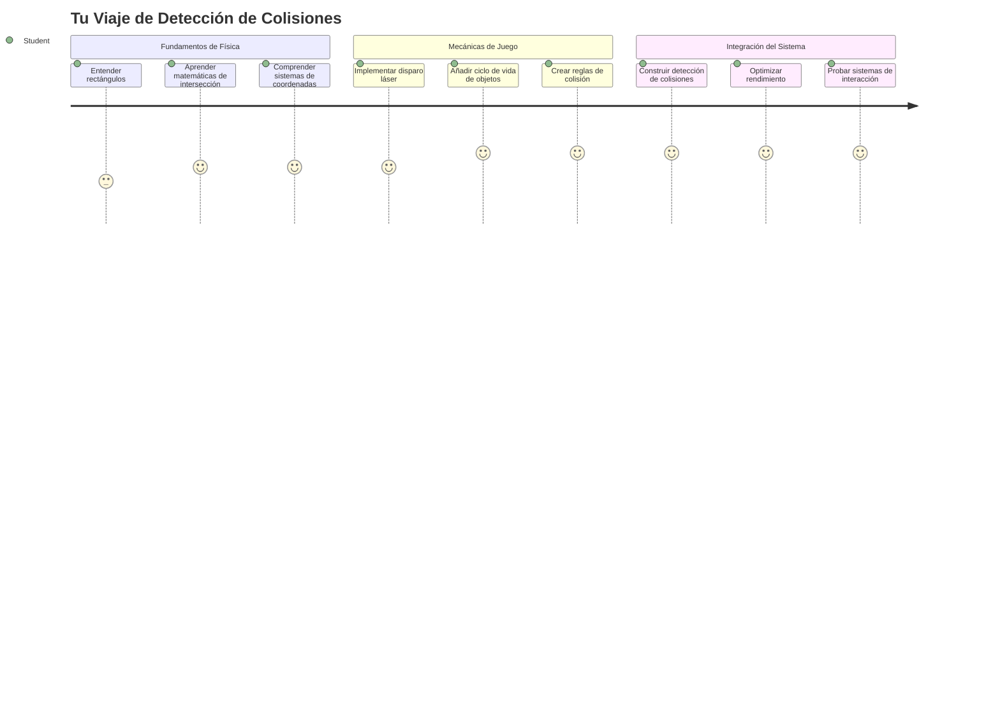
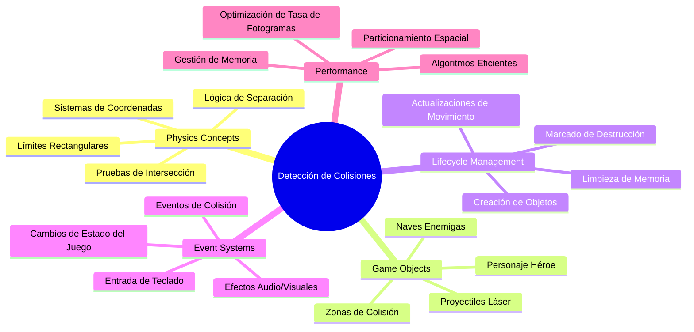
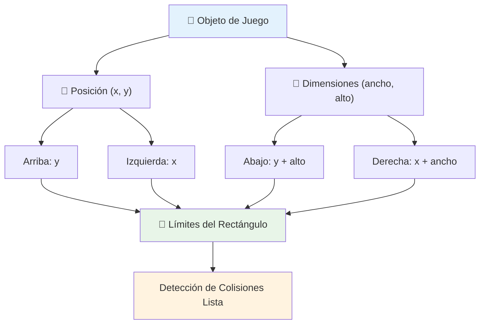
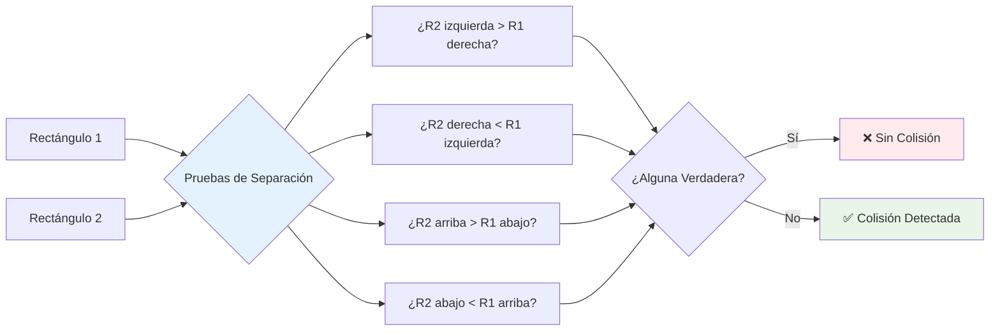
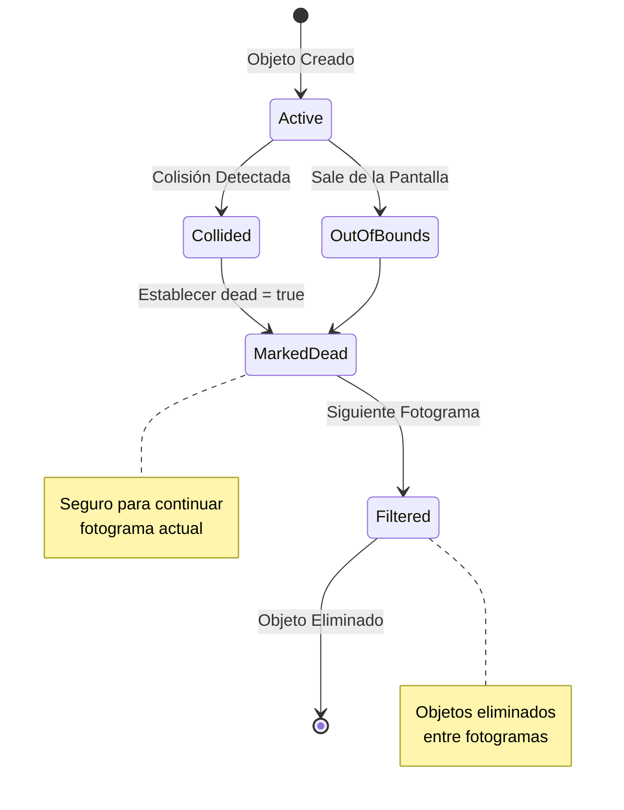
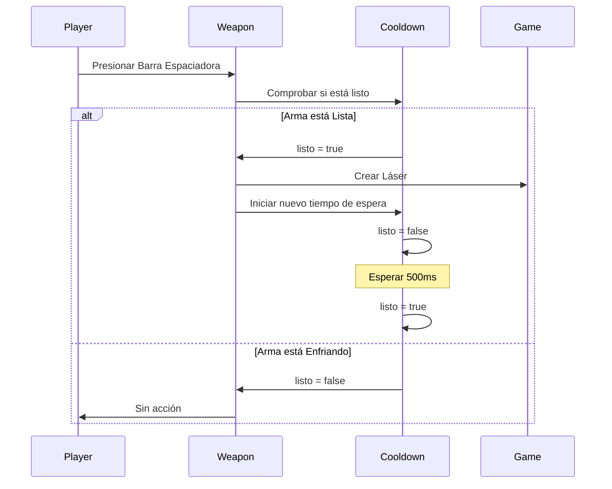
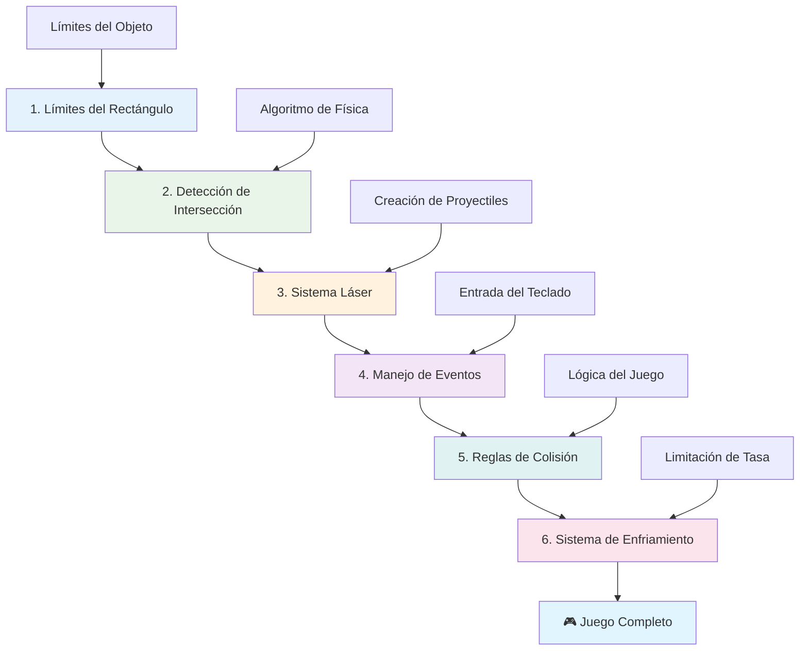
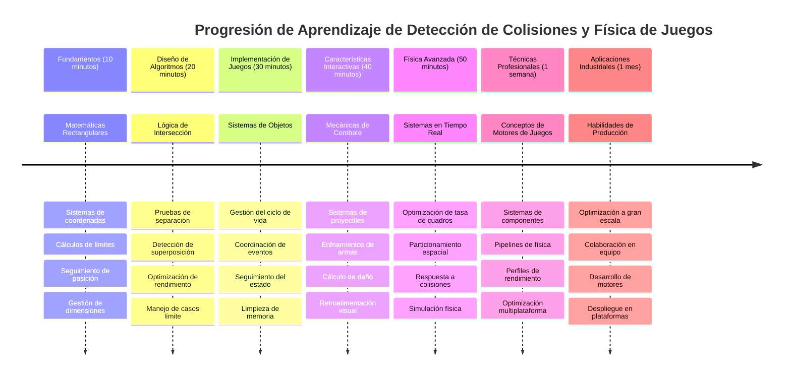

# Construye un Juego Espacial Parte 4: Agregar un Láser y Detectar Colisiones


## Cuestionario Previo a la Lección

[Cuestionario previo a la lección](https://ff-quizzes.netlify.app/web/quiz/35)

Piensa en el momento en Star Wars cuando los torpedos de protones de Luke alcanzan el puerto de escape de la Estrella de la Muerte. ¡Esa detección precisa de colisiones cambió el destino de la galaxia! En los juegos, la detección de colisiones funciona igual: determina cuándo los objetos interactúan y qué sucede después.

En esta lección, añadirás armas láser a tu juego espacial e implementarás la detección de colisiones. Al igual que los planificadores de misiones de la NASA calculan las trayectorias de las naves para evitar escombros, aprenderás a detectar cuándo los objetos del juego se intersectan. Lo desglosaremos en pasos manejables que se construyen unos sobre otros.

Al final, tendrás un sistema de combate funcional donde los láseres destruyen enemigos y las colisiones activan eventos en el juego. Estos mismos principios de colisiones se usan en todo, desde simulaciones físicas hasta interfaces web interactivas.


✅ Investiga un poco sobre el primer juego de computadora jamás escrito. ¿Cuál era su funcionalidad?

## Detección de colisiones

La detección de colisiones funciona como los sensores de proximidad en el módulo lunar Apolo: revisa constantemente las distancias y activa alertas cuando los objetos se acercan demasiado. En los juegos, este sistema determina cuándo los objetos interactúan y qué debe pasar después.

El enfoque que usaremos trata cada objeto del juego como un rectángulo, similar a cómo los sistemas de control de tráfico aéreo usan formas geométricas simplificadas para rastrear aviones. Este método rectangular puede parecer básico, pero es computacionalmente eficiente y funciona bien para la mayoría de los escenarios de juegos.

### Representación del rectángulo

Cada objeto del juego necesita límites de coordenadas, similar a cómo el rover Mars Pathfinder mapeó su ubicación en la superficie marciana. Así definimos estas coordenadas límite:


```javascript
rectFromGameObject() {
  return {
    top: this.y,
    left: this.x,
    bottom: this.y + this.height,
    right: this.x + this.width
  }
}
```

**Vamos a desglosarlo:**
- **Borde superior**: Es justo donde comienza tu objeto verticalmente (su posición y)
- **Borde izquierdo**: Dónde comienza horizontalmente (su posición x)
- **Borde inferior**: Suma la altura a la posición y — ¡ahora sabes dónde termina!
- **Borde derecho**: Suma el ancho a la posición x — y tienes el límite completo

### Algoritmo de intersección

Detectar intersecciones de rectángulos usa una lógica similar a cómo el Telescopio Espacial Hubble determina si objetos celestes se superponen en su campo visual. El algoritmo verifica separación:


```javascript
function intersectRect(r1, r2) {
  return !(r2.left > r1.right ||
    r2.right < r1.left ||
    r2.top > r1.bottom ||
    r2.bottom < r1.top);
}
```

**La prueba de separación funciona como los sistemas de radar:**
- ¿Está el rectángulo 2 completamente a la derecha del rectángulo 1?
- ¿Está el rectángulo 2 completamente a la izquierda del rectángulo 1?
- ¿Está el rectángulo 2 completamente debajo del rectángulo 1?
- ¿Está el rectángulo 2 completamente por encima del rectángulo 1?

Si ninguna de estas condiciones se cumple, los rectángulos deben estar superpuestos. Este enfoque refleja cómo los operadores de radar determinan si dos aviones están a distancias seguras.

## Gestión del ciclo de vida de los objetos

Cuando un láser impacta a un enemigo, ambos objetos deben ser eliminados del juego. Sin embargo, eliminar objetos en medio de un ciclo puede causar fallos—una lección aprendida de forma dura en los primeros sistemas como la Computadora de Guía Apolo. En cambio, usamos un enfoque de "marcar para eliminar" que remueve los objetos de forma segura entre fotogramas.


Así es como marcamos algo para eliminación:

```javascript
// Marcar objeto para eliminación
enemy.dead = true;
```

**Por qué funciona este enfoque:**
- Marcamos el objeto como "muerto" pero no lo eliminamos inmediatamente
- Esto permite que el fotograma actual del juego termine con seguridad
- ¡No hay fallos por intentar usar algo que ya no existe!

Luego filtramos los objetos marcados antes del siguiente ciclo de renderizado:

```javascript
gameObjects = gameObjects.filter(go => !go.dead);
```

**Qué hace este filtrado:**
- Crea una lista nueva solo con los objetos "vivos"
- Elimina todo lo marcado como muerto
- Mantiene tu juego funcionando sin problemas
- Previene la acumulación de objetos destruidos que sobran en memoria

## Implementando las mecánicas del láser

Los proyectiles láser en juegos funcionan bajo el mismo principio que los torpedos de fotones en Star Trek: son objetos discretos que viajan en línea recta hasta impactar algo. Cada vez que presionas la barra espaciadora, se crea un nuevo objeto láser que se mueve por la pantalla.

Para que esto funcione, necesitamos coordinar algunas piezas diferentes:

**Componentes clave para implementar:**
- **Crear** objetos láser que aparecen desde la posición del héroe
- **Manejar** la entrada del teclado para disparar láseres
- **Gestionar** el movimiento y ciclo de vida de los láseres
- **Implementar** la representación visual para los proyectiles láser

## Implementando control de tasa de disparo

Una tasa de disparo ilimitada sobrecargaría el motor del juego y haría que jugar fuera demasiado fácil. Los sistemas de armas reales enfrentan restricciones similares: incluso los phasers del USS Enterprise necesitaban tiempo para recargarse entre disparos.

Implementaremos un sistema de enfriamiento que previene disparos a ráfaga mientras mantiene controles responsivos:


```javascript
class Cooldown {
  constructor(time) {
    this.cool = false;
    setTimeout(() => {
      this.cool = true;
    }, time);
  }
}

class Weapon {
  constructor() {
    this.cooldown = null;
  }
  
  fire() {
    if (!this.cooldown || this.cooldown.cool) {
      // Crear proyectil láser
      this.cooldown = new Cooldown(500);
    } else {
      // El arma todavía se está enfriando
    }
  }
}
```

**Cómo funciona el enfriamiento:**
- Cuando se crea, el arma está "caliente" (todavía no puede disparar)
- Después del período de espera, se vuelve "fría" (lista para disparar)
- Antes de disparar, comprobamos: "¿Está el arma fría?"
- Esto previene el spam de clics manteniendo controles ágiles

✅ Consulta la lección 1 de la serie de juegos espaciales para recordarte sobre los sistemas de enfriamiento.

## Construyendo el sistema de colisiones

Extenderás el código de tu juego espacial existente para crear un sistema de detección de colisiones. Como el sistema automatizado de evitación de colisiones de la Estación Espacial Internacional, tu juego monitoreará continuamente las posiciones de los objetos y responderá a las intersecciones.

Partiendo del código de tu lección anterior, añadirás detección de colisiones con reglas específicas que regulan las interacciones de los objetos.

> 💡 **Consejo profesional**: El sprite del láser ya está incluido en tu carpeta de assets y referenciado en tu código, listo para implementarse.

### Reglas de colisión a implementar

**Mecánicas del juego para agregar:**
1. **Láser impacta enemigo**: El objeto enemigo es destruido cuando un láser lo golpea
2. **Láser choca con el límite de pantalla**: El láser se elimina al llegar al borde superior de la pantalla
3. **Colisión entre enemigo y héroe**: Ambos objetos se destruyen al intersectar
4. **Enemigo llega al fondo**: Condición de juego terminado cuando los enemigos llegan al fondo de la pantalla

### 🔄 **Chequeo pedagógico**
**Fundamento de Detección de Colisiones**: Antes de implementar, asegúrate de entender:
- ✅ Cómo los límites rectangulares definen zonas de colisión
- ✅ Por qué la prueba de separación es más eficiente que calcular intersecciones
- ✅ La importancia de la gestión del ciclo de vida de los objetos en bucles de juego
- ✅ Cómo sistemas orientados a eventos coordinan respuestas a colisiones

**Autoevaluación Rápida**: ¿Qué pasaría si eliminaras objetos inmediatamente en lugar de marcarlos?
*Respuesta: La eliminación a mitad de ciclo podría causar fallos o saltar objetos en la iteración*

**Comprensión Física**: Ahora comprendes:
- **Sistemas de Coordenadas**: Cómo la posición y dimensiones crean límites
- **Lógica de Intersección**: Principios matemáticos detrás de la detección de colisiones
- **Optimización de Rendimiento**: Por qué los algoritmos eficientes importan en sistemas en tiempo real
- **Gestión de Memoria**: Patrones seguros para el ciclo de vida de objetos para estabilidad

## Configurando tu entorno de desarrollo

Buenas noticias — ya hemos preparado la mayor parte para ti! Todos tus assets y la estructura básica del juego están en la subcarpeta `your-work`, listos para que agregues las funciones geniales de colisiones.

### Estructura del proyecto

```bash
-| assets
  -| enemyShip.png
  -| player.png
  -| laserRed.png
-| index.html
-| app.js
-| package.json
```

**Entendiendo la estructura de archivos:**
- **Contiene** todas las imágenes sprite necesarias para los objetos del juego
- **Incluye** el documento HTML principal y el archivo JavaScript de la aplicación
- **Proporciona** configuración del paquete para el servidor de desarrollo local

### Iniciando el servidor de desarrollo

Ve a la carpeta de tu proyecto y arranca el servidor local:

```bash
cd your-work
npm start
```

**Esta secuencia de comandos:**
- **Cambia** directorio a la carpeta de tu proyecto en uso
- **Inicia** un servidor HTTP local en `http://localhost:5000`
- **Sirve** tus archivos de juego para pruebas y desarrollo
- **Permite** desarrollo con recarga automática en vivo

Abre tu navegador y navega a `http://localhost:5000` para ver el estado actual de tu juego con el héroe y enemigos renderizados en pantalla.

### Implementación paso a paso

Como el enfoque sistemático que NASA usó para programar la nave Voyager, implementaremos la detección de colisiones metódicamente, construyendo cada componente paso a paso.


#### 1. Agrega límites rectangulares de colisión

Primero, enseñemos a los objetos del juego cómo describir sus límites. Añade este método a tu clase `GameObject`:

```javascript
rectFromGameObject() {
    return {
      top: this.y,
      left: this.x,
      bottom: this.y + this.height,
      right: this.x + this.width,
    };
  }
```

**Este método logra:**
- **Crear** un objeto rectángulo con coordenadas límite precisas
- **Calcular** los bordes inferior y derecho usando posición más dimensiones
- **Devolver** un objeto listo para algoritmos de detección de colisiones
- **Proveer** una interfaz estandarizada para todos los objetos del juego

#### 2. Implementar detección de intersección

Ahora crearemos nuestro detective de colisiones: una función que pueda decir cuándo dos rectángulos se superponen:

```javascript
function intersectRect(r1, r2) {
  return !(
    r2.left > r1.right ||
    r2.right < r1.left ||
    r2.top > r1.bottom ||
    r2.bottom < r1.top
  );
}
```

**Este algoritmo funciona:**
- **Prueba** cuatro condiciones de separación entre rectángulos
- **Devuelve** `false` si alguna condición de separación es verdadera
- **Indica** colisión cuando no hay separación
- **Usa** lógica de negación para pruebas eficientes de intersección

#### 3. Implementar el sistema de disparo láser

¡Aquí es donde se pone emocionante! Configuraremos el sistema de disparo láser.

##### Constantes de mensajes

Primero, definamos algunos tipos de mensajes para que las distintas partes del juego puedan comunicarse:

```javascript
KEY_EVENT_SPACE: "KEY_EVENT_SPACE",
COLLISION_ENEMY_LASER: "COLLISION_ENEMY_LASER",
COLLISION_ENEMY_HERO: "COLLISION_ENEMY_HERO",
```

**Estas constantes proveen:**
- **Estandarizan** los nombres de eventos en toda la aplicación
- **Habilitan** comunicación consistente entre sistemas del juego
- **Previenen** errores ortográficos en el registro de manejadores de eventos

##### Manejo de entrada de teclado

Agrega la detección de la tecla espacio a tu listener de eventos de teclado:

```javascript
} else if(evt.keyCode === 32) {
  eventEmitter.emit(Messages.KEY_EVENT_SPACE);
}
```

**Este manejador de entrada:**
- **Detecta** presiones de la tecla espacio usando keyCode 32
- **Emite** un mensaje de evento estandarizado
- **Permite** lógica desacoplada para disparar

##### Configuración del listener de eventos

Registra el comportamiento de disparo en tu función `initGame()`:

```javascript
eventEmitter.on(Messages.KEY_EVENT_SPACE, () => {
 if (hero.canFire()) {
   hero.fire();
 }
});
```

**Este listener de eventos:**
- **Responde** a eventos de la tecla espacio
- **Verifica** el estado del enfriamiento para disparar
- **Dispara** creando un láser cuando está permitido

Agrega manejo de colisiones para interacciones láser-enemigo:

```javascript
eventEmitter.on(Messages.COLLISION_ENEMY_LASER, (_, { first, second }) => {
  first.dead = true;
  second.dead = true;
});
```

**Este manejador de colisiones:**
- **Recibe** datos del evento de colisión con ambos objetos
- **Marca** ambos objetos para eliminación
- **Asegura** la limpieza adecuada tras la colisión

#### 4. Crear la clase Laser

Implementa un proyectil láser que se mueve hacia arriba y gestiona su propio ciclo de vida:

```javascript
class Laser extends GameObject {
  constructor(x, y) {
    super(x, y);
    this.width = 9;
    this.height = 33;
    this.type = 'Laser';
    this.img = laserImg;
    
    let id = setInterval(() => {
      if (this.y > 0) {
        this.y -= 15;
      } else {
        this.dead = true;
        clearInterval(id);
      }
    }, 100);
  }
}
```

**Esta implementación de clase:**
- **Extiende** GameObject para heredar funcionalidad básica
- **Define** dimensiones apropiadas para el sprite láser
- **Crea** movimiento automático hacia arriba usando `setInterval()`
- **Se destruye** a sí mismo cuando alcanza la parte superior de la pantalla
- **Maneja** su propia animación y limpieza

#### 5. Implementar el sistema de detección de colisiones

Crea una función completa para detección de colisiones:

```javascript
function updateGameObjects() {
  const enemies = gameObjects.filter(go => go.type === 'Enemy');
  const lasers = gameObjects.filter(go => go.type === "Laser");
  
  // Probar colisiones de láser con enemigos
  lasers.forEach((laser) => {
    enemies.forEach((enemy) => {
      if (intersectRect(laser.rectFromGameObject(), enemy.rectFromGameObject())) {
        eventEmitter.emit(Messages.COLLISION_ENEMY_LASER, {
          first: laser,
          second: enemy,
        });
      }
    });
  });

  // Eliminar objetos destruidos
  gameObjects = gameObjects.filter(go => !go.dead);
}
```

**Este sistema de colisiones:**
- **Filtra** objetos del juego por tipo para pruebas eficientes
- **Prueba** cada láser contra cada enemigo en busca de intersecciones
- **Emite** eventos de colisión cuando detecta intersecciones
- **Limpia** objetos destruidos tras el procesamiento de colisiones

> ⚠️ **Importante**: Añade `updateGameObjects()` a tu ciclo principal de juego en `window.onload` para habilitar la detección de colisiones.

#### 6. Añadir sistema de enfriamiento a la clase Hero

Mejora la clase Hero con mecánicas de disparo y limitación de tasa:

```javascript
class Hero extends GameObject {
  constructor(x, y) {
    super(x, y);
    this.width = 99;
    this.height = 75;
    this.type = "Hero";
    this.speed = { x: 0, y: 0 };
    this.cooldown = 0;
  }
  
  fire() {
    gameObjects.push(new Laser(this.x + 45, this.y - 10));
    this.cooldown = 500;

    let id = setInterval(() => {
      if (this.cooldown > 0) {
        this.cooldown -= 100;
      } else {
        clearInterval(id);
      }
    }, 200);
  }
  
  canFire() {
    return this.cooldown === 0;
  }
}
```

**Comprendiendo la clase Hero mejorada:**
- **Inicializa** el temporizador de enfriamiento en cero (listo para disparar)
- **Crea** objetos láser posicionados sobre la nave héroe
- **Establece** un período de enfriamiento para prevenir disparos rápidos
- **Decrementa** el temporizador usando actualizaciones periódicas
- **Provee** un chequeo de estado para disparar con el método `canFire()`

### 🔄 **Chequeo pedagógico**
**Comprensión completa del sistema**: Verifica tu dominio del sistema de colisiones:
- ✅ ¿Cómo habilitan los límites rectangulares una detección eficiente de colisiones?
- ✅ ¿Por qué es crítica la gestión del ciclo de vida para la estabilidad del juego?
- ✅ ¿Cómo previene el sistema de enfriamiento problemas de rendimiento?
- ✅ ¿Qué papel juega la arquitectura orientada a eventos en el manejo de colisiones?

**Integración del sistema**: Tu detección de colisiones demuestra:
- **Precisión matemática**: Algoritmos para intersección de rectángulos
- **Optimización de desempeño**: Patrones eficientes de pruebas de colisiones
- **Gestión de memoria**: Creación y eliminación segura de objetos
- **Coordinación de eventos**: Comunicación desacoplada entre sistemas
- **Procesamiento en tiempo real**: Ciclos de actualización por fotogramas

**Patrones profesionales**: Has implementado:
- **Separación de responsabilidades**: Física, renderizado e input separados
- **Diseño orientado a objetos**: Herencia y polimorfismo
- **Gestión de estados**: Ciclo de vida de objetos y seguimiento de estado del juego
- **Optimización de rendimiento**: Algoritmos eficientes para uso en tiempo real

### Probando tu implementación

Tu juego espacial ahora cuenta con un sistema completo de detección de colisiones y mecánicas de combate. 🚀 Prueba estas nuevas capacidades:
- **Navega** con las teclas de flecha para verificar controles de movimiento
- **Dispara láseres** con la barra espaciadora — observa cómo el enfriamiento previene disparos en ráfaga
- **Observa colisiones** cuando los láseres impactan enemigos, activando su eliminación
- **Verifica limpieza** mientras los objetos destruidos desaparecen del juego

Has implementado con éxito un sistema de detección de colisiones usando los mismos principios matemáticos que guían la navegación de naves espaciales y robótica.

### ⚡ **Qué puedes hacer en los próximos 5 minutos**
- [ ] Abre las DevTools del navegador y pon puntos de interrupción en tu función de detección de colisiones
- [ ] Prueba modificando la velocidad del láser o el movimiento de los enemigos para ver efectos en colisiones
- [ ] Experimenta con diferentes valores de enfriamiento para probar las tasas de disparo
- [ ] Añadir declaraciones `console.log` para rastrear eventos de colisión en tiempo real

### 🎯 **Lo que puedes lograr esta hora**
- [ ] Completar el cuestionario posterior a la lección y entender los algoritmos de detección de colisiones
- [ ] Agregar efectos visuales como explosiones cuando ocurren colisiones
- [ ] Implementar diferentes tipos de proyectiles con propiedades variadas
- [ ] Crear potenciadores que mejoren temporalmente las habilidades del jugador
- [ ] Añadir efectos de sonido para hacer las colisiones más satisfactorias

### 📅 **Tu programación física para la semana**
- [ ] Completar el juego espacial completo con sistemas de colisión pulidos
- [ ] Implementar formas de colisión avanzadas más allá de rectángulos (círculos, polígonos)
- [ ] Agregar sistemas de partículas para efectos realistas de explosión
- [ ] Crear comportamientos complejos de enemigos con evitación de colisiones
- [ ] Optimizar la detección de colisiones para mejor rendimiento con muchos objetos
- [ ] Añadir simulación física como momentum y movimiento realista

### 🌟 **Tu dominio de la física en juegos para el mes**
- [ ] Construir juegos con motores físicos avanzados y simulaciones realistas
- [ ] Aprender detección de colisiones 3D y algoritmos de partición espacial
- [ ] Contribuir a librerías de física y motores de juegos de código abierto
- [ ] Dominar la optimización de rendimiento para aplicaciones gráficamente intensivas
- [ ] Crear contenido educativo sobre física de juegos y detección de colisiones
- [ ] Construir un portafolio que demuestre habilidades avanzadas en programación física

## 🎯 Tu cronograma para dominar la detección de colisiones


### 🛠️ Resumen de tu kit de herramientas de física para juegos

Después de completar esta lección, ahora dominas:
- **Matemáticas de colisión**: Algoritmos de intersección de rectángulos y sistemas de coordenadas
- **Optimización de rendimiento**: Detección de colisiones eficiente para aplicaciones en tiempo real
- **Gestión del ciclo de vida del objeto**: Patrones seguros de creación, actualización y destrucción
- **Arquitectura basada en eventos**: Sistemas desacoplados para respuesta a colisiones
- **Integración con el bucle del juego**: Actualizaciones físicas basadas en frames y coordinación con el renderizado
- **Sistemas de entrada**: Controles responsivos con limitación de tasa y retroalimentación
- **Gestión de memoria**: Estrategias eficientes de agrupación de objetos y limpieza

**Aplicaciones en el mundo real**: Tus habilidades en detección de colisiones aplican directamente a:
- **Simulaciones interactivas**: Modelado científico y herramientas educativas
- **Diseño de interfaces de usuario**: Interacciones drag-and-drop y detección táctil
- **Visualización de datos**: Gráficos interactivos y elementos clicables
- **Desarrollo móvil**: Reconocimiento de gestos táctiles y manejo de colisiones
- **Programación robótica**: Planificación de ruta y evitación de obstáculos
- **Gráficos por computadora**: Trazado de rayos y algoritmos espaciales

**Habilidades profesionales adquiridas**: Ahora puedes:
- **Diseñar** algoritmos eficientes para detección de colisiones en tiempo real
- **Implementar** sistemas físicos que escalen con la complejidad de los objetos
- **Depurar** sistemas de interacción complejos usando principios matemáticos
- **Optimizar** rendimiento para diferentes capacidades de hardware y navegadores
- **Arquitectar** sistemas de juego mantenibles usando patrones de diseño probados

**Conceptos de desarrollo de juegos dominados**:
- **Simulación física**: Detección y respuesta de colisiones en tiempo real
- **Ingeniería de rendimiento**: Algoritmos optimizados para aplicaciones interactivas
- **Sistemas de eventos**: Comunicación desacoplada entre componentes del juego
- **Gestión de objetos**: Patrones eficientes de ciclo de vida para contenido dinámico
- **Manejo de entrada**: Controles responsivos con retroalimentación apropiada

**Siguiente nivel**: ¡Estás listo para explorar motores físicos avanzados como Matter.js, implementar detección de colisiones 3D o construir sistemas complejos de partículas!

🌟 **Logro desbloqueado**: ¡Has construido un sistema completo de interacción basado en física con detección profesional de colisiones!

## Reto de GitHub Copilot Agent 🚀

Usa el modo Agente para completar el siguiente reto:

**Descripción:** Mejora el sistema de detección de colisiones implementando potenciadores que aparecen aleatoriamente y proporcionan habilidades temporales cuando los recoge la nave héroe.

**Instrucción:** Crea una clase PowerUp que extienda GameObject e implementa la detección de colisiones entre el héroe y los potenciadores. Añade al menos dos tipos de potenciadores: uno que incrementa la velocidad de disparo (reduce el cooldown) y otro que crea un escudo temporal. Incluye lógica de aparición que cree potenciadores en intervalos y posiciones aleatorias.

---


## 🚀 Reto

¡Agrega una explosión! Echa un vistazo a los recursos del juego en [el repositorio de arte espacial](../../../../6-space-game/solution/spaceArt/readme.txt) y trata de agregar una explosión cuando el láser golpea a un alienígena

## Cuestionario posterior a la clase

[Cuestionario posterior a la clase](https://ff-quizzes.netlify.app/web/quiz/36)

## Repaso y estudio independiente

Experimenta con los intervalos en tu juego hasta ahora. ¿Qué sucede cuando los cambias? Lee más sobre [eventos temporales en JavaScript](https://www.freecodecamp.org/news/javascript-timing-events-settimeout-and-setinterval/).

## Tarea

[Explora las colisiones](assignment.md)

---

<!-- CO-OP TRANSLATOR DISCLAIMER START -->
**Aviso legal**:
Este documento ha sido traducido utilizando el servicio de traducción automática [Co-op Translator](https://github.com/Azure/co-op-translator). Aunque nos esforzamos por lograr precisión, tenga en cuenta que las traducciones automáticas pueden contener errores o inexactitudes. El documento original en su idioma nativo debe considerarse la fuente autorizada. Para información crítica, se recomienda una traducción profesional realizada por humanos. No nos hacemos responsables por malentendidos o interpretaciones erróneas derivadas del uso de esta traducción.
<!-- CO-OP TRANSLATOR DISCLAIMER END -->