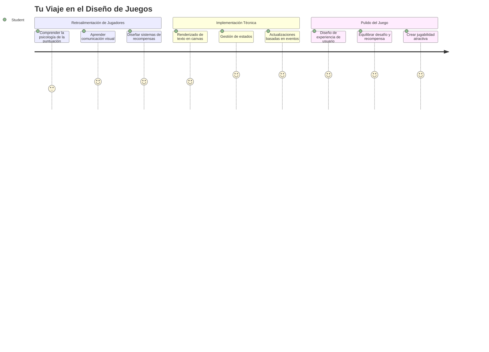
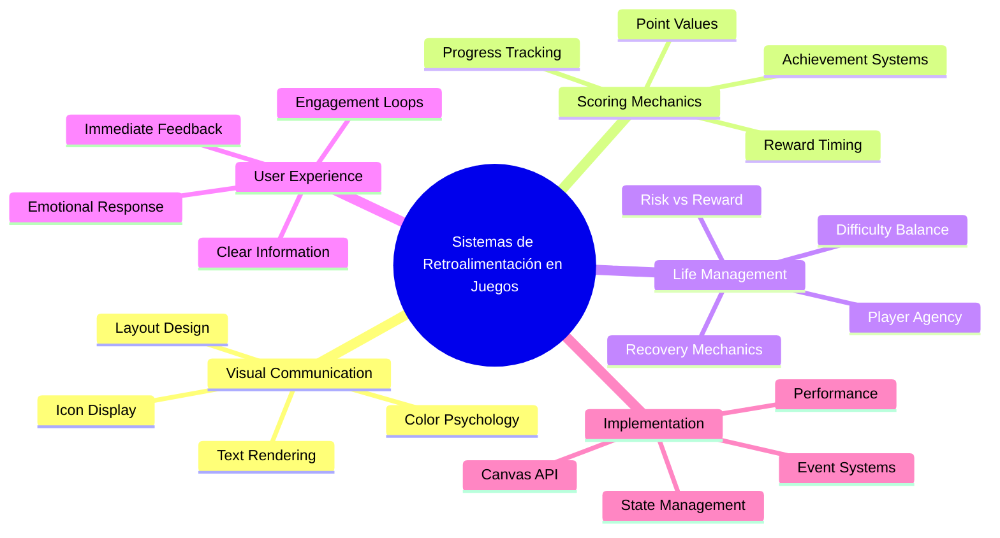
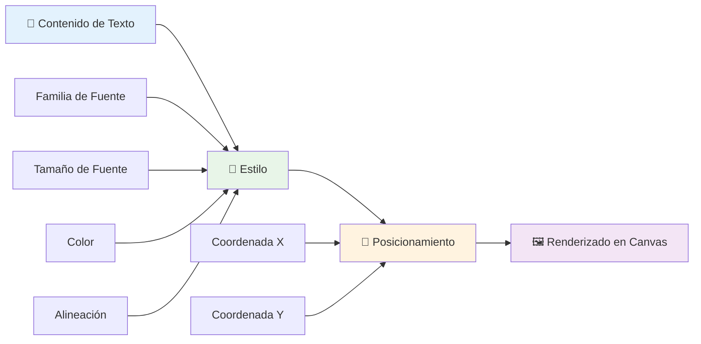
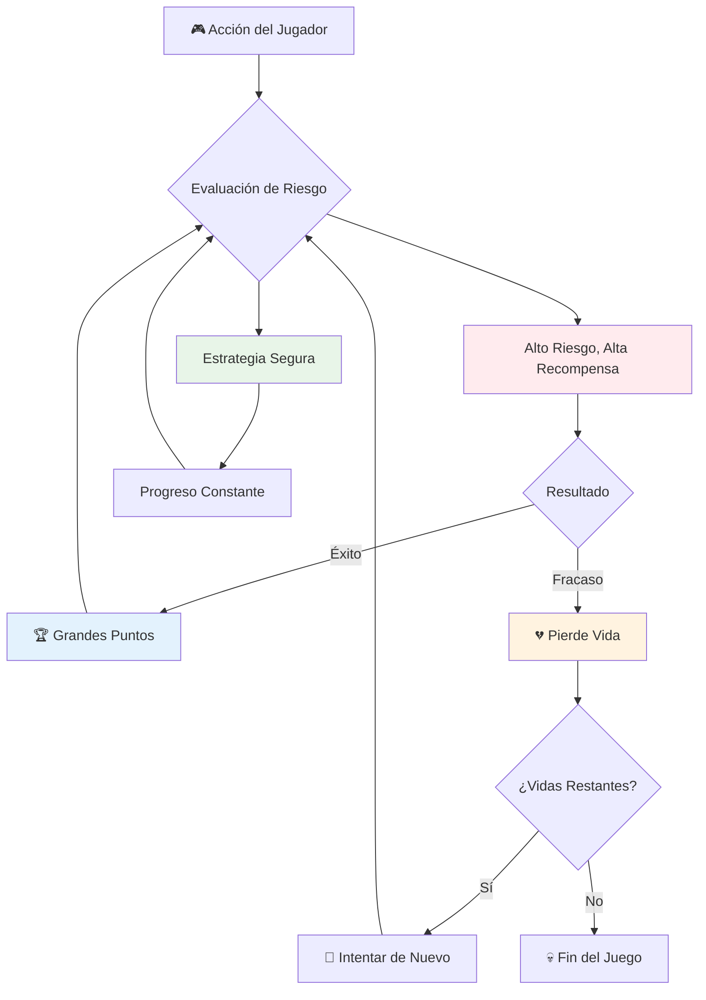
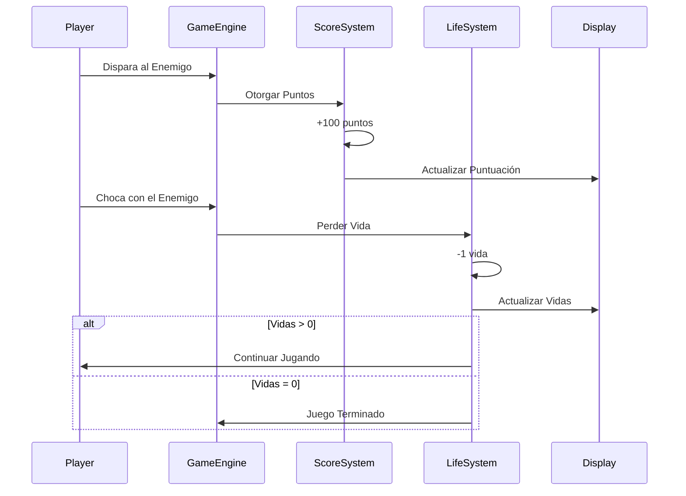
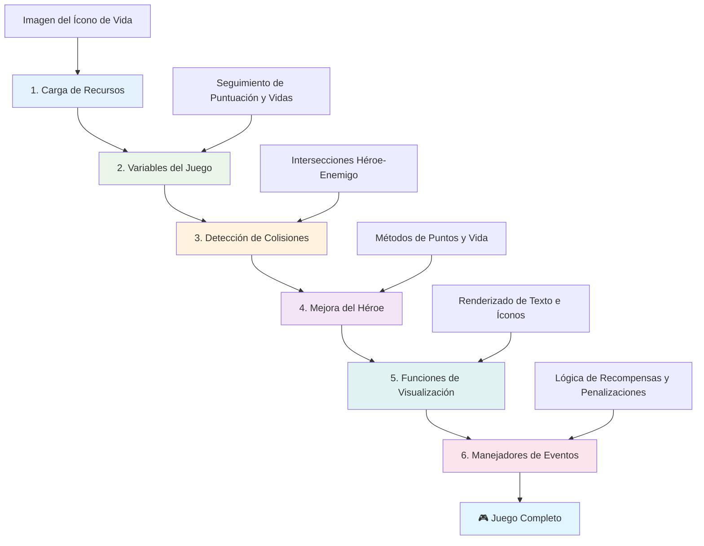
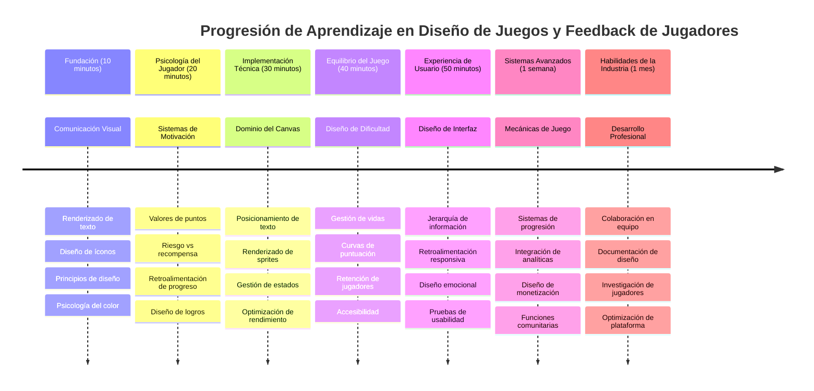

<!--
CO_OP_TRANSLATOR_METADATA:
{
  "original_hash": "2ed9145a16cf576faa2a973dff84d099",
  "translation_date": "2026-01-06T07:31:01+00:00",
  "source_file": "6-space-game/5-keeping-score/README.md",
  "language_code": "es"
}
-->
# Construye un Juego Espacial Parte 5: Puntuación y Vidas


## Cuestionario antes de la clase

[Cuestionario antes de la clase](https://ff-quizzes.netlify.app/web/quiz/37)

¿Listo para que tu juego espacial se sienta como un juego real? Vamos a añadir puntuación y gestión de vidas, las mecánicas fundamentales que transformaron juegos de arcade tempranos como Space Invaders de simples demostraciones a entretenimiento adictivo. Aquí es donde tu juego se vuelve verdaderamente jugable.


## Dibujando texto en pantalla - La voz de tu juego

Para mostrar tu puntuación, necesitamos aprender a renderizar texto en el lienzo. El método `fillText()` es tu herramienta principal para esto, es la misma técnica usada en los juegos clásicos de arcade para mostrar puntuaciones e información de estado.


Tienes control total sobre la apariencia del texto:

```javascript
ctx.font = "30px Arial";
ctx.fillStyle = "red";
ctx.textAlign = "right";
ctx.fillText("show this on the screen", 0, 0);
```

✅ Profundiza en [añadir texto a un canvas](https://developer.mozilla.org/docs/Web/API/Canvas_API/Tutorial/Drawing_text) - ¡podrías sorprenderte de lo creativo que puedes ser con las fuentes y los estilos!

## Vidas - Más que solo un número

En el diseño de juegos, una "vida" representa el margen de error del jugador. Este concepto se remonta a las máquinas de pinball, donde obtendrías múltiples bolas para jugar. En juegos tempranos como Asteroids, las vidas daban permiso a los jugadores para tomar riesgos y aprender de los errores.


La representación visual importa mucho: mostrar íconos de naves en lugar de solo "Vidas: 3" crea un reconocimiento visual inmediato, similar a cómo los gabinetes de arcade tempranos usaban iconografía para comunicarse a través de barreras de idioma.

## Construyendo el sistema de recompensas de tu juego

Ahora implementaremos los sistemas de retroalimentación esenciales que mantienen a los jugadores enganchados:


- **Sistema de puntuación**: Cada nave enemiga destruida otorga 100 puntos (los números redondos son más fáciles de calcular mentalmente para los jugadores). La puntuación se muestra en la esquina inferior izquierda.
- **Contador de vidas**: Tu héroe comienza con tres vidas: un estándar establecido por juegos arcade tempranos para equilibrar el desafío con la jugabilidad. Cada colisión con un enemigo cuesta una vida. Mostraremos las vidas restantes en la esquina inferior derecha usando íconos de nave .

## ¡Vamos a construir!

Primero, configura tu espacio de trabajo. Navega a los archivos en tu subcarpeta `your-work`. Deberías ver estos archivos:

```bash
-| assets
  -| enemyShip.png
  -| player.png
  -| laserRed.png
-| index.html
-| app.js
-| package.json
```

Para probar tu juego, inicia el servidor de desarrollo desde la carpeta `your_work`:

```bash
cd your-work
npm start
```

Esto ejecuta un servidor local en `http://localhost:5000`. Abre esta dirección en tu navegador para ver tu juego. Prueba los controles con las teclas de flecha e intenta disparar a los enemigos para verificar que todo funcione.


### ¡Hora de programar!

1. **Obtén los recursos visuales que necesitarás**. Copia el recurso `life.png` de la carpeta `solution/assets/` a tu carpeta `your-work`. Luego añade lifeImg a tu función window.onload:

    ```javascript
    lifeImg = await loadTexture("assets/life.png");
    ```

1. No olvides agregar `lifeImg` a tu lista de recursos:

    ```javascript
    let heroImg,
    ...
    lifeImg,
    ...
    eventEmitter = new EventEmitter();
    ```
  
2. **Configura tus variables de juego**. Añade código para rastrear tu puntuación total (empezando en 0) y vidas restantes (empezando en 3). Mostraremos estos datos en pantalla para que los jugadores siempre sepan su estado.

3. **Implementa detección de colisiones**. Extiende tu función `updateGameObjects()` para detectar cuando los enemigos colisionan con tu héroe:

    ```javascript
    enemies.forEach(enemy => {
        const heroRect = hero.rectFromGameObject();
        if (intersectRect(heroRect, enemy.rectFromGameObject())) {
          eventEmitter.emit(Messages.COLLISION_ENEMY_HERO, { enemy });
        }
      })
    ```

4. **Añade seguimiento de vidas y puntos a tu Héroe**. 
   1. **Inicializa los contadores**. Debajo de `this.cooldown = 0` en tu clase `Hero`, configura vida y puntos:

        ```javascript
        this.life = 3;
        this.points = 0;
        ```

   1. **Muestra estos valores al jugador**. Crea funciones para dibujar estos valores en pantalla:

        ```javascript
        function drawLife() {
          // POR HACER, 35, 27
          const START_POS = canvas.width - 180;
          for(let i=0; i < hero.life; i++ ) {
            ctx.drawImage(
              lifeImg, 
              START_POS + (45 * (i+1) ), 
              canvas.height - 37);
          }
        }
        
        function drawPoints() {
          ctx.font = "30px Arial";
          ctx.fillStyle = "red";
          ctx.textAlign = "left";
          drawText("Points: " + hero.points, 10, canvas.height-20);
        }
        
        function drawText(message, x, y) {
          ctx.fillText(message, x, y);
        }

        ```

   1. **Conecta todo en tu ciclo de juego**. Añade estas funciones a tu función window.onload justo después de `updateGameObjects()`:

        ```javascript
        drawPoints();
        drawLife();
        ```

### 🔄 **Chequeo pedagógico**
**Comprensión del diseño de juegos**: Antes de implementar consecuencias, asegúrate de entender:
- ✅ Cómo la retroalimentación visual comunica el estado del juego a los jugadores
- ✅ Por qué la colocación consistente de elementos UI mejora la usabilidad
- ✅ La psicología detrás de los valores de puntos y la gestión de vidas
- ✅ Cómo difiere renderizar texto en canvas del texto HTML

**Autoevaluación rápida**: ¿Por qué los juegos arcade típicamente usan números redondos para los valores de puntos?
*Respuesta: Los números redondos son más fáciles de calcular mentalmente para los jugadores y crean recompensas psicológicas satisfactorias*

**Principios de experiencia de usuario**: Ahora aplicas:
- **Jerarquía visual**: Información importante posicionada de forma prominente
- **Retroalimentación inmediata**: Actualizaciones en tiempo real de las acciones del jugador
- **Carga cognitiva**: Presentación sencilla y clara de la información
- **Diseño emocional**: Iconos y colores que crean conexión con el jugador

1. **Implementa consecuencias y recompensas en el juego**. Ahora añadiremos los sistemas de retroalimentación que hacen que las acciones del jugador tengan sentido:

   1. **Las colisiones cuestan vidas**. Cada vez que tu héroe choca con un enemigo, debes perder una vida.
   
      Añade este método a tu clase `Hero`:

        ```javascript
        decrementLife() {
          this.life--;
          if (this.life === 0) {
            this.dead = true;
          }
        }
        ```

   2. **Disparar enemigos otorga puntos**. Cada impacto exitoso otorga 100 puntos, proporcionando retroalimentación positiva inmediata por disparos acertados.

      Extiende tu clase Hero con este método de incremento:
    
        ```javascript
          incrementPoints() {
            this.points += 100;
          }
        ```

        Ahora conecta estas funciones a tus eventos de colisión:

        ```javascript
        eventEmitter.on(Messages.COLLISION_ENEMY_LASER, (_, { first, second }) => {
           first.dead = true;
           second.dead = true;
           hero.incrementPoints();
        })

        eventEmitter.on(Messages.COLLISION_ENEMY_HERO, (_, { enemy }) => {
           enemy.dead = true;
           hero.decrementLife();
        });
        ```

✅ ¿Tienes curiosidad por otros juegos hechos con JavaScript y Canvas? Investiga un poco: ¡podrías sorprenderte de lo que es posible!

Después de implementar estas funciones, prueba tu juego para ver el sistema completo de retroalimentación en acción. Deberías ver íconos de vida en la esquina inferior derecha, tu puntuación en la esquina inferior izquierda, y observar cómo las colisiones reducen vidas mientras los disparos exitosos aumentan la puntuación.

Tu juego ahora tiene las mecánicas esenciales que hicieron que los juegos arcade tempranos fueran tan atractivos: objetivos claros, retroalimentación inmediata y consecuencias significativas para las acciones del jugador.

### 🔄 **Chequeo pedagógico**
**Sistema completo de diseño de juegos**: Verifica tu dominio de los sistemas de retroalimentación al jugador:
- ✅ ¿Cómo crean las mecánicas de puntuación motivación y compromiso en el jugador?
- ✅ ¿Por qué es importante la consistencia visual para el diseño de interfaz?
- ✅ ¿Cómo equilibra el sistema de vidas el desafío con la retención del jugador?
- ✅ ¿Qué papel juega la retroalimentación inmediata para crear una experiencia de juego satisfactoria?

**Integración del sistema**: Tu sistema de retroalimentación demuestra:
- **Diseño de experiencia de usuario**: Comunicación visual clara y jerarquía de información
- **Arquitectura orientada a eventos**: Actualizaciones responsivas a acciones del jugador
- **Gestión de estado**: Seguimiento y muestra de datos dinámicos del juego
- **Dominio del canvas**: Renderizado de texto y posicionamiento de sprites
- **Psicología del juego**: Entendimiento de la motivación y el compromiso del jugador

**Patrones profesionales**: Has implementado:
- **Arquitectura MVC**: Separación de lógica del juego, datos y presentación
- **Patrón Observer**: Actualizaciones basadas en eventos para cambios de estado del juego
- **Diseño de componentes**: Funciones reutilizables para renderizado y lógica
- **Optimización del rendimiento**: Renderizado eficiente en ciclos de juego

### ⚡ **Qué puedes hacer en los próximos 5 minutos**
- [ ] Experimenta con diferentes tamaños y colores de fuente para mostrar la puntuación
- [ ] Prueba cambiando los valores de los puntos y observa cómo afecta la sensación del juego
- [ ] Añade declaraciones console.log para rastrear cuándo cambian puntos y vidas
- [ ] Prueba casos límite como quedarte sin vidas o lograr puntuaciones altas

### 🎯 **Qué puedes lograr en esta hora**
- [ ] Completa el cuestionario post-lección y entiende la psicología del diseño de juegos
- [ ] Añade efectos de sonido para puntuar y perder vidas
- [ ] Implementa un sistema de puntuación alta usando localStorage
- [ ] Crea diferentes valores de puntos para distintos tipos de enemigos
- [ ] Añade efectos visuales como sacudidas de pantalla al perder una vida

### 📅 **Tu viaje de diseño de juegos de una semana**
- [ ] Completa el juego espacial con sistemas de retroalimentación pulidos
- [ ] Implementa mecánicas avanzadas de puntuación como multiplicadores de combo
- [ ] Añade logros y contenido desbloqueable
- [ ] Crea sistemas de progresión y balance de dificultad
- [ ] Diseña interfaces de usuario para menús y pantallas de fin de juego
- [ ] Estudia otros juegos para entender mecanismos de compromiso

### 🌟 **Tu dominio en desarrollo de juegos en un mes**
- [ ] Construye juegos completos con sistemas sofisticados de progresión
- [ ] Aprende analítica de juegos y medición del comportamiento del jugador
- [ ] Contribuye a proyectos de desarrollo de juegos open source
- [ ] Domina patrones avanzados de diseño de juegos y monetización
- [ ] Crea contenido educativo sobre diseño de juegos y experiencia de usuario
- [ ] Construye un portafolio demostrando habilidades en diseño y desarrollo de juegos

## 🎯 Tu línea de tiempo para dominar el diseño de juegos


### 🛠️ Resumen de tu kit de herramientas para diseño de juegos

Después de completar esta lección, ahora dominas:
- **Psicología del jugador**: Entender motivación, riesgo/recompensa y ciclos de compromiso
- **Comunicación visual**: Diseño eficiente de UI usando texto, iconos y layout
- **Sistemas de retroalimentación**: Respuestas en tiempo real a acciones y eventos del juego
- **Gestión de estado**: Seguimiento y muestra eficiente de datos dinámicos del juego
- **Renderizado de texto en canvas**: Visualización profesional con estilo y posicionamiento
- **Integración de eventos**: Conectar acciones del usuario con consecuencias significativas
- **Balance del juego**: Diseñar curvas de dificultad y sistemas de progresión del jugador

**Aplicaciones en el mundo real**: Tus habilidades en diseño de juegos aplican directamente a:
- **Diseño de interfaces de usuario**: Crear interfaces intuitivas y atractivas
- **Desarrollo de productos**: Entender motivación del usuario y ciclos de retroalimentación
- **Tecnología educativa**: Gamificación y sistemas de compromiso en aprendizaje
- **Visualización de datos**: Hacer información compleja accesible y atractiva
- **Desarrollo de apps móviles**: Mecánicas de retención y diseño de experiencia de usuario
- **Tecnología de marketing**: Entender comportamiento de usuario y optimización de conversiones

**Habilidades profesionales adquiridas**: Ahora puedes:
- **Diseñar** experiencias de usuario que motivan y comprometen
- **Implementar** sistemas de retroalimentación que guían el comportamiento de usuario
- **Balancear** desafío y accesibilidad en sistemas interactivos
- **Crear** comunicación visual efectiva para diversos grupos de usuarios
- **Analizar** comportamiento de usuarios e iterar en mejoras de diseño

**Conceptos de desarrollo de juegos dominados**:
- **Motivación del jugador**: Entender qué impulsa el compromiso y la retención
- **Diseño visual**: Crear interfaces claras, atractivas y funcionales
- **Integración de sistemas**: Conectar múltiples sistemas para una experiencia cohesiva
- **Optimización de rendimiento**: Renderizado eficiente y gestión de estado
- **Accesibilidad**: Diseñar para diferentes niveles de habilidad y necesidades del jugador

**Próximo nivel**: ¡Estás listo para explorar patrones avanzados de diseño de juegos, implementar sistemas de analítica o estudiar monetización y estrategias de retención del jugador!

🌟 **Logro desbloqueado**: ¡Has construido un sistema completo de retroalimentación al jugador con principios profesionales de diseño de juegos!

---

## Desafío del Agente GitHub Copilot 🚀

Usa el modo Agente para completar el siguiente desafío:

**Descripción:** Mejora el sistema de puntuación del juego espacial implementando una función de puntuación alta con almacenamiento persistente y mecánicas de puntuación de bonificación.

**Solicitud:** Crea un sistema de puntuación alta que guarde la mejor puntuación del jugador en localStorage. Añade puntos bonus por matanzas consecutivas de enemigos (sistema de combos) e implementa diferentes valores de puntos para distintos tipos de enemigos. Incluye un indicador visual cuando el jugador logra una nueva puntuación alta y muestra la puntuación alta actual en la pantalla del juego.

## 🚀 Desafío

Ahora tienes un juego funcional con puntuación y vidas. Considera qué características adicionales podrían mejorar la experiencia del jugador.

## Cuestionario posterior a la clase

[Cuestionario posterior a la clase](https://ff-quizzes.netlify.app/web/quiz/38)

## Repaso y estudio autodidacta

¿Quieres explorar más? Investiga diferentes enfoques para sistemas de puntuación y vidas en juegos. Existen motores de juego fascinantes como [PlayFab](https://playfab.com) que manejan puntuaciones, tablas de líderes y progresión del jugador. ¿Cómo podría integrar algo así llevar tu juego al siguiente nivel?

## Asignación

[Construye un juego de puntuación](assignment.md)

---

<!-- CO-OP TRANSLATOR DISCLAIMER START -->
**Aviso Legal**:  
Este documento ha sido traducido utilizando el servicio de traducción automática [Co-op Translator](https://github.com/Azure/co-op-translator). Aunque nos esforzamos por la precisión, tenga en cuenta que las traducciones automáticas pueden contener errores o inexactitudes. El documento original en su idioma nativo debe considerarse la fuente autorizada. Para información crítica, se recomienda una traducción profesional realizada por humanos. No nos hacemos responsables de ningún malentendido o mala interpretación derivada del uso de esta traducción.
<!-- CO-OP TRANSLATOR DISCLAIMER END -->