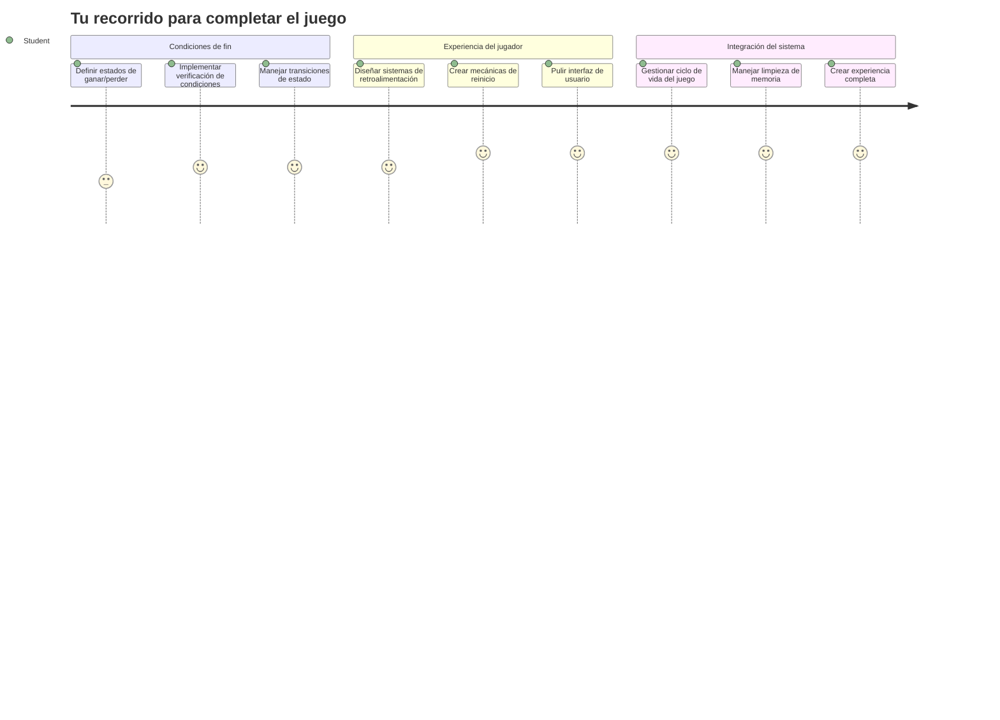
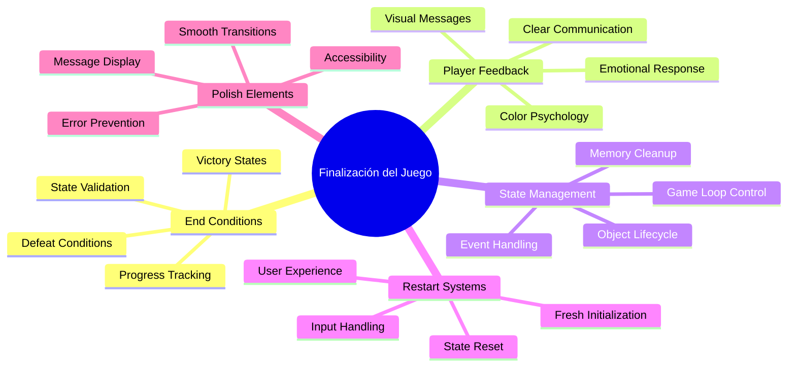
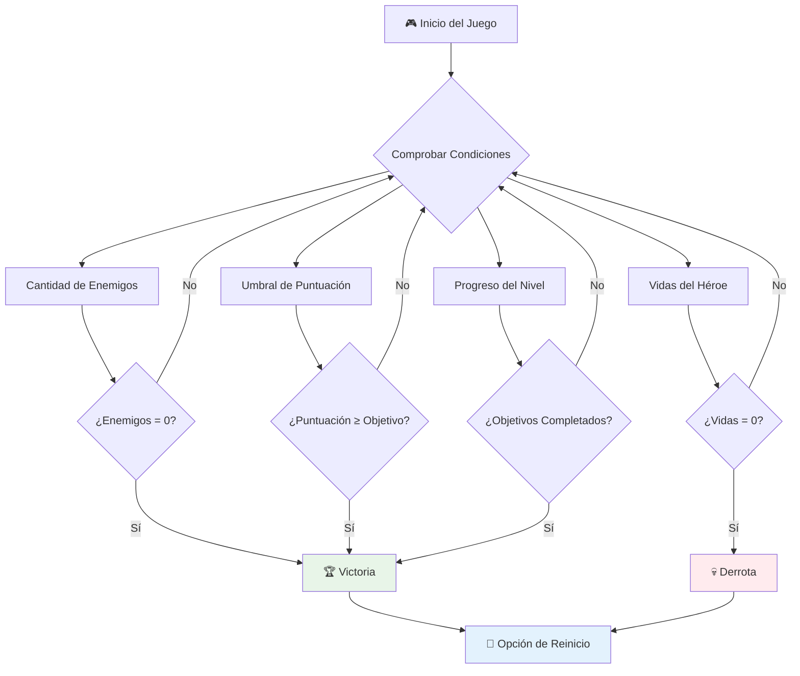
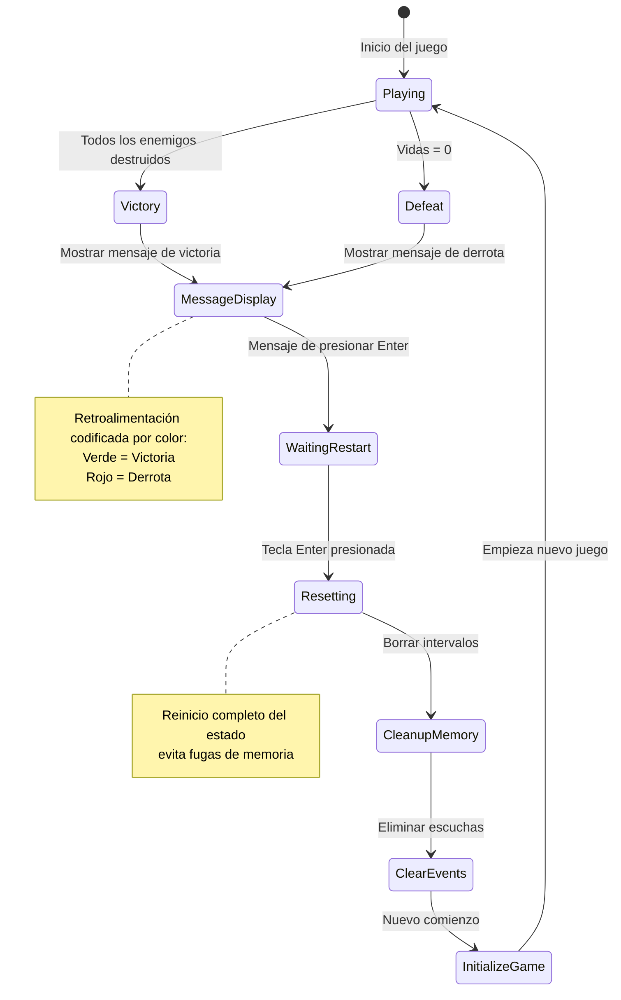
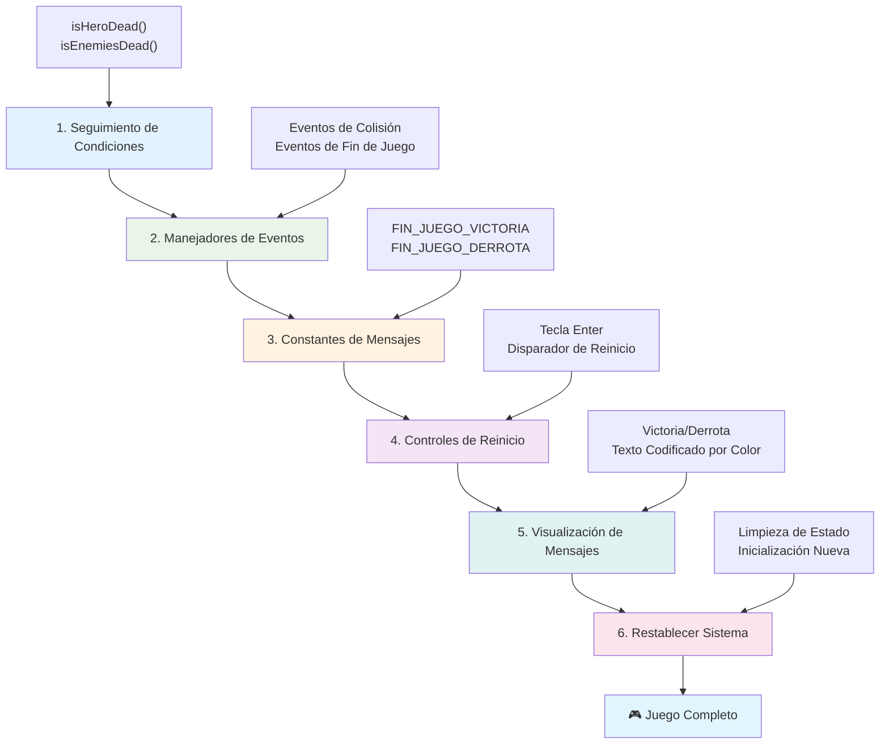
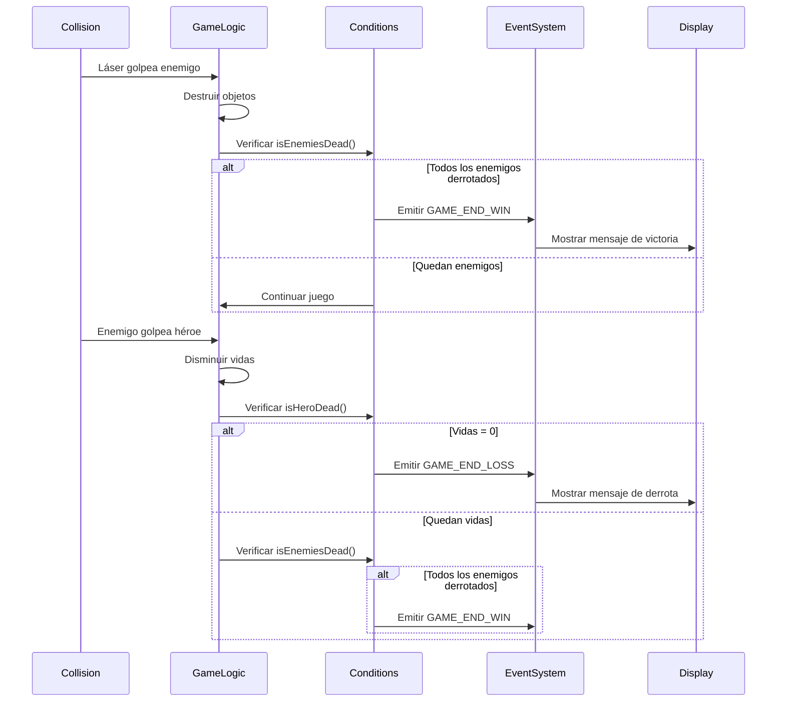
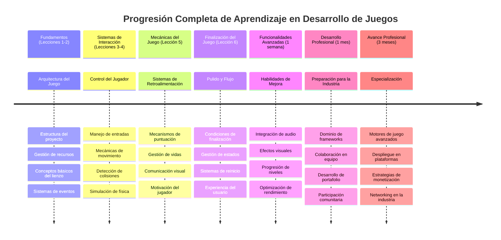

# Construye un Juego Espacial Parte 6: Final y Reinicio


Todo gran juego necesita condiciones claras de finalización y un mecanismo de reinicio fluido. Has creado un impresionante juego espacial con movimiento, combate y puntuación; ahora es momento de añadir las piezas finales que lo hagan sentirse completo.

Tu juego actualmente se ejecuta indefinidamente, como las sondas Voyager que NASA lanzó en 1977, que aún viajan por el espacio décadas después. Aunque eso está bien para la exploración espacial, los juegos necesitan puntos finales definidos para crear experiencias satisfactorias.

Hoy implementaremos condiciones propias de victoria/derrota y un sistema de reinicio. Al final de esta lección, tendrás un juego pulido que los jugadores pueden completar y volver a jugar, como los juegos clásicos de arcade que definieron el medio.


## Cuestionario Previo a la Lección

[Cuestionario previo a la lección](https://ff-quizzes.netlify.app/web/quiz/39)

## Entendiendo las Condiciones de Fin del Juego

¿Cuándo debe terminar tu juego? Esta pregunta fundamental ha moldeado el diseño de juegos desde la era temprana de los arcade. Pac-Man termina cuando te atrapan los fantasmas o limpias todos los puntos, mientras que Space Invaders termina cuando los alienígenas llegan al fondo o los destruyes todos.

Como creador del juego, defines las condiciones de victoria y derrota. Para nuestro juego espacial, estas son algunas aproximaciones comprobadas que crean jugabilidad atractiva:


- **Se han destruido `N` naves enemigas**: Es bastante común que, si divides un juego en diferentes niveles, necesites destruir `N` naves enemigas para completar un nivel
- **Tu nave ha sido destruida**: Definitivamente hay juegos donde pierdes si tu nave es destruida. Otro enfoque común es tener el concepto de vidas. Cada vez que tu nave es destruida, pierdes una vida. Una vez que pierdes todas las vidas, entonces pierdes el juego.
- **Has acumulado `N` puntos**: Otra condición común de fin es acumular puntos. Cómo se obtienen los puntos depende de ti, pero es bastante común asignar puntos a diversas actividades como destruir una nave enemiga o tal vez recoger ítems que *caen* cuando se destruyen enemigos.
- **Completar un nivel**: Esto puede involucrar varias condiciones como `X` naves enemigas destruidas, `Y` puntos recogidos o tal vez que se haya recogido un ítem específico.

## Implementando Funcionalidad de Reinicio del Juego

Los buenos juegos fomentan la rejugabilidad mediante mecanismos de reinicio fluidos. Cuando los jugadores completan un juego (o son derrotados), muchas veces quieren intentarlo de nuevo inmediatamente, ya sea para superar su puntuación o mejorar su rendimiento.


Tetris ejemplifica esto perfectamente: cuando tus bloques alcanzan la parte superior, puedes comenzar un nuevo juego instantáneamente sin navegar menús complicados. Construiremos un sistema de reinicio similar que limpie el estado del juego y ponga a los jugadores en acción rápidamente.

✅ **Reflexión**: Piensa en los juegos que has jugado. ¿En qué condiciones terminan, y cómo te solicitan reiniciar? ¿Qué hace que la experiencia de reinicio sea fluida en lugar de frustrante?

## Qué Vas a Construir

Implementarás las características finales que transforman tu proyecto en una experiencia de juego completa. Estos elementos distinguen a los juegos pulidos de los prototipos básicos.

**Esto es lo que añadiremos hoy:**

1. **Condición de victoria**: Destruye a todos los enemigos y gana una celebración adecuada (¡te la mereces!)
2. **Condición de derrota**: Pierde todas las vidas y enfrenta la realidad con una pantalla de derrota
3. **Mecanismo de reinicio**: Pulsa Enter para volver a empezar - porque un juego nunca es suficiente
4. **Gestión del estado**: Todo limpio cada vez - sin enemigos sobrantes ni fallos extraños del juego anterior

## Comenzando

Prepara tu entorno de desarrollo. Debes tener todos los archivos de tu juego espacial de las lecciones anteriores listos.

**Tu proyecto debería verse más o menos así:**

```bash
-| assets
  -| enemyShip.png
  -| player.png
  -| laserRed.png
  -| life.png
-| index.html
-| app.js
-| package.json
```

**Inicia tu servidor de desarrollo:**

```bash
cd your-work
npm start
```

**Este comando:**
- Ejecuta un servidor local en `http://localhost:5000`
- Sirve tus archivos correctamente
- Se refresca automáticamente al hacer cambios

Abre `http://localhost:5000` en tu navegador y verifica que tu juego está corriendo. Debes poder mover, disparar e interactuar con enemigos. Una vez confirmado, podemos proceder con la implementación.

> 💡 **Consejo profesional**: Para evitar advertencias en Visual Studio Code, declara `gameLoopId` al inicio de tu archivo como `let gameLoopId;` en lugar de declararlo dentro de la función `window.onload`. Esto sigue las mejores prácticas modernas para la declaración de variables en JavaScript.


## Pasos para la Implementación

### Paso 1: Crear Funciones para Rastrear Condiciones de Fin

Necesitamos funciones que monitoreen cuándo debe terminar el juego. Como sensores en la Estación Espacial Internacional que monitorean continuamente sistemas críticos, estas funciones verificarán constantemente el estado del juego.

```javascript
function isHeroDead() {
  return hero.life <= 0;
}

function isEnemiesDead() {
  const enemies = gameObjects.filter((go) => go.type === "Enemy" && !go.dead);
  return enemies.length === 0;
}
```

**Esto es lo que sucede bajo el capó:**
- **Verifica** si nuestro héroe se quedó sin vidas (¡au!)
- **Cuenta** cuántos enemigos siguen vivos y activos
- **Devuelve** `true` cuando el campo de batalla está libre de enemigos
- **Usa** lógica simple de verdadero/falso para mantener claridad
- **Filtra** todos los objetos del juego para encontrar a los sobrevivientes

### Paso 2: Actualizar los Manejadores de Eventos para las Condiciones de Fin

Ahora conectaremos estas verificaciones de condiciones al sistema de eventos del juego. Cada vez que ocurre una colisión, el juego evaluará si esto activa una condición de fin. Esto crea una retroalimentación inmediata para eventos críticos del juego.


```javascript
eventEmitter.on(Messages.COLLISION_ENEMY_LASER, (_, { first, second }) => {
    first.dead = true;
    second.dead = true;
    hero.incrementPoints();

    if (isEnemiesDead()) {
      eventEmitter.emit(Messages.GAME_END_WIN);
    }
});

eventEmitter.on(Messages.COLLISION_ENEMY_HERO, (_, { enemy }) => {
    enemy.dead = true;
    hero.decrementLife();
    if (isHeroDead())  {
      eventEmitter.emit(Messages.GAME_END_LOSS);
      return; // pérdida antes de la victoria
    }
    if (isEnemiesDead()) {
      eventEmitter.emit(Messages.GAME_END_WIN);
    }
});

eventEmitter.on(Messages.GAME_END_WIN, () => {
    endGame(true);
});
  
eventEmitter.on(Messages.GAME_END_LOSS, () => {
  endGame(false);
});
```

**Lo que ocurre aquí:**
- **El láser impacta enemigo**: Ambos desaparecen, obtienes puntos y verificamos si ganaste
- **El enemigo te impacta**: Pierdes una vida y verificamos si sigues con vida
- **Orden inteligente**: Revisamos derrota primero (¡nadie quiere ganar y perder a la vez!)
- **Reacciones instantáneas**: Tan pronto sucede algo importante, el juego lo sabe

### Paso 3: Agregar Nuevas Constantes de Mensajes

Deberás agregar nuevos tipos de mensajes a tu objeto constante `Messages`. Estas constantes ayudan a mantener la consistencia y prevenir errores tipográficos en tu sistema de eventos.

```javascript
GAME_END_LOSS: "GAME_END_LOSS",
GAME_END_WIN: "GAME_END_WIN",
```

**En lo anterior hemos:**
- **Agregado** constantes para eventos de fin de juego para mantener consistencia
- **Usado** nombres descriptivos que indican claramente el propósito del evento
- **Seguido** la convención de nombres existente para los tipos de mensaje

### Paso 4: Implementar Controles de Reinicio

Ahora agregarás controles de teclado que permitan a los jugadores reiniciar el juego. La tecla Enter es una elección natural, ya que comúnmente se asocia con confirmar acciones y comenzar nuevos juegos.

**Agrega la detección de la tecla Enter a tu evento `keydown` existente:**

```javascript
else if(evt.key === "Enter") {
   eventEmitter.emit(Messages.KEY_EVENT_ENTER);
}
```

**Agrega la nueva constante de mensaje:**

```javascript
KEY_EVENT_ENTER: "KEY_EVENT_ENTER",
```

**Lo que necesitas saber:**
- **Extiende** tu sistema existente de manejo de eventos de teclado
- **Usa** la tecla Enter como disparador para reiniciar para una experiencia intuitiva
- **Emite** un evento personalizado que otras partes del juego pueden escuchar
- **Mantiene** el mismo patrón que otros controles de teclado

### Paso 5: Crear el Sistema de Visualización de Mensajes

Tu juego necesita comunicar resultados claramente a los jugadores. Crearemos un sistema que muestre estados de victoria y derrota usando texto codificado por color, similar a las interfaces de terminal de sistemas informáticos antiguos donde el verde indicaba éxito y el rojo señalaba errores.

**Crea la función `displayMessage()`:**

```javascript
function displayMessage(message, color = "red") {
  ctx.font = "30px Arial";
  ctx.fillStyle = color;
  ctx.textAlign = "center";
  ctx.fillText(message, canvas.width / 2, canvas.height / 2);
}
```

**Paso a paso, esto es lo que sucede:**
- **Establece** tamaño y tipo de fuente para un texto claro y legible
- **Aplica** un parámetro de color con "rojo" como valor por defecto para advertencias
- **Centra** el texto horizontal y verticalmente en el canvas
- **Usa** parámetros predeterminados de JavaScript moderno para opciones flexibles de color
- **Aprovecha** el contexto 2D del canvas para renderizado directo de texto

**Crea la función `endGame()`:**

```javascript
function endGame(win) {
  clearInterval(gameLoopId);

  // Establecer un retardo para asegurar que se completen todos los renderizados pendientes
  setTimeout(() => {
    ctx.clearRect(0, 0, canvas.width, canvas.height);
    ctx.fillStyle = "black";
    ctx.fillRect(0, 0, canvas.width, canvas.height);
    if (win) {
      displayMessage(
        "Victory!!! Pew Pew... - Press [Enter] to start a new game Captain Pew Pew",
        "green"
      );
    } else {
      displayMessage(
        "You died !!! Press [Enter] to start a new game Captain Pew Pew"
      );
    }
  }, 200)  
}
```

**Lo que hace esta función:**
- **Congela** todo en su lugar - no más naves ni láseres en movimiento
- **Pausa** un momento pequeño (200ms) para dejar terminar de dibujarse el último fotograma
- **Limpia** la pantalla y la pinta de negro para un efecto dramático
- **Muestra** mensajes distintos para ganadores y perdedores
- **Colorea** las noticias - verde para bueno, rojo para... no tan bueno
- **Indica** exactamente cómo reiniciar el juego

### 🔄 **Chequeo Pedagógico**
**Gestión del Estado del Juego**: Antes de implementar la función de reinicio, asegúrate de entender:
- ✅ Cómo las condiciones de fin crean objetivos claros en la jugabilidad
- ✅ Por qué la retroalimentación visual es esencial para la comprensión del jugador
- ✅ La importancia de limpiar correctamente para evitar pérdidas de memoria
- ✅ Cómo la arquitectura basada en eventos permite transiciones limpias del estado

**Autoevaluación Rápida**: ¿Qué pasaría si no eliminaras los event listeners durante el reinicio?
*Respuesta: Pérdidas de memoria y manejadores de eventos duplicados causando comportamientos impredecibles*

**Principios de Diseño de Juegos**: Ahora estás implementando:
- **Objetivos Claros**: Los jugadores saben exactamente qué define el éxito y el fracaso
- **Retroalimentación Inmediata**: Los cambios de estado del juego se comunican al instante
- **Control del Usuario**: Los jugadores pueden reiniciar cuando quieran
- **Confiabilidad del Sistema**: La limpieza adecuada previene bugs y problemas de rendimiento

### Paso 6: Implementar la Función de Reinicio del Juego

El sistema de reinicio debe limpiar completamente el estado actual del juego e inicializar una nueva sesión para que los jugadores tengan un nuevo comienzo sin datos sobrantes del juego anterior.

**Crea la función `resetGame()`:**

```javascript
function resetGame() {
  if (gameLoopId) {
    clearInterval(gameLoopId);
    eventEmitter.clear();
    initGame();
    gameLoopId = setInterval(() => {
      ctx.clearRect(0, 0, canvas.width, canvas.height);
      ctx.fillStyle = "black";
      ctx.fillRect(0, 0, canvas.width, canvas.height);
      drawPoints();
      drawLife();
      updateGameObjects();
      drawGameObjects(ctx);
    }, 100);
  }
}
```

**Entendamos cada parte:**
- **Verifica** si hay un game loop corriendo antes de reiniciar
- **Limpia** el game loop actual para detener toda la actividad en curso
- **Elimina** todos los event listeners para prevenir pérdidas de memoria
- **Reinicializa** el estado del juego con objetos y variables frescas
- **Inicia** un nuevo loop de juego con todas las funciones esenciales
- **Mantiene** el mismo intervalo de 100ms para rendimiento consistente

**Agrega el manejador de tecla Enter a tu función `initGame()`:**

```javascript
eventEmitter.on(Messages.KEY_EVENT_ENTER, () => {
  resetGame();
});
```

**Agrega el método `clear()` a tu clase EventEmitter:**

```javascript
clear() {
  this.listeners = {};
}
```

**Puntos clave a recordar:**
- **Conecta** la pulsación de Enter con la función de reinicio del juego
- **Registra** este listener durante la inicialización del juego
- **Proporciona** una forma limpia de eliminar todos los event listeners al reiniciar
- **Previene** pérdidas de memoria limpiando los manejadores entre juegos
- **Resetea** el objeto de listeners a un estado vacío para nueva inicialización

## ¡Felicidades! 🎉

👽 💥 🚀 Has construido con éxito un juego completo desde cero. Como los programadores que crearon los primeros videojuegos en los años 70, has transformado líneas de código en una experiencia interactiva con mecánicas de juego adecuadas y retroalimentación para el usuario. 🚀 💥 👽

**Has logrado:**
- **Implementar** condiciones completas de victoria y derrota con retroalimentación al usuario
- **Crear** un sistema de reinicio fluido para juego continuo
- **Diseñar** comunicación visual clara para los estados del juego
- **Gestionar** transiciones y limpieza de estados complejos
- **Ensamblar** todos los componentes en un juego jugable y cohesivo

### 🔄 **Chequeo Pedagógico**
**Sistema Completo de Desarrollo de Juegos**: Celebra tu maestría del ciclo completo de desarrollo:
- ✅ ¿Cómo crean las condiciones de fin experiencias satisfactorias para jugadores?
- ✅ ¿Por qué la gestión adecuada del estado es crítica para la estabilidad del juego?
- ✅ ¿Cómo mejora la retroalimentación visual la comprensión del jugador?
- ✅ ¿Qué papel juega el sistema de reinicio en la retención del jugador?

**Dominio del Sistema**: Tu juego completo demuestra:
- **Desarrollo Full-Stack de Juegos**: Desde gráficos, entradas hasta gestión de estado
- **Arquitectura Profesional**: Sistemas basados en eventos con limpieza adecuada
- **Diseño de Experiencia de Usuario**: Retroalimentación clara y controles intuitivos
- **Optimización de Rendimiento**: Renderizado eficiente y gestión de memoria
- **Cuidado y Compleción**: Todos los detalles que hacen que un juego se sienta terminado

**Habilidades Preparadas para la Industria**: Has implementado:
- **Arquitectura del Game Loop**: Sistemas en tiempo real con rendimiento constante
- **Programación Basada en Eventos**: Sistemas desacoplados que escalan efectivamente
- **Gestión del Estado**: Manejo complejo de datos y ciclo de vida
- **Diseño de Interfaz de Usuario**: Comunicación clara y controles responsivos
- **Testeo y Depuración**: Desarrollo iterativo y resolución de problemas

### ⚡ **Lo que puedes hacer en los próximos 5 minutos**
- [ ] Juega tu juego completo y prueba todas las condiciones de victoria y derrota
- [ ] Experimenta con diferentes parámetros de condiciones de fin
- [ ] Intenta agregar instrucciones `console.log` para rastrear cambios de estado
- [ ] Comparte tu juego con amigos y recoge comentarios

### 🎯 **Lo que puedes lograr en esta hora**
- [ ] Completar el cuestionario posterior a la lección y reflexionar sobre tu viaje de desarrollo
- [ ] Añadir efectos de audio para estados de victoria y derrota
- [ ] Implementar condiciones adicionales de fin como límites de tiempo u objetivos extra
- [ ] Crear diferentes niveles de dificultad con cantidades variables de enemigos
- [ ] Pulir la presentación visual con mejores fuentes y colores

### 📅 **Tu Dominio del Desarrollo de Juegos en Una Semana**
- [ ] Completar el juego espacial mejorado con múltiples niveles y progresión
- [ ] Añadir funciones avanzadas como potenciadores, diferentes tipos de enemigos y armas especiales
- [ ] Crear un sistema de puntuación alta con almacenamiento persistente
- [ ] Diseñar interfaces de usuario para menús, configuraciones y opciones de juego
- [ ] Optimizar el rendimiento para diferentes dispositivos y navegadores
- [ ] Desplegar tu juego en línea y compartirlo con la comunidad
### 🌟 **Tu Carrera en Desarrollo de Juegos de un Mes**
- [ ] Construye múltiples juegos completos explorando diferentes géneros y mecánicas
- [ ] Aprende frameworks avanzados de desarrollo de juegos como Phaser o Three.js
- [ ] Contribuye a proyectos de desarrollo de juegos de código abierto
- [ ] Estudia principios de diseño de juegos y psicología del jugador
- [ ] Crea un portafolio mostrando tus habilidades en desarrollo de juegos
- [ ] Conéctate con la comunidad de desarrollo de juegos y continúa aprendiendo

## 🎯 Tu Cronograma Completo de Maestría en Desarrollo de Juegos


### 🛠️ Resumen de tu Kit Completo de Herramientas para Desarrollo de Juegos

Después de completar toda esta serie de juegos espaciales, ahora has dominado:
- **Arquitectura de Juegos**: Sistemas orientados a eventos, bucles de juegos y gestión de estados
- **Programación Gráfica**: API de Canvas, renderizado de sprites y efectos visuales
- **Sistemas de Entrada**: Manejo de teclado, detección de colisiones y controles responsivos
- **Diseño de Juegos**: Retroalimentación al jugador, sistemas de progresión y mecánicas de compromiso
- **Optimización de Rendimiento**: Renderizado eficiente, gestión de memoria y control de tasa de cuadros
- **Experiencia de Usuario**: Comunicación clara, controles intuitivos y detalles de pulido
- **Patrones Profesionales**: Código limpio, técnicas de depuración y organización de proyectos

**Aplicaciones en el Mundo Real**: Tus habilidades en desarrollo de juegos se aplican directamente a:
- **Aplicaciones Web Interactivas**: Interfaces dinámicas y sistemas en tiempo real
- **Visualización de Datos**: Gráficos animados y gráficos interactivos
- **Tecnología Educativa**: Gamificación y experiencias de aprendizaje atractivas
- **Desarrollo Móvil**: Interacciones táctiles y optimización de rendimiento
- **Software de Simulación**: Motores físicos y modelado en tiempo real
- **Industrias Creativas**: Arte interactivo, entretenimiento y experiencias digitales

**Habilidades Profesionales Adquiridas**: Ahora puedes:
- **Arquitectar** sistemas interactivos complejos desde cero
- **Depurar** aplicaciones en tiempo real usando métodos sistemáticos
- **Optimizar** el rendimiento para experiencias de usuario fluidas
- **Diseñar** interfaces de usuario atractivas y patrones de interacción
- **Colaborar** eficazmente en proyectos técnicos con adecuada organización del código

**Conceptos de Desarrollo de Juegos Dominados**:
- **Sistemas en Tiempo Real**: Bucles de juego, gestión de tasa de cuadros y rendimiento
- **Arquitectura Orientada a Eventos**: Sistemas desacoplados y paso de mensajes
- **Gestión de Estado**: Manejo complejo de datos y administración del ciclo de vida
- **Programación de Interfaces de Usuario**: Gráficos en Canvas y diseño responsivo
- **Teoría del Diseño de Juegos**: Psicología del jugador y mecánicas de compromiso

**Siguiente Nivel**: ¡Estás listo para explorar frameworks avanzados de juegos, gráficos 3D, sistemas multijugador o para transicionar a roles profesionales en desarrollo de juegos!

🌟 **Logro Desbloqueado**: ¡Has completado un viaje completo en desarrollo de juegos y construido una experiencia interactiva de calidad profesional desde cero!

**¡Bienvenido a la comunidad de desarrollo de juegos!** 🎮✨

## Desafío del Agente GitHub Copilot 🚀

Usa el modo Agente para completar el siguiente desafío:

**Descripción:** Mejora el juego espacial implementando un sistema de progresión de niveles con dificultad creciente y funciones bonus.

**Instrucción:** Crea un sistema de juego espacial con múltiples niveles donde cada nivel tenga más naves enemigas con mayor velocidad y salud. Añade un multiplicador de puntuación que aumente con cada nivel, e implementa potenciadores (como disparo rápido o escudo) que aparezcan aleatoriamente cuando se destruyen enemigos. Incluye un bonus de finalización de nivel y muestra el nivel actual en pantalla junto con la puntuación y vidas existentes.

Aprende más sobre el [modo agente](https://code.visualstudio.com/blogs/2025/02/24/introducing-copilot-agent-mode) aquí.

## 🚀 Desafío Opcional de Mejora

**Añade Audio a tu Juego**: ¡Mejora tu experiencia de juego implementando efectos de sonido! Considera añadir audio para:

- **Disparos láser** cuando el jugador dispare
- **Destrucción de enemigos** cuando las naves sean impactadas
- **Daño al héroe** cuando el jugador reciba golpes
- **Música de victoria** cuando se gane el juego
- **Sonido de derrota** cuando se pierda el juego

**Ejemplo de implementación de audio:**

```javascript
// Crear objetos de audio
const laserSound = new Audio('assets/laser.wav');
const explosionSound = new Audio('assets/explosion.wav');

// Reproducir sonidos durante eventos del juego
function playLaserSound() {
  laserSound.currentTime = 0; // Reiniciar al principio
  laserSound.play();
}
```

**Lo que necesitas saber:**
- **Crea** objetos Audio para diferentes efectos de sonido
- **Reinicia** el `currentTime` para permitir efectos de sonido de disparo rápido
- **Maneja** las políticas de reproducción automática del navegador activando sonidos desde interacciones del usuario
- **Gestiona** el volumen y el tiempo del audio para una mejor experiencia de juego

> 💡 **Recurso de aprendizaje**: Explora este [sandbox de audio](https://www.w3schools.com/jsref/tryit.asp?filename=tryjsref_audio_play) para aprender más sobre la implementación de audio en juegos JavaScript.

## Cuestionario Posterior a la Clase

[Cuestionario posterior a la clase](https://ff-quizzes.netlify.app/web/quiz/40)

## Revisión y Autoestudio

Tu tarea es crear un juego de muestra nuevo, así que explora algunos juegos interesantes para ver qué tipo de juego podrías construir.

## Tarea

[Construye un Juego de Muestra](assignment.md)

---

<!-- CO-OP TRANSLATOR DISCLAIMER START -->
**Aviso legal**:  
Este documento ha sido traducido utilizando el servicio de traducción automática [Co-op Translator](https://github.com/Azure/co-op-translator). Aunque nos esforzamos por garantizar la precisión, tenga en cuenta que las traducciones automáticas pueden contener errores o inexactitudes. El documento original en su idioma nativo debe considerarse la fuente autorizada. Para información crítica, se recomienda la traducción profesional humana. No nos hacemos responsables de ningún malentendido o interpretación errónea derivada del uso de esta traducción.
<!-- CO-OP TRANSLATOR DISCLAIMER END -->