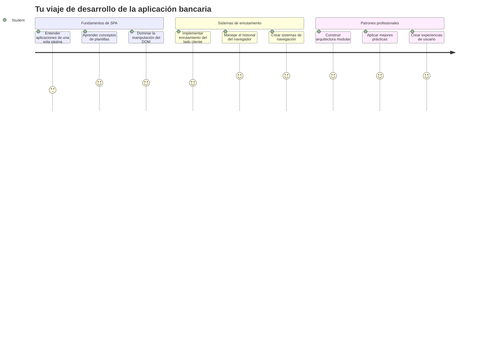
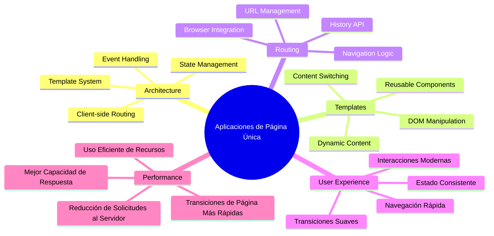
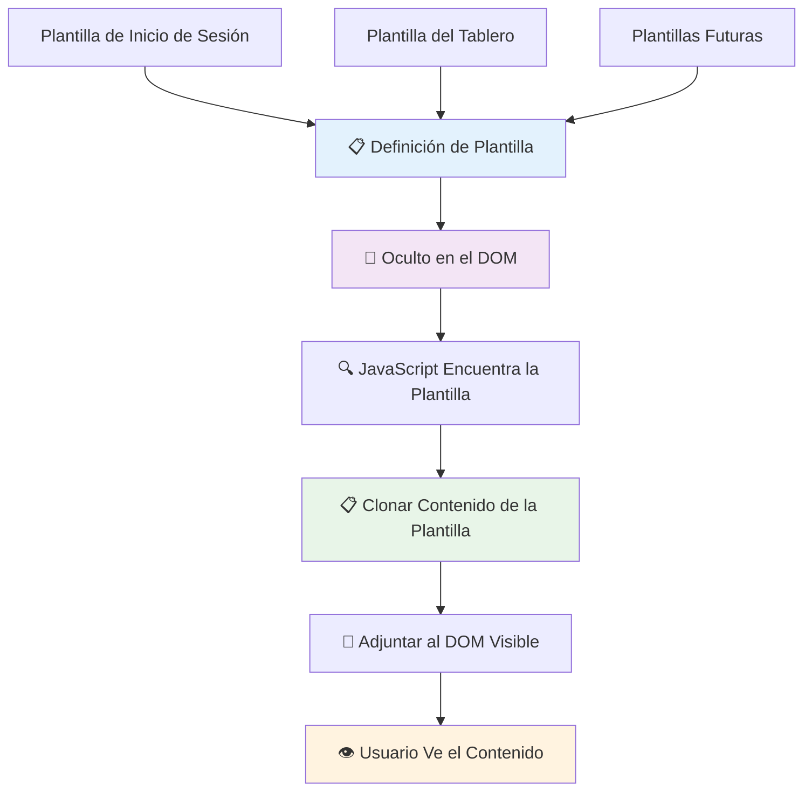
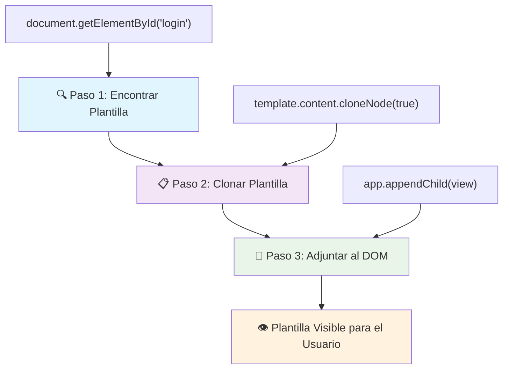
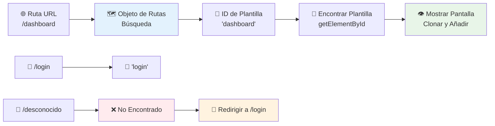
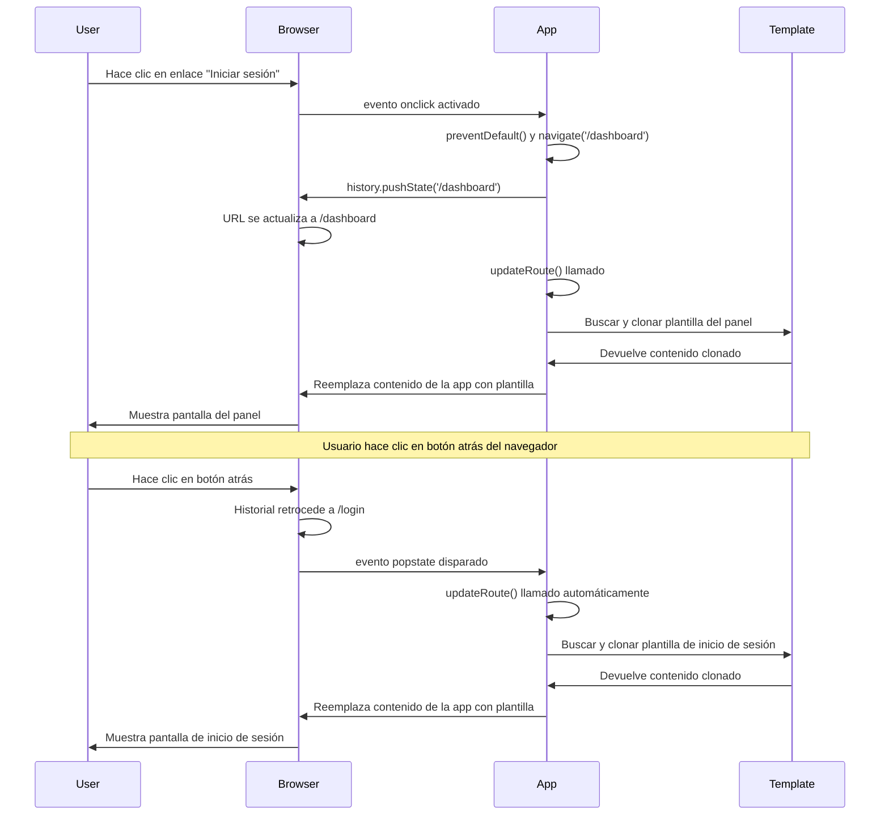
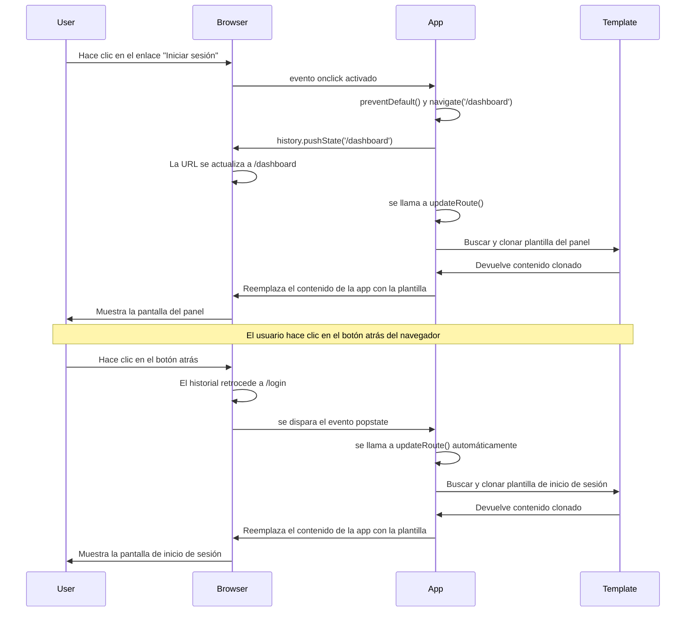
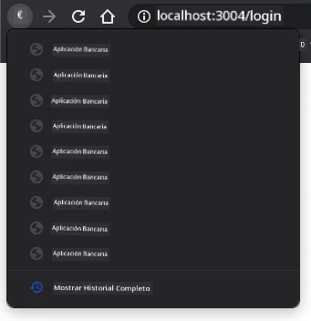
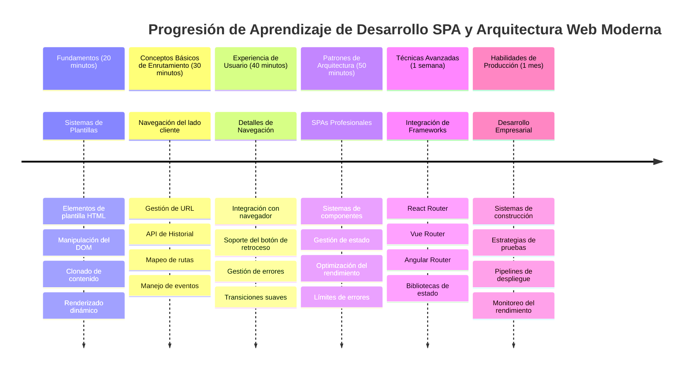

<!--
CO_OP_TRANSLATOR_METADATA:
{
  "original_hash": "351678bece18f07d9daa987a881fb062",
  "translation_date": "2026-01-06T07:45:29+00:00",
  "source_file": "7-bank-project/1-template-route/README.md",
  "language_code": "es"
}
-->
# Construir una App Bancaria Parte 1: Plantillas HTML y Rutas en una Aplicación Web


Cuando el ordenador de guía del Apolo 11 navegó a la luna en 1969, tuvo que cambiar entre diferentes programas sin reiniciar todo el sistema. Las aplicaciones web modernas funcionan de manera similar: cambian lo que ves sin recargar todo desde cero. Esto crea la experiencia fluida y receptiva que los usuarios esperan hoy en día.

A diferencia de los sitios web tradicionales que recargan páginas completas en cada interacción, las aplicaciones web modernas actualizan solo las partes que necesitan cambiar. Este enfoque, parecido a cómo el control de misión cambia entre diferentes pantallas mientras mantiene comunicación constante, crea esa experiencia fluida que esperamos.

Esto es lo que hace que la diferencia sea tan dramática:

| Aplicaciones Tradicionales Multi-Página | Aplicaciones Modernas de Página Única |
|-----------------------------------------|-------------------------------------|
| **Navegación** | Recarga completa para cada pantalla | Cambio instantáneo de contenido |
| **Rendimiento** | Más lento debido a descargas completas de HTML | Más rápido con actualizaciones parciales |
| **Experiencia de Usuario** | Destellos bruscos de página | Transiciones suaves tipo app |
| **Compartir Datos** | Difícil entre páginas | Gestión de estado fácil |
| **Desarrollo** | Varias archivos HTML que mantener | Un solo HTML con plantillas dinámicas |

**Entendiendo la evolución:**
- Las **apps tradicionales** requieren solicitudes al servidor para cada acción de navegación
- Las **SPAs modernas** cargan una vez y actualizan contenido dinámicamente usando JavaScript
- Las **expectativas de los usuarios** ahora favorecen interacciones instantáneas y fluidas
- Los **beneficios de rendimiento** incluyen menor uso de ancho de banda y respuestas más rápidas

En esta lección construiremos una app bancaria con múltiples pantallas que fluyen juntas sin problemas. Como los científicos que usan instrumentos modulares que pueden reconfigurarse para diferentes experimentos, usaremos plantillas HTML como componentes reutilizables que se muestran según sea necesario.

Trabajarás con plantillas HTML (planos reutilizables para diferentes pantallas), ruteo en JavaScript (el sistema que cambia entre pantallas) y la API de historial del navegador (que mantiene el funcionamiento esperado del botón atrás). Estas son las mismas técnicas fundamentales usadas por frameworks como React, Vue y Angular.

Al final, tendrás una app bancaria funcional que demuestra principios profesionales de aplicaciones de una sola página.


## Cuestionario Pre-Clase

[Cuestionario pre-clase](https://ff-quizzes.netlify.app/web/quiz/41)

### Lo que necesitarás

Necesitaremos un servidor web local para probar nuestra app bancaria — no te preocupes, ¡es más fácil de lo que parece! Si no tienes uno configurado, solo instala [Node.js](https://nodejs.org) y ejecuta `npx lite-server` desde la carpeta de tu proyecto. Este comando útil levanta un servidor local y abre automáticamente tu app en el navegador.

### Preparación

En tu computadora, crea una carpeta llamada `bank` con un archivo llamado `index.html` dentro. Partiremos de este [boilerplate](https://en.wikipedia.org/wiki/Boilerplate_code) HTML:

```html
<!DOCTYPE html>
<html lang="en">
  <head>
    <meta charset="UTF-8">
    <meta name="viewport" content="width=device-width, initial-scale=1.0">
    <title>Bank App</title>
  </head>
  <body>
    <!-- This is where you'll work -->
  </body>
</html>
```

**Esto es lo que proporciona este boilerplate:**
- **Establece** la estructura del documento HTML5 con la declaración DOCTYPE adecuada
- **Configura** la codificación de caracteres como UTF-8 para soporte internacional
- **Habilita** diseño responsivo con la etiqueta meta viewport para compatibilidad móvil
- **Define** un título descriptivo que aparece en la pestaña del navegador
- **Crea** un cuerpo limpio donde construiremos nuestra aplicación

> 📁 **Vista previa de estructura del proyecto**
> 
> **Al final de esta lección, tu proyecto contendrá:**
> ```
> bank/
> ├── index.html      <!-- Main HTML with templates -->
> ├── app.js          <!-- Routing and navigation logic -->
> └── style.css       <!-- (Optional for future lessons) -->
> ```
> 
> **Responsabilidades de archivos:**
> - **index.html**: Contiene todas las plantillas y provee la estructura de la app
> - **app.js**: Maneja ruteo, navegación y gestión de plantillas
> - **Plantillas**: Definen la interfaz para login, panel y otras pantallas

---

## Plantillas HTML

Las plantillas resuelven un problema fundamental en el desarrollo web. Cuando Gutenberg inventó la imprenta de tipos móviles en los años 1440, se dio cuenta que en vez de tallar páginas enteras, podía crear bloques de letras reutilizables y armarlos según necesitara. Las plantillas HTML funcionan con el mismo principio: en vez de crear diferentes archivos HTML para cada pantalla, defines estructuras reutilizables que se muestran cuando es necesario.


Piensa en las plantillas como planos para diferentes partes de tu app. Así como un arquitecto crea un plano una vez y lo usa múltiples veces en lugar de dibujar habitaciones idénticas cada vez, creamos plantillas una vez y las instanciamos según la necesidad. El navegador mantiene estas plantillas ocultas hasta que JavaScript las activa.

Si quieres crear múltiples pantallas para una página web, una solución sería crear un archivo HTML por cada pantalla que deseas mostrar. Pero esta solución tiene algunas molestias:

- Tienes que recargar todo el HTML al cambiar de pantalla, lo cual puede ser lento.
- Es difícil compartir datos entre las diferentes pantallas.

Otra forma es tener solo un archivo HTML, y definir múltiples [plantillas HTML](https://developer.mozilla.org/docs/Web/HTML/Element/template) usando el elemento `<template>`. Una plantilla es un bloque HTML reutilizable que el navegador no muestra, y necesita ser instanciado en tiempo de ejecución usando JavaScript.

### Construyámoslo

Vamos a crear una app bancaria con dos pantallas principales: una página de login y un panel de control. Primero, añadamos un elemento placeholder en el cuerpo HTML — aquí es donde aparecerán todas nuestras diferentes pantallas:

```html
<div id="app">Loading...</div>
```

**Entendiendo este placeholder:**
- **Crea** un contenedor con el ID "app" donde se mostrarán todas las pantallas
- **Muestra** un mensaje de carga hasta que JavaScript inicialice la primera pantalla
- **Proporciona** un único punto de montaje para nuestro contenido dinámico
- **Permite** fácil acceso desde JavaScript usando `document.getElementById()`

> 💡 **Consejo profesional**: Como el contenido de este elemento será reemplazado, podemos poner un mensaje o indicador de carga que se mostrará mientras la app se carga.

Luego, añadamos debajo la plantilla HTML para la página de login. Por ahora solo pondremos un título y una sección con un enlace que usaremos para hacer la navegación.

```html
<template id="login">
  <h1>Bank App</h1>
  <section>
    <a href="/dashboard">Login</a>
  </section>
</template>
```

**Desglose de esta plantilla de login:**
- **Define** una plantilla con identificador único "login" para ser apuntada por JavaScript
- **Incluye** un encabezado principal que establece la marca de la app
- **Contiene** un elemento semántico `<section>` para agrupar contenido relacionado
- **Proporciona** un enlace de navegación que llevará a los usuarios al panel de control

Luego añadiremos otra plantilla HTML para la página del panel de control. Esta página contendrá diferentes secciones:

- Un encabezado con título y enlace de logout
- El saldo actual de la cuenta bancaria
- Una lista de transacciones, mostrada en una tabla

```html
<template id="dashboard">
  <header>
    <h1>Bank App</h1>
    <a href="/login">Logout</a>
  </header>
  <section>
    Balance: 100$
  </section>
  <section>
    <h2>Transactions</h2>
    <table>
      <thead>
        <tr>
          <th>Date</th>
          <th>Object</th>
          <th>Amount</th>
        </tr>
      </thead>
      <tbody></tbody>
    </table>
  </section>
</template>
```

**Entendamos cada parte de este panel:**
- **Estructura** la página con un elemento semántico `<header>` que contiene navegación
- **Muestra** el título de la app de forma consistente para branding
- **Proporciona** un enlace de cierre de sesión que lleva a la pantalla de login
- **Presenta** el saldo actual de la cuenta en una sección dedicada
- **Organiza** los datos de transacciones usando una tabla HTML bien estructurada
- **Define** encabezados de columnas para Fecha, Objeto y Monto
- **Deja** el cuerpo de la tabla vacío para inyección dinámica de contenido más adelante

> 💡 **Consejo profesional**: Cuando crees plantillas HTML, si quieres ver cómo se verán, puedes comentar las líneas `<template>` y `</template>` envolviéndolas con `<!-- -->`.

### 🔄 **Chequeo pedagógico**
**Entendimiento del sistema de plantillas**: Antes de implementar JavaScript, asegúrate de entender:
- ✅ Cómo las plantillas difieren de elementos HTML normales
- ✅ Por qué las plantillas permanecen ocultas hasta ser activadas por JavaScript
- ✅ La importancia de la estructura HTML semántica en las plantillas
- ✅ Cómo las plantillas permiten componentes reutilizables en la UI

**Autoevaluación rápida**: ¿Qué pasa si remueves las etiquetas `<template>` alrededor de tu HTML?
*Respuesta: El contenido se vuelve visible inmediatamente y pierde su funcionalidad de plantilla*

**Beneficios de la arquitectura**: Las plantillas proveen:
- **Reutilización**: Una definición, múltiples instancias
- **Rendimiento**: Sin parsing redundante de HTML
- **Mantenibilidad**: Estructura UI centralizada
- **Flexibilidad**: Cambio dinámico de contenido

✅ ¿Por qué crees que usamos atributos `id` en las plantillas? ¿Podríamos usar otra cosa como clases?

## Dar Vida a las Plantillas con JavaScript

Ahora necesitamos hacer que nuestras plantillas sean funcionales. Como una impresora 3D que toma un plano digital y crea un objeto físico, JavaScript toma nuestras plantillas ocultas y crea elementos visibles e interactivos que los usuarios pueden ver y usar.

El proceso sigue tres pasos consistentes que forman la base del desarrollo web moderno. Una vez entiendas este patrón, lo reconocerás en muchos frameworks y bibliotecas.

Si pruebas tu archivo HTML actual en un navegador, verás que se queda mostrando `Loading...`. Eso es porque necesitamos añadir código JavaScript para instanciar y mostrar las plantillas HTML.

Instanciar una plantilla comúnmente se hace en 3 pasos:

1. Recuperar el elemento plantilla en el DOM, por ejemplo usando [`document.getElementById`](https://developer.mozilla.org/docs/Web/API/Document/getElementById).
2. Clonar el elemento plantilla, con [`cloneNode`](https://developer.mozilla.org/docs/Web/API/Node/cloneNode).
3. Adjuntarlo al DOM bajo un elemento visible, por ejemplo usando [`appendChild`](https://developer.mozilla.org/docs/Web/API/Node/appendChild).


**Desglose visual del proceso:**
- **Paso 1** localiza la plantilla oculta en la estructura DOM
- **Paso 2** crea una copia funcional que puede ser modificada con seguridad
- **Paso 3** inserta la copia en el área visible de la página
- **Resultado** es una pantalla funcional con la que los usuarios pueden interactuar

✅ ¿Por qué necesitamos clonar la plantilla antes de insertarla en el DOM? ¿Qué crees que pasaría si omitimos este paso?

### Tarea

Crea un archivo nuevo llamado `app.js` en tu carpeta de proyecto e importa ese archivo en la sección `<head>` de tu HTML:

```html
<script src="app.js" defer></script>
```

**Entendiendo esta importación de script:**
- **Enlaza** el archivo JavaScript a nuestro documento HTML
- **Usa** el atributo `defer` para asegurarse que el script se ejecute después de que termine el parseo del HTML
- **Permite** acceso a todos los elementos DOM ya que están cargados antes de ejecutar el script
- **Sigue** mejores prácticas modernas para carga y rendimiento de scripts

Ahora en `app.js`, crearemos una función nueva `updateRoute`:

```js
function updateRoute(templateId) {
  const template = document.getElementById(templateId);
  const view = template.content.cloneNode(true);
  const app = document.getElementById('app');
  app.innerHTML = '';
  app.appendChild(view);
}
```

**Paso a paso, esto es lo que sucede:**
- **Localiza** el elemento plantilla usando su ID único
- **Crea** una copia profunda del contenido de la plantilla usando `cloneNode(true)`
- **Encuentra** el contenedor de la app donde se mostrará el contenido
- **Limpia** cualquier contenido existente del contenedor de la app
- **Inserta** el contenido clonado de la plantilla en el DOM visible

Ahora llama a esta función con una de las plantillas y observa el resultado.

```js
updateRoute('login');
```

**Lo que logra esta llamada a función:**
- **Activa** la plantilla de login pasando su ID como parámetro
- **Demuestra** cómo cambiar programáticamente entre diferentes pantallas de la app
- **Muestra** la pantalla de login en lugar del mensaje "Loading..."

✅ ¿Cuál es el propósito de este código `app.innerHTML = '';`? ¿Qué sucede sin él?

## Creando Rutas

El ruteo es básicamente conectar URLs con el contenido correcto. Piensa en cómo los operadores telefónicos antiguos usaban conmutadores para conectar llamadas – tomaban una solicitud entrante y la dirigían al destino correcto. El ruteo web funciona de manera similar, tomando una URL solicitada y determinando qué contenido mostrar.


Tradicionalmente, los servidores web manejaban esto sirviendo diferentes archivos HTML para distintas URLs. Como estamos construyendo una app de página única, necesitamos manejar este ruteo nosotros mismos con JavaScript. Este enfoque nos da mayor control sobre la experiencia y el rendimiento.


**Entendiendo el flujo del ruteo:**
- Los **cambios en URL** disparan una búsqueda en nuestra configuración de rutas
- Las **rutas válidas** se mapean a IDs específicos de plantillas para renderizar
- Las **rutas inválidas** disparan un comportamiento de respaldo para evitar estados rotos
- El **renderizado de plantilla** sigue el proceso de tres pasos que aprendimos antes

Cuando hablamos de una app web, llamamos *Ruteo* a la intención de mapear **URLs** a pantallas específicas que deben mostrarse. En un sitio con múltiples archivos HTML, esto se hace automáticamente ya que las rutas de archivos se reflejan en la URL. Por ejemplo, con estos archivos en tu carpeta de proyecto:

```
mywebsite/index.html
mywebsite/login.html
mywebsite/admin/index.html
```

Si creas un servidor web con `mywebsite` como raíz, el mapeo de URL será:

```
https://site.com            --> mywebsite/index.html
https://site.com/login.html --> mywebsite/login.html
https://site.com/admin/     --> mywebsite/admin/index.html
```

Sin embargo, para nuestra web app usamos un solo archivo HTML que contiene todas las pantallas, así que este comportamiento predeterminado no nos sirve. Tenemos que crear este mapa manualmente y actualizar la plantilla mostrada usando JavaScript.

### Tarea

Usaremos un objeto simple para implementar un [mapa](https://es.wikipedia.org/wiki/Arreglo_asociativo) entre rutas URL y nuestras plantillas. Añade este objeto al inicio de tu archivo `app.js`.

```js
const routes = {
  '/login': { templateId: 'login' },
  '/dashboard': { templateId: 'dashboard' },
};
```

**Entendiendo esta configuración de rutas:**
- **Define** un mapeo entre rutas URL e identificadores de plantillas
- **Usa** sintaxis de objeto donde las claves son rutas URL y los valores contienen info de plantilla
- **Permite** una búsqueda fácil de qué plantilla mostrar para cualquier URL dada
- **Proporciona** una estructura escalable para agregar nuevas rutas en el futuro
Ahora vamos a modificar un poco la función `updateRoute`. En lugar de pasar directamente el `templateId` como argumento, queremos recuperarlo mirando primero la URL actual, y luego usar nuestro mapa para obtener el valor correspondiente del ID de plantilla. Podemos usar [`window.location.pathname`](https://developer.mozilla.org/docs/Web/API/Location/pathname) para obtener solamente la sección de ruta de la URL.

```js
function updateRoute() {
  const path = window.location.pathname;
  const route = routes[path];

  const template = document.getElementById(route.templateId);
  const view = template.content.cloneNode(true);
  const app = document.getElementById('app');
  app.innerHTML = '';
  app.appendChild(view);
}
```

**Desglosando lo que ocurre aquí:**
- **Extrae** la ruta actual desde la URL del navegador usando `window.location.pathname`
- **Busca** la configuración de ruta correspondiente en nuestro objeto routes
- **Recupera** el ID de plantilla desde la configuración de la ruta
- **Sigue** el mismo proceso de renderizado de plantilla que antes
- **Crea** un sistema dinámico que responde a cambios en la URL

Aquí mapeamos las rutas que declaramos a la plantilla correspondiente. Puedes probar que funciona correctamente cambiando la URL manualmente en tu navegador.

✅ ¿Qué pasa si entras una ruta desconocida en la URL? ¿Cómo podríamos solucionarlo?

## Añadiendo Navegación

Con el enrutamiento establecido, los usuarios necesitan una forma de navegar por la aplicación. Los sitios web tradicionales recargan páginas enteras al hacer clic en enlaces, pero queremos actualizar tanto la URL como el contenido sin recargar la página. Esto crea una experiencia más fluida, similar a cómo las aplicaciones de escritorio cambian entre diferentes vistas.

Necesitamos coordinar dos cosas: actualizar la URL del navegador para que los usuarios puedan marcar páginas y compartir enlaces, y mostrar el contenido apropiado. Cuando se implementa correctamente, esto crea la navegación fluida que los usuarios esperan de las aplicaciones modernas.


### 🔄 **Chequeo Pedagógico**
**Arquitectura de Aplicación de Página Única (SPA)**: Verifica tu comprensión del sistema completo:
- ✅ ¿En qué se diferencia el enrutamiento del lado del cliente del enrutamiento tradicional del lado del servidor?
- ✅ ¿Por qué es esencial la API History para una navegación SPA correcta?
- ✅ ¿Cómo permiten las plantillas contenido dinámico sin recargar la página?
- ✅ ¿Qué papel juega el manejo de eventos en interceptar la navegación?

**Integración del Sistema**: Tu SPA demuestra:
- **Gestión de Plantillas**: Componentes reutilizables de UI con contenido dinámico
- **Enrutamiento del Lado del Cliente**: Gestión de URL sin solicitudes al servidor
- **Arquitectura basada en eventos**: Navegación e interacciones de usuario reactivas
- **Integración con el Navegador**: Soporte adecuado para el historial y botones de atrás/adelante
- **Optimización de Rendimiento**: Transiciones rápidas y reducción de carga al servidor

**Patrones Profesionales**: Has implementado:
- **Separación Modelo-Vista**: Plantillas separadas de la lógica de aplicación
- **Gestión de Estado**: Estado de URL sincronizado con el contenido mostrado
- **Mejora Progresiva**: JavaScript que mejora la funcionalidad básica HTML
- **Experiencia de Usuario**: Navegación fluida, similar a una app, sin recargas de página

> � **Perspectiva de Arquitectura**: Componentes del Sistema de Navegación
>
> **Lo que estás construyendo:**
> - **🔄 Gestión de URL**: Actualiza la barra de direcciones sin recargas
> - **📋 Sistema de Plantillas**: Cambia contenido dinámicamente según ruta actual  
> - **📚 Integración del Historial**: Mantiene funcionalidad de botones atrás/adelante
> - **🛡️ Manejo de Errores**: Respaldo elegante para rutas inválidas o ausentes
>
> **Cómo trabajan juntos los componentes:**
> - **Escucha** eventos de navegación (clics, cambios de historial)
> - **Actualiza** la URL usando la API History
> - **Renderiza** la plantilla apropiada para la nueva ruta
> - **Mantiene** una experiencia fluida para el usuario

El siguiente paso para nuestra app es añadir la posibilidad de navegar entre páginas sin tener que cambiar la URL manualmente. Esto implica dos cosas:

  1. Actualizar la URL actual
  2. Actualizar la plantilla mostrada basada en la nueva URL

Ya nos encargamos de la segunda parte con la función `updateRoute`, así que tenemos que averiguar cómo actualizar la URL actual.

Tendremos que usar JavaScript y más específicamente el [`history.pushState`](https://developer.mozilla.org/docs/Web/API/History/pushState) que permite actualizar la URL y crear una nueva entrada en el historial del navegador, sin recargar el HTML.

> ⚠️ **Nota Importante**: Aunque el elemento ancla HTML [`<a href>`](https://developer.mozilla.org/docs/Web/HTML/Element/a) puede usarse para crear enlaces a diferentes URLs, hará que el navegador recargue el HTML por defecto. Es necesario evitar este comportamiento cuando se maneja el enrutamiento con JavaScript personalizado, usando la función preventDefault() en el evento click.

### Tarea

Vamos a crear una nueva función que podamos usar para navegar en nuestra app:

```js
function navigate(path) {
  window.history.pushState({}, path, path);
  updateRoute();
}
```

**Entendiendo esta función de navegación:**
- **Actualiza** la URL del navegador a la nueva ruta usando `history.pushState`
- **Añade** una nueva entrada al historial del navegador para soporte correcto de botones atrás/adelante
- **Dispara** la función `updateRoute()` para mostrar la plantilla correspondiente
- **Mantiene** la experiencia de página única sin recargas

Este método primero actualiza la URL actual basada en la ruta dada, luego actualiza la plantilla. La propiedad `window.location.origin` devuelve la raíz de la URL, permitiéndonos reconstruir una URL completa a partir de una ruta dada.

Ahora que tenemos esta función, podemos encargarnos del problema que tenemos si una ruta no coincide con ninguna definida. Modificaremos la función `updateRoute` añadiendo un fallback a una de las rutas existentes si no encontramos coincidencia.

```js
function updateRoute() {
  const path = window.location.pathname;
  const route = routes[path];

  if (!route) {
    return navigate('/login');
  }

  const template = document.getElementById(route.templateId);
  const view = template.content.cloneNode(true);
  const app = document.getElementById('app');
  app.innerHTML = '';
  app.appendChild(view);
}
```

**Puntos clave para recordar:**
- **Verifica** si existe una ruta para la ruta actual
- **Redirige** a la página de login cuando se accede a una ruta inválida
- **Proporciona** un mecanismo de respaldo que evita navegación rota
- **Asegura** que los usuarios siempre vean una pantalla válida, incluso con URLs incorrectas

Si no se encuentra una ruta, ahora redirigiremos a la página de `login`.

Ahora creemos una función para obtener la URL cuando se hace clic en un enlace, y para prevenir el comportamiento predeterminado del navegador en los enlaces:

```js
function onLinkClick(event) {
  event.preventDefault();
  navigate(event.target.href);
}
```

**Desglosando este manejador de clic:**
- **Previene** el comportamiento predeterminado del navegador usando `preventDefault()`
- **Extrae** la URL destino del elemento de enlace clickeado
- **Llama** a nuestra función personalizada `navigate` en lugar de recargar la página
- **Mantiene** la experiencia fluida de aplicación de página única

```html
<a href="/dashboard" onclick="onLinkClick(event)">Login</a>
...
<a href="/login" onclick="onLinkClick(event)">Logout</a>
```

**Lo que logra esta vinculación onclick:**
- **Conecta** cada enlace a nuestro sistema de navegación personalizado
- **Pasa** el evento de clic a nuestra función `onLinkClick` para procesarlo
- **Habilita** navegación fluida sin recargas de página
- **Mantiene** estructura correcta de URL que los usuarios pueden marcar o compartir

El atributo [`onclick`](https://developer.mozilla.org/docs/Web/API/GlobalEventHandlers/onclick) vincula el evento `click` al código JavaScript, aquí la llamada a la función `navigate()`.

Prueba a hacer clic en estos enlaces, ahora deberías ser capaz de navegar entre las diferentes pantallas de tu app.

✅ El método `history.pushState` es parte del estándar HTML5 y está implementado en [todos los navegadores modernos](https://caniuse.com/?search=pushState). Si estás construyendo una web para navegadores antiguos, hay un truco que puedes usar en lugar de esta API: usando un [hash (`#`)](https://en.wikipedia.org/wiki/URI_fragment) antes de la ruta puedes implementar un enrutamiento que funciona con navegación de anclas normales y no recarga la página, ya que su propósito fue crear enlaces internos dentro de una página.

## Haciendo que los Botones Atrás y Adelante Funcionen

Los botones atrás y adelante son fundamentales para la navegación web, tal como los controladores de misión de la NASA pueden revisar estados previos del sistema durante misiones espaciales. Los usuarios esperan que estos botones funcionen y cuando no lo hacen, se rompe la experiencia esperada de navegación.

Nuestra SPA necesita configuración adicional para soportar esto. El navegador mantiene una pila de historial (a la que hemos estado añadiendo con `history.pushState`), pero cuando los usuarios navegan por este historial, nuestra app necesita responder actualizando el contenido mostrado acorde.


**Puntos clave de interacción:**
- **Acciones del usuario** disparan navegación mediante clics o botones del navegador
- **La app intercepta** clics en enlaces para prevenir recargas
- **La API History** maneja cambios en URL y pila de historial del navegador
- **Las plantillas** proveen la estructura de contenido para cada pantalla
- **Los listeners** aseguran que la app responda a todo tipo de navegación

Usar `history.pushState` crea nuevas entradas en el historial de navegación del navegador. Puedes comprobarlo manteniendo presionado el *botón de atrás* de tu navegador, debería mostrar algo así:



Si intentas hacer clic varias veces en el botón de atrás, verás que la URL cambia y el historial se actualiza, pero la misma plantilla sigue mostrándose.

Eso es porque la aplicación no sabe que necesitamos llamar a `updateRoute()` cada vez que el historial cambia. Si miras la [documentación de `history.pushState`](https://developer.mozilla.org/docs/Web/API/History/pushState), verás que si el estado cambia — es decir, que nos movimos a una URL diferente — se dispara el evento [`popstate`](https://developer.mozilla.org/docs/Web/API/Window/popstate_event). Usaremos eso para arreglar ese problema.

### Tarea

Para asegurarnos que la plantilla mostrada se actualice cuando cambie el historial del navegador, añadiremos una función que llame a `updateRoute()`. Lo haremos al final de nuestro archivo `app.js`:

```js
window.onpopstate = () => updateRoute();
updateRoute();
```

**Entendiendo esta integración con el historial:**
- **Escucha** eventos `popstate` que ocurren cuando los usuarios navegan con los botones del navegador
- **Usa** una función flecha para sintaxis concisa del manejador de eventos
- **Llama** automáticamente a `updateRoute()` cada vez que el estado del historial cambia
- **Inicializa** la app llamando a `updateRoute()` cuando la página carga por primera vez
- **Asegura** que la plantilla correcta se muestre independientemente de cómo naveguen los usuarios

> 💡 **Consejo Profesional**: Usamos una [función flecha](https://developer.mozilla.org/docs/Web/JavaScript/Reference/Functions/Arrow_functions) aquí para declarar nuestro manejador de eventos `popstate` por concisión, pero una función normal funcionaría igual.

Aquí tienes un video recordatorio sobre funciones flecha:

[](https://youtube.com/watch?v=OP6eEbOj2sc "Funciones Flecha")

> 🎥 Haz clic en la imagen arriba para un video sobre funciones flecha.

Ahora intenta usar los botones atrás y adelante de tu navegador, y verifica que la ruta mostrada se actualice correctamente esta vez.

### ⚡ **Lo que Puedes Hacer en los Próximos 5 Minutos**
- [ ] Prueba la navegación de tu app bancaria usando botones atrás/adelante del navegador
- [ ] Intenta escribir diferentes URLs manualmente en la barra de direcciones para probar el enrutamiento
- [ ] Abre las herramientas de desarrollo del navegador e inspecciona cómo se clonan las plantillas en el DOM
- [ ] Experimenta añadiendo instrucciones console.log para seguir el flujo del enrutamiento

### 🎯 **Lo que Puedes Lograr Esta Hora**
- [ ] Completa el cuestionario post-lección y entiende conceptos de arquitectura SPA
- [ ] Añade estilos CSS para que las plantillas de tu app bancaria luzcan profesionales
- [ ] Implementa el desafío de la página de error 404 con manejo de errores adecuado
- [ ] Crea el desafío de la página de créditos con funcionalidad de rutas adicional
- [ ] Añade estados de carga y transiciones entre cambios de plantilla

### 📅 **Tu Viaje de Desarrollo SPA de una Semana**
- [ ] Completa la app bancaria completa con formularios, gestión de datos y persistencia
- [ ] Añade funciones avanzadas de enrutamiento como parámetros de ruta y rutas anidadas
- [ ] Implementa guardias de navegación y enrutamiento basado en autenticación
- [ ] Crea componentes reutilizables de plantilla y una biblioteca de componentes
- [ ] Añade animaciones y transiciones para una experiencia de usuario más fluida
- [ ] Despliega tu SPA en una plataforma de hosting y configura el enrutamiento correctamente

### 🌟 **Tu Maestría en Arquitectura Frontend en un Mes**
- [ ] Construye SPAs complejas usando frameworks modernos como React, Vue o Angular
- [ ] Aprende patrones avanzados de gestión de estado y librerías
- [ ] Domina herramientas de compilación y flujos de trabajo de desarrollo para SPA
- [ ] Implementa características de Progressive Web App y funcionalidad offline
- [ ] Estudia técnicas de optimización de rendimiento para SPAs a gran escala
- [ ] Contribuye a proyectos SPA open source y comparte tus conocimientos

## 🎯 Tu Cronograma de Maestría en Aplicaciones de Página Única


### 🛠️ Resumen de Tu Caja de Herramientas para Desarrollo SPA

Después de completar esta lección, ahora has dominado:
- **Arquitectura de Plantillas**: Componentes HTML reutilizables con renderizado de contenido dinámico
- **Enrutamiento del Lado del Cliente**: Gestión de URL y navegación sin recargas
- **Integración con Navegadores**: Uso de API History y soporte para botones atrás/adelante
- **Sistemas Basados en Eventos**: Manejo de navegación y gestión de interacción de usuario
- **Manipulación del DOM**: Clonado de plantillas, cambio de contenido y gestión de elementos
- **Manejo de Errores**: Resguardos elegantes para rutas inválidas y contenido ausente
- **Patrones de Rendimiento**: Estrategias eficientes de carga y renderizado de contenido

**Aplicaciones en el Mundo Real**: Tus habilidades de desarrollo SPA aplican directamente a:
- **Aplicaciones Web Modernas**: Desarrollo con React, Vue, Angular y otros frameworks
- **Aplicaciones Web Progresivas (PWA)**: Aplicaciones con capacidad offline y experiencia tipo app
- **Paneles Empresariales**: Aplicaciones complejas de negocio con múltiples vistas
- **Plataformas de E-commerce**: Catálogos de productos, carritos y flujos de pago
- **Gestión de Contenido**: Creación y edición dinámica de contenido
- **Desarrollo Móvil**: Apps híbridas usando tecnologías web

**Habilidades Profesionales Adquiridas**: Ahora puedes:
- **Arquitecturar** aplicaciones de una sola página con la adecuada separación de responsabilidades  
- **Implementar** sistemas de enrutamiento del lado cliente que escalen con la complejidad de la aplicación  
- **Depurar** flujos de navegación complejos usando las herramientas de desarrollo del navegador  
- **Optimizar** el rendimiento de la aplicación mediante una gestión eficiente de plantillas  
- **Diseñar** experiencias de usuario que se sientan nativas y responsivas  

**Conceptos de desarrollo frontend dominados**:  
- **Arquitectura de componentes**: patrones de UI reutilizables y sistemas de plantillas  
- **Sincronización de estado**: gestión del estado en la URL y el historial del navegador  
- **Programación orientada a eventos**: manejo de interacciones de usuario y navegación  
- **Optimización del rendimiento**: manipulación eficiente del DOM y carga de contenido  
- **Diseño de experiencia de usuario**: transiciones suaves y navegación intuitiva  

**Siguiente nivel**: ¡Estás listo para explorar frameworks modernos de frontend, gestión avanzada del estado o construir aplicaciones empresariales complejas!

🌟 **Logro desbloqueado**: ¡Has construido una base profesional de aplicaciones de una sola página con patrones modernos de arquitectura web!

---

## Desafío del agente GitHub Copilot 🚀

Usa el modo Agente para completar el siguiente desafío:

**Descripción:** Mejora la aplicación bancaria implementando manejo de errores y una plantilla de página 404 para rutas no válidas, mejorando la experiencia del usuario al navegar a páginas inexistentes.

**Instrucción:** Crea una nueva plantilla HTML con id "not-found" que muestre una página de error 404 amigable con estilo. Luego modifica la lógica de enrutamiento en JavaScript para mostrar esta plantilla cuando los usuarios naveguen a URLs inválidas, y agrega un botón "Ir al inicio" que navegue de regreso a la página de inicio de sesión.

Aprende más sobre el [modo agente](https://code.visualstudio.com/blogs/2025/02/24/introducing-copilot-agent-mode) aquí.

## 🚀 Desafío

Agrega una nueva plantilla y ruta para una tercera página que muestre los créditos de esta aplicación.

**Objetivos del desafío:**  
- **Crear** una nueva plantilla HTML con una estructura de contenido adecuada  
- **Agregar** la nueva ruta a tu objeto de configuración de rutas  
- **Incluir** enlaces de navegación hacia y desde la página de créditos  
- **Probar** que toda la navegación funciona correctamente con el historial del navegador  

## Cuestionario post-clase

[Cuestionario post-clase](https://ff-quizzes.netlify.app/web/quiz/42)

## Revisión y autoestudio

El enrutamiento es una de las partes sorprendentemente complicadas del desarrollo web, especialmente al pasar de comportamientos de recarga de página a recargas en aplicaciones de una sola página. Lee un poco sobre [cómo el servicio Azure Static Web App](https://docs.microsoft.com/azure/static-web-apps/routes/?WT.mc_id=academic-77807-sagibbon) maneja el enrutamiento. ¿Puedes explicar por qué algunas de las decisiones descritas en ese documento son necesarias?

**Recursos adicionales de aprendizaje:**  
- **Explora** cómo frameworks populares como React Router y Vue Router implementan el enrutamiento del lado cliente  
- **Investiga** las diferencias entre el enrutamiento basado en hash y el enrutamiento con la API History  
- **Aprende** sobre el renderizado del lado servidor (SSR) y cómo afecta a las estrategias de enrutamiento  
- **Investiga** cómo las Progressive Web Apps (PWAs) manejan el enrutamiento y la navegación  

## Tarea

[Mejorar el enrutamiento](assignment.md)

---

<!-- CO-OP TRANSLATOR DISCLAIMER START -->
**Aviso Legal**:  
Este documento ha sido traducido utilizando el servicio de traducción automática [Co-op Translator](https://github.com/Azure/co-op-translator). Aunque nos esforzamos por la precisión, tenga en cuenta que las traducciones automatizadas pueden contener errores o inexactitudes. El documento original en su idioma nativo debe considerarse la fuente autorizada. Para información crítica, se recomienda una traducción profesional realizada por humanos. No nos hacemos responsables de cualquier malentendido o interpretación errónea que surja del uso de esta traducción.
<!-- CO-OP TRANSLATOR DISCLAIMER END -->