<!--
CO_OP_TRANSLATOR_METADATA:
{
  "original_hash": "7cbdbd132d39a2bb493e85bc2a9387cc",
  "translation_date": "2026-01-06T07:42:45+00:00",
  "source_file": "7-bank-project/2-forms/README.md",
  "language_code": "es"
}
-->
# Construye una App Bancaria Parte 2: Construye un Formulario de Inicio de Sesión y Registro

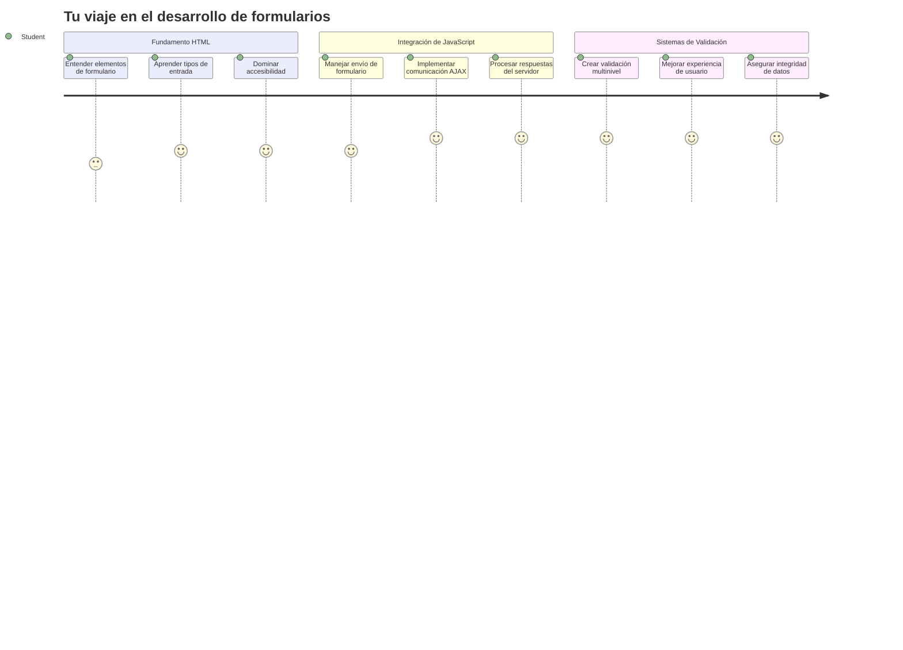
## Cuestionario Pre-Clase

[Cuestionario pre-clase](https://ff-quizzes.netlify.app/web/quiz/43)

¿Alguna vez llenaste un formulario en línea y rechazó tu formato de correo electrónico? ¿O perdiste toda tu información cuando hiciste clic en enviar? Todos hemos experimentado estas frustraciones.

Los formularios son el puente entre tus usuarios y la funcionalidad de tu aplicación. Al igual que los protocolos cuidadosos que usan los controladores de tráfico aéreo para guiar a los aviones a sus destinos de forma segura, los formularios bien diseñados proporcionan retroalimentación clara y previenen errores costosos. Los formularios deficientes, en cambio, pueden alejar a los usuarios más rápido que una mala comunicación en un aeropuerto concurrido.

En esta lección, transformaremos tu app bancaria estática en una aplicación interactiva. Aprenderás a construir formularios que validan la entrada del usuario, se comunican con servidores y brindan retroalimentación útil. Piénsalo como construir la interfaz de control que permite a los usuarios navegar las funciones de tu aplicación.

Al final, tendrás un sistema completo de inicio de sesión y registro con validación que guía a los usuarios hacia el éxito en lugar de la frustración.

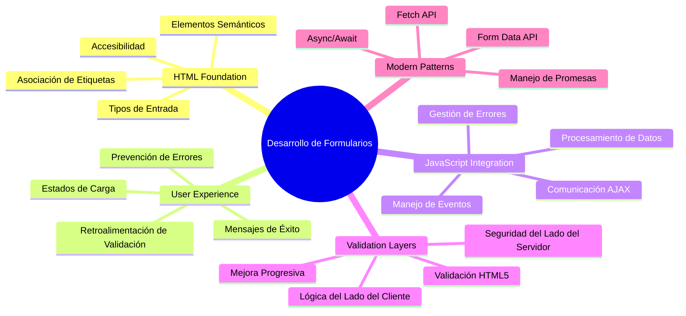
## Requisitos Previos

Antes de comenzar a construir formularios, asegurémonos de que tienes todo configurado correctamente. Esta lección retoma justo donde terminamos en la anterior, así que si saltaste adelante, puede que quieras volver y configurar lo básico primero.

### Configuración Requerida

| Componente | Estado | Descripción |
|-----------|--------|-------------|
| [Plantillas HTML](../1-template-route/README.md) | ✅ Requerido | Tu estructura básica de la app bancaria |
| [Node.js](https://nodejs.org) | ✅ Requerido | Entorno de ejecución JavaScript para el servidor |
| [Servidor API Bancaria](../api/README.md) | ✅ Requerido | Servicio backend para almacenamiento de datos |

> 💡 **Consejo de Desarrollo**: Ejecutarás dos servidores por separado simultáneamente: uno para tu app bancaria frontend y otro para la API backend. Esta configuración refleja el desarrollo real donde frontend y backend operan de manera independiente.

### Configuración del Servidor

**Tu entorno de desarrollo incluirá:**
- **Servidor frontend**: Sirve tu app bancaria (típicamente en el puerto `3000`)
- **Servidor API backend**: Maneja almacenamiento y recuperación de datos (puerto `5000`)
- **Ambos servidores** pueden correr simultáneamente sin conflictos

**Probando la conexión a tu API:**
```bash
curl http://localhost:5000/api
# Respuesta esperada: "Bank API v1.0.0"
```

**Si ves la respuesta con la versión de la API, ¡estás listo para continuar!**

---

## Entendiendo Formularios y Controles HTML

Los formularios HTML son cómo los usuarios comunican con tu aplicación web. Piénsalos como el sistema de telégrafo que conectaba lugares distantes en el siglo XIX: son el protocolo de comunicación entre la intención del usuario y la respuesta de la aplicación. Cuando están diseñados con atención, detectan errores, guían el formato de entrada y ofrecen sugerencias útiles.

Los formularios modernos son significativamente más sofisticados que los campos de texto básicos. HTML5 introdujo tipos de entrada especializados que manejan validación de correo electrónico, formato de números y selección de fechas automáticamente. Estas mejoras benefician tanto la accesibilidad como la experiencia en dispositivos móviles.

### Elementos Esenciales de un Formulario

**Piezas fundamentales que todo formulario necesita:**

```html
<!-- Basic form structure -->
<form id="userForm" method="POST">
  <label for="username">Username</label>
  <input id="username" name="username" type="text" required>
  
  <button type="submit">Submit</button>
</form>
```

**Esto es lo que hace este código:**
- **Crea** un contenedor de formulario con un identificador único
- **Especifica** el método HTTP para el envío de datos
- **Asocia** etiquetas con inputs para accesibilidad
- **Define** un botón de envío para procesar el formulario

### Tipos y Atributos Modernos de Entrada

| Tipo de Entrada | Propósito | Ejemplo de Uso |
|------------|---------|---------------|
| `text` | Entrada de texto general | `<input type="text" name="username">` |
| `email` | Validación de correo electrónico | `<input type="email" name="email">` |
| `password` | Entrada de texto oculta | `<input type="password" name="password">` |
| `number` | Entrada numérica | `<input type="number" name="balance" min="0">` |
| `tel` | Números telefónicos | `<input type="tel" name="phone">` |

> 💡 **Ventaja Moderna HTML5**: Usar tipos de entrada específicos proporciona validación automática, teclados móviles adecuados y mejor soporte de accesibilidad sin JavaScript adicional.

### Tipos y Comportamientos de Botones

```html
<!-- Different button behaviors -->
<button type="submit">Save Data</button>     <!-- Submits the form -->
<button type="reset">Clear Form</button>    <!-- Resets all fields -->
<button type="button">Custom Action</button> <!-- No default behavior -->
```

**Lo que hace cada tipo de botón:**
- **Botones submit**: Disparan el envío del formulario y envían datos al endpoint especificado
- **Botones reset**: Restauran todos los campos del formulario a su estado inicial
- **Botones normales**: No tienen comportamiento por defecto, requieren JavaScript personalizado para funcionalidad

> ⚠️ **Nota Importante**: El elemento `<input>` es autocerrado y no requiere etiqueta de cierre. La práctica moderna recomienda escribir `<input>` sin la barra diagonal.

### Construyendo tu Formulario de Inicio de Sesión

Ahora construyamos un formulario práctico de inicio de sesión que demuestre las prácticas modernas de formularios HTML. Comenzaremos con una estructura básica y la iremos mejorando con características de accesibilidad y validación.

```html
<template id="login">
  <h1>Bank App</h1>
  <section>
    <h2>Login</h2>
    <form id="loginForm" novalidate>
      <div class="form-group">
        <label for="username">Username</label>
        <input id="username" name="user" type="text" required 
               autocomplete="username" placeholder="Enter your username">
      </div>
      <button type="submit">Login</button>
    </form>
  </section>
</template>
```

**Análisis de lo que sucede aquí:**
- **Estructura** el formulario con elementos semánticos HTML5
- **Agrupa** elementos relacionados usando contenedores `div` con clases significativas
- **Asocia** etiquetas con inputs usando atributos `for` e `id`
- **Incluye** atributos modernos como `autocomplete` y `placeholder` para mejor UX
- **Agrega** `novalidate` para manejar la validación con JavaScript en lugar de los predeterminados del navegador

### El Poder de las Etiquetas Adecuadas

**Por qué las etiquetas importan en el desarrollo web moderno:**

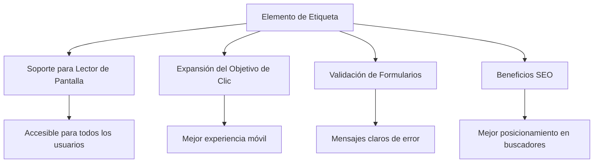
**Lo que logran las etiquetas adecuadas:**
- **Permiten** que los lectores de pantalla anuncien los campos de forma clara
- **Amplián** el área clickable (hacer clic en la etiqueta enfoca el input)
- **Mejoran** la usabilidad móvil con objetivos táctiles más grandes
- **Soportan** la validación de formularios con mensajes de error significativos
- **Mejoran** el SEO proporcionando significado semántico a los elementos del formulario

> 🎯 **Objetivo de Accesibilidad**: Cada campo del formulario debe tener una etiqueta asociada. Esta práctica simple hace que tus formularios sean usables para todos, incluidos usuarios con discapacidades, y mejora la experiencia para todos.

### Creando el Formulario de Registro

El formulario de registro requiere información más detallada para crear una cuenta completa. Construyámoslo con características modernas de HTML5 y accesibilidad mejorada.

```html
<hr/>
<h2>Register</h2>
<form id="registerForm" novalidate>
  <div class="form-group">
    <label for="user">Username</label>
    <input id="user" name="user" type="text" required 
           autocomplete="username" placeholder="Choose a username">
  </div>
  
  <div class="form-group">
    <label for="currency">Currency</label>
    <input id="currency" name="currency" type="text" value="$" 
           required maxlength="3" placeholder="USD, EUR, etc.">
  </div>
  
  <div class="form-group">
    <label for="description">Account Description</label>
    <input id="description" name="description" type="text" 
           maxlength="100" placeholder="Personal savings, checking, etc.">
  </div>
  
  <div class="form-group">
    <label for="balance">Starting Balance</label>
    <input id="balance" name="balance" type="number" value="0" 
           min="0" step="0.01" placeholder="0.00">
  </div>
  
  <button type="submit">Create Account</button>
</form>
```

**En lo anterior hemos:**
- **Organizado** cada campo en contenedores `div` para mejor estilo y disposición
- **Agregado** atributos apropiados `autocomplete` para soporte de autocompletado del navegador
- **Incluido** texto de marcador de posición útil para guiar la entrada del usuario
- **Establecido** valores por defecto sensatos usando el atributo `value`
- **Aplicado** atributos de validación como `required`, `maxlength` y `min`
- **Usado** `type="number"` para el campo de balance con soporte decimal

### Explorando Tipos de Entrada y Comportamiento

**Los tipos de entrada modernos proporcionan funcionalidades mejoradas:**

| Característica | Beneficio | Ejemplo |
|---------|---------|----------|
| `type="number"` | Teclado numérico en móvil | Entrada de balance más fácil |
| `step="0.01"` | Control de precisión decimal | Permite centavos en moneda |
| `autocomplete` | Autocompletado del navegador | Completar formularios más rápido |
| `placeholder` | Sugerencias contextuales | Guía las expectativas del usuario |

> 🎯 **Desafío de Accesibilidad**: ¡Intenta navegar por los formularios usando solo tu teclado! Usa `Tab` para moverte entre campos, `Espacio` para marcar casillas y `Enter` para enviar. Esta experiencia te ayuda a entender cómo interactúan los usuarios de lectores de pantalla con tus formularios.

### 🔄 **Chequeo Pedagógico**
**Comprensión de la Base del Formulario**: Antes de implementar JavaScript, asegúrate de entender:
- ✅ Cómo el HTML semántico crea estructuras de formulario accesibles
- ✅ Por qué los tipos de entrada son importantes para teclados móviles y validación
- ✅ La relación entre etiquetas y controles del formulario
- ✅ Cómo los atributos del formulario afectan el comportamiento predeterminado del navegador

**Autoevaluación rápida**: ¿Qué pasa si envías un formulario sin manejo JavaScript?
*Respuesta: El navegador realiza el envío predeterminado, generalmente redirigiendo a la URL de acción*

**Beneficios Formularios HTML5**: Los formularios modernos ofrecen:
- **Validación integrada**: Comprobación automática de formato de email y números
- **Optimización móvil**: Teclados apropiados para distintos tipos de entrada
- **Accesibilidad**: Soporte para lectores de pantalla y navegación por teclado
- **Mejora progresiva**: Funciona incluso cuando JavaScript está deshabilitado

## Entendiendo Métodos de Envío de Formularios

Cuando alguien llena tu formulario y presiona enviar, esos datos deben ir a algún lugar – usualmente a un servidor que pueda guardarlos. Hay un par de maneras diferentes en que esto puede suceder, y saber cuál usar te evitará problemas más adelante.

Veamos qué sucede realmente cuando alguien hace clic en el botón de enviar.

### Comportamiento Predeterminado del Formulario

Primero, observemos qué sucede con un envío básico:

**Prueba tus formularios actuales:**
1. Haz clic en el botón *Register* en tu formulario
2. Observa los cambios en la barra de direcciones del navegador
3. Nota cómo la página se recarga y los datos aparecen en la URL


### Comparación de Métodos HTTP

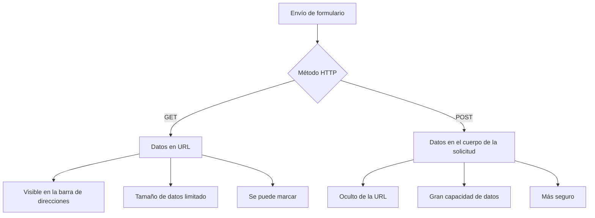
**Entendiendo las diferencias:**

| Método | Caso de Uso | Ubicación de Datos | Nivel de Seguridad | Límite de Tamaño |
|--------|----------|---------------|----------------|-------------|
| `GET` | Consultas de búsqueda, filtros | Parámetros en URL | Bajo (visible) | ~2000 caracteres |
| `POST` | Cuentas de usuario, datos sensibles | Cuerpo de la petición | Más alto (oculto) | Sin límite práctico |

**Diferencias fundamentales:**
- **GET**: Añade los datos del formulario a la URL como parámetros de consulta (apropiado para operaciones de búsqueda)
- **POST**: Incluye los datos en el cuerpo de la petición (esencial para información sensible)
- **Limitaciones de GET**: Restricciones de tamaño, datos visibles, historial persistente en el navegador
- **Ventajas de POST**: Gran capacidad de datos, privacidad, soporte para carga de archivos

> 💡 **Mejor Práctica**: Usa `GET` para formularios de búsqueda y filtros (recuperación de datos), usa `POST` para registro, inicio de sesión y creación de datos.

### Configurando el Envío del Formulario

Configuremos tu formulario de registro para que se comunique correctamente con la API backend usando el método POST:

```html
<form id="registerForm" action="//localhost:5000/api/accounts" 
      method="POST" novalidate>
```

**Lo que hace esta configuración:**
- **Dirige** el envío del formulario a tu endpoint API
- **Usa** el método POST para transmisión segura de datos
- **Incluye** `novalidate` para manejar validación con JavaScript

### Probando el Envío del Formulario

**Sigue estos pasos para probar tu formulario:**
1. **Llena** el formulario de registro con tu información
2. **Haz clic** en el botón "Crear Cuenta"
3. **Observa** la respuesta del servidor en tu navegador

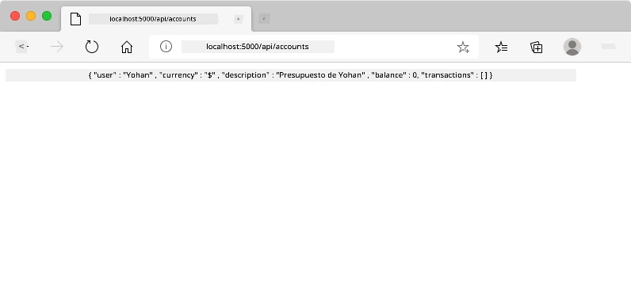

**Lo que deberías ver:**
- **El navegador redirige** a la URL del endpoint API
- **Respuesta JSON** con los datos de la cuenta recién creada
- **Confirmación del servidor** de que la cuenta fue creada exitosamente

> 🧪 **Hora del experimento**: Intenta registrarte de nuevo con el mismo nombre de usuario. ¿Qué respuesta obtienes? Esto te ayuda a entender cómo el servidor maneja datos duplicados y condiciones de error.

### Entendiendo Respuestas JSON

**Cuando el servidor procesa tu formulario con éxito:**
```json
{
  "user": "john_doe",
  "currency": "$",
  "description": "Personal savings",
  "balance": 100,
  "id": "unique_account_id"
}
```

**Esta respuesta confirma que:**
- **Se crea** una cuenta nueva con los datos especificados
- **Se asigna** un identificador único para referencia futura
- **Se devuelve** toda la información de la cuenta para verificación
- **Indica** almacenamiento exitoso en la base de datos

## Manejo Moderno de Formularios con JavaScript

Los envíos tradicionales de formularios causan recargas completas de página, similares a cómo las primeras misiones espaciales requerían reinicios totales del sistema para correcciones de curso. Este enfoque interrumpe la experiencia de usuario y pierde el estado de la aplicación.

El manejo de formularios con JavaScript funciona como los sistemas de guía continua usados por naves espaciales modernas: ajusta en tiempo real sin perder el contexto de navegación. Podemos interceptar envíos de formularios, proveer retroalimentación inmediata, manejar errores con gracia y actualizar la interfaz basado en respuestas del servidor sin perder la posición del usuario en la app.

### ¿Por qué Evitar Recargas de Página?

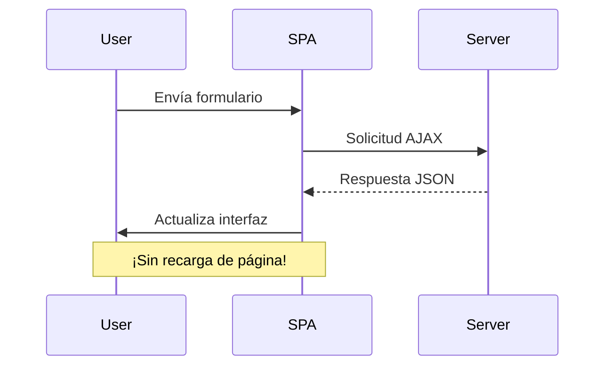
**Beneficios del manejo con JavaScript:**
- **Mantiene** el estado de la aplicación y contexto del usuario
- **Proporciona** retroalimentación instantánea e indicadores de carga
- **Permite** manejo dinámico de errores y validación
- **Crea** experiencias suaves tipo app
- **Permite** lógica condicional basada en respuestas del servidor

### Transición de Formularios Tradicionales a Modernos

**Desafíos del enfoque tradicional:**
- **Redirige** a los usuarios fuera de tu aplicación
- **Pierde** estado y contexto actuales de la aplicación
- **Requiere** recargas completas para operaciones simples
- **Ofrece** control limitado sobre retroalimentación al usuario

**Ventajas del enfoque moderno con JavaScript:**
- **Mantiene** usuarios dentro de la aplicación
- **Conserva** todo el estado y datos de la aplicación
- **Permite** validación y retroalimentación en tiempo real
- **Soporta** mejora progresiva y accesibilidad

### Implementando Manejo de Formularios con JavaScript

Reemplacemos el envío tradicional del formulario con manejo moderno de eventos con JavaScript:

```html
<!-- Remove the action attribute and add event handling -->
<form id="registerForm" method="POST" novalidate>
```

**Agrega la lógica de registro a tu archivo `app.js`:**

```javascript
// Manejo moderno de formularios basado en eventos
function register() {
  const registerForm = document.getElementById('registerForm');
  const formData = new FormData(registerForm);
  const data = Object.fromEntries(formData);
  const jsonData = JSON.stringify(data);
  
  console.log('Form data prepared:', data);
}

// Adjuntar el listener de eventos cuando la página carga
document.addEventListener('DOMContentLoaded', () => {
  const registerForm = document.getElementById('registerForm');
  registerForm.addEventListener('submit', (event) => {
    event.preventDefault(); // Prevenir el envío predeterminado del formulario
    register();
  });
});
```

**Análisis de lo que sucede aquí:**
- **Previene** el envío por defecto del formulario usando `event.preventDefault()`
- **Recupera** el elemento formulario usando selección moderna del DOM
- **Extrae** los datos del formulario usando la poderosa API `FormData`
- **Convierte** FormData a un objeto plano con `Object.fromEntries()`
- **Serializa** los datos a formato JSON para comunicación con el servidor
- **Registra** los datos procesados para depuración y verificación

### Entendiendo la API FormData

**La API FormData proporciona manejo poderoso de formularios:**
```javascript
// Ejemplo de lo que captura FormData
const formData = new FormData(registerForm);

// FormData captura automáticamente:
// {
//   "user": "john_doe",
//   "currency": "$",
//   "description": "Cuenta personal",
//   "balance": "100"
// }
```

**Ventajas de la API FormData:**
- **Colección completa**: Captura todos los elementos del formulario incluyendo texto, archivos y entradas complejas
- **Conciencia de tipo**: Maneja diferentes tipos de entrada automáticamente sin codificación personalizada
- **Eficiencia**: Elimina la recopilación manual de campos con una sola llamada a la API
- **Adaptabilidad**: Mantiene la funcionalidad conforme evoluciona la estructura del formulario

### Creando la función de comunicación con el servidor

Ahora construyamos una función robusta para comunicarte con tu servidor API usando patrones modernos de JavaScript:

```javascript
async function createAccount(account) {
  try {
    const response = await fetch('//localhost:5000/api/accounts', {
      method: 'POST',
      headers: { 
        'Content-Type': 'application/json',
        'Accept': 'application/json'
      },
      body: account
    });
    
    // Verificar si la respuesta fue exitosa
    if (!response.ok) {
      throw new Error(`HTTP error! status: ${response.status}`);
    }
    
    return await response.json();
  } catch (error) {
    console.error('Account creation failed:', error);
    return { error: error.message || 'Network error occurred' };
  }
}
```

**Entendiendo JavaScript asíncrono:**

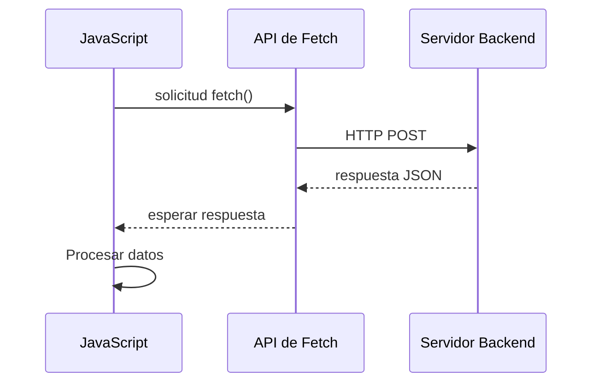
**Lo que logra esta implementación moderna:**
- **Utiliza** `async/await` para código asíncrono legible
- **Incluye** manejo adecuado de errores con bloques try/catch
- **Verifica** el estado de la respuesta antes de procesar datos
- **Establece** encabezados apropiados para comunicación JSON
- **Proporciona** mensajes detallados de error para depuración
- **Devuelve** estructura de datos consistente para casos de éxito y error

### El poder de la moderna Fetch API

**Ventajas de Fetch API sobre métodos antiguos:**

| Característica | Beneficio | Implementación |
|----------------|-----------|---------------|
| Basada en promesas | Código asíncrono limpio | `await fetch()` |
| Personalización de solicitudes | Control HTTP total | Encabezados, métodos, cuerpo |
| Manejo de respuestas | Parseo flexible de datos | `.json()`, `.text()`, `.blob()` |
| Manejo de errores | Captura completa de errores | Bloques try/catch |

> 🎥 **Aprende más**: [Async/Await Tutorial](https://youtube.com/watch?v=YwmlRkrxvkk) - Entendiendo patrones asíncronos de JavaScript para desarrollo web moderno.

**Conceptos clave para comunicación con servidor:**
- **Funciones async** permiten pausar la ejecución para esperar respuestas del servidor
- **Palabra await** hace que el código asíncrono se lea como código síncrono
- **Fetch API** provee solicitudes HTTP modernas basadas en promesas
- **Manejo de errores** asegura que tu app responda con gracia a problemas de red

### Completando la función de registro

Juntamos todo con una función de registro completa y lista para producción:

```javascript
async function register() {
  const registerForm = document.getElementById('registerForm');
  const submitButton = registerForm.querySelector('button[type="submit"]');
  
  try {
    // Mostrar estado de carga
    submitButton.disabled = true;
    submitButton.textContent = 'Creating Account...';
    
    // Procesar datos del formulario
    const formData = new FormData(registerForm);
    const jsonData = JSON.stringify(Object.fromEntries(formData));
    
    // Enviar al servidor
    const result = await createAccount(jsonData);
    
    if (result.error) {
      console.error('Registration failed:', result.error);
      alert(`Registration failed: ${result.error}`);
      return;
    }
    
    console.log('Account created successfully!', result);
    alert(`Welcome, ${result.user}! Your account has been created.`);
    
    // Restablecer el formulario después del registro exitoso
    registerForm.reset();
    
  } catch (error) {
    console.error('Unexpected error:', error);
    alert('An unexpected error occurred. Please try again.');
  } finally {
    // Restaurar estado del botón
    submitButton.disabled = false;
    submitButton.textContent = 'Create Account';
  }
}
```

**Esta implementación mejorada incluye:**
- **Proporciona** retroalimentación visual durante el envío del formulario
- **Deshabilita** el botón de enviar para evitar envíos duplicados
- **Maneja** errores esperados e inesperados con elegancia
- **Muestra** mensajes amigables de éxito y error para el usuario
- **Reinicia** el formulario tras registro exitoso
- **Restaura** el estado de la interfaz sin importar el resultado

### Probando tu implementación

**Abre las herramientas de desarrollo de tu navegador y prueba el registro:**

1. **Abre** la consola del navegador (F12 → pestaña Consola)
2. **Llena** el formulario de registro
3. **Haz clic** en "Crear Cuenta"
4. **Observa** los mensajes en consola y la retroalimentación al usuario

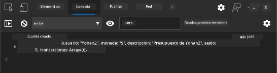

**Lo que deberías ver:**
- **Aparece estado de carga** en el botón de enviar
- **Los logs en consola** muestran información detallada del proceso
- **Aparece mensaje de éxito** cuando la creación de cuenta es exitosa
- **El formulario se reinicia** automáticamente después del envío exitoso

> 🔒 **Consideración de seguridad**: Actualmente, los datos viajan por HTTP, lo que no es seguro para producción. En aplicaciones reales, siempre usa HTTPS para cifrar la transmisión de datos. Aprende más sobre [seguridad HTTPS](https://en.wikipedia.org/wiki/HTTPS) y por qué es esencial para proteger los datos de los usuarios.

### 🔄 **Control pedagógico**
**Integración moderna de JavaScript**: Verifica tu comprensión del manejo asíncrono de formularios:
- ✅ ¿Cómo cambia `event.preventDefault()` el comportamiento predeterminado del formulario?
- ✅ ¿Por qué la API FormData es más eficiente que la recopilación manual de campos?
- ✅ ¿Cómo mejoran los patrones async/await la legibilidad del código?
- ✅ ¿Qué papel juega el manejo de errores en la experiencia del usuario?

**Arquitectura del sistema**: Tu manejo de formularios demuestra:
- **Programación dirigida por eventos**: Los formularios responden a acciones del usuario sin recargar la página
- **Comunicación asíncrona**: Las solicitudes al servidor no bloquean la interfaz de usuario
- **Manejo de errores**: Degradación elegante cuando las solicitudes de red fallan
- **Gestión de estado**: Actualizaciones de UI reflejan apropiadamente las respuestas del servidor
- **Mejora progresiva**: Funcionalidad básica worka, JavaScript la mejora

**Patrones profesionales**: Has implementado:
- **Responsabilidad única**: Funciones con propósitos claros y enfocados
- **Límites de error**: Bloques try/catch previenen fallos de aplicación
- **Retroalimentación al usuario**: Estados de carga y mensajes de éxito/error
- **Transformación de datos**: De FormData a JSON para comunicación con servidor

## Validación completa del formulario

La validación evita la frustrante experiencia de descubrir errores solo tras enviar el formulario. Al igual que los sistemas múltiples redundantes en la Estación Espacial Internacional, la validación efectiva emplea múltiples capas de controles de seguridad.

El enfoque óptimo combina validación a nivel de navegador para retroalimentación inmediata, validación en JavaScript para mejorar la experiencia del usuario y validación en el servidor para seguridad e integridad de datos. Esta redundancia asegura satisfacción del usuario y protección del sistema.

### Entendiendo las capas de validación

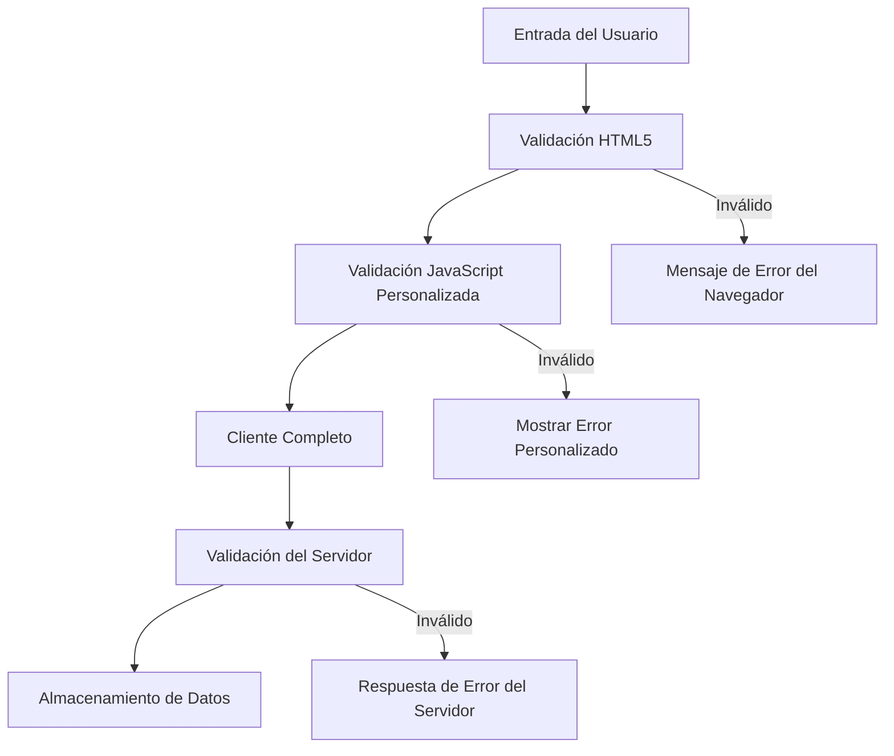
**Estrategia de validación en múltiples capas:**
- **Validación HTML5**: Controles inmediatos basados en navegador
- **Validación JavaScript**: Lógica personalizada y experiencia de usuario
- **Validación del servidor**: Chequeos finales de seguridad e integridad
- **Mejora progresiva**: Funciona incluso si JavaScript está desactivado

### Atributos de validación HTML5

**Herramientas modernas de validación a tu disposición:**

| Atributo | Propósito | Ejemplo de uso | Comportamiento del navegador |
|----------|-----------|----------------|------------------------------|
| `required` | Campos obligatorios | `<input required>` | Evita envíos vacíos |
| `minlength`/`maxlength` | Límites de longitud de texto | `<input maxlength="20">` | Aplica límites de caracteres |
| `min`/`max` | Rangos numéricos | `<input min="0" max="1000">` | Valida límites numéricos |
| `pattern` | Reglas regex personalizadas | `<input pattern="[A-Za-z]+">` | Coincide con formatos específicos |
| `type` | Validación por tipo de datos | `<input type="email">` | Validación específica por formato |

### Estilos CSS para validación

**Crea retroalimentación visual para estados de validación:**

```css
/* Valid input styling */
input:valid {
  border-color: #28a745;
  background-color: #f8fff9;
}

/* Invalid input styling */
input:invalid {
  border-color: #dc3545;
  background-color: #fff5f5;
}

/* Focus states for better accessibility */
input:focus:valid {
  box-shadow: 0 0 0 0.2rem rgba(40, 167, 69, 0.25);
}

input:focus:invalid {
  box-shadow: 0 0 0 0.2rem rgba(220, 53, 69, 0.25);
}
```

**Lo que logran estas señales visuales:**
- **Bordes verdes**: Indican validación exitosa, como luces verdes en control de misión
- **Bordes rojos**: Señalan errores de validación que requieren atención
- **Destacados de foco**: Proporcionan contexto visual claro para la ubicación actual del input
- **Estilizado consistente**: Establecen patrones interface predecibles que los usuarios aprenden

> 💡 **Consejo profesional**: Usa las pseudo-clases CSS `:valid` y `:invalid` para proveer retroalimentación visual inmediata mientras los usuarios escriben, creando una interfaz responsiva y útil.

### Implementando validación completa

Mejoremos tu formulario de registro con validación robusta que brinda excelente experiencia de usuario y calidad de datos:

```html
<form id="registerForm" method="POST" novalidate>
  <div class="form-group">
    <label for="user">Username <span class="required">*</span></label>
    <input id="user" name="user" type="text" required 
           minlength="3" maxlength="20" 
           pattern="[a-zA-Z0-9_]+" 
           autocomplete="username"
           title="Username must be 3-20 characters, letters, numbers, and underscores only">
    <small class="form-text">Choose a unique username (3-20 characters)</small>
  </div>
  
  <div class="form-group">
    <label for="currency">Currency <span class="required">*</span></label>
    <input id="currency" name="currency" type="text" required 
           value="$" maxlength="3" 
           pattern="[A-Z$€£¥₹]+" 
           title="Enter a valid currency symbol or code">
    <small class="form-text">Currency symbol (e.g., $, €, £)</small>
  </div>
  
  <div class="form-group">
    <label for="description">Account Description</label>
    <input id="description" name="description" type="text" 
           maxlength="100" 
           placeholder="Personal savings, checking, etc.">
    <small class="form-text">Optional description (up to 100 characters)</small>
  </div>
  
  <div class="form-group">
    <label for="balance">Starting Balance</label>
    <input id="balance" name="balance" type="number" 
           value="0" min="0" step="0.01" 
           title="Enter a positive number for your starting balance">
    <small class="form-text">Initial account balance (minimum $0.00)</small>
  </div>
  
  <button type="submit">Create Account</button>
</form>
```

**Entendiendo la validación mejorada:**
- **Combina** indicadores de campos obligatorios con descripciones útiles
- **Incluye** atributos `pattern` para validar formatos
- **Proporciona** atributos `title` para accesibilidad y tooltips
- **Añade** texto de ayuda para guiar la entrada del usuario
- **Usa** estructura HTML semántica para mejor accesibilidad

### Reglas avanzadas de validación

**Qué logra cada regla de validación:**

| Campo | Reglas de validación | Beneficio para el usuario |
|-------|---------------------|---------------------------|
| Nombre de usuario | `required`, `minlength="3"`, `maxlength="20"`, `pattern="[a-zA-Z0-9_]+"` | Asegura identificadores válidos y únicos |
| Moneda | `required`, `maxlength="3"`, `pattern="[A-Z$€£¥₹]+"` | Acepta símbolos comunes de moneda |
| Saldo | `min="0"`, `step="0.01"`, `type="number"` | Previene saldos negativos |
| Descripción | `maxlength="100"` | Límites razonables de longitud |

### Probando comportamiento de validación

**Prueba estos escenarios de validación:**
1. **Envía** el formulario con campos obligatorios vacíos
2. **Escribe** un nombre de usuario con menos de 3 caracteres
3. **Prueba** caracteres especiales en el campo de nombre de usuario
4. **Introduce** un saldo negativo

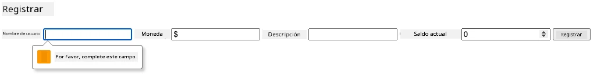

**Lo que observarás:**
- **El navegador muestra** mensajes de validación nativos
- **El estilo cambia** basado en estados `:valid` y `:invalid`
- **El envío del formulario** se previene hasta que todas las validaciones pasen
- **El foco se mueve automáticamente** al primer campo inválido

### Validación cliente vs servidor

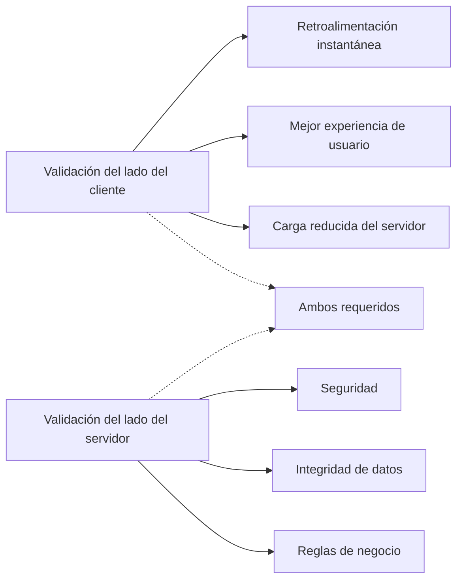
**Por qué necesitas ambas capas:**
- **Validación del lado cliente**: Proporciona retroalimentación inmediata y mejora experiencia de usuario
- **Validación del lado servidor**: Garantiza seguridad y maneja reglas complejas de negocio
- **Enfoque combinado**: Crea aplicaciones robustas, amigables y seguras
- **Mejora progresiva**: Funciona incluso si JavaScript está deshabilitado

> 🛡️ **Recordatorio de seguridad**: ¡Nunca confíes solo en la validación cliente! Usuarios malintencionados pueden evadir estas validaciones, por lo que la validación en servidor es esencial para seguridad e integridad de datos.

### ⚡ **Lo que puedes hacer en los próximos 5 minutos**
- [ ] Prueba tu formulario con datos inválidos para ver mensajes de validación
- [ ] Intenta enviar el formulario con JavaScript desactivado para ver validación HTML5
- [ ] Abre DevTools del navegador e inspecciona datos del formulario enviados al servidor
- [ ] Experimenta con diferentes tipos de entrada para ver cambios en teclado móvil

### 🎯 **Lo que puedes lograr en esta hora**
- [ ] Completa el quiz post-lección y comprende conceptos de manejo de formularios
- [ ] Implementa el desafío de validación completa con retroalimentación en tiempo real
- [ ] Agrega estilos CSS para crear formularios con apariencia profesional
- [ ] Crea manejo de errores para nombres de usuario duplicados y errores de servidor
- [ ] Añade campos de confirmación de contraseña con validación de coincidencia

### 📅 **Tu camino semanal para dominar formularios**
- [ ] Completa la app bancaria completa con características avanzadas de formularios
- [ ] Implementa capacidades de carga de archivos para fotos de perfil o documentos
- [ ] Añade formularios con múltiples pasos con indicadores de progreso y gestión de estado
- [ ] Crea formularios dinámicos que se adapten según selecciones del usuario
- [ ] Implementa autoguardado y recuperación de formularios para mejor experiencia
- [ ] Añade validación avanzada como verificación de email y formato de teléfono

### 🌟 **Tu dominio mensual del desarrollo frontend**
- [ ] Construye aplicaciones complejas de formularios con lógica condicional y flujos de trabajo
- [ ] Aprende librerías y frameworks de formularios para desarrollo rápido
- [ ] Domina directrices de accesibilidad y principios de diseño inclusivo
- [ ] Implementa internacionalización y localización para formularios globales
- [ ] Crea librerías reutilizables de componentes de formularios y sistemas de diseño
- [ ] Contribuye a proyectos open source de formularios y comparte mejores prácticas

## 🎯 Tu línea de tiempo para dominar el desarrollo de formularios

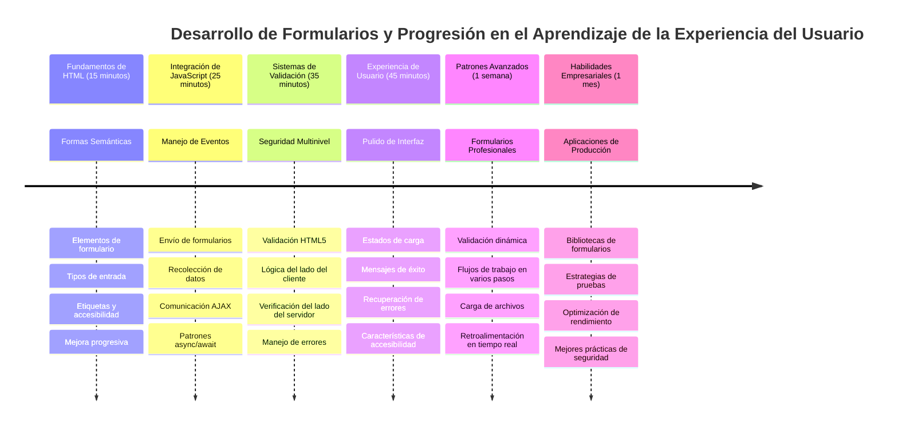
### 🛠️ Resumen de tu toolkit para desarrollo de formularios

Tras completar esta lección, ahora dominas:
- **Formularios HTML5**: Estructura semántica, tipos de entrada y accesibilidad
- **Manejo de formularios con JavaScript**: Gestión de eventos, recopilación de datos y comunicación AJAX
- **Arquitectura de validación**: Validación en múltiples capas para seguridad y experiencia de usuario
- **Programación asíncrona**: Fetch API moderna y patrones async/await
- **Gestión de errores**: Manejo integral de errores y sistemas de retroalimentación para usuarios
- **Diseño de experiencia de usuario**: Estados de carga, mensajes de éxito y recuperación de errores
- **Mejora progresiva**: Formularios que funcionan en todos los navegadores y capacidades

**Aplicaciones del mundo real**: Tus habilidades de desarrollo de formularios aplican directamente en:
- **Aplicaciones de comercio electrónico**: Procesos de pago, registro de cuentas y formularios de pago
- **Software empresarial**: Sistemas de entrada de datos, interfaces de reporte y flujos de trabajo
- **Gestión de contenido**: Plataformas de publicación, contenido generado por usuarios e interfaces administrativas
- **Aplicaciones financieras**: Interfaces bancarias, plataformas de inversión y sistemas de transacciones
- **Sistemas de salud**: Portales para pacientes, programación de citas y formularios médicos
- **Plataformas educativas**: Registro de cursos, herramientas de evaluación y gestión de aprendizaje

**Habilidades profesionales adquiridas**: Ahora puedes:
- **Diseñar** formularios accesibles que funcionen para todos los usuarios incluidos con discapacidades
- **Implementar** validación segura que previene corrupción de datos y vulnerabilidades
- **Crear** interfaces responsivas que provean retroalimentación clara y guía
- **Depurar** interacciones complejas de formularios con herramientas de desarrollo y análisis de red
- **Optimizar** rendimiento de formularios mediante manejo eficiente de datos y estrategias de validación

**Conceptos de desarrollo frontend dominados**:
- **Arquitectura dirigida por eventos**: Manejo de interacción y sistemas de respuesta
- **Programación asíncrona**: Comunicación servidor no bloqueante y manejo de errores
- **Validación de datos**: Revisiones de seguridad e integridad cliente y servidor
- **Diseño de experiencia de usuario**: Interfaces intuitivas que guían hacia el éxito
- **Ingeniería de accesibilidad**: Diseño inclusivo que funciona para diversas necesidades

**Próximo nivel**: ¡Estás listo para explorar librerías avanzadas, implementar reglas complejas o construir sistemas empresariales de recolección de datos!

🌟 **Logro desbloqueado**: ¡Has construido un sistema completo de manejo de formularios con validación profesional, manejo de errores y patrones de experiencia de usuario!

---


---

## Desafío Agente de GitHub Copilot 🚀

Usa el modo Agente para completar el siguiente desafío:

**Descripción:** Mejora el formulario de registro con validación completa en el lado cliente y retroalimentación para el usuario. Este desafío te ayudará a practicar la validación de formularios, el manejo de errores y la mejora de la experiencia con retroalimentación interactiva.
**Indicación:** Crea un sistema completo de validación de formularios para el formulario de registro que incluya: 1) Retroalimentación de validación en tiempo real para cada campo mientras el usuario escribe, 2) Mensajes de validación personalizados que aparecen debajo de cada campo de entrada, 3) Un campo de confirmación de contraseña con validación de coincidencia, 4) Indicadores visuales (como marcas de verificación verdes para campos válidos y advertencias rojas para los inválidos), 5) Un botón de envío que solo se habilita cuando todas las validaciones se cumplen. Utiliza atributos de validación HTML5, CSS para estilizar los estados de validación y JavaScript para el comportamiento interactivo.

Aprende más sobre [agent mode](https://code.visualstudio.com/blogs/2025/02/24/introducing-copilot-agent-mode) aquí.

## 🚀 Desafío

Muestra un mensaje de error en el HTML si el usuario ya existe.

Aquí tienes un ejemplo de cómo puede verse la página de inicio de sesión final después de un poco de estilo:


## Cuestionario posterior a la clase

[Cuestionario posterior a la clase](https://ff-quizzes.netlify.app/web/quiz/44)

## Revisión y autoestudio

Los desarrolladores han sido muy creativos con sus esfuerzos de construcción de formularios, especialmente en cuanto a estrategias de validación. Aprende sobre diferentes flujos de formularios explorando [CodePen](https://codepen.com); ¿puedes encontrar algunos formularios interesantes e inspiradores?

## Tarea

[Estiliza tu aplicación bancaria](assignment.md)

---

<!-- CO-OP TRANSLATOR DISCLAIMER START -->
**Aviso Legal**:  
Este documento ha sido traducido utilizando el servicio de traducción automática [Co-op Translator](https://github.com/Azure/co-op-translator). Aunque nos esforzamos por lograr precisión, tenga en cuenta que las traducciones automáticas pueden contener errores o inexactitudes. El documento original en su idioma nativo debe considerarse la fuente autorizada. Para información crítica, se recomienda la traducción profesional realizada por humanos. No nos hacemos responsables de malentendidos o interpretaciones erróneas que surjan del uso de esta traducción.
<!-- CO-OP TRANSLATOR DISCLAIMER END -->