# Construye una App Bancaria Parte 3: Métodos para Obtener y Usar Datos

Piensa en la computadora de la Enterprise en Star Trek: cuando el Capitán Picard pregunta por el estado de la nave, la información aparece al instante sin que toda la interfaz se apague y se reconstruya. Ese flujo constante de información es precisamente lo que estamos construyendo aquí con la obtención dinámica de datos.

Ahora mismo, tu app bancaria es como un periódico impreso: informativa pero estática. Vamos a transformarla en algo más parecido al centro de control de la NASA, donde los datos fluyen continuamente y se actualizan en tiempo real sin interrumpir el flujo del usuario.

Aprenderás a comunicarte con servidores de manera asíncrona, manejar datos que llegan en diferentes momentos y transformar la información en bruto en algo significativo para tus usuarios. Esta es la diferencia entre una demo y un software listo para producción.

## ⚡ Lo que Puedes Hacer en los Próximos 5 Minutos

**Ruta rápida para desarrolladores ocupados**

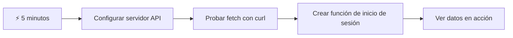
- **Minuto 1-2**: Inicia tu servidor API (`cd api && npm start`) y prueba la conexión
- **Minuto 3**: Crea una función básica `getAccount()` usando fetch
- **Minuto 4**: Conecta el formulario de inicio de sesión con `action="javascript:login()"`
- **Minuto 5**: Prueba el inicio de sesión y observa cómo aparecen los datos de la cuenta en la consola

**Comandos de prueba rápidos**:
```bash
# Verificar que la API esté en funcionamiento
curl http://localhost:5000/api

# Probar la obtención de datos de la cuenta
curl http://localhost:5000/api/accounts/test
```

**Por qué esto importa**: En 5 minutos, verás la magia de la obtención asíncrona de datos que potencia todas las aplicaciones web modernas. Esta es la base que hace que las apps se sientan rápidas y vivas.

## 🗺️ Tu Ruta de Aprendizaje a través de Aplicaciones Web Basadas en Datos

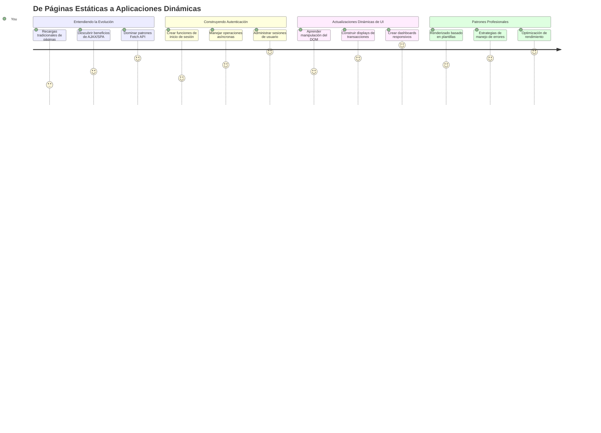
**Destino de tu ruta**: Al final de esta lección, entenderás cómo las aplicaciones web modernas obtienen, procesan y muestran datos dinámicamente, creando las experiencias de usuario fluidas que esperamos de aplicaciones profesionales.

## Quiz Pre-Clase

[Quiz pre-clase](https://ff-quizzes.netlify.app/web/quiz/45)

### Prerrequisitos

Antes de sumergirte en la obtención de datos, asegúrate de tener estos componentes listos:

- **Lección previa**: Completa el [Formulario de Inicio de Sesión y Registro](../2-forms/README.md) — construiremos sobre esta base
- **Servidor local**: Instala [Node.js](https://nodejs.org) y [ejecuta el servidor API](../api/README.md) para proveer datos de cuenta
- **Conexión API**: Prueba la conexión a tu servidor con este comando:

```bash
curl http://localhost:5000/api
# Respuesta esperada: "API Bancaria v1.0.0"
```

Esta prueba rápida asegura que todos los componentes se comuniquen correctamente:
- Verifica que Node.js esté funcionando adecuadamente en tu sistema
- Confirma que tu servidor API está activo y responde
- Valida que tu app puede alcanzar el servidor (como verificar contacto por radio antes de una misión)

## 🧠 Visión General del Ecosistema de Gestión de Datos

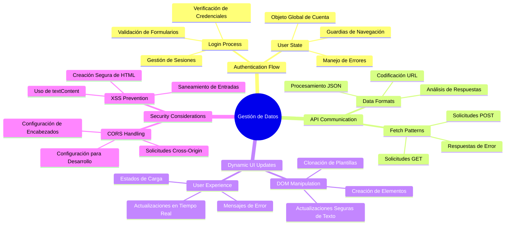
**Principio fundamental**: Las aplicaciones web modernas son sistemas de orquestación de datos: coordinan entre interfaces de usuario, APIs de servidor y modelos de seguridad del navegador para crear experiencias fluidas y responsivas.

---

## Entendiendo la Obtención de Datos en Aplicaciones Web Modernas

La manera en que las aplicaciones web manejan datos ha evolucionado dramáticamente en las últimas dos décadas. Entender esta evolución te ayudará a apreciar por qué técnicas modernas como AJAX y la API Fetch son tan poderosas y por qué se han vuelto herramientas esenciales para los desarrolladores web.

Exploremos cómo funcionaban los sitios tradicionales en comparación con las aplicaciones dinámicas y responsivas que construimos hoy.

### Aplicaciones Tradicionales de Múltiples Páginas (MPA)

En los primeros días de la web, cada clic era como cambiar de canal en un televisor antiguo: la pantalla se quedaba en blanco, luego sintonizaba lentamente el nuevo contenido. Esta era la realidad de las primeras aplicaciones web, donde cada interacción significaba reconstruir toda la página desde cero.

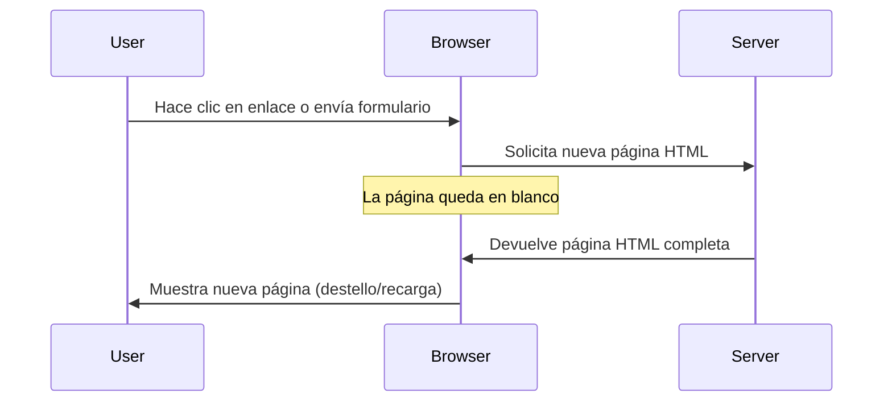
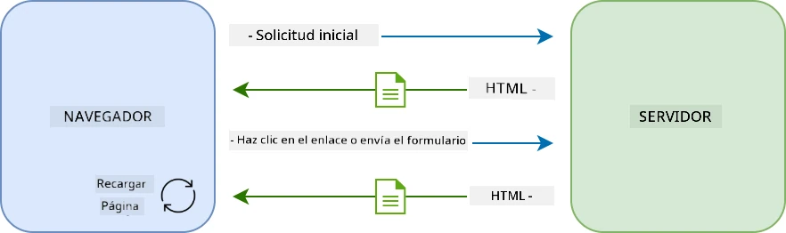

**Por qué este enfoque se sentía torpe:**
- Cada clic significaba reconstruir toda la página desde cero
- Los usuarios eran interrumpidos a mitad de una idea por esos molestos parpadeos de página
- Tu conexión a internet trabajaba horas extras descargando el mismo encabezado y pie de página repetidamente
- Las apps se sentían más como pasar páginas de un archivador que usar software

### Aplicaciones Modernas de Página Única (SPA)

AJAX (JavaScript asíncrono y XML) cambió este paradigma por completo. Como el diseño modular de la Estación Espacial Internacional, donde los astronautas pueden reemplazar componentes individuales sin reconstruir toda la estructura, AJAX nos permite actualizar partes específicas de una página sin recargar todo. A pesar del nombre que menciona XML, hoy usamos principalmente JSON, pero el principio central sigue siendo el mismo: actualizar solo lo que necesita cambiar.

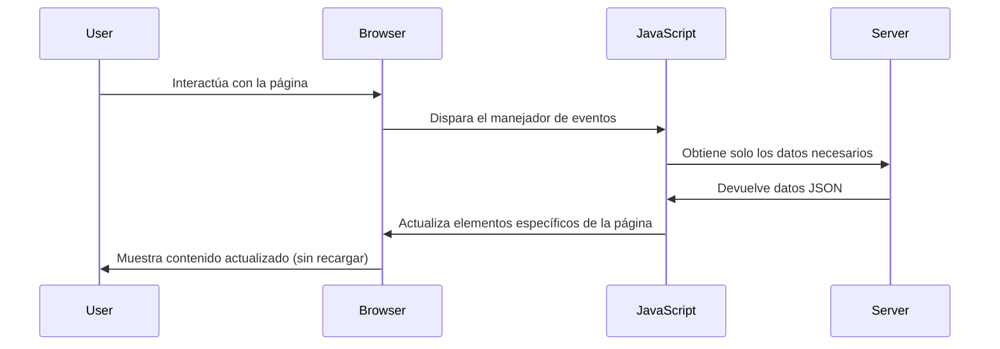
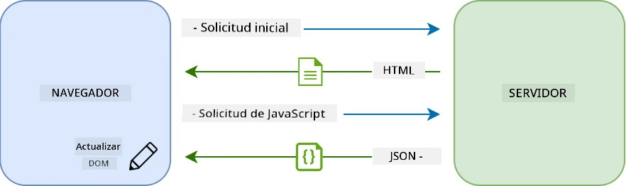

**Por qué las SPA se sienten mucho mejor:**
- Solo las partes que cambiaron realmente se actualizan (inteligente, ¿no?)
- No más interrupciones chocantes: tus usuarios mantienen su flujo
- Menos datos moviéndose por la red significa cargas más rápidas
- Todo se siente ágil y responsivo, como las apps en tu teléfono

### La Evolución hacia la API Fetch Moderna

Los navegadores modernos ofrecen la [`Fetch` API](https://developer.mozilla.org/docs/Web/API/Fetch_API), que reemplaza a la antigua [`XMLHttpRequest`](https://developer.mozilla.org/docs/Web/API/XMLHttpRequest/Using_XMLHttpRequest). Como la diferencia entre operar un telégrafo y usar correo electrónico, Fetch API usa promesas para un código asíncrono más limpio y maneja JSON de forma nativa.

| Característica | XMLHttpRequest | Fetch API |
|---------|----------------|----------|
| **Sintaxis** | Callbacks complejos | Promesas limpias |
| **Manejo JSON** | Requiere parseo manual | Método `.json()` integrado |
| **Manejo de errores** | Información de error limitada | Detalles completos de error |
| **Soporte moderno** | Compatibilidad legacy | Promesas ES6+ y async/await |

> 💡 **Compatibilidad con navegadores**: Buenas noticias: la API Fetch funciona en todos los navegadores modernos. Si tienes curiosidad por versiones específicas, [caniuse.com](https://caniuse.com/fetch) tiene la información completa.
> 
**En resumen:**
- Funciona genial en Chrome, Firefox, Safari y Edge (prácticamente donde están tus usuarios)
- Solo Internet Explorer necesita ayuda extra (y honestamente, ya es hora de dejarlo ir)
- Te prepara perfectamente para los patrones elegantes de async/await que usaremos más adelante

### Implementando Inicio de Sesión y Recuperación de Datos

Ahora implementemos el sistema de inicio de sesión que transforma tu app bancaria de una visualización estática a una aplicación funcional. Como los protocolos de autenticación usados en instalaciones militares seguras, verificaremos las credenciales del usuario y luego proporcionaremos acceso a sus datos específicos.

Lo construiremos de manera incremental, comenzando con autenticación básica y luego añadiendo las capacidades para obtener datos.

#### Paso 1: Crear la Base de la Función de Inicio de Sesión

Abre tu archivo `app.js` y añade una nueva función `login`. Esta manejará el proceso de autenticación del usuario:

```javascript
async function login() {
  const loginForm = document.getElementById('loginForm');
  const user = loginForm.user.value;
}
```

**Desglosemos esto:**
- ¿La palabra clave `async`? Le dice a JavaScript "oye, esta función podría necesitar esperar cosas"
- Estamos agarrando nuestro formulario de la página (nada fancy, solo buscándolo por su ID)
- Luego extraemos lo que el usuario escribió como nombre de usuario
- Aquí un truco: puedes acceder a cualquier entrada de formulario por su atributo `name` — ¡no necesitas más llamadas a getElementById!

> 💡 **Patrón para acceso a formulario**: Cada control de formulario puede ser accedido por su nombre (establecido en HTML con el atributo `name`) como propiedad del formulario. Esto ofrece una manera limpia y legible de obtener datos del formulario.

#### Paso 2: Crear la Función para Obtener Datos de Cuenta

Luego, crearemos una función dedicada para recuperar los datos de la cuenta del servidor. Sigue el mismo patrón que tu función de registro pero se enfoca en obtener datos:

```javascript
async function getAccount(user) {
  try {
    const response = await fetch('//localhost:5000/api/accounts/' + encodeURIComponent(user));
    return await response.json();
  } catch (error) {
    return { error: error.message || 'Unknown error' };
  }
}
```

**Esto es lo que logra este código:**
- **Usa** la moderna API `fetch` para solicitar datos de manera asíncrona
- **Construye** una URL para solicitud GET con el parámetro del nombre de usuario
- **Aplica** `encodeURIComponent()` para manejar de forma segura caracteres especiales en URLs
- **Convierte** la respuesta a formato JSON para fácil manipulación
- **Maneja** errores elegantemente devolviendo un objeto de error en vez de fallar

> ⚠️ **Nota de seguridad**: La función `encodeURIComponent()` maneja caracteres especiales en URLs. Como los sistemas de codificación usados en comunicaciones navales, asegura que tu mensaje llegue exactamente como quieres, evitando que caracteres como "#" o "&" sean malinterpretados.
> 
**Por qué esto importa:**
- Evita que caracteres especiales rompan las URLs
- Protege contra ataques de manipulación de URLs
- Asegura que tu servidor reciba los datos previstos
- Sigue prácticas de codificación segura

#### Entendiendo las Solicitudes HTTP GET

Esto puede sorprenderte: cuando usas `fetch` sin opciones adicionales, crea automáticamente una solicitud [`GET`](https://developer.mozilla.org/docs/Web/HTTP/Methods/GET). Esto es perfecto para lo que hacemos: preguntarle al servidor "oye, ¿puedo ver los datos de la cuenta de este usuario?"

Piensa en las solicitudes GET como pedir prestado un libro en la biblioteca de manera educada: estás pidiendo ver algo que ya existe. Las solicitudes POST (que usamos para el registro) son más como enviar un nuevo libro para añadir a la colección.

| Solicitud GET | Solicitud POST |
|-------------|-------------|
| **Propósito** | Recuperar datos existentes | Enviar datos nuevos al servidor |
| **Parámetros** | En la URL o query string | En el cuerpo de la solicitud |
| **Cacheo** | Puede ser cacheado por navegadores | Normalmente no se cachea |
| **Seguridad** | Visible en URL/logs | Oculto en cuerpo de la solicitud |

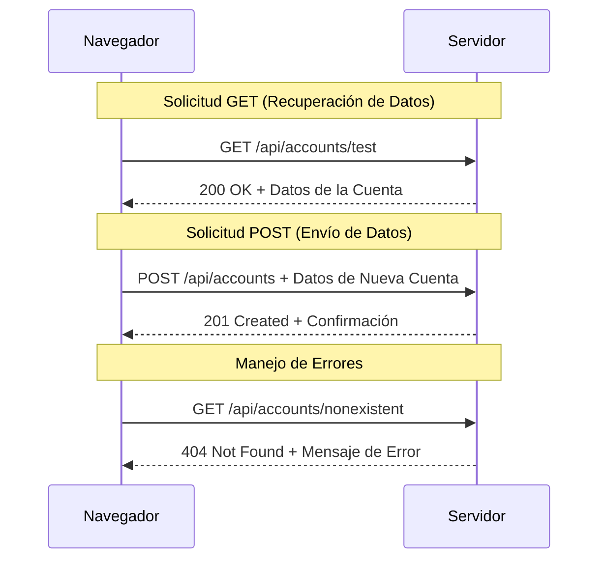
#### Paso 3: Juntándolo Todo

Ahora viene la parte satisfactoria: conectemos tu función de obtener cuenta con el proceso de inicio de sesión. Aquí es donde todo encaja:

```javascript
async function login() {
  const loginForm = document.getElementById('loginForm');
  const user = loginForm.user.value;
  const data = await getAccount(user);

  if (data.error) {
    return console.log('loginError', data.error);
  }

  account = data;
  navigate('/dashboard');
}
```

Esta función sigue una secuencia clara:
- Extrae el nombre de usuario desde la entrada del formulario
- Solicita los datos de cuenta del usuario desde el servidor
- Maneja cualquier error que ocurra durante el proceso
- Guarda los datos de la cuenta y navega al tablero al tener éxito

> 🎯 **Patrón Async/Await**: Como `getAccount` es una función asíncrona, usamos la palabra clave `await` para pausar la ejecución hasta recibir respuesta del servidor. Esto evita que el código siga con datos indefinidos.

#### Paso 4: Crear un Lugar para Tus Datos

Tu app necesita un lugar para recordar la información de la cuenta una vez cargada. Piensa en esto como la memoria a corto plazo de tu app: un lugar para mantener a la mano los datos del usuario actual. Añade esta línea al inicio de tu archivo `app.js`:

```javascript
// Esto contiene los datos de la cuenta del usuario actual
let account = null;
```

**Por qué lo necesitamos:**
- Mantiene los datos de la cuenta accesibles desde cualquier parte de tu app
- Comenzar con `null` significa "nadie ha iniciado sesión todavía"
- Se actualiza cuando alguien inicia sesión o se registra con éxito
- Actúa como una fuente única de verdad: sin confusiones sobre quién está conectado

#### Paso 5: Enlaza Tu Formulario

Ahora conectemos tu nueva función de inicio de sesión con tu formulario HTML. Actualiza la etiqueta del formulario así:

```html
<form id="loginForm" action="javascript:login()">
  <!-- Your existing form inputs -->
</form>
```

**Qué hace este pequeño cambio:**
- Detiene que el formulario haga su comportamiento por defecto de "recargar toda la página"
- Llama a tu función personalizada de JavaScript en su lugar
- Mantiene todo suave y como una SPA (Single Page Application)
- Te da control completo sobre qué pasa cuando los usuarios hacen clic en "Login"

#### Paso 6: Mejora Tu Función de Registro

Para mantener consistencia, actualiza tu función `register` para también guardar datos de cuenta y navegar al tablero:

```javascript
// Agrega estas líneas al final de tu función register
account = result;
navigate('/dashboard');
```

**Esta mejora proporciona:**
- Transición **fluida** del registro al tablero
- Experiencia **consistente** para el usuario entre flujos de inicio de sesión y registro
- Acceso **inmediato** a datos de cuenta tras un registro exitoso

#### Probando Tu Implementación

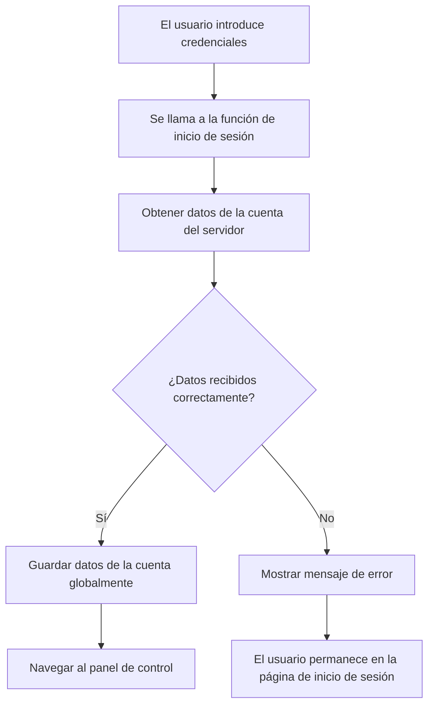
**Hora de ponerla a prueba:**
1. Crea una cuenta nueva para asegurarte que todo funciona
2. Intenta iniciar sesión con esas mismas credenciales
3. Observa la consola de tu navegador (F12) si algo parece raro
4. Asegúrate de aterrizar en el tablero tras un inicio de sesión exitoso

Si algo no funciona, ¡no te preocupes! La mayoría de errores son correcciones simples como errores de tipeo o olvidar arrancar el servidor API.

#### Una Rápida Palabra Sobre la Magia Cross-Origin

Quizás te preguntes: "¿Cómo es que mi app web está hablando con este servidor API si corren en puertos diferentes?" ¡Buena pregunta! Esto toca algo que todo desarrollador web encuentra tarde o temprano.

> 🔒 **Seguridad Cross-Origin**: Los navegadores aplican una "política de mismo origen" para evitar comunicación no autorizada entre diferentes dominios. Como un sistema de control en el Pentágono, verifican que la comunicación esté autorizada antes de permitir transferencia de datos.
> 
**En nuestra configuración:**
- Tu app web corre en `localhost:3000` (servidor de desarrollo)
- Tu servidor API corre en `localhost:5000` (servidor backend)
- El servidor API incluye [cabeceras CORS](https://developer.mozilla.org/docs/Web/HTTP/CORS) que autorizan explícitamente la comunicación desde tu app web

Esta configuración refleja el desarrollo real donde frontend y backend suelen correr en servidores separados.

> 📚 **Aprende más**: Profundiza en APIs y obtención de datos con este completo [módulo de Microsoft Learn sobre APIs](https://docs.microsoft.com/learn/modules/use-apis-discover-museum-art/?WT.mc_id=academic-77807-sagibbon).

## Dando Vida a Tus Datos en HTML

Ahora haremos visibles los datos obtenidos para los usuarios a través de manipulación del DOM. Como el proceso de revelar fotografías en un cuarto oscuro, estamos tomando datos invisibles y convirtiéndolos en algo que los usuarios pueden ver e interactuar.
La manipulación del DOM es la técnica que transforma páginas web estáticas en aplicaciones dinámicas que actualizan su contenido según las interacciones del usuario y las respuestas del servidor.

### Elegir la Herramienta Correcta para el Trabajo

Cuando se trata de actualizar tu HTML con JavaScript, tienes varias opciones. Piensa en ellas como diferentes herramientas en una caja de herramientas, cada una perfecta para trabajos específicos:

| Método | Para qué es ideal | Cuándo usarlo | Nivel de seguridad |
|--------|-------------------|---------------|--------------------|
| `textContent` | Mostrar datos del usuario de forma segura | Cada vez que muestres texto | ✅ Muy seguro |
| `createElement()` + `append()` | Construir diseños complejos | Crear nuevas secciones/listas | ✅ A prueba de balas |
| `innerHTML` | Establecer contenido HTML | ⚠️ Trata de evitar este | ❌ Negocio riesgoso |

#### La Forma Segura de Mostrar Texto: textContent

La propiedad [`textContent`](https://developer.mozilla.org/docs/Web/API/Node/textContent) es tu mejor aliada para mostrar datos del usuario. Es como tener un portero en tu página web: nada dañino pasa:

```javascript
// La forma segura y confiable de actualizar texto
const balanceElement = document.getElementById('balance');
balanceElement.textContent = account.balance;
```

**Beneficios de textContent:**
- Trata todo como texto plano (evita la ejecución de scripts)
- Limpia automáticamente el contenido existente
- Eficiente para actualizaciones de texto simples
- Proporciona seguridad integrada contra contenido malicioso

#### Crear Elementos HTML Dinámicos

Para contenido más complejo, combina [`document.createElement()`](https://developer.mozilla.org/docs/Web/API/Document/createElement) con el método [`append()`](https://developer.mozilla.org/docs/Web/API/ParentNode/append):

```javascript
// Forma segura de crear nuevos elementos
const transactionItem = document.createElement('div');
transactionItem.className = 'transaction-item';
transactionItem.textContent = `${transaction.date}: ${transaction.description}`;
container.append(transactionItem);
```

**Comprendiendo este enfoque:**
- **Crea** elementos DOM nuevos programáticamente
- **Mantiene** control total sobre atributos y contenido del elemento
- **Permite** estructuras complejas y anidadas de elementos
- **Preserva** la seguridad al separar estructura de contenido

> ⚠️ **Consideración de Seguridad**: Aunque [`innerHTML`](https://developer.mozilla.org/docs/Web/API/Element/innerHTML) aparece en muchos tutoriales, puede ejecutar scripts incrustados. Al igual que los protocolos de seguridad en CERN que previenen la ejecución no autorizada de código, usar `textContent` y `createElement` provee alternativas más seguras.
> 
**Riesgos de innerHTML:**
- Ejecuta cualquier etiqueta `<script>` en datos de usuario
- Es vulnerable a ataques de inyección de código
- Crea posibles vulnerabilidades de seguridad
- Las alternativas seguras que usamos proporcionan funcionalidad equivalente

### Hacer Que Los Errores Sean Amigables para el Usuario

Actualmente, los errores de inicio de sesión solo aparecen en la consola del navegador, que es invisible para los usuarios. Como la diferencia entre los diagnósticos internos de un piloto y el sistema de información para pasajeros, necesitamos comunicar información importante por el canal adecuado.

Implementar mensajes de error visibles proporciona a los usuarios retroalimentación inmediata sobre lo que salió mal y cómo proceder.

#### Paso 1: Añadir un Espacio para Mensajes de Error

Primero, demos un lugar para los mensajes de error en tu HTML. Añade esto justo antes de tu botón de inicio de sesión para que los usuarios lo vean naturalmente:

```html
<!-- This is where error messages will appear -->
<div id="loginError" role="alert"></div>
<button>Login</button>
```

**Qué sucede aquí:**
- Creamos un contenedor vacío que permanece invisible hasta ser necesario
- Está posicionado donde los usuarios naturalmente miran después de hacer clic en "Login"
- Ese `role="alert"` es un toque genial para lectores de pantalla: indica a la tecnología asistiva "¡hey, esto es importante!"
- El `id` único da a nuestro JavaScript un objetivo fácil

#### Paso 2: Crear una Función Auxiliar Útil

Vamos a hacer una pequeña función útil que pueda actualizar el texto de cualquier elemento. Esta es una de esas funciones de "escribir una vez, usar en todas partes" que te ahorrarán tiempo:

```javascript
function updateElement(id, text) {
  const element = document.getElementById(id);
  element.textContent = text;
}
```

**Beneficios de la función:**
- Interfaz simple que solo requiere un ID de elemento y texto
- Localiza y actualiza elementos del DOM de forma segura
- Patrón reutilizable que reduce la duplicación de código
- Mantiene un comportamiento consistente de actualización en toda la app

#### Paso 3: Mostrar Errores Donde Los Usuarios Puedan Verlos

Ahora reemplacemos ese mensaje oculto en la consola con algo que los usuarios realmente puedan ver. Actualiza tu función de inicio de sesión:

```javascript
// En lugar de solo registrar en la consola, mostrar al usuario qué está mal
if (data.error) {
  return updateElement('loginError', data.error);
}
```

**Este pequeño cambio hace una gran diferencia:**
- Los mensajes de error aparecen justo donde los usuarios miran
- No más fallos silenciosos y misteriosos
- Los usuarios reciben retroalimentación inmediata y accionable
- Tu app comienza a sentirse profesional y cuidadosa

¡Ahora, cuando pruebes con una cuenta inválida, verás un mensaje de error útil directamente en la página!


#### Paso 4: Ser Inclusivos con la Accesibilidad

Algo genial sobre ese `role="alert"` que agregamos antes: ¡no es solo decoración! Este pequeño atributo crea lo que se llama una [Región en Vivo](https://developer.mozilla.org/docs/Web/Accessibility/ARIA/ARIA_Live_Regions) que anuncia cambios inmediatamente a los lectores de pantalla:

```html
<div id="loginError" role="alert"></div>
```

**Por qué esto importa:**
- Los usuarios de lectores de pantalla escuchan el mensaje de error justo cuando aparece
- Todos reciben la misma información importante, sin importar cómo navegan
- Es una forma sencilla de hacer que tu app funcione para más personas
- Demuestra que te importa crear experiencias inclusivas

Pequeños detalles como este separan a los buenos desarrolladores de los excelentes.

### 🎯 Revisión Pedagógica: Patrones de Autenticación

**Pausa y Reflexión**: Acabas de implementar un flujo completo de autenticación. Este es un patrón fundamental en desarrollo web.

**Autoevaluación rápida**:
- ¿Puedes explicar por qué usamos async/await para las llamadas a APIs?
- ¿Qué pasaría si olvidamos la función `encodeURIComponent()`?
- ¿Cómo mejora nuestro manejo de errores la experiencia del usuario?

**Conexión con el Mundo Real**: Los patrones que aprendiste aquí (obtener datos asíncronamente, manejo de errores, retroalimentación al usuario) se usan en todas las grandes aplicaciones web, desde redes sociales hasta sitios de comercio electrónico. ¡Estás construyendo habilidades de nivel profesional!

**Pregunta de desafío**: ¿Cómo podrías modificar este sistema de autenticación para manejar múltiples roles de usuario (cliente, administrador, cajero)? Piensa en la estructura de datos y los cambios en la interfaz de usuario necesarios.

#### Paso 5: Aplicar el Mismo Patrón a Registro

Por consistencia, implementa el manejo de errores idéntico en tu formulario de registro:

1. **Agrega** un elemento para mostrar errores en tu HTML de registro:
```html
<div id="registerError" role="alert"></div>
```

2. **Actualiza** tu función de registro para usar el mismo patrón de muestra de errores:
```javascript
if (data.error) {
  return updateElement('registerError', data.error);
}
```

**Beneficios de un manejo consistente de errores:**
- **Proporciona** una experiencia de usuario uniforme en todos los formularios
- **Reduce** la carga cognitiva usando patrones familiares
- **Simplifica** el mantenimiento con código reutilizable
- **Garantiza** que se cumplan estándares de accesibilidad en toda la app

## Crear Tu Panel Dinámico

Ahora transformaremos tu panel estático en una interfaz dinámica que muestra datos reales de la cuenta. Como la diferencia entre un horario de vuelo impreso y los tableros de salidas en vivo en aeropuertos, pasamos de información estática a pantallas en tiempo real y receptivas.

Usando las técnicas de manipulación del DOM que aprendiste, crearemos un panel que se actualiza automáticamente con la información actual de la cuenta.

### Conociendo Tus Datos

Antes de empezar a construir, echemos un vistazo al tipo de datos que tu servidor envía de vuelta. Cuando alguien inicia sesión con éxito, aquí está el tesoro de información con el que trabajas:

```json
{
  "user": "test",
  "currency": "$",
  "description": "Test account",
  "balance": 75,
  "transactions": [
    { "id": "1", "date": "2020-10-01", "object": "Pocket money", "amount": 50 },
    { "id": "2", "date": "2020-10-03", "object": "Book", "amount": -10 },
    { "id": "3", "date": "2020-10-04", "object": "Sandwich", "amount": -5 }
  ]
}
```

**Esta estructura de datos proporciona:**
- **`user`**: Perfecto para personalizar la experiencia ("¡Bienvenida de nuevo, Sarah!")
- **`currency`**: Asegura que mostramos cantidades de dinero correctamente
- **`description`**: Un nombre amigable para la cuenta
- **`balance`**: El vital saldo actual
- **`transactions`**: El historial completo de transacciones con todos los detalles

¡Todo lo necesario para construir un panel bancario profesional!

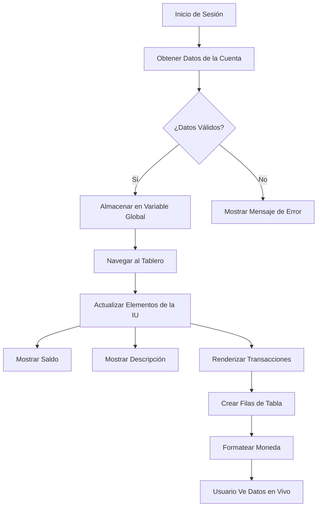
> 💡 **Consejo Profesional**: ¿Quieres ver tu panel en acción de inmediato? Usa el nombre de usuario `test` al iniciar sesión — viene precargado con datos de ejemplo para que puedas ver todo funcionando sin tener que crear transacciones primero.
> 
**Por qué la cuenta de prueba es útil:**
- Viene con datos de ejemplo realistas ya cargados
- Perfecto para ver cómo se muestran las transacciones
- Ideal para probar las funciones de tu panel
- Te ahorra tener que crear datos ficticios manualmente

### Crear Los Elementos del Panel de Control

Construyamos la interfaz de tu panel paso a paso, empezando con la información resumida de la cuenta y luego avanzando a características más complejas como la lista de transacciones.

#### Paso 1: Actualiza Tu Estructura HTML

Primero, reemplaza la sección estática de "Balance" con elementos marcadores dinámicos que tu JavaScript pueda llenar:

```html
<section>
  Balance: <span id="balance"></span><span id="currency"></span>
</section>
```

Luego, añade una sección para la descripción de la cuenta. Como actúa como título para el contenido del panel, usa HTML semántico:

```html
<h2 id="description"></h2>
```

**Comprendiendo la estructura HTML:**
- **Usa** elementos `<span>` separados para saldo y moneda para controlar individualmente cada uno
- **Aplica** IDs únicos a cada elemento para que JavaScript los seleccione
- **Sigue** HTML semántico usando `<h2>` para la descripción de la cuenta
- **Crea** una jerarquía lógica para lectores de pantalla y SEO

> ✅ **Información sobre accesibilidad**: La descripción de la cuenta funciona como título del contenido del panel, por eso está marcada semánticamente como encabezado. Aprende más sobre cómo la [estructura de encabezados](https://www.nomensa.com/blog/2017/how-structure-headings-web-accessibility) afecta la accesibilidad. ¿Puedes identificar otros elementos en tu página que podrían beneficiarse de etiquetas de encabezado?

#### Paso 2: Crear la Función de Actualización del Panel

Ahora crea una función que llene tu panel con datos reales de la cuenta:

```javascript
function updateDashboard() {
  if (!account) {
    return navigate('/login');
  }

  updateElement('description', account.description);
  updateElement('balance', account.balance.toFixed(2));
  updateElement('currency', account.currency);
}
```

**Paso a paso, esto hace esta función:**
- **Valida** que existan datos de la cuenta antes de continuar
- **Redirige** a usuarios no autenticados de vuelta a la página de inicio de sesión
- **Actualiza** la descripción de la cuenta usando la función reutilizable `updateElement`
- **Formatea** el saldo para mostrar siempre dos decimales
- **Muestra** el símbolo de moneda adecuado

> 💰 **Formateo de dinero**: Ese método [`toFixed(2)`](https://developer.mozilla.org/docs/Web/JavaScript/Reference/Global_Objects/Number/toFixed) es un salvavidas. Asegura que tu saldo siempre se vea como dinero real — "75.00" en lugar de solo "75". Tus usuarios apreciarán ver el formato correcto de moneda.

#### Paso 3: Asegurar que Tu Panel se Actualice

Para asegurar que tu panel se refresque con datos actuales cada vez que alguien lo visite, necesitamos conectarnos a tu sistema de navegación. Si completaste la [tarea de la lección 1](../1-template-route/assignment.md), esto te resultará familiar. Si no, no te preocupes, aquí está lo que necesitas:

Añade esto al final de tu función `updateRoute()`:

```javascript
if (typeof route.init === 'function') {
  route.init();
}
```

Luego actualiza tus rutas para incluir la inicialización del panel:

```javascript
const routes = {
  '/login': { templateId: 'login' },
  '/dashboard': { templateId: 'dashboard', init: updateDashboard }
};
```

**Lo que este inteligente arreglo hace:**
- Verifica si una ruta tiene código especial de inicialización
- Ejecuta ese código automáticamente cuando la ruta se carga
- Asegura que tu panel siempre muestre datos frescos y actuales
- Mantiene limpia y organizada la lógica de enrutamiento

#### Prueba Tu Panel

Después de implementar estos cambios, prueba tu panel:

1. **Inicia sesión** con una cuenta de prueba
2. **Verifica** que te redirige al panel
3. **Confirma** que la descripción de la cuenta, saldo y moneda se muestran correctamente
4. **Intenta cerrar sesión y volver a iniciar** para asegurar que los datos se refrescan bien

¡Tu panel ahora debería mostrar información dinámica de la cuenta que se actualiza con los datos del usuario conectado!

## Construir Listas Inteligentes de Transacciones con Plantillas

En vez de crear manualmente HTML para cada transacción, usaremos plantillas para generar automáticamente un formato consistente. Como los componentes estandarizados usados en la fabricación de naves espaciales, las plantillas aseguran que cada fila de transacción siga la misma estructura y apariencia.

Esta técnica escala eficientemente de pocas transacciones a miles, manteniendo un rendimiento y presentación consistentes.

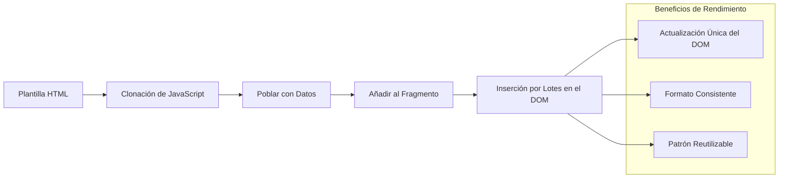
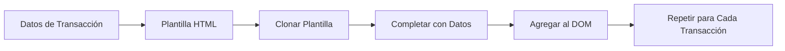
### Paso 1: Crear la Plantilla de Transacciones

Primero, agrega una plantilla reutilizable para filas de transacciones en el `<body>` de tu HTML:

```html
<template id="transaction">
  <tr>
    <td></td>
    <td></td>
    <td></td>
  </tr>
</template>
```

**Entendiendo las plantillas HTML:**
- **Define** la estructura para una fila de tabla única
- **Permanece** invisible hasta ser clonada y llenada con JavaScript
- **Incluye** tres celdas para fecha, descripción y monto
- **Proporciona** un patrón reutilizable para formato consistente

### Paso 2: Preparar Tu Tabla para Contenido Dinámico

Luego, añade un `id` a tu cuerpo de tabla para que JavaScript pueda apuntarlo fácilmente:

```html
<tbody id="transactions"></tbody>
```

**Qué logra esto:**
- **Crea** un objetivo claro para insertar filas de transacciones
- **Separa** la estructura de la tabla del contenido dinámico
- **Permite** limpiar y rellenar fácilmente los datos de transacciones

### Paso 3: Construir la Función Fábrica de Filas de Transacciones

Ahora crea una función que transforme los datos de una transacción en elementos HTML:

```javascript
function createTransactionRow(transaction) {
  const template = document.getElementById('transaction');
  const transactionRow = template.content.cloneNode(true);
  const tr = transactionRow.querySelector('tr');
  tr.children[0].textContent = transaction.date;
  tr.children[1].textContent = transaction.object;
  tr.children[2].textContent = transaction.amount.toFixed(2);
  return transactionRow;
}
```

**Desglose de esta función fábrica:**
- **Recupera** el elemento plantilla por su ID
- **Clona** el contenido de la plantilla para manipulación segura
- **Selecciona** la fila de tabla dentro del contenido clonado
- **Llena** cada celda con datos de la transacción
- **Formatea** el monto mostrando los decimales correctamente
- **Devuelve** la fila completa lista para insertar

### Paso 4: Generar Múltiples Filas de Transacciones Eficientemente

Añade este código a tu función `updateDashboard()` para mostrar todas las transacciones:

```javascript
const transactionsRows = document.createDocumentFragment();
for (const transaction of account.transactions) {
  const transactionRow = createTransactionRow(transaction);
  transactionsRows.appendChild(transactionRow);
}
updateElement('transactions', transactionsRows);
```

**Comprendiendo este enfoque eficiente:**
- **Crea** un fragmento de documento para agrupar operaciones DOM
- **Itera** por todas las transacciones en los datos de la cuenta
- **Genera** una fila por cada transacción usando la función fábrica
- **Reúne** todas las filas en el fragmento antes de agregarlas al DOM
- **Realiza** una única actualización del DOM en lugar de múltiples inserciones individuales
> ⚡ **Optimización del Rendimiento**: [`document.createDocumentFragment()`](https://developer.mozilla.org/docs/Web/API/Document/createDocumentFragment) funciona como el proceso de ensamblaje en Boeing: los componentes se preparan fuera de la línea principal, luego se instalan como una unidad completa. Este enfoque por lotes minimiza los reflujo del DOM al realizar una única inserción en lugar de múltiples operaciones individuales.

### Paso 5: Mejorar la Función de Actualización para Contenido Mixto

Tu función `updateElement()` actualmente solo maneja contenido de texto. Actualízala para que funcione con texto y nodos DOM:

```javascript
function updateElement(id, textOrNode) {
  const element = document.getElementById(id);
  element.textContent = ''; // Removes all children
  element.append(textOrNode);
}
```

**Mejoras clave en esta actualización:**
- **Limpia** el contenido existente antes de agregar nuevo contenido
- **Acepta** ya sea cadenas de texto o nodos DOM como parámetros
- **Usa** el método [`append()`](https://developer.mozilla.org/docs/Web/API/ParentNode/append) para mayor flexibilidad
- **Mantiene** compatibilidad hacia atrás con el uso basado en texto existente

### Pon a Prueba tu Panel de Control

¡Es hora del momento de la verdad! Veamos tu panel de control dinámico en acción:

1. Inicia sesión usando la cuenta `test` (tiene datos de muestra listos para usar)
2. Navega a tu panel de control
3. Verifica que aparezcan filas de transacciones con el formato correcto
4. Confirma que las fechas, descripciones y cantidades se vean bien

Si todo está funcionando, ¡deberías ver una lista de transacciones completamente funcional en tu panel! 🎉

**Lo que has logrado:**
- Construiste un panel que escala con cualquier cantidad de datos
- Creaste plantillas reutilizables para formato consistente
- Implementaste técnicas eficientes de manipulación del DOM
- Desarrollaste una funcionalidad comparable a aplicaciones bancarias de producción

Has transformado con éxito una página web estática en una aplicación web dinámica.

### 🎯 Comprobación Pedagógica: Generación Dinámica de Contenido

**Comprensión de la Arquitectura**: Has implementado una canalización sofisticada de datos a UI que refleja patrones usados en frameworks como React, Vue y Angular.

**Conceptos Clave Dominados**:
- **Renderizado basado en plantillas**: Crear componentes UI reutilizables
- **Fragmentos de documento**: Optimizar el rendimiento del DOM
- **Manipulación segura del DOM**: Prevenir vulnerabilidades de seguridad
- **Transformación de datos**: Convertir datos del servidor en interfaces de usuario

**Conexión con la Industria**: Estas técnicas forman la base de frameworks frontend modernos. El DOM virtual de React, el sistema de plantillas de Vue y la arquitectura de componentes de Angular se construyen sobre estos conceptos clave.

**Pregunta de reflexión**: ¿Cómo extenderías este sistema para manejar actualizaciones en tiempo real (como nuevas transacciones que aparezcan automáticamente)? Considera WebSockets o Server-Sent Events.

---

## 📈 Tu Cronología de Maestría en Gestión de Datos

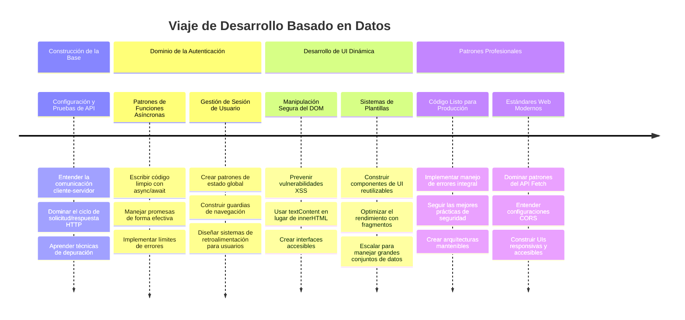
**🎓 Hito de Graduación**: Has construido exitosamente una aplicación web completa impulsada por datos utilizando patrones modernos de JavaScript. Estas habilidades se traducen directamente a trabajar con frameworks como React, Vue o Angular.

**🔄 Capacidades de Siguiente Nivel**:
- Listo para explorar frameworks frontend que se basan en estos conceptos
- Preparado para implementar funciones en tiempo real con WebSockets
- Equipado para construir Progressive Web Apps con capacidades offline
- Base establecida para aprender patrones avanzados de gestión de estado

## Desafío del Agente GitHub Copilot 🚀

Usa el modo Agente para completar el siguiente desafío:

**Descripción:** Mejora la app bancaria implementando una función de búsqueda y filtrado de transacciones que permita a los usuarios encontrar transacciones específicas por rango de fechas, monto o descripción.

**Solicitud:** Crea una funcionalidad de búsqueda para la app bancaria que incluya: 1) Un formulario de búsqueda con campos de entrada para rango de fechas (desde/hasta), monto mínimo/máximo y palabras clave en la descripción de la transacción, 2) Una función `filterTransactions()` que filtre el arreglo account.transactions según los criterios de búsqueda, 3) Actualiza la función `updateDashboard()` para mostrar los resultados filtrados, y 4) Agrega un botón "Limpiar Filtros" para restablecer la vista. Usa métodos modernos de arreglos en JavaScript como `filter()` y maneja casos límite para criterios de búsqueda vacíos.

Aprende más sobre [modo agente](https://code.visualstudio.com/blogs/2025/02/24/introducing-copilot-agent-mode) aquí.

## 🚀 Desafío

¿Listo para llevar tu app bancaria al siguiente nivel? Hagámosla lucir y sentirse como algo que realmente querrías usar. Aquí tienes algunas ideas para despertar tu creatividad:

**Hazla hermosa**: Agrega estilos CSS para transformar tu panel funcional en algo visualmente atractivo. Piensa en líneas limpias, buen espaciado e incluso algunas animaciones sutiles.

**Hazla responsiva**: Intenta usar [media queries](https://developer.mozilla.org/docs/Web/CSS/Media_Queries) para crear un [diseño responsivo](https://developer.mozilla.org/docs/Web/Progressive_web_apps/Responsive/responsive_design_building_blocks) que funcione bien en teléfonos, tablets y escritorios. ¡Tus usuarios te lo agradecerán!

**Añade estilo**: Considera codificar por colores las transacciones (verde para ingresos, rojo para gastos), agregar íconos o crear efectos hover que hagan que la interfaz se sienta interactiva.

Así podría verse un panel pulido:

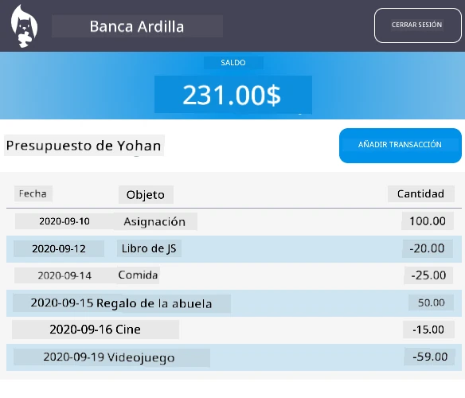

No sientas que tienes que igualar esto exactamente, úsalo como inspiración y hazlo tuyo.

## Cuestionario Post-Clase

[Cuestionario post-clase](https://ff-quizzes.netlify.app/web/quiz/46)

## Tarea

[Refactoriza y comenta tu código](assignment.md)

---

<!-- CO-OP TRANSLATOR DISCLAIMER START -->
**Aviso Legal**:  
Este documento ha sido traducido utilizando el servicio de traducción automática [Co-op Translator](https://github.com/Azure/co-op-translator). Aunque nos esforzamos por lograr precisión, tenga en cuenta que las traducciones automáticas pueden contener errores o imprecisiones. El documento original en su idioma nativo debe considerarse la fuente autorizada. Para información crítica, se recomienda una traducción profesional humana. No nos responsabilizamos por ningún malentendido o interpretación errónea que surja del uso de esta traducción.
<!-- CO-OP TRANSLATOR DISCLAIMER END -->