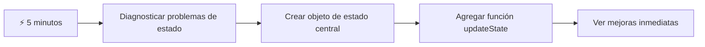
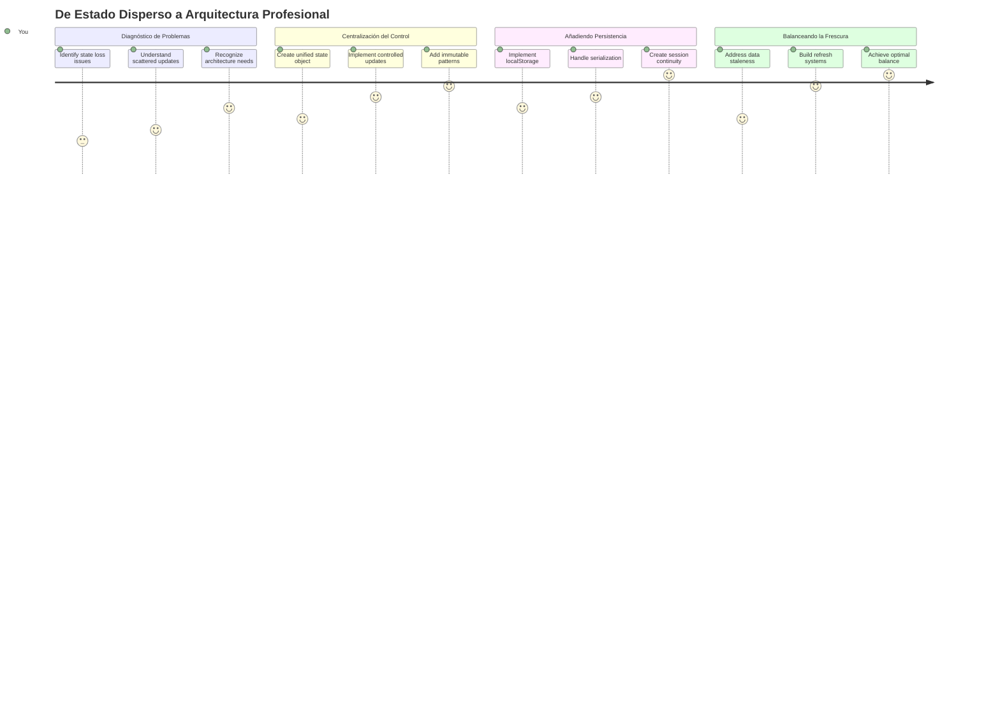
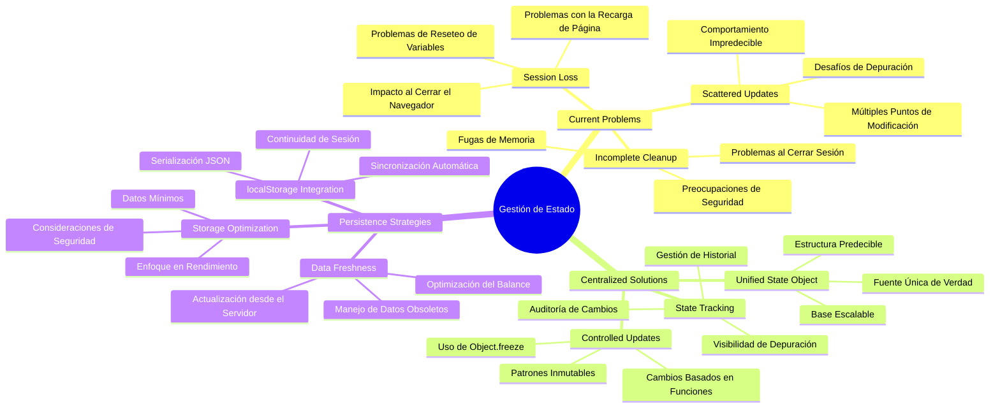
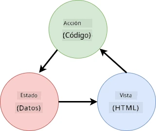
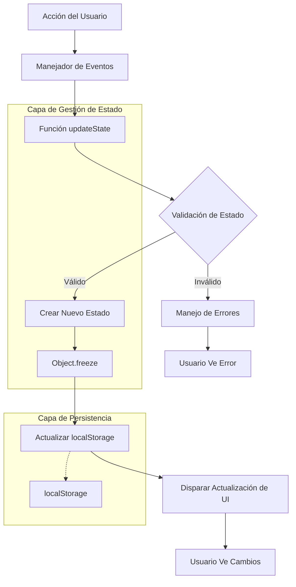
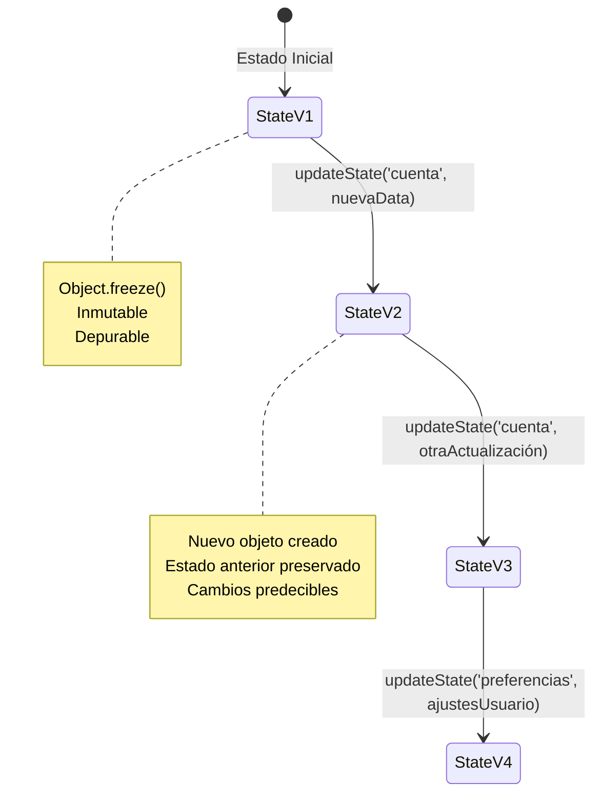
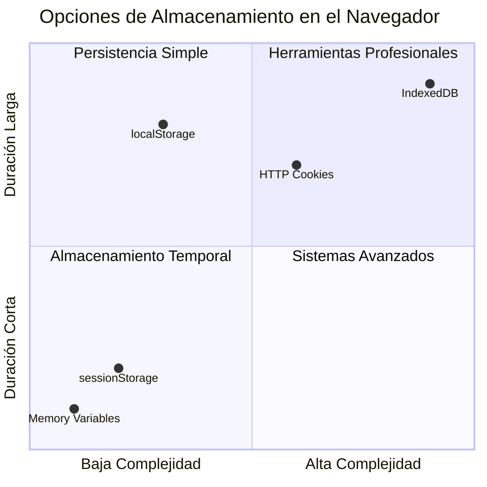
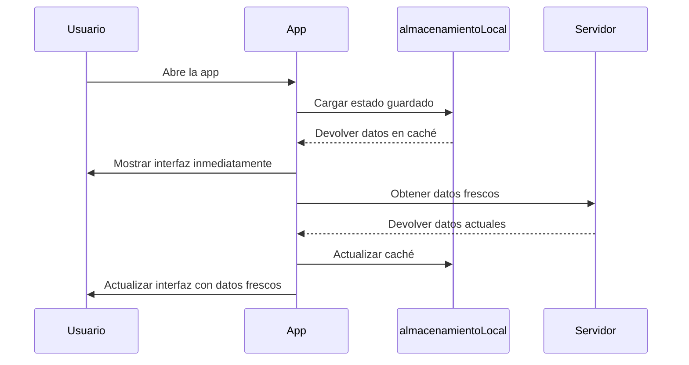
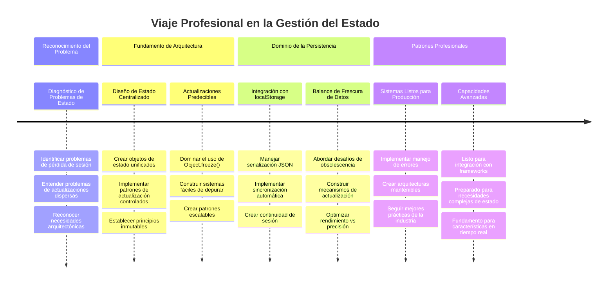
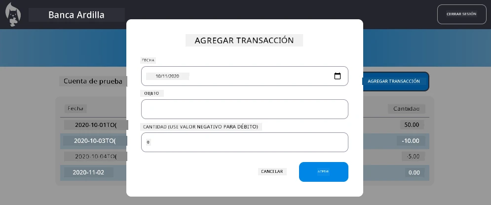

# Construye una App Bancaria Parte 4: Conceptos de Gestión de Estado

## ⚡ Lo Que Puedes Hacer en los Próximos 5 Minutos

**Ruta de Inicio Rápido para Desarrolladores Ocupados**


- **Minuto 1**: Prueba el problema actual de estado - inicia sesión, actualiza la página, observa el cierre de sesión
- **Minuto 2**: Reemplaza `let account = null` por `let state = { account: null }`
- **Minuto 3**: Crea una función simple `updateState()` para actualizaciones controladas
- **Minuto 4**: Actualiza una función para usar el nuevo patrón
- **Minuto 5**: Prueba la mejorada previsibilidad y capacidad de depuración

**Prueba de Diagnóstico Rápido**:
```javascript
// Antes: Estado disperso
let account = null; // ¡Se pierde al actualizar!

// Después: Estado centralizado
let state = Object.freeze({ account: null }); // ¡Controlado y rastreable!
```

**Por Qué Esto Importa**: En 5 minutos, experimentarás la transformación de una gestión de estado caótica a patrones predecibles y depurables. Esta es la base que hace que las aplicaciones complejas sean mantenibles.

## 🗺️ Tu Viaje de Aprendizaje Hacia la Maestría en Gestión de Estado


**Tu Destino en este Viaje**: Al final de esta lección, habrás construido un sistema de gestión de estado de nivel profesional que maneja persistencia, frescura de datos y actualizaciones predecibles – los mismos patrones usados en aplicaciones en producción.

## Cuestionario Previo a la Lección

[Cuestionario previo a la lección](https://ff-quizzes.netlify.app/web/quiz/47)

## Introducción

La gestión de estado es como el sistema de navegación de la nave Voyager – cuando todo funciona sin problemas, apenas notas que está ahí. Pero cuando algo falla, se convierte en la diferencia entre alcanzar el espacio interestelar o quedar perdido en el vacío cósmico. En desarrollo web, el estado representa todo lo que tu aplicación necesita recordar: estado de inicio de sesión del usuario, datos de formularios, historial de navegación y estados temporales de la interfaz.

A medida que tu app bancaria ha evolucionado de un simple formulario de inicio de sesión a una aplicación más sofisticada, probablemente hayas encontrado algunos desafíos comunes. Refrescar la página y los usuarios se desconectan inesperadamente. Cerrar el navegador y todo el progreso desaparece. Depurar un problema y estás buscando entre múltiples funciones que modifican los mismos datos de maneras diferentes.

Estos no son signos de mala codificación – son los dolores de crecimiento naturales que ocurren cuando las aplicaciones alcanzan cierto umbral de complejidad. Cada desarrollador enfrenta estos desafíos a medida que sus apps pasan de "prueba de concepto" a "lista para producción."

En esta lección, implementaremos un sistema centralizado de gestión de estado que transformará tu app bancaria en una aplicación confiable y profesional. Aprenderás a manejar los flujos de datos de forma predecible, persistir las sesiones de usuario apropiadamente y crear la experiencia suave que las aplicaciones web modernas requieren.

## Requisitos Previos

Antes de sumergirte en los conceptos de gestión de estado, necesitas tener tu entorno de desarrollo configurado correctamente y la base de tu app bancaria en su lugar. Esta lección construye directamente sobre los conceptos y código de partes anteriores de esta serie.

Asegúrate de tener los siguientes componentes listos antes de continuar:

**Configuración Requerida:**
- Completa la [lección de obtención de datos](../3-data/README.md) – tu app debería cargar y mostrar datos de cuenta con éxito
- Instala [Node.js](https://nodejs.org) en tu sistema para ejecutar el API backend
- Inicia el [servidor API](../api/README.md) localmente para manejar las operaciones de datos de cuenta

**Probando Tu Entorno:**

Verifica que tu servidor API está funcionando correctamente ejecutando este comando en una terminal:

```sh
curl http://localhost:5000/api
# -> debería devolver "Bank API v1.0.0" como resultado
```

**Qué hace este comando:**
- **Envía** una petición GET a tu servidor API local
- **Prueba** la conexión y verifica que el servidor responde
- **Devuelve** la información de la versión del API si todo funciona correctamente

## 🧠 Descripción General de la Arquitectura de Gestión de Estado


**Principio Básico**: La gestión de estado profesional equilibra previsibilidad, persistencia y rendimiento para crear experiencias de usuario confiables que escalan desde interacciones simples hasta flujos de trabajo complejos en aplicaciones.

---

## Diagnóstico de los Problemas Actuales de Estado

Como Sherlock Holmes examinando una escena del crimen, necesitamos entender exactamente qué está pasando en nuestra implementación actual antes de resolver el misterio de las sesiones de usuario que desaparecen.

Realicemos un experimento simple que revela los desafíos subyacentes en la gestión de estado:

**🧪 Prueba de Diagnóstico:**
1. Inicia sesión en tu app bancaria y navega al panel principal
2. Refresca la página del navegador
3. Observa qué sucede con tu estado de inicio de sesión

Si eres redirigido a la pantalla de inicio de sesión, has descubierto el clásico problema de persistencia de estado. Este comportamiento ocurre porque nuestra implementación actual almacena los datos del usuario en variables JavaScript que se reinician con cada carga de página.

**Problemas de la Implementación Actual:**

La simple variable `account` de nuestra [lección anterior](../3-data/README.md) crea tres problemas significativos que afectan tanto la experiencia de usuario como la mantenibilidad del código:

| Problema | Causa Técnica | Impacto para el Usuario |
|---------|--------|----------------|
| **Pérdida de sesión** | La actualización de página borra variables JavaScript | Los usuarios deben autenticarse frecuentemente |
| **Actualizaciones dispersas** | Múltiples funciones modifican estado directamente | La depuración se vuelve cada vez más difícil |
| **Limpieza incompleta** | El cierre de sesión no borra todas las referencias de estado | Posibles preocupaciones de seguridad y privacidad |

**El Desafío Arquitectónico:**

Como el diseño compartimentado del Titanic que parecía robusto hasta que múltiples compartimentos se inundaron simultáneamente, arreglar estos problemas individualmente no resolverá la falla arquitectónica subyacente. Necesitamos una solución integral de gestión de estado.

> 💡 **¿Qué estamos tratando realmente de lograr aquí?**

La [gestión de estado](https://en.wikipedia.org/wiki/State_management) trata realmente de resolver dos enigmas fundamentales:

1. **¿Dónde están mis datos?**: Llevar la cuenta de qué información tenemos y de dónde viene
2. **¿Están todos en la misma página?**: Asegurarse que lo que ven los usuarios coincide con lo que realmente sucede

**Nuestro Plan de Juego:**

En lugar de perseguir nuestra cola, vamos a crear un sistema de **gestión de estado centralizada**. Piénsalo como tener una persona realmente organizada encargada de todas las cosas importantes:




**Entender este flujo de datos:**
- **Centraliza** todo el estado de la aplicación en un solo lugar
- **Dirige** todos los cambios de estado a través de funciones controladas
- **Asegura** que la UI se mantenga sincronizada con el estado actual
- **Proporciona** un patrón claro y predecible para la gestión de datos

> 💡 **Insight Profesional**: Esta lección se enfoca en conceptos fundamentales. Para aplicaciones complejas, librerías como [Redux](https://redux.js.org) proveen características más avanzadas de gestión de estado. Entender estos principios básicos te ayudará a dominar cualquier librería de gestión de estado.

> ⚠️ **Tema Avanzado**: No cubriremos actualizaciones automáticas de UI disparadas por cambios de estado, ya que esto involucra conceptos de [Programación Reactiva](https://en.wikipedia.org/wiki/Reactive_programming). ¡Considera esto un excelente siguiente paso en tu aprendizaje!

### Tarea: Centralizar la Estructura de Estado

Comencemos a transformar nuestra gestión de estado dispersa en un sistema centralizado. Este primer paso establece la base para todas las mejoras que siguen.

**Paso 1: Crear un Objeto de Estado Central**

Reemplaza la simple declaración `account`:

```js
let account = null;
```

Por un objeto de estado estructurado:

```js
let state = {
  account: null
};
```

**Por qué este cambio importa:**
- **Centraliza** todos los datos de la aplicación en un solo lugar
- **Prepara** la estructura para agregar más propiedades de estado luego
- **Crea** un límite claro entre estado y otras variables
- **Establece** un patrón que escala a medida que tu app crece

**Paso 2: Actualizar los Patrones de Acceso al Estado**

Actualiza tus funciones para usar la nueva estructura de estado:

**En las funciones `register()` y `login()`**, reemplaza:
```js
account = ...
```

Por:
```js
state.account = ...
```

**En la función `updateDashboard()`**, añade esta línea al inicio:
```js
const account = state.account;
```

**Lo que logran estas actualizaciones:**
- **Mantiene** la funcionalidad existente mientras mejora la estructura
- **Prepara** tu código para una gestión de estado más sofisticada
- **Crea** patrones consistentes para acceder a datos de estado
- **Establece** la base para actualizaciones centralizadas de estado

> 💡 **Nota**: Esta refactorización no resuelve nuestros problemas inmediatamente, pero crea la base esencial para las poderosas mejoras que vendrán a continuación.

### 🎯 Chequeo Pedagógico: Principios de Centralización

**Pausa y Reflexiona**: Acabas de implementar la base de la gestión de estado centralizada. Esta es una decisión arquitectónica crucial.

**Autoevaluación Rápida**:
- ¿Puedes explicar por qué centralizar el estado en un objeto es mejor que usar variables dispersas?
- ¿Qué pasaría si olvidaras actualizar una función para usar `state.account`?
- ¿Cómo este patrón prepara tu código para características más avanzadas?

**Conexión con el Mundo Real**: El patrón de centralización que aprendiste es la base de frameworks modernos como Redux, Vuex y React Context. Estás construyendo el mismo pensamiento arquitectónico usado en aplicaciones grandes.

**Pregunta Desafío**: Si tuvieras que agregar preferencias de usuario (tema, idioma) a tu app, ¿dónde las agregarías en la estructura de estado? ¿Cómo escalaría esto?

## Implementando Actualizaciones Controladas de Estado

Con nuestro estado centralizado, el siguiente paso implica establecer mecanismos controlados para modificaciones de datos. Este enfoque asegura cambios predecibles en el estado y facilita la depuración.

El principio central se asemeja al control de tráfico aéreo: en lugar de permitir que varias funciones modifiquen el estado de forma independiente, canalizaremos todos los cambios a través de una sola función controlada. Este patrón proporciona supervisión clara de cuándo y cómo ocurren los cambios de datos.

**Gestión de Estado Inmutable:**

Trataremos nuestro objeto `state` como [*inmutable*](https://en.wikipedia.org/wiki/Immutable_object), es decir, nunca lo modificamos directamente. En su lugar, cada cambio crea un nuevo objeto de estado con los datos actualizados.

Aunque este enfoque pueda parecer inicialmente ineficiente comparado con las modificaciones directas, ofrece ventajas significativas para la depuración, pruebas y mantenimiento de la previsibilidad de la aplicación.

**Beneficios del manejo immutable del estado:**

| Beneficio | Descripción | Impacto |
|---------|-------------|--------|
| **Previsibilidad** | Los cambios solo ocurren a través de funciones controladas | Más fácil de depurar y probar |
| **Seguimiento de Historia** | Cada cambio de estado crea un nuevo objeto | Permite funcionalidad de deshacer/rehacer |
| **Prevención de Efectos Secundarios** | Sin modificaciones accidentales | Evita bugs misteriosos |
| **Optimización de Rendimiento** | Fácil detección de cuándo el estado cambió realmente | Permite actualizaciones eficientes de UI |

**Inmutabilidad en JavaScript con `Object.freeze()`:**

JavaScript provee [`Object.freeze()`](https://developer.mozilla.org/docs/Web/JavaScript/Reference/Global_Objects/Object/freeze) para prevenir modificaciones en objetos:

```js
const immutableState = Object.freeze({ account: userData });
// Cualquier intento de modificar immutableState generará un error
```

**Desglose de lo que sucede aquí:**
- **Previene** asignaciones o eliminaciones directas de propiedades
- **Lanza** excepciones si se intenta modificar
- **Asegura** que los cambios de estado deben pasar por funciones controladas
- **Crea** un contrato claro para cómo se puede actualizar el estado

> 💡 **Profundización**: Aprende la diferencia entre objetos inmutables *superficiales* y *profundos* en la [documentación de MDN](https://developer.mozilla.org/docs/Web/JavaScript/Reference/Global_Objects/Object/freeze#What_is_shallow_freeze). Entender esta distinción es crucial para estructuras de estado complejas.


### Tarea

Vamos a crear una nueva función `updateState()`:

```js
function updateState(property, newData) {
  state = Object.freeze({
    ...state,
    [property]: newData
  });
}
```

En esta función, estamos creando un nuevo objeto de estado y copiando datos del estado previo usando el [*operador spread (`...`)*](https://developer.mozilla.org/docs/Web/JavaScript/Reference/Operators/Spread_syntax#Spread_in_object_literals). Luego sobrescribimos una propiedad particular del objeto estado con los datos nuevos usando la [notación entre corchetes](https://developer.mozilla.org/docs/Web/JavaScript/Guide/Working_with_Objects#Objects_and_properties) `[property]` para asignación. Finalmente, bloqueamos el objeto para prevenir modificaciones usando `Object.freeze()`. Por ahora solo tenemos la propiedad `account` almacenada en el estado, pero con este enfoque puedes agregar tantas propiedades como necesites.

También actualizaremos la inicialización del `state` para asegurarnos que el estado inicial esté congelado también:

```js
let state = Object.freeze({
  account: null
});
```

Después, actualiza la función `register` reemplazando la asignación `state.account = result;` por:

```js
updateState('account', result);
```

Haz lo mismo con la función `login`, reemplazando `state.account = data;` por:

```js
updateState('account', data);
```

Aprovecharemos esta oportunidad para arreglar el problema de que los datos de cuenta no se borran cuando el usuario hace clic en *Cerrar sesión*.

Crea una nueva función `logout()`:

```js
function logout() {
  updateState('account', null);
  navigate('/login');
}
```

En `updateDashboard()`, reemplaza la redirección `return navigate('/login');` por `return logout()`;

Prueba registrando una nueva cuenta, cerrando sesión y volviendo a iniciar para verificar que todo sigue funcionando correctamente.

> Consejo: puedes ver todos los cambios de estado agregando `console.log(state)` al final de `updateState()` y abriendo la consola en las herramientas de desarrollo de tu navegador.

## Implementando Persistencia de Datos

El problema de pérdida de sesión que identificamos antes requiere una solución de persistencia que mantenga el estado del usuario a través de sesiones del navegador. Esto transforma nuestra aplicación de una experiencia temporal a una herramienta confiable y profesional.

Considera cómo los relojes atómicos mantienen la hora precisa incluso durante cortes de energía almacenando estado crítico en memoria no volátil. De manera similar, las aplicaciones web necesitan mecanismos de almacenamiento persistente para preservar datos esenciales de usuario a través de sesiones de navegador y recargas de página.

**Preguntas Estratégicas para la Persistencia de Datos:**

Antes de implementar persistencia, considera estos factores críticos:

| Pregunta | Contexto de la App Bancaria | Impacto en la Decisión |
|----------|-------------------|----------------|
| **¿Es el dato sensible?** | Saldo de cuenta, historial de transacciones | Escoger métodos seguros de almacenamiento |
| **¿Cuánto tiempo debe persistir?** | Estado de sesión vs. preferencias temporales de UI | Seleccione la duración de almacenamiento adecuada |
| **¿El servidor lo necesita?** | Tokens de autenticación vs. configuraciones de UI | Determine los requisitos de compartición |

**Opciones de almacenamiento en navegador:**

Los navegadores modernos ofrecen varios mecanismos de almacenamiento, cada uno diseñado para diferentes casos de uso:

**APIs principales de almacenamiento:**

1. **[`localStorage`](https://developer.mozilla.org/docs/Web/API/Window/localStorage)**: Almacenamiento persistente [clave/valor](https://es.wikipedia.org/wiki/Base_de_datos_clave-valor)
   - **Persiste** datos entre sesiones del navegador indefinidamente  
   - **Sobrevive** reinicios del navegador y del equipo
   - **Limitado** al dominio web específico
   - **Perfecto** para preferencias del usuario y estados de sesión

2. **[`sessionStorage`](https://developer.mozilla.org/docs/Web/API/Window/sessionStorage)**: Almacenamiento temporal de sesión
   - **Funciona** igual que localStorage durante sesiones activas
   - **Se borra** automáticamente al cerrar la pestaña del navegador
   - **Ideal** para datos temporales que no deben persistir

3. **[Cookies HTTP](https://developer.mozilla.org/docs/Web/HTTP/Cookies)**: Almacenamiento compartido con el servidor
   - **Se envían automáticamente** con cada solicitud al servidor
   - **Perfectas** para tokens de [autenticación](https://es.wikipedia.org/wiki/Autenticaci%C3%B3n)
   - **Limitadas** en tamaño y pueden afectar el rendimiento

**Requisito de serialización de datos:**

Tanto `localStorage` como `sessionStorage` solo almacenan [cadenas de texto](https://developer.mozilla.org/docs/Web/JavaScript/Reference/Global_Objects/String):

```js
// Convertir objetos a cadenas JSON para almacenamiento
const accountData = { user: 'john', balance: 150 };
localStorage.setItem('account', JSON.stringify(accountData));

// Analizar cadenas JSON de vuelta a objetos al recuperarlos
const savedAccount = JSON.parse(localStorage.getItem('account'));
```

**Entendiendo la serialización:**
- **Convierte** objetos JavaScript a cadenas JSON usando [`JSON.stringify()`](https://developer.mozilla.org/docs/Web/JavaScript/Reference/Global_Objects/JSON/stringify)
- **Reconstruye** objetos desde JSON usando [`JSON.parse()`](https://developer.mozilla.org/docs/Web/JavaScript/Reference/Global_Objects/JSON/parse)
- **Maneja** objetos anidados complejos y arreglos automáticamente
- **Falla** con funciones, valores indefinidos y referencias circulares

> 💡 **Opción Avanzada**: Para aplicaciones offline complejas con grandes conjuntos de datos, considere la API [`IndexedDB`](https://developer.mozilla.org/docs/Web/API/IndexedDB_API). Proporciona una base de datos completa en el cliente pero requiere una implementación más compleja.


### Tarea: Implementar persistencia con localStorage

Vamos a implementar almacenamiento persistente para que los usuarios permanezcan conectados hasta que cierren sesión explícitamente. Usaremos `localStorage` para guardar datos de cuenta entre sesiones del navegador.

**Paso 1: Definir configuración de almacenamiento**

```js
const storageKey = 'savedAccount';
```

**Lo que provee esta constante:**
- **Crea** un identificador consistente para nuestros datos almacenados
- **Previene** errores tipográficos en referencias de claves de almacenamiento
- **Facilita** el cambio de la clave de almacenamiento si es necesario
- **Sigue** las mejores prácticas para código mantenible

**Paso 2: Agregar persistencia automática**

Agrega esta línea al final de la función `updateState()`:

```js
localStorage.setItem(storageKey, JSON.stringify(state.account));
```

**Desglose de lo que sucede aquí:**
- **Convierte** el objeto de cuenta a cadena JSON para almacenamiento
- **Guarda** los datos usando nuestra clave de almacenamiento consistente
- **Se ejecuta** automáticamente cada vez que el estado cambia
- **Garantiza** que los datos almacenados estén sincronizados con el estado actual

> 💡 **Beneficio arquitectónico**: Debido a que centralizamos todas las actualizaciones de estado mediante `updateState()`, agregar persistencia requirió solo una línea de código. ¡Esto demuestra el poder de buenas decisiones arquitectónicas!

**Paso 3: Restaurar estado al cargar la app**

Crea una función de inicialización para restaurar datos guardados:

```js
function init() {
  const savedAccount = localStorage.getItem(storageKey);
  if (savedAccount) {
    updateState('account', JSON.parse(savedAccount));
  }

  // Nuestro código de inicialización previo
  window.onpopstate = () => updateRoute();
  updateRoute();
}

init();
```

**Entendiendo el proceso de inicialización:**
- **Recupera** cualquier dato de cuenta previamente guardado en localStorage
- **Parsa** la cadena JSON de vuelta a un objeto JavaScript
- **Actualiza** el estado usando nuestra función de actualización controlada
- **Restaura** la sesión del usuario automáticamente al cargar la página
- **Se ejecuta** antes de actualizaciones de ruta para asegurar que el estado esté disponible

**Paso 4: Optimizar ruta predeterminada**

Actualiza la ruta predeterminada para aprovechar la persistencia:

En `updateRoute()`, reemplaza:
```js
// Reemplazar: return navigate('/login');
return navigate('/dashboard');
```

**Por qué tiene sentido este cambio:**
- **Aprovecha** nuestro nuevo sistema de persistencia eficazmente
- **Permite** que el panel verifique la autenticación
- **Redirige** automáticamente al login si no hay sesión guardada
- **Crea** una experiencia de usuario más fluida

**Probando tu implementación:**

1. Inicia sesión en tu app bancaria  
2. Actualiza la página del navegador  
3. Verifica que sigues conectado y en el panel  
4. Cierra y vuelve a abrir el navegador  
5. Navega a tu app y confirma que aún estás conectado

🎉 **Logro desbloqueado**: ¡Has implementado exitosamente gestión de estado persistente! Tu app ahora se comporta como una aplicación web profesional.

### 🎯 Revisión pedagógica: Arquitectura de persistencia

**Entendimiento arquitectónico**: Has implementado una capa de persistencia sofisticada que balancea experiencia de usuario y complejidad de gestión de datos.

**Conceptos clave dominados**:
- **Serialización JSON**: convertir objetos complejos en cadenas almacenables
- **Sincronización automática**: cambios de estado disparan almacenamiento persistente
- **Recuperación de sesión**: las apps pueden restaurar contexto tras interrupciones
- **Persistencia centralizada**: una función de actualización maneja todo el almacenamiento

**Conexión industrial**: Este patrón de persistencia es fundamental para Progressive Web Apps (PWAs), aplicaciones offline primero y experiencias web móviles modernas. Estás construyendo capacidades a nivel profesional.

**Pregunta para reflexionar**: ¿Cómo modificarías este sistema para manejar múltiples cuentas de usuario en el mismo dispositivo? Considera implicaciones de privacidad y seguridad.

## Balanceando persistencia con frescura de datos

Nuestro sistema de persistencia mantiene sesiones de usuario, pero introduce un nuevo desafío: desactualización de datos. Cuando múltiples usuarios o aplicaciones modifican los mismos datos en el servidor, la información local en caché queda obsoleta.

Esta situación se asemeja a los navegantes vikingos que usaban tanto cartas estelares almacenadas como observaciones celestes actuales. Las cartas aportaban consistencia, pero necesitaban observaciones frescas para adaptarse a condiciones cambiantes. De modo similar, nuestra aplicación necesita estado persistente de usuario y datos actuales del servidor.

**🧪 Descubriendo el problema de frescura de datos:**

1. Inicia sesión en el panel usando la cuenta `test`  
2. Ejecuta este comando en una terminal para simular una transacción desde otra fuente:

```sh
curl --request POST \
     --header "Content-Type: application/json" \
     --data "{ \"date\": \"2020-07-24\", \"object\": \"Bought book\", \"amount\": -20 }" \
     http://localhost:5000/api/accounts/test/transactions
```

3. Actualiza la página de tu panel en el navegador  
4. Observa si aparece la nueva transacción

**Lo que demuestra esta prueba:**
- **Muestra** cómo el almacenamiento local puede volverse "obsoleto" (desactualizado)
- **Simula** escenarios reales donde los datos cambian fuera de tu app
- **Revela** la tensión entre persistencia y frescura de datos

**El desafío de datos desactualizados:**

| Problema | Causa | Impacto en usuario |
|---------|-------|--------------------|
| **Datos obsoletos** | localStorage nunca expira automáticamente | Los usuarios ven información desactualizada |
| **Cambios en servidor** | Otras apps/usuarios modifican los mismos datos | Vistas inconsistentes entre plataformas |
| **Cache vs. realidad** | Caché local no coincide con estado del servidor | Mala experiencia y confusión del usuario |

**Estrategia de solución:**

Implementaremos un patrón de "refrescar al cargar" que equilibra beneficios de persistencia con necesidad de datos actuales. Este enfoque mantiene experiencia fluida mientras asegura precisión.


### Tarea: Implementar sistema de actualización de datos

Crearemos un sistema que obtenga automáticamente datos frescos del servidor manteniendo los beneficios de nuestro manejo persistente de estado.

**Paso 1: Crear actualizador de datos de cuenta**

```js
async function updateAccountData() {
  const account = state.account;
  if (!account) {
    return logout();
  }

  const data = await getAccount(account.user);
  if (data.error) {
    return logout();
  }

  updateState('account', data);
}
```

**Entendiendo la lógica de esta función:**
- **Verifica** si un usuario está actualmente conectado (existe state.account)
- **Redirige** al logout si no hay sesión válida
- **Obtiene** datos frescos del servidor usando la función existente `getAccount()`
- **Maneja** errores del servidor cerrando sesión con gracia
- **Actualiza** el estado con datos frescos usando nuestro sistema de actualización controlada
- **Dispara** la persistencia automática en localStorage vía `updateState()`

**Paso 2: Crear manejador de actualización del panel**

```js
async function refresh() {
  await updateAccountData();
  updateDashboard();
}
```

**Qué logra esta función de refresco:**
- **Coordina** el proceso de actualización de datos y actualización de UI
- **Espera** que datos frescos se carguen antes de actualizar la pantalla
- **Garantiza** que el panel muestre información actualizada
- **Mantiene** separación clara entre gestión de datos y actualizaciones de UI

**Paso 3: Integrar con sistema de rutas**

Actualiza la configuración de rutas para disparar refresco automáticamente:

```js
const routes = {
  '/login': { templateId: 'login' },
  '/dashboard': { templateId: 'dashboard', init: refresh }
};
```

**Cómo funciona esta integración:**
- **Ejecuta** la función de refresco cada vez que se carga la ruta del panel
- **Garantiza** que siempre se muestren datos frescos al navegar al panel
- **Mantiene** la estructura de rutas existente añadiendo frescura de datos
- **Proporciona** un patrón consistente para inicialización por ruta

**Probando tu sistema de actualización de datos:**

1. Inicia sesión en tu app bancaria  
2. Ejecuta el comando curl anterior para crear una nueva transacción  
3. Actualiza la página del panel o navega fuera y regresa  
4. Verifica que la nueva transacción aparece inmediatamente

🎉 **Balance perfecto logrado**: ¡Tu app ahora combina la experiencia fluida del estado persistente con la precisión de datos frescos del servidor!

## 📈 Línea de tiempo de maestría en gestión de estado


**🎓 Hito de graduación**: Has construido exitosamente un sistema completo de gestión de estado usando los mismos principios que impulsan Redux, Vuex y otras bibliotecas profesionales. Estos patrones escalan desde apps simples hasta aplicaciones empresariales.

**🔄 Capacidades del siguiente nivel**:
- Listo para dominar frameworks de gestión de estado (Redux, Zustand, Pinia)
- Preparado para implementar características en tiempo real con WebSockets
- Equipado para construir Progressive Web Apps offline primero
- Fundamentos establecidos para patrones avanzados como máquinas de estado y observadores

## Reto GitHub Copilot Agent 🚀

Usa el modo Agente para completar el siguiente desafío:

**Descripción:** Implementa un sistema integral de gestión de estado con funcionalidad de deshacer/rehacer para la app bancaria. Este desafío te ayudará a practicar conceptos avanzados como seguimiento de historial de estados, actualizaciones inmutables y sincronización de interfaz de usuario.

**Solicitud:** Crea un sistema mejorado de gestión de estado que incluya: 1) Un arreglo de historial de estados que registre todos los estados previos, 2) funciones de deshacer y rehacer que permitan revertir estados anteriores, 3) botones en la UI para operaciones de deshacer/rehacer en el panel, 4) un límite máximo de historial de 10 estados para prevenir problemas de memoria, y 5) limpieza adecuada del historial cuando el usuario cierre sesión. Asegura que la funcionalidad de deshacer/rehacer funcione con cambios en saldo de cuenta y persista tras refrescar el navegador.

Aprende más sobre [modo agente](https://code.visualstudio.com/blogs/2025/02/24/introducing-copilot-agent-mode) aquí.

## 🚀 Desafío: Optimización de almacenamiento

Tu implementación ahora maneja sesiones de usuario, actualización de datos y gestión de estado efectivamente. Sin embargo, considera si nuestro enfoque actual equilibra óptimamente eficiencia de almacenamiento y funcionalidad.

Como maestros de ajedrez que distinguen entre piezas esenciales y peones prescindibles, la gestión efectiva del estado requiere identificar qué datos deben persistir versus cuáles siempre deben ser frescos del servidor.

**Análisis de optimización:**

Evalúa tu implementación actual de localStorage y considera estas preguntas estratégicas:
- ¿Cuál es la información mínima requerida para mantener la autenticación del usuario?
- ¿Qué datos cambian con tanta frecuencia que el almacenamiento local aporta poco beneficio?
- ¿Cómo puede la optimización del almacenamiento mejorar el rendimiento sin degradar UX?

Este tipo de análisis arquitectónico distingue a desarrolladores experimentados que consideran funcionalidad y eficiencia en sus soluciones.

**Estrategia de implementación:**
- **Identifica** los datos esenciales que deben persistir (probablemente solo la identificación del usuario)
- **Modifica** tu implementación de localStorage para guardar solo datos críticos de sesión
- **Asegura** que los datos frescos siempre se carguen desde el servidor al visitar el panel
- **Prueba** que el enfoque optimizado mantiene la misma experiencia de usuario

**Consideración avanzada:**
- **Compara** las ventajas y desventajas entre almacenar datos completos de cuenta vs. solo tokens de autenticación
- **Documenta** tus decisiones y razonamientos para futuros miembros del equipo

Este desafío te ayudará a pensar como un desarrollador profesional que considera experiencia de usuario y eficiencia de la aplicación. ¡Tómate tu tiempo para experimentar con diferentes enfoques!

## Quiz de post-clase

[Quiz de post-clase](https://ff-quizzes.netlify.app/web/quiz/48)

## Tarea

[Implementar diálogo "Agregar transacción"](assignment.md)

Aquí un ejemplo de resultado tras completar la tarea:



---

<!-- CO-OP TRANSLATOR DISCLAIMER START -->
**Descargo de responsabilidad**:
Este documento ha sido traducido utilizando el servicio de traducción automática [Co-op Translator](https://github.com/Azure/co-op-translator). Aunque nos esforzamos por la precisión, tenga en cuenta que las traducciones automáticas pueden contener errores o inexactitudes. El documento original en su idioma nativo debe considerarse la fuente autorizada. Para información crítica, se recomienda traducción profesional realizada por un humano. No nos hacemos responsables de ningún malentendido o interpretación errónea derivada del uso de esta traducción.
<!-- CO-OP TRANSLATOR DISCLAIMER END -->