# Usando un Editor de Código: Dominando VSCode.dev

¿Recuerdas en *The Matrix* cuando Neo tuvo que conectarse a un enorme terminal de computadora para acceder al mundo digital? Las herramientas de desarrollo web de hoy son la historia opuesta: capacidades increíblemente poderosas accesibles desde cualquier lugar. VSCode.dev es un editor de código basado en navegador que lleva herramientas profesionales de desarrollo a cualquier dispositivo con conexión a internet.

Así como la imprenta hizo que los libros fueran accesibles para todos, no solo para los escribas en monasterios, VSCode.dev democratiza la programación. Puedes trabajar en proyectos desde una computadora de biblioteca, un laboratorio escolar o cualquier lugar donde tengas acceso al navegador. Sin instalaciones, sin limitaciones de "necesito mi configuración específica".

Al final de esta lección, comprenderás cómo navegar VSCode.dev, abrir repositorios de GitHub directamente en tu navegador y usar Git para control de versiones, todas habilidades que los desarrolladores profesionales usan a diario.

## ⚡ Lo Que Puedes Hacer en los Próximos 5 Minutos

**Ruta de Inicio Rápido para Desarrolladores Ocupados**


- **Minuto 1**: Navega a [vscode.dev](https://vscode.dev) - no necesitas instalar nada
- **Minuto 2**: Inicia sesión con GitHub para conectar tus repositorios
- **Minuto 3**: Prueba el truco con la URL: cambia `github.com` por `vscode.dev/github` en cualquier URL de repositorio
- **Minuto 4**: Crea un archivo nuevo y observa cómo el resaltado de sintaxis funciona automáticamente
- **Minuto 5**: Haz un cambio y haz commit a través del panel de Control de Código Fuente

**URL de Prueba Rápida**:
```
# Transform this:
github.com/microsoft/Web-Dev-For-Beginners

# Into this:
vscode.dev/github/microsoft/Web-Dev-For-Beginners
```

**Por qué es importante**: En 5 minutos experimentarás la libertad de programar en cualquier lugar con herramientas profesionales. Esto representa el futuro del desarrollo – accesible, poderoso e inmediato.

## 🗺️ Tu Viaje de Aprendizaje a Través del Desarrollo en la Nube

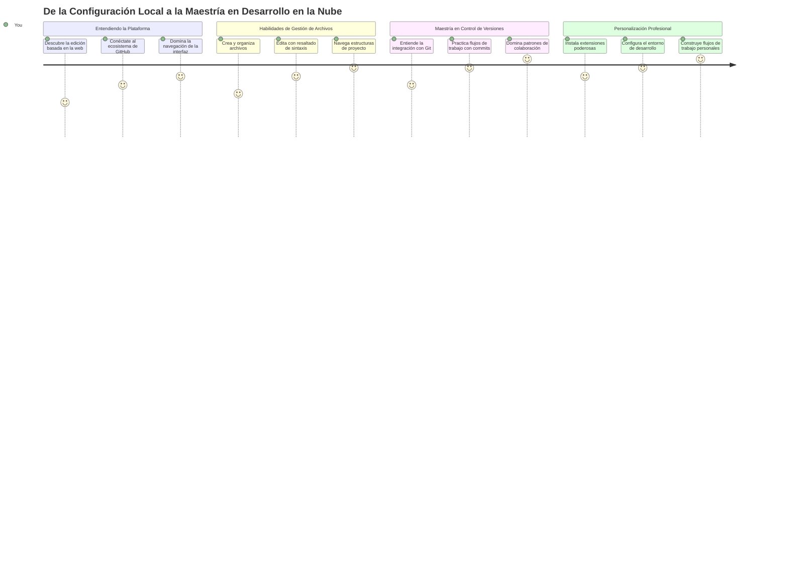
**Tu Destino en el Viaje**: Al final de esta lección, habrás dominado un entorno profesional de desarrollo en la nube que funciona desde cualquier dispositivo, permitiéndote programar con las mismas herramientas que usan los desarrolladores en grandes empresas tecnológicas.

## Lo Que Aprenderás

Después de recorrer esto juntos, podrás:

- Navegar VSCode.dev como si fuera tu segunda casa, encontrando todo lo que necesitas sin perderte
- Abrir cualquier repositorio de GitHub en tu navegador y comenzar a editar de inmediato (¡esto es bastante mágico!)
- Usar Git para rastrear tus cambios y guardar tu progreso como un profesional
- Potenciar tu editor con extensiones que hacen la programación más rápida y divertida
- Crear y organizar archivos de proyecto con confianza

## Lo Que Necesitarás

Los requisitos son sencillos:

- Una cuenta gratuita de [GitHub](https://github.com) (te guiaremos en su creación si es necesario)
- Familiaridad básica con navegadores web
- La lección de Fundamentos de GitHub proporciona un buen contexto, aunque no es esencial

> 💡 **¿Nuevo en GitHub?** Crear una cuenta es gratis y toma minutos. Así como una tarjeta de biblioteca te da acceso a libros en todo el mundo, una cuenta de GitHub abre puertas a repositorios de código en internet.

## 🧠 Visión General del Ecosistema de Desarrollo en la Nube

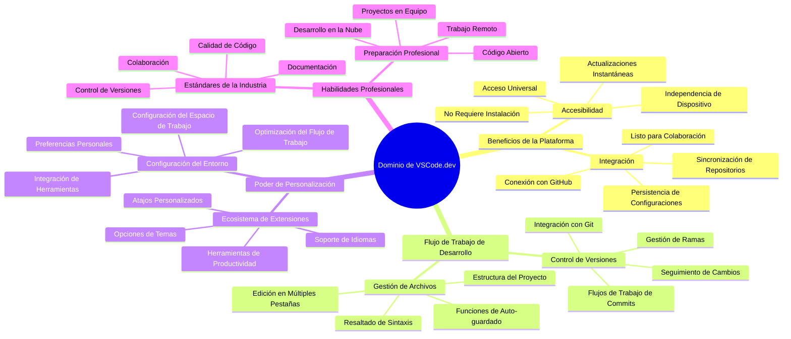
**Principio Fundamental**: Los entornos de desarrollo en la nube representan el futuro de la programación, proporcionando herramientas profesionales que son accesibles, colaborativas e independientes de plataforma.

## Por Qué Importan los Editores de Código Basados en la Web

Antes de internet, los científicos en diferentes universidades no podían compartir investigaciones fácilmente. Entonces llegó ARPANET en los años 60, conectando computadoras a distancia. Los editores de código basados en web siguen este mismo principio: hacer accesibles herramientas poderosas independientemente de tu ubicación física o dispositivo.

Un editor de código sirve como tu espacio de trabajo de desarrollo, donde escribes, editas y organizas archivos de código. A diferencia de editores de texto simples, los editores profesionales ofrecen resaltado de sintaxis, detección de errores y características de gestión de proyectos.

VSCode.dev lleva estas capacidades a tu navegador:

**Ventajas de editar en la web:**

| Característica | Descripción | Beneficio Práctico |
|---------|-------------|----------|
| **Independencia de Plataforma** | Funciona en cualquier dispositivo con navegador | Trabaja desde diferentes computadoras sin problemas |
| **No Requiere Instalación** | Acceso mediante una URL web | Evita restricciones de instalación de software |
| **Actualizaciones Automáticas** | Siempre funciona con la última versión | Accede a funciones nuevas sin actualizaciones manuales |
| **Integración con Repositorios** | Conexión directa a GitHub | Edita código sin manejar archivos localmente |

**Implicaciones prácticas:**
- Continuidad de trabajo en distintos entornos
- Interfaz consistente sin importar el sistema operativo
- Capacidades inmediatas de colaboración
- Menor requerimiento de almacenamiento local

## Explorando VSCode.dev

Así como el laboratorio de Marie Curie contenía equipos sofisticados en un espacio relativamente simple, VSCode.dev embala herramientas profesionales en una interfaz de navegador. Esta aplicación web ofrece la misma funcionalidad principal que los editores de código de escritorio.

Comienza navegando a [vscode.dev](https://vscode.dev) en tu navegador. La interfaz carga sin descargas ni instalaciones en el sistema, una aplicación directa de principios de computación en la nube.

### Conectando tu Cuenta de GitHub

Como el teléfono de Alexander Graham Bell conectó lugares remotos, vincular tu cuenta de GitHub enlaza VSCode.dev con tus repositorios de código. Cuando se te solicite iniciar sesión con GitHub, se recomienda aceptar esta conexión.

**La integración con GitHub ofrece:**
- Acceso directo a tus repositorios dentro del editor
- Configuraciones y extensiones sincronizadas entre dispositivos
- Flujo de trabajo simplificado para guardar en GitHub
- Entorno de desarrollo personalizado

### Conociendo tu Nuevo Espacio de Trabajo

Una vez que todo cargue, verás un espacio de trabajo limpio y hermoso diseñado para mantenerte enfocado en lo que importa: ¡tu código!

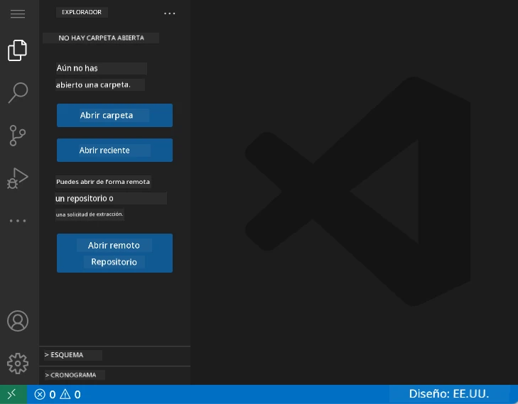

**Aquí tienes tu recorrido por el vecindario:**
- **Barra de Actividades** (esa franja a la izquierda): Tu navegación principal con Explorador 📁, Búsqueda 🔍, Control de Código Fuente 🌿, Extensiones 🧩 y Configuración ⚙️
- **Barra Lateral** (el panel a un lado): Cambia para mostrarte información relevante según lo que hayas seleccionado
- **Área del Editor** (el gran espacio en el medio): Aquí sucede la magia, tu área principal de codificación

**Tómate un momento para explorar:**
- Haz clic en esos íconos de la Barra de Actividades y ve qué hace cada uno
- Observa cómo la barra lateral se actualiza para mostrar distinta información – bastante genial, ¿no?
- La vista del Explorador (📁) probablemente sea donde pasarás la mayor parte del tiempo, así que familiarízate con ella

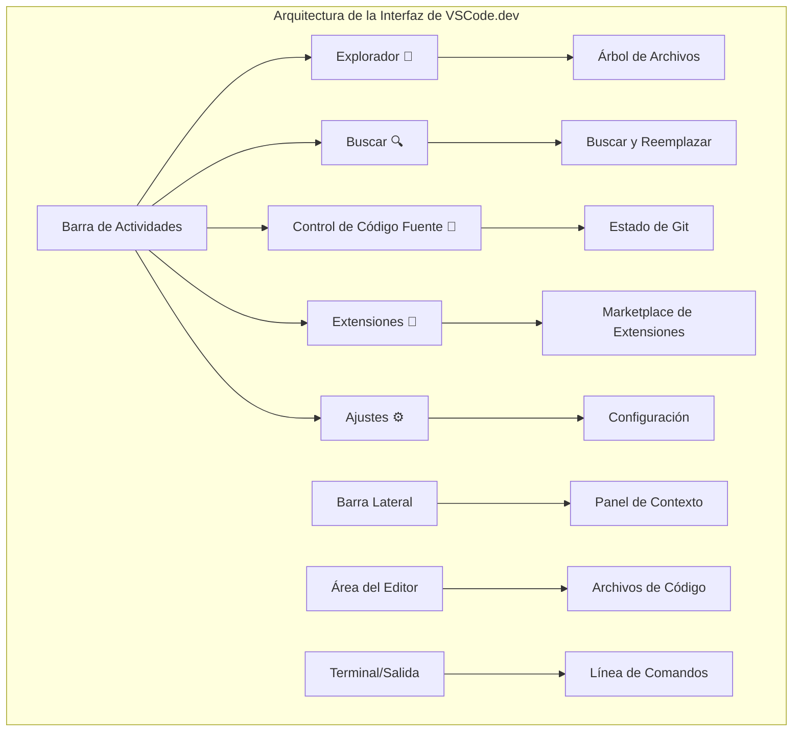
## Abriendo Repositorios de GitHub

Antes de internet, investigadores debían viajar físicamente a bibliotecas para acceder a documentos. Los repositorios de GitHub funcionan de manera similar: son colecciones de código almacenadas remotamente. VSCode.dev elimina el paso tradicional de descargar repositorios a tu máquina local antes de editar.

Esta capacidad permite acceso inmediato a cualquier repositorio público para ver, editar o contribuir. Aquí tienes dos métodos para abrir repositorios:

### Método 1: De Forma Señalando y Clickeando

Perfecto cuando comienzas fresco en VSCode.dev y quieres abrir un repositorio específico. Es sencillo y amigable para principiantes:

**Así es como se hace:**

1. Ve a [vscode.dev](https://vscode.dev) si aún no estás allí
2. Busca el botón "Open Remote Repository" en la pantalla de bienvenida y haz clic

   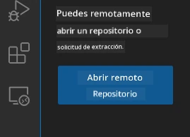

3. Pega cualquier URL de repositorio de GitHub (prueba este: `https://github.com/microsoft/Web-Dev-For-Beginners`)
4. Presiona Enter y observa la magia suceder

**Consejo profesional - Atajo del Command Palette:**

¿Quieres sentirte como un mago del código? Prueba este atajo de teclado: Ctrl+Shift+P (o Cmd+Shift+P en Mac) para abrir el Command Palette:

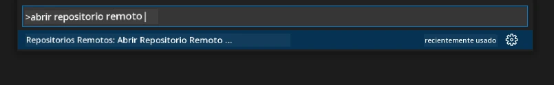

**El Command Palette es como tener un motor de búsqueda para todo lo que puedes hacer:**
- Escribe "open remote" y encontrarás el abridor de repositorios
- Recuerda repositorios que abriste recientemente (¡super útil!)
- Una vez que lo domines, sentirás que programas a velocidad relámpago
- Es básicamente la versión de VSCode.dev de "Oye Siri, pero para programar"

### Método 2: Técnica de Modificación de URL

Así como HTTP y HTTPS usan diferentes protocolos manteniendo la misma estructura de dominio, VSCode.dev usa un patrón de URL que refleja el sistema de direcciones de GitHub. Cualquier URL de repositorio de GitHub puede modificarse para abrirse directamente en VSCode.dev.

**Patrón de transformación de URL:**

| Tipo de Repositorio | URL de GitHub | URL en VSCode.dev |
|----------------|---------------------|----------------|
| **Repositorio Público** | `github.com/microsoft/Web-Dev-For-Beginners` | `vscode.dev/github/microsoft/Web-Dev-For-Beginners` |
| **Proyecto Personal** | `github.com/tu-usuario/mi-proyecto` | `vscode.dev/github/tu-usuario/mi-proyecto` |
| **Cualquier Repo Accesible** | `github.com/usuario-ellos/repo-genial` | `vscode.dev/github/usuario-ellos/repo-genial` |

**Implementación:**
- Reemplaza `github.com` por `vscode.dev/github`
- Mantén los demás componentes de la URL sin cambios
- Funciona con cualquier repositorio accesible públicamente
- Proporciona acceso inmediato para editar

> 💡 **Consejo que cambia la vida**: Agrega a favoritos las versiones de VSCode.dev de tus repositorios preferidos. Tengo marcadores como "Editar Mi Portafolio" y "Corregir Documentación" que me llevan directo al modo edición.

**¿Cuál método deberías usar?**
- **La interfaz**: Excelente cuando exploras o no recuerdas los nombres exactos de repositorios
- **El truco de URL**: Perfecto para acceso súper rápido cuando sabes exactamente a dónde vas

### 🎯 Chequeo Pedagógico: Acceso al Desarrollo en la Nube

**Pausa y Reflexiona**: Acabas de aprender dos métodos para acceder a repositorios de código por navegador. Esto representa un cambio fundamental en cómo funciona el desarrollo.

**Autoevaluación rápida**:
- ¿Puedes explicar por qué la edición basada en web elimina la "configuración tradicional del entorno de desarrollo"?
- ¿Qué ventajas tiene la técnica de modificación de URL sobre el clon local con git?
- ¿Cómo cambia este enfoque la manera en que podrías contribuir a proyectos de código abierto?

**Conexión con el Mundo Real**: Empresas grandes como GitHub, GitLab y Replit han construido sus plataformas de desarrollo sobre estos principios en la nube. Estás aprendiendo los mismos flujos de trabajo que los equipos profesionales de desarrollo en todo el mundo.

**Pregunta Desafío**: ¿Cómo podría el desarrollo basado en la nube cambiar la forma en que se enseña programación en las escuelas? Considera los requerimientos de dispositivos, la gestión de software y las posibilidades de colaboración.

## Trabajando con Archivos y Proyectos

Ahora que tienes un repositorio abierto, ¡comencemos a construir! VSCode.dev te da todo lo que necesitas para crear, editar y organizar tus archivos de código. Piensa en él como tu taller digital: cada herramienta está justo donde la necesitas.

Vamos a sumergirnos en las tareas cotidianas que formarán la mayor parte de tu flujo de trabajo de programación.

### Crear Archivos Nuevos

Como organizar planos en la oficina de un arquitecto, la creación de archivos en VSCode.dev sigue un enfoque estructurado. El sistema soporta todos los tipos de archivos estándar en desarrollo web.

**Proceso de creación de archivos:**

1. Navega a la carpeta destino en la barra lateral del Explorador
2. Pasa el cursor sobre el nombre de la carpeta para mostrar el ícono "Nuevo archivo" (📄+)
3. Escribe el nombre del archivo incluyendo la extensión apropiada (`style.css`, `script.js`, `index.html`)
4. Presiona Enter para crear el archivo

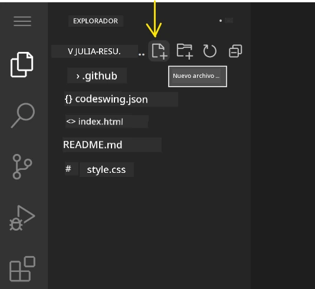

**Convenciones de nombres:**
- Usa nombres descriptivos que indiquen el propósito del archivo
- Incluye extensiones para el resaltado correcto de sintaxis
- Sigue patrones consistentes de nombres en todo el proyecto
- Usa letras minúsculas y guiones en lugar de espacios

### Editar y Guardar Archivos

¡Aquí empieza la diversión real! El editor de VSCode.dev está lleno de funciones útiles que hacen que programar sea suave e intuitivo. Es como tener un asistente de escritura muy inteligente, pero para código.

**Tu flujo de trabajo de edición:**

1. Haz clic en cualquier archivo en el Explorador para abrirlo en el área principal
2. Comienza a teclear y observa cómo VSCode.dev te ayuda con colores, sugerencias y detección de errores
3. Guarda tu trabajo con Ctrl+S (Windows/Linux) o Cmd+S (Mac), ¡aunque también guarda automáticamente!

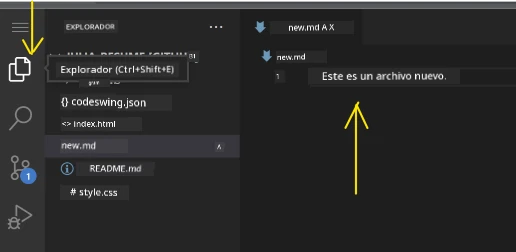

**Lo genial que sucede mientras codificas:**
- Tu código se colorea bellamente para facilitar la lectura
- VSCode.dev sugiere completaciones mientras escribes (como autocorrección, pero mucho más inteligente)
- Detecta errores antes de que guardes
- Puedes tener varios archivos abiertos en pestañas, como en un navegador
- Todo se guarda automáticamente en segundo plano

> ⚠️ **Consejo rápido**: Aunque el guardado automático está activo, desarrollar el hábito de presionar Ctrl+S o Cmd+S es bueno. Guarda inmediatamente todo y activa funciones adicionales como la verificación de errores.

### Control de Versiones con Git

Así como los arqueólogos crean registros detallados de capas de excavación, Git rastrea los cambios en tu código a lo largo del tiempo. Este sistema preserva la historia del proyecto y te permite revertir a versiones anteriores cuando sea necesario. VSCode.dev incluye funcionalidad Git integrada.

**Interfaz de Control de Código Fuente:**

1. Accede al panel de Control de Código Fuente mediante el ícono 🌿 en la Barra de Actividades
2. Los archivos modificados aparecen en la sección "Changes"
3. La codificación por colores indica tipos de cambios: verde para adiciones, rojo para eliminaciones

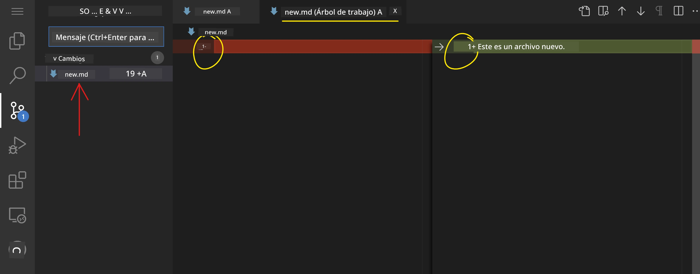

**Guardar tu trabajo (flujo de commits):**

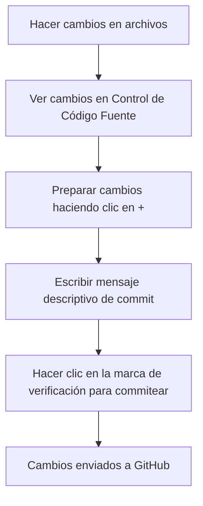
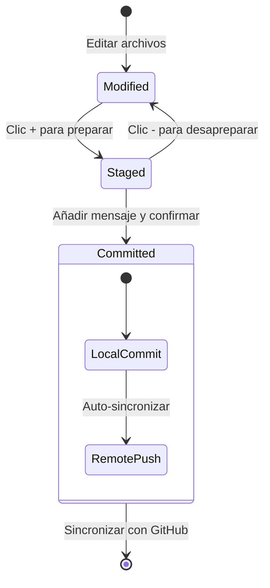
**Aquí está tu proceso paso a paso:**
- Haz clic en el ícono "+" al lado de los archivos que quieres guardar (esto los "prepara" para el commit)
- Verifica dos veces que estés satisfecho con todos tus cambios preparados
- Escribe una nota corta explicando lo que hiciste (este es tu "mensaje de commit")
- Haz clic en el botón de la marca de verificación para guardar todo en GitHub
- Si cambias de opinión sobre algo, el icono de deshacer te permite descartar los cambios

**Escribir buenos mensajes de commit (¡es más fácil de lo que piensas!):**
- Simplemente describe lo que hiciste, como "Agregar formulario de contacto" o "Arreglar navegación rota"
- Mantenlo corto y dulce – piensa en la longitud de un tweet, no un ensayo
- Comienza con palabras de acción como "Agregar", "Arreglar", "Actualizar" o "Eliminar"
- **Buenos ejemplos**: "Agregar menú de navegación responsivo", "Arreglar problemas de diseño móvil", "Actualizar colores para mejor accesibilidad"

> 💡 **Consejo rápido de navegación**: Usa el menú hamburguesa (☰) en la parte superior izquierda para volver a tu repositorio de GitHub y ver tus cambios confirmados en línea. ¡Es como un portal entre tu entorno de edición y la casa de tu proyecto en GitHub!

## Mejorando la Funcionalidad con Extensiones

Así como el taller de un artesano contiene herramientas especializadas para diferentes tareas, VSCode.dev puede personalizarse con extensiones que añaden capacidades específicas. Estos complementos desarrollados por la comunidad abordan necesidades comunes de desarrollo como el formateo de código, vista previa en vivo y una integración mejorada con Git.

El mercado de extensiones alberga miles de herramientas gratuitas creadas por desarrolladores de todo el mundo. Cada extensión resuelve desafíos particulares de flujo de trabajo, permitiéndote construir un ambiente de desarrollo personalizado adaptado a tus necesidades y preferencias específicas.

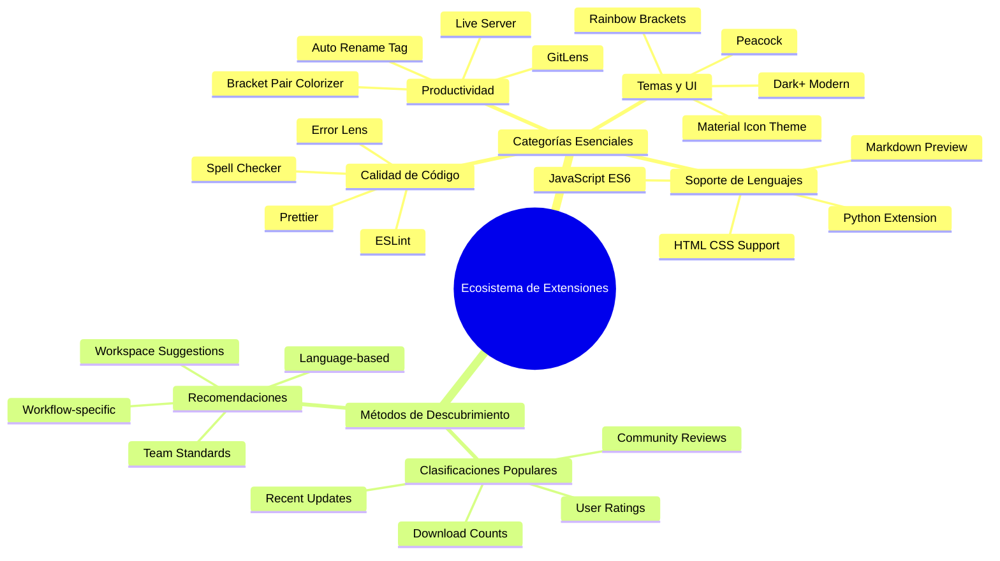
### Encontrando Tus Extensiones Perfectas

El mercado de extensiones está muy bien organizado, así que no te perderás intentando encontrar lo que necesitas. Está diseñado para ayudarte a descubrir tanto herramientas específicas como cosas geniales que ni siquiera sabías que existían.

**Cómo llegar al mercado:**

1. Haz clic en el ícono de Extensiones (🧩) en la Barra de Actividad
2. Navega o busca algo específico
3. Haz clic en cualquier cosa que parezca interesante para aprender más sobre ella

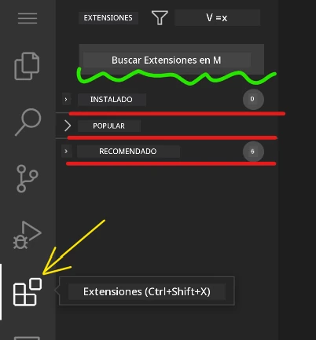

**Qué verás allí:**

| Sección | Qué Contiene | Por Qué es Útil |
|----------|---------|----------|
| **Instaladas** | Extensiones que ya has agregado | Tu kit de herramientas de codificación personal |
| **Populares** | Las favoritas de la comunidad | Lo que la mayoría de desarrolladores recomienda |
| **Recomendadas** | Sugerencias inteligentes para tu proyecto | Las recomendaciones útiles de VSCode.dev |

**Qué hace la navegación fácil:**
- Cada extensión muestra valoraciones, número de descargas y reseñas reales de usuarios
- Obtienes capturas de pantalla y descripciones claras de lo que hace cada una
- Todo está claramente marcado con información de compatibilidad
- Se sugieren extensiones similares para que puedas comparar opciones

### Instalando Extensiones (¡Es Súper Fácil!)

Añadir nuevos poderes a tu editor es tan simple como hacer clic en un botón. Las extensiones se instalan en segundos y comienzan a funcionar inmediatamente – sin reinicios, sin esperas.

**Esto es todo lo que necesitas hacer:**

1. Busca lo que quieres (prueba buscando "live server" o "prettier")
2. Haz clic en una que se vea bien para ver más detalles
3. Lee lo que hace y revisa las valoraciones
4. Presiona el botón azul "Instalar" y listo


**Lo que sucede tras bastidores:**
- La extensión se descarga y se configura automáticamente
- Las nuevas características aparecen en tu interfaz de inmediato
- Todo funciona instantáneamente (en serio, ¡es así de rápido!)
- Si iniciaste sesión, la extensión se sincroniza en todos tus dispositivos

**Algunas extensiones que recomendaría comenzar a usar:**
- **Live Server**: Ve tu sitio web actualizarse en tiempo real mientras codificas (¡esta es mágica!)
- **Prettier**: Hace que tu código luzca limpio y profesional automáticamente
- **Auto Rename Tag**: Cambia una etiqueta HTML y su pareja se actualiza también
- **Bracket Pair Colorizer**: Colorea tus corchetes para que nunca te pierdas
- **GitLens**: Potencia tus características de Git con mucha información útil

### Personalizando Tus Extensiones

La mayoría de las extensiones vienen con configuraciones que puedes ajustar para que funcionen exactamente como te gusta. Piensa en ello como ajustar el asiento y los espejos en un auto – ¡cada quien tiene sus preferencias!

**Ajustando la configuración de la extensión:**

1. Encuentra tu extensión instalada en el panel de Extensiones
2. Busca el pequeño ícono de engranaje (⚙️) junto a su nombre y haz clic ahí
3. Escoge "Configuración de la extensión" en el menú desplegable
4. Ajusta las cosas hasta que se sientan perfectas para tu flujo de trabajo

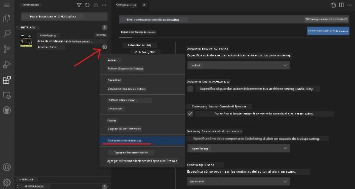

**Cosas comunes que quizás quieras ajustar:**
- Cómo se formatea tu código (tabs vs espacios, longitud de línea, etc.)
- Qué atajos de teclado activan diferentes acciones
- Con qué tipos de archivo debería funcionar la extensión
- Activar o desactivar funciones específicas para mantener el entorno limpio

### Manteniendo Tus Extensiones Organizadas

A medida que descubras más extensiones geniales, querrás mantener tu colección ordenada y funcionando sin problemas. VSCode.dev facilita mucho esta gestión.

**Tus opciones para administrar extensiones:**

| Lo Que Puedes Hacer | Cuándo es Útil | Consejo Profesional |
|--------|---------|----------|
| **Deshabilitar** | Para probar si una extensión está causando problemas | Mejor que desinstalar si podrías querer usarla después |
| **Desinstalar** | Eliminar completamente extensiones que no necesitas | Mantiene tu entorno limpio y rápido |
| **Actualizar** | Obtener las últimas características y correcciones | Normalmente ocurre automáticamente, pero vale la pena revisar |

**Cómo me gusta administrar las extensiones:**
- Cada pocos meses reviso lo que he instalado y elimino lo que no uso
- Mantengo las extensiones actualizadas para tener las últimas mejoras y parches de seguridad
- Si algo parece lento, deshabilito temporalmente extensiones para ver si alguna es la culpable
- Leo las notas cuando hay actualizaciones importantes – ¡a veces salen funciones nuevas geniales!

> ⚠️ **Consejo de rendimiento**: Las extensiones son geniales, pero tener demasiadas puede ralentizar las cosas. Enfócate en las que realmente facilitan tu vida y no dudes en desinstalar las que nunca usas.

### 🎯 Revisión Pedagógica: Personalización del Entorno de Desarrollo

**Comprensión de la Arquitectura**: Has aprendido a personalizar un entorno de desarrollo profesional usando extensiones creadas por la comunidad. Esto refleja cómo los equipos de desarrollo empresarial construyen flujos de trabajo estandarizados.

**Conceptos Clave Dominados**:
- **Descubrimiento de Extensiones**: Encontrar herramientas que resuelven desafíos específicos de desarrollo
- **Configuración del Entorno**: Personalizar herramientas para que coincidan con preferencias personales o de equipo
- **Optimización del Rendimiento**: Equilibrar funcionalidad con rendimiento del sistema
- **Colaboración Comunitaria**: Aprovechar herramientas creadas por la comunidad global de desarrolladores

**Conexión con la Industria**: Los ecosistemas de extensiones potencian plataformas de desarrollo importantes como VS Code, Chrome DevTools y modernos IDEs. Entender cómo evaluar, instalar y configurar extensiones es esencial para flujos de trabajo profesionales.

**Pregunta de reflexión**: ¿Cómo abordarías la configuración de un entorno de desarrollo estandarizado para un equipo de 10 desarrolladores? Considera consistencia, rendimiento y preferencias individuales.

## 📈 Tu Cronología de Maestría en Desarrollo en la Nube

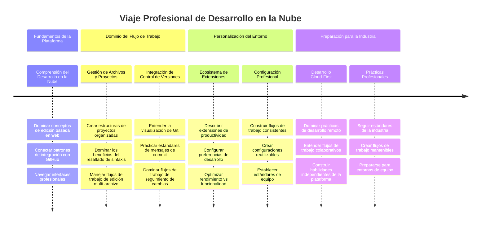
**🎓 Hito de Graduación**: Has dominado con éxito el desarrollo basado en la nube utilizando las mismas herramientas y flujos de trabajo empleados por desarrolladores profesionales en grandes empresas tecnológicas. Estas habilidades representan el futuro del desarrollo de software.

**🔄 Capacidades de Siguiente Nivel**:
- Listo para explorar plataformas avanzadas de desarrollo en la nube (Codespaces, GitPod)
- Preparado para trabajar en equipos de desarrollo distribuidos
- Equipado para contribuir a proyectos de código abierto a nivel global
- Bases establecidas para prácticas modernas de DevOps e integración continua

## Desafío con GitHub Copilot Agent 🚀

Como el enfoque estructurado que usa la NASA para misiones espaciales, este desafío implica la aplicación sistemática de habilidades VSCode.dev en un escenario de flujo de trabajo completo.

**Objetivo:** Demostrar competencia con VSCode.dev estableciendo un flujo de trabajo completo para desarrollo web.

**Requisitos del proyecto:** Usando asistencia en modo Agente, completa estas tareas:
1. Haz un fork a un repositorio existente o crea uno nuevo
2. Establece una estructura funcional de proyecto con archivos HTML, CSS y JavaScript
3. Instala y configura tres extensiones que mejoren el desarrollo
4. Practica control de versiones con mensajes descriptivos de commit
5. Experimenta con la creación y modificación de ramas de funciones
6. Documenta el proceso y aprendizajes en un archivo README.md

Este ejercicio consolida todos los conceptos de VSCode.dev en un flujo de trabajo práctico que puedes aplicar en proyectos de desarrollo futuros.

Aprende más sobre [modo agente](https://code.visualstudio.com/blogs/2025/02/24/introducing-copilot-agent-mode) aquí.

## Tarea

¡Es hora de poner estas habilidades a prueba real! Tengo un proyecto práctico que te permitirá practicar todo lo que hemos cubierto: [Crear un sitio web de currículum usando VSCode.dev](./assignment.md)

Esta tarea te guía para construir un sitio web profesional de currículum completamente en tu navegador. Usarás todas las funciones de VSCode.dev que hemos explorado, y al final tendrás un sitio atractivo y confianza sólida en tu nuevo flujo de trabajo.

## Sigue Explorando y Ampliando Tus Habilidades

Ya tienes una base sólida, pero hay muchas cosas geniales más por descubrir. Aquí tienes algunos recursos e ideas para llevar tus habilidades de VSCode.dev al siguiente nivel:

**Documentación oficial que vale la pena guardar:**
- [Documentación web de VSCode](https://code.visualstudio.com/docs/editor/vscode-web?WT.mc_id=academic-0000-alfredodeza) – La guía completa para edición basada en navegador
- [GitHub Codespaces](https://docs.github.com/en/codespaces) – Para cuando quieras aún más potencia en la nube

**Funciones geniales para experimentar a continuación:**
- **Atajos de teclado**: Aprende las combinaciones que te harán sentir como un ninja del código
- **Configuración de espacio de trabajo**: Configura ambientes distintos para diferentes tipos de proyectos
- **Espacios de trabajo con múltiples raíces**: Trabaja en varios repositorios al mismo tiempo (¡muy útil!)
- **Integración con terminal**: Accede a herramientas de línea de comando directamente en tu navegador

**Ideas para practicar:**
- Participa en proyectos de código abierto y contribuye usando VSCode.dev – ¡es una gran forma de aportar!
- Prueba distintas extensiones para encontrar tu configuración perfecta
- Crea plantillas de proyecto para los tipos de sitios que construyes más a menudo
- Practica flujos de trabajo de Git como ramas y fusiones – estas habilidades son oro en proyectos en equipo

---

**¡Has dominado el desarrollo basado en navegador!** 🎉 Así como la invención de instrumentos portátiles permitió que los científicos investigaran en lugares remotos, VSCode.dev permite codificación profesional desde cualquier dispositivo con conexión a internet.

Estas habilidades reflejan prácticas actuales de la industria – muchos desarrolladores profesionales usan entornos de desarrollo basados en la nube por su flexibilidad y accesibilidad. Has aprendido un flujo de trabajo que escala desde proyectos individuales hasta colaboraciones de equipos grandes.

¡Aplica estas técnicas en tu próximo proyecto de desarrollo! 🚀

---

<!-- CO-OP TRANSLATOR DISCLAIMER START -->
**Aviso Legal**:
Este documento ha sido traducido utilizando el servicio de traducción automática [Co-op Translator](https://github.com/Azure/co-op-translator). Aunque nos esforzamos por lograr precisión, tenga en cuenta que las traducciones automáticas pueden contener errores o inexactitudes. El documento original en su idioma nativo debe considerarse la fuente autorizada. Para información crítica, se recomienda una traducción profesional realizada por humanos. No nos hacemos responsables de ningún malentendido o interpretación errónea derivada del uso de esta traducción.
<!-- CO-OP TRANSLATOR DISCLAIMER END -->