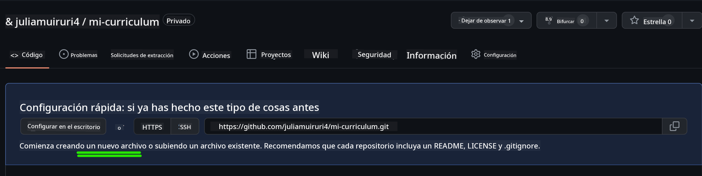
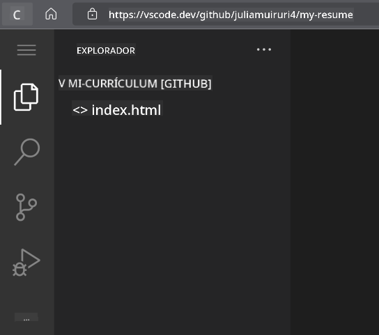

<!--
CO_OP_TRANSLATOR_METADATA:
{
  "original_hash": "bd3aa6d2b879c30ea496c43aec1c49ed",
  "translation_date": "2025-08-29T14:00:15+00:00",
  "source_file": "8-code-editor/1-using-a-code-editor/assignment.md",
  "language_code": "es"
}
-->
# Crear un sitio web de currículum usando vscode.dev

_¿Qué tan genial sería que un reclutador te pidiera tu currículum y tú le enviaras un enlace?_ 😎

## Objetivos

Después de esta tarea, aprenderás a:

- Crear un sitio web para mostrar tu currículum.

### Prerrequisitos

1. Una cuenta de GitHub. Ve a [GitHub](https://github.com/) y crea una cuenta si aún no tienes una.

## Pasos

**Paso 1:** Crea un nuevo repositorio en GitHub y ponle el nombre `my-resume`.

**Paso 2:** Crea un archivo `index.html` en tu repositorio. Agregaremos al menos un archivo mientras estamos en github.com porque no puedes abrir un repositorio vacío en vscode.dev.

Haz clic en el enlace `creating a new file`, escribe el nombre `index.html` y selecciona el botón `Commit new file`.



**Paso 3:** Abre [VSCode.dev](https://vscode.dev) y selecciona el botón `Open Remote Repository`.

Copia la URL del repositorio que acabas de crear para tu sitio de currículum y pégala en el cuadro de entrada:

_Reemplaza `your-username` con tu nombre de usuario de GitHub._

```
https://github.com/your-username/my-resume
```

✅ Si todo salió bien, verás tu proyecto y el archivo index.html abierto en el editor de texto en el navegador.



**Paso 4:** Abre el archivo `index.html`, pega el siguiente código en tu área de código y guarda.

<details>
    <summary><b>Código HTML responsable del contenido de tu sitio web de currículum.</b></summary>
    
        <html>

            <head>
                <link href="style.css" rel="stylesheet">
                <link rel="stylesheet" href="https://cdnjs.cloudflare.com/ajax/libs/font-awesome/5.15.4/css/all.min.css">
                <title>¡Tu Nombre Aquí!</title>
            </head>
            <body>
                <header id="header">
                    <!-- encabezado del currículum con tu nombre y título -->
                    <h1>¡Tu Nombre Aquí!</h1>
                    <hr>
                    ¡Tu Rol!
                    <hr>
                </header>
                <main>
                    <article id="mainLeft">
                        <section>
                            <h2>CONTACTO</h2>
                            <!-- información de contacto incluyendo redes sociales -->
                            <p>
                                <i class="fa fa-envelope" aria-hidden="true"></i>
                                <a href="mailto:username@domain.top-level domain">Escribe tu correo aquí</a>
                            </p>
                            <p>
                                <i class="fab fa-github" aria-hidden="true"></i>
                                <a href="github.com/yourGitHubUsername">¡Escribe tu usuario aquí!</a>
                            </p>
                            <p>
                                <i class="fab fa-linkedin" aria-hidden="true"></i>
                                <a href="linkedin.com/yourLinkedInUsername">¡Escribe tu usuario aquí!</a>
                            </p>
                        </section>
                        <section>
                            <h2>HABILIDADES</h2>
                            <!-- tus habilidades -->
                            <ul>
                                <li>¡Habilidad 1!</li>
                                <li>¡Habilidad 2!</li>
                                <li>¡Habilidad 3!</li>
                                <li>¡Habilidad 4!</li>
                            </ul>
                        </section>
                        <section>
                            <h2>EDUCACIÓN</h2>
                            <!-- tu educación -->
                            <h3>¡Escribe tu curso aquí!</h3>
                            <p>
                                ¡Escribe tu institución aquí!
                            </p>
                            <p>
                                Fecha de inicio - Fecha de finalización
                            </p>
                        </section>            
                    </article>
                    <article id="mainRight">
                        <section>
                            <h2>SOBRE MÍ</h2>
                            <!-- sobre ti -->
                            <p>¡Escribe una breve descripción sobre ti!</p>
                        </section>
                        <section>
                            <h2>EXPERIENCIA LABORAL</h2>
                            <!-- tu experiencia laboral -->
                            <h3>Título del puesto</h3>
                            <p>
                                Nombre de la organización | Mes de inicio – Mes de finalización
                            </p>
                            <ul>
                                    <li>Tarea 1 - ¡Escribe lo que hiciste!</li>
                                    <li>Tarea 2 - ¡Escribe lo que hiciste!</li>
                                    <li>Escribe los resultados/impacto de tu contribución</li>
                                    
                            </ul>
                            <h3>Título del puesto 2</h3>
                            <p>
                                Nombre de la organización | Mes de inicio – Mes de finalización
                            </p>
                            <ul>
                                    <li>Tarea 1 - ¡Escribe lo que hiciste!</li>
                                    <li>Tarea 2 - ¡Escribe lo que hiciste!</li>
                                    <li>Escribe los resultados/impacto de tu contribución</li>
                                    
                            </ul>
                        </section>
                    </article>
                </main>
            </body>
        </html>
</details>

Agrega los detalles de tu currículum para reemplazar el _texto de marcador de posición_ en el código HTML.

**Paso 5:** Pasa el cursor sobre la carpeta My-Resume, haz clic en el ícono `New File ...` y crea 2 nuevos archivos en tu proyecto: `style.css` y `codeswing.json`.

**Paso 6:** Abre el archivo `style.css`, pega el siguiente código y guarda.

<details>
        <summary><b>Código CSS para dar formato al diseño del sitio.</b></summary>
            
            body {
                font-family: 'Segoe UI', Tahoma, Geneva, Verdana, sans-serif;
                font-size: 16px;
                max-width: 960px;
                margin: auto;
            }
            h1 {
                font-size: 3em;
                letter-spacing: .6em;
                padding-top: 1em;
                padding-bottom: 1em;
            }

            h2 {
                font-size: 1.5em;
                padding-bottom: 1em;
            }

            h3 {
                font-size: 1em;
                padding-bottom: 1em;
            }
            main { 
                display: grid;
                grid-template-columns: 40% 60%;
                margin-top: 3em;
            }
            header {
                text-align: center;
                margin: auto 2em;
            }

            section {
                margin: auto 1em 4em 2em;
            }

            i {
                margin-right: .5em;
            }

            p {
                margin: .2em auto
            }

            hr {
                border: none;
                background-color: lightgray;
                height: 1px;
            }

            h1, h2, h3 {
                font-weight: 100;
                margin-bottom: 0;
            }
            #mainLeft {
                border-right: 1px solid lightgray;
            }
            
</details>

**Paso 6:** Abre el archivo `codeswing.json`, pega el siguiente código y guarda.

    {
    "scripts": [],
    "styles": []
    }

**Paso 7:** Instala la extensión `Codeswing` para visualizar el sitio web del currículum en el área de código.

Haz clic en el ícono _`Extensions`_ en la barra de actividades y escribe Codeswing. Haz clic en el _botón azul de instalación_ en la barra de actividades expandida para instalar o usa el botón de instalación que aparece en el área de código una vez que selecciones la extensión para cargar información adicional. Inmediatamente después de instalar la extensión, observa tu área de código para ver los cambios en tu proyecto 😃.


Esto es lo que verás en tu pantalla después de instalar la extensión.


Si estás satisfecho con los cambios que realizaste, pasa el cursor sobre la carpeta `Changes` y haz clic en el botón `+` para preparar los cambios.

Escribe un mensaje de confirmación _(Una descripción del cambio que realizaste en el proyecto)_ y confirma tus cambios haciendo clic en el `check`. Una vez que hayas terminado de trabajar en tu proyecto, selecciona el ícono del menú hamburguesa en la parte superior izquierda para regresar al repositorio en GitHub.

¡Felicidades 🎉! Acabas de crear tu sitio web de currículum usando vscode.dev en unos pocos pasos.

## 🚀 Desafío

Abre un repositorio remoto en el que tengas permisos para realizar cambios y actualiza algunos archivos. Luego, intenta crear una nueva rama con tus cambios y haz un Pull Request.

## Revisión y Autoestudio

Lee más sobre [VSCode.dev](https://code.visualstudio.com/docs/editor/vscode-web?WT.mc_id=academic-0000-alfredodeza) y algunas de sus otras características.

---

**Descargo de responsabilidad**:  
Este documento ha sido traducido utilizando el servicio de traducción automática [Co-op Translator](https://github.com/Azure/co-op-translator). Si bien nos esforzamos por lograr precisión, tenga en cuenta que las traducciones automáticas pueden contener errores o imprecisiones. El documento original en su idioma nativo debe considerarse como la fuente autorizada. Para información crítica, se recomienda una traducción profesional realizada por humanos. No nos hacemos responsables de malentendidos o interpretaciones erróneas que puedan surgir del uso de esta traducción.