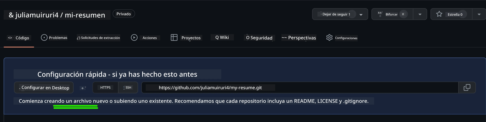
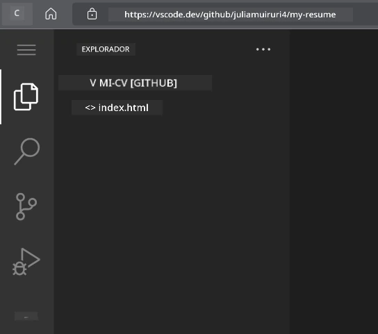
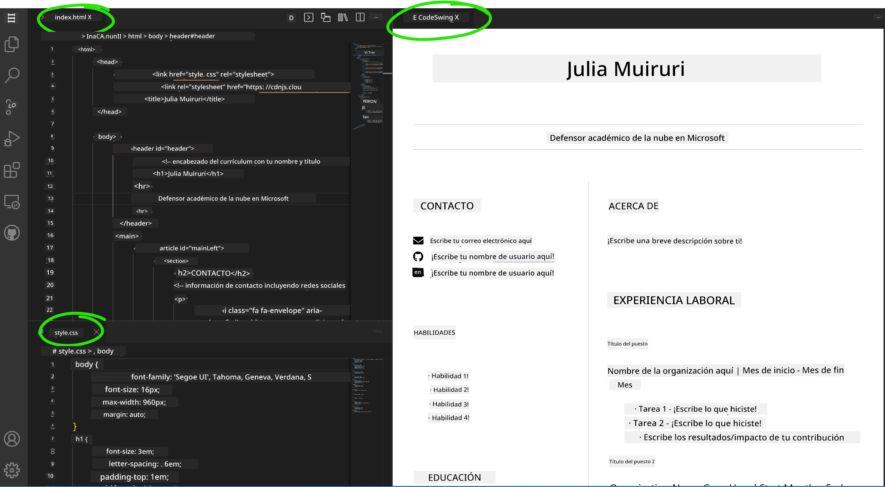

# Crea un Sitio Web de Currículum Usando VSCode.dev

Transforma tus perspectivas profesionales construyendo un sitio web profesional de currículum que muestre tus habilidades y experiencia en un formato interactivo y moderno. En lugar de enviar PDFs tradicionales, imagina proporcionar a los reclutadores un sitio web elegante y responsive que demuestre tanto tus calificaciones como tus capacidades de desarrollo web.

Esta tarea práctica pone en práctica todas tus habilidades en VSCode.dev mientras creas algo genuinamente útil para tu carrera. Experimentarás el flujo completo de desarrollo web, desde la creación del repositorio hasta el despliegue, todo dentro de tu navegador.

Al completar este proyecto, tendrás una presencia profesional en línea que puede ser fácilmente compartida con potenciales empleadores, actualizada a medida que crecen tus habilidades, y personalizada para coincidir con tu marca personal. Este es exactamente el tipo de proyecto práctico que demuestra habilidades reales de desarrollo web.

## Objetivos de Aprendizaje

Después de completar esta tarea, podrás:

- **Crear** y administrar un proyecto completo de desarrollo web usando VSCode.dev
- **Estructurar** un sitio web profesional usando elementos semánticos de HTML
- **Estilizar** diseños responsivos con técnicas modernas de CSS
- **Implementar** características interactivas usando tecnologías web básicas
- **Desplegar** un sitio web en vivo accesible mediante una URL compartible
- **Demostrar** mejores prácticas de control de versiones durante todo el proceso de desarrollo

## Prerrequisitos

Antes de comenzar esta tarea, asegúrate de tener:

- Una cuenta en GitHub (crea una en [github.com](https://github.com/) si es necesario)
- Haber completado la lección de VSCode.dev que cubre navegación de interfaz y operaciones básicas
- Comprensión básica de la estructura HTML y conceptos de estilo CSS

## Configuración del Proyecto y Creación del Repositorio

Comencemos estableciendo la base de tu proyecto. Este proceso refleja flujos de trabajo reales donde los proyectos comienzan con la inicialización adecuada del repositorio y la planificación de la estructura.

### Paso 1: Crea Tu Repositorio en GitHub

Configurar un repositorio dedicado asegura que tu proyecto esté organizado adecuadamente y controlado en versiones desde el principio.

1. **Navega** a [GitHub.com](https://github.com) e inicia sesión en tu cuenta
2. **Haz clic** en el botón verde "New" o el icono "+" en la esquina superior derecha
3. **Nombra** tu repositorio `my-resume` (o elige un nombre personalizado como `john-smith-resume`)
4. **Agrega** una breve descripción: "Sitio web profesional de currículum construido con HTML y CSS"
5. **Selecciona** "Public" para que tu currículum sea accesible a empleadores potenciales
6. **Marca** "Add a README file" para crear una descripción inicial del proyecto
7. **Haz clic** en "Create repository" para finalizar la configuración

> 💡 **Consejo para nombrar el repositorio**: Usa nombres descriptivos y profesionales que indiquen claramente el propósito del proyecto. Esto ayuda al compartirlo con empleadores o en revisiones de portafolio.

### Paso 2: Inicializa la Estructura del Proyecto

Como VSCode.dev requiere al menos un archivo para abrir un repositorio, crearemos nuestro archivo HTML principal directamente en GitHub antes de cambiar al editor web.

1. **Haz clic** en el enlace "creating a new file" en tu nuevo repositorio
2. **Escribe** `index.html` como el nombre del archivo
3. **Agrega** esta estructura HTML inicial:

```html
<!DOCTYPE html>
<html lang="en">
<head>
    <meta charset="UTF-8">
    <meta name="viewport" content="width=device-width, initial-scale=1.0">
    <title>Your Name - Professional Resume</title>
</head>
<body>
    <h1>Your Name</h1>
    <p>Professional Resume Website</p>
</body>
</html>
```

4. **Escribe** un mensaje para el commit: "Add initial HTML structure"
5. **Haz clic** en "Commit new file" para guardar tus cambios



**Esto es lo que logra esta configuración inicial:**
- **Establece** la estructura correcta del documento HTML5 con elementos semánticos
- **Incluye** la meta etiqueta viewport para compatibilidad con diseño responsive
- **Define** un título descriptivo de página que aparece en pestañas del navegador
- **Crea** la base para una organización profesional del contenido

## Trabajando en VSCode.dev

Ahora que la base de tu repositorio está establecida, vamos a pasar a VSCode.dev para el trabajo principal de desarrollo. Este editor web proporciona todas las herramientas necesarias para el desarrollo profesional web.

### Paso 3: Abre Tu Proyecto en VSCode.dev

1. **Navega** a [vscode.dev](https://vscode.dev) en una nueva pestaña del navegador
2. **Haz clic** en "Open Remote Repository" en la pantalla de bienvenida
3. **Copia** la URL de tu repositorio desde GitHub y pégala en el campo de entrada

   Formato: `https://github.com/tu-usuario/my-resume`
   
   *Sustituye `tu-usuario` por tu nombre real de usuario en GitHub*

4. **Presiona** Enter para cargar tu proyecto

✅ **Indicador de éxito**: Deberías ver los archivos de tu proyecto en la barra lateral del Explorador y `index.html` disponible para editar en el área principal del editor.



**Qué verás en la interfaz:**
- **Barra lateral del Explorador**: **Muestra** los archivos y la estructura de carpetas de tu repositorio
- **Área del editor**: **Muestra** el contenido de archivos seleccionados para editar
- **Barra de actividad**: **Proporciona** acceso a funciones como Control de Código Fuente y Extensiones
- **Barra de estado**: **Indica** el estado de conexión y la rama actual

### Paso 4: Construye el Contenido de Tu Currículum

Reemplaza el contenido marcador de posición en `index.html` con una estructura completa de currículum. Este HTML brinda la base para una presentación profesional de tus cualificaciones.

<details>
<summary><b>Estructura Completa del Currículum en HTML</b></summary>

```html
<!DOCTYPE html>
<html lang="en">
<head>
    <meta charset="UTF-8">
    <meta name="viewport" content="width=device-width, initial-scale=1.0">
    <link href="style.css" rel="stylesheet">
    <link rel="stylesheet" href="https://cdnjs.cloudflare.com/ajax/libs/font-awesome/5.15.4/css/all.min.css">
    <title>Your Name - Professional Resume</title>
</head>
<body>
    <header id="header">
        <h1>Your Full Name</h1>
        <hr>
        <p class="role">Your Professional Title</p>
        <hr>
    </header>
    
    <main>
        <article id="mainLeft">
            <section>
                <h2>CONTACT</h2>
                <p>
                    <i class="fa fa-envelope" aria-hidden="true"></i>
                    <a href="mailto:your.email@domain.com">your.email@domain.com</a>
                </p>
                <p>
                    <i class="fab fa-github" aria-hidden="true"></i>
                    <a href="https://github.com/your-username">github.com/your-username</a>
                </p>
                <p>
                    <i class="fab fa-linkedin" aria-hidden="true"></i>
                    <a href="https://linkedin.com/in/your-profile">linkedin.com/in/your-profile</a>
                </p>
            </section>
            
            <section>
                <h2>SKILLS</h2>
                <ul>
                    <li>HTML5 & CSS3</li>
                    <li>JavaScript (ES6+)</li>
                    <li>Responsive Web Design</li>
                    <li>Version Control (Git)</li>
                    <li>Problem Solving</li>
                </ul>
            </section>
            
            <section>
                <h2>EDUCATION</h2>
                <h3>Your Degree or Certification</h3>
                <p>Institution Name</p>
                <p>Start Date - End Date</p>
            </section>
        </article>
        
        <article id="mainRight">
            <section>
                <h2>ABOUT</h2>
                <p>Write a compelling summary that highlights your passion for web development, key achievements, and career goals. This section should give employers insight into your personality and professional approach.</p>
            </section>
            
            <section>
                <h2>WORK EXPERIENCE</h2>
                <div class="job">
                    <h3>Job Title</h3>
                    <p class="company">Company Name | Start Date – End Date</p>
                    <ul>
                        <li>Describe a key accomplishment or responsibility</li>
                        <li>Highlight specific skills or technologies used</li>
                        <li>Quantify impact where possible (e.g., "Improved efficiency by 25%")</li>
                    </ul>
                </div>
                
                <div class="job">
                    <h3>Previous Job Title</h3>
                    <p class="company">Previous Company | Start Date – End Date</p>
                    <ul>
                        <li>Focus on transferable skills and achievements</li>
                        <li>Demonstrate growth and learning progression</li>
                        <li>Include any leadership or collaboration experiences</li>
                    </ul>
                </div>
            </section>
            
            <section>
                <h2>PROJECTS</h2>
                <div class="project">
                    <h3>Project Name</h3>
                    <p>Brief description of what the project accomplishes and technologies used.</p>
                    <a href="#" target="_blank">View Project</a>
                </div>
            </section>
        </article>
    </main>
</body>
</html>
```
</details>

**Guías para personalizar:**
- **Reemplaza** todo texto de marcador con tu información real
- **Ajusta** las secciones según tu nivel de experiencia y enfoque profesional
- **Añade** o elimina secciones según sea necesario (ej. Certificaciones, Trabajo Voluntario, Idiomas)
- **Incluye** enlaces a tus perfiles y proyectos reales

### Paso 5: Crea Archivos de Apoyo

Los sitios web profesionales requieren estructuras de archivos organizadas. Crea la hoja de estilos CSS y archivos de configuración necesarios para un proyecto completo.

1. **Pasa el cursor** sobre el nombre de la carpeta de tu proyecto en la barra lateral del Explorador
2. **Haz clic** en el icono "Nuevo Archivo" (📄+) que aparece
3. **Crea** estos archivos uno a la vez:
   - `style.css` (para estilos y diseño)
   - `codeswing.json` (para la configuración de la extensión de vista previa)

**Creando el archivo CSS (`style.css`):**

<details>
<summary><b>Estilos CSS Profesionales</b></summary>

```css
/* Modern Resume Styling */
body {
    font-family: 'Segoe UI', Tahoma, Geneva, Verdana, sans-serif;
    font-size: 16px;
    line-height: 1.6;
    max-width: 960px;
    margin: 0 auto;
    padding: 20px;
    color: #333;
    background-color: #f9f9f9;
}

/* Header Styling */
header {
    text-align: center;
    margin-bottom: 3em;
    padding: 2em;
    background: linear-gradient(135deg, #667eea 0%, #764ba2 100%);
    color: white;
    border-radius: 10px;
    box-shadow: 0 4px 6px rgba(0, 0, 0, 0.1);
}

h1 {
    font-size: 3em;
    letter-spacing: 0.1em;
    margin-bottom: 0.2em;
    font-weight: 300;
}

.role {
    font-size: 1.3em;
    font-weight: 300;
    margin: 1em 0;
}

/* Main Content Layout */
main {
    display: grid;
    grid-template-columns: 35% 65%;
    gap: 3em;
    margin-top: 3em;
    background: white;
    padding: 2em;
    border-radius: 10px;
    box-shadow: 0 2px 10px rgba(0, 0, 0, 0.1);
}

/* Typography */
h2 {
    font-size: 1.4em;
    font-weight: 600;
    margin-bottom: 1em;
    color: #667eea;
    border-bottom: 2px solid #667eea;
    padding-bottom: 0.3em;
}

h3 {
    font-size: 1.1em;
    font-weight: 600;
    margin-bottom: 0.5em;
    color: #444;
}

/* Section Styling */
section {
    margin-bottom: 2.5em;
}

#mainLeft {
    border-right: 1px solid #e0e0e0;
    padding-right: 2em;
}

/* Contact Links */
section a {
    color: #667eea;
    text-decoration: none;
    transition: color 0.3s ease;
}

section a:hover {
    color: #764ba2;
    text-decoration: underline;
}

/* Icons */
i {
    margin-right: 0.8em;
    width: 20px;
    text-align: center;
    color: #667eea;
}

/* Lists */
ul {
    list-style: none;
    padding-left: 0;
}

li {
    margin: 0.5em 0;
    padding: 0.3em 0;
    position: relative;
}

li:before {
    content: "▸";
    color: #667eea;
    margin-right: 0.5em;
}

/* Work Experience */
.job, .project {
    margin-bottom: 2em;
    padding-bottom: 1.5em;
    border-bottom: 1px solid #f0f0f0;
}

.company {
    font-style: italic;
    color: #666;
    margin-bottom: 0.5em;
}

/* Responsive Design */
@media (max-width: 768px) {
    main {
        grid-template-columns: 1fr;
        gap: 2em;
    }
    
    #mainLeft {
        border-right: none;
        border-bottom: 1px solid #e0e0e0;
        padding-right: 0;
        padding-bottom: 2em;
    }
    
    h1 {
        font-size: 2.2em;
    }
    
    body {
        padding: 10px;
    }
}

/* Print Styles */
@media print {
    body {
        background: white;
        color: black;
        font-size: 12pt;
    }
    
    header {
        background: none;
        color: black;
        box-shadow: none;
    }
    
    main {
        box-shadow: none;
    }
}
```
</details>

**Creando el archivo de configuración (`codeswing.json`):**

```json
{
    "scripts": [],
    "styles": []
}
```

**Características del CSS:**
- **Usa** CSS Grid para una estructura de diseño responsivo y profesional
- **Implementa** esquemas de color modernos con encabezados en degradado
- **Incluye** efectos hover y transiciones suaves para interactividad
- **Proporciona** diseño responsive que funciona en todos los tamaños de dispositivo
- **Añade** estilos amigables para impresión para generación de PDF

### Paso 6: Instala y Configura Extensiones

Las extensiones mejoran tu experiencia de desarrollo proporcionando capacidades de vista previa en vivo y herramientas de flujo de trabajo mejoradas. La extensión CodeSwing es particularmente útil para proyectos de desarrollo web.

**Instalando la Extensión CodeSwing:**

1. **Haz clic** en el icono de Extensiones (🧩) en la Barra de Actividad
2. **Busca** "CodeSwing" en el cuadro de búsqueda del marketplace
3. **Selecciona** la extensión CodeSwing en los resultados
4. **Haz clic** en el botón azul "Install"


**Lo que ofrece CodeSwing:**
- **Permite** vista previa en vivo de tu sitio web mientras editas
- **Muestra** cambios en tiempo real sin necesidad de refresco manual
- **Soporta** múltiples tipos de archivos incluyendo HTML, CSS y JavaScript
- **Proporciona** una experiencia integrada como entorno de desarrollo

**Resultados inmediatos tras la instalación:**
Una vez instalado CodeSwing, verás una vista previa en vivo de tu sitio de currículum aparecer en el editor. Esto te permite ver exactamente cómo luce tu sitio conforme haces cambios.



**Entendiendo la interfaz mejorada:**
- **Vista dividida**: **Muestra** tu código a un lado y la vista previa en vivo al otro
- **Actualizaciones en tiempo real**: **Refleja** los cambios inmediatamente al escribir
- **Vista previa interactiva**: **Permite** probar enlaces e interacciones
- **Simulación móvil**: **Ofrece** capacidades para testar diseño responsive

### Paso 7: Control de Versiones y Publicación

Ahora que tu sitio web de currículum está completo, usa Git para guardar tu trabajo y ponerlo disponible en línea.

**Haciendo commit de tus cambios:**

1. **Haz clic** en el icono de Control de Código Fuente (🌿) en la Barra de Actividad
2. **Revisa** todos los archivos que has creado y modificado en la sección "Changes"
3. **Prepara** tus cambios haciendo clic en el icono "+" al lado de cada archivo
4. **Escribe** un mensaje descriptivo para el commit, por ejemplo:
   - "Add complete resume website with responsive design"
   - "Implement professional styling and content structure"
5. **Haz clic** en la marca de verificación (✓) para hacer commit y push de tus cambios

**Ejemplos efectivos de mensajes para commit:**
- "Add professional resume content and styling"
- "Implement responsive design for mobile compatibility"
- "Update contact information and project links"

> 💡 **Consejo profesional**: Los buenos mensajes para commits ayudan a seguir la evolución del proyecto y demuestran atención al detalle – cualidades valoradas por empleadores.

**Accediendo a tu sitio publicado:**
Una vez hecho commit, puedes volver a tu repositorio de GitHub usando el menú hamburguesa (☰) en la esquina superior izquierda. Tu sitio web de currículum ahora está controlado en versiones y listo para despliegue o compartir.

## Resultados y Próximos Pasos

**¡Felicitaciones! 🎉** Has creado exitosamente un sitio web profesional de currículum usando VSCode.dev. Tu proyecto demuestra:
**Habilidades técnicas demostradas:**
- **Gestión de repositorios**: Creaste y organizaste una estructura completa de proyecto
- **Desarrollo web**: Construiste un sitio responsive usando HTML5 moderno y CSS3
- **Control de versiones**: Implementaste un flujo de trabajo Git adecuado con commits significativos
- **Dominio de herramientas**: Uso efectivo de la interfaz y el sistema de extensiones de VSCode.dev

**Resultados profesionales logrados:**
- **Presencia en línea**: Una URL compartible que muestra tus cualificaciones
- **Formato moderno**: Una alternativa interactiva a currículums PDF tradicionales
- **Habilidades demostrables**: Evidencia concreta de tus capacidades en desarrollo web
- **Actualizaciones fáciles**: Una base que puedes mejorar y personalizar continuamente

### Opciones de Despliegue

Para hacer tu currículum accesible a empleadores, considera estas opciones de hosting:

**GitHub Pages (Recomendado):**
1. Ve a la configuración de tu repositorio en GitHub
2. Desplázate a la sección "Pages"
3. Selecciona "Deploy from a branch" y escoge "main"
4. Tu sitio estará disponible en `https://tu-usuario.github.io/my-resume`

**Plataformas alternativas:**
- **Netlify**: Despliegue automático con dominios personalizados
- **Vercel**: Despliegue rápido con funcionalidades modernas de hosting
- **GitHub Codespaces**: Entorno de desarrollo con vista previa integrada

### Sugerencias de Mejora

Continúa desarrollando tus habilidades agregando estas funcionalidades:

**Mejoras técnicas:**
- **Interactividad con JavaScript**: Agrega desplazamiento suave o elementos interactivos
- **Cambio de modo oscuro/clarito**: Implementa un selector de temas con transiciones suaves
- **Formulario de contacto**: Permite comunicación directa de empleadores potenciales
- **Optimización SEO**: Añade meta etiquetas y datos estructurados para mejor visibilidad en búsqueda

**Mejoras de contenido:**
- **Portafolio de proyectos**: Enlaza a repositorios de GitHub y demostraciones en vivo
- **Visualización de habilidades**: Crea barras de progreso o sistemas de calificación de habilidades
- **Sección de testimonios**: Incluye recomendaciones de colegas o instructores
- **Integración de blog**: Agrega una sección de blog para mostrar tu trayectoria de aprendizaje

## Desafío con GitHub Copilot Agent 🚀

Usa el modo Agent para completar el siguiente desafío:

**Descripción:** Mejora tu sitio web de currículum con características avanzadas que demuestren capacidades profesionales de desarrollo web y principios modernos de diseño.

**Indicaciones:** Basándote en tu sitio web actual, implementa estas características avanzadas:
1. Añade un toggle modo oscuro/claro con transiciones suaves
2. Crea una sección interactiva de habilidades con barras de progreso animadas
3. Implementa un formulario de contacto con validación
4. Añade una sección de portafolio con efectos hover y ventanas modales
5. Incluye una sección de blog con al menos 3 publicaciones de ejemplo sobre tu aprendizaje
6. Optimiza para SEO con meta tags apropiados, datos estructurados y rendimiento
7. Despliega el sitio mejorado usando GitHub Pages o Netlify
8. Documenta todas las nuevas características en tu README.md con capturas de pantalla

Tu sitio mejorado debe demostrar dominio de prácticas modernas de desarrollo web incluyendo diseño responsive, interactividad con JavaScript, y flujos profesionales de despliegue.

## Extensión del Desafío

¿Listo para llevar tus habilidades más lejos? Prueba estos desafíos avanzados:

**📱 Rediseño Móvil-Primero:** Reconstruye completamente tu sitio usando un enfoque mobile-first con CSS Grid y Flexbox

**🔍 Optimización SEO:** Implementa SEO completo incluyendo meta tags, datos estructurados y optimización de rendimiento

**🌐 Soporte Multilenguaje:** Añade características de internacionalización para soportar múltiples idiomas

**📊 Integración de Analítica:** Añade Google Analytics para rastrear el engagement de visitantes y optimizar tu contenido

**🚀 Optimización de Rendimiento:** Logra puntuaciones perfectas en Lighthouse en todas las categorías

## Revisión y Autoestudio

Amplía tu conocimiento con estos recursos:

**Características Avanzadas de VSCode.dev:**
- [Documentación de VSCode.dev](https://code.visualstudio.com/docs/editor/vscode-web?WT.mc_id=academic-0000-alfredodeza) - Guía completa para edición basada en web
- [GitHub Codespaces](https://docs.github.com/en/codespaces) - Entornos de desarrollo en la nube

**Mejores Prácticas en Desarrollo Web:**
- **Diseño Responsive:** Estudia CSS Grid y Flexbox para diseños modernos
- **Accesibilidad**: Aprende las directrices WCAG para un diseño web inclusivo
- **Rendimiento**: Explora herramientas como Lighthouse para la optimización
- **SEO**: Comprende los fundamentos de la optimización para motores de búsqueda

**Desarrollo Profesional:**
- **Creación de Portafolio**: Crea proyectos adicionales para mostrar habilidades diversas
- **Código Abierto**: Contribuye a proyectos existentes para ganar experiencia en colaboración
- **Redes de Contacto**: Comparte tu sitio web de currículum en comunidades de desarrolladores para recibir retroalimentación
- **Aprendizaje Continuo**: Mantente actualizado con las tendencias y tecnologías del desarrollo web

---

**Tus Próximos Pasos:** Comparte tu sitio web de currículum con amigos, familiares o mentores para recibir retroalimentación. Usa sus sugerencias para iterar y mejorar tu diseño. Recuerda, este proyecto no es solo un currículum – es una demostración de tu crecimiento como desarrollador web.

---

<!-- CO-OP TRANSLATOR DISCLAIMER START -->
**Aviso legal**:  
Este documento ha sido traducido utilizando el servicio de traducción automática [Co-op Translator](https://github.com/Azure/co-op-translator). Aunque nos esforzamos por la precisión, tenga en cuenta que las traducciones automáticas pueden contener errores o inexactitudes. El documento original en su idioma nativo debe considerarse la fuente autorizada. Para información crítica, se recomienda la traducción profesional humana. No nos responsabilizamos por ningún malentendido o interpretación errónea derivada del uso de esta traducción.
<!-- CO-OP TRANSLATOR DISCLAIMER END -->