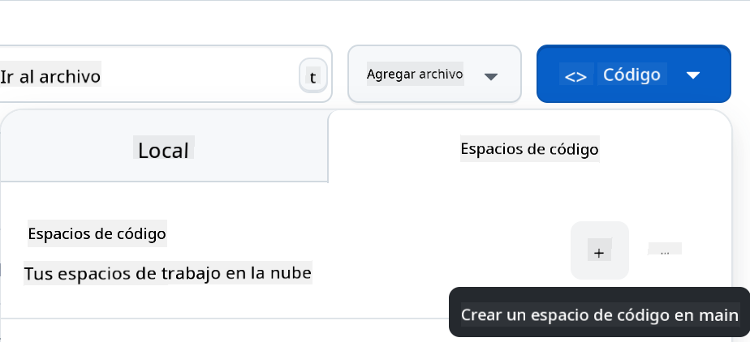

<!--
CO_OP_TRANSLATOR_METADATA:
{
  "original_hash": "cf15ff7770c5a484349383bb27d1131f",
  "translation_date": "2025-08-29T17:03:14+00:00",
  "source_file": "9-chat-project/README.md",
  "language_code": "es"
}
-->
# Proyecto de Chat

Este proyecto de chat muestra cómo construir un Asistente de Chat utilizando los Modelos de GitHub.

Así es como se ve el proyecto terminado:

<div>
  
</div>

Un poco de contexto: construir asistentes de chat utilizando IA generativa es una excelente manera de comenzar a aprender sobre IA. Lo que aprenderás es a integrar IA generativa en una aplicación web a lo largo de esta lección. ¡Comencemos!

## Conectando con IA generativa

Para el backend, estamos utilizando los Modelos de GitHub. Es un gran servicio que te permite usar IA de forma gratuita. Ve a su playground y obtén el código que corresponde a tu lenguaje de backend elegido. Así es como se ve en [GitHub Models Playground](https://github.com/marketplace/models/azure-openai/gpt-4o-mini/playground)

<div>
  
</div>

Como mencionamos, selecciona la pestaña "Code" y tu entorno de ejecución preferido.

<div>
  
</div>

En este caso, seleccionamos Python, lo que significa que elegimos este código:

```python
"""Run this model in Python

> pip install openai
"""
import os
from openai import OpenAI

# To authenticate with the model you will need to generate a personal access token (PAT) in your GitHub settings. 
# Create your PAT token by following instructions here: https://docs.github.com/en/authentication/keeping-your-account-and-data-secure/managing-your-personal-access-tokens
client = OpenAI(
    base_url="https://models.github.ai/inference",
    api_key=os.environ["GITHUB_TOKEN"],
)

response = client.chat.completions.create(
    messages=[
        {
            "role": "system",
            "content": "",
        },
        {
            "role": "user",
            "content": "What is the capital of France?",
        }
    ],
    model="openai/gpt-4o-mini",
    temperature=1,
    max_tokens=4096,
    top_p=1
)

print(response.choices[0].message.content)
```

Vamos a limpiar este código un poco para que sea reutilizable:

```python
def call_llm(prompt: str, system_message: str):
    response = client.chat.completions.create(
        messages=[
            {
                "role": "system",
                "content": system_message,
            },
            {
                "role": "user",
                "content": prompt,
            }
        ],
        model="openai/gpt-4o-mini",
        temperature=1,
        max_tokens=4096,
        top_p=1
    )

    return response.choices[0].message.content
```

Con esta función `call_llm`, ahora podemos tomar un prompt y un prompt del sistema, y la función devolverá el resultado.

### Personalizar el Asistente de IA

Si deseas personalizar el asistente de IA, puedes especificar cómo quieres que se comporte llenando el prompt del sistema de esta manera:

```python
call_llm("Tell me about you", "You're Albert Einstein, you only know of things in the time you were alive")
```

## Exponerlo a través de una API Web

Genial, ya tenemos la parte de IA lista. Veamos cómo podemos integrarla en una API Web. Para la API Web, elegimos usar Flask, pero cualquier framework web debería funcionar. Veamos el código:

```python
# api.py
from flask import Flask, request, jsonify
from llm import call_llm
from flask_cors import CORS

app = Flask(__name__)
CORS(app)   # *   example.com

@app.route("/", methods=["GET"])
def index():
    return "Welcome to this API. Call POST /hello with 'message': 'my message' as JSON payload"


@app.route("/hello", methods=["POST"])
def hello():
    # get message from request body  { "message": "do this taks for me" }
    data = request.get_json()
    message = data.get("message", "")

    response = call_llm(message, "You are a helpful assistant.")
    return jsonify({
        "response": response
    })

if __name__ == "__main__":
    app.run(host="0.0.0.0", port=5000)
```

Aquí, creamos una API con Flask y definimos una ruta predeterminada "/" y "/chat". Esta última está destinada a ser utilizada por nuestro frontend para enviar preguntas.

Para integrar *llm.py*, esto es lo que necesitamos hacer:

- Importar la función `call_llm`:

   ```python
   from llm import call_llm
   from flask import Flask, request
   ```

- Llamarla desde la ruta "/chat":

   ```python
   @app.route("/hello", methods=["POST"])
   def hello():
      # get message from request body  { "message": "do this taks for me" }
      data = request.get_json()
      message = data.get("message", "")

      response = call_llm(message, "You are a helpful assistant.")
      return jsonify({
         "response": response
      })
   ```

   Aquí analizamos la solicitud entrante para recuperar la propiedad `message` del cuerpo JSON. Después, llamamos al LLM con esta llamada:

   ```python
   response = call_llm(message, "You are a helpful assistant")

   # return the response as JSON
   return jsonify({
      "response": response 
   })
   ```

Genial, ahora hemos hecho lo necesario.

### Configurar Cors

Debemos mencionar que configuramos algo como CORS, intercambio de recursos de origen cruzado. Esto significa que, dado que nuestro backend y frontend se ejecutarán en diferentes puertos, necesitamos permitir que el frontend llame al backend. Hay un fragmento de código en *api.py* que configura esto:

```python
from flask_cors import CORS

app = Flask(__name__)
CORS(app)   # *   example.com
```

En este momento, está configurado para permitir "*", que son todos los orígenes, y eso es un poco inseguro. Deberíamos restringirlo una vez que pasemos a producción.

## Ejecutar tu proyecto

Bien, ya tenemos *llm.py* y *api.py*. ¿Cómo podemos hacer que esto funcione con un backend? Bueno, hay dos cosas que necesitamos hacer:

- Instalar dependencias:

   ```sh
   cd backend
   python -m venv venv
   source ./venv/bin/activate

   pip install openai flask flask-cors openai
   ```

- Iniciar la API:

   ```sh
   python api.py
   ```

   Si estás en Codespaces, necesitas ir a Puertos en la parte inferior del editor, hacer clic derecho sobre él y seleccionar "Port Visibility" y luego "Public".

### Trabajar en un frontend

Ahora que tenemos una API en funcionamiento, vamos a crear un frontend para esto. Un frontend mínimo que mejoraremos paso a paso. En una carpeta *frontend*, crea lo siguiente:

```text
backend/
frontend/
index.html
app.js
styles.css
```

Comencemos con **index.html**:

```html
<html>
    <head>
        <link rel="stylesheet" href="styles.css">
    </head>
    <body>
      <form>
        <textarea id="messages"></textarea>
        <input id="input" type="text" />
        <button type="submit" id="sendBtn">Send</button>  
      </form>  
      <script src="app.js" />
    </body>
</html>    
```

Lo anterior es lo mínimo necesario para soportar una ventana de chat, ya que consiste en un área de texto donde se renderizarán los mensajes, un campo de entrada para escribir el mensaje y un botón para enviarlo al backend. Veamos el JavaScript a continuación en *app.js*.

**app.js**

```js
// app.js

(function(){
  // 1. set up elements  
  const messages = document.getElementById("messages");
  const form = document.getElementById("form");
  const input = document.getElementById("input");

  const BASE_URL = "change this";
  const API_ENDPOINT = `${BASE_URL}/hello`;

  // 2. create a function that talks to our backend
  async function callApi(text) {
    const response = await fetch(API_ENDPOINT, {
      method: "POST",
      headers: { "Content-Type": "application/json" },
      body: JSON.stringify({ message: text })
    });
    let json = await response.json();
    return json.response;
  }

  // 3. add response to our textarea
  function appendMessage(text, role) {
    const el = document.createElement("div");
    el.className = `message ${role}`;
    el.innerHTML = text;
    messages.appendChild(el);
  }

  // 4. listen to submit events
  form.addEventListener("submit", async(e) => {
    e.preventDefault();
   // someone clicked the button in the form
   
   // get input
   const text = input.value.trim();

   appendMessage(text, "user")

   // reset it
   input.value = '';

   const reply = await callApi(text);

   // add to messages
   appendMessage(reply, "assistant");

  })
})();
```

Analicemos el código por sección:

- 1) Aquí obtenemos una referencia a todos nuestros elementos que usaremos más adelante en el código.
- 2) En esta sección, creamos una función que utiliza el método `fetch` incorporado para llamar a nuestro backend.
- 3) `appendMessage` ayuda a agregar respuestas, así como lo que escribes como usuario.
- 4) Aquí escuchamos el evento de envío, leemos el campo de entrada, colocamos el mensaje del usuario en el área de texto, llamamos a la API y renderizamos la respuesta en el área de texto.

Veamos el estilo a continuación. Aquí puedes ser muy creativo y hacerlo como quieras, pero aquí tienes algunas sugerencias:

**styles.css**

```
.message {
    background: #222;
    box-shadow: 0 0 0 10px orange;
    padding: 10px:
    margin: 5px;
}

.message.user {
    background: blue;
}

.message.assistant {
    background: grey;
} 
```

Con estas tres clases, puedes estilizar los mensajes de manera diferente dependiendo de si provienen del asistente o de ti como usuario. Si necesitas inspiración, revisa la carpeta `solution/frontend/styles.css`.

### Cambiar la URL Base

Hay algo que no configuramos aquí, y es `BASE_URL`. Esto no se conoce hasta que tu backend esté iniciado. Para configurarlo:

- Si ejecutas la API localmente, debería configurarse como algo como `http://localhost:5000`.
- Si se ejecuta en Codespaces, debería verse algo como "[name]app.github.dev".

## Tarea

Crea tu propia carpeta *project* con contenido como este:

```text
project/
  frontend/
    index.html
    app.js
    styles.css
  backend/
    api.py
    llm.py
```

Copia el contenido de lo que se indicó anteriormente, pero siéntete libre de personalizarlo a tu gusto.

## Solución

[Solución](./solution/README.md)

## Bonus

Intenta cambiar la personalidad del asistente de IA. Cuando llames a `call_llm` en *api.py*, puedes cambiar el segundo argumento a lo que desees, por ejemplo:

```python
call_llm(message, "You are Captain Picard")
```

Cambia también el CSS y el texto a tu gusto, haciendo cambios en *index.html* y *styles.css*.

## Resumen

¡Genial! Has aprendido desde cero cómo crear un asistente personal utilizando IA. Lo hemos hecho utilizando los Modelos de GitHub, un backend en Python y un frontend en HTML, CSS y JavaScript.

## Configuración con Codespaces

- Navega a: [Repositorio Web Dev For Beginners](https://github.com/microsoft/Web-Dev-For-Beginners)
- Crea desde una plantilla (asegúrate de haber iniciado sesión en GitHub) en la esquina superior derecha:

    

- Una vez en tu repositorio, crea un Codespace:

    

    Esto debería iniciar un entorno con el que ahora puedes trabajar.

---

**Descargo de responsabilidad**:  
Este documento ha sido traducido utilizando el servicio de traducción automática [Co-op Translator](https://github.com/Azure/co-op-translator). Aunque nos esforzamos por garantizar la precisión, tenga en cuenta que las traducciones automatizadas pueden contener errores o imprecisiones. El documento original en su idioma nativo debe considerarse como la fuente autorizada. Para información crítica, se recomienda una traducción profesional realizada por humanos. No nos hacemos responsables de malentendidos o interpretaciones erróneas que puedan surgir del uso de esta traducción.