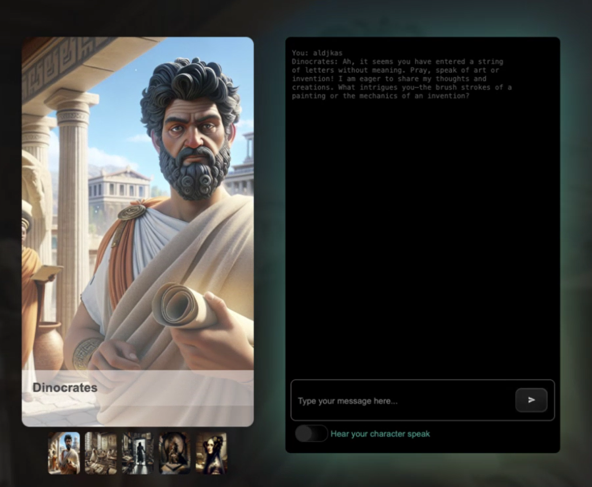
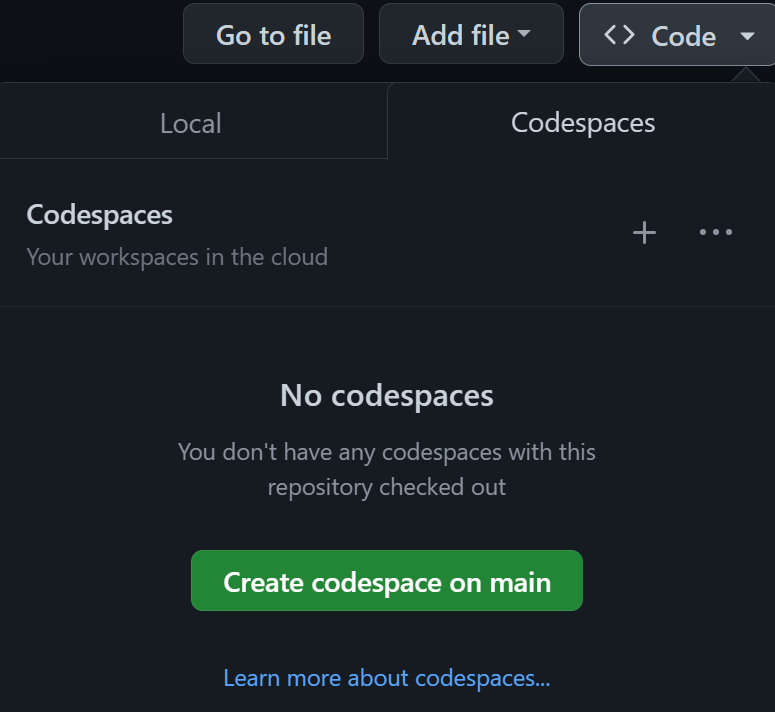

<!--
CO_OP_TRANSLATOR_METADATA:
{
  "original_hash": "3bea83a071750b68d3c8755f1155f805",
  "translation_date": "2025-10-03T08:26:16+00:00",
  "source_file": "README.md",
  "language_code": "es"
}
-->
[](https://github.com/microsoft/Web-Dev-For-Beginners/blob/master/LICENSE)
[](https://GitHub.com/microsoft/Web-Dev-For-Beginners/graphs/contributors/)
[](https://GitHub.com/microsoft/Web-Dev-For-Beginners/issues/)
[](https://GitHub.com/microsoft/Web-Dev-For-Beginners/pulls/)
[](http://makeapullrequest.com)

[](https://GitHub.com/microsoft/Web-Dev-For-Beginners/watchers/)
[](https://GitHub.com/microsoft/Web-Dev-For-Beginners/network/)
[](https://GitHub.com/microsoft/Web-Dev-For-Beginners/stargazers/)

[](https://discord.gg/zxKYvhSnVp?WT.mc_id=academic-000002-leestott)

[](https://open.vscode.dev/microsoft/Web-Dev-For-Beginners)

[](https://discord.com/invite/ByRwuEEgH4)

Sigue estos pasos para comenzar a usar estos recursos:
1. **Haz un fork del repositorio**: Haz clic en [](https://GitHub.com/microsoft/Web-Dev-For-Beginners/fork)
2. **Clona el repositorio**:   `git clone https://github.com/microsoft/Web-Dev-For-Beginners.git`
3. [**Únete al Discord de Azure AI Foundry y conecta con expertos y otros desarrolladores**](https://discord.com/invite/ByRwuEEgH4)

# Desarrollo Web para Principiantes - Un Currículo

Aprende los fundamentos del desarrollo web con nuestro curso integral de 12 semanas creado por Microsoft Cloud Advocates. Cada una de las 24 lecciones explora JavaScript, CSS y HTML a través de proyectos prácticos como terrarios, extensiones de navegador y juegos espaciales. Participa en cuestionarios, discusiones y tareas prácticas. Mejora tus habilidades y optimiza tu aprendizaje con nuestra metodología basada en proyectos. ¡Comienza tu viaje en la programación hoy mismo!

### 🌐 Soporte Multilingüe

#### Disponible a través de GitHub Action (Automatizado y siempre actualizado)

[Francés](../fr/README.md) | [Español](./README.md) | [Alemán](../de/README.md) | [Ruso](../ru/README.md) | [Árabe](../ar/README.md) | [Persa (Farsi)](../fa/README.md) | [Urdu](../ur/README.md) | [Chino (Simplificado)](../zh/README.md) | [Chino (Tradicional, Macao)](../mo/README.md) | [Chino (Tradicional, Hong Kong)](../hk/README.md) | [Chino (Tradicional, Taiwán)](../tw/README.md) | [Japonés](../ja/README.md) | [Coreano](../ko/README.md) | [Hindi](../hi/README.md) | [Bengalí](../bn/README.md) | [Maratí](../mr/README.md) | [Nepalí](../ne/README.md) | [Punyabí (Gurmukhi)](../pa/README.md) | [Portugués (Portugal)](../pt/README.md) | [Portugués (Brasil)](../br/README.md) | [Italiano](../it/README.md) | [Polaco](../pl/README.md) | [Turco](../tr/README.md) | [Griego](../el/README.md) | [Tailandés](../th/README.md) | [Sueco](../sv/README.md) | [Danés](../da/README.md) | [Noruego](../no/README.md) | [Finlandés](../fi/README.md) | [Holandés](../nl/README.md) | [Hebreo](../he/README.md) | [Vietnamita](../vi/README.md) | [Indonesio](../id/README.md) | [Malayo](../ms/README.md) | [Tagalo (Filipino)](../tl/README.md) | [Suajili](../sw/README.md) | [Húngaro](../hu/README.md) | [Checo](../cs/README.md) | [Eslovaco](../sk/README.md) | [Rumano](../ro/README.md) | [Búlgaro](../bg/README.md) | [Serbio (Cirílico)](../sr/README.md) | [Croata](../hr/README.md) | [Esloveno](../sl/README.md) | [Ucraniano](../uk/README.md) | [Birmano (Myanmar)](../my/README.md)

**Si deseas que se admitan idiomas adicionales, consulta la lista [aquí](https://github.com/Azure/co-op-translator/blob/main/getting_started/supported-languages.md)**

#### 🧑‍🎓 _¿Eres estudiante?_

Visita la [**página del Student Hub**](https://docs.microsoft.com/learn/student-hub/?WT.mc_id=academic-77807-sagibbon) donde encontrarás recursos para principiantes, paquetes para estudiantes e incluso formas de obtener un voucher para un certificado gratuito. Es una página que querrás marcar como favorita y revisar de vez en cuando, ya que el contenido se actualiza mensualmente.

### 📣 Anuncio - _Nuevo Proyecto para construir usando IA Generativa_

Acabamos de añadir un nuevo proyecto de asistente de IA, échale un vistazo [proyecto](./09-chat-project/README.md)

### 📣 Anuncio - _Nuevo Currículo_ sobre IA Generativa para JavaScript recién lanzado

¡No te pierdas nuestro nuevo currículo de IA Generativa!

Visita [https://aka.ms/genai-js-course](https://aka.ms/genai-js-course) para comenzar.


- Lecciones que cubren desde lo básico hasta RAG.
- Interactúa con personajes históricos usando GenAI y nuestra aplicación complementaria.
- Narrativa divertida y atractiva, ¡viajarás en el tiempo!



Cada lección incluye una tarea para completar, una evaluación de conocimientos y un desafío para guiarte en temas como:
- Creación de prompts y ingeniería de prompts
- Generación de aplicaciones de texto e imagen
- Aplicaciones de búsqueda

Visita [https://aka.ms/genai-js-course](../../[https:/aka.ms/genai-js-course) para comenzar.

## 🌱 Comenzando

> **Profesores**, hemos [incluido algunas sugerencias](for-teachers.md) sobre cómo usar este currículo. Nos encantaría recibir sus comentarios [en nuestro foro de discusión](https://github.com/microsoft/Web-Dev-For-Beginners/discussions/categories/teacher-corner).

**[Estudiantes](https://aka.ms/student-page/?WT.mc_id=academic-77807-sagibbon)**, para cada lección, comienza con un cuestionario previo a la clase y continúa leyendo el material de la lección, completando las diversas actividades y verificando tu comprensión con el cuestionario posterior a la clase.

Para mejorar tu experiencia de aprendizaje, conecta con tus compañeros para trabajar juntos en los proyectos. Las discusiones son bienvenidas en nuestro [foro de discusión](https://github.com/microsoft/Web-Dev-For-Beginners/discussions), donde nuestro equipo de moderadores estará disponible para responder tus preguntas.

Para continuar tu educación, recomendamos explorar [Microsoft Learn](https://learn.microsoft.com/users/wirelesslife/collections/p1ddcy5jwy0jkm?WT.mc_id=academic-77807-sagibbon) para materiales de estudio adicionales.

### 📋 Configurando tu entorno

Este currículo tiene un entorno de desarrollo listo para usar. Al comenzar, puedes elegir ejecutar el currículo en un [Codespace](https://github.com/features/codespaces/) (_un entorno basado en navegador, sin necesidad de instalaciones_), o localmente en tu computadora usando un editor de texto como [Visual Studio Code](https://code.visualstudio.com/?WT.mc_id=academic-77807-sagibbon).

#### Crea tu repositorio
Para guardar tu trabajo fácilmente, se recomienda que crees tu propia copia de este repositorio. Puedes hacerlo haciendo clic en el botón **Use this template** en la parte superior de la página. Esto creará un nuevo repositorio en tu cuenta de GitHub con una copia del currículo.

Sigue estos pasos:
1. **Haz un fork del repositorio**: Haz clic en el botón "Fork" en la esquina superior derecha de esta página.
2. **Clona el repositorio**:   `git clone https://github.com/microsoft/Web-Dev-For-Beginners.git`

#### Ejecutando el currículo en un Codespace

En tu copia de este repositorio que creaste, haz clic en el botón **Code** y selecciona **Open with Codespaces**. Esto creará un nuevo Codespace para que trabajes.



#### Ejecutando el currículo localmente en tu computadora

Para ejecutar este currículo localmente en tu computadora, necesitarás un editor de texto, un navegador y una herramienta de línea de comandos. Nuestra primera lección, [Introducción a los Lenguajes de Programación y Herramientas del Oficio](../../1-getting-started-lessons/1-intro-to-programming-languages), te guiará a través de varias opciones para cada una de estas herramientas para que selecciones la que mejor funcione para ti.

Nuestra recomendación es usar [Visual Studio Code](https://code.visualstudio.com/?WT.mc_id=academic-77807-sagibbon) como tu editor, que también tiene un [Terminal](https://code.visualstudio.com/docs/terminal/basics/?WT.mc_id=academic-77807-sagibbon) integrado. Puedes descargar Visual Studio Code [aquí](https://code.visualstudio.com/?WT.mc_id=academic-77807-sagibbon).

1. Clona tu repositorio en tu computadora. Puedes hacerlo haciendo clic en el botón **Code** y copiando la URL:

    [CodeSpace](./images/createcodespace.png)

    Luego, abre el [Terminal](https://code.visualstudio.com/docs/terminal/basics/?WT.mc_id=academic-77807-sagibbon) dentro de [Visual Studio Code](https://code.visualstudio.com/?WT.mc_id=academic-77807-sagibbon) y ejecuta el siguiente comando, reemplazando `<your-repository-url>` con la URL que acabas de copiar:

    ```bash 
    git clone <your-repository-url>
    ```

2. Abre la carpeta en Visual Studio Code. Puedes hacerlo haciendo clic en **File** > **Open Folder** y seleccionando la carpeta que acabas de clonar.

> Extensiones recomendadas para Visual Studio Code:
>
> * [Live Server](https://marketplace.visualstudio.com/items?itemName=ritwickdey.LiveServer&WT.mc_id=academic-77807-sagibbon) - para previsualizar páginas HTML dentro de Visual Studio Code
> * [Copilot](https://marketplace.visualstudio.com/items?itemName=GitHub.copilot&WT.mc_id=academic-77807-sagibbon) - para ayudarte a escribir código más rápido

## 📂 Cada lección incluye:

- sketchnote opcional
- video complementario opcional
- cuestionario de calentamiento previo a la lección
- lección escrita
- para lecciones basadas en proyectos, guías paso a paso sobre cómo construir el proyecto
- evaluaciones de conocimiento
- un desafío
- lectura complementaria
- tarea
- [cuestionario posterior a la lección](https://ff-quizzes.netlify.app/web/)
> **Una nota sobre los cuestionarios**: Todos los cuestionarios están contenidos en la carpeta Quiz-app, un total de 48 cuestionarios de tres preguntas cada uno. Están disponibles [aquí](https://ff-quizzes.netlify.app/web/). La aplicación de cuestionarios puede ejecutarse localmente o desplegarse en Azure; sigue las instrucciones en la carpeta `quiz-app`.

## 🗃️ Lecciones

|     |                       Nombre del Proyecto                       |                            Conceptos Enseñados                             | Objetivos de Aprendizaje                                                                                                            |                                                         Lección Vinculada                                                          |         Autor          |
| :-: | :-------------------------------------------------------------: | :------------------------------------------------------------------------: | ----------------------------------------------------------------------------------------------------------------------------------- | :-------------------------------------------------------------------------------------------------------------------------------: | :--------------------: |
| 01  |                     Primeros Pasos                              |           Introducción a la Programación y Herramientas del Oficio         | Aprende los fundamentos básicos detrás de la mayoría de los lenguajes de programación y sobre el software que ayuda a los desarrolladores profesionales en su trabajo | [Introducción a los Lenguajes de Programación y Herramientas del Oficio](./1-getting-started-lessons/1-intro-to-programming-languages/README.md) |         Jasmine         |
| 02  |                     Primeros Pasos                              |             Conceptos básicos de GitHub, incluye trabajo en equipo         | Cómo usar GitHub en tu proyecto y colaborar con otros en una base de código                                                        |                            [Introducción a GitHub](./1-getting-started-lessons/2-github-basics/README.md)                             |          Floor          |
| 03  |                     Primeros Pasos                              |                             Accesibilidad                                  | Aprende los conceptos básicos de accesibilidad web                                                                                 |                       [Fundamentos de Accesibilidad](./1-getting-started-lessons/3-accessibility/README.md)                       |       Christopher       |
| 04  |                        Conceptos Básicos de JS                  |                         Tipos de Datos en JavaScript                       | Los conceptos básicos de los tipos de datos en JavaScript                                                                          |                                       [Tipos de Datos](./2-js-basics/1-data-types/README.md)                                        |         Jasmine         |
| 05  |                        Conceptos Básicos de JS                  |                         Funciones y Métodos                                | Aprende sobre funciones y métodos para gestionar el flujo lógico de una aplicación                                                 |                              [Funciones y Métodos](./2-js-basics/2-functions-methods/README.md)                               | Jasmine y Christopher |
| 06  |                        Conceptos Básicos de JS                  |                        Tomando Decisiones con JS                           | Aprende cómo crear condiciones en tu código utilizando métodos de toma de decisiones                                               |                                 [Tomando Decisiones](./2-js-basics/3-making-decisions/README.md)                                  |         Jasmine         |
| 07  |                        Conceptos Básicos de JS                  |                            Arrays y Bucles                                 | Trabaja con datos utilizando arrays y bucles en JavaScript                                                                         |                                   [Arrays y Bucles](./2-js-basics/4-arrays-loops/README.md)                                    |         Jasmine         |
| 08  |       [Terrario](./3-terrarium/solution/README.md)              |                            HTML en Práctica                                | Construye el HTML para crear un terrario en línea, enfocándote en construir un diseño                                              |                                 [Introducción a HTML](./3-terrarium/1-intro-to-html/README.md)                                 |           Jen           |
| 09  |       [Terrario](./3-terrarium/solution/README.md)              |                            CSS en Práctica                                 | Construye el CSS para estilizar el terrario en línea, enfocándote en los conceptos básicos de CSS, incluyendo hacer la página responsiva |                                  [Introducción a CSS](./3-terrarium/2-intro-to-css/README.md)                                  |           Jen           |
| 10  |            [Terrario](./3-terrarium/solution/README.md)         |                 Closures en JavaScript, manipulación del DOM               | Construye el JavaScript para que el terrario funcione como una interfaz de arrastrar/soltar, enfocándote en closures y manipulación del DOM |                  [Closures en JavaScript, manipulación del DOM](./3-terrarium/3-intro-to-DOM-and-closures/README.md)                   |           Jen           |
| 11  |          [Juego de Escritura](./4-typing-game/solution/README.md) |                          Construye un Juego de Escritura                   | Aprende cómo usar eventos de teclado para dirigir la lógica de tu aplicación JavaScript                                            |                                [Programación Basada en Eventos](./4-typing-game/typing-game/README.md)                                |       Christopher       |
| 12  | [Extensión de Navegador Verde](./5-browser-extension/solution/README.md) |                         Trabajando con Navegadores                        | Aprende cómo funcionan los navegadores, su historia y cómo estructurar los primeros elementos de una extensión de navegador         |                               [Sobre Navegadores](./5-browser-extension/1-about-browsers/README.md)                                |           Jen           |
| 13  | [Extensión de Navegador Verde](./5-browser-extension/solution/README.md) | Construcción de un formulario, llamada a una API y almacenamiento de variables en local storage | Construye los elementos JavaScript de tu extensión de navegador para llamar a una API utilizando variables almacenadas en local storage |                [APIs, Formularios y Local Storage](./5-browser-extension/2-forms-browsers-local-storage/README.md)                 |           Jen           |
| 14  | [Extensión de Navegador Verde](./5-browser-extension/solution/README.md) |          Procesos en segundo plano en el navegador, rendimiento web        | Utiliza los procesos en segundo plano del navegador para gestionar el ícono de la extensión; aprende sobre rendimiento web y algunas optimizaciones |             [Tareas en Segundo Plano y Rendimiento](./5-browser-extension/3-background-tasks-and-performance/README.md)              |           Jen           |
| 15  |           [Juego Espacial](./6-space-game/solution/README.md)   |             Desarrollo de Juegos Más Avanzado con JavaScript              | Aprende sobre Herencia utilizando Clases y Composición, y el patrón Pub/Sub, en preparación para construir un juego                |                      [Introducción al Desarrollo de Juegos Avanzado](./6-space-game/1-introduction/README.md)                       |          Chris          |
| 16  |           [Juego Espacial](./6-space-game/solution/README.md)   |                           Dibujando en Canvas                             | Aprende sobre la API de Canvas, utilizada para dibujar elementos en una pantalla                                                   |                                [Dibujando en Canvas](./6-space-game/2-drawing-to-canvas/README.md)                                |          Chris          |
| 17  |           [Juego Espacial](./6-space-game/solution/README.md)   |                   Moviendo elementos en la pantalla                       | Descubre cómo los elementos pueden adquirir movimiento utilizando coordenadas cartesianas y la API de Canvas                       |                           [Moviendo Elementos](./6-space-game/3-moving-elements-around/README.md)                           |          Chris          |
| 18  |           [Juego Espacial](./6-space-game/solution/README.md)   |                          Detección de colisiones                          | Haz que los elementos colisionen y reaccionen entre sí utilizando teclas y proporciona una función de enfriamiento para garantizar el rendimiento del juego |                              [Detección de Colisiones](./6-space-game/4-collision-detection/README.md)                              |          Chris          |
| 19  |           [Juego Espacial](./6-space-game/solution/README.md)   |                             Manteniendo el puntaje                        | Realiza cálculos matemáticos basados en el estado y rendimiento del juego                                                           |                                    [Manteniendo el Puntaje](./6-space-game/5-keeping-score/README.md)                                    |          Chris          |
| 20  |           [Juego Espacial](./6-space-game/solution/README.md)   |                     Finalizando y reiniciando el juego                    | Aprende sobre cómo finalizar y reiniciar el juego, incluyendo limpiar recursos y restablecer valores de variables                  |                                [Condición de Finalización](./6-space-game/6-end-condition/README.md)                                 |          Chris          |
| 21  |         [Aplicación Bancaria](./7-bank-project/solution/README.md) |                 Plantillas HTML y Rutas en una Aplicación Web             | Aprende cómo crear la estructura de la arquitectura de un sitio web multipágina utilizando rutas y plantillas HTML                 |                            [Plantillas HTML y Rutas](./7-bank-project/1-template-route/README.md)                             |          Yohan          |
| 22  |         [Aplicación Bancaria](./7-bank-project/solution/README.md) |                  Construcción de un Formulario de Inicio de Sesión y Registro | Aprende sobre la construcción de formularios y manejo de rutinas de validación                                                     |                                           [Formularios](./7-bank-project/2-forms/README.md)                                           |          Yohan          |
| 23  |         [Aplicación Bancaria](./7-bank-project/solution/README.md) |                   Métodos para Obtener y Usar Datos                       | Cómo los datos fluyen dentro y fuera de tu aplicación, cómo obtenerlos, almacenarlos y eliminarlos                                 |                                            [Datos](./7-bank-project/3-data/README.md)                                            |          Yohan          |
| 24  |         [Aplicación Bancaria](./7-bank-project/solution/README.md) |                      Conceptos de Gestión de Estado                      | Aprende cómo tu aplicación retiene el estado y cómo gestionarlo programáticamente                                                  |                                [Gestión de Estado](./7-bank-project/4-state-management/README.md)                                |          Yohan          |
| 25 | [Editor de Código en Navegador/VScode](../../8-code-editor) | Trabajando con VScode | Aprende cómo usar un editor de código | [Usar el Editor de Código VScode](./8-code-editor/1-using-a-code-editor/README.md) | Chris |
| 26 | [Asistentes de IA](./9-chat-project/README.md) | Trabajando con IA | Aprende cómo construir tu propio asistente de IA | [Proyecto de Asistente de IA](./9-chat-project/README.md) | Chris |

## 🏫 Pedagogía

Nuestro plan de estudios está diseñado con dos principios pedagógicos clave en mente:
* aprendizaje basado en proyectos
* cuestionarios frecuentes

El programa enseña los fundamentos de JavaScript, HTML y CSS, así como las herramientas y técnicas más recientes utilizadas por los desarrolladores web actuales. Los estudiantes tendrán la oportunidad de adquirir experiencia práctica construyendo un juego de escritura, un terrario virtual, una extensión de navegador ecológica, un juego estilo "space invaders" y una aplicación bancaria para empresas. Al final de la serie, los estudiantes habrán adquirido una sólida comprensión del desarrollo web.

> 🎓 ¡Puedes tomar las primeras lecciones de este plan de estudios como un [Camino de Aprendizaje](https://docs.microsoft.com/learn/paths/web-development-101/?WT.mc_id=academic-77807-sagibbon) en Microsoft Learn!

Al garantizar que el contenido esté alineado con los proyectos, el proceso se vuelve más atractivo para los estudiantes y se mejora la retención de conceptos. También escribimos varias lecciones introductorias sobre los conceptos básicos de JavaScript para presentar ideas, acompañadas de un video de la colección "[Serie para Principiantes: JavaScript](https://channel9.msdn.com/Series/Beginners-Series-to-JavaScript/?WT.mc_id=academic-77807-sagibbon)", algunos de cuyos autores contribuyeron a este plan de estudios.

Además, un cuestionario de bajo riesgo antes de una clase establece la intención del estudiante hacia el aprendizaje de un tema, mientras que un segundo cuestionario después de la clase asegura una mayor retención. Este plan de estudios fue diseñado para ser flexible y divertido, y puede tomarse en su totalidad o en parte. Los proyectos comienzan pequeños y se vuelven cada vez más complejos al final del ciclo de 12 semanas.

Aunque hemos evitado intencionalmente introducir frameworks de JavaScript para concentrarnos en las habilidades básicas necesarias como desarrollador web antes de adoptar un framework, un buen siguiente paso después de completar este plan de estudios sería aprender sobre Node.js a través de otra colección de videos: "[Serie para Principiantes: Node.js](https://channel9.msdn.com/Series/Beginners-Series-to-Nodejs/?WT.mc_id=academic-77807-sagibbon)".

> Visita nuestras pautas de [Código de Conducta](CODE_OF_CONDUCT.md) y [Contribución](CONTRIBUTING.md). ¡Agradecemos tus comentarios constructivos!

## 🧭 Acceso sin conexión

Puedes ejecutar esta documentación sin conexión utilizando [Docsify](https://docsify.js.org/#/). Haz un fork de este repositorio, [instala Docsify](https://docsify.js.org/#/quickstart) en tu máquina local y luego, en la carpeta raíz de este repositorio, escribe `docsify serve`. El sitio web se servirá en el puerto 3000 de tu localhost: `localhost:3000`.

## 📘 PDF

Un PDF de todas las lecciones se puede encontrar [aquí](https://microsoft.github.io/Web-Dev-For-Beginners/pdf/readme.pdf).

## 🎒 Otros Cursos

¡Nuestro equipo produce otros cursos! Échales un vistazo:

- [Generative AI for Beginners](https://aka.ms/genai-beginners)
- [Generative AI for Beginners .NET](https://github.com/microsoft/Generative-AI-for-beginners-dotnet)
- [Generative AI with JavaScript](https://github.com/microsoft/generative-ai-with-javascript)
- [Generative AI with Java](https://github.com/microsoft/Generative-AI-for-beginners-java)
- [AI for Beginners](https://aka.ms/ai-beginners)
- [Data Science for Beginners](https://aka.ms/datascience-beginners)
- [ML for Beginners](https://aka.ms/ml-beginners)
- [Cybersecurity for Beginners](https://github.com/microsoft/Security-101)
- [Web Dev for Beginners](https://aka.ms/webdev-beginners)
- [IoT for Beginners](https://aka.ms/iot-beginners)
- [XR Development for Beginners](https://github.com/microsoft/xr-development-for-beginners)
- [Mastering GitHub Copilot for Agentic use](https://github.com/microsoft/Mastering-GitHub-Copilot-for-Paired-Programming)
- [Mastering GitHub Copilot for C#/.NET Developers](https://github.com/microsoft/mastering-github-copilot-for-dotnet-csharp-developers)
- [Elige Tu Propia Aventura con Copilot](https://github.com/microsoft/CopilotAdventures)

## Obtener Ayuda

Si te quedas atascado o tienes preguntas sobre cómo construir aplicaciones de IA, únete a:

[](https://aka.ms/foundry/discord)

Si tienes comentarios sobre el producto o encuentras errores mientras desarrollas, visita:

[](https://aka.ms/foundry/forum)

## Licencia

Este repositorio está licenciado bajo la licencia MIT. Consulta el archivo [LICENSE](../../LICENSE) para más información.

---

**Descargo de responsabilidad**:  
Este documento ha sido traducido utilizando el servicio de traducción automática [Co-op Translator](https://github.com/Azure/co-op-translator). Aunque nos esforzamos por garantizar la precisión, tenga en cuenta que las traducciones automatizadas pueden contener errores o imprecisiones. El documento original en su idioma nativo debe considerarse como la fuente autorizada. Para información crítica, se recomienda una traducción profesional realizada por humanos. No nos hacemos responsables de malentendidos o interpretaciones erróneas que puedan surgir del uso de esta traducción.