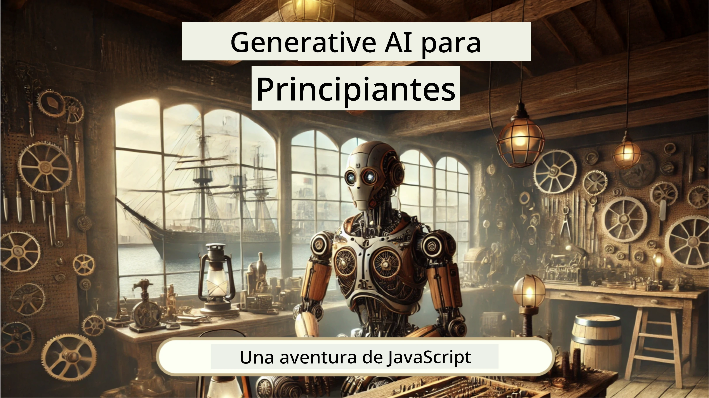
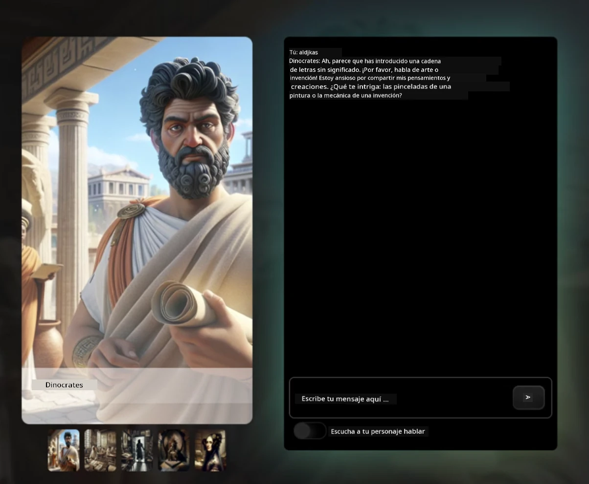
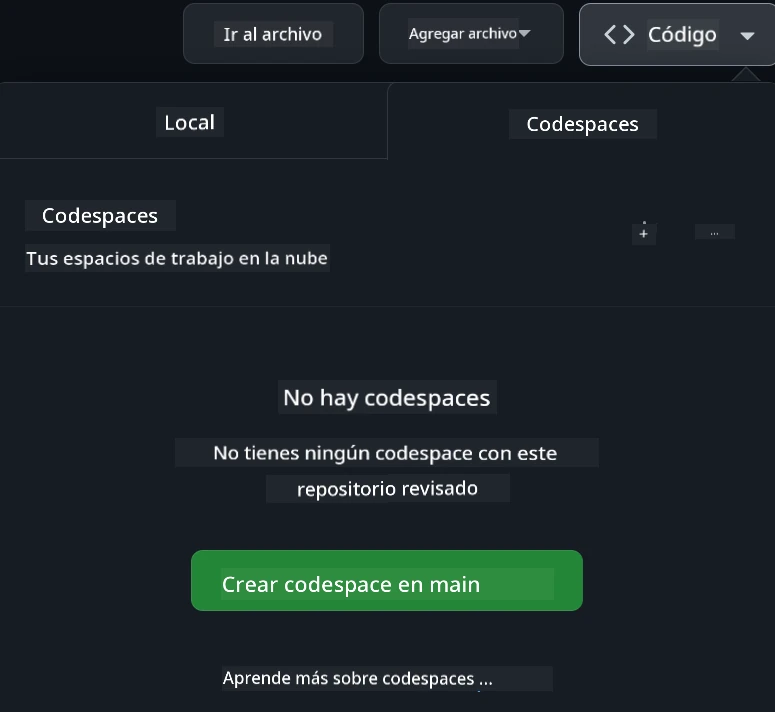

<!--
CO_OP_TRANSLATOR_METADATA:
{
  "original_hash": "fea3a0fceb8ad86fd640c09cf63a2aac",
  "translation_date": "2026-01-06T07:01:57+00:00",
  "source_file": "README.md",
  "language_code": "es"
}
-->
[](https://github.com/microsoft/Web-Dev-For-Beginners/blob/master/LICENSE)
[](https://GitHub.com/microsoft/Web-Dev-For-Beginners/graphs/contributors/)
[](https://GitHub.com/microsoft/Web-Dev-For-Beginners/issues/)
[](https://GitHub.com/microsoft/Web-Dev-For-Beginners/pulls/)
[](http://makeapullrequest.com)

[](https://GitHub.com/microsoft/Web-Dev-For-Beginners/watchers/)
[](https://GitHub.com/microsoft/Web-Dev-For-Beginners/network/)
[](https://GitHub.com/microsoft/Web-Dev-For-Beginners/stargazers/)

[](https://discord.gg/nTYy5BXMWG)

# Desarrollo Web para Principiantes - Un Currículo

Aprende los fundamentos del desarrollo web con nuestro curso integral de 12 semanas impartido por Microsoft Cloud Advocates. Cada una de las 24 lecciones profundiza en JavaScript, CSS y HTML a través de proyectos prácticos como terrarios, extensiones de navegador y juegos espaciales. Participa en cuestionarios, debates y tareas prácticas. Mejora tus habilidades y optimiza la retención de conocimientos con nuestra efectiva pedagogía basada en proyectos. ¡Comienza tu viaje de codificación hoy!

Únete a la Comunidad de Discord de Azure AI Foundry

[](https://discord.gg/nTYy5BXMWG)

Sigue estos pasos para comenzar a usar estos recursos:
1. **Haz un Fork del Repositorio**: Haz clic en [](https://GitHub.com/microsoft/Web-Dev-For-Beginners/fork)
2. **Clona el Repositorio**:   `git clone https://github.com/microsoft/Web-Dev-For-Beginners.git`
3. [**Únete al Discord de Azure AI Foundry y conoce a expertos y desarrolladores**](https://discord.com/invite/ByRwuEEgH4)

### 🌐 Soporte Multilingüe

#### Soportado mediante GitHub Action (Automatizado y Siempre Actualizado)

<!-- CO-OP TRANSLATOR LANGUAGES TABLE START -->
[Árabe](../ar/README.md) | [Bengalí](../bn/README.md) | [Búlgaro](../bg/README.md) | [Birmano (Myanmar)](../my/README.md) | [Chino (Simplificado)](../zh/README.md) | [Chino (Tradicional, Hong Kong)](../hk/README.md) | [Chino (Tradicional, Macao)](../mo/README.md) | [Chino (Tradicional, Taiwán)](../tw/README.md) | [Croata](../hr/README.md) | [Checo](../cs/README.md) | [Danés](../da/README.md) | [Holandés](../nl/README.md) | [Estonio](../et/README.md) | [Finlandés](../fi/README.md) | [Francés](../fr/README.md) | [Alemán](../de/README.md) | [Griego](../el/README.md) | [Hebreo](../he/README.md) | [Hindi](../hi/README.md) | [Húngaro](../hu/README.md) | [Indonesio](../id/README.md) | [Italiano](../it/README.md) | [Japonés](../ja/README.md) | [Kannada](../kn/README.md) | [Coreano](../ko/README.md) | [Lituano](../lt/README.md) | [Malayo](../ms/README.md) | [Malayalam](../ml/README.md) | [Maratí](../mr/README.md) | [Nepalí](../ne/README.md) | [Pidgin Nigeriano](../pcm/README.md) | [Noruego](../no/README.md) | [Persa (Farsi)](../fa/README.md) | [Polaco](../pl/README.md) | [Portugués (Brasil)](../br/README.md) | [Portugués (Portugal)](../pt/README.md) | [Punjabi (Gurmukhi)](../pa/README.md) | [Rumano](../ro/README.md) | [Ruso](../ru/README.md) | [Serbio (Cirílico)](../sr/README.md) | [Eslovaco](../sk/README.md) | [Esloveno](../sl/README.md) | [Español](./README.md) | [Swahili](../sw/README.md) | [Sueco](../sv/README.md) | [Tagalo (Filipino)](../tl/README.md) | [Tamil](../ta/README.md) | [Telugu](../te/README.md) | [Tailandés](../th/README.md) | [Turco](../tr/README.md) | [Ucraniano](../uk/README.md) | [Urdu](../ur/README.md) | [Vietnamita](../vi/README.md)

> **¿Prefieres Clonar Localmente?**

> Este repositorio incluye más de 50 traducciones que aumentan significativamente el tamaño de descarga. Para clonar sin traducciones, usa sparse checkout:
> ```bash
> git clone --filter=blob:none --sparse https://github.com/microsoft/Web-Dev-For-Beginners.git
> cd Web-Dev-For-Beginners
> git sparse-checkout set --no-cone '/*' '!translations' '!translated_images'
> ```
> Esto te da todo lo necesario para completar el curso con una descarga mucho más rápida.
<!-- CO-OP TRANSLATOR LANGUAGES TABLE END -->

**Si deseas que se soporten idiomas de traducción adicionales, están listados [aquí](https://github.com/Azure/co-op-translator/blob/main/getting_started/supported-languages.md)**

[](https://open.vscode.dev/microsoft/Web-Dev-For-Beginners)

#### 🧑‍🎓 _¿Eres estudiante?_

Visita la [**página Student Hub**](https://docs.microsoft.com/learn/student-hub/?WT.mc_id=academic-77807-sagibbon) donde encontrarás recursos para principiantes, paquetes para estudiantes y hasta formas de obtener un comprobante de certificado gratis. Esta es la página que querrás marcar y consultar regularmente ya que renovamos contenido mensualmente.

### 📣 Anuncio - ¡Nuevos desafíos GitHub Copilot Agent para completar!

Nuevo desafío agregado, busca "GitHub Copilot Agent Challenge 🚀" en la mayoría de los capítulos. Es un nuevo reto para que completes usando GitHub Copilot y el modo Agent. Si no has usado el modo Agent antes, es capaz no solo de generar texto sino también de crear y editar archivos, ejecutar comandos y más.

### 📣 Anuncio - _Nuevo Proyecto para construir usando IA Generativa_ 

Nuevo proyecto de Asistente de IA agregado, revisa el [proyecto](./9-chat-project/README.md)

### 📣 Anuncio - _Nuevo Currículo_ sobre IA Generativa para JavaScript acaba de ser lanzado

¡No te pierdas nuestro nuevo currículo de IA Generativa!

Visita [https://aka.ms/genai-js-course](https://aka.ms/genai-js-course) para comenzar!



- Lecciones que cubren todo desde lo básico hasta RAG.
- Interactúa con personajes históricos usando GenAI y nuestra app compañera.
- Narrativa divertida y atractiva, ¡viajarás en el tiempo!




Cada lección incluye una tarea para completar, una revisión de conocimientos y un desafío para guiarte en tópicos como:
- Prompting y ingeniería de prompts
- Generación de aplicaciones de texto e imagen
- Aplicaciones de búsqueda

Visita [https://aka.ms/genai-js-course](../../[https:/aka.ms/genai-js-course) para comenzar!


## 🌱 Comenzando

> **Docentes**, hemos [incluido algunas sugerencias](for-teachers.md) sobre cómo usar este currículo. ¡Nos encantaría recibir sus comentarios [en nuestro foro de discusión](https://github.com/microsoft/Web-Dev-For-Beginners/discussions/categories/teacher-corner)!

**[Estudiantes](https://aka.ms/student-page/?WT.mc_id=academic-77807-sagibbon)**, para cada lección, comiencen con un cuestionario previo y sigan leyendo el material, completando diversas actividades y verificando su comprensión con el cuestionario posterior.

Para mejorar su experiencia, conéctense con sus compañeros para trabajar en los proyectos juntos. Se fomentan las discusiones en nuestro [foro de discusión](https://github.com/microsoft/Web-Dev-For-Beginners/discussions), donde nuestro equipo de moderadores estará disponible para resolver dudas.

Para profundizar en su aprendizaje, recomendamos ampliamente explorar [Microsoft Learn](https://learn.microsoft.com/users/wirelesslife/collections/p1ddcy5jwy0jkm?WT.mc_id=academic-77807-sagibbon) para obtener materiales adicionales.

### 📋 Configurando tu entorno

Este currículo tiene un entorno de desarrollo listo para usar. Al comenzar, puedes elegir ejecutar el currículo en un [Codespace](https://github.com/features/codespaces/) (_un entorno basado en navegador, sin necesidad de instalaciones_), o localmente en tu computadora usando un editor de texto como [Visual Studio Code](https://code.visualstudio.com/?WT.mc_id=academic-77807-sagibbon).

#### Crea tu repositorio
Para que puedas guardar tu trabajo fácilmente, se recomienda crear tu propia copia de este repositorio. Puedes hacerlo haciendo clic en el botón **Usar esta plantilla** en la parte superior de la página. Esto creará un nuevo repositorio en tu cuenta de GitHub con una copia del currículo.

Sigue estos pasos:
1. **Haz un Fork del Repositorio**: Haz clic en el botón "Fork" en la esquina superior derecha de esta página.
2. **Clona el Repositorio**:   `git clone https://github.com/microsoft/Web-Dev-For-Beginners.git`

#### Ejecutando el currículo en un Codespace

En tu copia de este repositorio que creaste, haz clic en el botón **Code** y selecciona **Abrir con Codespaces**. Esto creará un nuevo Codespace para que trabajes dentro.



#### Ejecutando el currículo localmente en tu computadora

Para ejecutar este currículo localmente en tu computadora, necesitarás un editor de texto, un navegador y una herramienta de línea de comandos. Nuestra primera lección, [Introducción a los Lenguajes de Programación y Herramientas del Oficio](../../1-getting-started-lessons/1-intro-to-programming-languages), te guiará por varias opciones para cada una de estas herramientas para que selecciones la que mejor se adapte a ti.

Nuestra recomendación es usar [Visual Studio Code](https://code.visualstudio.com/?WT.mc_id=academic-77807-sagibbon) como editor, que también tiene un [Terminal](https://code.visualstudio.com/docs/terminal/basics/?WT.mc_id=academic-77807-sagibbon) incorporado. Puedes descargar Visual Studio Code [aquí](https://code.visualstudio.com/?WT.mc_id=academic-77807-sagibbon).


1. Clona tu repositorio a tu computadora. Puedes hacerlo haciendo clic en el botón **Code** y copiando la URL:

    [CodeSpace](./images/createcodespace.png)
    Luego, abre [Terminal](https://code.visualstudio.com/docs/terminal/basics/?WT.mc_id=academic-77807-sagibbon) dentro de [Visual Studio Code](https://code.visualstudio.com/?WT.mc_id=academic-77807-sagibbon) y ejecuta el siguiente comando, reemplazando `<your-repository-url>` con la URL que acabas de copiar:

    ```bash 
    git clone <your-repository-url>
    ```

2. Abre la carpeta en Visual Studio Code. Puedes hacer esto haciendo clic en **Archivo** > **Abrir carpeta** y seleccionando la carpeta que acabas de clonar.


>  Extensiones recomendadas para Visual Studio Code:
>
> * [Live Server](https://marketplace.visualstudio.com/items?itemName=ritwickdey.LiveServer&WT.mc_id=academic-77807-sagibbon) - para previsualizar páginas HTML dentro de Visual Studio Code
> * [Copilot](https://marketplace.visualstudio.com/items?itemName=GitHub.copilot&WT.mc_id=academic-77807-sagibbon) - para ayudarte a escribir código más rápido

## 📂 Cada lección incluye:

- sketchnote opcional
- video suplementario opcional
- cuestionario previo a la lección
- lección escrita
- para las lecciones basadas en proyectos, guías paso a paso sobre cómo construir el proyecto
- verificaciones de conocimiento
- un desafío
- lectura suplementaria
- tarea
- [cuestionario posterior a la lección](https://ff-quizzes.netlify.app/web/)

> **Una nota sobre los cuestionarios**: Todos los cuestionarios están contenidos en la carpeta Quiz-app, con un total de 48 cuestionarios de tres preguntas cada uno. Están disponibles [aquí](https://ff-quizzes.netlify.app/web/); la aplicación de cuestionarios puede ejecutarse localmente o desplegarse en Azure; sigue las instrucciones en la carpeta `quiz-app`.

## 🗃️ Lecciones

|     |                       Nombre del Proyecto                      |                            Conceptos Enseñados                             | Objetivos de Aprendizaje                                                                                                                 |                                                         Lección Vinculada                                                          |         Autor          |
| :-: | :------------------------------------------------------------: | :------------------------------------------------------------------------: | --------------------------------------------------------------------------------------------------------------------------------------- | :----------------------------------------------------------------------------------------------------------------------------: | :---------------------: |
| 01  |                        Comenzando                             |           Introducción a la Programación y Herramientas de Trabajo        | Aprender los fundamentos básicos detrás de la mayoría de los lenguajes de programación y sobre el software que ayuda a desarrolladores profesionales | [Introducción a Lenguajes de Programación y Herramientas](./1-getting-started-lessons/1-intro-to-programming-languages/README.md) |         Jasmine         |
| 02  |                        Comenzando                             |             Conceptos básicos de GitHub, incluye trabajo en equipo         | Cómo usar GitHub en tu proyecto, cómo colaborar con otros en una base de código                                                        |                            [Introducción a GitHub](./1-getting-started-lessons/2-github-basics/README.md)                             |          Floor          |
| 03  |                        Comenzando                             |                             Accesibilidad                                  | Aprende los conceptos básicos de accesibilidad web                                                                                       |                       [Fundamentos de Accesibilidad](./1-getting-started-lessons/3-accessibility/README.md)                       |       Christopher       |
| 04  |                        Fundamentos de JS                      |                         Tipos de Datos en JavaScript                       | Los conceptos básicos de los tipos de datos en JavaScript                                                                                |                                       [Tipos de Datos](./2-js-basics/1-data-types/README.md)                                        |         Jasmine         |
| 05  |                        Fundamentos de JS                      |                         Funciones y Métodos                               | Aprender sobre funciones y métodos para gestionar el flujo lógico de una aplicación                                                      |                              [Funciones y Métodos](./2-js-basics/2-functions-methods/README.md)                               | Jasmine y Christopher  |
| 06  |                        Fundamentos de JS                      |                        Tomar Decisiones con JS                            | Aprender a crear condiciones en tu código usando métodos de toma de decisiones                                                           |                                 [Tomar Decisiones](./2-js-basics/3-making-decisions/README.md)                                  |         Jasmine         |
| 07  |                        Fundamentos de JS                      |                            Arreglos y Bucles                              | Trabajar con datos usando arreglos y bucles en JavaScript                                                                               |                                   [Arreglos y Bucles](./2-js-basics/4-arrays-loops/README.md)                                    |         Jasmine         |
| 08  |       [Terrario](./3-terrarium/solution/README.md)           |                            HTML en la Práctica                           | Construir el HTML para crear un terrario en línea, enfocándose en construir un diseño                                                     |                                 [Introducción al HTML](./3-terrarium/1-intro-to-html/README.md)                                 |           Jen           |
| 09  |       [Terrario](./3-terrarium/solution/README.md)           |                            CSS en la Práctica                            | Construir el CSS para estilizar el terrario en línea, enfocándose en los conceptos básicos de CSS incluyendo hacer la página responsive  |                                  [Introducción al CSS](./3-terrarium/2-intro-to-css/README.md)                                  |           Jen           |
| 10  |            [Terrario](./3-terrarium/solution/README.md)      |                 Clousures de JavaScript, manipulación del DOM             | Construir el JavaScript para que el terrario funcione como una interfaz de arrastrar y soltar, enfocándose en closures y manipulación del DOM |                  [Closures de JavaScript, manipulación del DOM](./3-terrarium/3-intro-to-DOM-and-closures/README.md)               |           Jen           |
| 11  |          [Juego de mecanografía](./4-typing-game/solution/README.md)          |                          Construir un Juego de Mecanografía              | Aprender a usar eventos de teclado para conducir la lógica de tu aplicación JavaScript                                                   |                                [Programación basada en eventos](./4-typing-game/typing-game/README.md)                                |       Christopher       |
| 12  | [Extensión Verde para Navegador](./5-browser-extension/solution/README.md) |                         Trabajar con Navegadores                         | Aprender cómo funcionan los navegadores, su historia y cómo estructurar los primeros elementos de una extensión para navegador           |                               [Acerca de Navegadores](./5-browser-extension/1-about-browsers/README.md)                                |           Jen           |
| 13  | [Extensión Verde para Navegador](./5-browser-extension/solution/README.md) | Construir un formulario, llamar a una API y almacenar variables localmente | Construir los elementos en JavaScript de tu extensión del navegador para llamar a una API usando variables almacenadas localmente        |                [APIs, Formularios y Almacenamiento Local](./5-browser-extension/2-forms-browsers-local-storage/README.md)                 |           Jen           |
| 14  | [Extensión Verde para Navegador](./5-browser-extension/solution/README.md) |          Procesos en segundo plano en el navegador, rendimiento web       | Usar los procesos en segundo plano del navegador para gestionar el ícono de la extensión; aprender sobre rendimiento web y algunas optimizaciones |             [Tareas en segundo plano y rendimiento](./5-browser-extension/3-background-tasks-and-performance/README.md)              |           Jen           |
| 15  |           [Juego Espacial](./6-space-game/solution/README.md) |             Desarrollo de juegos más avanzado con JavaScript              | Aprender sobre herencia usando tanto Clases como Composición y el patrón Pub/Sub, en preparación para construir un juego                |                      [Introducción al desarrollo avanzado de juegos](./6-space-game/1-introduction/README.md)                       |          Chris          |
| 16  |           [Juego Espacial](./6-space-game/solution/README.md) |                           Dibujar en canvas                              | Aprender sobre la API de Canvas, usada para dibujar elementos en una pantalla                                                           |                                [Dibujar en Canvas](./6-space-game/2-drawing-to-canvas/README.md)                                |          Chris          |
| 17  |           [Juego Espacial](./6-space-game/solution/README.md) |                   Mover elementos alrededor de la pantalla              | Descubrir cómo los elementos pueden ganar movimiento usando las coordenadas cartesianas y la API de Canvas                             |                           [Mover elementos](./6-space-game/3-moving-elements-around/README.md)                           |          Chris          |
| 18  |           [Juego Espacial](./6-space-game/solution/README.md) |                          Detección de colisiones                         | Hacer que los elementos colisionen y reaccionen entre sí usando pulsaciones de teclas y proporcionar una función cooldown para asegurar el rendimiento del juego |                              [Detección de colisiones](./6-space-game/4-collision-detection/README.md)                              |          Chris          |
| 19  |           [Juego Espacial](./6-space-game/solution/README.md) |                             Contar puntajes                              | Realizar cálculos matemáticos basados en el estado y rendimiento del juego                                                               |                                    [Contar Puntajes](./6-space-game/5-keeping-score/README.md)                                    |          Chris          |
| 20  |           [Juego Espacial](./6-space-game/solution/README.md) |                     Finalizar y reiniciar el juego                      | Aprender sobre cómo finalizar y reiniciar el juego, incluyendo la limpieza de recursos y el restablecimiento de valores de variables    |                                [La condición de finalización](./6-space-game/6-end-condition/README.md)                                 |          Chris          |
| 21  |         [Aplicación bancaria](./7-bank-project/solution/README.md)          |                 Plantillas HTML y rutas en una aplicación web           | Aprender cómo crear la estructura de un sitio web multipágina usando enrutamiento y plantillas HTML                                     |                            [Plantillas HTML y Rutas](./7-bank-project/1-template-route/README.md)                             |          Yohan          |
| 22  |         [Aplicación bancaria](./7-bank-project/solution/README.md)          |                  Construir un formulario de inicio de sesión y registro  | Aprende sobre crear formularios y manejar rutinas de validación                                                                          |                                           [Formularios](./7-bank-project/2-forms/README.md)                                           |          Yohan          |
| 23  |         [Aplicación bancaria](./7-bank-project/solution/README.md)          |                   Métodos para obtener y usar datos                      | Cómo los datos fluyen dentro y fuera de tu aplicación, cómo obtenerlos, almacenarlos y eliminarlos                                       |                                            [Datos](./7-bank-project/3-data/README.md)                                            |          Yohan          |
| 24  |         [Aplicación bancaria](./7-bank-project/solution/README.md)          |                      Conceptos de gestión de estado                     | Aprende cómo tu aplicación retiene el estado y cómo gestionarlo programáticamente                                                        |                                [Gestión de Estado](./7-bank-project/4-state-management/README.md)                                |          Yohan          |
| 25 | [Código Navegador/VScode](../../8-code-editor) | Trabajando con VScode | Aprende a usar un editor de código | [Usar el editor de código VScode](./8-code-editor/1-using-a-code-editor/README.md) | Chris |
| 26 | [Asistentes de IA](./9-chat-project/README.md) | Trabajando con IA | Aprende a construir tu propio asistente de IA | [Proyecto asistente de IA](./9-chat-project/README.md) | Chris |

## 🏫 Pedagogía

Nuestro currículo está diseñado con dos principios pedagógicos clave en mente:
* aprendizaje basado en proyectos
* cuestionarios frecuentes

El programa enseña los fundamentos de JavaScript, HTML y CSS, así como las herramientas y técnicas más recientes utilizadas por los desarrolladores web de hoy en día. Los estudiantes tendrán la oportunidad de desarrollar experiencia práctica construyendo un juego de mecanografía, un terrario virtual, una extensión de navegador ecológica, un juego estilo invasores espaciales y una aplicación bancaria para negocios. Al final de la serie, los estudiantes habrán adquirido una comprensión sólida del desarrollo web.

> 🎓 Puedes tomar las primeras lecciones de este currículo como un [Ruta de Aprendizaje](https://docs.microsoft.com/learn/paths/web-development-101/?WT.mc_id=academic-77807-sagibbon) en Microsoft Learn!

Al asegurar que el contenido esté alineado con proyectos, el proceso se vuelve más atractivo para los estudiantes y se aumentará la retención de los conceptos. También escribimos varias lecciones introductorias en fundamentos de JavaScript para introducir conceptos, acompañadas de un video de la colección de tutoriales en video "[Serie para Principiantes: JavaScript](https://channel9.msdn.com/Series/Beginners-Series-to-JavaScript/?WT.mc_id=academic-77807-sagibbon)", algunos autores de los cuales contribuyeron a este currículo.

Además, un cuestionario de bajo riesgo antes de una clase establece la intención del estudiante hacia el aprendizaje de un tema, mientras que un segundo cuestionario después de la clase asegura una mayor retención. Este currículo fue diseñado para ser flexible y divertido y puede tomarse en su totalidad o en parte. Los proyectos comienzan pequeños y se vuelven progresivamente más complejos al final del ciclo de 12 semanas.

Aunque hemos evitado intencionalmente introducir frameworks de JavaScript para concentrarnos en las habilidades básicas necesarias como desarrollador web antes de adoptar un framework, un buen próximo paso para completar este currículo sería aprender sobre Node.js a través de otra colección de videos: "[Serie para Principiantes: Node.js](https://channel9.msdn.com/Series/Beginners-Series-to-Nodejs/?WT.mc_id=academic-77807-sagibbon)".

> Visita nuestras pautas de [Código de Conducta](CODE_OF_CONDUCT.md) y [Contribución](CONTRIBUTING.md). ¡Agradecemos tus comentarios constructivos!


## 🧭 Acceso fuera de línea

Puedes ejecutar esta documentación sin conexión usando [Docsify](https://docsify.js.org/#/). Haz un fork de este repositorio, [instala Docsify](https://docsify.js.org/#/quickstart) en tu máquina local y luego en la carpeta raíz de este repositorio, escribe `docsify serve`. El sitio web se servirá en el puerto 3000 en tu localhost: `localhost:3000`.

## 📘 PDF

Un PDF de todas las lecciones se puede encontrar [aquí](https://microsoft.github.io/Web-Dev-For-Beginners/pdf/readme.pdf).


## 🎒 Otros Cursos
¡Nuestro equipo produce otros cursos! Mira:

<!-- CO-OP TRANSLATOR OTHER COURSES START -->
### LangChain
[](https://aka.ms/langchain4j-for-beginners)
[](https://aka.ms/langchainjs-for-beginners?WT.mc_id=m365-94501-dwahlin)

---

### Azure / Edge / MCP / Agents
[](https://github.com/microsoft/AZD-for-beginners?WT.mc_id=academic-105485-koreyst)
[](https://github.com/microsoft/edgeai-for-beginners?WT.mc_id=academic-105485-koreyst)
[](https://github.com/microsoft/mcp-for-beginners?WT.mc_id=academic-105485-koreyst)
[](https://github.com/microsoft/ai-agents-for-beginners?WT.mc_id=academic-105485-koreyst)

---
 
### Serie de IA Generativa
[](https://github.com/microsoft/generative-ai-for-beginners?WT.mc_id=academic-105485-koreyst)
[-9333EA?style=for-the-badge&labelColor=E5E7EB&color=9333EA)](https://github.com/microsoft/Generative-AI-for-beginners-dotnet?WT.mc_id=academic-105485-koreyst)
[-C084FC?style=for-the-badge&labelColor=E5E7EB&color=C084FC)](https://github.com/microsoft/generative-ai-for-beginners-java?WT.mc_id=academic-105485-koreyst)
[-E879F9?style=for-the-badge&labelColor=E5E7EB&color=E879F9)](https://github.com/microsoft/generative-ai-with-javascript?WT.mc_id=academic-105485-koreyst)

---
 
### Aprendizaje Básico
[](https://aka.ms/ml-beginners?WT.mc_id=academic-105485-koreyst)
[](https://aka.ms/datascience-beginners?WT.mc_id=academic-105485-koreyst)
[](https://aka.ms/ai-beginners?WT.mc_id=academic-105485-koreyst)
[](https://github.com/microsoft/Security-101?WT.mc_id=academic-96948-sayoung)
[](https://aka.ms/webdev-beginners?WT.mc_id=academic-105485-koreyst)
[](https://aka.ms/iot-beginners?WT.mc_id=academic-105485-koreyst)
[](https://github.com/microsoft/xr-development-for-beginners?WT.mc_id=academic-105485-koreyst)

---
 
### Serie Copiloto
[](https://aka.ms/GitHubCopilotAI?WT.mc_id=academic-105485-koreyst)
[](https://github.com/microsoft/mastering-github-copilot-for-dotnet-csharp-developers?WT.mc_id=academic-105485-koreyst)
[](https://github.com/microsoft/CopilotAdventures?WT.mc_id=academic-105485-koreyst)
<!-- CO-OP TRANSLATOR OTHER COURSES END -->

## Obtener ayuda

Si te quedas atascado o tienes alguna pregunta sobre cómo crear aplicaciones de IA. Únete a otros aprendices y desarrolladores experimentados en discusiones sobre MCP. Es una comunidad de apoyo donde las preguntas son bienvenidas y el conocimiento se comparte libremente.

[](https://discord.gg/nTYy5BXMWG)

Si tienes comentarios sobre el producto o errores al construir, visita:

[](https://aka.ms/foundry/forum)

## Licencia

Este repositorio está licenciado bajo la licencia MIT. Consulta el archivo [LICENSE](../../LICENSE) para más información.

---

<!-- CO-OP TRANSLATOR DISCLAIMER START -->
**Aviso Legal**:
Este documento ha sido traducido utilizando el servicio de traducción automática [Co-op Translator](https://github.com/Azure/co-op-translator). Aunque nos esforzamos por la precisión, tenga en cuenta que las traducciones automáticas pueden contener errores o inexactitudes. El documento original en su idioma nativo debe considerarse la fuente autorizada. Para información crítica, se recomienda una traducción profesional realizada por humanos. No nos hacemos responsables de malentendidos o interpretaciones erróneas derivadas del uso de esta traducción.
<!-- CO-OP TRANSLATOR DISCLAIMER END -->