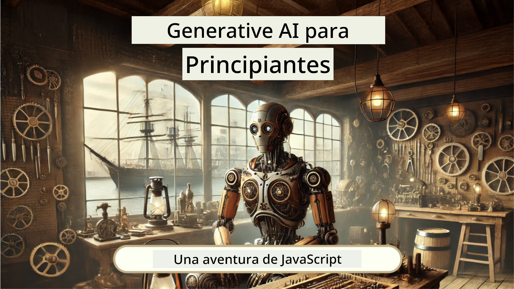
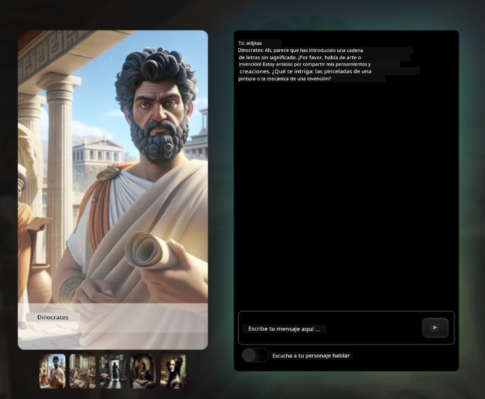
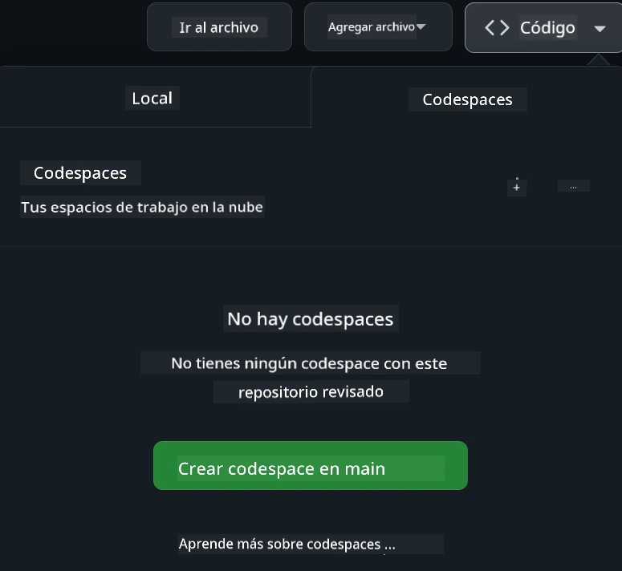

[](https://github.com/microsoft/Web-Dev-For-Beginners/blob/master/LICENSE)
[](https://GitHub.com/microsoft/Web-Dev-For-Beginners/graphs/contributors/)
[](https://GitHub.com/microsoft/Web-Dev-For-Beginners/issues/)
[](https://GitHub.com/microsoft/Web-Dev-For-Beginners/pulls/)
[](http://makeapullrequest.com) 

[](https://GitHub.com/microsoft/Web-Dev-For-Beginners/watchers/)
[](https://GitHub.com/microsoft/Web-Dev-For-Beginners/network/)
[](https://GitHub.com/microsoft/Web-Dev-For-Beginners/stargazers/)

[](https://discord.gg/nTYy5BXMWG)

# Desarrollo Web para Principiantes - Un Currículo

Aprende los fundamentos del desarrollo web con nuestro curso integral de 12 semanas impartido por Microsoft Cloud Advocates. Cada una de las 24 lecciones profundiza en JavaScript, CSS y HTML a través de proyectos prácticos como terrarios, extensiones de navegador y juegos espaciales. Participa con cuestionarios, discusiones y tareas prácticas. Mejora tus habilidades y optimiza la retención de conocimiento con nuestra eficaz pedagogía basada en proyectos. ¡Comienza tu viaje de codificación hoy!

Únete a la Comunidad Azure AI Foundry en Discord

[](https://discord.gg/nTYy5BXMWG)

Sigue estos pasos para comenzar a usar estos recursos:
1. **Haz un Fork del Repositorio**: Haz clic en [](https://GitHub.com/microsoft/Web-Dev-For-Beginners/fork)
2. **Clona el Repositorio**:   `git clone https://github.com/microsoft/Web-Dev-For-Beginners.git`
3. [**Únete al Azure AI Foundry Discord y conoce expertos y compañeros desarrolladores**](https://discord.com/invite/ByRwuEEgH4)

### 🌐 Soporte Multilingüe

#### Soportado vía GitHub Action (Automatizado y Siempre Actualizado)

<!-- CO-OP TRANSLATOR LANGUAGES TABLE START -->
[Arabic](../ar/README.md) | [Bengali](../bn/README.md) | [Bulgarian](../bg/README.md) | [Burmese (Myanmar)](../my/README.md) | [Chinese (Simplified)](../zh-CN/README.md) | [Chinese (Traditional, Hong Kong)](../zh-HK/README.md) | [Chinese (Traditional, Macau)](../zh-MO/README.md) | [Chinese (Traditional, Taiwan)](../zh-TW/README.md) | [Croatian](../hr/README.md) | [Czech](../cs/README.md) | [Danish](../da/README.md) | [Dutch](../nl/README.md) | [Estonian](../et/README.md) | [Finnish](../fi/README.md) | [French](../fr/README.md) | [German](../de/README.md) | [Greek](../el/README.md) | [Hebrew](../he/README.md) | [Hindi](../hi/README.md) | [Hungarian](../hu/README.md) | [Indonesian](../id/README.md) | [Italian](../it/README.md) | [Japanese](../ja/README.md) | [Kannada](../kn/README.md) | [Korean](../ko/README.md) | [Lithuanian](../lt/README.md) | [Malay](../ms/README.md) | [Malayalam](../ml/README.md) | [Marathi](../mr/README.md) | [Nepali](../ne/README.md) | [Nigerian Pidgin](../pcm/README.md) | [Norwegian](../no/README.md) | [Persian (Farsi)](../fa/README.md) | [Polish](../pl/README.md) | [Portuguese (Brazil)](../pt-BR/README.md) | [Portuguese (Portugal)](../pt-PT/README.md) | [Punjabi (Gurmukhi)](../pa/README.md) | [Romanian](../ro/README.md) | [Russian](../ru/README.md) | [Serbian (Cyrillic)](../sr/README.md) | [Slovak](../sk/README.md) | [Slovenian](../sl/README.md) | [Spanish](./README.md) | [Swahili](../sw/README.md) | [Swedish](../sv/README.md) | [Tagalog (Filipino)](../tl/README.md) | [Tamil](../ta/README.md) | [Telugu](../te/README.md) | [Thai](../th/README.md) | [Turkish](../tr/README.md) | [Ukrainian](../uk/README.md) | [Urdu](../ur/README.md) | [Vietnamese](../vi/README.md)

> **¿Prefieres Clonar Localmente?**
>
> Este repositorio incluye más de 50 traducciones que aumentan significativamente el tamaño de la descarga. Para clonar sin traducciones, usa sparse checkout:
>
> **Bash / macOS / Linux:**
> ```bash
> git clone --filter=blob:none --sparse https://github.com/microsoft/Web-Dev-For-Beginners.git
> cd Web-Dev-For-Beginners
> git sparse-checkout set --no-cone '/*' '!translations' '!translated_images'
> ```
>
> **CMD (Windows):**
> ```cmd
> git clone --filter=blob:none --sparse https://github.com/microsoft/Web-Dev-For-Beginners.git
> cd Web-Dev-For-Beginners
> git sparse-checkout set --no-cone "/*" "!translations" "!translated_images"
> ```
>
> Esto te da todo lo necesario para completar el curso con una descarga mucho más rápida.
<!-- CO-OP TRANSLATOR LANGUAGES TABLE END -->

**Si deseas que se admitan idiomas adicionales para traducciones están listados [aquí](https://github.com/Azure/co-op-translator/blob/main/getting_started/supported-languages.md)**

[](https://open.vscode.dev/microsoft/Web-Dev-For-Beginners)

#### 🧑‍🎓 _¿Eres estudiante?_

Visita la [**página del Centro de Estudiantes**](https://docs.microsoft.com/learn/student-hub/?WT.mc_id=academic-77807-sagibbon) donde encontrarás recursos para principiantes, paquetes para estudiantes e incluso formas de obtener un voucher gratuito para certificación. Esta es la página que debes guardar en favoritos y revisar periódicamente, ya que actualizamos contenido mensualmente.

### 📣 Anuncio - ¡Nuevos desafíos de modo Agente de GitHub Copilot para completar!

Nuevo desafío añadido, busca "GitHub Copilot Agent Challenge 🚀" en la mayoría de los capítulos. Es un nuevo reto para que lo completes usando GitHub Copilot y el modo Agente. Si no has usado el modo Agente antes, es capaz no solo de generar texto sino también de crear y editar archivos, ejecutar comandos y más.

### 📣 Anuncio - _Nuevo Proyecto para construir usando IA Generativa_

Nuevo proyecto de asistente de IA añadido, échale un vistazo [proyecto](./9-chat-project/README.md)

### 📣 Anuncio - _Nuevo Currículo_ sobre IA Generativa para JavaScript acaba de ser lanzado

¡No te pierdas nuestro nuevo currículo de IA generativa!

Visita [https://aka.ms/genai-js-course](https://aka.ms/genai-js-course) para comenzar.



- Lecciones que cubren desde conceptos básicos hasta RAG.
- Interactúa con personajes históricos usando GenAI y nuestra aplicación complementaria.
- Narrativa divertida y atractiva, ¡vas a viajar en el tiempo!




Cada lección incluye una tarea para completar, una verificación de conocimiento y un desafío para guiarte en temas como:
- Solicitudes y diseño de prompts
- Generación de aplicaciones de texto e imágenes
- Aplicaciones de búsqueda

Visita [https://aka.ms/genai-js-course](https://aka.ms/genai-js-course) para comenzar.


## 🌱 Comenzando

> **Profesores**, hemos [incluido algunas sugerencias](for-teachers.md) sobre cómo usar este currículo. ¡Nos encantaría recibir sus comentarios [en nuestro foro de discusión](https://github.com/microsoft/Web-Dev-For-Beginners/discussions/categories/teacher-corner)!

**[Estudiantes](https://aka.ms/student-page/?WT.mc_id=academic-77807-sagibbon)**, para cada lección, comiencen con un cuestionario previo a la clase y continúen leyendo el material de la lección, completando las diversas actividades y verificando su comprensión con el cuestionario posterior a la clase.

Para mejorar tu experiencia de aprendizaje, ¡conéctate con tus compañeros para trabajar juntos en los proyectos! Se fomentan las discusiones en nuestro [foro de discusión](https://github.com/microsoft/Web-Dev-For-Beginners/discussions) donde nuestro equipo de moderadores estará disponible para responder tus preguntas.

Para continuar tu educación, recomendamos explorar [Microsoft Learn](https://learn.microsoft.com/users/wirelesslife/collections/p1ddcy5jwy0jkm?WT.mc_id=academic-77807-sagibbon) para encontrar materiales de estudio adicionales.

### 📋 Configurando tu entorno

¡Este currículo tiene un entorno de desarrollo listo para usar! Al comenzar, puedes elegir ejecutar el currículo en un [Codespace](https://github.com/features/codespaces/) (_un entorno basado en navegador, sin necesidad de instalaciones_), o localmente en tu computadora usando un editor de texto como [Visual Studio Code](https://code.visualstudio.com/?WT.mc_id=academic-77807-sagibbon).

#### Crea tu repositorio
Para que sea fácil guardar tu trabajo, se recomienda crear tu propia copia de este repositorio. Puedes hacerlo haciendo clic en el botón **Usar esta plantilla** en la parte superior de la página. Esto creará un nuevo repositorio en tu cuenta de GitHub con una copia del currículo.

Sigue estos pasos:
1. **Haz un Fork del Repositorio**: Haz clic en el botón "Fork" en la esquina superior derecha de esta página.
2. **Clona el Repositorio**:   `git clone https://github.com/microsoft/Web-Dev-For-Beginners.git`

#### Ejecutando el currículo en un Codespace

En tu copia del repositorio que creaste, haz clic en el botón **Code** y selecciona **Open with Codespaces**. Esto creará un nuevo Codespace para que trabajes.



#### Ejecutando el currículo localmente en tu computadora

Para ejecutar este currículo localmente en tu computadora, necesitarás un editor de texto, un navegador y una herramienta de línea de comandos. Nuestra primera lección, [Introducción a los Lenguajes de Programación y Herramientas del Oficio](../../1-getting-started-lessons/1-intro-to-programming-languages), te guiará por varias opciones para cada una de estas herramientas para que selecciones la que funcione mejor para ti.

Nuestra recomendación es usar [Visual Studio Code](https://code.visualstudio.com/?WT.mc_id=academic-77807-sagibbon) como editor, que también tiene una [Terminal](https://code.visualstudio.com/docs/terminal/basics/?WT.mc_id=academic-77807-sagibbon) integrada. Puedes descargar Visual Studio Code [aquí](https://code.visualstudio.com/?WT.mc_id=academic-77807-sagibbon).
1. Clona tu repositorio en tu computadora. Puedes hacerlo haciendo clic en el botón **Code** y copiando la URL:

    [CodeSpace](./images/createcodespace.png)

    Luego, abre [Terminal](https://code.visualstudio.com/docs/terminal/basics/?WT.mc_id=academic-77807-sagibbon) dentro de [Visual Studio Code](https://code.visualstudio.com/?WT.mc_id=academic-77807-sagibbon) y ejecuta el siguiente comando, reemplazando `<your-repository-url>` con la URL que acabas de copiar:

    ```bash 
    git clone <your-repository-url>
    ```

2. Abre la carpeta en Visual Studio Code. Puedes hacerlo haciendo clic en **File** > **Open Folder** y seleccionando la carpeta que acabas de clonar.


>  Extensiones recomendadas de Visual Studio Code:
>
> * [Live Server](https://marketplace.visualstudio.com/items?itemName=ritwickdey.LiveServer&WT.mc_id=academic-77807-sagibbon) - para previsualizar páginas HTML dentro de Visual Studio Code
> * [Copilot](https://marketplace.visualstudio.com/items?itemName=GitHub.copilot&WT.mc_id=academic-77807-sagibbon) - para ayudarte a escribir código más rápido

## 📂 Cada lección incluye:

- sketchnote opcional
- video complementario opcional
- cuestionario de calentamiento previo a la lección
- lección escrita
- para lecciones basadas en proyectos, guías paso a paso para construir el proyecto
- verificaciones de conocimiento
- un desafío
- lectura complementaria
- asignación
- [cuestionario posterior a la lección](https://ff-quizzes.netlify.app/web/)

> **Una nota sobre los cuestionarios**: Todos los cuestionarios están contenidos en la carpeta Quiz-app, con un total de 48 cuestionarios de tres preguntas cada uno. Están disponibles [aquí](https://ff-quizzes.netlify.app/web/), la aplicación de cuestionarios puede ejecutarse localmente o desplegarse en Azure; sigue las instrucciones en la carpeta `quiz-app`.

## 🗃️ Lecciones

|     |                       Nombre del Proyecto                       |                            Conceptos Enseñados                             | Objetivos de Aprendizaje                                                                                                                 |                                                         Lección Vinculada                                                          |         Autor          |
| :-: | :-------------------------------------------------------------: | :------------------------------------------------------------------------: | ---------------------------------------------------------------------------------------------------------------------------------------- | :----------------------------------------------------------------------------------------------------------------------------: | :---------------------: |
| 01  |                     Primeros Pasos                              |           Introducción a la programación y herramientas del oficio         | Aprende los fundamentos básicos detrás de la mayoría de los lenguajes de programación y sobre el software que ayuda a los desarrolladores profesionales a hacer su trabajo | [Introducción a los Lenguajes de Programación y Herramientas del Oficio](./1-getting-started-lessons/1-intro-to-programming-languages/README.md) |         Jasmine         |
| 02  |                     Primeros Pasos                              |             Fundamentos de GitHub, incluye trabajo en equipo               | Cómo usar GitHub en tu proyecto, cómo colaborar con otros en una base de código                                                         |                            [Introducción a GitHub](./1-getting-started-lessons/2-github-basics/README.md)                            |          Floor          |
| 03  |                     Primeros Pasos                              |                             Accesibilidad                                   | Aprende los fundamentos de la accesibilidad web                                                                                          |                       [Fundamentos de Accesibilidad](./1-getting-started-lessons/3-accessibility/README.md)                       |       Christopher       |
| 04  |                        Conceptos Básicos de JS                 |                         Tipos de datos en JavaScript                       | Lo básico sobre tipos de datos en JavaScript                                                                                             |                                       [Tipos de Datos](./2-js-basics/1-data-types/README.md)                                        |         Jasmine         |
| 05  |                        Conceptos Básicos de JS                 |                       Funciones y Métodos                                 | Aprende sobre funciones y métodos para manejar el flujo lógico de una aplicación                                                         |                              [Funciones y Métodos](./2-js-basics/2-functions-methods/README.md)                               | Jasmine y Christopher |
| 06  |                        Conceptos Básicos de JS                 |                        Tomando decisiones con JS                           | Aprende a crear condiciones en tu código usando métodos de toma de decisiones                                                             |                                 [Tomando Decisiones](./2-js-basics/3-making-decisions/README.md)                                  |         Jasmine         |
| 07  |                        Conceptos Básicos de JS                 |                            Arreglos y Bucles                               | Trabaja con datos usando arreglos y bucles en JavaScript                                                                                 |                                   [Arreglos y Bucles](./2-js-basics/4-arrays-loops/README.md)                                    |         Jasmine         |
| 08  |       [Terrario](./3-terrarium/solution/README.md)             |                            HTML en Práctica                               | Construye el HTML para crear un terrario en línea, enfocándote en construir un diseño                                                   |                                 [Introducción a HTML](./3-terrarium/1-intro-to-html/README.md)                                 |           Jen           |
| 09  |       [Terrario](./3-terrarium/solution/README.md)             |                            CSS en Práctica                                | Construye el CSS para dar estilo al terrario en línea, enfocándote en lo básico de CSS incluyendo cómo hacer la página responsiva        |                                  [Introducción a CSS](./3-terrarium/2-intro-to-css/README.md)                                  |           Jen           |
| 10  |            [Terrario](./3-terrarium/solution/README.md)        |                 Closures en JavaScript, manipulación del DOM               | Construye el JavaScript para que el terrario funcione como una interfaz de arrastrar y soltar, enfocándote en closures y manipulación del DOM |                  [Closures en JavaScript, manipulación del DOM](./3-terrarium/3-intro-to-DOM-and-closures/README.md)                   |           Jen           |
| 11  |          [Juego de mecanografía](./4-typing-game/solution/README.md) |                          Construye un juego de mecanografía                | Aprende a usar eventos de teclado para dirigir la lógica de tu aplicación JavaScript                                                      |                                [Programación basada en eventos](./4-typing-game/typing-game/README.md)                                |       Christopher       |
| 12  | [Extensión de navegador verde](./5-browser-extension/solution/README.md) |                         Trabajando con navegadores                        | Aprende cómo funcionan los navegadores, su historia y cómo estructurar los primeros elementos de una extensión del navegador            |                               [Acerca de los navegadores](./5-browser-extension/1-about-browsers/README.md)                                |           Jen           |
| 13  | [Extensión de navegador verde](./5-browser-extension/solution/README.md) | Construcción de formularios, llamada a API y almacenamiento local          | Construye los elementos JavaScript de tu extensión de navegador para llamar una API usando variables almacenadas en almacenamiento local |                [APIs, formularios y almacenamiento local](./5-browser-extension/2-forms-browsers-local-storage/README.md)                 |           Jen           |
| 14  | [Extensión de navegador verde](./5-browser-extension/solution/README.md) |          Procesos en segundo plano del navegador, rendimiento web          | Usa los procesos en segundo plano del navegador para gestionar el ícono de la extensión; aprende sobre rendimiento web y algunas optimizaciones |             [Tareas en segundo plano y rendimiento](./5-browser-extension/3-background-tasks-and-performance/README.md)              |           Jen           |
| 15  |           [Juego espacial](./6-space-game/solution/README.md)   |             Desarrollo avanzado de juegos con JavaScript                   | Aprende sobre herencia usando tanto clases como composición y el patrón Pub/Sub, en preparación para construir un juego                 |                      [Introducción al desarrollo avanzado de juegos](./6-space-game/1-introduction/README.md)                       |          Chris          |
| 16  |           [Juego espacial](./6-space-game/solution/README.md)   |                           Dibujando en canvas                              | Aprende sobre la API Canvas, usada para dibujar elementos en pantalla                                                                   |                                [Dibujando en Canvas](./6-space-game/2-drawing-to-canvas/README.md)                                |          Chris          |
| 17  |           [Juego espacial](./6-space-game/solution/README.md)   |                   Moviendo elementos en la pantalla                        | Descubre cómo los elementos pueden ganar movimiento usando coordenadas cartesianas y la API Canvas                                       |                           [Moviendo elementos](./6-space-game/3-moving-elements-around/README.md)                           |          Chris          |
| 18  |           [Juego espacial](./6-space-game/solution/README.md)   |                          Detección de colisiones                           | Haz que los elementos colisionen y reaccionen entre sí usando pulsaciones de teclas y proporciona una función de enfriamiento para asegurar el rendimiento del juego |                              [Detección de colisiones](./6-space-game/4-collision-detection/README.md)                              |          Chris          |
| 19  |           [Juego espacial](./6-space-game/solution/README.md)   |                             Mantenimiento de puntuación                    | Realiza cálculos matemáticos basados en el estado y rendimiento del juego                                                               |                                    [Mantenimiento de puntuación](./6-space-game/5-keeping-score/README.md)                                    |          Chris          |
| 20  |           [Juego espacial](./6-space-game/solution/README.md)   |                     Terminando y reiniciando el juego                      | Aprende sobre finalizar y reiniciar el juego, incluyendo limpiar recursos y resetear valores de variables                               |                                [La condición de finalización](./6-space-game/6-end-condition/README.md)                                 |          Chris          |
| 21  |         [App bancaria](./7-bank-project/solution/README.md)     |                 Plantillas HTML y rutas en una aplicación web             | Aprende cómo crear la estructura de arquitectura de un sitio web multipágina usando rutas y plantillas HTML                            |                            [Plantillas HTML y rutas](./7-bank-project/1-template-route/README.md)                             |          Yohan          |
| 22  |         [App bancaria](./7-bank-project/solution/README.md)     |                  Construcción de formularios de inicio de sesión y registro | Aprende sobre construcción de formularios y manejo de rutinas de validación                                                             |                                           [Formularios](./7-bank-project/2-forms/README.md)                                           |          Yohan          |
| 23  |         [App bancaria](./7-bank-project/solution/README.md)     |                   Métodos para obtener y usar datos                        | Cómo fluyen los datos dentro y fuera de tu aplicación, cómo obtenerlos, almacenarlos y deshacerse de ellos                             |                                            [Datos](./7-bank-project/3-data/README.md)                                            |          Yohan          |
| 24  |         [App bancaria](./7-bank-project/solution/README.md)     |                      Conceptos de gestión de estado                        | Aprende cómo tu aplicación retiene el estado y cómo gestionarlo programáticamente                                                       |                                [Gestión de estado](./7-bank-project/4-state-management/README.md)                                |          Yohan          |
| 25 | [Código Editor Browser/VScode](../../8-code-editor) | Trabajando con VScode | Aprende a usar un editor de código| [Usar el Editor de Código VScode](./8-code-editor/1-using-a-code-editor/README.md) | Chris |
| 26 | [Asistentes de IA](./9-chat-project/README.md) | Trabajando con IA | Aprende cómo construir tu propio asistente de IA | [Proyecto de Asistente de IA](./9-chat-project/README.md) | Chris |

## 🏫 Pedagogía

Nuestro plan de estudios está diseñado con dos principios pedagógicos clave en mente:
* aprendizaje basado en proyectos
* cuestionarios frecuentes

El programa enseña los fundamentos de JavaScript, HTML y CSS, así como las últimas herramientas y técnicas usadas por los desarrolladores web actuales. Los estudiantes tendrán la oportunidad de desarrollar experiencia práctica construyendo un juego de mecanografía, un terrario virtual, una extensión de navegador ecológica, un juego estilo invasores espaciales y una app bancaria para negocios. Al final de la serie, los estudiantes habrán adquirido una sólida comprensión del desarrollo web.

> 🎓 ¡Puedes tomar las primeras lecciones de este plan de estudios como un [Camino de Aprendizaje](https://docs.microsoft.com/learn/paths/web-development-101/?WT.mc_id=academic-77807-sagibbon) en Microsoft Learn!

Al asegurar que el contenido esté alineado con proyectos, el proceso se vuelve más atractivo para los estudiantes y se potenciará la retención de conceptos. También escribimos varias lecciones introductorias sobre conceptos básicos de JavaScript para introducir conceptos, acompañadas por un video de la colección de tutoriales en video "[Serie para principiantes de: JavaScript](https://channel9.msdn.com/Series/Beginners-Series-to-JavaScript/?WT.mc_id=academic-77807-sagibbon)", algunos de cuyos autores contribuyeron a este plan de estudios.

Además, un cuestionario de baja presión antes de una clase establece la intención del estudiante hacia el aprendizaje de un tema, mientras que un segundo cuestionario después de la clase asegura una mayor retención. Este plan se diseñó para ser flexible y divertido y puede realizarse completo o en parte. Los proyectos comienzan pequeños y se vuelven cada vez más complejos al finalizar el ciclo de 12 semanas.

Aunque hemos evitado intencionadamente introducir frameworks de JavaScript para centrarnos en las habilidades básicas necesarias como desarrollador web antes de adoptar un framework, un buen siguiente paso después de completar este plan sería aprender sobre Node.js a través de otra colección de videos: "[Serie para principiantes de: Node.js](https://channel9.msdn.com/Series/Beginners-Series-to-Nodejs/?WT.mc_id=academic-77807-sagibbon)".

> ¡Visita nuestras pautas de [Código de Conducta](CODE_OF_CONDUCT.md) y [Contribución](CONTRIBUTING.md)! ¡Esperamos tus comentarios constructivos!


## 🧭 Acceso sin conexión

Puedes ejecutar esta documentación sin conexión utilizando [Docsify](https://docsify.js.org/#/). Haz un fork de este repositorio, [instala Docsify](https://docsify.js.org/#/quickstart) en tu máquina local, y luego en la carpeta raíz de este repositorio, escribe `docsify serve`. El sitio web se servirá en el puerto 3000 en tu localhost: `localhost:3000`.

## 📘 PDF
Un PDF de todas las lecciones se puede encontrar [aquí](https://microsoft.github.io/Web-Dev-For-Beginners/pdf/readme.pdf).


## 🎒 Otros cursos

¡Nuestro equipo produce otros cursos! Mira:

<!-- CO-OP TRANSLATOR OTHER COURSES START -->
### LangChain
[](https://aka.ms/langchain4j-for-beginners)
[](https://aka.ms/langchainjs-for-beginners?WT.mc_id=m365-94501-dwahlin)
[](https://github.com/microsoft/langchain-for-beginners?WT.mc_id=m365-94501-dwahlin)
---

### Azure / Edge / MCP / Agentes
[](https://github.com/microsoft/AZD-for-beginners?WT.mc_id=academic-105485-koreyst)
[](https://github.com/microsoft/edgeai-for-beginners?WT.mc_id=academic-105485-koreyst)
[](https://github.com/microsoft/mcp-for-beginners?WT.mc_id=academic-105485-koreyst)
[](https://github.com/microsoft/ai-agents-for-beginners?WT.mc_id=academic-105485-koreyst)

---
 
### Serie de IA Generativa
[](https://github.com/microsoft/generative-ai-for-beginners?WT.mc_id=academic-105485-koreyst)
[-9333EA?style=for-the-badge&labelColor=E5E7EB&color=9333EA)](https://github.com/microsoft/Generative-AI-for-beginners-dotnet?WT.mc_id=academic-105485-koreyst)
[-C084FC?style=for-the-badge&labelColor=E5E7EB&color=C084FC)](https://github.com/microsoft/generative-ai-for-beginners-java?WT.mc_id=academic-105485-koreyst)
[-E879F9?style=for-the-badge&labelColor=E5E7EB&color=E879F9)](https://github.com/microsoft/generative-ai-with-javascript?WT.mc_id=academic-105485-koreyst)

---
 
### Aprendizaje básico
[](https://aka.ms/ml-beginners?WT.mc_id=academic-105485-koreyst)
[](https://aka.ms/datascience-beginners?WT.mc_id=academic-105485-koreyst)
[](https://aka.ms/ai-beginners?WT.mc_id=academic-105485-koreyst)
[](https://github.com/microsoft/Security-101?WT.mc_id=academic-96948-sayoung)
[](https://aka.ms/webdev-beginners?WT.mc_id=academic-105485-koreyst)
[](https://aka.ms/iot-beginners?WT.mc_id=academic-105485-koreyst)
[](https://github.com/microsoft/xr-development-for-beginners?WT.mc_id=academic-105485-koreyst)

---
 
### Serie Copilot
[](https://aka.ms/GitHubCopilotAI?WT.mc_id=academic-105485-koreyst)
[](https://github.com/microsoft/mastering-github-copilot-for-dotnet-csharp-developers?WT.mc_id=academic-105485-koreyst)
[](https://github.com/microsoft/CopilotAdventures?WT.mc_id=academic-105485-koreyst)
<!-- CO-OP TRANSLATOR OTHER COURSES END -->

## Obtener ayuda

Si te quedas atascado o tienes alguna pregunta sobre cómo crear aplicaciones de IA. Únete a otros estudiantes y desarrolladores experimentados en discusiones sobre MCP. Es una comunidad solidaria donde las preguntas son bienvenidas y el conocimiento se comparte libremente.

[](https://discord.gg/nTYy5BXMWG)

Si tienes comentarios sobre el producto o errores mientras construyes, visita:

[](https://aka.ms/foundry/forum)

## Licencia

Este repositorio está bajo la licencia MIT. Consulta el archivo [LICENSE](../../LICENSE) para más información.

---

<!-- CO-OP TRANSLATOR DISCLAIMER START -->
**Aviso Legal**:  
Este documento ha sido traducido utilizando el servicio de traducción automática [Co-op Translator](https://github.com/Azure/co-op-translator). Aunque nos esforzamos por la precisión, tenga en cuenta que las traducciones automatizadas pueden contener errores o inexactitudes. El documento original en su idioma nativo debe considerarse la fuente autorizada. Para información crítica, se recomienda una traducción profesional realizada por humanos. No nos hacemos responsables de malentendidos o interpretaciones erróneas derivadas del uso de esta traducción.
<!-- CO-OP TRANSLATOR DISCLAIMER END -->