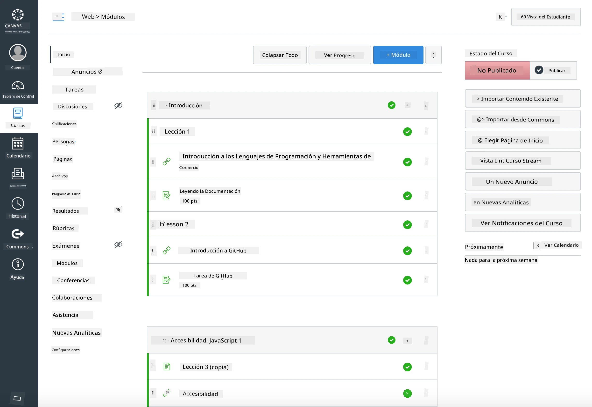

<!--
CO_OP_TRANSLATOR_METADATA:
{
  "original_hash": "71009af209f81cc01a1f2d324200375f",
  "translation_date": "2025-10-03T08:26:01+00:00",
  "source_file": "for-teachers.md",
  "language_code": "es"
}
-->
### Para Educadores

Estás invitado a usar este plan de estudios en tu aula. Funciona perfectamente con GitHub Classroom y las principales plataformas LMS, y también puede utilizarse como un repositorio independiente con tus estudiantes.

### Uso con GitHub Classroom

Para gestionar lecciones y tareas por grupo, crea un repositorio por lección para que GitHub Classroom pueda vincular cada tarea de forma independiente.

- Haz un fork de este repositorio en tu organización.
- Crea un repositorio separado para cada lección extrayendo cada carpeta de lección en su propio repositorio.
  - Opción A: Crea repositorios vacíos (uno por lección) y copia el contenido de la carpeta de la lección en cada uno.
  - Opción B: Usa un enfoque que preserve el historial de Git (por ejemplo, dividir una carpeta en un nuevo repositorio) si necesitas mantener la procedencia.
- En GitHub Classroom, crea una tarea por lección y vincúlala al repositorio correspondiente.
- Configuración recomendada:
  - Visibilidad del repositorio: privado para el trabajo de los estudiantes.
  - Usa el código inicial de la rama predeterminada del repositorio de la lección.
  - Agrega plantillas de issues y pull requests para cuestionarios y entregas.
  - Opcionalmente, configura autoevaluación y pruebas si tus lecciones las incluyen.
- Convenciones útiles:
  - Nombres de repositorios como lesson-01-intro, lesson-02-html, etc.
  - Etiquetas: quiz, assignment, needs-review, late, resubmission.
  - Tags/releases por grupo (por ejemplo, v2025-term1).

Consejo: Evita almacenar repositorios dentro de carpetas sincronizadas (por ejemplo, OneDrive/Google Drive) para prevenir conflictos de Git en Windows.

### Uso con Moodle, Canvas o Blackboard

Este plan de estudios incluye paquetes importables para flujos de trabajo comunes en LMS.

- Moodle: Usa el archivo de carga de Moodle [Moodle upload file](../../../../../../../teaching-files/webdev-moodle.mbz) para cargar el curso completo.
- Common Cartridge: Usa el archivo Common Cartridge [Common Cartridge file](../../../../../../../teaching-files/webdev-common-cartridge.imscc) para una mayor compatibilidad con LMS.
- Notas:
  - Moodle Cloud tiene soporte limitado para Common Cartridge. Es preferible usar el archivo de Moodle mencionado anteriormente, que también puede cargarse en Canvas.
  - Después de importar, revisa los módulos, fechas de entrega y configuraciones de cuestionarios para ajustarlos al calendario de tu periodo.

> El plan de estudios en un aula de Moodle

> El plan de estudios en Canvas

### Uso del repositorio directamente (sin Classroom)

Si prefieres no usar GitHub Classroom, puedes ejecutar el curso directamente desde este repositorio.

- Formatos sincrónicos/en línea (Zoom/Teams):
  - Realiza calentamientos breves dirigidos por mentores; usa salas de grupo para cuestionarios.
  - Anuncia una ventana de tiempo para los cuestionarios; los estudiantes envían respuestas como Issues en GitHub.
  - Para tareas colaborativas, los estudiantes trabajan en repositorios públicos de lecciones y abren pull requests.
- Formatos privados/asincrónicos:
  - Los estudiantes hacen fork de cada lección en sus propios repositorios **privados** y te agregan como colaborador.
  - Envían sus entregas mediante Issues (cuestionarios) y Pull Requests (tareas) en tu repositorio de aula o en sus forks privados.

### Mejores prácticas

- Ofrece una lección de orientación sobre conceptos básicos de Git/GitHub, Issues y PRs.
- Usa listas de verificación en Issues para cuestionarios/tareas de varios pasos.
- Agrega CONTRIBUTING.md y CODE_OF_CONDUCT.md para establecer normas en el aula.
- Incluye notas de accesibilidad (texto alternativo, subtítulos) y ofrece PDFs imprimibles.
- Versiona tu contenido por periodo y congela los repositorios de lecciones después de publicarlos.

### Comentarios y soporte

Queremos que este plan de estudios funcione para ti y tus estudiantes. Por favor, abre un nuevo Issue en este repositorio para reportar errores, realizar solicitudes o sugerir mejoras, o inicia una discusión en el Teacher Corner.

---

**Descargo de responsabilidad**:  
Este documento ha sido traducido utilizando el servicio de traducción automática [Co-op Translator](https://github.com/Azure/co-op-translator). Aunque nos esforzamos por garantizar la precisión, tenga en cuenta que las traducciones automatizadas pueden contener errores o imprecisiones. El documento original en su idioma nativo debe considerarse como la fuente autorizada. Para información crítica, se recomienda una traducción profesional realizada por humanos. No nos hacemos responsables de malentendidos o interpretaciones erróneas que puedan surgir del uso de esta traducción.