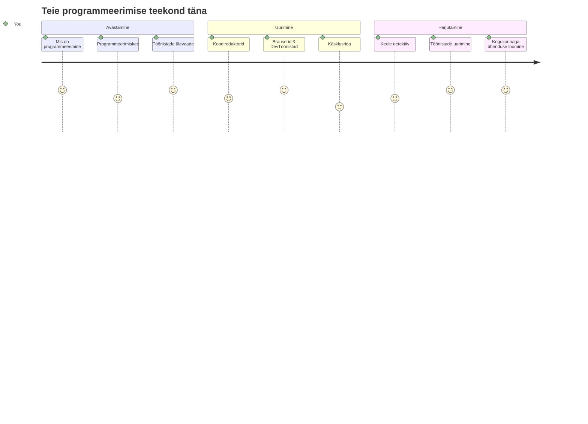
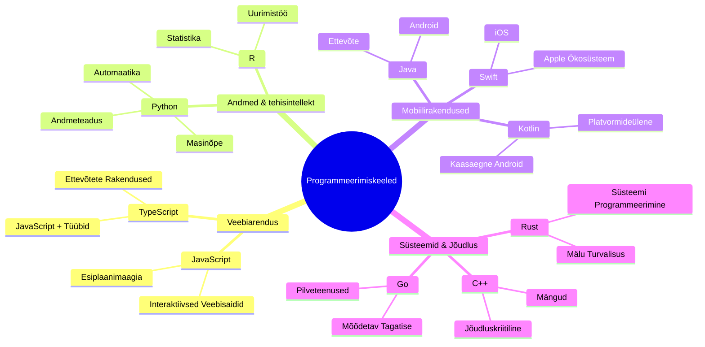
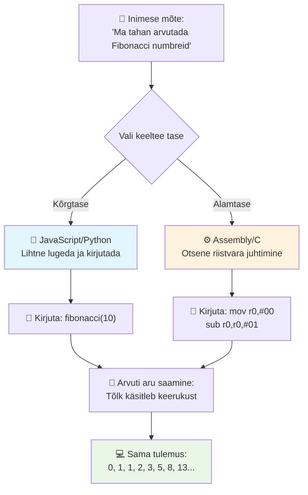
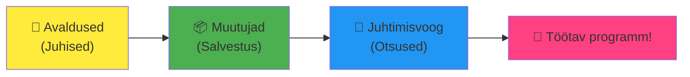
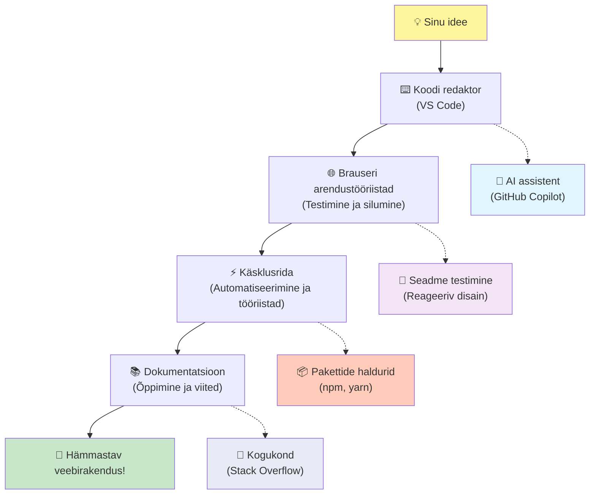
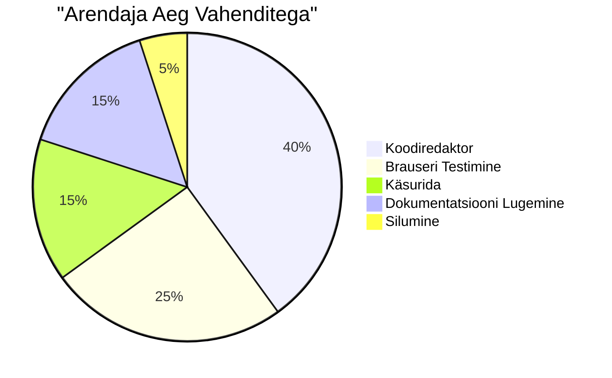
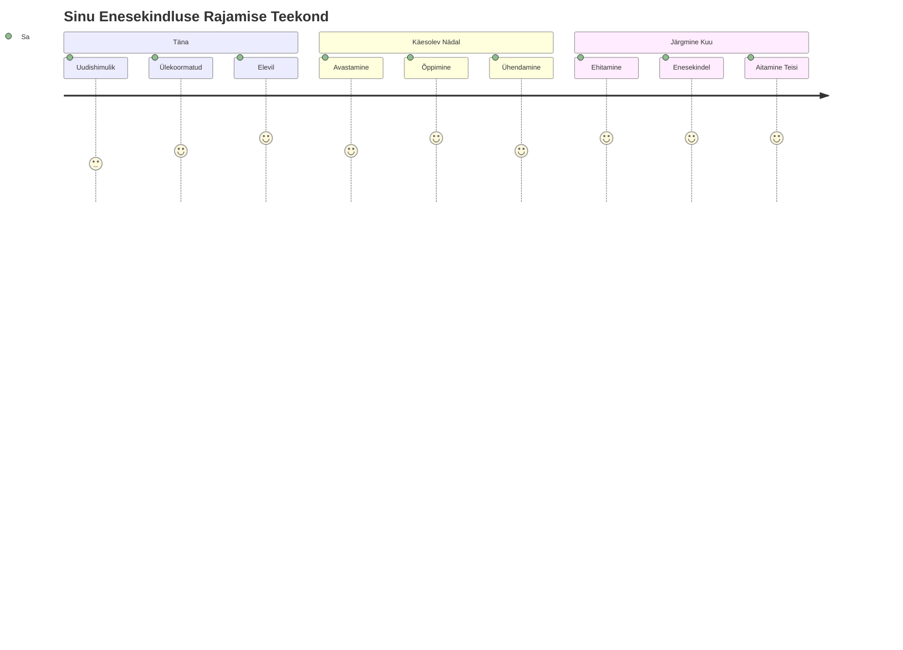

<!--
CO_OP_TRANSLATOR_METADATA:
{
  "original_hash": "d45ddcc54eb9232a76d08328b09d792e",
  "translation_date": "2026-01-08T10:00:49+00:00",
  "source_file": "1-getting-started-lessons/1-intro-to-programming-languages/README.md",
  "language_code": "et"
}
-->
# Sissejuhatus programmeerimiskeeltesse ja kaasaegsesse arendustööriistadesse

Tere tulemast, tulevane arendaja! 👋 Kas tohin sulle midagi rääkida, mis ikka veel igal päeval külmavärinaid tekitab? Sa oled just avastamas, et programmeerimine ei ole ainult arvutite jaoks – see on tegelike supervõimete omandamine oma metsikumaid ideid ellu viimiseks!

Sa tead seda hetke, kui kasutad oma lemmikrakendust ja kõik lihtsalt klapib täiesti täiuslikult? Kui vajutad nuppu ja juhtub midagi täiesti maagilist, mis paneb sind mõtlema "Wau, kuidas nad seda TEGID?" No keegi, kellel on sina moodi – tõenäoliselt oma lemmikkohvikus kell 2 öösel, joob oma kolmandat espresso – kirjutas just selle koodi, mis selle maagia lõi. Ja siin on see, mis su meeled pea peale pöörab: selle tunni lõpuks sa mitte ainult ei mõista, kuidas nemad seda tegid, vaid sul on ka isu ise proovida!

Kuule, ma saan täiesti aru, kui programmeerimine tundub praegu hirmutav. Kui ma esimest korda alustasin, arvasin ausalt, et pead olema mingi matemaatikageenius või kodeerima hakkama juba viieaastaselt. Aga siin on see, mis mu vaatepunkti täiesti muutis: programmeerimine on täpselt nagu uue keele õppimine, et pidada vestlusi. Sa alustad "tere" ja "aitäh" sõnadega, siis jõuad kohvi tellimiseni ja enne kui aru saad, arutad sügavaid filosoofilisi teemasid! Ainult et siin räägid sa arvutitega, ja ausalt? Nemad on kõige kannatlikumad vestluspartnerid üldse – nad ei hinnangu sinu vigu ja on alati valmis uuesti proovima!

Täna uurime uskumatuid tööriistu, mis teevad kaasaegse veebi arendamise mitte ainult võimalikuks, vaid väga sõltuvust tekitavaks. Räägin täpselt nendest samadest editoridest, brauseritest ja töövoogudest, mida kasutavad Netflixi, Spotify ja sinu lemmik sõltumatu rakenduse stuudio arendajad iga päev. Ja siin on osa, mis paneb sind rõõmust tantsima: enamik neist professionaalsest klassist ja tööstusharu standarditest tööriistadest on täiesti tasuta!


> Sketchnote autor [Tomomi Imura](https://twitter.com/girlie_mac)


## Vaatame, mida sa juba tead!

Enne kui sukeldume lõbusasse ossa, olen uudishimulik – mida sa sellest programmeerimise maailmast juba tead? Ja kuule, kui sa vaatad neid küsimusi ja mõtled "mul pole sellest mitte vähimatki aimu", siis see ei ole mitte ainult okei, vaid ideaalne! See tähendab, et sa oled täiesti õiges kohas. Mõtle sellele viktoriinile nagu venitusele enne trenni – me lihtsalt soojendame neid ajulihaseid!

[Võta eelmise tunni viktoriin](https://forms.office.com/r/dru4TE0U9n?origin=lprLink)

## Seiklus, millele me koos asume

Ok, ma olen tõesti elevil selle üle, mida me täna avastame! Ausalt, ma sooviksin näha sinu nägu, kui mõned neist mõistetest klapivad. Siin on see uskumatu teekond, kuhu me koos läheme:

- **Mis programmeerimine tegelikult on (ja miks see on lahedaim asi üldse!)** – Avastame, kuidas kood on sõna otseses mõttes nähtamatu maagia, mis paneb sinu ümber kõik tööle, alates äratusest, mis kuidagi teab, et on esmaspäeva hommik, kuni algoritmini, mis ideaalselt kureerib sinu Netflixi soovitused
- **Programmeerimiskeeled ja nende hämmastavad isiksused** – Kujuta ette, et lähed peole, kus igaühel on täiesti erinevad supervõimed ja probleemide lahendamise viisid. Nii ongi programmeerimiskeelte maailm ja sulle meeldib neiga kohtuda!
- **Põhilised koostisosad, mis muudavad digitaalse maagia võimalikuks** – Mõtle neile kui ülimale loomingulisele LEGO komplektile. Kui sa mõistad, kuidas need tükid kokku sobivad, siis saad sõna otseses mõttes luua kõike, mida su fantaasia välja mõtleb
- **Professionaalsed tööriistad, mis panevad sind tundma nagu oleksid võlukepp kätte saanud** – Ma ei liialda siin – need tööriistad panevad sind tõesti tundma, nagu sul oleksid supervõimed, ja parim osa? Need on täpselt samad, mida tõsised proffid kasutavad!

> 💡 **Siin on asi**: Ära isegi mõtle kõike täna pähe õppida! Praegu tahan lihtsalt, et tunneksid seda põnevat sädet, mis väljendab kõike seda, mis võimalik on. Detailid tulevad loomulikult meelde, kui harjutame koos – nii õige õppimine käib!

> Sa võid selle tunni võtta [Microsoft Learn’is](https://docs.microsoft.com/learn/modules/web-development-101/introduction-programming/?WT.mc_id=academic-77807-sagibbon)!

## Misasi on programmeerimine täpsemalt?

Okei, võtame käsile miljoni-dollarilise küsimuse: mis see programmeerimine tegelikult on?

Annan sulle loo, mis täiesti muutis mu mõtteviisi. Eelmisel nädalal proovisin emale seletada, kuidas kasutada meie uut nutikat teleri puldit. Leidsin end ütlemas asju nagu „Vajuta punast nuppu, aga mitte seda suurt punast nuppu, vaid väikest punast nuppu vasakul... ei, sinu teine vasak... okei, nüüd hoia seda kaks sekundit, mitte üks, mitte kolm...” Kas see kõlab tuttavalt? 😅

See ongi programmeerimine! See on kunst anda äärmiselt detailseid, samm-sammult juhiseid millelegi, mis on väga võimas, aga vajab kõike täpselt sõnastatult. Ainult et selle asemel, et seletada emale (kes võib küsida „milline punane nupp?!“), seletad sa arvutile (kes teeb täpselt, mida sa ütled, isegi kui see, mida sa ütlesid, pole päris see, mida sa mõtlesid).

Siin on see, mis mind esimest korda uskumatult imestama pani: arvutid on sisuliselt üsna lihtsad. Nad mõistavad ainult kahte asja – 1 ja 0, mis on põhimõtteliselt „jah“ ja „ei“ või „sees“ ja „väljas“. See ongi kõik! Aga siin muutub asi maagiliseks – me ei pea rääkima 1-de ja 0-de keeles nagu The Matrix’is. Siin tulevad appi **programmeerimiskeeled**. Need on nagu parim tõlk maailmas, kes võtab sinu täiesti normaalsed inimmõtted ja tõlgib need arvuti keelde.

Ja siin on see, mis annab mulle igal hommikul tegelikult külmavärinad: sõna otseses mõttes *kõik* digitaalne sinu elus algas kellegagi nagu sina, tõenäoliselt pidžaamas, kohvitassi kõrval, tippimas koodi oma sülearvutisse. See Instagrami filter, mis paneb sind ideaalsena välja nägema? Keegi kirjutas selle koodi. Soovitus, mis viis sind su uue lemmiklauluni? Arendaja ehitas selle algoritmi. Rakendus, mis aitab sul sõpradega õhtusöögi arveid jagada? Jep, keegi mõtles „see on tüütu, ma arvan, et suudan selle parandada“ ja siis... nad tegidki seda!

Kui õpid programmeerima, ei omanda sa mitte ainult uut oskust – sa muutud osaks sellest uskumatust probleemilahendajate kogukonnast, kes veedavad oma päevi mõeldes: „Mis oleks, kui saaksin midagi ehitada, mis teeb kellegi päeva lihtsalt natuke paremaks?“ Ausalt, kas midagi lahedamat ongi olemas?

✅ **Lõbus faktide otsing**: Siin on midagi väga lahedat, mida võid otsida, kui on vaba hetk – kes sa arvad oli maailma esimene arvutiprogrammeerija? Ma annan vihje: see ei pruugi olla see, keda sa ootad! Selle inimese lugu on absoluutselt põnev ja näitab, et programmeerimine on alati olnud loov probleemilahendus ja kastist välja mõtlemine.

### 🧠 **Kiirülevaade: Kuidas Sul läheb?**

**Võta hetk, et reflekteerida:**
- Kas mõte "arvutitele juhiste andmisest" tundub nüüd arusaadav?
- Kas tead mõnda igapäevast ülesannet, mida tahaksid programmeerimise abil automatiseerida?
- Millised küsimused sul selles programmeerimise teemas praegu kerkivad?

> **Pea meeles**: On täiesti normaalne, kui mõned mõisted tunduvad praegu ebaselged. Programmeerimise õppimine on nagu uue keele õppimine – ajul kulub aega, et luua need närvivõrgud. Sa teed suurepärast tööd!

## Programmeerimiskeeled on nagu erinevad maagia maitsed

Ok, see võib kõlada veidralt, aga kuula mind – programmeerimiskeeled on väga sarnased erinevatele muusikastiilidele. Mõtle sellele: on jazz, mis on sujuv ja improvisatoorne; rock, mis on võimas ja otsekohene; klassika, mis on elegantne ja struktureeritud; ja hip-hop, mis on loominguline ja väljendusrikas. Igal stiilil on oma vibe, oma kirglike fännide kogukond ja igaüks sobib erinevatele meeleoludele ja sündmustele.

Programmeerimiskeeled töötavad täpselt samamoodi! Sa ei kasutaks sama keelt, et teha lõbusat mobiilimängu, mida kasutad tohutu kliimaandmete töötlemiseks, just nagu sa ei mängiks death metali joogaklassis (no, enamasti mitte! 😄).

Aga siin on see, mis mind iga kord täielikult hämmastab: need keeled on nagu kõige kannatlikumad ja geniaalsemad tõlgid maailmas, kes istuvad su kõrval. Sa saad väljendada oma ideid viisil, mis tundub loomulik sinu inimese ajule, ja nemad teevad kogu uskumatult keeruka töö selle tõlkimisel 1-deks ja 0-deks, mida arvutid tõesti räägivad. See on nagu sõber, kes on täiesti ladus mõlemas – „inimloomingus“ ja „arvutilogikas“ – ja ta ei väsigi kunagi, ei vaja kohvipause ega mõista sind hukka, kui küsid sama küsimust kaks korda!

### Populaarsed programmeerimiskeeled ja nende kasutusvaldkonnad


| Keel | Parim milleks | Miks on populaarne |
|------|---------------|-------------------|
| **JavaScript** | Veebiarendus, kasutajaliidesed | Töötab brauserites ja juhib interaktiivseid veebilehti |
| **Python** | Andmeteadus, automatiseerimine, tehisintellekt | Lihtne lugeda ja õppida, võimsad teegid |
| **Java** | Ettevõtte rakendused, Androidi rakendused | Platvormist sõltumatu, usaldusväärne suurte süsteemide jaoks |
| **C#** | Windowsi rakendused, mänguarendus | Tugev Microsofti ökosüsteemi tugi |
| **Go** | Pilveteenused, backend süsteemid | Kiire, lihtne, loodud kaasaegse arvutustöö jaoks |

### Kõrgetasemelised vs madalamatasemelised keeled

Ok, see oli ausalt öeldes see mõiste, mis mu aju murdis, kui ma esimest korda õppisin, nii et ma jagan võrdlust, mis lõpuks selle minu jaoks selgeks tegi – ja ma tõesti loodan, et see aitab ka sind!

Kujuta ette, et sa reisisid riiki, kus sa ei räägi keelt ja sul on hädasti vaja leida lähim tualett (me oleme kõik sellises olukorras olnud, eks? 😅):

- **Madalatase programmeerimine** on nagu kohalikku murret nii hästi õppida, et saad vestelda vanaemaga, kes müüb nurgal puuvilju, kasutades kultuurilisi viiteid, kohalikke slängisõnu ja sise nalju, mida mõistab ainult keegi, kes seal üles kasvanud on. Väga muljetavaldav ja uskumatult efektiivne... kui sa just oled selles täiesti sorav! Aga üsna üle jõu käiv, kui sa lihtsalt otsid tualetti.

- **Kõrgetase programmeerimine** on nagu sul oleks see imeline kohalik sõber, kes lihtsalt mõistab sind. Sa võid öelda lihtsalt inglise keeles „Ma tõesti pean tualetti minema“, ja tema teeb kogu kultuurilise tõlke ning annab sulle juhised viisil, mis mõistab su mitte-kohalik aju täiuslikult.

Programmeerimise mõistes:
- **Madala taseme keeled** (nagu Assembly või C) lubavad sul pidada uskumatult detailseid vestlusi arvuti enda riistvaraga, aga sa pead mõtlema nagu masin, mis on... noh, ütleme nii, üsna suur vaimne hüpe!
- **Kõrgetase keeled** (nagu JavaScript, Python või C#) lubavad sul mõelda nagu inimene, samal ajal kui nad tegelevad kogu masinakõnega taga. Lisaks on neil imelised toetavad kogukonnad täis inimesi, kes mäletavad, kuidas on olla algaja, ja tõesti tahavad aidata!

Arva ära, milliseid ma võiksin soovitada alustuseks? 😉 Kõrgetasemelised keeled on nagu abiratastega jalgratas, mida sa tegelikult iialgi maha võtta ei taha, sest see muudab kogu kogemuse palju nauditavamaks!


### Las ma näitan, miks kõrgetasemelised keeled on palju sõbralikumad

Okei, näitan sulle midagi, mis täiuslikult demonstreerib, miks ma armusin kõrgetasemeliste keeltesse, aga esmalt palun ma midagi. Kui näed esimest koodinäidet, ära ehmu! See peakski tunduma hirmutav. Täpselt seda ma tahan öelda!

Vaatame täpselt sama ülesannet kirjutatuna kahes täiesti erinevas stiilis. Mõlemad loovad nn Fibonacci jada – see on ilus matemaatiline muster, kus iga number on kahe eelneva summa: 0, 1, 1, 2, 3, 5, 8, 13... (Lõbus fakt: seda mustrit leiad sõna otseses mõttes kõikjalt loodusest – päevalille seemnete spiraalid, käbide mustrid, isegi galaktikate kujunemine!)

Valmis nägema erinevust? Läheme!

**Kõrgetasemeline keel (JavaScript) – inimloetav:**

```javascript
// 1. samm: Põhiline Fibonacci seadistus
const fibonacciCount = 10;
let current = 0;
let next = 1;

console.log('Fibonacci sequence:');
```

**Mis see kood teeb:**
- **Määrab** konstantse väärtuse, kui palju Fibonacci numbreid soovime genereerida
- **Algatab** kaks muutujat, et jälgida jada praegust ja järgmist numbrit
- **Seab** algväärtused (0 ja 1), mis määratlevad Fibonacci mustri
- **Kuvab** päise, et meie väljund oleks äratuntav

```javascript
// 2. samm: Järjestuse genereerimine tsükli abil
for (let i = 0; i < fibonacciCount; i++) {
  console.log(`Position ${i + 1}: ${current}`);
  
  // Arvuta järjestuse järgmine number
  const sum = current + next;
  current = next;
  next = sum;
}
```

**Mis siin juhtub:**
- **Käivitab** tsükli iga positsiooni jaoks jadast `for` tsükli abil
- **Kuvab** iga numbri koos selle positsiooniga, kasutades malliteksti vormindust
- **Arvutab** järgmise Fibonacci numbri, liites praeguse ja järgmise väärtuse
- **Uuendab** meie jälgimismuutujaid, et minna järgmisele iteratsioonile

```javascript
// 3. samm: Kaasaegne funktsionaalne lähenemine
const generateFibonacci = (count) => {
  const sequence = [0, 1];
  
  for (let i = 2; i < count; i++) {
    sequence[i] = sequence[i - 1] + sequence[i - 2];
  }
  
  return sequence;
};

// Kasutusnäide
const fibSequence = generateFibonacci(10);
console.log(fibSequence);
```

**Ülal oleme:**
- **Loonud** taaskasutatava funktsiooni kaasaegse noolefunktsiooni süntaksiga
- **Koostanud** massiivi, et salvestada täielik jada, selle asemel, et kuvada ükshaaval
- **Kasutanud** massiivi indekseerimist, et arvutada iga uus number eelmiste väärtuste põhjal
- **Tagastanud** terve jada, et seda saaks paindlikult kasutada programmis muudes osades

**Madalatase keel (ARM Assembly) – arvutile sobiv:**

```assembly
 area ascen,code,readonly
 entry
 code32
 adr r0,thumb+1
 bx r0
 code16
thumb
 mov r0,#00
 sub r0,r0,#01
 mov r1,#01
 mov r4,#10
 ldr r2,=0x40000000
back add r0,r1
 str r0,[r2]
 add r2,#04
 mov r3,r0
 mov r0,r1
 mov r1,r3
 sub r4,#01
 cmp r4,#00
 bne back
 end
```

Pane tähele, kuidas JavaScripti versioon loeb peaaegu nagu ingliskeelsed juhised, samas kui Assembly versioon kasutab krüptilisi käske, mis otse kontrollivad arvuti protsessorit. Mõlemad täidavad täpselt sama ülesannet, aga kõrgetasemeline keel on inimestele palju lihtsam mõista, kirjutada ja hooldada.

**Peamised erinevused, mis silma jäävad:**
- **Lugemismugavus**: JavaScript kasutab kirjeldavaid nimesid nagu `fibonacciCount`, Assembly aga krüptilisi silte nagu `r0`, `r1`
- **Kommentaarid**: Kõrgema taseme keeled soodustavad selgitavate kommentaaride kirjutamist, mis muudavad koodi isedokumenteerivaks
- **Struktuur**: JavaScripti loogiline voog peegeldab seda, kuidas inimesed probleemidele samm-sammult mõtlevad
- **Hooldus**: JavaScripti versiooni uuendamine erinevate nõudmiste jaoks on lihtne ja selge

✅ **Fibonacci jada kohta**: See täiesti vapustav numbrimuster (kus iga number on kahe eelneva summa: 0, 1, 1, 2, 3, 5, 8...) ilmub sõna otseses mõttes *kõikjal* looduses! Leiad selle päevalille spiraalidest, männikoore mustritest, nautiluse kestade kumerusest ja isegi sellest, kuidas puud harunevad. On üsna pea meelt muutv, kuidas matemaatika ja kood aitavad meil mõista ja luua looduses esinevaid mustreid, mida kasutatakse ilu loomisel!


## Ehitusplokid, mis teevad võlu ära

Hea küll, nüüd kui sa nägid, millisena programmeerimiskeeled tegelikult välja näevad, vaatame lahti põhilised komponendid, millest koosneb sõna otseses mõttes iga kunagi kirjutatud programm. Mõtle neile nagu olulistele koostisosadele oma lemmikretseptis – kui saad aru, mida igaüks teeb, saad lugeda ja kirjutada koodi peaaegu mis tahes keeles!

See on natuke nagu programmeerimise grammatikat õppida. Mäletad koolist, kui õppisid nimisõnu, tegusõnu ja seda, kuidas lauseid kokku panna? Programmeerimisel on oma grammatika ja ausalt öeldes on see palju loogilisem ja andestavam kui inglise keel kunagi oli! 😄

### Lausekanded: samm-sammulised juhised

Alustame **lausekannetest** – need on nagu üksikud laused vestluses arvutiga. Iga lause ütleb arvutile, et see teeb ühe konkreetse asja, nagu juhiste andmine: „Pööra siin vasakule,“ „Peatu punase tule juures,“ „Parki sinna kohta.“

Mulle meeldib lausekannete juures, kui loetavad need tavaliselt on. Vaata seda:

```javascript
// Põhilised avaldused, mis täidavad ühekordseid toiminguid
const userName = "Alex";                    
console.log("Hello, world!");              
const sum = 5 + 3;                         
```

**See kood teeb järgmist:**
- **Deklarerib** konstandi, kuhu salvestatakse kasutaja nimi
- **Kuvab** tervitussõnumi konsooli väljundis
- **Arvutab** ja salvestab matemaatilise operatsiooni tulemuse

```javascript
// Avaldused, mis suhtlevad veebilehtedega
document.title = "My Awesome Website";      
document.body.style.backgroundColor = "lightblue";
```

**Samm-sammult toimub järgmist:**
- **Muudab** veebilehe pealkirja, mis ilmub brauseri vahekaardil
- **Muudab** kogu lehe taustavärvi

### Muutujad: su programmi mälusüsteem

Olgu, **muutujad** on ausalt öeldes üks mu lemmikkontseptsioone õpetada, sest need on nii sarnased asjadele, mida sa juba iga päev kasutad!

Mõtle natuke oma telefoni kontaktide loendile. Sa ei mäleta kõigi telefoninumbreid – selle asemel salvestad „Ema,“ „Parim sõber“ või „Pitsa koht, mis toob kuni kella 2-ni“ ja laseb telefonil numbrid meeles hoida. Muutujad töötavad täpselt nii! Need on kui sildiga konteinerid, kuhu su programm saab infot salvestada ja hiljem nime abil tagasi võtta.

See, mis on tõeliselt lahe: muutujad võivad su programmi käigus muutuda (seetõttu ongi nimi "muutuja" – näed, kuidas nad selle välja mõtlesid?). Nii nagu sa ehk värskendad pitsakoha kontakti, kui avastad veel parem koha, saab muutujaid uuendada, kui su programm õpib uut infot või olukorrad muutuvad!

Lubage mul näidata, kui kaunilt lihtne see võib olla:

```javascript
// Samm 1: Põhimuutujate loomine
const siteName = "Weather Dashboard";        
let currentWeather = "sunny";               
let temperature = 75;                       
let isRaining = false;                      
```

**Nende kontseptsioonide mõistmine:**
- **Salvestada** muutumatud väärtused `const` muutujatesse (näiteks saidi nimi)
- **Kasutada** `let` väärtuste jaoks, mis võivad programmi jooksul muutuda
- **Määrata** erinevaid andmetüüpe: stringid (tekst), numbrid ja boole'id (true/false)
- **Valida** kirjeldavad nimed, mis selgitavad, mida iga muutuja sisaldab

```javascript
// Samm 2: Objektidega töötamine seotud andmete grupeerimiseks
const weatherData = {                       
  location: "San Francisco",
  humidity: 65,
  windSpeed: 12
};
```

**Ülaltoodud juhtumil oleme:**
- **Loonud** objekti, et grupeerida seotud ilmainfot kokku
- **Korraldanud** mitu andmeosa ühe muutuja nime alla
- **Kasutanud** võtme-väärtuse paare, et selgelt märgistada iga infoosa

```javascript
// Samm 3: Muutujate kasutamine ja uuendamine
console.log(`${siteName}: Today is ${currentWeather} and ${temperature}°F`);
console.log(`Wind speed: ${weatherData.windSpeed} mph`);

// Muutuvate muutujate uuendamine
currentWeather = "cloudy";                  
temperature = 68;                          
```

**Mõistame iga osa:**
- **Kuvame** infot, kasutades malliliideseid `${}` süntaksiga
- **Juurdepääs** objekti omadustele punktnotatsiooni abil (`weatherData.windSpeed`)
- **Uuendame** `let`iga deklareeritud muutujaid, et kajastada muutuvaid tingimusi
- **Kombineerime** mitut muutujat mõtestatud sõnumite loomiseks

```javascript
// Samm 4: Kaasaegne destruktureerimine puhtama koodi jaoks
const { location, humidity } = weatherData; 
console.log(`${location} humidity: ${humidity}%`);
```

**Mida vaja teada:**
- **Eralda** kindlad omadused objektidest destruktureeriva määramisega
- **Loo** uued muutujad automaatselt samade nimedega nagu objekti võtmed
- **Lihtsusta** koodi, vältides korduvat punktnotatsiooni

### Juhtimisvoog: õpeta oma programm mõtlema

Hea küll, siin muutub programmeerimine täiesti pea raputavaks! **Juhtimisvoog** on põhimõtteliselt õpetamine, kuidas su programm teeb nutikaid otsuseid, täpselt nii nagu sina iga päev ilma mõtlemata teed.

Kujuta ette: täna hommikul tegid sa tõenäoliselt midagi sellist: „Kui sajab, võtan kaasa vihmavarju. Kui on külm, panen jope selga. Kui hilinen, jätan hommikusöögi vahele ja võtan kohvi kaasa.“ Su aju järgib loomulikult seda kui-siis loogikat korduvalt päevas!

See teebki programmidest tundele nutikad ja elavad, mitte lihtsalt igavat, ennustatavat stsenaariumit järgivad. Nad suudavad olukorda vaadata, hinnata, mis toimub ja vastavalt reageerida. See on nagu anda su programmile aju, mis suudab kohaneda ja valikuid teha!

Tahad näha, kuidas see kaunilt toimib? Lubage mul näidata:

```javascript
// Samm 1: Põhiline tingimusloogika
const userAge = 17;

if (userAge >= 18) {
  console.log("You can vote!");
} else {
  const yearsToWait = 18 - userAge;
  console.log(`You'll be able to vote in ${yearsToWait} year(s).`);
}
```

**See kood teeb järgmist:**
- **Kontrollib**, kas kasutaja vanus vastab hääletamise nõuetele
- **Täidab** erinevaid koodiblokke vastavalt tingimuse tulemusele
- **Arvutab** ja kuvab, kui kaua on veel jäänud hääletamisõiguse saavutamiseni, kui alla 18
- **Annan** iga stsenaariumi jaoks konkreetset ja kasulikku tagasisidet

```javascript
// Samm 2: Mitmed tingimused loogiliste operaatoritega
const userAge = 17;
const hasPermission = true;

if (userAge >= 18 && hasPermission) {
  console.log("Access granted: You can enter the venue.");
} else if (userAge >= 16) {
  console.log("You need parent permission to enter.");
} else {
  console.log("Sorry, you must be at least 16 years old.");
}
```

**Siin juhtub järgmist:**
- **Kombineerib** mitmed tingimused `&&` (ja) operaatoriga
- **Loo** tingimuste hierarhia `else if` abil mitme stsenaariumi jaoks
- **Käsitleb** kõiki võimalikke juhtumeid lõpliku `else` lausega
- **Annan** iga olukorra kohta selge, kasutajasõbraliku tagasiside

```javascript
// Samm 3: Lühike tingimus teinepoolse operaatoriga
const votingStatus = userAge >= 18 ? "Can vote" : "Cannot vote yet";
console.log(`Status: ${votingStatus}`);
```

**Mida meeles pidada:**
- **Kasuta** tingimuslause jaoks lihtsaid kahe valikuga tingimusi ternääroperaatoriga (`? :`)
- **Kirjuta** tingimus esimesena, siis `?`, siis tõene tulemus, siis `:`, siis väär tulemus
- **Kasuta** seda mustrit, kui vajad väärtuste määramist tingimuste põhjal

```javascript
// Samm 4: Mitme konkreetse juhtumi käsitlemine
const dayOfWeek = "Tuesday";

switch (dayOfWeek) {
  case "Monday":
  case "Tuesday":
  case "Wednesday":
  case "Thursday":
  case "Friday":
    console.log("It's a weekday - time to work!");
    break;
  case "Saturday":
  case "Sunday":
    console.log("It's the weekend - time to relax!");
    break;
  default:
    console.log("Invalid day of the week");
}
```

**See kood saavutab:**
- **Võrdleb** muutuja väärtust mitme kindla juhtumiga
- **Grupeerib** sarnased juhtumid kokku (nädalapäevad vs nädalavahetus)
- **Täidab** sobiva koodibloki, kui leitakse vaste
- **Sisaldab** `default` juhtumit ootamatute väärtuste jaoks
- **Kasutab** `break` lauseid, et vältida järgmise juhtumi täitmist

> 💡 **Tegeliku elu võrdlus**: Mõtle juhtimisvoog nagu maailma kannatlikumale GPS-ile, mis juhatab sind. Ta võib öelda „Kui Main Streetil on ummik, võta maantee. Kui maantee on ehituse all, proovi maastikulist teed.“ Programmid kasutavad täpselt sama tingimusloogikat, et nutikalt reageerida erinevatele olukordadele ja anda kasutajatele parim võimalik kogemus.

### 🎯 **Kontseptide kontroll: ehitusplokkide valdamine**

**Vaatame, kuidas sul põhitõdedega läheb:**
- Kas suudad omasõnadega seletada muutujate ja lausekannete vahe?
- Mõtle päriselu olukord, kus kasutaksid kui-siis otsust (nagu meie hääletamise näide)
- Mis on üks asi programmeerimisloogika kohta, mis sind üllatas?

**Kiire enesekindluse tõstja:**

✅ **Mis järgmisena tuleb**: Meil saab olema täielik lõbu, kui sukeldume sügavamale nende kontseptsioonide maailma sel imelisel teekonnal koos! Praegu keskendu lihtsalt sellele põnevale tunnetusele kõigi hämmastavate võimaluste ees. Spetsiifilised oskused ja tehnikad jäävad loomulikuks, kui harjutame koos – luban, et see saab olema palju lõbusam, kui sa võid ette kujutada!

## Tööriistad, mis teevad asja ära

Olgu, ausalt öeldes hakkab mul siin põnevusest lausa põrkama! 🚀 Räägime nüüd hämmastavatest tööriistadest, mis panevad sind tundma, nagu oleksid just saanud kätte võtmeks digitaalsele kosmoselaevale.

Sa tead, kuidas kokal on täiuslikult tasakaalustatud noad, mis tunduvad käe pikendusena? Või kuidas muusikul on see üks kitarr, mis hakkab kohe laulma, kui ta seda puudutab? Arendajatel on oma versioon neist maagilistest tööriistadest ja siin on see osa, mis su mõistuse sassi ajab – enamik neist on täiesti tasuta!

Ma peaaegu hüppan mu toolil, mõeldes, et jagan seda sinuga, sest need on täielikult revolutsiooniliselt muutnud tarkvara arendamise viisi. Räägime tehisintellekti jõul töötavatest koodiabilistest, mis aitavad kirjutada su koodi (ma ei naljatan!), pilvekeskkondadest, kus saad ehitada terveid rakendusi sõna otseses mõttes igalt poolt Wi-Fi-ga ja silumise tööriistadest, mis on nii arenenud, nagu oleks sul programmide jaoks röntgen!

Ja siin on osa, mis annab endiselt külmavärinad: need ei ole „algajate tööriistad“, mida sa välja kasvad. Need on täpselt samad professionaalsed tööriistad, mida kasutavad Google'i, Netflixi ja selle indie-rakenduse stuudio arendajad, keda sa armastad, praegugi. Sa tunned end nende kasutamisel tõelise proffina!


### Koodiredaktorid ja IDE-d: su uued digitaalsed parimad sõbrad

Räägime koodiredaktoritest – need hakkavad tõepoolest saama sinu uueks lemmikkoha, kus aega veeta! Mõtle neile kui isiklikule kodeerimispühamule, kus sa veedad suure osa oma ajast, vormides ja lihvides oma digitaalseid loominguid.

Aga siin on see, mis on kaasaegsete redaktorite juures täiesti maagiline: need ei ole lihtsalt uhked tekstiredaktorid. Need on nagu kõige säravam, toetavam kodeerimise mentor, kes istub sinu kõrval 24/7. Nad tabavad trükivead enne, kui sa neid märkad, pakuvad parandusi, mis muudavad sind geeniuseks, aitavad sul mõista, mida iga kooditükk teeb, ja mõned neist suudavad isegi ära arvata, mida sa hakkad kirjutama, ning pakkuda mõtteid lõpetada!

Mäletan, kui ma avastasin automaatse täiendamise – tundsin, nagu elaksin tulevikus. Sa hakkad midagi kirjutama ja su redaktor ütleb: „Hei, kas sa mõtlesid selle funktsiooni peale, mis teeb täpselt seda, mida vajad?“ See on nagu mõtte lugeja, kes on su kodeerimise kaaslane!

**Mida muudab need redaktorid nii uskumatuks?**

Kaasaegsed koodiredaktorid pakuvad muljetavaldavat valikut funktsioone, mis suurendavad su tootlikkust:

| Funktsioon | Mida see teeb | Miks see aitab |
|------------|---------------|----------------|
| **Süntaksi esiletõstmine** | Värvib erinevad koodiosad | Muudab koodi kergemini loetavaks ja vigade leidmise lihtsamaks |
| **Automaatne täiendamine** | Pakub koodi kirjutades | Kiirendab kodeerimist ja vähendab trükivigu |
| **Silumisvahendid** | Aidata leida ja parandada vigu | Säästab tunde probleemide otsimisest |
| **Laiendused** | Lisavad spetsialiseeritud funktsioone | Kohanda oma redaktorit mis tahes tehnoloogia jaoks |
| **AI abistajad** | Pakuvad koodi ja selgitusi | Kiirendab õppimist ja tootlikkust |

> 🎥 **Videoressurss**: Tahad näha neid tööriistu töös? Vaata seda [Tools of the Trade videot](https://youtube.com/watch?v=69WJeXGBdxg), mis annab põhjaliku ülevaate.

#### Soovitatud redaktorid veebiarenduseks

**[Visual Studio Code](https://code.visualstudio.com/?WT.mc_id=academic-77807-sagibbon)** (tasuta)
- Kõige populaarsem veebiarendajate seas
- Suurepärane laienduste ökosüsteem
- Sisseehitatud terminal ja Git integratsioon
- **Asendamatud laiendused**:
  - [GitHub Copilot](https://marketplace.visualstudio.com/items?itemName=GitHub.copilot) - AI jõul töötavad koodisoovitused
  - [Live Share](https://marketplace.visualstudio.com/items?itemName=MS-vsliveshare.vsliveshare) - Reaalajas koostöö
  - [Prettier](https://marketplace.visualstudio.com/items?itemName=esbenp.prettier-vscode) - Automaatne koodi vormindus
  - [Code Spell Checker](https://marketplace.visualstudio.com/items?itemName=streetsidesoftware.code-spell-checker) - Tabab trükivead koodis

**[JetBrains WebStorm](https://www.jetbrains.com/webstorm/)** (tasuline, üliõpilastele tasuta)
- Täiustatud silumis- ja testimisvahendid
- Nutikas koodi täiendamine
- Sisseehitatud versioonihaldus

**Pilvepõhised IDE-d** (eri hinnaklassid)
- [GitHub Codespaces](https://github.com/features/codespaces) - Täielik VS Code brauseris
- [Replit](https://replit.com/) - Hea õppimiseks ja koodi jagamiseks
- [StackBlitz](https://stackblitz.com/) - Kohene täispinu veebiarendus

> 💡 **Algusnõuanne**: Alusta Visual Studio Code’iga – see on tasuta, tööstuses laialt kasutusel ja sellel on tohutu kogukond, kes loob abimaterjale ja laiendusi.


### Veebibrauserid: su salajane arendustöötuba

Kui oled valmis, siis laseb see teadmine su mõistuse täiesti sassi! Sa tead, kuidas oled brausereid kasutanud sotsiaalmeediat kerimiseks ja videote vaatamiseks? Selgub, et nad on kogu selle aja varjanud seda uskumatut saladuslikku arendustöötuba, mis ootab lihtsalt, et sina selle avastaksid!

Iga kord, kui sa paremklõpsad veebilehel ja valid „Elementi kontrolli“, avad varjatud arendustööriistade maailma, mis on ausalt öeldes võimsamad kui mõned kallid tarkvarad, mille eest ma kunagi sadu dollareid maksis. See on nagu avastada, et tavalises köögis on salajane professionaalse koka laboratoorium peidetud!
Esimest korda, kui keegi mulle brauseri DevToolsi näitas, veetsin umbes kolm tundi lihtsalt klõpsides ja öeldes: "OOTA, KAS SEE SAAB KA SEDA TEHA?!" Sa saad päriselt muuta mistahes veebisaiti reaalajas, näha täpselt kui kiiresti kõik laadib, testida, kuidas su sait erinevates seadmetes välja näeb, ja isegi siluda JavaScripti nagu täielik proff. See on absoluutselt vapustav!

**Sellepärast on brauserid su salarelv:**

Kui sa lood veebisaiti või veebirakendust, pead nägema, kuidas see maailmas välja näeb ja käitub. Brauserid mitte ainult ei kuva su tööd, vaid annavad ka detailset tagasisidet jõudluse, ligipääsetavuse ja võimalike probleemide kohta.

#### Brauseri arendustööriistad (DevTools)

Tänapäeva brauserid sisaldavad põhjalikke arenduskomplekte:

| Tööriista kategooria | Mida see teeb | Näide kasutusjuhtumist |
|----------------------|---------------|-----------------------|
| **Elementide inspekteerija** | HTML/CSS reaalajas vaatamine ja muutmine | Stiili reguleerimine, et näha kohest tulemust |
| **Konsool** | Vaata veateateid ja testi JavaScripti | Probleemide silumine ja katsetamine koodiga |
| **Võrgu monitoor** | Jälgi, kuidas ressursid laaditakse | Jõudluse ja laadimisaja optimeerimine |
| **Ligipääsetavuse kontrollija** | Testi kaasava disaini põhimõtteid | Veendu, et su sait töötab kõigi kasutajate jaoks |
| **Seadmete simulaator** | Eelvaade erinevate ekraanisuurustega | Testi reageerivat disaini ilma mitme seadmeta |

#### Soovitatud brauserid arenduseks

- **[Chrome](https://developers.google.com/web/tools/chrome-devtools/)** – Tööstusharu standard DevTools koos laiapõhjalise dokumentatsiooniga  
- **[Firefox](https://developer.mozilla.org/docs/Tools)** – Suurepärased CSS Gridi ja ligipääsetavuse tööriistad  
- **[Edge](https://docs.microsoft.com/microsoft-edge/devtools-guide-chromium/?WT.mc_id=academic-77807-sagibbon)** – Põhineb Chromiumil, Microsofti arendajate ressurssidega  

> ⚠️ **Oluline testimisnipp**: Alati testi oma veebisaite mitmes brauseris! Mis töötab ideaalselt Chromes, võib Safaris või Firefoxis erineda. Professionaalsed arendajad testivad kõigis suuremates brauserites, et tagada ühtlane kasutajakogemus.

### Käsureatööriistad: Sinu värav arendaja üleloomulike võimeteni

Olgu, olgem täiesti ausad käsurea suhtes, sest ma tahan, et sa kuuled seda kedagi, kes tõesti mõistab. Kui ma selle esimest korda nägin – lihtsalt see hirmutav must ekraan vilkuva tekstiga – mõtlesin tõsiselt: "Ei-ei, üldse mitte! See näeb välja nagu 1980ndate häkkerifilmist ja ma pole kindlasti selleks piisavalt tark!" 😅

Aga siin on see, mida ma sooviksin, et keegi oleks mulle tookord öelnud ja mida ma ütlen sulle nüüd: käsurida pole hirmutav – see on nagu otsekõne arvutile. Mõtle sellele nagu vahe peale, kas tellid toidu uhkest foto- ja menüüplugina kasutavast äpist (mis on mugav ja lihtne) või lähed oma lemmiklokaali restorani, kus peakokk teab täpselt, mis sulle meeldib, ja võib valmistada suunamisi midagi imelist lihtsalt öeldes: "üllata mind millegagi suurepärasega."

Käsurida on koht, kuhu arendajad lähevad, et tunda end tõeliste maagikutena. Sa kirjutad paar esmapilgul maagilist sõna (okei, need on lihtsalt käsud, aga tunduvad maagilised!), vajutad Enterit ja BUMM – oled loonud terve projekti struktuuri, paigaldanud võimsaid tööriistu üle kogu maailma või avaldanud oma rakenduse internetis miljonitele vaatamiseks. Kui sa selle esimese võimsuse maitset tunned, on see ausalt üsna sõltuvust tekitav!

**Miks käsurida saab su lemmiktööriistaks:**

Kuigi graafilised liidesed sobivad paljude ülesannete jaoks, paistab käsurida silma automatiseerimise, täpsuse ja kiiruse poolest. Paljud arendustööriistad töötavad peamiselt käsurealiideste kaudu ja nende efektiivne kasutamine võib oluliselt parandada sinu tootlikkust.

```bash
# Samm 1: Loo ja liigu projekti kataloogi
mkdir my-awesome-website
cd my-awesome-website
```
  
**See kood teeb järgmist:**  
- **Loo** uus kataloog nimega "my-awesome-website" oma projekti jaoks  
- **Liigu** äsja loodud kataloogi, et alustada tööd

```bash
# 2. samm: Initsialiseeri projekt koos package.json failiga
npm init -y

# Paigalda kaasaegsed arendusvahendid
npm install --save-dev vite prettier eslint
npm install --save-dev @eslint/js
```
  
**Samm-sammult toimub see:**  
- **Algatatakse** uus Node.js projekt vaikeseadistustega kasutades `npm init -y`  
- **Paigaldatakse** Vite kaasaegse ehitustööriistana kiireks arenduseks ja tootmisversioonideks  
- **Lisatakse** Prettier automaatseks koodi vormindamiseks ja ESLint koodi kvaliteedi kontrolliks  
- **Kasutatakse** `--save-dev` lippu, et märkida need ainult arendamise sõltuvusteks

```bash
# 3. samm: Loo projekti struktuur ja failid
mkdir src assets
echo '<!DOCTYPE html><html><head><title>My Site</title></head><body><h1>Hello World</h1></body></html>' > index.html

# Käivita arendusserver
npx vite
```
  
**Ülaltoodud toimingud olid:**  
- **Organiseeriti** meie projekt, luues eraldi kaustad lähtekoodi ja varade jaoks  
- **Genereeriti** põhiline HTML-fail õige dokumendisstruktuuriga  
- **Käivitati** Vite arendusserver eluks uuenduste ja kuuma mooduli asendamisega

#### Veebiarenduse olulised käsureatööriistad

| Tööriist | Eesmärk | Miks seda vajad |
|----------|---------|-----------------|
| **[Git](https://git-scm.com/)** | Versioonihaldus | Jälgi muudatusi, tee koostööd teistega, tee varukoopiaid |
| **[Node.js & npm](https://nodejs.org/)** | JavaScripti käituskeskkond ja pakethaldus | Käivita JavaScripti väljaspool brausereid, paigalda kaasaegseid arendustööriistu |
| **[Vite](https://vitejs.dev/)** | Ehitusvahend ja arendusserver | Väga kiire arendus koos kuuma mooduli asendusega |
| **[ESLint](https://eslint.org/)** | Koodi kvaliteet | Leia ja paranda automaatselt JavaScriptis probleemid |
| **[Prettier](https://prettier.io/)** | Koodi vormindamine | Hoia oma kood järjekindlalt vormindatud ja loetavana |

#### Platvormipõhised valikud

**Windows:**  
- **[Windows Terminal](https://docs.microsoft.com/windows/terminal/?WT.mc_id=academic-77807-sagibbon)** – Moodne, rikkalikult funktsioone täis terminal  
- **[PowerShell](https://docs.microsoft.com/powershell/?WT.mc_id=academic-77807-sagibbon)** 💻 – Võimas skriptikeel  
- **[Command Prompt](https://docs.microsoft.com/windows-server/administration/windows-commands/?WT.mc_id=academic-77807-sagibbon)** 💻 – Traditsiooniline Windowsi käsurida

**macOS:**  
- **[Terminal](https://support.apple.com/guide/terminal/)** 💻 – Eelinstalleeritud terminalirakendus  
- **[iTerm2](https://iterm2.com/)** – Täiustatud terminal koos arenenud funktsioonidega

**Linux:**  
- **[Bash](https://www.gnu.org/software/bash/)** 💻 – Standardlinuxi kest  
- **[KDE Konsole](https://docs.kde.org/trunk5/en/konsole/konsole/index.html)** – Täiustatud terminaliemulaator

> 💻 = Operatsioonisüsteemiga kaasas

> 🎯 **Õppeteekond**: Alusta põhilistest käskudest nagu `cd` (kausta vahetus), `ls` või `dir` (failide listimine) ja `mkdir` (kausta loomine). Harjuta tänapäevaste töövoo käskudega nagu `npm install`, `git status` ja `code .` (avatakse praegune kaust VS Codes). Kui mugavus kasvab, omandad loomulikult ka keerulisemad käsud ja automatiseerimistehnikad.

### Dokumentatsioon: Sinu alati olemasolev õppementor

Olgu, las ma jagan väikest saladust, mis paneb sind tundma end palju paremini algajana: isegi kõige kogenumad arendajad veedavad tohutult aega dokumentatsiooni lugedes. Ja see pole sellepärast, et nad ei tea, mida teevad – see on tarkuse tõestus!

Mõtle dokumentatsioonile kui maailma kannatlikumate, teadlikumate õpetajate kogumile, kes on alati saadaval ööpäevaringselt. Jääd kella kahe paiku öösel probleemiga hätta? Dokumentatsioon ootab soojalt virtuaalse kallistusega ja just õige vastusega. Tahad õppida mõnest uuest lahedast funktsioonist, millest kõik räägivad? Dokumentatsioon aitab samm-sammult näidetega. Püüad aru saada, miks midagi toimib nii nagu toimib? Sa arvasid õigesti – dokumentatsioon seletab selle lahti, kuni mõistmine saabub!

Siin on midagi, mis mu vaatenurka täielikult muutis: veebiarendusmaailm liigub tohutu kiirusega ja keegi – ma tõesti mõtlen, et keegi! – ei talleta kõike pähe. Olen näinud vanemaid arendajaid, kellel on üle 15 aasta kogemust, pärimas põhilist süntaksit ja tead mida? See pole häbi – see on tarkus! Ei ole asi perfektses mälus, vaid selles, et tead, kuhu usaldusväärseid vastuseid kiiresti leida ja kuidas neid kasutada.

**Tegelik maagia toimub siin:**

Professionaalsed arendajad veedavad suure osa oma ajast dokumentatsiooni lugedes – mitte sest nad ei tea, mida teevad, vaid kuna veebiarenduse maastik areneb nii kiiresti, et ajakohasena püsimiseks on pidev õppimine vajalik. Hea dokumentatsioon aitab sul mõista mitte ainult *kuidas* midagi kasutada, vaid ka *miks* ja *millal* seda teha.

#### Olulised dokumentatsiooni ressursid

**[Mozilla Developer Network (MDN)](https://developer.mozilla.org/docs/Web)**  
- Veebitehnoloogiate kuldstandard dokumentatsioonis  
- Põhjalikud juhendid HTML-i, CSS-i ja JavaScripti kohta  
- Sisaldab brauserite ühilduvuse infot  
- Praktikapõhjad näited ja interaktiivsed demo'd

**[Web.dev](https://web.dev)** (Google poolt)  
- Kaasaegsed veebiarenduse parimad praktikad  
- Jõudluse optimeerimise juhendid  
- Ligipääsetavuse ja kaasava disaini põhimõtted  
- Reaalsetest projektidest juhtumiuuringud

**[Microsoft Developer Documentation](https://docs.microsoft.com/microsoft-edge/#microsoft-edge-for-developers)**  
- Edge brauseri arendusressursid  
- Progressiivsete veebirakenduste juhised  
- Platvormideülene arendusinfo

**[Frontend Masters Learning Paths](https://frontendmasters.com/learn/)**  
- Struktureeritud õppemarsruudid  
- Videokursused tööstuse ekspertidelt  
- Praktilised kodeerimisülesanded

> 📚 **Õppestrateegia**: Ära proovi dokumentatsiooni pähe õppida – selle asemel õpi seda efektiivselt navigeerima. Pane järjehoidjatesse tihti kasutatavad viited ja harjuta otsingufunktsioonide kasutamist, et kiiresti konkreetset infot leida.

### 🔧 **Tööriista valdamise kontroll: Mis sinuga kõnetab?**

**Võta hetk mõtlemiseks:**  
- Millist tööriista tahaksid esimesena proovida? (Vale vastust ei ole!)  
- Kas käsurida tundub endiselt hirmutav või oled selle vastu uudishimulik?  
- Kas suudad ette kujutada, et kasutad brauseri DevToolsi, et piiluda oma lemmikveebide telgitagustesse?


> **Lõbus fakt:** Enamik arendajaid veedab umbes 40% ajast koodiredaktoris, aga märka, kui palju aega kulub testimiseks, õppimiseks ja probleemide lahendamiseks. Programmeerimine ei ole ainult koodi kirjutamine – see on kogemuste loomine!

✅ **Mõtlemise toit:** Siin on midagi huvitavat mõtlemiseks – kuidas arvad, et veebisaitide loomise tööriistad (arendus) erinevad tööriistadest, millega kujundada, kuidas need välja näevad (disain)? See on nagu vahe arhitekti vahel, kes disainib kauni maja, ja töövõtja vahel, kes selle päriselt ehitab. Mõlemad on olulised, kuid vajavad erinevaid tööriistakaste! Selline mõtlemine aitab sul tõesti näha suuremat pilti, kuidas veebisaidid ellu sünnivad.

## GitHub Copilot Agenti väljakutse 🚀

Kasuta Agentrežiimi järgmise väljakutse lõpuleviimiseks:

**Kirjeldus:** Uuri kaasaegse koodiredaktori või IDE omadusi ja näita, kuidas need võivad parandada su töövoogu veebiarendajana.

**Juhtlause:** Vali koodiredaktor või IDE (näiteks Visual Studio Code, WebStorm või pilvepõhine IDE). Nimeta kolm funktsiooni või laiendust, mis aitavad sul koodi efektiivsemalt kirjutada, siluda või hooldada. Igaühe kohta anna lühike selgitus, kuidas see su töövoogu aitab.

---

## 🚀 Väljakutse

**Olgu, detektiiv, valmis oma esimeseks juhtumiks?**

Nüüd, kui sul on see vinge alus olemas, on mul seiklus, mis aitab sul näha, kui uskumatult mitmekesine ja põnev programmeerimise maailm tegelikult on. Ja kuula – see ei ole veel koodi kirjutamine, nii et ära tunne survet! Mõtle end programmeerimiskeele detektiiviks oma esimesel põneval juhtumil!

**Sinu missioon, kui valid selle vastu võtta:**  
1. **Saa keelereisijaks:** Vali kolm programmeerimiskeelt täiesti erinevatest universumitest – võib-olla üks veebisaitide ehitamiseks, üks mobiilirakenduste loomiseks ja üks andmetöötluseks teadlastele. Leia näited ühest ja samast lihtsast ülesandest iga keele jaoks. Luban, et oled täiesti šokeeritud, kui erinevalt nad võivad sama asja teha!  
2. **Avasta nende päritolulood:** Mis teeb iga keele eriliseks? Lahe fakt: iga programmeerimiskeel loodi, sest keegi mõtles: "Teate mis? Selle konkreetse probleemi lahendamiseks peab olema parem viis." Kas suudad välja uurida, millised probleemid need olid? Mõned lood on tõeliselt põnevad!  
3. **Tutvu kogukondadega:** Vaata, kui sõbralikud ja kirglikud on iga keele kogukonnad. Mõnel on miljoneid arendajaid, kes teadmisi jagavad ja üksteist aitavad, teised on väiksemad, kuid väga kokkuhoidvad ja toetavad. Sa armud nende kogukondade eri iseloomudesse!  
4. **Järgi sisetunnet:** Milline keel tundub praegu kõige ligipääsetavam? Ära muretse "täiusliku" valiku pärast – kuula lihtsalt oma instinkte! Siin pole vale vastust, ja alati saab hiljem teisi keeli uurida.

**Boonusdetektiivitöö:** Uuri, millised suuremad veebisaidid või äpid on iga keelega ehitatud. Ma garanteerin, et oled üllatunud, kui saad teada, mis käitab Instagrami, Netflixi või seda mobiilimängu, mida sa ei suuda käest panna!

> 💡 **Pea meeles:** Sa ei ürita täna ühekski neist keeltest ekspertiks saada. Sa lihtsalt võtad tuttavaks naabruskonnaga, enne kui otsustad, kuhu tahad asutada oma pesa. Võta aega, naudi seda ja lase uudishimul end juhtida!

## Tähistame, mida oled avastanud!

Issand jumal, sa oled täna neelanud nii palju hämmastavat teavet! Ootan tõeliselt põnevusega, et näha, kui palju sellest imelise rännaku materjalist sinusse on jäänud. Ja pea meeles – see ei ole test, kus kõik peab olema täiuslik. See on pigem tähistamine kogu toreda õpitu üle selles huvitavas maailmas, kuhu sa nüüd sukeldud!

[Lahenda õppetunni järeltest](https://ff-quizzes.netlify.app/web/)
## Ülevaade & Iseõppimine

**Võta aega, et uurida ja lõbutse sellega!**

Sa oled täna palju õppinud ning see on midagi, mille üle olla uhke! Nüüd tuleb lõbus osa – avastada teemasid, mis sinu uudishimu sütitasid. Pane tähele, see ei ole kodutöö – see on seiklus!

**Sukeldu sügavamale asjadesse, mis sind kõnetavad:**

**Tee praktilist tutvust programmeerimiskeeltega:**
- Külasta ametlikke veebisaite 2-3 keeltele, mis sinu tähelepanu pälvisid. Igal keelel on oma iseloom ja lugu!
- Proovi mõnda veebipõhist koodi mänguvälja, nagu [CodePen](https://codepen.io/), [JSFiddle](https://jsfiddle.net/) või [Replit](https://replit.com/). Ära karda katsetada – sa ei saa midagi purustada!
- Loe, kuidas su lemmikprogrammikeel sündis. Ausalt, mõned tegelikud tekkeloostud on äärmiselt põnevad ja aitavad sul mõista, miks keeled töötavad nii nagu nad töötavad.

**Tutu oma uute tööriistadega:**
- Laadi alla Visual Studio Code, kui sul seda veel pole – see on tasuta ja sa saad seda armastama hakata!
- Veeda paar minutit laienduste turul ringi sirvides. See on nagu rakenduste pood sinu koodiredaktorile!
- Ava brauseri arendustööriistad ja klõpsa ringi. Ära muretse, kui kõigest aru ei saa – lihtsalt tutvu, mis seal olemas on.

**Liitu kogukonnaga:**
- Jälgi mõnda arendajate kogukonda [Dev.to](https://dev.to/), [Stack Overflow](https://stackoverflow.com/) või [GitHub](https://github.com/) - programmeerijate kogukond on erakordselt sõbralik uustulnukate suhtes!
- Vaata YouTubes mõningaid algajatele mõeldud programmeerimisteemalisi videoid. Seal on nii palju toredaid loojad, kes mäletavad, mis tunne on alustajana.
- Mõtle kohalike kohtumiste või veebikogukondadega liitumisele. Usu mind, arendajad armastavad uustulnukatele abiks olla!

> 🎯 **Kuula, mida ma tahan, et sa meeles peaksid**: Sinult ei oodata, et sa üleöö programmeerimisseisundisse satuksid! Praegu oled sa lihtsalt seda hämmastavat uut maailma tundma õppimas, millesse sa hakkad kuuluma. Võta oma aeg, naudi teekonda ja pea meeles – iga üks arendajatest, keda sa imetled, on olnud täpselt seal, kus sa praegu oled, tundes elevust ja ehk ka veidi ülekoormatust. See on täiesti normaalne ning tähendab, et sa teed õiget asja!

## Ülesanne

[Reading the Docs](assignment.md)

> 💡 **Väike tõuge su ülesande jaoks**: Ma väga tahaksin, et sa uuriksid mõningaid tööriistu, millest me pole veel rääkinud! Väldi toimetajaid, brausereid ja käsureatööriistu, millest me juba rääkisime – seal on suur uskumatult kõikehõlmav arendusvahendite universum, mis ootab avastamist. Otsi neid, mida aktiivselt hooldatakse ja millel on elavalt toetavad kogukonnad (neil on tavaliselt parimad õpetused ja kõige toetavamad inimesed, kui sa paratamatult kinni jääd ja sõbralikku abi vajad).

---

## 🚀 Sinu programmeerimise teekonna ajajoon

### ⚡ **Mida saad teha järgmise 5 minuti jooksul**
- [ ] Pane järjehoidjatesse 2-3 programmeerimiskeele veebisaiti, mis sinu tähelepanu pälvisid
- [ ] Laadi alla Visual Studio Code, kui sul seda veel pole
- [ ] Ava oma brauseri DevTools (F12) ja klõpsa ringi mistahes veebilehel
- [ ] Liitu ühe programmeerijate kogukonnaga (Dev.to, Reddit r/webdev või Stack Overflow)

### ⏰ **Mida saad täita selle tunni jooksul**
- [ ] Täida õppetunni järel test ja mõtiskle oma vastuste üle
- [ ] Seadista VS Code koos GitHub Copiloti laiendiga
- [ ] Proovi "Hello World" näidet kahes erinevas programmeerimiskeeles veebis
- [ ] Vaata YouTube'ist videot "Üks päev arendaja elus"
- [ ] Alusta oma programmeerimiskeele detektiivitööd (väljakutse raames)

### 📅 **Sinu nädalapikkune seiklus**
- [ ] Täida ülesanne ja avasta 3 uut arendusvahendit
- [ ] Jälgi 5 arendajat või programmeerimiskontot sotsiaalmeedias
- [ ] Proovi ehitada midagi väikest CodePenis või Replitis (isegi lihtsalt "Hello, [Sinu nimi]!")
- [ ] Loe ühe arendaja blogipostitust kellegi kodeerimise teekonnast
- [ ] Liitu virtuaalse kohtumisega või vaata programmeerimisteemalist loengut
- [ ] Alusta oma valitud keele õppimist veebipõhiste õpetustega

### 🗓️ **Sinu kuupikkune muutus**
- [ ] Ehita oma esimene väike projekt (ka lihtne veebileht loeb!)
- [ ] Panusta avatud lähtekoodiga projekti (alusta dokumentide parandamisest)
- [ ] Juhenda kedagi, kes alles alustab programmeerimisega
- [ ] Loo oma arendajaportfoolio veebileht
- [ ] Võta ühendust kohalike arendajate kogukondade või õppegruppidega
- [ ] Alusta järgmise õpieesmärgi planeerimist

### 🎯 **Lõpumõtiskluse kontroll**

**Enne edasi liikumist võta hetk, et tähistada:**
- Mis on üks asi programmeerimises, mis sind täna rõõmustas?
- Millist tööriista või kontseptsiooni tahad kõigepealt avastada?
- Kuidas sa tunned selle programmeerimisteekonna alustamise kohta?
- Millist küsimust tahaksid praegu arendajalt küsida?


> 🌟 **Pea meeles**: Iga ekspert on kunagi olnud algaja. Iga vanem arendaja on tundnud end täpselt nii nagu sina praegu – elevil, võib-olla veidi ülekoormatuna ja kindlasti uudishimulikuna, mis on võimalik. Sa oled imelises seltskonnas ning see teekond saab olema erakordne. Tere tulemast programmeerimise imelisse maailma! 🎉

---

<!-- CO-OP TRANSLATOR DISCLAIMER START -->
**Vastutusest loobumine**:
See dokument on tõlgitud AI tõlketeenuse [Co-op Translator](https://github.com/Azure/co-op-translator) abil. Kuigi me püüame tagada täpsust, palun arvestage, et automaatsed tõlked võivad sisaldada vigu või ebatäpsusi. Originaaldokument oma algkeeles tuleks pidada autoriteetseks allikaks. Olulise teabe puhul soovitatakse kasutada professionaalset inimtõlget. Me ei vastuta selle tõlke kasutamisest tingitud arusaamatuste või valesti mõistmiste eest.
<!-- CO-OP TRANSLATOR DISCLAIMER END -->