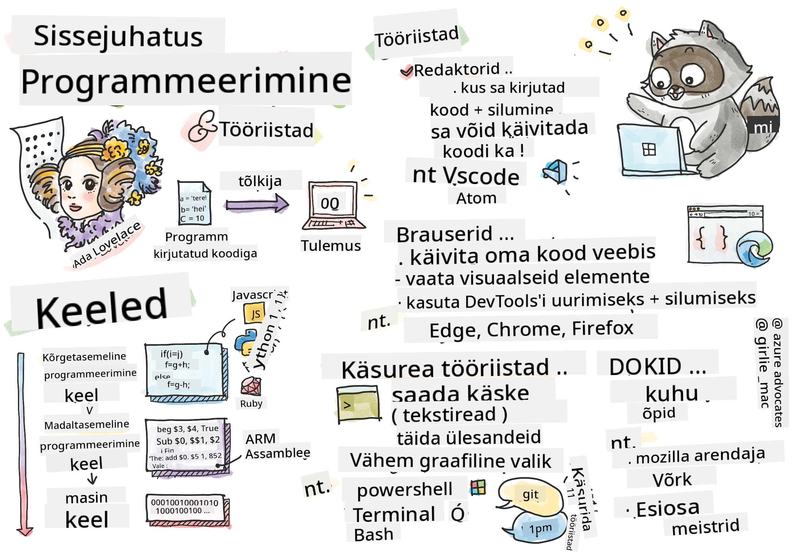

<!--
CO_OP_TRANSLATOR_METADATA:
{
  "original_hash": "2581528206a2a01c3a0b9c88e039b7bc",
  "translation_date": "2025-10-11T11:49:25+00:00",
  "source_file": "1-getting-started-lessons/1-intro-to-programming-languages/README.md",
  "language_code": "et"
}
-->
# Sissejuhatus programmeerimiskeeltesse ja tööriistadesse

See õppetund käsitleb programmeerimiskeelte põhialuseid. Siin käsitletavad teemad kehtivad enamiku tänapäevaste programmeerimiskeelte kohta. Jaotises "Tööriistad" õpid tundma kasulikku tarkvara, mis aitab sind arendajana.


> Sketšimärkus: [Tomomi Imura](https://twitter.com/girlie_mac)

## Eeltest
[Eeltest](https://forms.office.com/r/dru4TE0U9n?origin=lprLink)

## Sissejuhatus

Selles õppetunnis käsitleme:

- Mis on programmeerimine?
- Programmeerimiskeelte tüübid
- Programmi põhielemendid
- Kasulik tarkvara ja tööriistad professionaalsele arendajale

> Võid selle õppetunni läbida [Microsoft Learn](https://docs.microsoft.com/learn/modules/web-development-101/introduction-programming/?WT.mc_id=academic-77807-sagibbon) platvormil!

## Mis on programmeerimine?

Programmeerimine (tuntud ka kui kodeerimine) on protsess, kus kirjutatakse juhiseid seadmele, näiteks arvutile või mobiilseadmele. Me kirjutame need juhised programmeerimiskeeles, mida seade seejärel tõlgendab. Neid juhiste kogumeid võib nimetada erinevate nimedega, näiteks *programm*, *arvutiprogramm*, *rakendus (app)* ja *käivitatav fail*.

*Programm* võib olla mis tahes, mis on kirjutatud koodiga; veebilehed, mängud ja telefonirakendused on programmid. Kuigi on võimalik luua programm ilma koodi kirjutamata, tõlgendab seade siiski aluseks olevat loogikat, mis tõenäoliselt on kirjutatud koodiga. Programm, mis *käivitab* või *täidab* koodi, viib juhised ellu. Seade, millega sa seda õppetundi loed, käitab programmi, et kuvada seda ekraanil.

✅ Tee veidi uurimistööd: kes peetakse maailma esimeseks arvutiprogrammeerijaks?

## Programmeerimiskeeled

Programmeerimiskeeled võimaldavad arendajatel kirjutada juhiseid seadmele. Seadmed mõistavad ainult binaarkoodi (1 ja 0), kuid *enamiku* arendajate jaoks pole see väga tõhus viis suhtlemiseks. Programmeerimiskeeled on vahend suhtlemiseks inimeste ja arvutite vahel.

Programmeerimiskeeled on erinevates vormingutes ja võivad täita erinevaid eesmärke. Näiteks JavaScripti kasutatakse peamiselt veebirakenduste jaoks, samas kui Bash on peamiselt operatsioonisüsteemide jaoks.

*Madala taseme keeled* vajavad tavaliselt vähem samme, et seade juhiseid tõlgendaks, kuid *kõrge taseme keeled* on populaarsed oma loetavuse ja toe tõttu. JavaScripti peetakse kõrge taseme keeleks.

Järgmine kood näitab erinevust kõrge taseme keele (JavaScript) ja madala taseme keele (ARM assembleri kood) vahel.

```javascript
let number = 10
let n1 = 0, n2 = 1, nextTerm;

for (let i = 1; i <= number; i++) {
    console.log(n1);
    nextTerm = n1 + n2;
    n1 = n2;
    n2 = nextTerm;
}
```

```c
 area ascen,code,readonly
 entry
 code32
 adr r0,thumb+1
 bx r0
 code16
thumb
 mov r0,#00
 sub r0,r0,#01
 mov r1,#01
 mov r4,#10
 ldr r2,=0x40000000
back add r0,r1
 str r0,[r2]
 add r2,#04
 mov r3,r0
 mov r0,r1
 mov r1,r3
 sub r4,#01
 cmp r4,#00
 bne back
 end
```

Uskuge või mitte, *mõlemad teevad sama asja*: prindivad Fibonacci jada kuni 10.

✅ Fibonacci jada on [määratletud](https://en.wikipedia.org/wiki/Fibonacci_number) kui arvude kogum, kus iga arv on kahe eelneva summa, alustades 0 ja 1-ga. Esimesed 10 Fibonacci jada numbrit on 0, 1, 1, 2, 3, 5, 8, 13, 21 ja 34.

## Programmi elemendid

Üksik juhis programmis nimetatakse *lauseks* ja sellel on tavaliselt märk või reavahe, mis tähistab, kus juhis lõpeb ehk *lõpetatakse*. Kuidas programm lõpetatakse, varieerub iga keele puhul.

Lauseid programmis võib täita kasutaja või mujal saadud andmete abil. Andmed võivad muuta programmi käitumist, seega on programmeerimiskeeltel viis andmete ajutiseks salvestamiseks, et neid hiljem kasutada. Neid nimetatakse *muutujateks*. Muutujad on laused, mis juhendavad seadet salvestama andmeid oma mällu. Muutujad programmis on sarnased algebras kasutatavate muutujatega, kus neil on unikaalne nimi ja nende väärtus võib aja jooksul muutuda.

On võimalik, et mõned laused ei täitu seadme poolt. See juhtub tavaliselt arendaja kavatsuse tõttu või juhuslikult, kui tekib ootamatu viga. Selline kontroll rakenduse üle muudab selle vastupidavamaks ja hooldatavamaks. Tavaliselt toimub kontrolli muutus, kui teatud tingimused on täidetud. Üks levinud lause, mida kasutatakse kaasaegses programmeerimises programmi käitumise kontrollimiseks, on `if..else` lause.

✅ Õpid rohkem sellist tüüpi lausete kohta järgnevates õppetundides.

## Tööriistad

[](https://youtube.com/watch?v=69WJeXGBdxg "Tööriistad")

> 🎥 Klõpsa ülaloleval pildil, et vaadata videot tööriistadest

Selles jaotises õpid tundma mõningaid tarkvarasid, mis võivad olla väga kasulikud, kui alustad oma professionaalset arendajateekonda.

**Arenduskeskkond** on unikaalne tööriistade ja funktsioonide kogum, mida arendaja sageli kasutab tarkvara kirjutamisel. Mõned neist tööriistadest on kohandatud arendaja konkreetsetele vajadustele ja võivad aja jooksul muutuda, kui arendaja muudab tööprioriteete, isiklikke projekte või kasutab erinevat programmeerimiskeelt. Arenduskeskkonnad on sama unikaalsed kui arendajad, kes neid kasutavad.

### Redaktorid

Üks olulisemaid tööriistu tarkvaraarenduses on redaktor. Redaktorid on koht, kus kirjutad oma koodi ja mõnikord ka käivitad seda.

Arendajad toetuvad redaktoritele mitmel põhjusel:

- *Silumine* aitab avastada vigu ja tõrkeid, astudes koodist läbi rida-realt. Mõnel redaktoril on silumisvõimalused; neid saab kohandada ja lisada konkreetsete programmeerimiskeelte jaoks.
- *Süntaksi esiletõstmine* lisab koodile värve ja teksti vormindamist, muutes selle loetavamaks. Enamik redaktoreid võimaldab kohandatud süntaksi esiletõstmist.
- *Laiendused ja integratsioonid* on spetsiaalsed tööriistad arendajatele, arendajate poolt. Need tööriistad ei ole redaktori põhifunktsioonidesse sisse ehitatud. Näiteks paljud arendajad dokumenteerivad oma koodi, et selgitada, kuidas see töötab. Nad võivad installida õigekirjakontrolli laienduse, et leida dokumentatsioonis kirjavigu. Enamik laiendusi on mõeldud kasutamiseks konkreetse redaktori sees ja enamik redaktoreid võimaldab otsida saadaolevaid laiendusi.
- *Kohandamine* võimaldab arendajatel luua unikaalse arenduskeskkonna, mis vastab nende vajadustele. Enamik redaktoreid on äärmiselt kohandatavad ja võivad samuti võimaldada arendajatel luua kohandatud laiendusi.

#### Populaarsed redaktorid ja veebiarenduse laiendused

- [Visual Studio Code](https://code.visualstudio.com/?WT.mc_id=academic-77807-sagibbon)
  - [Code Spell Checker](https://marketplace.visualstudio.com/items?itemName=streetsidesoftware.code-spell-checker)
  - [Live Share](https://marketplace.visualstudio.com/items?itemName=MS-vsliveshare.vsliveshare)
  - [Prettier - Code formatter](https://marketplace.visualstudio.com/items?itemName=esbenp.prettier-vscode)
- [Atom](https://atom.io/)
  - [spell-check](https://atom.io/packages/spell-check)
  - [teletype](https://atom.io/packages/teletype)
  - [atom-beautify](https://atom.io/packages/atom-beautify)
  
- [Sublimetext](https://www.sublimetext.com/)
  - [emmet](https://emmet.io/)
  - [SublimeLinter](http://www.sublimelinter.com/en/stable/)

### Brauserid

Teine oluline tööriist on brauser. Veebiarendajad toetuvad brauserile, et näha, kuidas nende kood veebis töötab. Seda kasutatakse ka veebilehe visuaalsete elementide kuvamiseks, mis on kirjutatud redaktoris, näiteks HTML.

Paljudel brauseritel on *arendaja tööriistad* (DevTools), mis sisaldavad kasulikke funktsioone ja teavet, et aidata arendajatel koguda ja salvestada olulist teavet oma rakenduse kohta. Näiteks: Kui veebilehel esineb vigu, on mõnikord kasulik teada, millal need tekkisid. Brauseri DevTools saab konfigureerida selle teabe kogumiseks.

#### Populaarsed brauserid ja DevTools

- [Edge](https://docs.microsoft.com/microsoft-edge/devtools-guide-chromium/?WT.mc_id=academic-77807-sagibbon)
- [Chrome](https://developers.google.com/web/tools/chrome-devtools/)
- [Firefox](https://developer.mozilla.org/docs/Tools)

### Käsurea tööriistad

Mõned arendajad eelistavad vähem graafilist vaadet oma igapäevaste ülesannete jaoks ja toetuvad käsureale, et seda saavutada. Koodi kirjutamine nõuab märkimisväärset hulka tippimist ja mõned arendajad eelistavad mitte katkestada oma voogu klaviatuuril. Nad kasutavad klaviatuuri otseteid, et vahetada töölaua akende vahel, töötada erinevate failidega ja kasutada tööriistu. Enamik ülesandeid saab täita hiirega, kuid üks käsurea eelis on see, et palju saab teha käsurea tööriistadega ilma vajaduseta vahetada hiire ja klaviatuuri vahel. Teine käsurea eelis on see, et need on konfigureeritavad ja sa saad salvestada kohandatud konfiguratsiooni, muuta seda hiljem ja importida teistesse arendusmasinatesse. Kuna arenduskeskkonnad on iga arendaja jaoks nii unikaalsed, siis mõned väldivad käsurea kasutamist, mõned toetuvad sellele täielikult ja mõned eelistavad nende kahe segu.

### Populaarsed käsurea valikud

Käsurea valikud erinevad sõltuvalt operatsioonisüsteemist, mida kasutad.

*💻 = operatsioonisüsteemiga eelinstallitud.*

#### Windows

- [Powershell](https://docs.microsoft.com/powershell/scripting/overview?view=powershell-7/?WT.mc_id=academic-77807-sagibbon) 💻
- [Command Line](https://docs.microsoft.com/windows-server/administration/windows-commands/windows-commands/?WT.mc_id=academic-77807-sagibbon) (tuntud ka kui CMD) 💻
- [Windows Terminal](https://docs.microsoft.com/windows/terminal/?WT.mc_id=academic-77807-sagibbon)
- [mintty](https://mintty.github.io/)
  
#### MacOS

- [Terminal](https://support.apple.com/guide/terminal/open-or-quit-terminal-apd5265185d-f365-44cb-8b09-71a064a42125/mac) 💻
- [iTerm](https://iterm2.com/)
- [Powershell](https://docs.microsoft.com/powershell/scripting/install/installing-powershell-core-on-macos?view=powershell-7/?WT.mc_id=academic-77807-sagibbon)

#### Linux

- [Bash](https://www.gnu.org/software/bash/manual/html_node/index.html) 💻
- [KDE Konsole](https://docs.kde.org/trunk5/en/konsole/konsole/index.html)
- [Powershell](https://docs.microsoft.com/powershell/scripting/install/installing-powershell-core-on-linux?view=powershell-7/?WT.mc_id=academic-77807-sagibbon)

#### Populaarsed käsurea tööriistad

- [Git](https://git-scm.com/) (💻 enamikus operatsioonisüsteemides)
- [NPM](https://www.npmjs.com/)
- [Yarn](https://classic.yarnpkg.com/en/docs/cli/)

### Dokumentatsioon

Kui arendaja tahab midagi uut õppida, pöördub ta tõenäoliselt dokumentatsiooni poole, et õppida, kuidas seda kasutada. Arendajad toetuvad sageli dokumentatsioonile, et juhendada neid tööriistade ja keelte õiges kasutamises ning saada sügavamat arusaamist nende toimimisest.

#### Populaarne dokumentatsioon veebiarenduse kohta

- [Mozilla Developer Network (MDN)](https://developer.mozilla.org/docs/Web), Mozilla, [Firefox](https://www.mozilla.org/firefox/) brauseri väljaandjate poolt
- [Frontend Masters](https://frontendmasters.com/learn/)
- [Web.dev](https://web.dev), Google, [Chrome](https://www.google.com/chrome/) brauseri väljaandjate poolt
- [Microsofti arendajadokumentatsioon](https://docs.microsoft.com/microsoft-edge/#microsoft-edge-for-developers), [Microsoft Edge](https://www.microsoft.com/edge) brauseri jaoks
- [W3 Schools](https://www.w3schools.com/where_to_start.asp)

✅ Tee veidi uurimistööd: Nüüd, kui tead veebiarendaja keskkonna põhialuseid, võrdle ja vastanda seda veebidisaineri keskkonnaga.

---

## 🚀 Väljakutse

Võrdle mõningaid programmeerimiskeeli. Millised on JavaScripti ja Java unikaalsed omadused? Aga COBOLi ja Go omadused?

## Järeltundide test
[Järeltundide test](https://ff-quizzes.netlify.app/web/)

## Ülevaade ja iseseisev õppimine

Uuri veidi erinevate programmeerimiskeelte kohta. Proovi kirjutada üks rida ühes keeles ja seejärel kirjutada see kahes teises keeles. Mida sa õppisid?

## Ülesanne

[Dokumentatsiooni lugemine](assignment.md)

> Märkus: Ülesande jaoks tööriistu valides ära vali redaktoreid, brausereid ega käsurea tööriistu, mis on juba ülal loetletud.

---

**Lahtiütlus**:  
See dokument on tõlgitud AI tõlketeenuse [Co-op Translator](https://github.com/Azure/co-op-translator) abil. Kuigi püüame tagada täpsust, palume arvestada, et automaatsed tõlked võivad sisaldada vigu või ebatäpsusi. Algne dokument selle algses keeles tuleks pidada autoriteetseks allikaks. Olulise teabe puhul soovitame kasutada professionaalset inimtõlget. Me ei vastuta selle tõlke kasutamisest tulenevate arusaamatuste või valesti tõlgenduste eest.