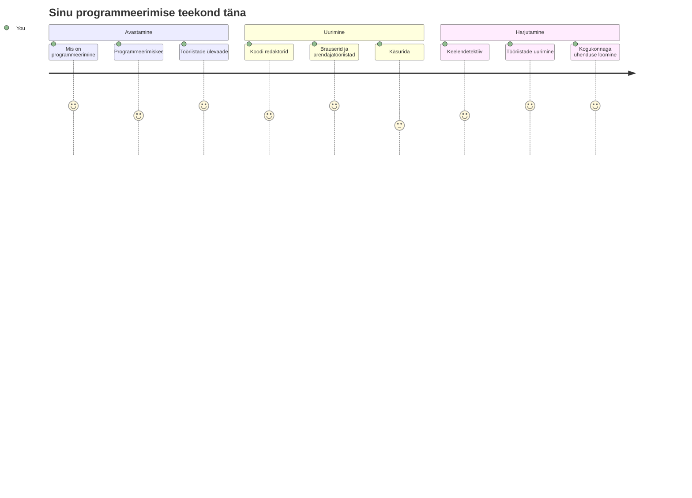
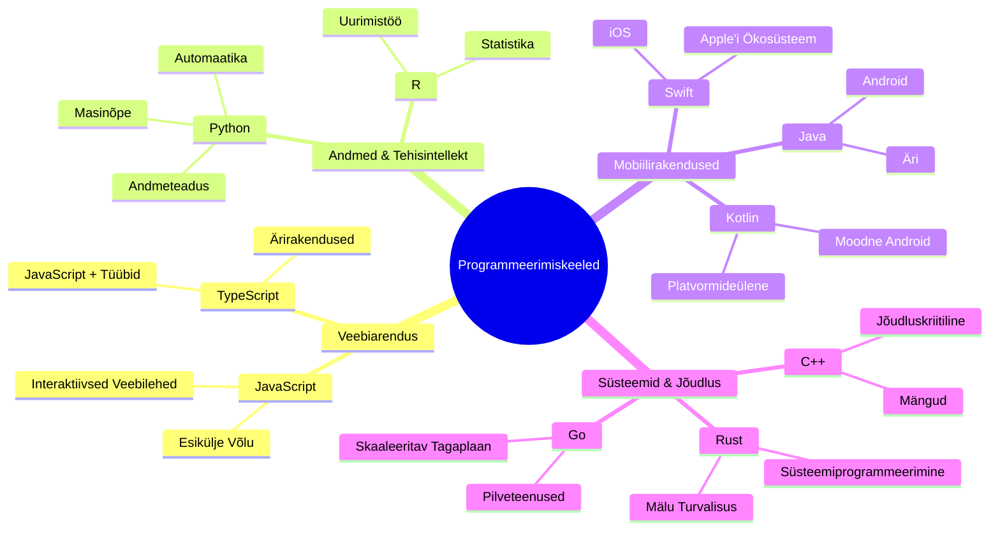
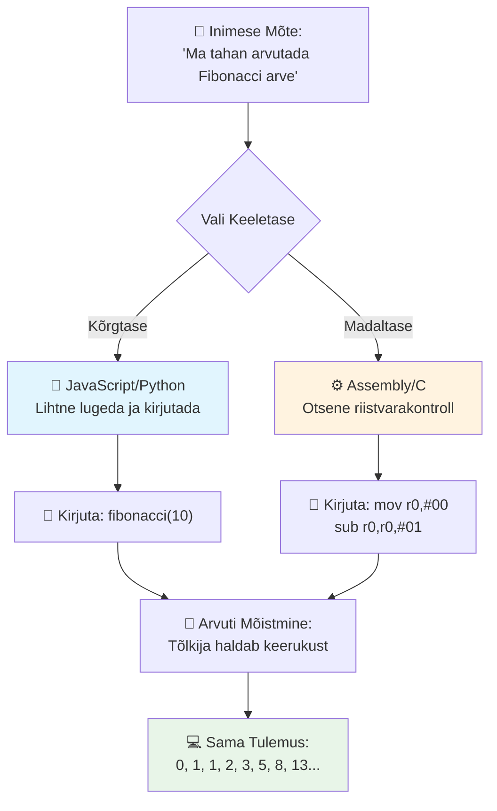
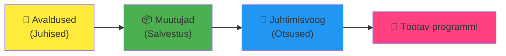
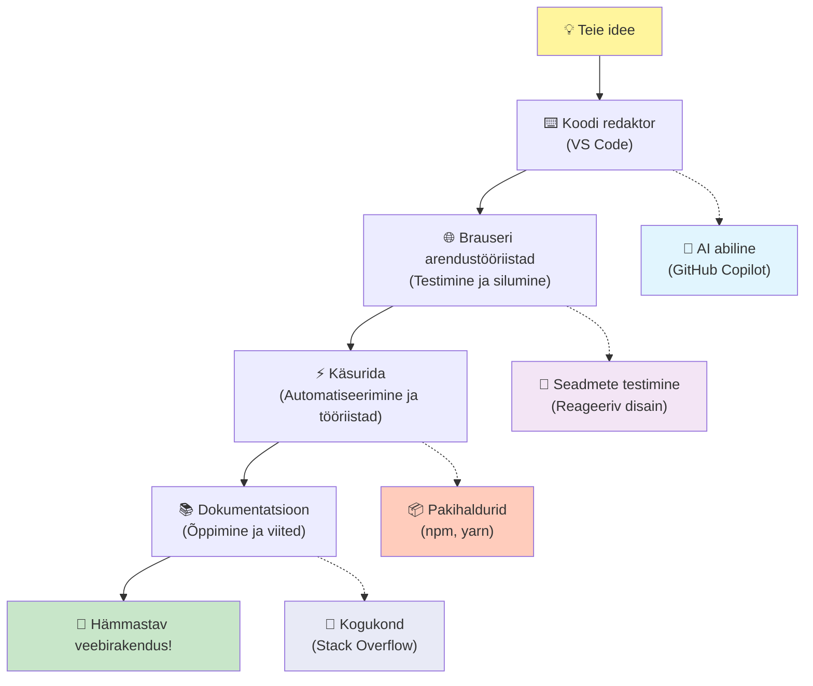
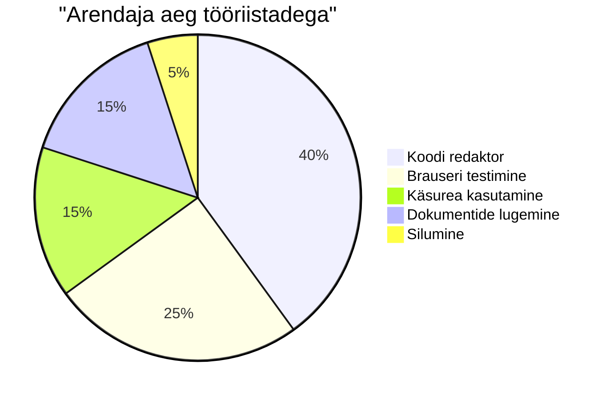
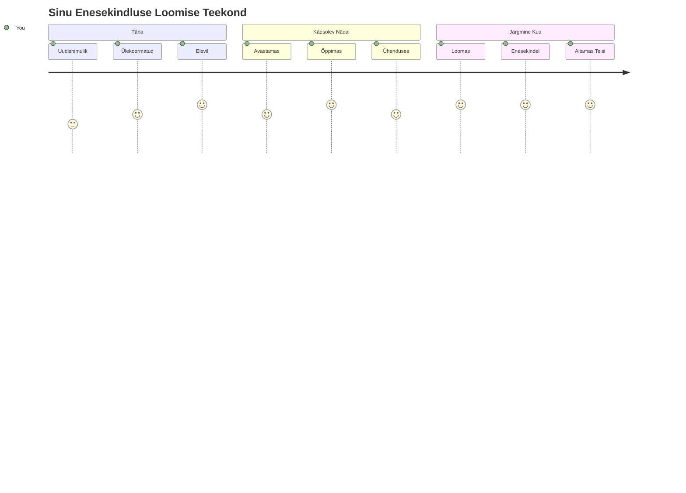

# Sissejuhatus programmeerimiskeeltesse ja kaasaegsetesse arendustööriistadesse
 
Hei, tulevane arendaja! 👋 Kas tohin sulle midagi öelda, mis paneb mind iga päev siiani külmavärinaid saama? Sa oled peaaegu avastamas, et programmeerimine ei puuduta ainult arvuteid – see tähendab tõelisi supervõimeid, millega tuua ellu oma kõige pöörasemad ideed!

Sa tead seda hetke, kui kasutad oma lemmikrakendust ja kõik klapib täiuslikult? Kui toksad nuppu ja juhtub midagi täiesti maagilist, mille peale mõtled "vau, kuidas nad SEDA ka tegid?" Noh, keegi täpselt nagu sina – tõenäoliselt oma lemmikkohvikus kell 2 öösel oma kolmandat espresso võttes – kirjutas selle koodi, mis selle maagia lõi. Ja siin on see, mis su meele lõhki lööb: selle tunni lõpuks sa mitte ainult ei saa aru, kuidas nad selle tegid, vaid sul hakkab kohe tuhin sees seda ise proovida!

Kuule, ma saan täiesti aru, kui programmeerimine tundub hetkel hirmutav. Kui mina alustasin, arvasin tõepoolest, et selleks pead olema mingisugune matemaatikageenius või kodeerinud juba alates viieaastasest. Aga siin on see, mis minu vaatenurka täielikult muutis: programmeerimine on täpselt nagu uue keele vestluste õppimine. Sa alustad "tere" ja "aitäh" ütlemisest, siis tellid kohvi ning enne kui arugi saad, pead sügavaid filosoofilisi vestlusi! Välja arvatud et seekord räägid sa arvutitega, ja ausalt? Nad on kõige kannatlikumad vestluskaaslased, keda võid saada – nad ei hinda sind maha su vigade pärast ning on alati elevil, et proovida uuesti!

Täna uurime hämmastavaid tööriistu, mis teevad kaasaegse veebiarenduse mitte ainult võimalikuks, vaid tõeliselt sõltuvust tekitavaks. Ma räägin täpselt samadest redigeerijatest, brauseritest ja töövoogudest, mida kasutavad arendajad Netflixis, Spotifys ja sinu lemmik indie rakenduse stuudios iga päev. Ja siin on see osa, mis paneb sind rõõmust tantsima: enamus nendest professionaalse taseme, tööstusstandardite tööriistadest on täiesti TASUTA!


> Sketchnote autor [Tomomi Imura](https://twitter.com/girlie_mac)


```mermaid
journey
    title Sinu programmeerimise teekond täna
    section Avastamine
      Mis on programmeerimine: 5: You
      Programmeerimiskeeled: 4: You
      Tööriistade ülevaade: 5: You
    section Uurimine
      Koodi redaktorid: 4: You
      Brauserid ja arendajatööriistad: 5: You
      Käsurida: 3: You
    section Harjutamine
      Keelendetektiiv: 4: You
      Tööriistade uurimine: 5: You
      Kogukonnaga ühenduse loomine: 5: You
```
## Vaatame, mida sa juba tead!

Enne lõbusamate teemade juurde hüppamist olen uudishimulik – mida sa sellest programmeerimise maailmast juba tead? Ja kuule, kui sa vaatad neid küsimusi ja mõtled "Mul pole sellest absoluutselt aimugi", siis see pole mitte ainult okei, see on ideaalne! See tähendab, et oled täiesti õiges kohas. Mõtle selle lõbusa testi peale kui venitussoojendus enne treeningut – me lihtsalt alustame aju lihaste soojendamist!

[Võta ette ülesehitus-eeskatsetus](https://ff-quizzes.netlify.app/web/)


## Seiklus, millele me koos lähme

Okei, ma olen siiralt põnevil selle üle, mida täna uurime! Ausalt, ma soovin, et ma saaksin su nägu näha, kui mõni nendest kontseptsioonidest arusaamisele jõuab. Siin on selle uskumatult laheda teekonna kokkuvõte, mille me koos võtame:

- **Mis programmeerimine tegelikult on (ja miks see on kõige lahedam asi üldse!)** – Avastame, kuidas kood on tõepoolest nähtamatu maagia, mis paneb kõik su ümber toimima, alates äratusest, mis kuidagi teab, et on esmaspäeva hommik, kuni algoritmini, mis täiuslikult kureerib su Netflixi soovitusi
- **Programmeerimiskeeled ja nende hämmastavad iseloomud** – Kujuta ette, et astud peole, kus igal inimesel on täiesti erinevad supervõimed ja probleemide lahendamise viisid. Nii ongi programmeerimiskeelte maailm ning sa armud neisse kohtudes!
- **Põhilised ehitusplokid, mis loovad digitaalse maagia** – Mõtle nendele kui ülimale loomingulisele LEGO komplektile. Kui sa mõistad, kuidas see tükkideks sobib, saad sa tegelikult ehitada kõike, mida su fantaasia välja mõelda suudab
- **Professionaalsed tööriistad, mis panevad sind tundma nagu oleksid saanud võlurikepi** – Ma pole siinkohal liialdades – need tööriistad panevad sind tõesti tundma supervõimetega, ja parim osa? Need on samad, mida proffid kasutavad!

> 💡 **Asi on selles**: ära isegi mõtle kõike täna pähe tuupima hakata! Praegu tahan lihtsalt, et tunneksid põnevust selle üle, mis võimalik on. Detailid jäävad sulle loomulikult meelde, kui me koos harjutame – nii käib päris õppimine!

> Selle tunni võid läbida ka [Microsoft Learnis](https://learn.microsoft.com/en-us/learn/modules/web-development-101/introduction-programming/?WT.mc_id=academic-77807-sagibbon)!

## Mis siis täpselt *on* programmeerimine?

Nüüd võtame käsile miljonidollari küsimuse: mis tegelikult on programmeerimine?

Ma räägin sulle loo, mis täielikult muutis minu arusaama. Eelmisel nädalal püüdsin oma emale seletada, kuidas meie uut nutikat teleri kaugjuhtimispulti kasutada. Ma tabasin end ütlemas asju nagu "Vajuta punast nuppu, aga mitte suurt punast nuppu, väikest punast nuppu vasakul... ei, sinu teine vasak... okei, nüüd hoia seda kaks sekundit, mitte üks, mitte kolm..." Kas see kõlab tuttavalt? 😅

See on programmeerimine! See on kunst anda uskumatult detailsed, samm-sammult juhised millelegi, mis on väga võimas, aga vajab kõike täpselt väljaütlemist. Välja arvatud, et sa ei selgita oma emale (kes võib küsida "millist punast nuppu?!"), vaid sa selgitad arvutile (kes lihtsalt teeb täpselt seda, mida sa ütled, isegi kui sa tegelikult mõtlesid midagi muud).

Siin on see, mis mind alguses valla ajas: arvutid on oma südamelt tegelikult üsna lihtsad. Nad mõistavad sõna otseses mõttes ainult kahte asja – 1 ja 0, mis on põhimõtteliselt „jah” ja „ei” või „sees” ja „väljas”. See ongi kõik! Aga siin tulebki maagia – meie ei pea rääkima ainult 1-des ja 0-des nagu filmis Matrix. Siin tulevad appi **programmeerimiskeeled**. Need on nagu maailma parimad tõlkijad, kes võtavad sinu täiesti normaalsed inimmõtted ja teisendavad need arvutikeelde.

Ja siin on see, mis mind siiani iga hommik tõeliselt külmavärinaid paneb: sõna otseses mõttes *kõik* digitaalne sinu elus algas kellegagi, nagu sina, tõenäoliselt pidžaamas, tass kohvi käes, tippides koodi sülearvutisse. See Instagrami filter, mis paneb sind täiuslikuna välja nägema? Keegi programmeeris selle. Soovitus, mis viis sind su uue lemmiklauluni? Arendaja lõi selle algoritmi. Rakendus, mis aitab sul õhtusöögiarved sõpradega jagada? Jep, keegi mõtles "see on tüütu, ma arvan, et saan selle korda teha" ja siis... ta tegigi!

Kui sa õpid programmeerima, siis sa ei omanda lihtsalt uut oskust – sa liitud selle uskumatult vahva probleemilahendajate kogukonnaga, kes veedavad oma päevad mõeldes: "Mis siis, kui ma saaks ehitada midagi, mis teeb kellegi päeva pisut paremaks?" Ausalt, kas on midagi lahedamat?

✅ **Lõbus faktimäng**: Siin on midagi üliväga põnevat, mida võid uurida kui sul on vaba hetk – kes sa arvad oli maailma esimene arvutiprogrammeerija? Ma annan sulle vihje: tõenäoliselt ei ole see see, keda sa ootad! Selle inimese lugu on lihtsalt lummav ja näitab, et programmeerimine on alati olnud loominguline probleemilahendus ja kastist välja mõtlemine.

### 🧠 **Kuidas sul läheb?**

**Võta hetk peegeldamiseks:**
- Kas idee „anda arvutile juhiseid” tundub nüüd mõistlik?
- Kas suudad mõelda mõne igapäevase ülesande, mida tahaksid programmeerimise abil automatiseerida?
- Millised küsimused sul selle kogu programmeerimise asja kohta peas keerlevad?

> **Pea meeles**: on täiesti normaalne, kui mõni kontseptsioon tundub praegu hägune. Programmeerimist õppida on nagu uut keelt õppida – aju vajab aega, et luua need neurovõrgustikud. Sa teed suurepärast tööd!

## Programmeerimiskeeled on nagu erinevad maagilised maitsed

Okei, see kõlab imelikult, aga ära pöördu ära – programmeerimiskeeled on väga sarnased erinevate muusikastiilidega. Mõtle sellele: sul on jazz, mis on sujuv ja improviseeriv, rock, mis on võimas ja sirgjooneline, klassikaline, mis on elegantne ja struktureeritud, ning hip-hop, mis on loominguline ja väljendusrikas. Igal stiilil on oma vibe, oma kirglike fännide kogukond ja igaüht sobib erinevatesse olukordadesse ja tunnetesse.

Programmeerimiskeeled töötavad täpselt samamoodi! Sa ei kasuta sama keelt lõbusa mobiilimängu tegemiseks, mida kasutad tohutute kliimaandmete töötlemiseks, just nagu sa ei mängiks death metalit joogatunnis (no vähemalt enamikes joogatundides! 😄).

Aga siin on see, mis paneb mind iga kord imestama: need keeled on nagu maailmanadil kannatlik ja geniaalne tõlk, kes istub otse kõrval. Sa saad väljendada oma ideid viisil, mis su inimese ajule loomulik tundub, ja nemad teevad kogu uskumatult keeruka töö, tõlkides selle 1-deks ja 0-deks, mida arvutid tegelikult räägivad. See on nagu sõber, kes valdab perfektselt nii „inimese loomingulisust” kui ka „arvuti loogikat” – ja ta ei väsi kunagi, ei vaja kohvipause ega hinda sind maha selle eest, et esitad sama küsimust kaks korda!

### Populaarsed programmeerimiskeeled ja nende kasutus


```mermaid
mindmap
  root((Programmeerimiskeeled))
    Veebiarendus
      JavaScript
        Esikülje Võlu
        Interaktiivsed Veebilehed
      TypeScript
        JavaScript + Tüübid
        Ärirakendused
    Andmed & Tehisintellekt
      Python
        Andmeteadus
        Masinõpe
        Automaatika
      R
        Statistika
        Uurimistöö
    Mobiilirakendused
      Java
        Android
        Äri
      Swift
        iOS
        Apple'i Ökosüsteem
      Kotlin
        Moodne Android
        Platvormideülene
    Süsteemid & Jõudlus
      C++
        Mängud
        Jõudluskriitiline
      Rust
        Mälu Turvalisus
        Süsteemiprogrammeerimine
      Go
        Pilveteenused
        Skaaleeritav Tagaplaan
```
| Keel | Parim kasutamiseks | Miks see populaarne on |
|----------|----------|------------------|
| **JavaScript** | Veebiarendus, kasutajaliidesed | Jookseb brauserites ja toetab interaktiivseid veebisaite |
| **Python** | Andmeteadus, automatiseerimine, tehisintellekt | Lihtne lugeda ja õppida, võimsad raamatukogud |
| **Java** | Ettevõtte rakendused, Androidi äpid | Platvormist sõltumatu, tugev suurte süsteemide jaoks |
| **C#** | Windowsi rakendused, mänguarendus | Tugev Microsofti ökosüsteemi tugi |
| **Go** | Pilveteenused, backend süsteemid | Kiire, lihtne, loodud kaasaegse arvutamise jaoks |

### Kõrgetasemelised vs madalatasemelised keeled

Okei, see oli ausalt kontseptsioon, mis mind alguses peaaegu murdis, nii et jagan analoogiat, mis lõpuks selle mulle seletavaks tegi – ja loodan väga, et see aitab sindki!

Kujuta ette, et sa oled riigis, kus sa keelt ei oska, ja sul on hullult vaja leida lähim tualett (me kõik oleme ju seal olnud, eks? 😅):

- **Madalatasemeline programmeerimine** on nagu kohalikku murret nii hästi õppida, et saad rääkida vanaemaga, kes müüb nurga peal puuvilju, kasutades kultuuriviiteid, kohalikke slangisõnu ja seesuguseid nalju, mida mõistab ainult keegi, kes on seal üles kasvanud. Ülimalt muljetavaldav ja efektiivne... kui oled sellest keeleliselt juba täiesti selgeks saanud! Aga päris hull võib olla siis, kui sa lihtsalt tualetti otsid.

- **Kõrgetasemeline programmeerimine** on nagu see imeline kohalik sõber, kes sind lihtsalt mõistab. Sa ütled "ma tõesti pean tualetti leidma" tavalises inglise keeles ja tema teeb kogu kultuurilise tõlke ning juhatab sind tee pealt viisil, mis su mittekohalisel ajul täiesti arusaadav on.

Programmeerimises:
- **Madalatasemelised keeled** (nagu Assembly või C) lasevad sul rääkida väga üksikasjalikke vestlusi arvuti riistvaraga, aga sa pead mõtlema nagu masin, mis on... ütleme nii, üsna suur vaimne nihkepunkt!
- **Kõrgetasemelised keeled** (nagu JavaScript, Python või C#) lasevad sul mõelda nagu inimene, samal ajal kui nemad korraldavad kogu masina-sõna tahaotsa. Lisaks on neil tohutult külalislahked kogukonnad täis inimesi, kes mäletavad, mis tunne on uus olla, ja kes tõesti tahavad aidata!

Arva ära, milliseid ma soovitan sul alustada? 😉 Kõrgetasemelised keeled on nagu abirattad, mida sa tegelikult kunagi maha võtta ei taha, sest nad muudavad kogu kogemuse palju nauditavamaks!


```mermaid
flowchart TB
    A["👤 Inimese Mõte:<br/>'Ma tahan arvutada Fibonacci arve'"] --> B{Vali Keeletase}
    
    B -->|Kõrgtase| C["🌟 JavaScript/Python<br/>Lihtne lugeda ja kirjutada"]
    B -->|Madaltase| D["⚙️ Assembly/C<br/>Otsene riistvarakontroll"]
    
    C --> E["📝 Kirjuta: fibonacci(10)"]
    D --> F["📝 Kirjuta: mov r0,#00<br/>sub r0,r0,#01"]
    
    E --> G["🤖 Arvuti Mõistmine:<br/>Tõlkija haldab keerukust"]
    F --> G
    
    G --> H["💻 Sama Tulemus:<br/>0, 1, 1, 2, 3, 5, 8, 13..."]
    
    style C fill:#e1f5fe
    style D fill:#fff3e0
    style H fill:#e8f5e8
```
### Näitan sulle, miks kõrgetasemelised keeled on palju sõbralikumad

Okei, ma näitan nüüd sulle midagi, mis täiesti näitab, miks ma armusin kõrgetasemelisse keeltesse, aga kõigepealt – ma vajan sinult lubadust. Kui sa näed seda esimest koodinäidet, ära ehmu! Selle peamine ülesanne on näida hirmutav. Just seda ma tahangi näidata!

Vaatame täpselt sama ülesannet kirjutatuna kahes täiesti erinevas stiilis. Mõlemad loovad Fibonacci jada – see on ilus matemaatiline muster, kus iga number on kahe eelmise summa: 0, 1, 1, 2, 3, 5, 8, 13... (Lõbus fakt: seda mustrit leiad tõesti kõikjalt loodusest – päevalille seemne keerud, käbide mustrid, isegi galaktikate moodustumine!)

Valmis nägema erinevust? Alustame!

**Kõrgetasemeline keel (JavaScript) – inimesele sõbralik:**

```javascript
// 1. samm: Põhiline Fibonacci seadistus
const fibonacciCount = 10;
let current = 0;
let next = 1;

console.log('Fibonacci sequence:');
```

**See kood teeb järgmist:**
- **Deklareerib** konstandi, mis määrab, mitu Fibonacci numbrit me genereerime
- **Initsialiseerib** kaks muutujat, mis jälgivad jadas praegust ja järgmist numbrit
- **Seab** algväärtused (0 ja 1), mis määravad Fibonacci mustri
- **Kuvab** päise, mis näitab meie väljundit

```javascript
// Samm 2: Genereeri järjestus tsükliga
for (let i = 0; i < fibonacciCount; i++) {
  console.log(`Position ${i + 1}: ${current}`);
  
  // Arvuta järjestuse järgmine number
  const sum = current + next;
  current = next;
  next = sum;
}
```

**Siin toimub:**
- **Tsükkel** läbib iga positsiooni jadast, kasutades `for` tsüklit
- **Kuvab** iga numbri koos positsiooniga, kasutades malliteksti vormindust
- **Arvutab** uue Fibonacci numbri, liites praeguse ja järgmise väärtuse
- **Uuendab** jälgimismuutujaid, et liikuda järgmisesse iteratsiooni

```javascript
// Samm 3: Moodne funktsionaalne lähenemine
const generateFibonacci = (count) => {
  const sequence = [0, 1];
  
  for (let i = 2; i < count; i++) {
    sequence[i] = sequence[i - 1] + sequence[i - 2];
  }
  
  return sequence;
};

// Kasutusnäide
const fibSequence = generateFibonacci(10);
console.log(fibSequence);
```

**Ülalolevas me:**
- **Loodsime** taaskasutatava funktsiooni, kasutades kaasaegset noolfunktsiooni süntaksit
- **Raamisime** massiivi, mis hoiab kogu jada, selle asemel et kuvada numbreid ükshaaval
- **Kasutame** massiivi indekseerimist, et arvutada iga uus number eelnevatest väärtustest
- **Tagastame** kogu jada, et seda saaks kasutada mujal programmis paindlikult

**Madalatasemeline keel (ARM Assembly) – arvutile sõbralik:**

```assembly
 area ascen,code,readonly
 entry
 code32
 adr r0,thumb+1
 bx r0
 code16
thumb
 mov r0,#00
 sub r0,r0,#01
 mov r1,#01
 mov r4,#10
 ldr r2,=0x40000000
back add r0,r1
 str r0,[r2]
 add r2,#04
 mov r3,r0
 mov r0,r1
 mov r1,r3
 sub r4,#01
 cmp r4,#00
 bne back
 end
```

Pane tähele, kuidas JavaScripti versioon loeb peaaegu nagu ingliskeelsed juhised, samas kui Assembly versioon kasutab krüptilisi käske, mis otseselt kontrollivad arvuti protsessorit. Mõlemad täidavad täpselt sama ülesande, kuid kõrgetasemeline keel on inimestele palju lihtsam mõista, kirjutada ja hooldada.

**Peamised erinevused, mida märkad:**
- **Lugemise mugavus**: JavaScript kasutab kirjeldavaid nimesid nagu `fibonacciCount`, samas kui Assembly kasutab krüptilisi silte nagu `r0`, `r1`.
- **Kommentaarid**: Kõrgetasemelised keeled soodustavad selgitavaid kommentaare, mis teevad koodi isedokumenteerivaks.
- **Struktuur**: JavaScripti loogiline voog vastab sellele, kuidas inimesed probleeme samm-sammult mõtlevad.
- **Hooldus**: JavaScripti versiooni uuendamine erinevate nõudmiste jaoks on lihtne ja arusaadav.

✅ **Fibonacci jada kohta**: See täiesti imeilus numbrimuster (kus iga number võrdub kahe eelneva summaga: 0, 1, 1, 2, 3, 5, 8...) esineb sõna otseses mõttes *kõiges* looduses! Sa leiad seda päevalille spiraalides, männikäbide mustrites, nautiluse kestade kõveruses ja isegi selles, kuidas puude oksad kasvavad. On päris uskumatu, kuidas matemaatika ja kood võivad aidata meil mõista ja taastoota mustreid, mida loodus kasutab ilu loomiseks!

## Ehitusplokid, mis teevad võlu reaalsuseks

Nüüd, kui oled näinud, millised programmeerimiskeeled tegelikult välja näevad, vaatame üle põhilised osad, mis moodustavad sõna otseses mõttes iga kunagi kirjutatud programmi. Mõtle nendele kui olulistele koostisosadele sinu lemmikretseptis – kui sa tead, mida igaüks teeb, oskad lugeda ja kirjutada koodi peaaegu igas keeles!

See on natuke nagu programmeerimise grammatika õppimine. Mäletad, koolis õpid nimisõnu, tegusõnu ja kuidas lauseid moodustada? Programmeerimisel on oma grammatikasüsteem ja ausalt öeldes on see palju loogilisem ja halastamatum kui inglise keel kunagi oli! 😄

### Avaldused: samm-sammulised juhised

Alustame **avaldustega** – need on nagu üksikud laused arvutiga vestluses. Iga avaldus ütleb arvutile teha üks kindel asi, nagu juhiste andmine: "Pööra siin vasakule," "Peatu punase tule juures," "Pargi sellesse kohta."

Mulle meeldib avalduste juures see, kui loetavad nad enamasti on. Vaata seda:

```javascript
// Põhilised avaldused, mis sooritavad üksikuid toiminguid
const userName = "Alex";                    
console.log("Hello, world!");              
const sum = 5 + 3;                         
```

**See kood teeb järgmist:**
- **Deklareerib** konstandi, mis hoiab kasutaja nime
- **Kuvab** tervitussõnumi konsoolile
- **Arvutab** ja salvestab matemaatilise operatsiooni tulemuse

```javascript
// Avaldused, mis suhtlevad veebilehtedega
document.title = "My Awesome Website";      
document.body.style.backgroundColor = "lightblue";
```

**Samm-sammult toimub:**
- **Muudab** veebilehe tiitlit, mis kuvatakse brauseri vahekaardil
- **Vahetab** kogu lehe keha taustavärvi

### Muutujad: su programmi mälusüsteem

Okei, **muutujad** on ausalt üks mu lemmikkontseptsioone õpetada, sest need on nii sarnased asjadele, mida sa igapäevaselt kasutad!

Mõtle korraks oma telefoni kontaktiloendile. Sa ei mäleta iga numbri ära – sa salvestad "Ema," "Parim sõber" või "Pitsa, mis toob koju kella 2-ni" ja las telefon mäletab numbreid. Muutujad töötavad täpselt samamoodi! Need on nagu sildistatud anumad, kuhu su programm saab infot salvestada ja hiljem nime järgi kätte otsida.

Mis on eriti lahe: muutujad võivad programmi jooksu ajal muutuda (seetõttu ka nimetus "muutuja" – näed, kuidas nad mängisid sõnadega?). Nagu sa võid uuendada seda pitsakohta kontaktis, kui leiad parema, saavad muutujad värskendada end vastavalt uuele infole või muutuvatele tingimustele!

Näitan sulle, kui kaunilt lihtne see võib olla:

```javascript
// Samm 1: Põhiliste muutujate loomine
const siteName = "Weather Dashboard";        
let currentWeather = "sunny";               
let temperature = 75;                       
let isRaining = false;                      
```

**Need mõisted tähendavad:**
- **Salvesta** muutumatud väärtused `const` muutujatesse (nt saidi nimi)
- **Kasuta** `let` väärtuste jaoks, mis võivad programmi jooksul muutuda
- **Määra** erinevaid andmetüüpe: stringid (tekst), numbrid ja booleanid (tõene/vale)
- **Vali** kirjeldavad nimed, mis selgitavad, mida iga muutuja sisaldab

```javascript
// 2. samm: Objektidega töötamine seotud andmete rühmitamiseks
const weatherData = {                       
  location: "San Francisco",
  humidity: 65,
  windSpeed: 12
};
```

**Ülalolevas oleme:**
- **Loonud** objekti, et grupeerida seotud ilmaandmeid
- **Korraldanud** mitu info osa ühe muutujanime alla
- **Kasutame** võtme-väärtuse paarid, et info selgelt märgistada

```javascript
// Samm 3: Muutujate kasutamine ja uuendamine
console.log(`${siteName}: Today is ${currentWeather} and ${temperature}°F`);
console.log(`Wind speed: ${weatherData.windSpeed} mph`);

// Muutuva väärtusega muutujate uuendamine
currentWeather = "cloudy";                  
temperature = 68;                          
```

**Vaatame iga osa lähemalt:**
- **Kuva** infot mallilised stringid `${}` süntaksiga
- **Juurdepääs** objekti omadustele punktnotatsiooniga (`weatherData.windSpeed`)
- **Uuenda** `let` deklareeritud muutujaid muutuvate tingimuste peegeldamiseks
- **Kombineeri** mitut muutujat, et luua tähendusrikkaid sõnumeid

```javascript
// Samm 4: Kaasaegne lagundamine puhtama koodi jaoks
const { location, humidity } = weatherData; 
console.log(`${location} humidity: ${humidity}%`);
```

**Oluline teada:**
- **Eralda** objekti omadusi destruktureeriva määramisega
- **Loo** uued muutujad automaatselt, kasutades objektivõtmete nimesid
- **Lihtsusta** koodi, vältides korduvat punktnotatsiooni

### Kontrollvoog: õpetades su programmi mõtlema

Okei, siin hakkab programmeerimine vabalt võttes täiesti hämmastavaks minema! **Kontrollvoog** on põhimõtteliselt su programmi õpetamine tegema nutikaid otsuseid, täpselt nagu sina teed iga päev ilma mõtlemata.

Kujuta ette: täna hommikul käisid ilmselt midagi sellist läbi – "Kui sajab, võtaks vihmavarju. Kui on külm, paneks jope selga. Kui hiljaks jään, jätaks hommikusöögi vahele ja võtaks kohvi teel." Sinu aju järgib loomulikult seda kui-siis loogikat kümneid kordi päevas!

See teeb programmidest targad ja elusad, mitte ainult mõne igava, etteaimatava stsenaariumi järgijad. Nad oskavad olukorda hinnata, mõelda, mis toimub, ja reageerida vastavalt. See on nagu anda su programmile ajuke, mis suudab kohaneda ja otsuseid langetada!

Tahad näha, kui kenasti see töötab? Lase näidata:

```javascript
// 1. samm: Põhiline tingimusloogika
const userAge = 17;

if (userAge >= 18) {
  console.log("You can vote!");
} else {
  const yearsToWait = 18 - userAge;
  console.log(`You'll be able to vote in ${yearsToWait} year(s).`);
}
```

**See kood teeb järgmist:**
- **Kontrollib**, kas kasutaja vanus vastab hääletamise nõudele
- **Täidab** erinevaid koodiblokke sõltuvalt tingimuse tulemusest
- **Arvutab** ja kuvab, kui kaua veel hääletamisõiguseni peab ootama, kui on alla 18
- **Annab** konkreetset ja kasulikku tagasisidet iga stsenaariumi korral

```javascript
// Samm 2: Mitmed tingimused loogikate operaatoritega
const userAge = 17;
const hasPermission = true;

if (userAge >= 18 && hasPermission) {
  console.log("Access granted: You can enter the venue.");
} else if (userAge >= 16) {
  console.log("You need parent permission to enter.");
} else {
  console.log("Sorry, you must be at least 16 years old.");
}
```

**Mis siin toimub?**
- **Ühenda** mitu tingimust operaatoriga `&&` (ja)
- **Loo** tingimusthierarhia `else if` abil mitmete stsenaariumite jaoks
- **Käsitle** kõiki võimalikke juhtumeid lõpliku `else` avaldusega
- **Anna** selget, toimivat tagasisidet igas olukorras

```javascript
// Samm 3: Lühike tingimuslik lause ternaaroperaatoriga
const votingStatus = userAge >= 18 ? "Can vote" : "Cannot vote yet";
console.log(`Status: ${votingStatus}`);
```

**Pea meeles:**
- **Kasuta** ternaarset operaatorit (`? :`) lihtsate kahe-valikuga tingimuste jaoks
- **Kirjuta** tingimus, siis `?`, seejärel tõene tulemus, `:`, ja väär tulemus
- **Rakenda** seda mustrit, kui vajad väärtuste määramist tingimuste põhjal

```javascript
// Samm 4: Mitme konkreetse juhtumi käsitlemine
const dayOfWeek = "Tuesday";

switch (dayOfWeek) {
  case "Monday":
  case "Tuesday":
  case "Wednesday":
  case "Thursday":
  case "Friday":
    console.log("It's a weekday - time to work!");
    break;
  case "Saturday":
  case "Sunday":
    console.log("It's the weekend - time to relax!");
    break;
  default:
    console.log("Invalid day of the week");
}
```

**See kood teeb järgmist:**
- **Võrdleb** muutuja väärtust mitme konkreetse juhtumiga
- **Grupeerib** sarnased juhtumid (argipäevad vs nädalavahetused)
- **Täidab** sobiva koodibloki, kui leitakse vastavus
- **Sisaldab** `default` juhtumit ootamatute väärtuste jaoks
- **Kasutab** `break` avaldusi, et takistada koodi jätkumist järgmise juhtumini

> 💡 **Tegeliku elu võrdlus**: Mõtle kontrollvoolule nagu maailma kõige kannatlikum GPS, mis juhendab sind. See võib öelda: "Kui Main Streetil on ummik, võta kiirtee. Kui kiirteed ehitatakse kinni, proovi vaadetee." Programmid kasutavad täpselt sellist tingimusloogikat, et inteligentselt olukordadele reageerida ja alati pakkuda kasutajatele parimat kogemust.

### 🎯 **Kontseptide kontroll: ehitusplokkide valdamine**

**Vaatame, kuidas sul põhiteadmised selged on:**
- Kas suudad oma sõnadega selgitada vahet muutuja ja avalduse vahel?
- Mõtle välja mõni tegelik olukord, kus kasutad kui-siis otsust (nagu meie hääletamise näide)
- Mis oli üks asi programmeerimisloogika juures, mis sind üllatas?

**Kiire enesekindluse tõstja:**

```mermaid
flowchart LR
    A["📝 Avaldused<br/>(Juhised)"] --> B["📦 Muutujad<br/>(Salvestus)"] --> C["🔀 Juhtimisvoog<br/>(Otsused)"] --> D["🎉 Töötav programm!"]
    
    style A fill:#ffeb3b
    style B fill:#4caf50
    style C fill:#2196f3
    style D fill:#ff4081
```
✅ **Järgmine samm**: Läheme süvitsi nendesse kontseptsioonidesse ühise imelise teekonna jätkudes! Praegu keskendu sellele põnevale tunnetusele kõigist võimalustest, mis sind ees ootavad. Konkreetsed oskused ja tehnikad jäävad loomulikult külge, kui harjutame koos – ma luban, see saab olema palju toredam kui sa oskad arvata!

## Tööriistad, millega kaubelda

Nüüd, siin muutun ma ausalt nii elevile, et vaevu suudan ennast tagasi hoida! 🚀 Räägime vapustavatest tööriistadest, mis panevad sind tundma, nagu oleksid saanud digitaalse kosmoselaeva võtmepakisid.

Sa tead, kuidas kokal on ideaalselt tasakaalus noad, mis tunduvad nagu tema käe pikendus? Või kuidas muusikul on üks kitarr, mis tundub laulvat kohe, kui ta seda puudutab? Arendajatel on sarnased maagilised tööriistad ja siin tuleb sinu mõistusepimestav osa – enamik neist on täiesti tasuta!

Ma olen peaaegu toolil hüppamas, kui mõtlen nende jagamisele, sest need on täielikult muutnud, kuidas me tarkvara ehitame. Räägime tehisintellekti abil töötavatest abimeestest, kes aitavad sul koodi kirjutada (ausalt!), pilvekeskkondadest, kus saad ehitada terveid rakendusi ükskõik kus Wifi juures, ning silumisvahenditest, mis on nii nutikad nagu röntgen su programmidele.

Ja nüüd osa, mis paneb mind ikka veel kihvama: need ei ole "algajate tööriistad", mida sa kunagi kasutamisest välja kasvad. Need on täpselt samad professionaalse taseme vahendid, mida Google’i, Netflixi ja sinu lemmiku indie-rakenduste stuudio arendajad praegu kasutavad. Sa tunned end nagu tõeline pro, kui neid kasutad!


```mermaid
graph TD
    A["💡 Teie idee"] --> B["⌨️ Koodi redaktor<br/>(VS Code)"] 
    B --> C["🌐 Brauseri arendustööriistad<br/>(Testimine ja silumine)"]
    C --> D["⚡ Käsurida<br/>(Automatiseerimine ja tööriistad)"]
    D --> E["📚 Dokumentatsioon<br/>(Õppimine ja viited)"]
    E --> F["🚀 Hämmastav veebirakendus!"]
    
    B -.-> G["🤖 AI abiline<br/>(GitHub Copilot)"]
    C -.-> H["📱 Seadmete testimine<br/>(Reageeriv disain)"]
    D -.-> I["📦 Pakihaldurid<br/>(npm, yarn)"]
    E -.-> J["👥 Kogukond<br/>(Stack Overflow)"]
    
    style A fill:#fff59d
    style F fill:#c8e6c9
    style G fill:#e1f5fe
    style H fill:#f3e5f5
    style I fill:#ffccbc
    style J fill:#e8eaf6
```
### Koodi redaktorid ja IDE-d: su uued digitaalsed parimad sõbrad

Räägime koodi redaktoritest – need saavad kindlasti sinu uueks lemmikkohaks, kuhu kirjutaja paigud! Mõtle neile kui isiklikule kodeerimispühamule, kus veedad enamiku ajast oma digitaalsete loomingute vormimisel ja täiuslikustamisel.

Aga siin on tõeliselt maagiline asi tänapäevaste redaktorite juures: need ei ole pelgalt uhked tekstiredaktorid. Need on nagu kõige geniaalsem ja toetavam kodeerimismentor, kes istub sinuga kõrval 24/7. Nad tabavad kirjavead enne, kui oled neid tähele pannud, pakuvad täiustusi, mis paneb sind geeniuseks tundma, aitavad mõista iga kooditöö osa ja mõned isegi ennustavad, mida sa hakkad kirjutama, ning pakuvad mõtted lõpetada!

Mäletan, kui avastasin automaatse täiendamise – tundsin, et elan tulevikus. Sa hakkad midagi kirjutama ja su redaktor ütleb: "Hei, kas sa mõtlesid sellele funktsioonile, mis teeb täpselt seda, mida vajad?" See on nagu mõtetelugeja, kes on su kodeerimissõber!

**Mis teeb need redaktorid nii uskumatuks?**

Tänapäeva koodi redaktorid pakuvad muljetavaldavat valikut funktsioone, mis tõstavad sinu tootlikkust:

| Funktsioon | Mida ta teeb | Miks see aitab |
|------------|--------------|----------------|
| **Süntaksi esiletõstmine** | Värvib koodi erinevad osad | Muudab koodi kergemini loetavaks ja vigade leidmise lihtsamaks |
| **Automaattäiendamine** | Pakub koodi kirjutamise ajal | Kiirendab kodeerimist ja vähendab trükkimisvigu |
| **Silumisvahendid** | Aitab vigasid leida ja parandada | Säästab tunde veaotsingu aega |
| **Laiendused** | Lisab spetsialiseeritud funktsioone | Kohanda redaktorit vastavalt tehnoloogiale |
| **Tehisintellekti abimehed** | Pakkuda koodi ja selgitusi | Kiirendab õppimist ja tootlikkust |

> 🎥 **Videoallikas**: Tahad neid tööriistu tegevuses näha? Vaata seda [Tools of the Trade videot](https://youtube.com/watch?v=69WJeXGBdxg) põhjaliku ülevaate jaoks.

#### Veebiarenduse soovitatud redaktorid

**[Visual Studio Code](https://code.visualstudio.com/?WT.mc_id=academic-77807-sagibbon)** (tasuta)
- Kõige populaarsem veebiarendajate seas
- Suurepärane laienduste ökosüsteem
- Sisseehitatud terminal ja Git integratsioon
- **Kohustuslikud laiendused**:
  - [GitHub Copilot](https://marketplace.visualstudio.com/items?itemName=GitHub.copilot) - tehisintellekti juhitud koodisoovitused
  - [Live Share](https://marketplace.visualstudio.com/items?itemName=MS-vsliveshare.vsliveshare) - reaalajas koostöö
  - [Prettier](https://marketplace.visualstudio.com/items?itemName=esbenp.prettier-vscode) - automaatne koodi vormindamine
  - [Code Spell Checker](https://marketplace.visualstudio.com/items?itemName=streetsidesoftware.code-spell-checker) - koodis trükivigade tuvastaja

**[JetBrains WebStorm](https://www.jetbrains.com/webstorm/)** (tasuline, tasuta õpilastele)
- Täiustatud silumis- ja testimisvahendid
- Intelligentsed koodi lõpetamise funktsioonid
- Sisseehitatud versioonihaldus

**Pilvepõhised IDE-d** (erinevad hinnad)
- [GitHub Codespaces](https://github.com/features/codespaces) - täis VS Code brauseris
- [Replit](https://replit.com/) - suurepärane õppimiseks ja koodi jagamiseks
- [StackBlitz](https://stackblitz.com/) - hetkeline täis-virna veebiarendus

> 💡 **Alustamise näpunäide**: Alusta Visual Studio Code’iga – see on tasuta, tööstuses laialdaselt kasutatav ning suure kogukonnaga, kes loob kasulikke juhendeid ja laiendusi.


### Veebibrauserid: su salajane arenduslabor

Okei, valmista end ette täielikuks mõistusepuhastuseks! Sa tead, et kasutad brausereid sotsiaalmeedias kerimiseks ja videote vaatamiseks? Noh, selgub, et nad on kogu selle aja varjanud ühte uskumatut salajast arenduslaborit, mis ootab sind avastama!

Iga kord, kui sa parema hiireklahviga veebilehel klikid ja valid "Inspekteeri elementi", avad sa peidetud arendajatööriistade maailma, mis on ausalt öeldes võimsamad kui mõni kallis tarkvara, mille eest ma varem sadu eurosid maksin. See on nagu avastada, et sinu tavaline köök on varjanud professionaalse koka laborit saladuspaneeli taga!
Esimest korda, kui keegi mulle brauseri DevToolse näitas, veetsin ma umbes kolm tundi lihtsalt ringi klõpsides ja mõeldes „OOT, SEE SUUDAB KA SEDA?!“ Saad sõna otseses mõttes igat veebilehte reaalajas muuta, näha täpselt, kui kiiresti kõik laeb, testida, kuidas su sait erinevatel seadmetel välja näeb, ja isegi JavaScripti nagu tõeline proff siluda. See on täiesti uskumatu!

**Siin on, miks brauserid on sinu salarelv:**

Kui sa lood veebisaiti või veebiäppi, pead nägema, kuidas see reaalses maailmas välja näeb ja käitub. Brauserid mitte ainult ei kuva su tööd, vaid annavad ka detailselt tagasisidet jõudluse, ligipääsetavuse ja võimalike probleemide kohta.

#### Brauseri arendaja tööriistad (DevTools)

Kaasaegsed brauserid sisaldavad kõikehõlmavaid arenduskomplekte:

| Tööriista kategooria | Mida see teeb | Näidis kasutusjuhtum |
|----------------------|---------------|---------------------|
| **Elementide uurija** | Vaata ja muuda HTML/CSS-i reaalajas | Kohanda stiili, et kohe tulemusi näha |
| **Konsool** | Vaata veateateid ja testi JavaScripti | Silu probleeme ja katseta koodi |
| **Võrgu jälgija** | Jälgi, kuidas ressursid laaditakse | Optimeeri jõudlust ja laadimisaegu |
| **Ligipääsetavuse kontrollija** | Testi kaasavat disaini | Veendu, et su sait töötab kõigi kasutajatega |
| **Seadmesimulaator** | Vaata erinevatel ekraanisuurustel | Testi reageerivat disaini ilma mitme seadmeta |

#### Soovitatud brauserid arenduseks

- **[Chrome](https://developers.google.com/web/tools/chrome-devtools/)** – tööstusharu standard DevTools koos põhjaliku dokumentatsiooniga
- **[Firefox](https://developer.mozilla.org/docs/Tools)** – suurepärased CSS Gridi ja ligipääsetavuse tööriistad
- **[Edge](https://docs.microsoft.com/microsoft-edge/devtools-guide-chromium/?WT.mc_id=academic-77807-sagibbon)** – Chromiumi põhine Microsofti arendajatööriistadega

> ⚠️ **Oluline testimisnipp**: testi alati oma veebisaite mitmes brauseris! Mis töötab perfektselt Chromes, võib paista teistmoodi Safaris või Firefoxis. Professionaalsed arendajad testivad kõigis suuremates brauserites, et tagada ühtlane kasutajakogemus.


### Käsureatööriistad: sinu värav arendaja supervõimeteni

Olgu, räägime nüüd täiesti ausalt käsureast, sest tahan, et sa kuulaksid seda inimeselt, kes tõesti sellest aru saab. Kui ma seda esimest korda nägin – lihtsalt see hirmutav must ekraan vilkuvate tähtedega – mõtlesin ma sõna otseses mõttes: „Ei, kindlasti mitte! See tundub nagu midagi 1980ndate häkkerifilmist ja ma ei ole kindlasti piisavalt nutikas selle jaoks!“ 😅

Aga siit tuleb see, mida ma sooviks, et mulle oleks tol ajal öeldud, ja mida ma nüüd sulle ütlen: käsurida ei ole hirmutav – see on tegelikult nagu vahetu vestlus sinu arvutiga. Mõtle sellele kui vahele, milles tellid toitu uhke rakenduse kaudu piltide ja menüüdega (mis on mugav ja lihtne) versus sisse astumine oma lemmik kohaliku restorani, kus kokk teab täpselt, mis sulle meeldib ja võib lihtsalt öeldes „üllata mind millegi vingega“ midagi täiuslikku valmis teha.

Käsurida on koht, kuhu arendajad lähevad, et tunda end tõeliste võluritena. Sa trükid mõned näiliselt maagilised sõnad (okei, need on lihtsalt käsud, aga nad tunduvad maagilised!), vajutad enterit ja BOOM – oled loonud terveid projektistruktuure, paigaldanud võimsaid tööriistu üle maailma või avaldanud oma äpi internetis miljonitele inimestele. Kui sa tunned esimest korda selle võimu maitset, on see ausalt öeldes üsna sõltuvust tekitav!

**Miks käsurida saab sinu lemmiktööriistaks:**

Kuigi graafilised liidesed sobivad paljudele ülesannetele, paistab käsurida silma automatiseerimises, täpsuses ja kiiruses. Paljud arendustööriistad toimivad peamiselt käsurealiideste kaudu ning nende efektiivne kasutamine võib oluliselt suurendada su tootlikkust.

```bash
# 1. samm: loo projektikataloog ja liigu sinna
mkdir my-awesome-website
cd my-awesome-website
```

**Siin on, mida see kood teeb:**
- **Loo** uus kataloog nimega „my-awesome-website“ oma projekti jaoks
- **Liigu** äsja loodud kataloogi, et tööd alustada

```bash
# 2. samm: Projekteeri initsialiseerimine package.json abil
npm init -y

# Paigalda kaasaegsed arendustööriistad
npm install --save-dev vite prettier eslint
npm install --save-dev @eslint/js
```

**Samm-sammult, siin toimub:**
- **Algata** uus Node.js projekt vaikeseadetega käsuga `npm init -y`
- **Paigalda** Vite kui moodsat ehitustööriista kiireks arenduseks ja tootmisvõimsaks ehitamiseks
- **Lisa** Prettier automaatseks koodi vormindamiseks ja ESLint koodi kvaliteedikontrolliks
- **Kasuta** lippu `--save-dev`, et märkida need ainult arendussõltuvusteks

```bash
# Samm 3: Loo projekti struktuur ja failid
mkdir src assets
echo '<!DOCTYPE html><html><head><title>My Site</title></head><body><h1>Hello World</h1></body></html>' > index.html

# Käivita arendusserver
npx vite
```

**Ülaltoodud puhul oleme:**
- **Korraldanud** oma projekti, luues eraldi kaustad lähtekoodile ja varadele
- **Genereerinud** põhilise HTML-faili õige dokumendistruktuuriga
- **Käivitanud** Vite arendusserveri live reloadi ja kuuma mooduli asenduse jaoks

#### Olulised käsureatööriistad veebiarenduseks

| Tööriist | Eesmärk | Miks seda vajad |
|----------|---------|-----------------|
| **[Git](https://git-scm.com/)** | Versioonihaldus | Jälgi muudatusi, tee koostööd, varunda oma tööd |
| **[Node.js & npm](https://nodejs.org/)** | JavaScripti käituskeskkond ja pakettide haldamine | Käivita JavaScripti väljaspool brausereid, paigalda kaasaegseid arendustööriistu |
| **[Vite](https://vitejs.dev/)** | Ehitus- ja arendusserver | Välkkiire arendus kuuma mooduli asendusega |
| **[ESLint](https://eslint.org/)** | Koodi kvaliteet | Leia ja paranda automaatselt JavaScripti probleemid |
| **[Prettier](https://prettier.io/)** | Koodi vormindamine | Hoia oma kood ühtlaselt vormindatud ja loetav

#### Platvormipõhised valikud

**Windows:**
- **[Windows Terminal](https://docs.microsoft.com/windows/terminal/?WT.mc_id=academic-77807-sagibbon)** – kaasaegne, funktsiooniderikas terminal
- **[PowerShell](https://docs.microsoft.com/powershell/?WT.mc_id=academic-77807-sagibbon)** 💻 – võimas skriptikeskkond
- **[Command Prompt](https://learn.microsoft.com/windows-server/administration/windows-commands/windows-commands)** 💻 – traditsiooniline Windowsi käsurida

**macOS:**
- **[Terminal](https://support.apple.com/guide/terminal/)** 💻 – sisseehitatud terminalirakendus
- **[iTerm2](https://iterm2.com/)** – täiustatud terminal täiendavate funktsioonidega

**Linux:**
- **[Bash](https://www.gnu.org/software/bash/)** 💻 – Linuxi standard-shell
- **[KDE Konsole](https://docs.kde.org/trunk5/en/konsole/konsole/index.html)** – arenenud terminali emulaator

> 💻 = operatsioonisüsteemi poolt eelinstallitud

> 🎯 **Õppimisrada**: Alusta põhilistest käskudest nagu `cd` (muuda kataloogi), `ls` või `dir` (failide nimekiri) ja `mkdir` (loo kaust). Harjuta kaasaegseid töövookäske nagu `npm install`, `git status` ja `code .` (avab praeguse kataloogi VS Code’is). Kui muutud mugavamaks, omandad loomulikult keerukamad käsud ja automatiseerimistehnikad.


### Dokumentatsioon: sinu alati kättesaadav õppemeister

Olgu, jagan väikest saladust, mis paneb sind tundma palju paremini, kui oled algaja: isegi kõige kogenumad arendajad veedavad tohutult aega dokumentatsiooni lugedes. Ja see pole sellepärast, et nad ei teaks, mida nad teevad – see on tegelikult tarkuse märk!

Mõtle dokumentatsioonile kui juurdepääs maailma kõige kannatlikumatele ja teadlikumatele õpetajatele, kes on 24/7 saadaval. Jääd kella kaheni öösel probleemi otsa kinni? Dokumentatsioon on seal soojalt virtuaalselt sind kallistamas ja täpselt õige vastusega. Tahad õppida mõnda lahedat uut funktsiooni, millest kõik räägivad? Dokumentatsioon on su seljatagune samm-sammult näidetega. Üritad aru saada, miks miski töötab just nii? Arvasid õigesti – dokumentatsioon on valmis seda seletama nii, et see lõpuks klapib!

Siin on üks asi, mis muutis mu perspektiivi täielikult: veebiarenduse maailm liigub uskumatult kiiresti ja keegi (ma mõtlen absoluutselt kedagi!) ei pea kõike meeles. Olen näinud 15+ aastase kogemusega tipp-arendajaid otsimas põhisüntaksit ja tead, mis? See ei ole piinlik – see on tark! Asi pole ideaalses mälus; asi on teadmine, kust kiiresti leida usaldusväärseid vastuseid ja mõistmine, kuidas neid rakendada.

**Siin toimub päris võlu:**

Professionaalsed arendajad veedavad märkimisväärse osa oma ajast dokumentatsiooni lugedes – mitte sellepärast, et nad ei teaks, mida teevad, vaid sellepärast, et veebiarenduse maastik areneb nii kiiresti, et kaasas käimiseks on vaja pidevat õppimist. Hea dokumentatsioon aitab sind mõista, mitte ainult *kuidas* midagi kasutada, vaid *miks* ja *millal* seda kasutada.

#### Olulised dokumentatsiooni ressursid

**[Mozilla Developer Network (MDN)](https://developer.mozilla.org/docs/Web)**
- veebitehnoloogia kullastandard dokumentatsioonis
- põhjalikud juhendid HTML-i, CSS-i ja JavaScripti jaoks
- sisaldab brauserite ühilduvuse infot
- praktilised näited ja interaktiivsed demo’d

**[Web.dev](https://web.dev)** (Google’i poolt)
- kaasaegsed veebiarenduse parimad tavad
- jõudluse optimeerimise juhendid
- ligipääsetavuse ja kaasava disaini põhimõtted
- juhtumiuuringud pärismaailmast

**[Microsoft Developer Documentation](https://docs.microsoft.com/microsoft-edge/#microsoft-edge-for-developers)**
- Edge brauseri arendajate ressursid
- progressiivsete veebiäppide juhendid
- platvormideülese arenduse teadmised

**[Frontend Masters Learning Paths](https://frontendmasters.com/learn/)**
- struktureeritud õppematerjalid
- videosessioonid tööstuse ekspertidelt
- praktilised kodeerimisülesanded

> 📚 **Õppimisstrateegia**: Ära proovi dokumentatsiooni pähe õppida – õpi sellel oskuslikult orienteeruma. Ära unusta järjehoidjatesse lisada sageli kasutatavaid allikaid ja harjuta otsingut funktsioonide abil, et kiiresti spetsiifilist infot leida.

### 🔧 **Tööriistade valdamise kontroll: Mis sind kõnetab?**

**Võta hetk ja mõtle:**
- Millist tööriista tahaksid kõigepealt proovida? (Õiget ega valet vastust pole!)
- Kas käsurida tundub endiselt hirmutav või oled nüüd uudishimulik?
- Kas suudad ette kujutada brauseri DevToolsiga oma lemmikveebilehtede telgitaguseid piilumas?


```mermaid
pie title "Arendaja aeg tööriistadega"
    "Koodi redaktor" : 40
    "Brauseri testimine" : 25
    "Käsurea kasutamine" : 15
    "Dokumentide lugemine" : 15
    "Silumine" : 5
```
> **Lõbus fakt**: Enamik arendajaid veedab umbes 40% ajast koodi-redaktoris, aga märka, kui palju aega kulub testimisele, õppimisele ja probleemide lahendamisele. Programmeerimine ei ole pelgalt koodi kirjutamine – see on kogemuste loomine!

✅ **Mõtteainet**: Siin on midagi huvitavat, mida mõelda – kuidas sa arvad, kas tööriistad veebisaitide ehitamiseks (arendus) erinevad tööriistadest, millega kujundatakse nende välimus (disain)? See on nagu vahe arhitekti vahel, kes disainib kauni maja, ja alltöövõtja vahel, kes selle tegelikult üles ehitab. Mõlemad on olulised, aga neil on erinevad tööriistakomplektid! Selline mõtlemine aitab sul paremini näha suurt pilti, kuidas veebisaidid ellu ärkavad.

## GitHub Copilot Agendi väljakutse 🚀

Kasuta Agendi režiimi, et täita järgmine väljakutse:

**Kirjeldus:** Uuri kaasaegse koodi redaktori või IDE funktsioone ja demonstreeri, kuidas see võib parandada sinu töövoogu veebiarendajana.

**Juhis:** Vali koodi redaktor või IDE (näiteks Visual Studio Code, WebStorm või pilvepõhine IDE). Näita kolme funktsiooni või laiendust, mis aitavad sul koodi kirjutada, siluda või hooldada tõhusamalt. Igaühe juures anna lühike selgitus, kuidas see su töövoogu parandab.

---

## 🚀 Väljakutse

**Olgu, detektiiv, valmis oma esimeseks juhtumiks?**

Nüüd, kui sul on see vinge alus, on mul seiklus, mis aitab sul näha, kui erakordselt mitmekesine ja põnev programmeerimise maailm tegelikult on. Ja kuula – see pole veel koodi kirjutamine, seega ei pea pingutama! Mõtle end programmeerimiskeelte detektiivina oma esimesel põneval juhtumil!

**Sinu missioon, kui otsustad selle vastu võtta:**
1. **Saavuta keeleteadlane**: vali kolm programmeerimiskeelt täiesti erinevatest maailmadest – ehk üks veebisaitide loomiseks, teine mobiilirakenduste jaoks ja kolmas teadlaste andmetöötluseks. Leia näited ühest ja samast lihtsast ülesandest kõigis keeltes. Luban, et sa oled täiesti hämmastunud, kuidas need võivad sama asja jaoks väga erinevad olla!

2. **Uuri nende päritolu**: mis teeb iga keele eriliseks? Siin on lahe fakt – iga programmeerimiskeel loodi sellepärast, et keegi mõtles: „Tead, peab olema parem viis selle konkreetse probleemi lahendamiseks.“ Kas saad aru, mis need probleemid olid? Mõned lood on tõeliselt põnevad!

3. **Tutvu kogukondadega**: vaata, kui külalislahked ja kirglikud on iga keele kogukonnad. Mõnel on miljoneid arendajaid, kes jagavad teadmisi ja aitavad üksteist, teised on väiksemad, aga väga omavahel tihedalt seotud ja toetavad. Sa hakkad nautima eri kogukondade erinevaid iseloomejooni!

4. **Kuula oma sisetunnet**: milline keel tundub sulle hetkel kõige ligipääsetavam? Ära muretse „täiusliku“ valiku pärast – kuula lihtsalt oma instinkte! Ausalt, siin ei ole vale vastust ja alati saad hiljem teisi uurida.

**Boonus detektiivitöö:** vaata, kas suudad välja uurida, millised suuremad veebisaidid või äpid on iga keelega ehitatud. Garantii, et tunned šokki, kui saad teada, mis annab jõu näiteks Instagramile, Netflixile või sellele mobiilimängule, mida sa ei suuda käest panna!

> 💡 **Pea meeles**: Sa ei püüa täna neist keeltes ekspert olla. Sa lihtsalt tutvud naabruskonnaga, enne kui otsustad, kuhu oma pesa tahad rajada. Võta aega, naudi ja lase uudishimul end juhatada!

## Tähistame sinu avastusi!

Issand, sa oled täna nii palju uskumatut infot omandanud! Ma olen tõeliselt põnevil, et näen, kui palju sellest ägedast teekonnast on sul külge jäänud. Ja pea meeles – see ei ole test, kus pead kõik täiuslikult õigesti tegema. See on pigem tähistamine kõigist lahedatest asjadest, mida sa selle põneva maailma kohta õppisid, kuhu sa nüüd sukeldud!

[Soorita õppetööjärgne viktoriin](https://ff-quizzes.netlify.app/web/)

## Kordamine & iseseisev õppimine

**Võta aega, avasta ja naudi!**
Sa oled täna palju ära teinud ning see on midagi, mille üle tasub uhke olla! Nüüd tuleb lõbus osa – uurida teemasid, mis sinu uudishimu äratasid. Pea meeles, see ei ole kodutöö – see on seiklus!

**Sukeldu sügavamale sellesse, mis sind köidab:**

**Saa praktiliselt kätte programmeerimiskeeltega töötamine:**
- Külasta ametlikke veebisaite 2-3 keelest, mis sinu tähelepanu pälvisid. Igal neist on oma iseloom ja lugu!
- Proovi mõnda veebipõhist kodeerimisplatvormi nagu [CodePen](https://codepen.io/), [JSFiddle](https://jsfiddle.net/) või [Replit](https://replit.com/). Ära karda katsetada – sa ei saa midagi rikkuda!
- Loe, kuidas sinu lemmik keel tekkis. Tõsiselt, mõned nende päritolulood on põnevad ja aitavad mõista, miks keeled toimivad nii, nagu nad toimivad.

**Leia mugavus oma uute tööriistadega:**
- Laadi alla Visual Studio Code, kui sa pole seda veel teinud – see on tasuta ja sulle hakkab see meeldima!
- Võta paar minutit, et sirvida Extensionide turgu. See on nagu rakenduste pood su koodiredaktorile!
- Ava oma brauseri arendajavahendid ja kliki natuke ringi. Ära muretse, kui kõike kohe ei mõista – lihtsalt saa tuttavaks, mis seal on.

**Liitu kogukonnaga:**
- Jälgi arendajakogukondi [Dev.to](https://dev.to/), [Stack Overflow](https://stackoverflow.com/) või [GitHub](https://github.com/) keskkondades. Programmeerijate kogukond on algajatele väga sõbralik!
- Vaata mõnda algajatele sobivat kodeerimisteemalist videot YouTube’is. Seal on palju suurepäraseid sisuloojaid, kes teavad, mis tunne on alustada.
- Mõtle kohalike kohtumiste või veebipõhiste kogukondadega liitumisele. Usu mind, arendajad armastavad algajaid aidata!

> 🎯 **Kuula, siin on see, mida tahan, et meeles peaksid**: Sinult ei oodata, et sa õpiksite koodi kirjutama üleöö! Praegu oled sa lihtsalt tutvumas selle imelise uue maailmaga, kuhu sa hakkad kuuluma. Võta oma aeg, naudi teekonda ja pea meeles – iga arendaja, keda sa imetled, istus kord täpselt seal, kus sina praegu oled, tundes elevust ja võib-olla veidi ülekoormatuna. See on täiesti normaalne ja tähendab, et teed õigesti!


## Ülesanne

[Reading the Docs](assignment.md)

> 💡 **Väike tõuge su ülesande jaoks**: Ma tahaksin väga, et sa uuriksid mõnda tööriista, millest me pole veel rääkinud! Jäta vahele tekstiredaktorid, brauserid ja käsureatööriistad, millest oleme juba rääkinud – seal on terve hämmastav universum suurepäraseid arendustööriistu, mis ootavad avastamist. Otsi neid, mida hoitakse aktiivselt ja millel on elujõulised ning abivalmid kogukonnad (sellistel on tavaliselt parimad juhendid ja sõbralikumad inimesed, kui sa väidetavalt kinni jääd ja vajad toetavat kätt).

---

## 🚀 Sinu programmeerimisteekonna ajakava

### ⚡ **Mida saad teha järgmise 5 minutiga**
- [ ] Lisa järjehoidjana 2-3 programmeerimiskeele veebisaiti, mis sinu tähelepanu pälvisid
- [ ] Laadi alla Visual Studio Code, kui seda veel pole
- [ ] Ava oma brauseri DevTools (F12) ja kliki ringi mõnel veebisaidil
- [ ] Liitu ühe programmeerijate kogukonnaga (Dev.to, Reddit r/webdev või Stack Overflow)

### ⏰ **Mida saad selle tunni jooksul saavutada**
- [ ] Tee läbi õppetunni järgne viktoriin ja mõtiskle oma vastuste üle
- [ ] Sea üles VS Code koos GitHub Copilot laiendiga
- [ ] Proovi „Hello World“ näidet 2 erinevas programmeerimiskeeles veebis
- [ ] Vaata YouTube’is videot „Päev arendaja elus“
- [ ] Alusta oma programmeerimiskeele detektiivitööd (väljakutsest)

### 📅 **Sinu nädalane seiklus**
- [ ] Tee ülesanne valmis ja avasta 3 uut arendustööriista
- [ ] Jälgi 5 arendajat või programmeerimise kontot sotsiaalmeedias
- [ ] Proovi midagi väikest luua CodePenis või Replitis (isegi kui vaid „Hello, [Sinu nimi]!“)
- [ ] Loe ühte arendajate blogipostitust kellegi kodeerimisteekonnast
- [ ] Liitu virtuaalse kohtumisega või vaata programmeerimiskõnet
- [ ] Alusta oma valitud keele õppimist veebipõhiste juhenditega

### 🗓️ **Sinu kuuajaline muutus**
- [ ] Ehita oma esimene väike projekt (isegi lihtne veebileht loeb!)
- [ ] Panusta avatud lähtekoodiga projekti (alusta dokumentatsiooni parandamisest)
- [ ] Ole mentor kellelegi, kes on alles programmeerimisteekonnal alustamas
- [ ] Loo oma arendajaportfoolio veebileht
- [ ] Loo ühendused kohalike arendajate kogukondade või õppimisrühmadega
- [ ] Alusta järgmise õpieesmärgi planeerimist

### 🎯 **Lõpumõtisklus enne edasi liikumist**

**Võta hetk ja tähista:**
- Mis oli täna üks asi programmeerimises, mis sind erutas?
- Millist tööriista või mõistet tahad kõigepealt uurida?
- Kuidas sa tunned end, alustades seda programmeerimisteekonda?
- Mis oleks üks küsimus, mida sa sooviksid praegu arendajalt küsida?


```mermaid
journey
    title Sinu Enesekindluse Loomise Teekond
    section Täna
      Uudishimulik: 3: You
      Ülekoormatud: 4: You
      Elevil: 5: You
    section Käesolev Nädal
      Avastamas: 4: You
      Õppimas: 5: You
      Ühenduses: 4: You
    section Järgmine Kuu
      Loomas: 5: You
      Enesekindel: 5: You
      Aitamas Teisi: 5: You
```
> 🌟 **Pea meeles**: Iga ekspert oli kunagi algaja. Iga vanem arendaja on tundnud end täpselt nagu sina praegu – põnevil, võib-olla veidi ülekoormatuna ja kindlasti uudishimulikuna, mis on võimalik. Sa oled imelises seltskonnas ning see teekond saab olema hämmastav. Tere tulemast programmeerimise imelisse maailma! 🎉

---

<!-- CO-OP TRANSLATOR DISCLAIMER START -->
**Vastutusest loobumine**:  
See dokument on tõlgitud kasutades tehisintellekti tõlke teenust [Co-op Translator](https://github.com/Azure/co-op-translator). Kuigi me püüame täpsust, tuleb arvestada, et automatiseeritud tõlked võivad sisaldada vigu või ebatäpsusi. Algne dokument selle emakeeles tuleks pidada autoriteetseks allikaks. Olulise teabe puhul soovitatakse professionaalset inimtõlget. Me ei vastuta tõlke kasutamisest tingitud arusaamatuste või valesti mõistmiste eest.
<!-- CO-OP TRANSLATOR DISCLAIMER END -->