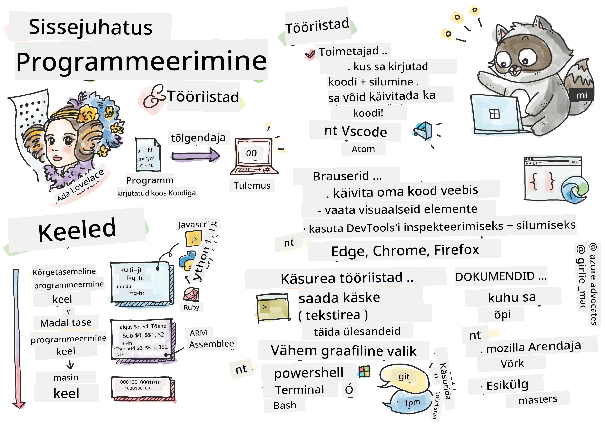
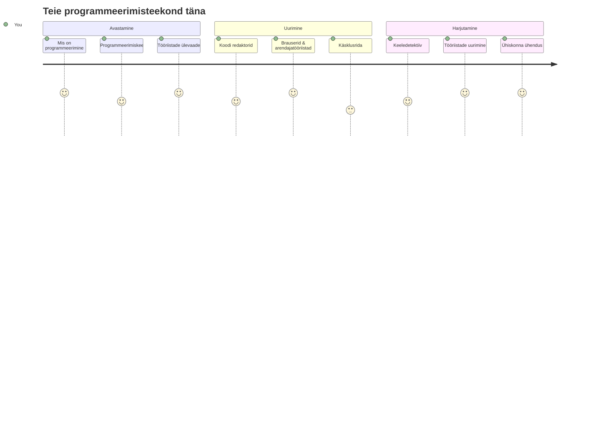
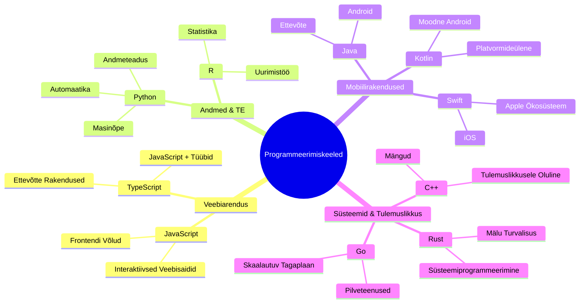
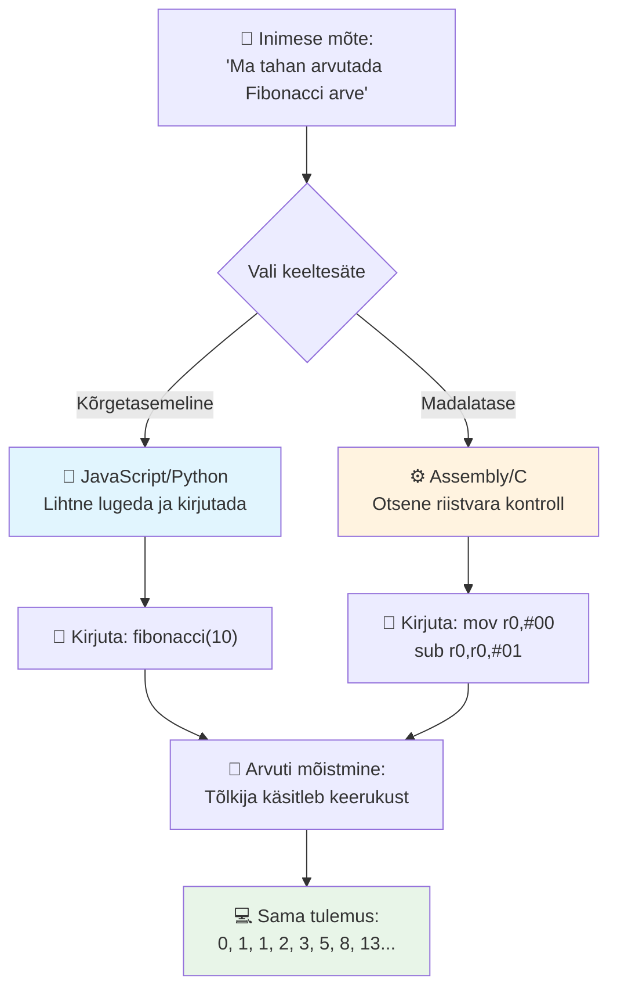
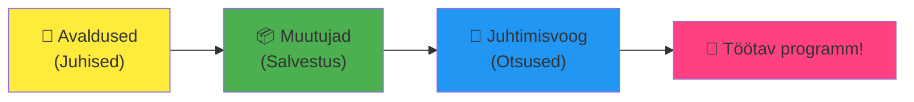
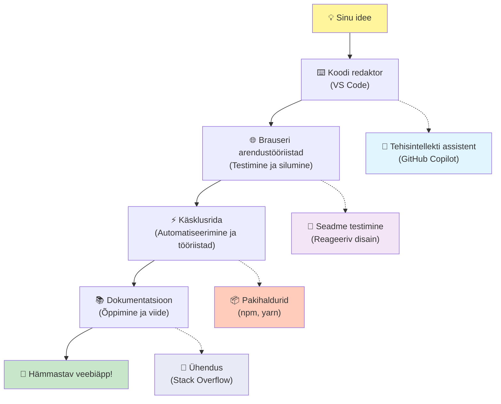
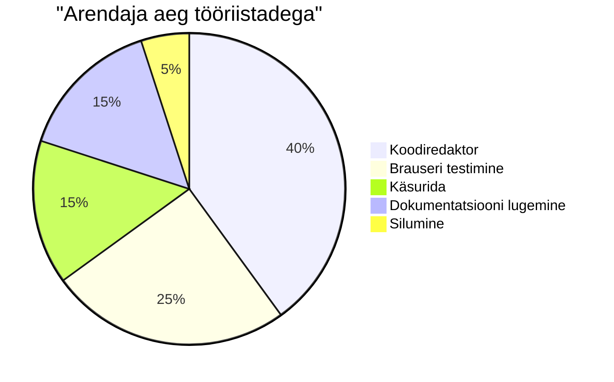
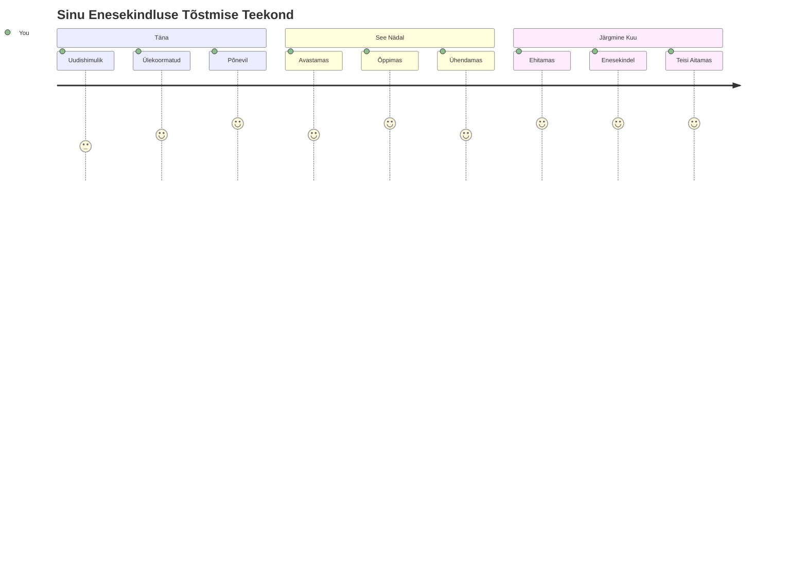

# Sissejuhatus programmeerimiskeeltesse ja kaasaegsetesse arendustööriistadesse
 
Tere, tulevane arendaja! 👋 Kas ma võin sulle midagi rääkida, mis paneb mind iga päev külmavärinaid saama? Sa oled peagi avastamas, et programmeerimine pole lihtsalt arvutite kohta – see on tõeliste supervõimete omandamine, et ellu viia oma metsikumaid ideid!

Sa tead seda hetke, kui kasutad oma lemmikrakendust ja kõik lihtsalt klapib täpselt? Kui vajutad nuppu ja midagi täiesti maagilist juhtub, mis paneb sind mõtlema „wow, kuidas nad SEDA tegid?” Noh, keegi täpselt nagu sina – tõenäoliselt istudes oma lemmikkohvikus kell 2 öösel oma kolmanda espresso kõrval – kirjutas selle võlu loova koodi. Ja siin on see, mis su mõistuse lööb: selle tunni lõpuks sa mitte ainult ei mõista, kuidas nad seda tegid, vaid sul on suur tahtmine seda ise proovida!

Kuula, ma saan täiesti aru, kui programmeerimine tundub praegu hirmutav. Kui ma alustasin, arvasin ausalt, et selleks peab olema mingi matemaatikageenius või olema koodinud alates viieaastasest. Aga siin on see, mis täielikult muutis mu perspektiivi: programmeerimine on täpselt nagu uue keele konversatsiooni õppimine. Sa hakkad öeldes „tere” ja „aitäh,” seejärel tellid kohvi, ja enne kui arvad, käid juba sügavaid filosoofilisi arutelusid! Ainult et siin vestled arvutitega ja ausalt? Nad on kõige kannatlikumad vestluskaaslased, kellega sul kunagi on vedanud – nad ei mõista kunagi su vigu hukka ja nad on alati elevil uuesti proovida!

Täna uurime uskumatuid tööriistu, mis muudavad kaasaegse veebiarenduse mitte ainult võimalikuks, vaid lausa sõltuvust tekitavaks. Ma räägin täpselt samadest redaktoritest, brauseritest ja töövoogudest, mida Netflixi, Spotify ja su lemmiku indie-rakenduste stuudio arendajad kasutavad iga päev. Ja siin on see osa, mis paneb sind rõõmust tantsima: enamus neist professionaalse taseme, tööstusstandarditega tööriistadest on täiesti tasuta!


> Sketchnote autorilt [Tomomi Imura](https://twitter.com/girlie_mac)


```mermaid
journey
    title Teie programmeerimisteekond täna
    section Avastamine
      Mis on programmeerimine: 5: You
      Programmeerimiskeeled: 4: You
      Tööriistade ülevaade: 5: You
    section Uurimine
      Koodi redaktorid: 4: You
      Brauserid & arendajatööriistad: 5: You
      Käsklusrida: 3: You
    section Harjutamine
      Keeledetektiiv: 4: You
      Tööriistade uurimine: 5: You
      Ühiskonna ühendus: 5: You
```
## Vaatame, mida sa juba tead!

Enne kui sukeldume põnevasse maailma, olen uudishimulik – mida sa juba tead sellest programmeerimise maailmast? Ja kuula, kui sa vaatad neid küsimusi ja mõtled „mul pole tegelikult õrna aimugi,” siis see pole mitte ainult okei, see on ideaalne! See tähendab, et oled täiesti õiges kohas. Mõtle sellele viktoriinile kui soojendusele enne trenni – me soojendame lihtsalt neid aju lihaseid!

[Osale eeltunnis viktoriinis](https://ff-quizzes.netlify.app/web/)


## Seiklus, millele me koos asume

Okei, ma olen tõeliselt elevil selle üle, mida me täna uurime! Tõsiselt, sooviksin näha su nägu, kui mõned neist mõistetest lõpuks klapivad. Siin on uskumatult põnev teekond, millele me koos asume:

- **Mis programmeerimine tegelikult on (ja miks see on kõige lahedam asi maailmas!)** – Avastame, kuidas kood on sõna otseses mõttes nähtamatu võlu, mis paneb kõike su ümber tööle, alates äratusest, mis kuidagi teab, et on esmaspäeva hommik, kuni algoritmini, mis täpselt kureerib su Netflixi soovitusi
- **Programmeerimiskeeled ja nende hämmastavad isiksused** – Kujuta ette, et sisened peole, kus igal inimesel on täiesti erinevad supervõimed ja probleemide lahendamise viisid. Selline on programmeerimiskeelte maailm ja sa armastad neid kohtuda!
- **Põhilised ehitusplokid, mis teevad digitaalse võlu võimalikuks** – Mõtle neile kui ülimale loomingulisele LEGO komplektile. Kui sa mõistad, kuidas need tükid kokku sobivad, märkad, et saad ehitada ükskõik mida, mida su kujutlusvõime unistab
- **Professionaalsed tööriistad, mis panevad sind tundma nagu oleksid just saanud võluri pulga kätte** – Ma pole draamategija – need tööriistad teevad sind tõesti tundma, nagu sul oleksid supervõimed, ja parim osa? Need on täpselt samad, mida kasutavad professionaalid!

> 💡 **Siin on asi**: Ära proovi kõike täna pähe õppida! Praegu tahan ainult, et tunneksid seda põnevuse sädet selle üle, mis on võimalik. Detailid jäävad loomulikult meelde, kui harjutame koos – nii toimub tõeline õppimine!

> Sa võid selle tunni teha ka [Microsoft Learn'is](https://learn.microsoft.com/en-us/learn/modules/web-development-101/introduction-programming/?WT.mc_id=academic-77807-sagibbon)!

## Niisiis, mis see *täpselt* programmeerimine on?

Okei, võtame käsile miljonidollari küsimuse: mis see programmeerimine päriselt on?

Ma räägin sulle loo, mis täielikult muutis minu arusaama sellest. Eelmisel nädalal proovisin selgitada oma emale, kuidas kasutada meie uut nutikat teleri puldit. Ma tabasin end ütlemast asju nagu „Vajuta punast nuppu, aga mitte suurt punast nuppu, väikest punast nuppu vasakul... ei, su teist vasakut... okei, hoia seda nüüd kaks sekundit, mitte üks, mitte kolm...” Kõlab tuttavalt? 😅

See ongi programmeerimine! See on kunst anda äärmiselt detailseid, samm-sammult juhiseid millelegi, mis on väga võimas, aga vajab kõike väga täpselt välja kirjutatuna. Ainult et selle asemel, et seletada emale (kes võis küsida „millise punase nupu?!“), seletad arvutile (kes lihtsalt teeb täpselt seda, mida sa ütled, isegi kui see pole päriselt see, mida sa mõtlesid).

Siin on see, mis mind raputas, kui ma selle asja esimest korda õppisin: arvutid on tegelikult väga lihtsad oma olemuselt. Nad mõistavad sõna otseses mõttes ainult kahte asja – 1 ja 0, mis on põhimõtteliselt „jah“ ja „ei“ või „sees“ ja „väljas“. See on kõik! Aga siin muutub see maagiliseks – me ei pea rääkima ainult 1-des ja 0-des nagu me oleksime Matrixis. Siin tulevad appi **programmeerimiskeeled**. Need on nagu maailma parim tõlk, kes võtab su täiesti normaalsed inimmõtted ja tõlgib need arvuti keelde.

Ja siin on see, mis paneb mind iga hommik ärgates ikka külmavärinaid saama: sõna otseses mõttes *kõik* digitaalne sinu elus algas kellegi täpselt nagu sina poolt, tõenäoliselt istudes oma pidžaamas kohvitassi kõrval ja toksides koodi sülearvutis. See Instagrami filter, mis paneb sind ideaalsena välja nägema? Keegi kirjutas selle koodi. Soovitus, mis viis sind sinu uue lemmiklauluni? Üks arendaja ehitas selle algoritmi. Rakendus, mis aitab sõpradega õhtusöögi arve jagada? Jep, keegi mõtles „see on tüütu, ma võiksin selle korda teha“ ja siis... ta tegigi!

Kui õpid programmeerima, ei omanda sa lihtsalt uut oskust – sa saad osaks sellest uskumatu probleemide lahendajate kogukonnast, kes veedavad oma päevi mõeldes: „Mis siis, kui ma looksin midagi, mis teeb kellegi päeva natuke paremaks?“ Ausõna, kas on midagi lahedamat kui see?

✅ **Lõbus faktihunt**: Siin on midagi väga lahedat, mida saad uurida, kui sul on vaba hetk – kes oli sinu arvates maailma esimene arvutiprogrammeerija? Ma annan sulle vihje: see ei pruugi olla see, keda sa ootad! Selle inimese lugu on tõeliselt põnev ja näitab, et programmeerimine on alati olnud loominguline probleemide lahendamine ja kastist välja mõtlemine.

### 🧠 **Peatus: Kuidas sa end tunned?**

**Võta hetk, et mõelda:**
- Kas idee „anda arvutile juhiseid“ on nüüd arusaadav?
- Kas suudad mõelda igapäevasele tegevusele, mida sooviksid programmeerimisega automatiseerida?
- Millised küsimused sul programmeerimisest praegu mõtteis keerlevad?

> **Mäleta**: On täiesti normaalne, kui mõned mõisted tunduvad praegu ähmased. Programmeerimist õppida on nagu uut keelt õppida – aju vajab aega, et luua närvivõrgustikke. Sa lähed väga hästi!

## Programmeerimiskeeled on nagu erinevad maagia maitsed

Okei, see kõlab veidralt, aga jää minuga – programmeerimiskeeled on väga sarnased muusika erinevate žanritega. Mõtle sellele: sul on džäss, mis on sujuv ja improviseeriv, rock, mis on võimas ja otsekohene, klassikaline, mis on elegantne ja struktureeritud, ning hip-hop, mis on loov ja väljendusrikas. Igal stiilil on oma tuju, oma kirglike fännide kogukond ja igaüks sobib erinevateks hetkeks ja meeleoludeks.

Programmeerimiskeeled toimivad täpselt samamoodi! Sa ei kasuta sama keelt lõbusa mobiilimängu ehitamiseks, mida kasutaksid tohutute kliimandmete arvutamiseks, just nagu sa ei mängiks death metal'i joogatunnis (noh, enamikes joogatundides kindlasti mitte! 😄).

Aga siin on see, mis mind iga kord täiesti mõistust võtab: need keeled on nagu kõige kannatlikumad ja geniaalsemad tõlkijad maailmas, kes istuvad su kõrval. Sa saad väljendada oma ideid viisil, mis tundub loomulik su inimmõistusele, ja nemad teevad kogu väga keeruka töö, et tõlkida see 1-ks ja 0-ks, mida arvutid tegelikult räägivad. See on nagu sõber, kes on täiuslikult kahe keele – „inimloovuse“ ja „arvutilogiika“ – valdamises, ja ta ei väsi kunagi, ei vaja kohvipause ega mõista sind hukka, kui küsid sama küsimust kaks korda!

### Populaarsed programmeerimiskeeled ja nende kasutusalad


```mermaid
mindmap
  root((Programmeerimiskeeled))
    Veebiarendus
      JavaScript
        Frontendi Võlud
        Interaktiivsed Veebisaidid
      TypeScript
        JavaScript + Tüübid
        Ettevõtte Rakendused
    Andmed & TE
      Python
        Andmeteadus
        Masinõpe
        Automaatika
      R
        Statistika
        Uurimistöö
    Mobiilirakendused
      Java
        Android
        Ettevõte
      Swift
        iOS
        Apple Ökosüsteem
      Kotlin
        Moodne Android
        Platvormideülene
    Süsteemid & Tulemuslikkus
      C++
        Mängud
        Tulemuslikkusele Oluline
      Rust
        Mälu Turvalisus
        Süsteemiprogrammeerimine
      Go
        Pilveteenused
        Skaalautuv Tagaplaan
```
| Keel | Parim kasutusala | Miks see on populaarne |
|----------|----------|------------------|
| **JavaScript** | Veebiarendus, kasutajaliidesed | Jookseb brauserites ja paneb tööle interaktiivsed veebilehed |
| **Python** | Andmeteadus, automaatika, tehisintellekt | Lihtne lugeda ja õppida, võimsad teegid |
| **Java** | Ettevõtte rakendused, Androidi rakendused | Platvormiülene, tugev suurtele süsteemidele |
| **C#** | Windowsi rakendused, mänguarendus | Tugev Microsofti ökosüsteemi tugi |
| **Go** | Pilveteenused, tagapõhjasüsteemid | Kiire, lihtne, loodud kaasaegseks arvutamiseks |

### Kõrgtaseme vs madalatasemel keeled

Okei, see oli ausalt see mõiste, mis mu aju murdis, kui ma õppima hakkasin, nii et jagan analoogiat, mis lõpuks mu jaoks kõik klappis – ja loodan väga, et see aitab ka sind!

Kujuta ette, et sa oled riigis, kus sa keelt ei räägi ja sul on väga kiireks vaja leida lähim tualett (me oleme kõik seda kogenud, eks? 😅):

- **Madalatasemeline programmeerimine** on nagu õppida nii hästi kohaliku murret, et saad vestelda vanaemaga, kes müüb nurgatänaval puuvilju, kasutades kultuuriviiteid, kohalikku slängi ja nali, mida mõistaks vaid keegi, kes seal kasvas. Väga muljetavaldav ja äärmiselt tõhus... kui sul kogemusi on! Aga üsna üle jõu käiv, kui sa lihtsalt püüad tualetti leida.

- **Kõrgtaseme programmeerimine** on nagu see hämmastav kohalik sõber, kes lihtsalt saab su mõttest aru. Sa ütled otse inglise keeles „Ma tõesti pean tualetti leidma“ ja tema teeb kogu kultuurilise tõlke ning annab sulle juhised viisil, mis mõistab su mitte-kohalik aju täielikult.

Programmeerimise keeles:
- **Madalatasemel keeled** (nagu Assembly või C) lubavad sul arutada väga detailsetel teemadel arvuti riistvaraga, aga sa pead mõtlema nagu masin, mis on... no öelgem nii, et see on suur vaimne hüpe!
- **Kõrgtasemel keeled** (nagu JavaScript, Python või C#) lubavad sul mõelda nagu inimene, samal ajal kui nad teevad kogu masinakeele taga töötleva töö. Pealegi on neil imelised toetavad kogukonnad täis inimesi, kes mäletavad, mida tähendab olla algaja ja kes tõesti tahavad aidata!

Aru saad, milliseid ma soovitan alustada? 😉 Kõrgtasemel keeled on nagu treeningratastega jalgratas, mida sa tegelikult ei taha kunagi eemaldada, sest need muudavad kogu kogemuse nii mõnusaks!


```mermaid
flowchart TB
    A["👤 Inimese mõte:<br/>'Ma tahan arvutada Fibonacci arve'"] --> B{Vali keeltesäte}
    
    B -->|Kõrgetasemeline| C["🌟 JavaScript/Python<br/>Lihtne lugeda ja kirjutada"]
    B -->|Madalatase| D["⚙️ Assembly/C<br/>Otsene riistvara kontroll"]
    
    C --> E["📝 Kirjuta: fibonacci(10)"]
    D --> F["📝 Kirjuta: mov r0,#00<br/>sub r0,r0,#01"]
    
    E --> G["🤖 Arvuti mõistmine:<br/>Tõlkija käsitleb keerukust"]
    F --> G
    
    G --> H["💻 Sama tulemus:<br/>0, 1, 1, 2, 3, 5, 8, 13..."]
    
    style C fill:#e1f5fe
    style D fill:#fff3e0
    style H fill:#e8f5e8
```
### Näitan sulle, miks kõrgtasemel keeled on palju sõbralikumad

Okei, ma näitan sulle midagi, mis täiesti demonstreerib, miks ma armusin kõrgtaseme keeltesse, aga kõigepealt – ma tahan, et lubaksid mulle üht asja. Kui sa näed esimest koodinäidet, ära pabista! See peabki esialgu tunduma hirmutav. Täpselt selle peale ma rõhutan!

Vaatame täpselt sama ülesannet, mis on kirjutatud kahel täiesti erineval moel. Mõlemad loovad Fibonacci jada – see on ilus matemaatiline muster, kus iga number on kahe eelneva summa: 0, 1, 1, 2, 3, 5, 8, 13... (Lõbus fakt: seda mustrit leiad sõna otseses mõttes kõikjalt loodusest – päevalille seemnete spiraalid, männikäbide mustrid, isegi galaktikate moodustumine!)

Valmis erinevust nägema? Lähme!

**Kõrgtasemel keel (JavaScript) – Inimeste-sõbralik:**

```javascript
// Samm 1: Põhiline Fibonacci seadistus
const fibonacciCount = 10;
let current = 0;
let next = 1;

console.log('Fibonacci sequence:');
```

**See kood teeb järgnevat:**
- **Deklaratsioonib** konstanti, et määratleda, kui palju Fibonacci numbreid tahame genereerida
- **Algatab** kaks muutujat, et jälgida järjestuse praegust ja järgmist numbrit
- **Seab** algväärtused (0 ja 1), mis defineerivad Fibonacci mustri
- **Kuvab** pealkirja sõnumi väljundi identifitseerimiseks

```javascript
// Samm 2: Järjestuse genereerimine tsükliga
for (let i = 0; i < fibonacciCount; i++) {
  console.log(`Position ${i + 1}: ${current}`);
  
  // Arvuta järgmine arv jadas
  const sum = current + next;
  current = next;
  next = sum;
}
```

**Mis siin toimub:**
- **Tsüklitame** järjestuse kõiki positsioone kasutades `for` tsüklit
- **Kuvame** iga numbri koos asukohaga, kasutades mallstringe
- **Arvutame** järgmise Fibonacci numbri praeguse ja järgmise summa abil
- **Uuendame** jälgivaid muutujaid, et liikuda järgmise iteratsiooni juurde

```javascript
// 3. samm: Moodne funktsionaalne lähenemine
const generateFibonacci = (count) => {
  const sequence = [0, 1];
  
  for (let i = 2; i < count; i++) {
    sequence[i] = sequence[i - 1] + sequence[i - 2];
  }
  
  return sequence;
};

// Kasutusnäide
const fibSequence = generateFibonacci(10);
console.log(fibSequence);
```

**Ülal oleme:**
- **Loomis** taaskasutatavat funktsiooni, kasutades kaasaegset noolefunktsiooni süntaksit
- **Ehitanud** massiivi, mis salvestab kogu jadana selle asemel, et kuvada ükshaaval
- **Kasutanud** massiivi indeksit, et arvutada iga uus arv eelnevate põhjal
- **Tagastanud** kogu jada, et seda saaks paindlikult kasutada programmis muudes osades

**Madalatasemeline keel (ARM Assembly) – Arvuti-sõbralik:**

```assembly
 area ascen,code,readonly
 entry
 code32
 adr r0,thumb+1
 bx r0
 code16
thumb
 mov r0,#00
 sub r0,r0,#01
 mov r1,#01
 mov r4,#10
 ldr r2,=0x40000000
back add r0,r1
 str r0,[r2]
 add r2,#04
 mov r3,r0
 mov r0,r1
 mov r1,r3
 sub r4,#01
 cmp r4,#00
 bne back
 end
```

Tähtis märgata, kuidas JavaScripti versioon loeb peaaegu nagu ingliskeelsed juhised, samas kui Assembly versioon kasutab krüptilisi käske, mis juhivad otse arvuti protsessorit. Mõlemad täidavad täpselt sama ülesande, kuid kõrgtasemel keel on inimestele palju kergemini mõistetav, kirjutatav ja hooldatav.

**Peamised erinevused, mida märkad:**
- **Lugemisvõime**: JavaScript kasutab kirjeldavaid nimesid nagu `fibonacciCount`, samal ajal kui Assembly kasutab krüptilisi silte nagu `r0`, `r1`
- **Kommentaarid**: Kõrgtasemel keeltes julgustatakse seletavaid kommentaare, mis muudavad koodi isedokumenteerivaks
- **Struktuur**: JavaScripti loogiline voog järgib seda, kuidas inimesed mõtlevad probleemide peale samm-sammult
- **Hooldus**: JavaScripti versiooni uuendamine erinevate nõudmiste jaoks on lihtne ja selge

✅ **Fibonacci jada kohta**: See tõeliselt kaunis numbrimuster (kus iga number on kahe eelneva summa: 0, 1, 1, 2, 3, 5, 8...) esineb sõna otseses mõttes *kõigis* looduses! Leiad seda päevalille keeristes, männikäbide mustrites, nutilusete kooriku kumeruses ja isegi puuharude kasvus. On üsna hämmastav, kuidas matemaatika ja kood aitavad meil mõista ja taastoota mustreid, mida loodus kasutab ilu loomisel!


## Ehitusplokid, mis teevad maagia võimalikuks

Ok, nüüd, kui oled näinud, kuidas programmeerimiskeeled toimivad praktikas, vaatame põhiosasid, mis moodustavad sõna otseses mõttes iga kirjutatud programmi. Mõtle neile kui olulistele koostisosadele sinu lemmikretseptis – kui sa mõistad, mida igaüks teeb, suudad lugeda ja kirjutada koodi peaaegu igas keeles!

See on veidi nagu programmeerimise grammatika õppimine. Mäletad koolist, kui õppisid nimisõnu, tegusõnu ja kuidas lauseid kokku panna? Programmeerimisel on oma grammatika versioon, ja ausalt öeldes on see palju loogilisem ja andestavam kui inglise keele grammatika kunagi oli! 😄

### Avaldused: Juhised samm-sammult

Alustame **avaldustest** – need on nagu üksikud laused vestluses arvutiga. Iga avaldus käsib arvutil teha üht konkreetset asja, nagu juhiste andmine: "Pööra siin vasakule," "Peatu punase tule juures," "Parki sinna kohta."

Mulle meeldib avalduste puhul eriti see, kui loetavad nad tavaliselt on. Vaata seda:

```javascript
// Põhilised avaldused, mis teevad ühe toimingu
const userName = "Alex";                    
console.log("Hello, world!");              
const sum = 5 + 3;                         
```

**Mis see kood teeb:**
- **Deklareerib** konstantsena muutuja, kuhu salvestatakse kasutaja nimi
- ** Kuvab** tervitussõnumi konsoolil
- **Arvutab** ja salvestab matemaatilise operatsiooni tulemuse

```javascript
// Avaldused, mis suhtlevad veebilehtedega
document.title = "My Awesome Website";      
document.body.style.backgroundColor = "lightblue";
```

**Samm-sammult, mis toimub:**
- **Muudab** veebilehe tiitlit, mis kuvatakse brauseri vahekaardil
- **Muutab** kogu lehe keha taustavärvi

### Muutujad: Sinu programmi mälu süsteem

Olgu, **muutujad** on ausalt öeldes üks minu lemmikkontseptsioone õpetada, sest need on väga sarnased asjadele, mida sa kasutad iga päev!

Mõtle hetkeks oma telefoni kontaktidele. Sa ei õpi kõigi numbreid pähe – selle asemel salvestad "Ema," "Parim sõber" või "Pizzakoht, mis toob kuni kella 2-ni" ja las telefon mäletab tegelikke numbreid. Muutujad töötavad täpselt samamoodi! Need on nagu sildistatud anumad, kuhu su programm saab salvestada informatsiooni ja hiljem seda nime abil hõlpsalt leida.

Siin on see tõeliselt lahe: muutujad võivad programmi jooksu ajal muutuda (seetõttu nimi "muutuja" – näed, mis nad tegid?). Nagu sa võid uuendada pizzakoha kontakti, kui avastad mõne veel parema, võivad muutujad muutuda, kui su programm saab uut teavet või olukord muutub!

Las ma näitan, kui ilusasti lihtne see võib olla:

```javascript
// 1. samm: Põhiliste muutujate loomine
const siteName = "Weather Dashboard";        
let currentWeather = "sunny";               
let temperature = 75;                       
let isRaining = false;                      
```

**Nende mõistete mõistmine:**
- **Salvesta** muutumatud väärtused `const` muutujatesse (näiteks saidi nimi)
- **Kasuta** `let` väärtuste jaoks, mis võivad programmi jooksul muutuda
- **Määra** erinevaid andmetüüpe: stringid (tekst), numbrid ja booleanid (true/false)
- **Vali** kirjeldavad nimed, mis selgitavad, mida iga muutuja sisaldab

```javascript
// Samm 2: Objektidega töötamine seotud andmete rühmitamiseks
const weatherData = {                       
  location: "San Francisco",
  humidity: 65,
  windSpeed: 12
};
```

**Ülal oleme:**
- **Loonud** objekti, mis grupeerib seotud ilmastikuinfo kokku
- **Korraldanud** mitu andmeosist ühe muutuja nime alla
- **Kasutanud** võtme-väärtuse paare, et selgelt sildistada iga info osa

```javascript
// Samm 3: Muutujate kasutamine ja uuendamine
console.log(`${siteName}: Today is ${currentWeather} and ${temperature}°F`);
console.log(`Wind speed: ${weatherData.windSpeed} mph`);

// Muutuvate muutujate uuendamine
currentWeather = "cloudy";                  
temperature = 68;                          
```

**Selgitame iga osa:**
- **Kuva** infot mallimustritega `${}` süntaksis
- **Juurdu pääsema** objekti omadustele punksümboli (`weatherData.windSpeed`) abil
- **Uuenda** `let`-iga deklareeritud muutujaid, et kajastada muutuvaid tingimusi
- **Kombineeri** mitut muutujat tähenduslike sõnumite loomiseks

```javascript
// Samm 4: Moodne destruktureerimine puhtama koodi jaoks
const { location, humidity } = weatherData; 
console.log(`${location} humidity: ${humidity}%`);
```

**Mida pead teadma:**
- **Eralda** objekti omadusi, kasutades destruktureerivat määramist
- **Loo** automaatselt uusi muutujaid samade nimedega nagu objekti võtmed
- **Lihtsusta** koodi vältides korduvat punksümboli kasutamist

### Kontrollvoog: Õpi oma programm mõtlema

Ok, siin muutub programmeerimine täiesti vapustavaks! **Kontrollvoog** tähendabki õpetamist sinu programmile, kuidas teha nutikaid otsuseid, täpselt nii nagu sina seda iga päev ilma mõtlemata teed.

Kujutle: täna hommikul läksid läbi midagi sellist nagu "Kui sajab, võtan vihmavarju. Kui on külm, panen jope selga. Kui hilinen, jätan hommikusöögi vahele ja võtan kohvi teel." Su aju järgib loogikat "kui-siis" tosinatel kordadel päevas!

See on põhjus, miks programmid tunduvad targad ja elavad, mitte lihtsalt jälgivad igavat, etteaimatavat stsenaariumi. Nad saavad olukorda analüüsida, hinnata toimuvat ja vastata sobivalt. See on nagu anda sinu programmile aju, mis kohaneb ja teeb valikuid!

Tahad näha, kuidas see kenasti töötab? Näitan sulle:

```javascript
// Samm 1: Põhiline tingimusloogika
const userAge = 17;

if (userAge >= 18) {
  console.log("You can vote!");
} else {
  const yearsToWait = 18 - userAge;
  console.log(`You'll be able to vote in ${yearsToWait} year(s).`);
}
```

**Mis see kood teeb:**
- **Kontrollib**, kas kasutaja vanus vastab hääleõigus nõudele
- **Täidab** erinevaid koodiplokke tingimuse tulemusel
- **Arvutab** ja kuvab, kui kaua veel hääletamisõigust oodata, kui alla 18
- **Annab** konkreetse ja abistava tagasiside igaks juhtumiks

```javascript
// 2. samm: Mitmed tingimused koos loogikaliste operaatoritega
const userAge = 17;
const hasPermission = true;

if (userAge >= 18 && hasPermission) {
  console.log("Access granted: You can enter the venue.");
} else if (userAge >= 16) {
  console.log("You need parent permission to enter.");
} else {
  console.log("Sorry, you must be at least 16 years old.");
}
```

**Siin tehakse järgmised asjad:**
- **Kombineeritakse** mitmeid tingimusi `&&` (ja) operaatoriga
- **Luuakse** tingimuste hierarhia `else if` abil mitme stsenaariumi jaoks
- **Käsitletakse** kõiki võimalikke juhtumeid lõpliku `else` lausungi abil
- **Antakse** iga erineva situatsiooni puhul selge ja tegevusele suunatud tagasiside

```javascript
// Samm 3: Lühendatud tingimus kolmikoperaatoriga
const votingStatus = userAge >= 18 ? "Can vote" : "Cannot vote yet";
console.log(`Status: ${votingStatus}`);
```

**Mida pead meeles pidama:**
- **Kasuta** ternaarset operaatorit (`? :`) lihtsate kahe valikuga tingimuste jaoks
- **Kirjuta** kõigepealt tingimus, siis `?`, pärast tõene tulemus, siis `:`, lõpuks väär tulemus
- **Rakenda** seda mustrit siis, kui pead tingimustest sõltuvalt väärtusi määrama

```javascript
// Samm 4: Mitme konkreetse juhtumi käsitlemine
const dayOfWeek = "Tuesday";

switch (dayOfWeek) {
  case "Monday":
  case "Tuesday":
  case "Wednesday":
  case "Thursday":
  case "Friday":
    console.log("It's a weekday - time to work!");
    break;
  case "Saturday":
  case "Sunday":
    console.log("It's the weekend - time to relax!");
    break;
  default:
    console.log("Invalid day of the week");
}
```

**See kood teeb järgmist:**
- **Võrdleb** muutuja väärtust mitme spetsiifilise juhtumiga
- **Grupib** sarnased juhtumid (nädalapäevad vs nädalavahetused)
- **Täidab** sobiva koodiploki, kui sobiv juhtum on leitud
- **Lisa-** `default` juhtum ootamatute väärtuste jaoks
- **Kasuta** `break` lauseid, et takistada järgmise juhtumi täidet-

> 💡 **Tegeliku elu näide**: Mõtle kontrollvoogu kui kõige kannatlikumale GPS-ile, mis annab sulle juhiseid. See võib öelda "Kui Main Streetil on ummik, võta kiirtee. Kui kiirteed blokeerib ehitus, proovi kaunist marsruuti." Programmid kasutavad täpselt sellist tingimusloogikat, et nutikalt erinevatele olukordadele vastata ja alati kasutajale parima kogemuse pakkuda.

### 🎯 **Konseptsiooni kontroll: Ehitusplokkide valdamine**

**Vaatame, kuidas sul fundamentaalides läheb:**
- Kas suudad omasõnades selgitada muutujate ja avalduste vahet?
- Mõtle reaalsele olukorrale, kus kasutaksid if-siis otsust (nagu meie hääletamise näites)
- Mis üllatas sind programmeerimisloogika juures kõige rohkem?

**Kiire enesekindluse tõstja:**

```mermaid
flowchart LR
    A["📝 Avaldused<br/>(Juhised)"] --> B["📦 Muutujad<br/>(Salvestus)"] --> C["🔀 Juhtimisvoog<br/>(Otsused)"] --> D["🎉 Töötav programm!"]
    
    style A fill:#ffeb3b
    style B fill:#4caf50
    style C fill:#2196f3
    style D fill:#ff4081
```
✅ **Mis järgmiseks tuleb**: Meil on ees tõeliselt lõbus sukelduda sügavamale neisse kontseptsioonidesse, jätkates seda uskumatut teekonda koos! Praegu keskendu lihtsalt sellele põnevusele kõigi nende imeliste võimaluste ees. Spetsiifilised oskused ja tehnikad tulevad loomulikult, kui harjutame koos – luban, et see saab olema palju lõbusam, kui oskad oodata!

## Tööriistad tööstuses

Ok, ausalt öeldes tunnen end sellepärast nii elevil, et vaevalt suudan ennast tagasi hoida! 🚀 Räägime uskumatuist tööriistadest, mis panevad sind tundma, et oled just saanud käepidemed digitaalsele kosmoselaevale.

Sa tead, kuidas kokal on need ideaalselt tasakaalustatud noad, mis tunduvad osana tema kätest? Või kuidas muusikul on see üks kitarr, mis hakkab laulma kohe, kui ta seda puudutab? Arendajatel on meie enda versioon neist maagilistest tööriistadest ja siin on see, mis su vaimu täiesti raputab – enamik neist on täiesti tasuta!

Praktiliselt hüppan tugitoolis, mõeldes, et jagan neid sinuga, sest need on täielikult revolutsioonistanud, kuidas me tarkvara ehitame. Räägime AI-toega koodiassistentidest, mis aitavad sinu koodi kirjutada (ja ma ei naljaga tee!), pilvekeskkondadest, kus saad ehitada äppe sõna otseses mõttes kõikjalt Wi-Fi abil, ning silumise tööriistadest, mis on nii arenenud, nagu oleksid saanud oma programmide jaoks röntgenivisioni.

Ja siin on see osa, mis jätab mind külmavärinate sisse: need ei ole "algajate tööriistad", mida sa kunagi välja kasvatad. Need on samad professionaalse taseme tööriistad, mida kasutavad Google’i, Netflix’i ja selle indie-äpi stuudio arendajad just praegu. Sa tunned end sellise professionaalina, kui neid kasutad!


```mermaid
graph TD
    A["💡 Sinu idee"] --> B["⌨️ Koodi redaktor<br/>(VS Code)"] 
    B --> C["🌐 Brauseri arendustööriistad<br/>(Testimine ja silumine)"]
    C --> D["⚡ Käsklusrida<br/>(Automatiseerimine ja tööriistad)"]
    D --> E["📚 Dokumentatsioon<br/>(Õppimine ja viide)"]
    E --> F["🚀 Hämmastav veebiäpp!"]
    
    B -.-> G["🤖 Tehisintellekti assistent<br/>(GitHub Copilot)"]
    C -.-> H["📱 Seadme testimine<br/>(Reageeriv disain)"]
    D -.-> I["📦 Pakihaldurid<br/>(npm, yarn)"]
    E -.-> J["👥 Ühendus<br/>(Stack Overflow)"]
    
    style A fill:#fff59d
    style F fill:#c8e6c9
    style G fill:#e1f5fe
    style H fill:#f3e5f5
    style I fill:#ffccbc
    style J fill:#e8eaf6
```
### Koodi redaktorid ja IDEd: Sinu uued digitaalsed parimad sõbrad

Räägime koodi redaktoritest – need saavad tõesti sinu uueks lemmikkohtadeks, kus aega veeta! Mõtle neile kui oma isiklikule koodi pühamukohale, kus veedad suurema osa ajast digitaalsete loomingute meisterdamisel ja lihvimisel.

Aga siin on see, mis on moodsa redaktori puhul tõeliselt maagiline: nad ei ole lihtsalt uhked tekstiredaktorid. Nad on nagu kõige geniaalsem, toetavam koodi mentor, kes istub sinu kõrval 24/7. Nad tabavad trükivead enne, kui ise märkad, pakuvad täiustusi, mis panevad sind geniaalseks tundma, aitavad mõista, mida iga koodiosa teeb, ja mõned suudavad isegi ära arvata, mida kavatset ra kirjutada ja pakkuda mõtteid lõpetada!

Mäletan, kui avastasin esmakordselt automaatse täitmise – ma tundsin end elavat tulevikus. Sa alustad midagi kirjutama ja su redaktor ütleb: "Hei, kas sa mõtlesid sellele funktsioonile, mis teeb täpselt seda, mida vajad?" See on nagu mõtte lugeja oleks sinu koodi sõber!

**Mis teeb need redaktorid nii hämmastavaks?**

Moodsaid koodi redaktoreid iseloomustavad muljetavaldavad funktsioonid, mis tõstavad su tootlikkust:

| Funktsioon | Mida see teeb | Miks see aitab |
|------------|---------------|----------------|
| **Süntaksi esiletõstmine** | Värvib koodi erinevad osad | Muudab koodi kergemini loetavaks ja vead nähtavaks |
| **Automaatne täitmine** | Pakub koodi kirjutamisel soovitusi | Kiirendab kirjutamist ja vähendab trükivigu |
| **Silumisvahendid** | Aitab leida ja parandada vigu | Säästab tunde tõrkeotsingut |
| **Pikendused** | Lisavad spetsiaalseid funktsioone | Kohanda redaktorit mis tahes tehnoloogia jaoks |
| **AI assistendid** | Pakuvad koodi ja seletusi | Kiirendab õppimist ja töö efektiivsust |

> 🎥 **Videoresurss**: Tahad näha neid tööriistu tegevuses? Vaata seda [Tools of the Trade video](https://youtube.com/watch?v=69WJeXGBdxg) põhjalikku ülevaadet.

#### Soovitatud redaktorid veebiarenduseks

**[Visual Studio Code](https://code.visualstudio.com/?WT.mc_id=academic-77807-sagibbon)** (tasuta)
- Kõige populaarsem veebiarendajate seas
- Suurepärane pikendustepood
- Sisseehitatud terminal ja Git integratsioon
- **Peamised lisad**:
  - [GitHub Copilot](https://marketplace.visualstudio.com/items?itemName=GitHub.copilot) - AI-toega koodisoovitused
  - [Live Share](https://marketplace.visualstudio.com/items?itemName=MS-vsliveshare.vsliveshare) - Reaalajas koostöö
  - [Prettier](https://marketplace.visualstudio.com/items?itemName=esbenp.prettier-vscode) - Automaatne koodi vormindamine
  - [Code Spell Checker](https://marketplace.visualstudio.com/items?itemName=streetsidesoftware.code-spell-checker) - Koodis trükivigade leidmine

**[JetBrains WebStorm](https://www.jetbrains.com/webstorm/)** (tasuline, tudengitele tasuta)
- Täiustatud silumis- ja testimisvahendid
- Intelligentsed koodi lõpetamise võimalused
- Sisseehitatud versioonihaldus

**Pilvepõhised IDEd** (erinevad hinnad)
- [GitHub Codespaces](https://github.com/features/codespaces) - Täielik VS Code otse brauseris
- [Replit](https://replit.com/) - Suurepärane õppimiseks ja koodi jagamiseks
- [StackBlitz](https://stackblitz.com/) - Kohene täispaketti veebiarendus

> 💡 **Alguse soovitus**: Alusta Visual Studio Code’ga – see on tasuta, laialt tööstuses kasutatav ja omab tohutut kogukonda, kes loob abistavaid õpetusi ja lisasid.


### Veebibrauserid: Sinu salajane arenduslabor

Olgu, valmista end täielikuks vaimustusks! Sa tead, et oled kasutanud brausereid sotsiaalmeedias sirvimiseks ja videote vaatamiseks? Selgub, et nad on kogu selle aja varjanud seda imelist salajast arenduslaborit, mis ootab, et sa selle avastaksid!

Iga kord, kui sa paremklõpsad veebilehel ja valid "Inspect Element", avad endale arendajate tööriistade varjatud maailma, mis on ausalt öeldes võimsamad kui mõni kallis tarkvara, mille eest ma varem sadu dollareid maksisn. See on nagu avastada, et sinu tavaline köök on peitnud professionaalse koka labori salajase paneeli taha!
Esimest korda, kui keegi mulle brauseri DevTools'i näitas, veetsin ma umbes kolm tundi lihtsalt ringi klikkides ja öeldes „OOTA, KAS TA OSKAB KA SEDA?!“ Sa saad reaalselt igat veebilehte otse muuta, näha täpselt, kui kiiresti kõik laadib, testida, kuidas su sait erinevates seadmetes välja näeb, ja isegi JavaScripti nagu tõeline proff siluda. See on täiesti hämmastav!

**Siin on, miks brauserid on su salarelv:**

Kui sa lood veebilehte või veebiäppi, pead nägema, kuidas see reaalses maailmas välja näeb ja käitub. Brauserid ei näita mitte ainult su tööd, vaid annavad ka põhjalikku tagasisidet jõudluse, ligipääsetavuse ja võimalike probleemide kohta.

#### Brauseri arendustööriistad (DevTools)

Tänapäeva brauserid sisaldavad põhjalikke arendusvahendite komplekte:

| Tööriista kategooria | Mida see teeb | Näidiskasutus |
|----------------------|---------------|---------------|
| **Elementide inspekteerija** | Vaata ja muuda HTML/CSS reaalajas | Kohanda stiili, et näha koheseid tulemusi |
| **Konsol** | Vaata veateateid ja testi JavaScripti | Silu probleeme ja katseta koodiga |
| **Võrgu jälgija** | Jälgi ressursside laadimist | Optimeeri jõudlust ja laadimisaegu |
| **Ligipääsetavuse kontrollija** | Testi kaasava disaini põhimõtteid | Veendu, et su sait töötab kõigile kasutajatele |
| **Seadmesimulaator** | Eelvaade erinevate ekraanisuuruste peal | Testi reageerivat disaini ilma mitme seadmeta |

#### Soovitatud brauserid arenduseks

- **[Chrome](https://developers.google.com/web/tools/chrome-devtools/)** – tööstusstandard DevTools koos põhjaliku dokumentatsiooniga
- **[Firefox](https://developer.mozilla.org/docs/Tools)** – suurepärased CSS Gridi ja ligipääsetavuse tööriistad
- **[Edge](https://docs.microsoft.com/microsoft-edge/devtools-guide-chromium/?WT.mc_id=academic-77807-sagibbon)** – ehitatud Chromiumile koos Microsofti arendajate ressurssidega

> ⚠️ **Tähtis testimisnipp**: Testi alati oma veebisaite mitmes brauseris! See, mis töötab ideaalselt Chrome'is, võib Safaris või Firefoxis välja näha teistmoodi. Professionaalsed arendajad testivad kõigis suuremates brauserites, et tagada kasutajakogemuse järjepidevus.


### Käsurea tööriistad: sinu sissepääs arendaja supervõimetesse

Olgu, olgem nüüd täiesti ausad käsurea suhtes, sest tahan, et sa kuulaksid seda inimeselt, kellel on sellest tõesti arusaamine. Kui ma seda esimest korda nägin – lihtsalt see hirmutav musta taustaga, vilkuva tekstiga ekraan – siis mõtlesin sõna otseses mõttes: „Ei, absoluutselt mitte! See näeb välja nagu midagi 1980. aastate häkkerifilmist, ja ma pole kindlasti piisavalt tark selle jaoks!“ 😅

Aga siin on see, mida ma soovin, et keegi oleks mulle tol ajal öelnud ja mida ma räägin sulle praegu: käsurida pole hirmuäratav – see on tegelikult nagu otsepöördumine oma arvutiga. Mõtle sellele kui vahe Eesti moodsate toidu tellimise äppide pildi- ja menüüvalikute (mis on mõnus ja lihtne) ning su lemmik kohaliku restorani kõndimise vahele, kus kokk teab täpselt, mida sa armastad, ja suudab valmistada midagi perfektselt ainult sinu sõnadega „üllata mind millegagi imelisega.“

Käsurida on koht, kuhu arendajad lähevad, et tunda end tõeliste võluritena. Sa kirjutad mõned näiliselt maagilised sõnad (okei, need on lihtsalt käsud, aga need tunduvad maagilised!), vajutad enterit ja BOOM – oled loonud terve projekti struktuuri, installinud võimsaid tööriistu üle maailma või deployinud oma äpi internetti miljonite nägemiseks. Kui sa saad sellest võimust esimest korda maitse suhu, siis see on ausalt öeldes väga sõltuvust tekitav!

**Miks käsurida saab sinu lemmiktööriistaks:**

Kuigi graafilised kasutajaliidesed sobivad paljude ülesannete jaoks hästi, on käsurida ülim automaatika, täpsuse ja kiiruse osas. Paljud arendustööriistad töötavad peamiselt käsurea kaudu ja nende efektiivne kasutamine võib oluliselt tõsta su tootlikkust.

```bash
# Samm 1: Loo ja liigu projekti kataloogi
mkdir my-awesome-website
cd my-awesome-website
```

**Mida see kood teeb:**
- **Loo** uus kaust nimega „my-awesome-website“ su projekti jaoks
- **Liigu** loodud kausta, et alustada tööd

```bash
# Samm 2: Algata projekt failiga package.json
npm init -y

# Paigalda kaasaegsed arendustööriistad
npm install --save-dev vite prettier eslint
npm install --save-dev @eslint/js
```

**Samm-sammult toimub järgmist:**
- **Algatamine** uuest Node.js projektist vaikeseadetega kasutades `npm init -y`
- **Installimine** Vite moodsa build-tööriistana kiireks arenduseks ja toodanguks
- **Lisamine** Prettier automaatseks koodi vormindamiseks ja ESLint koodi kvaliteedi kontrollimiseks
- **Kasutamine** `--save-dev` lipuga, et märkida need ainult arendamise sõltuvustena

```bash
# 3. samm: Loo projekti struktuur ja failid
mkdir src assets
echo '<!DOCTYPE html><html><head><title>My Site</title></head><body><h1>Hello World</h1></body></html>' > index.html

# Käivita arendusserver
npx vite
```

**Ülaltoodud toimingutes:**
- **Korraldasime** oma projekti, luues eraldi kaustad lähtekoodile ja varadele
- **Genereerisime** lihtsa HTML faili õige dokumendi struktuuriga
- **Käivitame** Vite arendusteenuse live reload’i ja hot module replacement’iga

#### Olulised käsurea tööriistad veebiarenduses

| Tööriist | Eesmärk | Miks sul seda vaja on |
|----------|---------|-----------------------|
| **[Git](https://git-scm.com/)** | Versioonihaldus | Jälgi muudatusi, tee koostööd, varunda oma tööd |
| **[Node.js & npm](https://nodejs.org/)** | JavaScripti runtime & pakendihaldus | Käivita JavaScript brauseri väliselt, installi moodsad arendustööriistad |
| **[Vite](https://vitejs.dev/)** | Build-tööriist ja arendusserver | Välkkiire arendus koos kuuma mooduli asendusega |
| **[ESLint](https://eslint.org/)** | Koodi kvaliteet | Leia ja paranda automaatselt JavaScripti probleemid |
| **[Prettier](https://prettier.io/)** | Koodi vormindamine | Hoia oma kood ühtlaselt vormindatud ja loetav |

#### Platvormipõhised valikud

**Windows:**
- **[Windows Terminal](https://docs.microsoft.com/windows/terminal/?WT.mc_id=academic-77807-sagibbon)** – moodne, rikkalike funktsioonidega terminal
- **[PowerShell](https://docs.microsoft.com/powershell/?WT.mc_id=academic-77807-sagibbon)** 💻 – võimas skriptimiskeskkond
- **[Command Prompt](https://docs.microsoft.com/windows-server/administration/windows-commands/?WT.mc_id=academic-77807-sagibbon)** 💻 – traditsiooniline Windowsi käsurida

**macOS:**
- **[Terminal](https://support.apple.com/guide/terminal/)** 💻 – sisseehitatud terminali rakendus
- **[iTerm2](https://iterm2.com/)** – täiustatud terminal täiendavate funktsioonidega

**Linux:**
- **[Bash](https://www.gnu.org/software/bash/)** 💻 – standardne Linuxi shell
- **[KDE Konsole](https://docs.kde.org/trunk5/en/konsole/konsole/index.html)** – täiustatud terminali emulaator

> 💻 = Operatsioonisüsteemiga eelinstallitud

> 🎯 **Õppeteekond**: Alusta põhiliste käskudega nagu `cd` (kausta vahetus), `ls` või `dir` (failide nimekiri) ja `mkdir` (kausta loomine). Harjuta tänapäevaste töövoo käskudega nagu `npm install`, `git status` ja `code .` (avatakse praegune kaust VS Code’is). Mida mugavamaks saad, seda loomulikult haarad juurde täpsemaid käske ja automatiseerimisvõtteid.


### Dokumentatsioon: sinu alati saadaval olev õppemaa

Olgu, jagan sinuga väikest saladust, mis paneb sind tundma ennast palju paremini algajana: ka kõige kogenumad arendajad veedavad tohutu osa oma ajast dokumentatsiooni lugedes. Ja see pole seepärast, et nad ei teakliks, mida teevad – see on hoopis tarkuse märk!

Mõtle dokumentatsioonile kui ligipääsule maailma kõige kannatlikumatele ja teadlikumatele õpetajatele, kes on olemas 24/7. Jääd verdama kella kahe ajal öösel? Dokumentatsioon on seal soojalt virtuaalselt embamas ja just vastusega, mida vajad. Tahad õppida mõnda lahedat uut funktsiooni, millest kõigil räägitakse? Dokumentatsioon toetab sind samm-sammult näidistega. Üritad aru saada, miks midagi nii toimib nagu ta toimib? Eks arvasidki – dokumentatsioon on valmis selgitama seda nii, et see lõpuks klapib!

Siin on midagi, mis muutis kogu minu vaatenurka: veebiarenduse maailm liigub uskumatult kiiresti ja keegi (ma mõtlen täiesti kedagi!) ei hoia kõike meeles. Olen näinud, kuidas 15+ aastase kogemusega vanemad arendajad otsivad üles lihtsat süntaksit, ja tead mis? See pole piinlik – see on nutikas! Asi ei ole ideaalses mälus; asi on selles, et tead, kust leida usaldusväärseid vastuseid kiiresti ja oskad neid rakendada.

**Siin toimub tõeline võlu:**

Professionaalsed arendajad veedavad olulise osa oma ajast dokumentatsiooni lugedes – mitte kuna nad ei teaks, mida teevad, vaid kuna veebiarenduse maastik muutub nii kiiresti, et ajakohasena püsimine nõuab pidevat õppimist. Hea dokumentatsioon aitab mõista mitte ainult seda, *kuidas* midagi kasutada, vaid ka *miks* ja *millal* seda teha.

#### Olulised dokumentatsiooni ressursid

**[Mozilla Developer Network (MDN)](https://developer.mozilla.org/docs/Web)**
- Veebitehnoloogiate kulla standard dokumentatsioonis
- Põhjalikud juhendid HTML, CSS ja JavaScripti kohta
- Sisaldab brauserite ühilduvuse infot
- Pakub praktilisi näiteid ja interaktiivseid demosid

**[Web.dev](https://web.dev)** (Google’i poolt)
- Kaasaegsed veebiarenduse parimad praktikad
- Jõudluse optimeerimise juhendid
- Ligipääsetavus ja kaasava disaini põhimõtted
- Juhtumiuuringud pärisprojektidest

**[Microsoft Developer Documentation](https://docs.microsoft.com/microsoft-edge/#microsoft-edge-for-developers)**
- Edge brauseri arendusressursid
- Progressiivsete veebirakenduste juhendid
- Mitmeplatvormiliste arenduste ülevaated

**[Frontend Masters Learning Paths](https://frontendmasters.com/learn/)**
- Struktureeritud õppemoodulid
- Videokursused tööstuse ekspertidelt
- Praktilised kodeerimise harjutused

> 📚 **Õppestrateegia**: Ära proovi dokumentatsiooni pähe õppida – õpi pigem seda efektiivselt navigeerima. Märgista tihti kasutatavad viited ja harjuta otsingufunktsioonide kasutamist kiire info leidmiseks.

### 🔧 **Tööriista valdamise kontroll: Mis sinuga kõnetab?**

**Võta hetk ja mõtle:**
- Millist tööriista tahad kõigepealt proovida? (Vale vastust pole!)
- Kas käsurida tundub endiselt hirmutav või oled selle vastu uudishimulik?
- Kas saad ette kujutada, et kasutad brauseri DevTools'i, et piiluda oma lemmikveebisaitide telgitaguseid?


```mermaid
pie title "Arendaja aeg tööriistadega"
    "Koodiredaktor" : 40
    "Brauseri testimine" : 25
    "Käsurida" : 15
    "Dokumentatsiooni lugemine" : 15
    "Silumine" : 5
```
> **Lõbus fakt**: Enamik arendajaid veedab umbes 40% ajast oma koodiredaktoris, aga märka, kui palju aega kulub testimisele, õppimisele ja probleemide lahendamisele. Programmeerimine ei ole lihtsalt koodi kirjutamine – see on kogemuste loomine!

✅ **Toit mõtlemiseks**: Siin on midagi huvitavat – kuidas sa arvad, et veebisaitide ehitamise tööriistad (arendus) võivad erineda tööriistadest, millega kujundada, kuidas need välja näevad (disain)? See on nagu vahe arhitekti vahel, kes disainib kaunist maja, ja ehitaja vahel, kes selle tegelikult üles ehitab. Mõlemad on olulised, kuid neil on erinevad tööriistakapid! Selline mõtteviis aitab sul tõesti näha suuremat pilti, kuidas veebisaidid elule ärkavad.

## GitHub Copilot Agent väljakutse 🚀

Kasuta Agent režiimi, et lõpetada järgmine väljakutse:

**Kirjeldus:** Uuri moodsate koodiredaktorite või IDE omadusi ja näita, kuidas need võivad parandada sinu töövoogu veebiarendajana.

**Käsk:** Vali koodiredaktor või IDE (näiteks Visual Studio Code, WebStorm või pilvepõhine IDE). Tõesta kolme omaduse või laiendusega, mis aitavad sul kodeerida, siluda või koodi hooldada efektiivsemalt. Igaühe juures anna lühike selgitus, kuidas see sinu tööd parandab.

---

## 🚀 Väljakutse

**Olgu, detektiiv, kas oled valmis oma esimeseks juhtumiks?**

Nüüd, kui sul on see äge alus olemas, on mul seiklus, mis aitab sul näha, kui uskumatu mitmekesine ja põnev programmeerimise maailm tegelikult on. Ja kuula – see ei ole veel koodi kirjutamise kohta, nii et mitte midagi stressi! Mõtle end programmeerimiskeelte detektiivina oma esimesel põneval juhtumil!

**Sinu missioon, kui sa selle vastu võtad:**
1. **Saavuta keeleuurija staatus:** Vali kolm programmeerimiskeelt täiesti erinevatest universumitest – äkki üks veebilehtede loomiseks, üks mobiilirakenduste tegemiseks ja üks teadlaste andmete töötlemiseks. Leia näited samast lihtsast ülesandest, mis on kirjutatud neis keeltes. Luban, et sa jääd uskumatusse, kui erinevalt nad võivad välja näha, kuigi teevad täpselt sama asja!

2. **Uuri nende päritolulugusid:** Mis teeb iga keele eriliseks? Siin on üks lahe fakt – iga programmeerimiskeel loodi, sest keegi mõtles, „Sa tead, peab olema parem viis selle konkreetse probleemi lahendamiseks.“ Kas suudad välja uurida, mis need probleemid olid? Mõned lood on tõeliselt huvitavad!

3. **Tutvu kogukondadega:** Vaata, kui sõbralikud ja põnevad on iga keele kogukonnad. Mõnel on miljoneid arendajaid teadmisi jagamas ja teineteist aidamas, teised on väiksemad, aga väga tihedalt seotud ja toetavad. Sul saab olema tore näha, millised isiksused need kogukonnad on!

4. **Jälgi oma sisetunnet:** Milline keel tundub sulle praegu kõige ligipääsetavam? Ära stressa „täiusliku“ valiku pärast – lihtsalt kuula oma instinkte! Siin pole valesti vastuseid ja sul on alati võimalus hiljem teisi uurida.

**Boonus detektiivitöö:** Uuri, kas suudad leida, millised suuremad veebisaidid või rakendused on iga keelega tehtud. Ma garanteerin, et sind šokeerib, mis annab Instagrami, Netflixi või selle mobiilimängu, mida sa ei suuda käest panna, jõu!

> 💡 **Pea meeles:** Sa ei püüa täna saada ühekski nendest keeltest eksperdiks. Sa lihtsalt tutvud naabruskonnaga enne, kui otsustad, kus oma baasi rajad. Võta aega, naudi ja lase uudishimul end juhatada!

## Tähistame su avastusi!

Issand jumal, sa oled täna omandanud nii palju hämmastavat teavet! Ma olen siiralt põnevil, et näha, kui suur osa sellest lahedast teekonnast on sinuni jõudnud. Ja pea meeles – see pole test, kus pead kõik täiuslikult ära tegema. See on pigem tähistamine kõigist lahedatest asjadest, mida oled selle põneva maailma kohta õppinud, kuhu sa just suundud!

[Teeme järelkontrolli viktoriini](https://ff-quizzes.netlify.app/web/)

## Kordamine ja iseseisev õppimine

**Võta aega, uurides ja nautides!**
Sa oled täna palju ära teinud, ja selle üle võib uhke olla! Nüüd saab lõbus osa alguse – uurida teemasid, mis sinu uudishimu sütitavad. Pea meeles, see ei ole kodutöö – see on seiklus!

**Sukeldu sügavamale selles, mis sind köidab:**

**Tööta käed küljes programmeerimiskeeltega:**
- Külasta ametlikke lehti 2–3 keele kohta, mis sinu tähelepanu püüdsid. Igal keelel on oma iseloom ja lugu!
- Proovi mõnda veebipõhist kodeerimisalad nagu [CodePen](https://codepen.io/), [JSFiddle](https://jsfiddle.net/) või [Replit](https://replit.com/). Ära karda katsetada – sa ei saa midagi ära rikkuda!
- Loe, kuidas sinu lemmik keel tekkis. Tõsiselt, mõned neist päritolulugudest on väga põnevad ja aitavad sul mõista, miks keeled töötavad nii nagu töötavad.

**Tutu uute tööriistadega:**
- Laadi alla Visual Studio Code, kui sa seda veel pole teinud – see on tasuta ja sulle meeldib see kindlasti!
- Veeda paar minutit Extensions'i turuosa uurides. See on nagu rakenduste pood sinu koodiredaktorile!
- Ava oma brauseri Developer Tools ja klõpsa ringi. Ära muretse, et kõike vahetult kohe aru saad – lihtsalt harjuta, mis seal on.

**Liitu kogukonnaga:**
- Jälgi mõnda arendajate kogukonda nagu [Dev.to](https://dev.to/), [Stack Overflow](https://stackoverflow.com/) või [GitHub](https://github.com/). Programmeerijate kogukond on seal algajatele väga avatud!
- Vaata mõnda algajatele suunatud kodeerimise videot YouTube’is. Seal on nii palju suurepäraseid loojad, kes mäletavad hästi, mida tähendab alguses olla.
- Mõtle kohalikesse kohtumistes või veebikogukondadesse liitumisele. Usu mind, arendajad armastavad algajaid aidata!

> 🎯 **Kuula, siin on mida tahan, et sa meeles peaksid**: Sinu käest ei oodata, et sa saaksid üleöö koodimaagiks! Praegu sa lihtsalt õpid tundma seda imelist uut maailma, mille osaks hakkad saama. Võta aega, naudi teekonda ja pea meeles – iga arendaja, keda sa imetled, istus kunagi täpselt seal, kus sina nüüd oled, tundes elevust ja võib-olla natuke hirmu või ärevust. See on täiesti normaalne ja see näitab, et sa teed asju õigesti!

## Ülesanne

[Reading the Docs](assignment.md)

> 💡 **Väike tõuk sellest ülesandest**: Ma tõesti tahaksin näha, kuidas sa uurid mõningaid tööriistu, millest me pole veel rääkinud! Väldi redaktoreid, brausereid ja käsurea tööriistu, millest me juba rääkinud oleme – seal on terve uskumatu arengutööriistade universum, mis ootab avastamist. Otsi neid, mida aktiivselt hooldatakse ja kelle ümber on elujõuline ja abivalmis kogukond (need kipuvad omama parimaid juhendeid ja kõige toetavamaid inimesi, kui sa juhuslikult kinni jääd ja vajad sõbralikku abi).

---

## 🚀 Sinu programmeerimise teekonna ajakava

### ⚡ **Mida saad teha järgmise 5 minutiga**
- [ ] Lisa järjehoidjatesse 2–3 programmeerimiskeele veebisaiti, mis sind köitsid
- [ ] Laadi alla Visual Studio Code, kui sa pole seda veel teinud
- [ ] Ava oma brauseri DevTools (F12) ja klõpsa ringi mõnel veebilehel
- [ ] Liitu ühe programmeerijate kogukonnaga (Dev.to, Reddit r/webdev või Stack Overflow)

### ⏰ **Mida saad saavutada selle tunni jooksul**
- [ ] Tee läbi tunni järeltest ja mõtiskle vastuste üle
- [ ] Sea VS Code üles koos GitHub Copilot laiendusega
- [ ] Proovi "Hello World" näidet 2 erinevas programmeerimiskeeles veebis
- [ ] Vaata YouTube’is videot "Päev arendaja elus"
- [ ] Alusta oma programmeerimiskeele uurimistööd (väljakutse raames)

### 📅 **Sinu nädalapikkune seiklus**
- [ ] Tee ülesanne ära ja uuri 3 uut arendustööriista
- [ ] Jälgi 5 arendajat või programmeerimise kontot sotsiaalmeedias
- [ ] Proovi midagi väikest ehitada CodePen’is või Replit’is (isegi lihtsalt „Tere, [Sinu nimi]!”)
- [ ] Loe ühte arendaja blogipostitust kellegi programmeerimisteekonnast
- [ ] Liitu virtuaalse kohtumisega või vaata programmeerimisloengut
- [ ] Alusta oma valitud keele õppimist veebipõhiste juhenditega

### 🗓️ **Sinu kuupikkune muutumine**
- [ ] Tee oma esimene väike projekt valmis (isegi lihtne veebileht kõlbab!)
- [ ] Panusta avatud lähtekoodiga projekti (alusta dokumentatsiooniparandustega)
- [ ] Ole mentorkeeleks kellelegi, kes alles alustab oma programmeerimisrännaku algust
- [ ] Loo oma arendaja portfoolio veebileht
- [ ] Ühendu kohalike arendajate kogukondade või õpperühmadega
- [ ] Alusta järgmise õpimooduli kavandamist

### 🎯 **Lõpumõtisklus**

**Enne edasi minemist veeda hetk tähistamiseks:**
- Mis on üks asi programmeerimises, mis täna sind elevile ajas?
- Millist tööriista või mõistet tahaksid kõigepealt uurida?
- Kuidas sa end tunned selle programmeerimise teekonna alustamisel?
- Mis on üks küsimus, mida tahaksid praegu arendajalt küsida?


```mermaid
journey
    title Sinu Enesekindluse Tõstmise Teekond
    section Täna
      Uudishimulik: 3: You
      Ülekoormatud: 4: You
      Põnevil: 5: You
    section See Nädal
      Avastamas: 4: You
      Õppimas: 5: You
      Ühendamas: 4: You
    section Järgmine Kuu
      Ehitamas: 5: You
      Enesekindel: 5: You
      Teisi Aitamas: 5: You
```
> 🌟 **Pea meeles**: Iga ekspert on olnud kord algaja. Iga kogenud arendaja on tundnud end just nii nagu sina praegu – elevil, võib-olla veidi hätta sattununa ja kindlasti uudishimulikuna võimaluste suhtes. Sa oled imelises seltskonnas ja see teekond saab olema imeline. Tere tulemast programmeerimise imedemaale! 🎉

---

<!-- CO-OP TRANSLATOR DISCLAIMER START -->
**Vastutusest loobumine**:
See dokument on tõlgitud tehisintellekti tõlketeenuse [Co-op Translator](https://github.com/Azure/co-op-translator) abil. Kuigi püüame täpsust, tuleb arvestada, et automaatsed tõlked võivad sisaldada vigu või ebatäpsusi. Originaaldokument oma emakeeles tuleks pidada autoriteetseks allikaks. Olulise teabe puhul soovitatakse kasutada professionaalset inimtõlget. Me ei vastuta selle tõlke kasutamisest tingitud arusaamatuste või valesti mõistmiste eest.
<!-- CO-OP TRANSLATOR DISCLAIMER END -->