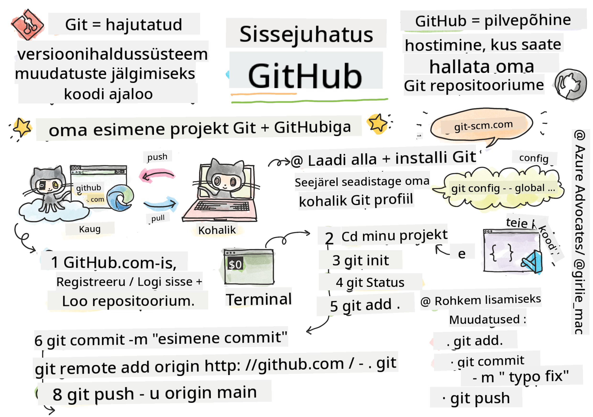
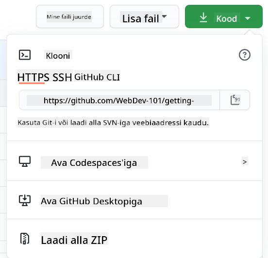

<!--
CO_OP_TRANSLATOR_METADATA:
{
  "original_hash": "ea65b75e488aa33a3cc5cb1c6c3f047a",
  "translation_date": "2025-10-11T11:53:15+00:00",
  "source_file": "1-getting-started-lessons/2-github-basics/README.md",
  "language_code": "et"
}
-->
# Sissejuhatus GitHubi

See õppetund käsitleb GitHubi põhitõdesid – platvormi, kus saab majutada ja hallata oma koodi muudatusi.


> Sketšimärkus: [Tomomi Imura](https://twitter.com/girlie_mac)

## Eeltest
[Eeltest](https://ff-quizzes.netlify.app)

## Sissejuhatus

Selles õppetunnis käsitleme:

- töö jälgimist oma arvutis
- projektide kallal töötamist koos teistega
- avatud lähtekoodiga tarkvara panustamist

### Eeltingimused

Enne alustamist kontrolli, kas Git on paigaldatud. Terminalis kirjuta: 
`git --version`

Kui Git ei ole paigaldatud, [laadi alla Git](https://git-scm.com/downloads). Seejärel seadista oma lokaalne Git profiil terminalis:
* `git config --global user.name "sinu-nimi"`
* `git config --global user.email "sinu-email"`

Kontrollimaks, kas Git on juba seadistatud, kirjuta:
`git config --list`

Sul on vaja ka GitHubi kontot, koodiredaktorit (näiteks Visual Studio Code) ja terminali (või käsurea akent).

Mine [github.com](https://github.com/) ja loo konto, kui sul seda veel pole, või logi sisse ja täida oma profiil.

✅ GitHub ei ole ainus koodirepositoorium maailmas; on ka teisi, kuid GitHub on kõige tuntum.

### Ettevalmistus

Sul on vaja kausta koodiprojektiga oma arvutis (sülearvutis või lauaarvutis) ja avalikku GitHubi repositoriumi, mis toimib näitena, kuidas teiste projektidesse panustada.

---

## Koodi haldamine

Oletame, et sul on kohalik kaust koodiprojektiga ja sa tahad hakata oma edusamme jälgima, kasutades git'i – versioonihaldussüsteemi. Mõned inimesed võrdlevad git'i kasutamist armastuskirja kirjutamisega oma tulevasele minale. Kui loed oma commit-sõnumeid päevade, nädalate või kuude pärast, suudad meenutada, miks sa teatud otsuse tegid, või "tagasi kerida" muudatuse – eeldusel, et kirjutad häid "commit-sõnumeid".

### Ülesanne: Loo repositoorium ja commit'i kood  

> Vaata videot
> 
> [](https://www.youtube.com/watch?v=9R31OUPpxU4)

1. **Loo GitHubis repositoorium**. GitHub.com-is, repositooriumide vahekaardil või paremal ülanurgas navigeerimisribalt, leia **uus repo** nupp.

   1. Anna oma repositooriumile (kaustale) nimi
   1. Vali **loo repositoorium**.

1. **Liigu oma töökausta**. Terminalis vaheta kausta (tuntud ka kui kataloog), mida tahad hakata jälgima. Kirjuta:

   ```bash
   cd [name of your folder]
   ```

1. **Initsialiseeri git repositoorium**. Oma projektis kirjuta:

   ```bash
   git init
   ```

1. **Kontrolli staatust**. Kontrollimaks repositooriumi staatust, kirjuta:

   ```bash
   git status
   ```

   väljund võib välja näha umbes selline:

   ```output
   Changes not staged for commit:
   (use "git add <file>..." to update what will be committed)
   (use "git checkout -- <file>..." to discard changes in working directory)

        modified:   file.txt
        modified:   file2.txt
   ```

   Tavaliselt annab `git status` käsk infot, näiteks millised failid on valmis _salvestamiseks_ repositooriumisse või millistel failidel on muudatusi, mida võiks püsivaks teha.

1. **Lisa kõik failid jälgimiseks**
   Seda nimetatakse ka failide lavastamiseks/lisamiseks lavastuspiirkonda.

   ```bash
   git add .
   ```

   `git add` koos `.` argumendiga näitab, et kõik failid ja muudatused on jälgimiseks.

1. **Lisa valitud failid jälgimiseks**

   ```bash
   git add [file or folder name]
   ```

   See võimaldab lisada ainult valitud failid lavastuspiirkonda, kui sa ei taha kõiki faile korraga commit'ida.

1. **Eemalda kõik failid lavastuspiirkonnast**

   ```bash
   git reset
   ```

   See käsk võimaldab eemaldada kõik failid korraga lavastuspiirkonnast.

1. **Eemalda konkreetne fail lavastuspiirkonnast**

   ```bash
   git reset [file or folder name]
   ```

   See käsk võimaldab eemaldada ainult konkreetse faili lavastuspiirkonnast, mida sa ei taha järgmises commit'is kaasata.

1. **Tee oma töö püsivaks**. Praeguseks oled failid lisanud nn _lavastuspiirkonda_. Koht, kus Git jälgib sinu faile. Muudatuse püsivaks tegemiseks pead failid _commit'ima_. Selleks loo _commit_ käsuga `git commit`. _Commit_ esindab salvestuspunkti sinu repositooriumi ajaloos. Kirjuta järgmine, et luua _commit_:

   ```bash
   git commit -m "first commit"
   ```

   See commit'ib kõik failid, lisades sõnumi "esimene commit". Tulevaste commit-sõnumite puhul tasub olla kirjeldavam, et edastada, millist tüüpi muudatusi sa tegid.

1. **Ühenda oma lokaalne Git repo GitHubiga**. Git repo on kasulik sinu arvutis, kuid mingil hetkel tahad oma failidest varukoopiat kusagil hoida ja kutsuda teisi inimesi oma repositooriumiga töötama. Üks suurepärane koht selleks on GitHub. Me oleme juba loonud GitHubis repositooriumi, nii et ainus, mida teha tuleb, on ühendada oma lokaalne Git repo GitHubiga. Käsk `git remote add` teeb just seda. Kirjuta järgmine käsk:

   > Märkus: enne käsu sisestamist mine oma GitHubi repo lehele, et leida repositooriumi URL. Kasuta seda allolevas käsus. Asenda ```https://github.com/username/repository_name.git``` oma GitHubi URL-iga.

   ```bash
   git remote add origin https://github.com/username/repository_name.git
   ```

   See loob _remote_-ühenduse nimega "origin", mis osutab varem loodud GitHubi repositooriumile.

1. **Saada lokaalsed failid GitHubi**. Seni oled loonud _ühenduse_ lokaalse repo ja GitHubi repo vahel. Saada need failid GitHubi järgmise käsuga `git push`, näiteks:

   > Märkus: sinu haru nimi võib vaikimisi erineda ```main```-ist.

   ```bash
   git push -u origin main
   ```

   See saadab sinu commit'id "main" harusse GitHubis. `upstream` haru seadistamine, sealhulgas `-u` käsus, loob lingi sinu lokaalse haru ja kaug-haru vahel, nii et tulevikus saad lihtsalt kasutada git push või git pull ilma haru nime täpsustamata. Git kasutab automaatselt upstream-haru ja sa ei pea tulevastes käskudes haru nime eraldi määrama.

2. **Lisa rohkem muudatusi**. Kui tahad jätkata muudatuste tegemist ja nende GitHubi saatmist, pead lihtsalt kasutama järgmisi kolme käsku:

   ```bash
   git add .
   git commit -m "type your commit message here"
   git push
   ```

   > Näpunäide: Võid kaaluda `.gitignore` faili kasutamist, et vältida failide, mida sa ei taha jälgida, GitHubis ilmumist – näiteks märkmete faili, mida hoiad samas kaustas, kuid millel pole kohta avalikus repositooriumis. `.gitignore` failide mallid leiad siit: [.gitignore templates](https://github.com/github/gitignore).

#### Commit-sõnumid

Hea Git commit'i pealkiri lõpetab järgmise lause:
Kui rakendada, siis see commit <sinu pealkiri siin>

Pealkirjas kasuta käskivat, olevikuvormi: "muuda" mitte "muudetud" ega "muudab". 
Nagu pealkirjas, kasuta ka kehas (valikuline) käskivat, olevikuvormi. Keha peaks sisaldama muudatuse motivatsiooni ja kontrasti varasema käitumisega. Selgitad `miks`, mitte `kuidas`.

✅ Võta paar minutit, et GitHubis ringi vaadata. Kas leiad tõeliselt hea commit-sõnumi? Kas leiad väga minimaalse? Millist infot pead commit-sõnumis kõige olulisemaks ja kasulikuks edastada?

### Ülesanne: Tee koostööd

Peamine põhjus, miks asjad GitHubi üles laadida, on võimalus teha koostööd teiste arendajatega.

## Projektide kallal töötamine koos teistega

> Vaata videot
>
> [](https://www.youtube.com/watch?v=bFCM-PC3cu8)

Sinu repositooriumis liigu `Insights > Community`, et näha, kuidas sinu projekt vastab soovitatud kogukonna standarditele.

   Siin on mõned asjad, mis võivad sinu GitHubi repositooriumi parandada:
   - **Kirjeldus**. Kas lisasid oma projektile kirjelduse?
   - **README**. Kas lisasid README? GitHub pakub juhiseid [README kirjutamiseks](https://docs.github.com/articles/about-readmes/?WT.mc_id=academic-77807-sagibbon).
   - **Panustamise juhised**. Kas sinu projektis on [panustamise juhised](https://docs.github.com/articles/setting-guidelines-for-repository-contributors/?WT.mc_id=academic-77807-sagibbon)?
   - **Käitumisjuhend**. Kas projektis on [käitumisjuhend](https://docs.github.com/articles/adding-a-code-of-conduct-to-your-project/)?
   - **Litsents**. Võib-olla kõige olulisem, [litsents](https://docs.github.com/articles/adding-a-license-to-a-repository/)?

Kõik need ressursid aitavad uute meeskonnaliikmete sisseelamist. Need on tavaliselt asjad, mida uued panustajad vaatavad enne sinu koodi vaatamist, et otsustada, kas sinu projekt on õige koht nende aja kulutamiseks.

✅ Kuigi README failide ettevalmistamine võtab aega, jäävad need tihti hõivatud hooldajate poolt tähelepanuta. Kas leiad näite eriti kirjeldavast README-st? Märkus: on olemas [tööriistad, mis aitavad luua häid README-sid](https://www.makeareadme.com/), mida võid proovida.

### Ülesanne: Ühenda kood

Panustamise dokumendid aitavad inimestel projektile panustada. Need selgitavad, millist tüüpi panustusi otsitakse ja kuidas protsess toimib. Panustajad peavad läbima mitmeid samme, et saaksid GitHubis sinu repositooriumisse panustada:

1. **Repo forkimine**. Tõenäoliselt tahad, et inimesed _fork'iksid_ sinu projekti. Forkimine tähendab sinu repositooriumi koopia loomist nende GitHubi profiilil.
1. **Kloonimine**. Sealt edasi kloonivad nad projekti oma arvutisse.
1. **Haru loomine**. Palu neil luua _haru_ oma töö jaoks.
1. **Muudatuste keskendamine ühele valdkonnale**. Palu panustajatel keskenduda oma panustamisel ühele asjale korraga – nii on suurem tõenäosus, et saad nende töö _ühendada_. Kujuta ette, et nad parandavad vea, lisavad uue funktsiooni ja uuendavad mitmeid teste – mis siis, kui tahad või saad rakendada ainult 2 kolmest või 1 kolmest muudatusest?

✅ Kujuta ette olukorda, kus harud on eriti kriitilised hea koodi kirjutamiseks ja tarnimiseks. Milliseid kasutusjuhtumeid suudad välja mõelda?

> Märkus: ole muutus, mida tahad maailmas näha, ja loo harud ka oma töö jaoks. Kõik commit'id, mida teed, tehakse harule, millele oled hetkel "välja registreeritud". Kasuta `git status`, et näha, millisele harule oled registreeritud.

Läheme läbi panustaja töövoo. Eeldame, et panustaja on juba _fork'inud_ ja _klooninud_ repo, nii et neil on Git repo, millega oma arvutis töötada:

1. **Loo haru**. Kasuta käsku `git branch`, et luua haru, mis sisaldab muudatusi, mida nad kavatsevad panustada:

   ```bash
   git branch [branch-name]
   ```

1. **Vaheta tööharule**. Vaheta määratud harule ja uuenda töökausta käsuga `git switch`:

   ```bash
   git switch [branch-name]
   ```

1. **Tee tööd**. Sellel hetkel tahad lisada oma muudatused. Ära unusta Git'ile sellest teada anda järgmiste käskudega:

   ```bash
   git add .
   git commit -m "my changes"
   ```

   Veendu, et annad oma commit'ile hea nime, enda ja repo hooldaja huvides, kellele sa aitad.

1. **Ühenda oma töö `main` haruga**. Mingil hetkel oled töö lõpetanud ja tahad oma töö `main` haruga ühendada. `main` haru võib vahepeal muutunud olla, nii et veendu, et kõigepealt uuendad seda viimase versiooniga järgmiste käskudega:

   ```bash
   git switch main
   git pull
   ```

   Sellel hetkel tahad veenduda, et kõik _konfliktid_, olukorrad, kus Git ei suuda muudatusi lihtsalt _ühendada_, tekivad sinu tööharus. Seetõttu käivita järgmised käsud:

   ```bash
   git switch [branch_name]
   git merge main
   ```

   Käsk `git merge main` toob kõik muudatused `main` harust sinu harusse. Loodetavasti saad lihtsalt jätkata. Kui ei, siis VS Code näitab, kus Git on _segaduses_, ja sa lihtsalt muudad mõjutatud faile, et öelda, milline sisu on kõige täpsem.

   Haru vahetamiseks kasuta kaasaegset `git switch` käsku:
   ```bash
   git switch [branch_name]


1. **Saada oma töö GitHubi**. Oma töö GitHubi saatmine tähendab kahte asja. Oma haru lükkamist oma repo'sse ja seejärel PR-i, Pull Request'i avamist.

   ```bash
   git push --set-upstream origin [branch-name]
   ```

   Ülaltoodud käsk loob haru sinu fork'itud repo's.
1. **Ava PR**. Järgmine samm on PR-i avamine. Selleks navigeeri GitHubis oma kahvli (forked repo) juurde. GitHubis kuvatakse teade, kus küsitakse, kas soovid luua uue PR-i. Klõpsa sellel ja sind viiakse liidesesse, kus saad muuta commit'i sõnumi pealkirja ning lisada sobivama kirjelduse. Nüüd näeb kahvli algse hoidla haldaja seda PR-i ja _loodetavasti_ hindab seda ning _ühendab_ (merge) sinu PR-i. Nüüd oled panustaja, hurraa! :)

1. **Korista ära**. Pärast PR-i edukat ühendamist on hea tava _koristada_ oma töö. See tähendab, et tuleks kustutada nii kohalik haru kui ka GitHubi üleslaetud haru. Kõigepealt kustuta see kohalikult järgmise käsuga:

   ```bash
   git branch -d [branch-name]
   ```
  
Seejärel mine GitHubi lehele oma kahvli juurde ja eemalda seal kaugharu, mille just üles laadisid.

`Pull request` võib tunduda veider termin, sest tegelikult tahad sa oma muudatusi projekti _push_'ida. Kuid hoidla haldaja (projekti omanik) või põhimeeskond peab enne muudatuste ühendamist projekti "peaharuga" neid muudatusi kaaluma, seega sa tegelikult palud haldajalt otsust muudatuse kohta.

Pull request on koht, kus saab võrrelda ja arutada haru muudatusi koos ülevaadete, kommentaaride, integreeritud testide ja muuga. Hea pull request järgib enam-vähem samu reegleid kui commit'i sõnum. Sa võid viidata probleemile (issue) probleemide jälgimissüsteemis, näiteks kui sinu töö lahendab konkreetse probleemi. Seda tehakse, kasutades `#` ja sellele järgnevat probleemi numbrit. Näiteks `#97`.

🤞Hoidke pöidlad pihus, et kõik kontrollid läbiksid ja projekti omanik(ud) ühendaksid sinu muudatused projektiga🤞

Uuenda oma praegust kohalikku tööharu kõigi uute commit'idega vastavast kaugharust GitHubis:

`git pull`

## Kuidas panustada avatud lähtekoodiga projektidesse

Kõigepealt leia GitHubist hoidla (või **repo**), mis sind huvitab ja kuhu soovid muudatuse panustada. Selleks tuleb hoidla sisu kopeerida oma arvutisse.

✅ Hea viis leida algajatele sobivaid hoidlaid on [otsida märksõna 'good-first-issue' järgi](https://github.blog/2020-01-22-browse-good-first-issues-to-start-contributing-to-open-source/).



Koodi kopeerimiseks on mitu viisi. Üks võimalus on "kloonida" hoidla sisu, kasutades HTTPS-i, SSH-d või GitHub CLI-d (Command Line Interface).

Ava terminal ja klooni hoidla järgmiselt:  
`git clone https://github.com/ProjectURL`

Projekti kallal töötamiseks liigu õigesse kausta:  
`cd ProjectURL`

Samuti saad avada kogu projekti, kasutades [Codespaces](https://github.com/features/codespaces), GitHubi sisseehitatud koodiredaktorit / pilvepõhist arenduskeskkonda, või [GitHub Desktop](https://desktop.github.com/).

Viimaks saad koodi alla laadida ka zip-failina.

### Veel mõned huvitavad asjad GitHubi kohta

Sa saad tähistada (star), jälgida (watch) ja/või "kahveldada" (fork) mis tahes avalikku hoidlat GitHubis. Tähistatud hoidlad leiad paremas ülanurgas rippmenüüst. See on nagu järjehoidja, aga koodi jaoks.

Projektidel on probleemide jälgimissüsteem, enamasti GitHubis "Issues" vahekaardil, kui pole teisiti märgitud, kus inimesed arutavad projektiga seotud probleeme. Pull Requests vahekaart on koht, kus arutatakse ja vaadatakse üle muudatusi, mis on töös.

Projektidel võib olla ka arutelusid foorumites, meililistides või vestluskanalites nagu Slack, Discord või IRC.

✅ Vaata oma uut GitHubi hoidlat ja proovi mõnda asja, näiteks seadete muutmist, info lisamist hoidlasse ja projekti loomist (näiteks Kanban-tahvlit). Võimalusi on palju!

---

## 🚀 Väljakutse

Tee koostööd sõbraga, töötades üksteise koodi kallal. Loo projekt ühiselt, kahvelda koodi, loo harusid ja ühenda muudatusi.

## Loengu järgne viktoriin  
[Loengu järgne viktoriin](https://ff-quizzes.netlify.app/web/en/)

## Ülevaade ja iseseisev õppimine

Loe rohkem [avatud lähtekoodiga tarkvara panustamise kohta](https://opensource.guide/how-to-contribute/#how-to-submit-a-contribution).

[Git'i spikrijuhend](https://training.github.com/downloads/github-git-cheat-sheet/).

Harjuta, harjuta, harjuta. GitHubil on suurepärased õppeprogrammid saadaval [skills.github.com](https://skills.github.com) kaudu:

- [Esimene nädal GitHubis](https://skills.github.com/#first-week-on-github)

Leiad ka edasijõudnutele mõeldud kursusi.

## Ülesanne

Lõpeta [Esimese nädala GitHubis kursus](https://skills.github.com/#first-week-on-github)

---

**Lahtiütlus**:  
See dokument on tõlgitud AI tõlketeenuse [Co-op Translator](https://github.com/Azure/co-op-translator) abil. Kuigi püüame tagada täpsust, palume arvestada, et automaatsed tõlked võivad sisaldada vigu või ebatäpsusi. Algne dokument selle algses keeles tuleks pidada autoriteetseks allikaks. Olulise teabe puhul soovitame kasutada professionaalset inimtõlget. Me ei vastuta selle tõlke kasutamisest tulenevate arusaamatuste või valesti tõlgenduste eest.