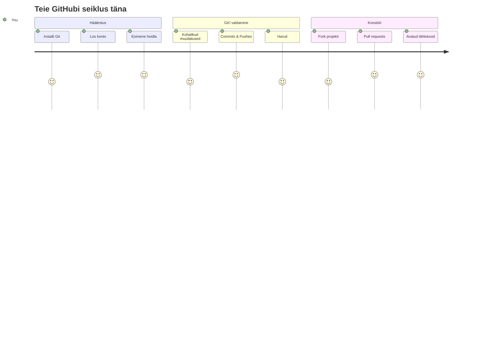
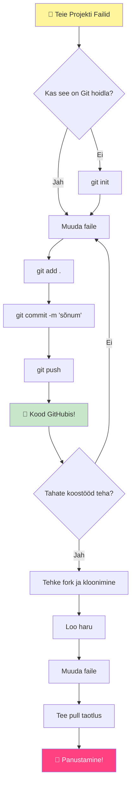
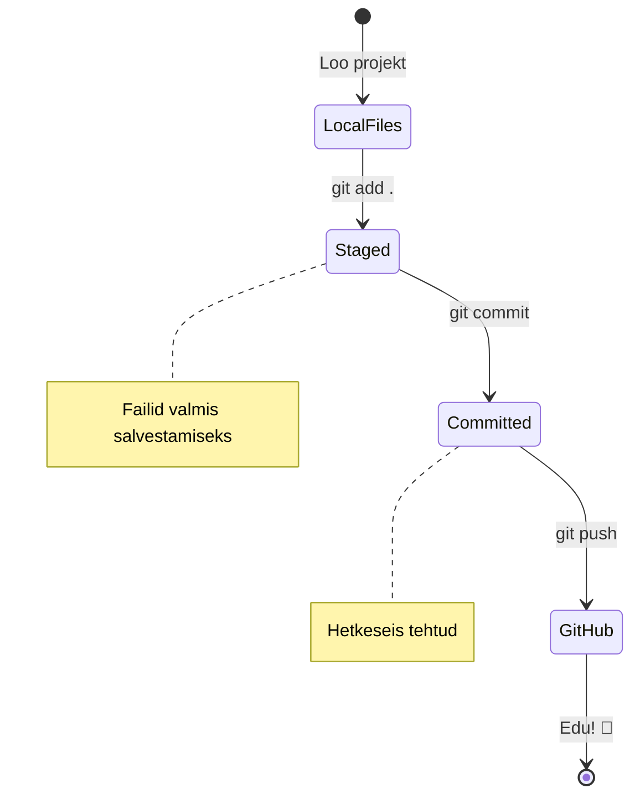
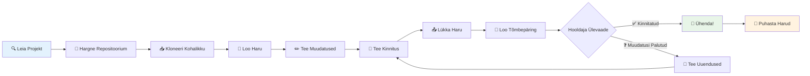
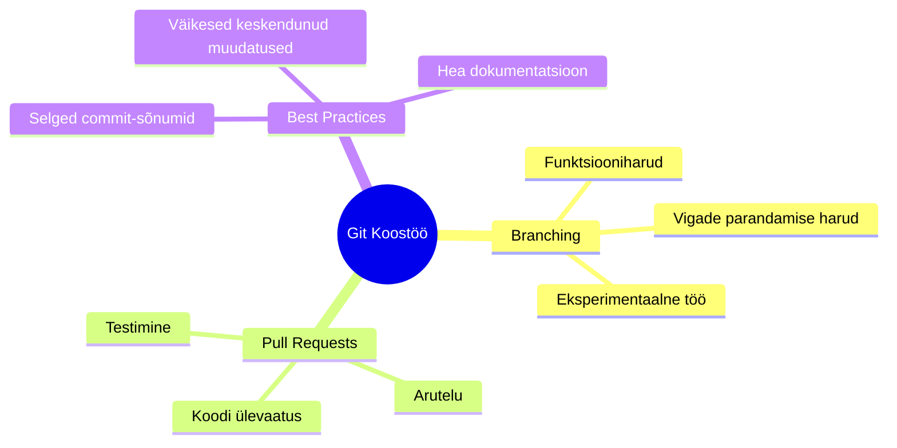
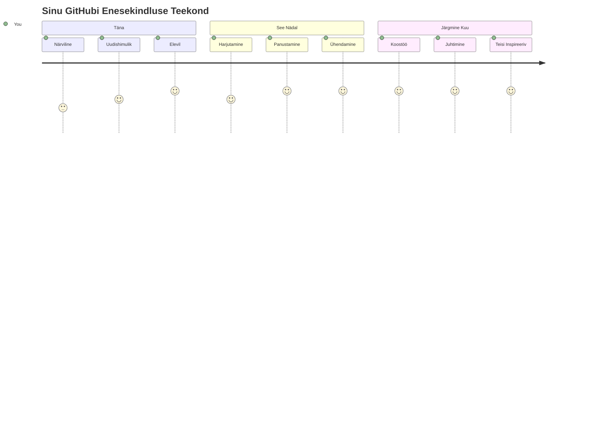

<!--
CO_OP_TRANSLATOR_METADATA:
{
  "original_hash": "5c383cc2cc23bb164b06417d1c107a44",
  "translation_date": "2026-01-08T10:06:02+00:00",
  "source_file": "1-getting-started-lessons/2-github-basics/README.md",
  "language_code": "et"
}
-->
# Sissejuhatus GitHubi

Tere, tulevane arendaja! 👋 Oled valmis liituma miljonite kodeerijatega üle kogu maailma? Mul on tõeliselt hea meel tutvustada sulle GitHubi – mõtle sellele kui programmeerijate sotsiaalmeedia platvormile, ainult et selle asemel, et jagada oma lõunasöögi pilte, jagame me koodi ja ehitame koos midagi hämmastavat!

See, mis mulle tõesti meeleheitlikult muljet avaldab: iga rakendus sinu telefonis, iga veebisait, mida sa külastad, ja enamik tööriistu, mida sa õpid kasutama, on ehitatud koos töötavate arendajate tiimide poolt platvormidel nagu GitHub. See muusikarakendus, mida sa armastad? Keegi nagu sina on sellele panuse andnud. See mäng, mida sa ei suuda käest panna? Jep, tõenäoliselt ehitatud GitHubi koostöös. Ja nüüd SA ÕPID, kuidas olla osa sellest imelisest kogukonnast!

Ma tean, et alguses võib see kõik tunduda palju – ausalt öeldes mäletan, kuidas ma esimest korda oma GitHubi lehekülge vaatasin ja mõtlesin „Mida küll see kõik tähendab?“ Aga siin on asi: iga arendaja alustas täpselt sealt, kus sina praegu oled. Selle tunni lõpuks on sul oma GitHubi hoidla (mõtle sellele kui sinu isiklikule projektinäitusele pilves) ja sa tead, kuidas salvestada oma tööd, jagada seda teistega ja isegi panustada projektidesse, mida kasutavad miljonid inimesed.

Me võtame selle teekonna koos – sammhaaval. Ilma kiirustamise ja pingeta – ainult sina, mina ja mõned väga lahedad tööriistad, mis saavad sinu uueks parimaks sõbraks!


> Sketchnote autor [Tomomi Imura](https://twitter.com/girlie_mac)


## Eelsissejuhatuse viktoriin
[Eelsissejuhatuse viktoriin](https://ff-quizzes.netlify.app)

## Sissejuhatus

Enne kui sukeldume kõige põnevamatesse asjadesse, valmistame su arvuti ette GitHubi võluks! Mõtle sellele nagu oma kunstitarvikute korrastamisele enne meistriteose loomist – õige tööriista olemasolu teeb kogu protsessi sujuvamaks ja palju lõbusamaks.

Ma juhatan sind läbi kogu seadistamisprotsessi isiklikult ja luban, et see ei ole üldse nii hirmus, kui esmapilgul tunduda võib. Kui mõni asi kohe ei paista selge olevat, on see täiesti normaalne! Mäletan, kuidas ma seadistasin oma esimest arenduskeskkonda ja tundsin, justkui püüaksin lugeda iidseid hieroglüüfe. Iga arendaja on olnud täpselt seal, kus sina praegu oled, mõtiskledes, kas teeb kõike õigesti. Spoiler: kui sa siin õpid, siis teed seda juba õigesti! 🌟

Selles õppetükis käsitleme:

- sinu masina tööl tehtud töö jälgimist
- projektide kallal töötamist koos teistega
- kuidas panustada avatud lähtekoodiga tarkvarasse

### Eeltingimused

Valmistame su arvuti GitHubi võluks ette! Ära muretse – see seadistus tuleb teha ainult korra ja siis oled kogu oma kodeerimisteekonnaks valmis.

Alustame alustalast! Esiteks peame kontrollima, kas Git on su arvutisse juba installitud. Git on põhimõtteliselt nagu väga nutikas assistent, kes mäletab iga sinu koodimuudatust – palju parem kui paaniliselt iga kahe sekundi tagant Ctrl+S vajutada (me kõik oleme seda teinud!).

Kontrollime, kas Git on juba olemas, tippides terminali selle maagilise käsu:
`git --version`

Kui Git veel pole, ära muretse! Mine lihtsalt aadressile [download Git](https://git-scm.com/downloads) ja lae see alla. Kui oled installi lõpetanud, tutvustan sulle Git’i korralikult:

> 💡 **Esimese korraga seadistus**: Need käsud ütlevad Git’ile, kes sa oled. See teave lisatakse igale sinu tehtud commit’ile, nii et vali nimi ja e-post, mida oled mugav avalikult jagada.

```bash
git config --global user.name "your-name"
git config --global user.email "your-email"
```

Git’i olemasoleva seadistuse kontrollimiseks võid tippida:
```bash
git config --list
```

Sul on samuti vaja GitHubi kontot, koodiredaktorit (nt Visual Studio Code) ja terminali (või käsurida) avada.

Mine aadressile [github.com](https://github.com/) ja loo konto, kui seda veel pole, või logi sisse ning täida oma profiil.

💡 **Kaasaegne näpunäide**: Kaalu SSH võtmete seadistamist ([SSH keys](https://docs.github.com/en/authentication/connecting-to-github-with-ssh)) või GitHub CLI kasutamist ([GitHub CLI](https://cli.github.com/)) lihtsamaks ja paroolivabaks autentimiseks.

✅ GitHub pole ainus koodipõhine hoidla veebis; on ka teisi, aga GitHub on kõige tuntum.

### Ettevalmistus

Sul peab olema nii kohalikust masinast (sülearvuti või lauaarvuti) koodiprojektiga kaust kui avalik hoidla GitHubis, mis on näitena, kuidas panustada teiste projektidesse.

### Koodi turvalisuse tagamine

Räägime hetkeks turvalisusest – aga ära muretse, me ei hirmuta sind hullult! Mõtle turvapraktikatele nagu auto või maja lukustamisele. Need on lihtsad harjumused, millest muutuvad su teiseks loomuseks ja hoiavad su raske töö kaitstuna.

Näitan sulle kaasaegseid ja turvalisi viise GitHubiga töötamiseks algusest peale. Nii arendad head harjumused, mis toetavad sind kogu su kodeerimiskarjääri jooksul.

Kui töötad GitHubiga, on oluline järgida turvalisuse parimaid tavasid:

| Turvaala | Parim tava | Miks see oluline on |
|----------|------------|---------------------|
| **Autentimine** | Kasuta SSH võtmeid või isiklikke juurdepääsutokeneid | Paroolid on vähem turvalised ja nende kasutamine väheneb |
| **Kahefaktoriline autentimine** | Lülita sisse 2FA oma GitHubi kontol | Lisab täiendava kaitsekihi kontole |
| **Hoidla turvalisus** | Ära kunagi tee commit evolventse infot | API võtmed ja paroolid ei tohiks kunagi olla avalikes hoidlates |
| **Sõltuvuste haldus** | Lülita sisse Dependabot uuendusteks | Hoiab sinu sõltuvused turvalised ja ajakohased |

> ⚠️ **Kriitiline turvameeldetuletus**: Ära kunagi tee commit'i API võtmeid, paroole ega muud tundlikku infot mingisse hoidlasse. Kasuta keskkonnamuutujaid ja `.gitignore` faile tundliku info kaitseks.

**Kaasaegne autentimise seadistamine:**

```bash
# Genereeri SSH võti (kaasaegne ed25519 algoritm)
ssh-keygen -t ed25519 -C "your_email@example.com"

# Sea Git kasutama SSH-d
git remote set-url origin git@github.com:username/repository.git
```

> 💡 **Profesionaalseks kasutamiseks**: SSH võtmed eemaldavad vajaduse mitmel korral paroole sisestada ning on traditsioonilisest autentimisest turvalisemad.

---

## Halda oma koodi nagu proff

Olgu, SEE on see koht, kus asjad tõeliselt põnevaks muutuvad! 🎉 Õpime jälgima ja haldama oma koodi nagu proffid ning ausalt öeldes on see üks mu lemmikuid teemasid õpetada, sest see muudab kõik mängupõhimõtte.

Kujutle, et kirjutad erakordset lugu ning tahad jälgida iga mustandi, iga põneva paranduse ja iga „äh, see on geniaalne!“ hetke teekonda. Täpselt nii teebki Git sinu koodiga! See on nagu imelise ajas rändava märkmiku omamine, mis mäletab KÕIKE – iga klahvivajutust, iga muudatust, iga „ups, nüüd tekkis viga“ hetke, mille saad koheselt tagasi võtta.

Olen aus – see võib alguses tunduda kurnav. Kui ma alustasin, mõtlesin: „Miks ma ei saa lihtsalt oma faile tavapäraselt salvestada?“ Aga usalda mind: kui Git sulle lõpuks klapib (ja see juhtub!), koged „kõrvalmaja valgustuse“ hetke, kus mõtled „Kuidas ma üldse varem ilma selleta koodisin?“ See on nagu avastaksid, et oskad lennata, kuigi kogu elu oled vaid jalutanud!

Oletame, et sul on kohaliku masinaga kaust mõne koodiprojektiga ja soovid hakata oma edusamme jälgima git’i versioonihaldussüsteemi abil. Mõned inimesed võrdlevad git’i kasutamist armastuskirja kirjutamisega oma tulevasele minale. Oma commit’ide kirjade lugemisel päevade, nädalate või kuude pärast tuletad meelde, miks otsuse tegid, või saad „tagasi pöörata“ muudatuse – see tähendab, kui kirjutad head „commit’i sõnumid“.


### Ülesanne: loo oma esimene hoidla!

> 🎯 **Sinu missioon (ja ma olen nii elevil sinu pärast!)**: Loome sinu esimese GitHubi hoidla koos! Selle lõpus on sul oma väike nurk internetis, kus elab sinu kood, ning oled teinud oma esimese „commit’i“ (see tähendab arendajakeeles, et oled oma töö salvestanud väga nutikalt).  
>
> See on tõeliselt eriline hetk – oled ametlikult liitumas arendajate maailmakogukonnaga! Ma mäletan siiani, kuidas ehmatasin, kui tegin oma esimese repo ja mõtlesin: „Vau, ma tõesti teen seda!“

Käime selle seikluse samm-sammult läbi. Võta iga osa jaoks aega – kiirustamiseks pole auhinda ja luban, et iga samm saab lõpuks selgeks. Pea meeles, iga kodeerimise superstaar, keda imetled, istus kunagi seal, kus sina oled, just enne oma esimest hoidlat looma hakkamist. Kui äge see on?

> Vaata videot
> 
> [](https://www.youtube.com/watch?v=9R31OUPpxU4)

**Teeme selle koos:**

1. **Loo oma hoidla GitHubis**. Mine GitHub.com ja otsi seda heledat rohelist **New** nuppu (või paremas ülanurgas olevat **+** märki). Kliki sellel ja vali **New repository**.

   Tee nii:
   1. Anna oma hoidlale nimi – vali midagi tähenduslikku!
   1. Lisa kirjeldus, kui soovid (see aitab teistel mõista, millega su projekt tegeleb)
   1. Otsusta, kas teha see avalik (kõik näevad) või privaatne (ainult sinu jaoks)
   1. Soovitan märkida linnuke kastikesse README faili lisamiseks – see on nagu projekti esileht
   1. Kliki **Create repository** ja tähista – just lõid oma esimese repo! 🎉

2. **Mine oma projekti kausta**. Nüüd ava terminal (ära karda, see ei ole üldse nii hirmus nagu tundub!). Peame ütlema arvutile, kus su projektifailid asuvad. Tippige see käsk:

   ```bash
   cd [name of your folder]
   ```

   **Mida me siin teeme:**
   - Ütleme arvutile „Hei, vii mind minu projektikausta“
   - See on nagu konkreetse kausta avamine oma töölaual, aga me teeme seda tekstikäsklustega
   - Asenda `[name of your folder]` oma tegeliku projektikausta nimega

3. **Muuda oma kaust Git’i hoidla'ks**. Siin juhtub võlu! Tippige:

   ```bash
   git init
   ```

   **Mis just juhtus (päris lahe, eks?):**
   - Git lõi su projektikausta sees peidetud `.git` kausta – sa ei näe seda, aga see on olemas!
   - Sinu tavaline kaust on nüüd „hoidla“, mis suudab jälgida kõiki tehtud muudatusi
   - Mõtle sellele nagu annaksid oma kaustale supervõimed kõike mäletada

4. **Vaata, mis toimub**. Vaatame, mida Git praegu su projekti kohta arvab:

   ```bash
   git status
   ```

   **Mida Git sulle ütleb:**
   
   Võid näha midagi sellist:

   ```output
   Changes not staged for commit:
   (use "git add <file>..." to update what will be committed)
   (use "git restore <file>..." to discard changes in working directory)

        modified:   file.txt
        modified:   file2.txt
   ```

   **Ära paanitse! See tähendab nii:**
   - Failid punases **värvis** on muudatused, mis pole veel valmis salvestamiseks
   - Failid rohelises **värvis** (kui neid näed) on valmis salvestamiseks
   - Git aitab sul, öeldes täpselt, mida järgmiseks teha

   > 💡 **Professionaalne nipp**: käsk `git status` on su parim sõber! Kasuta seda iga kord, kui olukord tundub segane. See on nagu küsiks Git’ilt „Hei, mis seis on praegu?“

5. **Valmista failid salvestamiseks ette** (see on „staging“ ehk lisamine alale):

   ```bash
   git add .
   ```

   **Mida me just tegime:**
   - Ütlesime Gatile „Hei, tahan järgmisesse salvestusse lisada KÕIK oma failid“
   - `.` tähendab „kõik selles kaustas“
   - Nüüd on failid „lavale seatud“ ja valmis järgmiseks sammuks

   **Tahan olla valivam?** Võid lisada ka vaid kindlad failid:

   ```bash
   git add [file or folder name]
   ```

   **Miks sa seda teha võid?**
   - Mõnikord tahad seotud muudatused koos salvestada
   - See aitab sul oma tööd loogilistesse osadesse korraldada
   - Muudab hiljem lihtsamaks aru saada, mis ja millal muutus

   **Mõtlesid ümber?** Pole probleemi! Võid failid „lavalt“ maha võtta nii:

   ```bash
   # Kõik muudatused valikust eemaldada
   git reset
   
   # Eemalda valikust ainult üks fail
   git reset [file name]
   ```

   Ära muretse – see ei kustuta sinu tööd, lihtsalt võtab failid „valmis salvestamiseks“ hunnikust välja.

6. **Salvesta töö püsivalt** (tehes oma esimese commit’i!):

   ```bash
   git commit -m "first commit"
   ```

   **🎉 Palju õnne! Sa tegid oma esimese commit’i!**
   
   **Mis just juhtus:**
   - Git tegi kõigist lavale seatud failidest just selle hetke „hetktõmmise“
   - Sinu commit’i sõnum „first commit“ selgitab, miks see salvestuspunkt tehti
   - Git andis sellele hetktõmmisele unikaalse ID, et saaksid seda alati hiljem leida
   - Sa alustasid ametlikult oma projekti ajaloo jälgimist!

   > 💡 **Tulevaste commit’i sõnumite jaoks**: Ole järgmistel kordadel kirjalikum! „Updated stuff“ asemel proovi „Lisa kontaktivorm avalehele“ või „Paranda navigeerimismenüü viga“. Su tulevane mina tänab sind!

7. **Ühenda oma kohalik projekt GitHubiga**. Praegu asub su projekt vaid arvutis. Ühendame selle sinu GitHubi hoidlaga, et saaksid seda maailmaga jagada!

   Kõigepealt mine oma GitHubi hoidla lehele ja kopeeri seal oleva hoidla URL. Siis tule siia tagasi ja tipi:

   ```bash
   git remote add origin https://github.com/username/repository_name.git
   ```
   
   (Asenda see URL oma hoidla tegeliku URL-iga!)

   **Mida me just tegime:**
   - Me lõime ühenduse teie kohaliku projekti ja teie GitHubi hoidla vahel
   - "Origin" on lihtsalt hüüdnimi teie GitHubi hoidla jaoks – see on nagu kontakti lisamine telefoni
   - Nüüd teab teie kohalik Git kuhu teie koodi saata, kui olete valmis seda jagama

   💡 **Lihtsam viis**: Kui teil on GitHub CLI paigaldatud, saate seda teha ühe käsuga:
   ```bash
   gh repo create my-repo --public --push --source=.
   ```

8. **Saatke oma kood GitHubi** (suur hetk!):

   ```bash
   git push -u origin main
   ```

   **🚀 See ongi see! Te laadite oma koodi GitHubi üles!**
   
   **Mis toimub:**
   - Teie commit'id liiguvad teie arvutist GitHubi
   - `-u` lipp seab üles püsiva ühenduse, et tulevased push-d oleksid lihtsamad
   - "main" on teie põhiharude nimi (nagu peamine kaust)
   - Pärast seda saate lihtsalt kasutada `git push` tulevaste üleslaadimiste jaoks!

   💡 **Kiire märkus**: Kui teie haru nimi on midagi muud (näiteks "master"), kasutage seda nime. Saate kontrollida käsuga `git branch --show-current`.

9. **Teie uus igapäevane kodeerimise rütm** (siin muutub see sõltuvust tekitavaks!):

   Edaspidi, igal korral, kui teie projektis muudatusi teete, on teil see lihtne kolmetapiline tants:

   ```bash
   git add .
   git commit -m "describe what you changed"
   git push
   ```

   **See muutub teie kodeerimise südametukseks:**
   - Tehke oma koodis lahedaid muudatusi ✨
   - Lisage need `git add`-ga ("Hei Git, pööra neile muudatustele tähelepanu!")
   - Salvestage need `git commit`-iga koos kirjeldava sõnumiga (tulevane teie tänab teid!)
   - Jagage neid maailmaga `git push`-iga 🚀
   - Korda ja korda – tõesti, see muutub sama loomulikuks kui hingamine!

   Mulle meeldib see töövoog, sest see on nagu mängus mitme salvestuspunkti omamine. Tegite muudatuse, mis teile meeldib? Commit'i see! Tahate proovida midagi riskantset? Pole probleemi – alati saate tagasi minna oma viimase commit’i juurde, kui asjad lähevad vintsi!

   > 💡 **Vihje**: Võiksite ka lisada `.gitignore` faili, et takistada failide, mida te ei taha jälgida, ilmumist GitHubi – nagu see märkmikufail, mida hoiate samas kaustas, kuid millel pole kohta avalikus hoidlas. `.gitignore` failide malle leiate aadressilt [.gitignore templates](https://github.com/github/gitignore) või saate ühe luua aadressil [gitignore.io](https://www.toptal.com/developers/gitignore).

### 🧠 **Esimene hoidla üleslaadimine: Kuidas see end tundus?**

**Võtke hetk tähistamiseks ja reflekteerimiseks:**
- Kuidas tundus näha oma koodi esimest korda GitHubis?
- Milline samm tundus kõige segasem ja milline üllatavalt lihtne?
- Kas saate oma sõnadega seletada vahet `git add`, `git commit` ja `git push` vahel?


> **Mäleta**: Isegi kogenud arendajad kipuvad mõnikord täpseid käske unustama. Selle töövoo lihasmäluks muutmine nõuab harjutamist – teil läheb suurepäraselt!

#### Kaasaegsed Git’i töövood

Kaaluge nende kaasaegsete tavade omaksvõttu:

- **Tavapärased commit’id**: Kasutage standardiseeritud commit sõnumite vormingut nagu `feat:`, `fix:`, `docs:` jne. Lisateavet leiate aadressilt [conventionalcommits.org](https://www.conventionalcommits.org/)
- **Atomilised commit’id**: Iga commit peaks esindama üht konkreetset muutust
- **Sagedased commit’id**: Commiti sageli koos kirjeldavate sõnumitega, mitte harva ja suuri kogumeid

#### Commit sõnumid

Hea Git commit'i teemareal lõpetatakse järgnev lause:
Kui rakendatud, teeb see commit <teie teemareal siin>

Teema puhul kasutage imperatiivi olevikus: "muuda", mitte "muutnud" ega "muudab".
Nii nagu teemareas, kasutage ka (vabatahtlikus) kirjelduses imperatiivi olevikus. Kirjeldus peaks sisaldama muutuse motivatsiooni ja võrdlust varasema käitumisega. Selgitate „miks“, mitte „kuidas“.

✅ Võtke paar minutit GitHubis ringi sirvimiseks. Kas leiate tõeliselt hea commit sõnumi? Kas leiate väga minimaalse sõnumi? Milline info on commit sõnumis teie arvates kõige olulisem ja kasulikum?

## Töötamine koos teistega (Lõbus osa!)

Hoidke mütsi, sest SIIN muutub GitHub tõeliselt maagiliseks! 🪄 Olete juba oma koodi haldamise selgeks saanud, aga nüüd sukeldume minu absoluutse lemmiku juurde – koostöösse hämmastavate inimestega üle kogu maailma.

Kujutage ette: ärkate homme ja näete, et keegi Tokyos parandas teie koodi, kui te magasite. Siis keegi Berlinis parandab vea, kus teil oli takerdumine. Pealelõunaks on Sao Paulos arendaja lisanud funktsiooni, millest te isegi mõelnud ei olnud. See pole ulme – see on lihtsalt teisipäev GitHubi universumis!

Mis mind tõeliselt elevile paneb, on see, et koostööoskused, mida teie hakkate õppima? Need on TÄPSELT samad töövood, mida Google, Microsoft ja teie lemmikud idufirmad iga päev kasutavad. Te ei õpi lihtsalt lahedat tööriista – te õpite saladuskeelt, mis paneb kogu tarkvaramaailma koos töötama.

Tõsiselt, kui kogete esimest korda seda emotsiooni, kui keegi ühineb teie esimese pull request’iga, mõistate, miks arendajad on avatud lähtekoodiga nii kirglikud. See on nagu osa maailma suurimast ja loovamast meeskonnaprojektist!

> Vaadake videot
>
> [](https://www.youtube.com/watch?v=bFCM-PC3cu8)

Peamine põhjus, miks asju GitHubi panna, oli võimaldada koostööd teiste arendajatega.


Mine oma hoidlas `Insights > Community`, et näha, kuidas teie projekt vastab soovitatud kogukonna standarditele.

Tahate, et teie hoidla näeks välja professionaalne ja sõbralik? Mine oma hoidla juurde ja klõpsa `Insights > Community`. See lahe funktsioon näitab, kuidas teie projekt võrdub sellega, mida GitHubi kogukond peab heaks hoidlapraktikaks.

> 🎯 **Projekti särama panemine**: Hästi organiseeritud hoidla hea dokumentatsiooniga on nagu puhas ja sõbralik pood. See ütleb inimestele, et hoolite oma tööst ja muudab teised kinnisideed panustama!

**Sellised asjad teevad hoidla suurepäraseks:**

| Mida lisada | Miks see oluline on | Mida see teile teeb |
|-------------|---------------------|--------------------|
| **Kirjeldus** | Esimene mulje loeb! | Inimesed teavad kohe, mida teie projekt teeb |
| **README** | Teie projekti esileht | Nii nagu sõbralik giid uutele külastajatele |
| **Panustamise juhised** | Näitab, et olete abi vastu avatud | Inimesed teavad täpselt, kuidas aidata |
| **Käitumisreeglid** | Loob sõbraliku ruumi | Kõik tunnevad end oodatuna osalema |
| **Litsents** | Õiguslik selgus | Teised teavad, kuidas nad saavad teie koodi kasutada |
| **Turvapoliitika** | Näitab, et olete vastutustundlik | Demonstreerib professionaalseid tavasid |

> 💡 **Proffide nipp**: GitHub pakub nende failide jaoks malle. Uue hoidla loomisel valige kastid, et need failid automaatselt genereerida.

**Kaasaegsed GitHubi funktsioonid, mida uurida:**

🤖 **Automatiseerimine & CI/CD:**
- **GitHub Actions** automatiseeritud testimiseks ja juurutamiseks
- **Dependabot** automaatsete sõltuvuste uuenduste jaoks

💬 **Kogukond & Projekti haldamine:**
- **GitHub Discussions** kogukonna vestlused probleemide kõrval
- **GitHub Projects** kanban-tüüpi projektihaldus
- **Haru kaitse reeglid** koodikvaliteedi standardite tagamiseks


Kõik need ressursid aitavad uutel meeskonnaliikmetel kiiremini sisse elada. Ja need on tavaliselt esimesed asjad, mida uued panustajad vaatavad enne koodi uurimist, et otsustada, kas projekt on neile õige koht aja veetmiseks.

✅ README failid, kuigi vajavad aega ettevalmistamiseks, jäävad sageli hõivatud hooldajate poolt tähelepanuta. Kas saate leida eriti kirjeldava näite? Märkus: on olemas mõningaid [tööriistu head README loomise abistamiseks](https://www.makeareadme.com/), mida võiksite proovida.

### Ülesanne: Mõne koodi ühendamine

Panustamise dokumentatsioon aitab inimestel projektile panustada. See seletab, millist tüüpi panuseid te otsite ja kuidas protsess toimib. Panustajad peavad läbima rea samme, et saada võimalust teie hoidla GitHubis panustada:


1. **Teie hoidla forkimine**. Tõenäoliselt tahate, et inimesed _forkiksid_ teie projekti. Forkkimine tähendab teie hoidla koopia loomist nende GitHubi profiilil.
1. **Kloonimine**. Sealt kopeerivad nad projekti oma kohalikule masinale.
1. **Haru loomine**. Tahtsite, et nad looksid oma töö jaoks _hooldanud haru_.
1. **Muudatuse keskendumine ühele alale**. Paluge panustajatel keskenduda oma panused korraga ühele asjale – nii on suurem võimalus, et saate nende töö _ühendada_. Kujutage ette, et nad kirjutavad vigade paranduse, lisavad uue funktsiooni ja uuendavad mitmeid teste – mis siis, kui soovite või saate rakendada ainult 2-st 3-st või 1-st 3-st muudatusest?

✅ Kujutage ette olukorda, kus harud on eriti olulised hea koodi kirjutamiseks ja saatmiseks. Milliseid kasutusjuhtumeid saate välja tuua?

> Märkus, olge ise muutus, mida soovite maailmas näha, ja tehke teretulnud harud ka oma töö jaoks. Kõik commit’id tehakse sellel harul, millel parasjagu “oled”. Vaadake, millisel harul te olete käsuga `git status`.

Läheme läbi panustaja töövoo. Eeldame, et panustaja on juba oma hoidla _forkinud_ ja _klooninud_, nii et tal on kohalik Git hoidla kasutamiseks valmis:

1. **Haru loomine**. Kasutage käsku `git branch`, et luua haru, kuhu panustaja lisatud muudatused mahuvad:

   ```bash
   git branch [branch-name]
   ```

   > 💡 **Kaasaegne lähenemine**: Samuti saate ühe käsuga uue haru luua ja sellele üle lülituda:
   ```bash
   git switch -c [branch-name]
   ```

1. **Vahetage tööharrule**. Vahetage antud harule ja uuendage töökataloogi käsuga `git switch`:

   ```bash
   git switch [branch-name]
   ```

   > 💡 **Kaasaegne märkus**: `git switch` on kaasaegne asendus käsule `git checkout` harude vahetamiseks. See on algajatele selgem ja turvalisem.

1. **Töötage**. Nüüd lisage oma muudatused. Ärge unustage Gitile sellest teada anda järgmiste käskudega:

   ```bash
   git add .
   git commit -m "my changes"
   ```

   > ⚠️ **Commit sõnumi kvaliteet**: Kindlasti andke oma commit’ile hea nimi nii enda kui hoidla hooldaja jaoks, kellele aitate. Olge täpne, mida muutsite!

1. **Ühendage oma töö `main` haruga**. Ühel hetkel olete tööga valmis ja tahate liita oma töö `main` haruga. Kuna `main` haru võis vahepeal muutuda, veenduge esmalt, et see on kõige värskem järgmiste käskude abil:

   ```bash
   git switch main
   git pull
   ```

   Siin veendute, et kõik _konfliktid_ – olukorrad, kus Git ei saa muutusi lihtsalt _ühendada_, tekivad teie tööharrul. Käivitage seetõttu järgmised käsud:

   ```bash
   git switch [branch_name]
   git merge main
   ```

   Käsk `git merge main` toob kõik `main` haru muudatused teie harusse. Loodetavasti saate edasi minna. Kui mitte, ütleb VS Code, kus Git on _segaduses_, ning teie muudetud failid selgitavad, milline sisu on õige.

   💡 **Kaasaegne alternatiiv**: Mõelge `git rebase` kasutamisele puhtama ajaloo jaoks:
   ```bash
   git rebase main
   ```
   See mängib teie commit’id viimase `main` haru peale, luues lineaarselt ajaloo.

1. **Saada oma töö GitHubi**. Töölaua saatmine GitHubi tähendab kahte asja. Saadate oma haru oma hoidlas üles ja seejärel avate PR-i ehk Pull Request’i.

   ```bash
   git push --set-upstream origin [branch-name]
   ```

   Ülaltoodud käsk loob haru teie forkitud hoidlas.

### 🤝 **Koostööoskuste kontroll: Kas oled valmis teistega töötama?**

**Vaatame, kuidas sa koostöö suhtes end tunned:**
- Kas idee forkimisest ja pull request’idest on nüüd arusaadav?
- Mis on üks asi harudega töötamise juures, mida soovite rohkem harjutada?
- Kui mugavalt tunnete end kellegi teise projektile panustades?


> **Kindlustunne**: Igaüks arendajatest, keda imetlete, oli kord närvis oma esimese pull requesti üle. GitHubi kogukond on uustulnukatele väga vastuvõtlik!

1. **Ava PR**. Järgmisena avate PR'i. Teete seda, minnes GitHubis oma forkitud hoidla juurde. Saate märguande, kus küsitakse, kas soovite luua uue PR’i. Klõpsate ja viiakse teieni kasutajaliides, kus saate muuta commit sõnumi pealkirja, anda sobivama kirjelduse. Nüüd näeb hoidla hooldaja seda PR’i ja _pöidlad pihku_, nad hindavad ja _liidavad_ teie PR’i. Olete nüüd panustaja, juubeldage :)

   💡 **Kaasaegne nipp**: Võite ka GitHub CLI abil PR-e luua:
   ```bash
   gh pr create --title "Your PR title" --body "Description of changes"
   ```

   🔧 **Parimad tavad PR-ide jaoks**:
   - Lisage seotud probleemide lingid märksõnadega nagu "Fixes #123"
   - Lisage UI muudatuste ekraanipildid
   - Paluge konkreetseid ülevaatajaid
   - Kasutage kavandi PR-e töö käigus
   - Veenduge, et kõik CI kontrollid on läbitud enne ülevaate taotlemist
1. **Puhastamine**. Peetakse heaks tavaks _puhastada_ pärast õnnestunud PR-i ühendamist. Soovite puhastada nii oma kohaliku haru kui haru, mille GitHubi üles laadisite. Kõigepealt kustutame selle kohalikult järgmise käsuga:

   ```bash
   git branch -d [branch-name]
   ```

   Veenduge, et lähete järgmiseks GitHubi lehele selle forkitud repos ja eemaldate just sinna üles laaditud kaugharud.

`Pull request` tundub rumal termin, sest tegelikult soovite oma muudatusi projektile üles laadida. Kuid hooldaja (projekti omanik) või tuumikmeeskond peab teie muudatused enne projekti "main" harusse ühendamist üle vaatama, seega taotlete tegelikult otsust muudatuse kohta hooldajalt.

Pull request on koht, kus saab harude vahelist erinevust võrdlevalt arutada läbi ülevaadete, kommentaaride, integreeritud testide ja muu. Hea pull request järgib ligikaudu samu reegleid nagu commit-sõnum. Võite lisada viite probleemile probleemide jälgimissüsteemis, kui teie töö näiteks lahendab mõne probleemi. Seda tehakse `#`-märgi ja teie probleemi numbri abil. Näiteks `#97`.

🤞Pöidlad pihku, et kõik kontrollid läheksid läbi ja projektipidajad ühendaksid teie muudatused projekti🤞

Uuendage oma praegust kohalikku töötavat haru kõigi uute commitidega vastavast GitHubi kaugharust:

`git pull`

## Panustamine avatud lähtekoodiga (teie võimalus avaldada mõju!)

Kas olete valmis millekski, mis teie mõistuse päris pahviks lööb? 🤯 Räägime panustamisest avatud lähtekoodi projektidesse – ja mul tekib juba kananahk, kui mõtlen, et saan seda teiega jagada!

See on teie võimalus saada osaks millestki tõeliselt erakordsest. Kujutage ette, et parandate tööriistu, mida kasutavad miljonid arendajad iga päev, või parandate vea rakenduses, mida teie sõbrad armastavad. See pole mitte ainult unistus – see ongi avatud lähtekoodiga panustamise olemus!

Kõik see tekitab mul külmavärinaid iga kord, kui sellele mõtlen: iga tööriist, millega olete õppinud – teie koodiredaktor, raamistikud, mida uurime, isegi brauser, milles seda loete – algas kellegi nagu teie esimesest panusest. See geniaalne arendaja, kes ehitas teie lemmik VS Code'i laienduse? Ka nemad olid kord algajad, kes värisevate kätega klõpsasid "create pull request", just nagu teie ees ootab.

Ja siin on kõige ilusam osa: avatud lähtekoodi kogukond on nagu interneti suurim grupp-sõlmimine. Enamik projekte otsib aktiivselt uusi inimesi ja on kutsunud probleeme siltidega "good first issue" just teile! Hooldajad on tõeliselt põnevil, kui näevad uusi panustajaid, sest nad mäletavad oma esimesi samme.

```mermaid
flowchart TD
    A[🔍 Uuri GitHubi] --> B[🏷️ Leia "hea esimene probleem"]
    B --> C[📖 Loe panustamise juhiseid]
    C --> D[🍴 Forki hoidla]
    D --> E[💻 Sea üles kohalik keskkond]
    E --> F[🌿 Loo funktsiooniharu]
    F --> G[✨ Tee oma panus]
    G --> H[🧪 Testi oma muudatusi]
    H --> I[📝 Kirjuta selge commit]
    I --> J[📤 Pushi & loo PR]
    J --> K[💬 Suhtle tagasisidega]
    K --> L[🎉 Ühendatud! Sa oled panustaja!]
    L --> M[🌟 Leia järgmine probleem]
    
    style A fill:#e1f5fe
    style L fill:#c8e6c9
    style M fill:#fff59d
```
Te ei õpi siin lihtsalt kodeerima – te valmistute liitumiseks ülemaailmse ehitajate perega, kes ärkab iga päev mõttega "Kuidas saaksime digitaalmaailma veidi paremaks muuta?" Tere tulemast klubisse! 🌟

Esmalt leidke GitHubist endale huvipakkuv hoidlasse (või **repo**), kuhu sooviksite panustada. Soovite selle sisu oma masinasse kopeerida.

✅ Hea viis "algajasõbralike" hoidlate leidmiseks on [otsida silti 'good-first-issue'](https://github.blog/2020-01-22-browse-good-first-issues-to-start-contributing-to-open-source/).


Koodi kopeerimiseks on mitu võimalust. Üks neist on 'kloneerida' hoidla sisu HTTPS-i, SSH-ga või GitHub CLI (käsklusrida) abil.

Avage terminal ja kloneerige hoidla järgmiselt:
```bash
# HTTPS-i kasutamine
git clone https://github.com/ProjectURL

# SSH kasutamine (nõuab SSH võtme seadistamist)
git clone git@github.com:username/repository.git

# GitHub CLI kasutamine
gh repo clone username/repository
```

Projekti kallal töötamiseks minge õigele kaustale:
`cd ProjectURL`

Võite avada kogu projekti ka järgmiste võimalustega:
- **[GitHub Codespaces](https://github.com/features/codespaces)** - GitHubi pilve-arenduskeskkond VS Code brauseris
- **[GitHub Desktop](https://desktop.github.com/)** - GUI rakendus Git käskude jaoks  
- **[GitHub.dev](https://github.dev)** - Vajutage suvalises GitHubi hoidlas klahvi `.` VS Code'i avamiseks brauseris
- **VS Code** GitHub Pull Requests laiendusega

Lõpuks võite koodi alla laadida ka tihendatud kaustana.

### Mõned lisahuvitavad faktid GitHubi kohta

Saate GitHubis tähti panna, jälgida ja/või "forkida" mis tahes avalikku hoidlat. Oma tähistatud hoidlaid leiate üleval parempoolse rippmenüü alt. See on nagu järjehoidja, aga koodi jaoks.

Projektidel on probleemide jälgimise süsteem, enamasti GitHubis vahekaardil "Issues", kui pole märgitud teisiti, kus arutletakse projekti küsimuste üle. Ja Pull Requests vahekaart on koht, kus arutatakse ja vaadatakse muudatusi, mis on töös.

Projektidel võivad olla ka arutelud foorumites, meililistides või vestluskanalites nagu Slack, Discord või IRC.

🔧 **Tänapäevased GitHubi funktsioonid**:
- **GitHub Discussions** - Kogukonna vestluste integreeritud foorum
- **GitHub Sponsors** - Toetage hooldajaid rahaliselt  
- **Security tab** - Haavatavusaruanded ja turvakonsultatsioonid
- **Actions tab** - Vaadake automatiseeritud töövooge ja CI/CD torujuhtmeid
- **Insights tab** - Analüütika panustajate, commitide ja projekti tervise kohta
- **Projects tab** - GitHubi sisseehitatud projektijuhtimisvahendid

✅ Vaadake üle oma uus GitHubi hoidla ja proovige mõnda asja, näiteks seadistuste muutmist, info lisamist hoidlasse, projekti loomist (nt Kanban tahvel) ja GitHub Actionsi seadistamist automatiseerimiseks. Võimalusi on palju!

---

## 🚀 Väljakutse

Olgu, on aeg panna teie säravad uued GitHubi supervõimed proovile! 🚀 Siin on väljakutse, mis paneb kõik klõpsama kõige rahuldustpakkuvamal viisil:

Võtke sõber (või see pereliige, kes alati küsib, millega te kõik need "arvutiasjad" tegelete) ja asuge koos koostöös kodeerima! Just siin sünnib tõeline võlu – looge projekt, laske neil see forkida, tehke harud ja ühendage muudatused nagu juba professionaalid, kelleks saate.

Ma ei valeta – tõenäoliselt naerate mingil hetkel (eriti siis, kui proovite mõlemad sama rida muuta), võib-olla ajate pead segaduses, aga kindlasti kogete neid hämmastavaid "aha!"-hetki, mis kõik õppetöö hästi ära tasuvad. Pealegi on midagi erilist esimest edukat ühendamist kellegagi jagada – see on nagu väike tähistamine, kui kaugele olete jõudnud!

Kas teil veel koodikaaslast pole? Pole probleemi! GitHubi kogukond on täis uskumatult sõbralikke inimesi, kes mäletavad, milline tunne on olla uus. Otsige hoidlaid märgistega "good first issue" – need kutsuvad algajaid õppima! Kui äge see on?

## Loengu järel test
[Loengu järel test](https://ff-quizzes.netlify.app/web/en/)

## Ülevaade & Jätka õppimist

Huh! 🎉 Vaadake ise – olete just GitHubi põhialused vallutanud nagu tõeline meister! Kui teie pea tundub praegu natuke täis olevat, on see täiesti normaalne ja ausalt ka hea märk. Olete just õppinud tööriistu, mis mul võtsid nädalaid, enne kui end nendega mugavalt tundsin.

Git ja GitHub on uskumatult võimsad (tõsiselt võimsad) ning iga arendaja, keda ma tunnen – ka need, kes nüüd näivad olevat nagu võlurid – pidid harjutama ja vahel eksima, enne kui kõik klõpsas. See, et olete selle õppetüki läbinud, tähendab, et olete juba teel vallutama mõnda arendajate kõige olulisemat tööriista.

Siin on mõned tõeliselt suurepärased ressursid harjutamiseks ja veelgi võimsamaks muutumiseks:

- [Juhend panustamiseks avatud lähtekoodi tarkvarasse](https://opensource.guide/how-to-contribute/#how-to-submit-a-contribution) – Teie teejuht mõju avaldamiseks
- [Git kiirjuhend](https://training.github.com/downloads/github-git-cheat-sheet/) – Hoidke see käepärast kiireks viitamiseks!

Ja pidage meeles: harjutamine teeb edenemise, mitte täiuslikkuse! Mida rohkem kasutate Git-i ja GitHubi, seda loomulikumaks see muutub. GitHub on loonud mõnusaid interaktiivseid kursuseid, kus saate turvalises keskkonnas harjutada:

- [Sissejuhatus GitHubi](https://github.com/skills/introduction-to-github)
- [Suhtlus Markdowni abil](https://github.com/skills/communicate-using-markdown)  
- [GitHub Pages](https://github.com/skills/github-pages)
- [Ühendamis-konfliktide lahendamine](https://github.com/skills/resolve-merge-conflicts)

**Tunnete end seikluslikuna? Vaadake neid kaasaegseid tööriistu:**
- [GitHub CLI dokumentatsioon](https://cli.github.com/manual/) – Kui tahate tunda end käsurea võlurina
- [GitHub Codespaces dokumentatsioon](https://docs.github.com/en/codespaces) – Kodeerige pilves!
- [GitHub Actions dokumentatsioon](https://docs.github.com/en/actions) – Automatiseerige kõik asjad
- [Git parimad praktikad](https://www.atlassian.com/git/tutorials/comparing-workflows) – Tõstke oma töövoog järgmisele tasemele

## GitHub Copiloti agendi väljakutse 🚀

Kasutage Agent režiimi järgmise väljakutse täitmiseks:

**Kirjeldus:** Looge koostöine veebiarendusprojekt, mis demonstreerib kogu selles õppetükis õppitud GitHubi töövoogu. See väljakutse aitab teil harjutada hoidla loomist, koostöö funktsioone ja kaasaegseid Git töövooge reaalses situatsioonis.

**Üleskutse:** Looge uus avalik GitHubi hoidla lihtsa "Veebiarenduse Ressursid" projekti jaoks. Hoidla peaks sisaldama hästi struktureeritud README.md faili kasulike veebiarenduse tööriistade ja ressursside nimekirjaga, kategoriseeritult (HTML, CSS, JavaScript jne). Seadistage hoidla vastavalt kogukonna standarditele, sealhulgas litsents, panustamise juhised ja käitumiskoodeks. Looge vähemalt kaks funktsiooniharud: üks CSS ressursside lisamiseks ja teine JavaScripti ressursside jaoks. Tehke kummaski harus commit-id kirjeldavate sõnumitega, seejärel looge pull requestid muudatuste ühendamiseks peaharusse. Lülitage sisse GitHubi funktsioonid nagu Issues, Discussions ja seadistage lihtne GitHub Actions töövoog automatiseeritud kontrollide jaoks.

## Ülesanne

Teie missioon, kui otsustate selle vastu võtta: lõpetage [Sissejuhatus GitHubi](https://github.com/skills/introduction-to-github) kursus GitHub Skills'is. See interaktiivne kursus laseb teil turvalises, juhendatud keskkonnas harjutada kõike, mida olete õppinud. Pealegi saate lõpetamisel laheda märgise! 🏅

**Tunnete end valmis rohkemaks?**
- Seadistage SSH autentimine oma GitHubi kontol (paroolid jäävad minevikku!)
- Proovige kasutada GitHub CLI oma päevastes Git toimingutes
- Looge hoidla GitHub Actions töövooga
- Avage see hoidla pilvepõhises redaktoris läbi GitHub Codespaces

---

## 🚀 Teie GitHubi meistriklassi ajakava

### ⚡ **Mida saate teha järgmise 5 minutiga**
- [ ] Pange tähis sellele hoidlaile ja veel 3-le huvipakkuvale projektile
- [ ] Seadistage oma GitHubi kontole kaksikautentimine
- [ ] Looge lihtne README oma esimese hoidla jaoks
- [ ] Jälgige 5 arendajat, kelle töö teid inspireerib

### 🎯 **Mida saate selle tunni jooksul saavutada**
- [ ] Täitke loengu järel test ja mõtisklege oma GitHubi teekonna üle
- [ ] Seadistage SSH võtmepaar GitHubi paroolivabaks autentimiseks
- [ ] Tehke oma esimene tähendusrikas commit hea sõnumiga
- [ ] Avastage GitHubi "Explore" vahekaart, et leida trendiprojekte
- [ ] Harjutage hoidla forkimist ja väikse muudatuse tegemist

### 📅 **Teie nädalane GitHubi seiklus**
- [ ] Lõpetage GitHub Skills kursused (Sissejuhatus GitHubi, Markdown)
- [ ] Tehke oma esimene pull request avatud lähtekoodi projekti
- [ ] Looge GitHub Pages sait, et näidata oma töid
- [ ] Liituge GitHub Discussions aruteludega huvipakkuvatel projektidel
- [ ] Looge hoidla vastavalt kogukonna standarditele (README, litsents jms)
- [ ] Proovige GitHub Codespaces pilvepõhist arendust

### 🌟 **Teie kuu pikkune muutumine**
- [ ] Panustage 3 erinevasse avatud lähtekoodi projekti
- [ ] Mentorige kedagi uut GitHubis (tagasiandmine!)
- [ ] Seadistage automatiseeritud töövood GitHub Actionsiga
- [ ] Koostage portfoolio, mis näitab teie GitHubi panuseid
- [ ] Osalege Hacktoberfestil või sarnastel kogukonnaüritustel
- [ ] Saage oma projekti hooldajaks, kuhu teised on panustanud

### 🎓 **Lõplik GitHubi meisterlikkuse ülevaatus**

**Tähistage, kui kaugele olete jõudnud:**
- Mis on teie lemmik asi GitHubi kasutamisel?
- Milline koostööfunktsioon paneb teid kõige rohkem põnevusest õhkama?
- Kui enesekindlalt tunnete end nüüd, panustades avatud lähtekoodi?
- Millise esimese projekti soovite panustada?


> 🌍 **Tere tulemast globaalsesse arendajate kogukonda!** Teil on nüüd tööriistad, et teha koostööd miljonite arendajatega üle maailma. Teie esimene panus võib tunduda väike, kuid pidage meeles – iga suur avatud lähtekoodiga projekt algas kellegi esimesest commit-ist. Küsimus pole selles, kas avaldate mõju, vaid milline vinge projekt saab teie ainulaadsest perspektiivist esmalt kasu! 🚀

Pidage meeles: iga ekspert oli kord algaja. Te saate hakkama! 💪

---

<!-- CO-OP TRANSLATOR DISCLAIMER START -->
**Vastutusest loobumine**:
See dokument on tõlgitud tehisintellekti tõlketeenuse [Co-op Translator](https://github.com/Azure/co-op-translator) abil. Kuigi me püüdleme täpsuse poole, palun arvestage, et automatiseeritud tõlked võivad sisaldada vigu või ebatäpsusi. Algne dokument selle emakeeles on otsustavaks allikaks. Olulise teabe puhul soovitatakse kasutada professionaalset inimtõlget. Me ei vastuta selle tõlke kasutamisest tulenevate arusaamatuste või valesti mõistmiste eest.
<!-- CO-OP TRANSLATOR DISCLAIMER END -->