<!--
CO_OP_TRANSLATOR_METADATA:
{
  "original_hash": "7f2c48e04754724123ea100a822765e5",
  "translation_date": "2026-01-08T09:55:13+00:00",
  "source_file": "1-getting-started-lessons/3-accessibility/README.md",
  "language_code": "et"
}
-->
# Ligipääsetavate Veebilehtede Loomine


> Sketchnote autor [Tomomi Imura](https://twitter.com/girlie_mac)

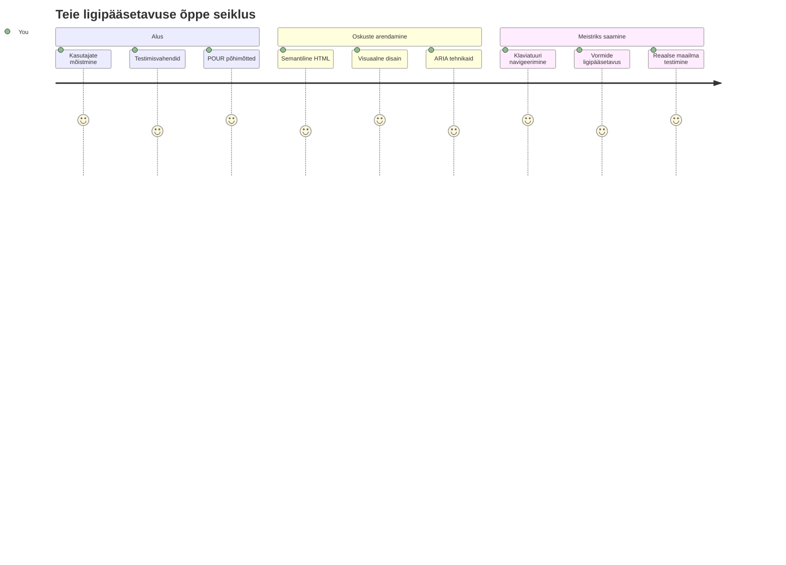
## Eelloengu Test
[Eelloengu test](https://ff-quizzes.netlify.app/web/)

> Veebi jõud peitub selle universaalsuses. Ligipääs kõigile, sõltumata puuetest, on oluline aspekt.
>
> \- Sir Timothy Berners-Lee, W3C direktor ja Maailma Liiduveebi leiutaja

Siin on midagi, mis võib sind üllatada: kui ehitad ligipääsetavaid veebisaite, siis sa ei aita mitte ainult puuetega inimesi — sa teed veebist tegelikult parema paiga kõigile!

Oled märganud neid äärekivide lõike tänavanurkadel? Need olid algselt mõeldud ratastoolidele, aga nüüd aitavad nad lapsevankritega inimesi, kullerite platside kandjaid, rändureid veerelkohvriga ja rattureid. Täpselt nii toimib ligipääsetav veebidisain — lahendused, mis aitavad ühte gruppi, kasu toovad lõpuks kõigile. Lahe, eks?

Selles õppetükis uurime, kuidas luua veebisaite, mis tõeliselt toimivad kõigile, ükskõik kuidas nad veebi sirvivad. Sa avastad praktilisi tehnikaid, mis on juba veebistandarditesse sisse ehitatud, saad käed külge testimisvahenditega ja näed, kuidas ligipääsetavus muudab su saidid lihtsamini kasutatavaks kõigile kasutajatele.

Pärast seda õppetundi on sul kindlustunne teha ligipääsetavus oma arendustöövoo loomulikuks osaks. Kas oled valmis uurima, kuidas läbimõeldud disainiotsused võivad veebile ligipääsu avada miljarditele kasutajatele? Sukeldume!

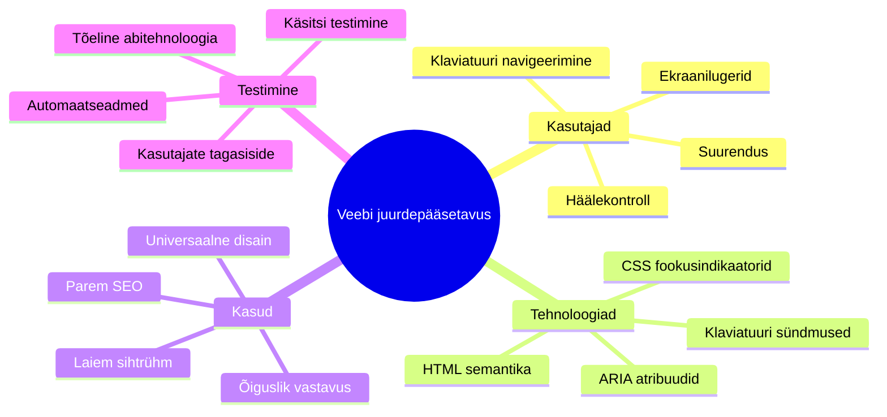
> Selle õppetunni saad teha [Microsoft Learnis](https://docs.microsoft.com/learn/modules/web-development-101/accessibility/?WT.mc_id=academic-77807-sagibbon)!

## Puuetega Inimeste Abitehnoloogiate Mõistmine

Enne kui koodimisele tormame, võtame hetke, et mõista, kuidas inimesed erinevate võimetega tegelikult veebi kogevad. See pole pelgalt teooria — nende reaalses maailmas toimuvate navigeerimisviiside mõistmine teeb sinust palju parema arendaja!

Abitehnoloogiad on päris võimsad tööriistad, mis aitavad puuetega inimestel veebis suhelda viisil, mis võib sind üllatada. Kui saad aru, kuidas need tehnikad töötavad, muutub ligipääsetavate veebikogemuste loomine palju intuitiivsemaks. Nagu õpiksid nägema oma koodi kellegi teise pilgu läbi.

### Ekraanilugejad

[Ekraanilugejad](https://en.wikipedia.org/wiki/Screen_reader) on päris keerukad tehnoloogiad, mis muudavad digitaalse teksti kõneks või brailles väljundiks. Kuigi neid kasutavad peamiselt nägemispuudega inimesed, on need väga kasulikud ka õppimisraskustega kasutajatele, näiteks düsleksiaga inimestele.

Mulle meeldib mõelda ekraanilugejat nagu väga nutikat jutustajat, kes raamatut sulle ette loeb. Ta loeb sisu loogilises järjekorras, teatab interaktiivsetest elementidest nagu "nupp" või "link" ja pakub klaviatuurilööke, et lehel kiiresti liikuda. Aga siin on asi – ekraanilugejad saavad imet teha ainult siis, kui ehitame veebilehed korraliku struktuuri ja tähendusliku sisuga. Siin tuleb mängu sinu roll arendajana!

**Populaarsemad ekraanilugejad platvormide lõikes:**
- **Windows**: [NVDA](https://www.nvaccess.org/about-nvda/) (tasuta ja kõige populaarsem), [JAWS](https://webaim.org/articles/jaws/), [Narrator](https://support.microsoft.com/windows/complete-guide-to-narrator-e4397a0d-ef4f-b386-d8ae-c172f109bdb1/?WT.mc_id=academic-77807-sagibbon) (sisseehitatud)
- **macOS/iOS**: [VoiceOver](https://support.apple.com/guide/voiceover/welcome/10) (sisseehitatud ja väga võimas)
- **Android**: [TalkBack](https://support.google.com/accessibility/android/answer/6283677) (sisseehitatud)
- **Linux**: [Orca](https://wiki.gnome.org/Projects/Orca) (tasuta ja avatud lähtekoodiga)

**Kuidas ekraanilugejad veebisisu navigeerivad:**

Ekraanilugejad pakuvad mitmeid navigeerimismeetodeid, mis muudavad sirvimise kogenud kasutajatele tõhusaks:
- **Järjekohane lugemine**: Loeb sisu ülesvalt alla, nagu raamatu järgimine
- **Maamärkide navigeerimine**: Hüppa lehe sektsioonide vahel (päis, navigeerimine, põhiosa, jalus)
- **Pealkirjade navigeerimine**: Vaheta pealkirjade vahel, et mõista lehe ülesehitust
- **Lingiloendid**: Koosta loend kõigist linkidest kiireks ligipääsuks
- **Vormikontrollid**: Navigeeri otse sisendväljade ja nuppude vahel

> 💡 **Siin on midagi, mis pani mind imestama**: 68% ekraanilugejate kasutajatest navigeerib peamiselt pealkirjade abil ([WebAIM uuring](https://webaim.org/projects/screenreadersurvey9/#finding)). See tähendab, et sinu pealkirjastruktuur on kasutajatele nagu maakaart — kui sa selle õigesti teed, aitad inimestel su sisu kiiremini leida!

### Testimisprotsessi ülesseadmine

Siin on häid uudiseid — tõhus ligipääsetavuse testimine ei pea olema üle jõu käiv! Sooviksid ühendada automatiseeritud tööriistad (need tabavad suurepäraselt silmatorkavaid vigu) mõningase praktilise testimisega. Siin on meetod, mis minu kogemuse põhjal haarab kõige rohkem vigu ilma terve päeva ära söömata:

**Oluline käsitsi testimise töövoog:**

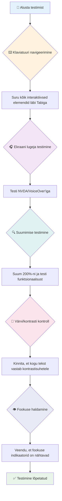
**Testimise samm-sammult kontrollnimekiri:**
1. **Klaviatuuri navigeerimine**: Kasuta ainult Tab, Shift+Tab, Enter, Space ja nooleklahve
2. **Ekraanilugeja testimine**: Lülita sisse NVDA, VoiceOver või Narrator ja navigeeri silmad kinni
3. **Suumimise testimine**: Testi 200% ja 400% suumitasemel
4. **Värvikontrastsuse kontroll**: Kontrolli kogu teksti ja kasutajaliidese komponente
5. **Fookuse indikaatori testimine**: Veendu, et kõigil interaktiivsetel elementidel on nähtavad fookuse seisundid

✅ **Alusta Lighthouse'iga**: Ava oma brauseri arendustööriistad, tee Lighthouse'i ligipääsetavuse audit, siis kasuta tulemusi, et suunata oma käsitsi testimise fookust.

### Suumimise ja suurendamise tööriistad

Sa tead, kuidas vahel sõrmede kokkusurumisega telefoni teksti suumid, kui see liiga väike on, või kuidas päiksevalguses arvutiekraani pigistad? Paljud kasutajad toetuvad suurendamisse, et muuta sisu iga päev loetavaks. See hõlmab nägemispuudega inimesi, vanemaid täiskasvanuid ja kõiki, kes on proovinud veebi lugeda väljas.

Kaasaegsed suumitehnoloogiad on arenenud kaugemale ainult suurendamast. Mõistmine, kuidas need tööriistad toimivad, aitab sul luua reageerivaid disaine, mis on funktsionaalsed ja atraktiivsed ka suumitasemel.

**Kaasaegsed brauseri suumivõimalused:**
- **Lehe suum**: Skaalab kogu sisu proportsionaalselt (tekst, pildid, paigutus) - see on eelistatud meetod
- **Ainult teksti suum**: Suurendab fonti, säilitades originaalse paigutuse
- **Sõrmede kokkusurumisel suumimine ("pinch-to-zoom")**: Mobiilne žest ajutiseks suumiks
- **Brauseri tugi**: Kõik moodsad brauserid toetavad kuni 500% suurendust ilma funktsionaalsust rikkumata

**Spetsiaalsed suurendustarkvarad:**
- **Windows**: [Magnifier](https://support.microsoft.com/windows/use-magnifier-to-make-things-on-the-screen-easier-to-see-414948ba-8b1c-d3bd-8615-0e5e32204198) (sisseehitatud), [ZoomText](https://www.freedomscientific.com/training/zoomtext/getting-started/)
- **macOS/iOS**: [Zoom](https://www.apple.com/accessibility/mac/vision/) (sisseehitatud koos täiustatud funktsioonidega)

> ⚠️ **Disaini kaalutlus**: WCAG nõuab, et sisu jääks funktsionaalseks 200% suumimisel. Sellel tasemel peaks horisontaalne kerimine olema minimaalne ja kõik interaktiivsed elemendid peaksid jääma ligipääsetavaks.

✅ **Testeeri oma reageerivat disaini**: Suumiprograami oma brauser 200% ja 400% peale. Kas paigutus kohaneb sujuvalt? Kas saad ligipääsu kõigile funktsioonidele ilma liigse kerimiseta?

## Kaasaegsed Ligipääsetavuse Testimisriistad

Nüüd kui sul on aru saada, kuidas inimesed abitehnoloogiatega veebis navigeerivad, uurime tööriistu, mis aitavad sul luua ja testida ligipääsetavaid veebisaite.

Mõtle nii: automatiseeritud tööriistad tabavad hästi silmatorkavaid vigu (nagu puuduva alt-teksti), samas praktiline testimine tagab, et su sait on päriselus hästi kasutatav. Koos annavad need kindlustunde, et su saidid töötavad kõigi jaoks.

### Värvikontrasti testimine

Siin on häid uudiseid: värvikontrastsus on üks levinumaid ligipääsetavusprobleeme, aga ka üks lihtsamaid parandada. Hea kontrastsus aitab kõiki — nägemispuudega kasutajaid ja inimesi, kes püüavad lugeda telefoni rannas.

**WCAG kontrasti nõuded:**

| Teksti tüüp | WCAG AA (minimaalne) | WCAG AAA (täiustatud) |
|-------------|----------------------|----------------------|
| **Tavaline tekst** (alla 18pt) | 4.5:1 kontrastisuhe | 7:1 kontrastisuhe |
| **Suur tekst** (18pt+ või 14pt+ paks) | 3:1 kontrastisuhe | 4.5:1 kontrastisuhe |
| **Kasutajaliidese komponendid** (nupud, vormide ääred) | 3:1 kontrastisuhe | 3:1 kontrastisuhe |

**Olulised testimise tööriistad:**
- [Colour Contrast Analyser](https://www.tpgi.com/color-contrast-checker/) - lauaarvuti rakendus koos värvipipetiga
- [WebAIM Contrast Checker](https://webaim.org/resources/contrastchecker/) - veebipõhine kohe tagasisidega
- [Stark](https://www.getstark.co/) - disainitööriistade plugin Figma, Sketch, Adobe XD jaoks
- [Accessible Colors](https://accessible-colors.com/) - Leia ligipääsetavad värvipaletid

✅ **Loo paremaid värvikombinatsioone**: Alusta oma brändi värvidest ja kasuta kontrastikontrollereid, et luua ligipääsetavad variandid. Dokumenteeri need oma disainisüsteemi ligipääsetavate värviont tokenitena.

### Ulatuslik ligipääsetavuse audit

Kõige tõhusam ligipääsetavuse testimine ühendab mitmeid lähenemisi. Ükski tööriist ei kata kõike, seega mitmekesine testimisrutiin tagab põhjaliku katvuse.

**Brauseripõhine testimine (arendustööriistades):**
- **Chrome/Edge**: Lighthouse'i ligipääsetavuse audit + Ligipääsetavuse paneel
- **Firefox**: Ligipääsetavuse inspekteerija koos detailse puuvaatega
- **Safari**: Web Inspectori auditivahekaart koos VoiceOver simulatsiooniga

**Professionaalsed testimislaiendid:**
- [axe DevTools](https://www.deque.com/axe/devtools/) - tööstusharu standard automatiseeritud testimiseks
- [WAVE](https://wave.webaim.org/extension/) - visuaalne tagasiside veaparandustega
- [Accessibility Insights](https://accessibilityinsights.io/) - Microsofti ulatuslik testimiskomplekt

**Käsurea ja CI/CD integreerimine:**
- [axe-core](https://github.com/dequelabs/axe-core) - JavaScripti teek automatiseeritud testimiseks
- [Pa11y](https://pa11y.org/) - käsurea ligipääsetavuse testimise tööriist
- [Lighthouse CI](https://github.com/GoogleChrome/lighthouse-ci) - Automatiseeritud ligipääsetavuse skoor

> 🎯 **Testimise eesmärk**: Seadke Lighthouse'i ligipääsetavuse skooriks vähemalt 95+. Pea meeles, et automatiseeritud tööriistad tabavad ligikaudu 30-40% ligipääsetavusprobleemidest — käsitsi testimine on ikkagi hädavajalik!

### 🧠 **Testimisoskuste Kontroll: Kas oled valmis probleemide leidmiseks?**

**Vaatame, kuidas sa tunned end ligipääsetavuse testimisega:**
- Milline testimismeetod tundub sulle praegu kõige ligipääsetavam?
- Kas suudad ette kujutada terve päeva ainult klaviatuuriga navigeerimist?
- Mis on üks ligipääsetavustakistus, millega oled isiklikult veebis kokku puutunud?

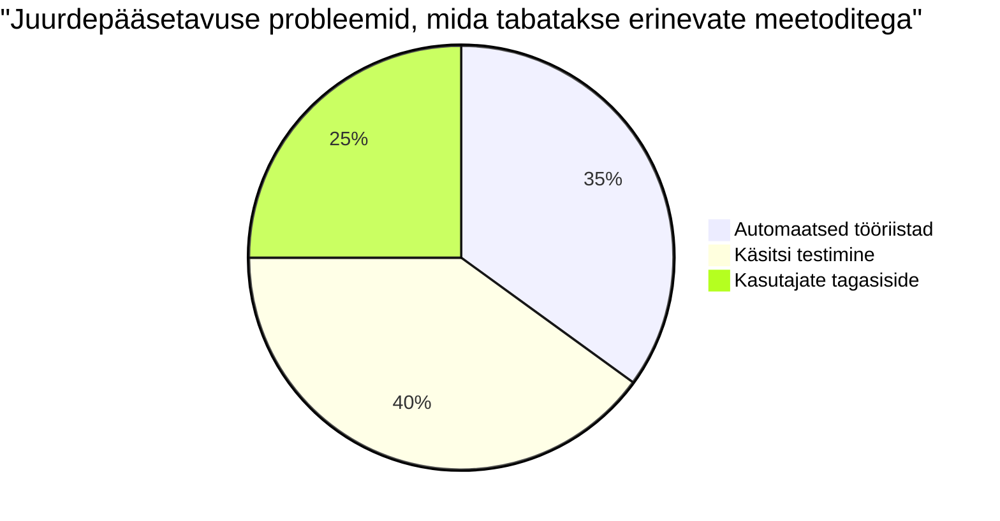
> **Enesekindluse tõstja**: Professionaalsed ligipääsetavuse testijad kasutavad seda täpset meetodite kombinatsiooni. Sa õpid tööstusharu parimaid tavasid!

## Ligipääsetavuse Loomine Algusest Lõpuni

Edu võti ligipääsetavuses on see sisse ehitada juba algusest peale. Ma tean, et on ahvatlev mõelda "ma lisan ligipääsetavuse hiljem", aga see on nagu üritada lisada trepipakett majale, mis on juba valmis ehitatud. Võimalik? Jah. Lihtne? Mitte päris.

Mõtle ligipääsetavusele nagu majaplaanimisele — palju lihtsam on arvestada ratastooliga ligipääsuga oma esialgsetes arhitektuuriplaanides kui hiljem kõike ümber kohandada.

### POUR põhimõtted: Sinu ligipääsetavuse alus

Veebisisu ligipääsetavuse juhised (WCAG) põhinevad neljal põhimõttel, mis moodustavad akronüümi POUR. Ära muretse — need pole kuivlikud akadeemilised mõisted! Tegelikult on need praktilised juhendid, kuidas luua sisu, mis töötab kõigile.

Kui oled POUR põhimõtted selgeks saanud, muutub ligipääsetavuse otsuste tegemine palju loomulikumaks. Nagu oleks sul vaimne kontrollnimekiri, mis juhib sinu disainivalikuid. Vaatame üle:

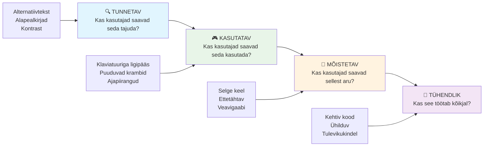
**🔍 Tajutav**: Info peab olema esitatav viisil, mida kasutajad saavad tajuda oma olemasolevate meelte kaudu

- Paku tekstialternatiive mitte-tekstuaalsele sisule (pildid, videod, heli)
- Tagada piisav värvikontrastsus kogu teksti ja kasutajaliidese komponentide puhul
- Paku subtiitreid ja transkriptsioone multimeediale
- Disaini sisu, mis jääb funktsionaalseks suumides kuni 200%
- Kasuta mitmeid meelelisi omadusi (mitte ainult värvi), et edastada infot

**🎮 Juhtitav**: Kõik liidese komponendid peavad olema juhitavad olemasolevate sisendmeetodite kaudu

- Tee kogu funktsionaalsus ligipääsetav klaviatuuriga navigeerides
- Anna kasutajatele piisavalt aega sisu lugemiseks ja suhtlemiseks
- Väldi sisu, mis võib põhjustada krampe või vestibulaarseid häireid
- Aita kasutajatel navigeerida tõhusalt selge struktuuri ja maamärkidega
- Tagada interaktiivsetel elementidel piisavalt suured sihtmärgid (vähemalt 44px)

**📖 Mõistetav**: Info ja liidese toimimine peavad olema arusaadavad ja selged

- Kasuta selget, lihtsat keelt, mis sobib sinu sihtgrupile
- Tagada, et sisu ilmub ja toimib etteaimatavalt ja järjepidevalt
- Paku selgeid juhiseid ja veateateid kasutaja sisendi jaoks
- Aita kasutajatel mõista ja parandada vormides tehtud vigu
- Korralda sisu loogilise lugemiskorra ja infosõltuvusega

**💪 Tugev**: Sisu peab töötama usaldusväärselt erinevate tehnoloogiate ja abiseadmetega

- **Kasuta valide ja semantilist HTML-i oma aluseks**
- **Tagada ühilduvus praeguste ja tulevaste abitehnoloogiatega**
- **Järgi veebistandardeid ja parimaid tavasid märgistamisel**
- **Testi erinevates brauserites, seadmetes ja abivahenditega**
- **Struktureeri sisu nii, et keerukate funktsioonide puudumisel see siiski ladusalt toimiks**

### 🎯 **POUR põhimõtete kontroll: Kinnitus**

**Kiire ülevaade alustaladest:**
- Kas suudad meenutada mõnda veebisaidi funktsiooni, mis rikub iga POUR põhimõtte?
- Milline põhimõte tundub sulle arendajana kõige loomulikum?
- Kuidas võiksid need põhimõtted parandada disaini kõigile, mitte ainult puuetega kasutajatele?

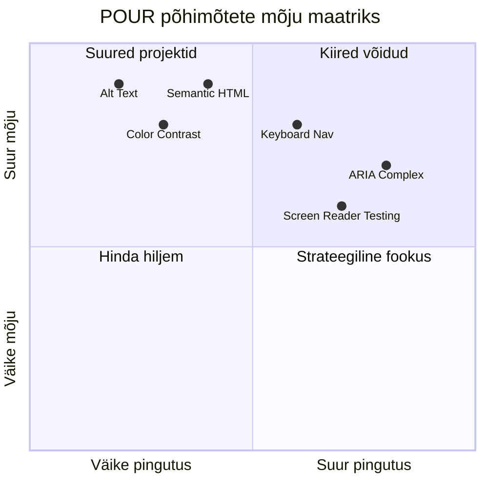
> **Pea meeles**: Alusta suurima mõjuga ja vähese pingutusega parendustest. Semantiline HTML ja alternatiivtekst annavad suurima ligipääsetavuse tõusu vähima vaevaga!

## Ligipääsetava visuaalse disaini loomine

Hea visuaalne disain ja ligipääsetavus käivad käsikäes. Kui kujundad mõttega ligipääsetavusest, avastad sageli, et need piirangud viivad puhtamate ja elegantsemate lahendusteni, mis kasuks tulevad kõigile kasutajatele.

Vaatame, kuidas luua visuaalselt atraktiivseid kujundusi, mis töötavad kõigi jaoks sõltumata nende nägemisvõimest või tingimustest, milles nad su sisu vaatavad.

### Värvi- ja visuaalse ligipääsetavuse strateegiad

Värv on võimas suhtlusvahend, kuid see ei tohiks kunagi olla ainus viis olulise info edastamiseks. Kujundamine, mis ei tugine üksnes värvile, loob vastupidavamaid ja kaasavamaid kogemusi, mis toimivad rohkemates olukordades.

**Kujunda värvinägemise erinevusi arvestades:**

Umbes 8% meestest ja 0,5% naistest on mingisugune värvinägemise erinevus (sage nimetus "värvipimedus"). Kõige tavalisemad tüübid on:
- **Deuteranoopia**: raskusi punase ja rohelise eristamisel
- **Protanoopia**: punane tundub tuhmim
- **Tritanoopia**: raskused sinise ja kollasega (harva esinev)

**Kaasaegsed värvistrateegiad:**

```css
/* ❌ Bad: Using only color to indicate status */
.error { color: red; }
.success { color: green; }

/* ✅ Good: Color plus icons and context */
.error {
  color: #d32f2f;
  border-left: 4px solid #d32f2f;
}
.error::before {
  content: "⚠️";
  margin-right: 8px;
}

.success {
  color: #2e7d32;
  border-left: 4px solid #2e7d32;
}
.success::before {
  content: "✅";
  margin-right: 8px;
}
```

**Üle põhiliste kontrastinõuete:**
- Testi värvivalikuid värvipimeduse simulaatoritega
- Kasuta värvi kõrval mustreid, tekstuure või kujundeid
- Veendu, et interaktiivsed olekud oleksid ilma värvita eristatavad
- Mõtle, kuidas sinu disain näeb välja kõrge kontrasti režiimis

✅ **Testi oma värvide ligipääsetavust**: Kasuta tööriistu nagu [Coblis](https://www.color-blindness.com/coblis-color-blindness-simulator/), et näha, kuidas su leht erinevate värvinägemise tüüpi kasutajatele paistab.

### Fookuse indikaatorid ja interaktsioonidisain

Fookuse indikaatorid on digitaalne vastendus kursorile – nad näitavad klaviatuuri kasutajatele, kus nad lehel asuvad. Hästi disainitud fookuse indikaatorid parandavad kogemust kõigile, muutes interaktsioonid selgeteks ja etteaimatavaks.

**Kaasaegsed fookuse indikaatori parimad tavad:**

```css
/* Enhanced focus styles that work across browsers */
button:focus-visible {
  outline: 2px solid #0066cc;
  outline-offset: 2px;
  box-shadow: 0 0 0 4px rgba(0, 102, 204, 0.25);
}

/* Remove focus outline for mouse users, preserve for keyboard users */
button:focus:not(:focus-visible) {
  outline: none;
}

/* Focus-within for complex components */
.card:focus-within {
  box-shadow: 0 0 0 3px rgba(74, 144, 164, 0.5);
  border-color: #4A90A4;
}

/* Ensure focus indicators meet contrast requirements */
.custom-focus:focus-visible {
  outline: 3px solid #ffffff;
  outline-offset: 2px;
  box-shadow: 0 0 0 6px #000000;
}
```

**Fookuse indikaatori nõuded:**
- **Nähtavus**: vähemalt 3:1 kontrast ümbritsevate elementidega
- **Laius**: vähemalt 2px paksune kogu elemendi ümber
- **Püsivus**: peab jääma nähtavaks kuni fookus liigub mujale
- **Erinevus**: peab visuaalselt eristuma teistest UI olekutest

> 💡 **Disaininipp**: Heledad fookuse indikaatorid kasutavad sageli ühisena joonist, varjutust ja värvimuutusi, et tagada nähtavus erinevatel taustadel ja kontekstides.

✅ **Audit fookuse indikaatorid**: Liigu oma veebilehel Tab-klahviga ja märgi ära, millistel elementidel on selged fookuse indikaatorid. Kas mõni on raske märgata või puudub täielikult?

### Semantiline HTML: Ligipääsetavuse alus

Semantiline HTML on nagu GPS süsteem abitehnoloogiatele sinu veebisaidil. Kui kasutad HTML elemente nende otstarbe järgi, annad ekraanilugeritele, klaviatuuridele ja teistele tööriistadele detailse kaardi kasutajate tõhusaks navigeerimiseks.

Siin on analoogia, mis mulle hästi sobis: semantiline HTML on nagu hästi organiseeritud raamatukogu selgete kategooriate ja abimärkidega, vastandina laoplatsile, kus raamatud on suvaliselt laiali. Mõlemas kohas on samad raamatud, aga kumma juures oleks sul kergem midagi leida? Just nii!

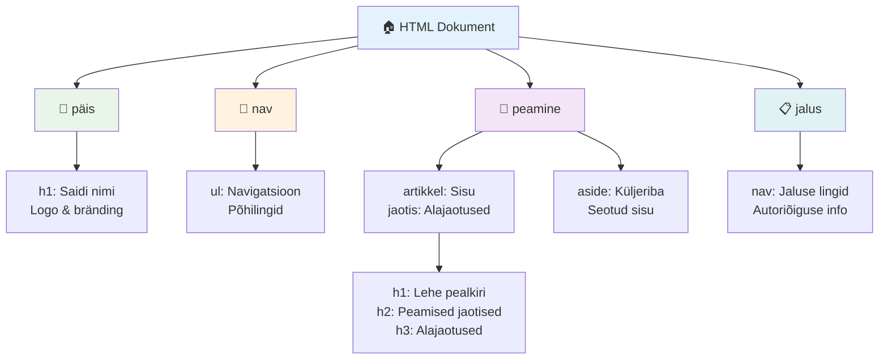
**Ligipääsetava lehekülje struktuuri ehituskivid:**

```html
<!-- Landmark elements provide page navigation structure -->
<header>
  <h1>Your Site Name</h1>
  <nav aria-label="Main navigation">
    <ul>
      <li><a href="/home">Home</a></li>
      <li><a href="/about">About</a></li>
      <li><a href="/services">Services</a></li>
    </ul>
  </nav>
</header>

<main>
  <article>
    <header>
      <h1>Article Title</h1>
      <p>Published on <time datetime="2024-10-14">October 14, 2024</time></p>
    </header>
    
    <section>
      <h2>First Section</h2>
      <p>Content that relates to this section...</p>
    </section>
    
    <section>
      <h2>Second Section</h2>
      <p>More related content...</p>
    </section>
  </article>
  
  <aside>
    <h2>Related Links</h2>
    <nav aria-label="Related articles">
      <ul>
        <li><a href="/related-1">First related article</a></li>
        <li><a href="/related-2">Second related article</a></li>
      </ul>
    </nav>
  </aside>
</main>

<footer>
  <p>&copy; 2024 Your Site Name. All rights reserved.</p>
  <nav aria-label="Footer links">
    <ul>
      <li><a href="/privacy">Privacy Policy</a></li>
      <li><a href="/contact">Contact Us</a></li>
    </ul>
  </nav>
</footer>
```

**Miks semantiline HTML muudab ligipääsetavust:**

| Semantiline element | Otstarve | Ekraanilugeja kasu |
|---------------------|----------|--------------------|
| `<header>` | Lehe või sektsiooni päis | "Banner landmark" - kiire navigeerimine ülesse |
| `<nav>` | Navigeerimislingid | "Navigation landmark" - navigeerimisosade nimekiri |
| `<main>` | Peamine lehe sisu | "Main landmark" - otse sisu juurde liikumine |
| `<article>` | Iseteemaline sisu | Märgistab artikli piirid |
| `<section>` | Teemaarendused | Annab sisustruktuuri |
| `<aside>` | Seotud külginfo | "Complementary landmark" |
| `<footer>` | Lehe või sektsiooni jalus | "Contentinfo landmark" |

**Ekraanilugerite supervõimed semantilise HTML-ga:**
- **Maamärkide kasutamine**: hüppa kiirelt lehe suuremate sektsioonide vahel
- **Pealkirjade skeemid**: loo sisukord pealkirjastruktuurist
- **Elementide nimekirjad**: genereeri nimekiri kõigist linkidest, nuppudest või vormikontrollidest
- **Kontekstitundlikkus**: mõista sisusektsioonide omavahelisi suhteid

> 🎯 **Kiire test**: Proovi oma veebilehel ekraanilugeriga navigeerida maamärkide otseteede (D maamärkide puhul, H pealkirjade puhul, K linkide puhul NVDA/JAWS-is) abil. Kas navigeerimine on arusaadav?

### 🏗️ **Semantilise HTML meistrikontroll: tugeva aluse ehitamine**

**Hindame sinu semantilist mõistmist:**
- Kas suudad HTML-i vaadates määrata lehekülje maamärgid?
- Kuidas seletaksid sõbrale vahet `<section>` ja `<div>` vahel?
- Mis on esimene asi, mida kontrollid, kui ekraaniluger kasutaja teatab navigeerimisraskustest?

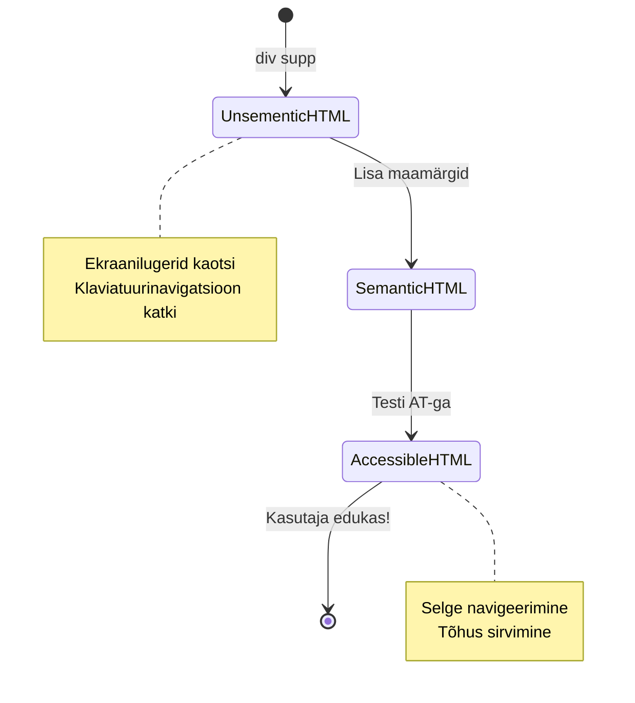
> **Profi tip**: Hea semantiline HTML lahendab umbes 70% ligipääsetavuse probleemidest automaatselt. Valda see alus ja oled õigel teel!

✅ **Audit oma semantilist struktuuri**: Kasuta brauseri DevToolsi Accessibility paneeli, et vaadata ligipääsetavuse puud ja veendu, et sinu märgend loob loogilise ülesehituse.

### Pealkirjade hierarhia: loogilise sisukorra loomine

Pealkirjad on ligipääsetavas sisus üliolulised — nagu selgroog, mis hoiab kõike koos. Ekraanilugerite kasutajad loodavad tugevalt pealkirjadele, et sisu mõista ja navigeerida. Mõtle sellele kui sisukorra pakkumisele oma lehele.

**Pealkirjade reegel on kuldne:**
Ära vahele jäta tasemeid. Liigu alati loogiliselt `<h1>`-st `<h2>`-le ja seejärel `<h3>`-le jne. Mäletad koolis jooniste tegemist? Täpselt sama põhimõte — sa ei hüppaks otseselt "I. Peapunkt" alt "C. Alam-alam-punkti" juurde ilma vahepealse "A. Alampunktita", eks?

**Täiuslik pealkirjastruktuur näide:**

```html
<!-- ✅ Excellent: Logical, hierarchical progression -->
<main>
  <h1>Complete Guide to Web Accessibility</h1>
  
  <section>
    <h2>Understanding Screen Readers</h2>
    <p>Introduction to screen reader technology...</p>
    
    <h3>Popular Screen Reader Software</h3>
    <p>NVDA, JAWS, and VoiceOver comparison...</p>
    
    <h3>Testing with Screen Readers</h3>
    <p>Step-by-step testing instructions...</p>
  </section>
  
  <section>
    <h2>Color and Contrast Guidelines</h2>
    <p>Designing with sufficient contrast...</p>
    
    <h3>WCAG Contrast Requirements</h3>
    <p>Understanding the different contrast levels...</p>
    
    <h3>Testing Tools and Techniques</h3>
    <p>Tools for verifying contrast ratios...</p>
  </section>
</main>
```

```html
<!-- ❌ Problematic: Skipping levels, inconsistent structure -->
<h1>Page Title</h1>
<h3>Subsection</h3> <!-- Skipped h2 -->
<h2>This should come before h3</h2>
<h1>Another main heading?</h1> <!-- Multiple h1s -->
```

**Pealkirjade parimad tavad:**
- **Üks `<h1>` lehe kohta**: tavaliselt peamine lehe pealkiri või peamine sisuteema
- **Loogiline järjepidevus**: kunagi ära jäta tasandeid vahele (h1 → h2 → h3, mitte h1 → h3)
- **Kirjeldav sisu**: tee pealkirjad mõistetavaks ka kontekstist eraldatult loetuna
- **Visuaalne kujundus CSS-iga**: kasuta CSS-i välimuse jaoks, HTML tasemeid struktuuri jaoks

**Ekraanilugerite navigeerimise statistika:**
- 68% ekraanilugerite kasutajatest navigeerib pealkirjade järgi ([WebAIM Survey](https://webaim.org/projects/screenreadersurvey9/#finding))
- Kasutajad ootavad loogilist pealkirjaskeemi
- Pealkirjad on kiireim viis lehe struktuuri mõistmiseks

> 💡 **Profi nõuanne**: Kasuta brauserilaiendit nagu "HeadingsMap", et visualiseerida oma pealkirjastruktuuri. See peaks lugema nagu hästi organiseeritud sisukord.

✅ **Testi oma pealkirjastruktuuri**: Kasuta ekraanilugeri pealkirjade navigeerimist (H-klahv NVDA-s), et hüpata pealkirjade vahel. Kas struktuur jutustab sisu loogilise loo?

### Täiustatud visuaalse ligipääsetavuse tehnikad

Lisaks põhilisele kontrastile ja värvile on olemas keerukamaid võtteid, mis aitavad luua tõeliselt kaasavaid visuaalseid kogemusi. Need meetodid tagavad, et su sisu töötab erinevates vaatamistingimustes ja abitehnoloogiates.

**Olulised visuaalse suhtluse strateegiad:**

- **Mitme-meediumiline tagasiside**: ühenda visuaalsed, tekstilised ja vahel helilised märguanded
- **Progressiivne info tutvustus**: esita info seeditavate tükkidena
- **Järjepidevad interaktsioonimustrid**: kasuta tuttavaid kasutajaliidese konventsioone
- **Reageeriv tüpograafia**: skaala teksti sobivalt erinevatel seadmetel
- **Laadimise ja vigade olekud**: anna selget tagasisidet kasutaja toimingute kohta

**Ligipääsetavust parandavad CSS utiliidid:**

```css
/* Screen reader only text - visually hidden but accessible */
.sr-only {
  position: absolute;
  width: 1px;
  height: 1px;
  padding: 0;
  margin: -1px;
  overflow: hidden;
  clip: rect(0, 0, 0, 0);
  white-space: nowrap;
  border: 0;
}

/* Skip link for keyboard navigation */
.skip-link {
  position: absolute;
  top: -40px;
  left: 6px;
  background: #000000;
  color: #ffffff;
  padding: 8px 16px;
  text-decoration: none;
  border-radius: 4px;
  font-weight: bold;
  transition: top 0.3s ease;
  z-index: 1000;
}

.skip-link:focus {
  top: 6px;
}

/* Reduced motion respect */
@media (prefers-reduced-motion: reduce) {
  .skip-link {
    transition: none;
  }
  
  * {
    animation-duration: 0.01ms !important;
    animation-iteration-count: 1 !important;
    transition-duration: 0.01ms !important;
  }
}

/* High contrast mode support */
@media (prefers-contrast: high) {
  .button {
    border: 2px solid;
  }
}
```

> 🎯 **Ligipääsetavuse muster**: "Vahelejäämise link" on ülioluline klaviatuuri kasutajatele. See peaks olema lehel esimene fookusvõimeline element ja viivitamatult hüppama peamise sisu juurde.

✅ **Lisa vahelejäämise navigeerimine**: lisa lehtedele skip lingid ja testi neid Tab-klahvi vajutades kohe lehe laadimisel. Need peaksid ilmuma ja võimaldama hüpata peamise sisu juurde.

## Sisukate lingitekstide loomine

Lingid on veebimaailma põhitähtsad ühendusteejuhid, kuid halvasti kirjutatud lingitekst on nagu tänavamärgi asemel vaid "Koht". Ei ole eriti kasulik, eks?

Asi, mis mind esimesel kuulamisel vapustas: ekraanilugerid suudavad kõik lehe lingid eraldi välja võtta ja kuvada need üheks suureks nimekirjaks. Kujuta ette, kui keegi annaks sulle kõigi oma lehe linkide kataloogi. Kas iga link annaks üksi mõistliku tähenduse? Sellest peab su lingitekst läbi saama!

### Linginavigationi mustrite mõistmine

Ekraanilugeritel on võimsad linginavigatsiooni võimalused, mis tuginevad hästi kirjutatud lingitekstile:

**Linginavigatsiooni meetodid:**
- **Järjestikune lugemine**: lingid loetakse kontekstis koos muu sisuga
- **Linkide nimekirja genereerimine**: kõik lehe lingid koondatakse otsitavasse kataloogi
- **Kiirnavigeerimine**: hüppa linkide vahel klaviatuuri otseteedega (K NVDA-s)
- **Otsingufunktsioon**: leia konkreetsed lingid osalise teksti järgi

**Miks kontekst on oluline:**
Kui ekraanilugeri kasutaja genereerib linginimekirja, näeb ta midagi sellist:
- "Laadi aruanne"
- "Loe edasi"
- "Vajuta siia"
- "Privaatsuspoliitika"
- "Vajuta siia"

Ainult kaks neist linkidest annavad kasulikku infot väljaspool konteksti!

> 📊 **Kasutajakogemuse mõju**: Ekraanilugerite kasutajad skaneerivad linkide nimekirju, et kiiresti mõista lehe sisu. Üldised lingitekstid sunnivad neid navigeerima tagasi iga lingi algse konteksti juurde, mis aeglustab oluliselt sirvimist.

### Levinud lingiteksti vead, mida vältida

Mõistmine, mis ei toimi, aitab sul ligipääsetavusprobleeme olemasolevas sisus märgata ja parandada.

**❌ Üldised lingitekstid, mis konteksti ei anna:**

```html
<!-- Meaningless when read from a link list -->
<p>Our sustainability efforts are detailed in our recent report. 
   <a href="/sustainability-2024.pdf">Click here</a> to view it.</p>

<!-- Repeated generic text throughout the page -->
<div class="article-card">
  <h3>Web Accessibility Guide</h3>
  <p>Learn the fundamentals...</p>
  <a href="/accessibility-guide">Read more</a>
</div>
<div class="article-card">
  <h3>Color Contrast Tips</h3>
  <p>Improve your design...</p>
  <a href="/color-contrast">Read more</a>
</div>

<!-- URLs as link text (difficult for screen readers to announce) -->
<p>Visit https://www.w3.org/WAI/WCAG21/quickref/ for WCAG guidelines.</p>

<!-- Vague action words -->
<a href="/contact">Go</a> | <a href="/about">See</a> | <a href="/help">View</a>
```

**Miks need mustrid ebaõnnestuvad:**
- **"Vajuta siia"** ei ütle midagi sihtkoha kohta
- **"Loe edasi"** kordamine tekitab segadust
- **Raw URL-id** on ekraanilugeritele raskesti hääldatavad
- **Ühesõnalised lingid** nagu "Mine" või "Vaata" on kirjelduseta

### Hea lingiteksti kirjutamine

Kirjeldavad lingitekstid on kasulikud kõigile – nägijad saavad lingid kiiresti läbi vaadata ja ekraanilugerite kasutajad mõistavad sihtkohta kohe.

**✅ Selged ja kirjeldavad lingitekstinäited:**

```html
<!-- Descriptive text that explains the destination -->
<p>Our comprehensive <a href="/sustainability-2024.pdf">2024 sustainability report (PDF, 2.1MB)</a> details our environmental initiatives.</p>

<!-- Specific, unique link text for each card -->
<div class="article-card">
  <h3>Web Accessibility Guide</h3>
  <p>Learn the fundamentals of inclusive design...</p>
  <a href="/accessibility-guide">Read our complete web accessibility guide</a>
</div>
<div class="article-card">
  <h3>Color Contrast Tips</h3>
  <p>Improve your design with better color choices...</p>
  <a href="/color-contrast">Explore color contrast best practices</a>
</div>

<!-- Meaningful text instead of raw URLs -->
<p>The <a href="https://www.w3.org/WAI/WCAG21/quickref/">WCAG 2.1 Quick Reference guide</a> provides comprehensive accessibility guidelines.</p>

<!-- Descriptive action links -->
<a href="/contact">Contact our support team</a> | 
<a href="/about">About our company</a> | 
<a href="/help">Get help with your account</a>
```

**Lingiteksti parimad tavad:**
- **Ole konkreetne**: "Laadi kvartali finantsaruanne" vs "Laadi"
- **Lisa failitüüp ja suurus**: "(PDF, 1.2MB)" allalaaditavate failide juures
- **Tõmba tähelepanu, kui link avab uue akna**: "(avab uues aknas)" vajadusel
- **Kasuta aktiivset keelt**: "Võta ühendust" vs "Kontaktleht"
- **Hoia lühidalt**: võimalusel 2-8 sõna

### Täiustatud ligipääsetavad lingimustrid

Mõnikord nõuavad visuaalsed piirangud või tehnilised tingimused erilahendusi. Siin on keerukamad meetodid tavapäraste väljakutsete jaoks:

**ARIA kasutamine paremaks kontekstiks:**

```html
<!-- When button text must be short but needs more context -->
<a href="/report.pdf" 
   aria-label="Download 2024 annual financial report, PDF format, 2.3MB">
  Download Report
</a>

<!-- When the full context comes from surrounding content -->
<h3 id="sustainability-heading">Sustainability Initiative</h3>
<p>Our efforts to reduce environmental impact...</p>
<a href="/sustainability-details" 
   aria-labelledby="sustainability-heading"
   aria-describedby="sustainability-summary">
  Learn more
</a>
<p id="sustainability-summary">Detailed breakdown of our 2024 environmental goals and achievements</p>
```

**Failitüüpide ja välistesse kohtadesse viitamise märkimine:**

```html
<!-- Method 1: Include information in visible link text -->
<a href="/annual-report.pdf">
  Download our 2024 annual report (PDF, 2.3MB)
</a>

<!-- Method 2: Use screen reader-only text for file details -->
<a href="/annual-report.pdf">
  Download our 2024 annual report
  <span class="sr-only">(PDF format, 2.3MB)</span>
</a>

<!-- Method 3: External link indication -->
<a href="https://example.com" 
   target="_blank" 
   aria-describedby="external-link-warning">
  Visit external resource
</a>
<span id="external-link-warning" class="sr-only">
  (opens in new window)
</span>

<!-- Method 4: Using CSS for visual indicators -->
<a href="https://example.com" class="external-link">
  External resource
</a>
```

```css
/* Visual indicator for external links */
.external-link::after {
  content: " ↗";
  font-size: 0.8em;
  color: #666;
}

/* Screen reader announcement for external links */
.external-link::before {
  content: "External link: ";
  position: absolute;
  left: -10000px;
  width: 1px;
  height: 1px;
  overflow: hidden;
}
```

> ⚠️ **Oluline**: Kui kasutad `target="_blank"`, teavita alati kasutajat, et link avaneb uues aknas või vahelehel. Ootamatu navigeerimise muutus võib kasutajat segadusse ajada.

✅ **Testi oma linkide konteksti**: Kasuta brauseri arendustööriistu, et genereerida nimekiri kõigist lehe linkidest. Kas mõistad iga lingi eesmärki ilma ümbritseva kontekstita?

## ARIA: HTML ligipääsetavuse täiendamine

[Accessible Rich Internet Applications (ARIA)](https://developer.mozilla.org/docs/Web/Accessibility/ARIA) on nagu universaalne tõlk sinu keerukate veebirakenduste ja abitehnoloogiate vahel. Kui HTML üksi ei suuda väljendada kõike, mida su interaktiivsed komponendid teevad, täidab ARIA selle lünga.

Mulle meeldib mõelda, et ARIA on nagu abimärkmed sinu HTML-is – nagu näidisskeem teatris, mis aitab näitlejatel rolli ja suhteid paremini mõista.

**Kõige olulisem reegel ARIA kohta on see:** Kasuta alati kõigepealt semantilist HTML-i ja lisa ARIA vaid täienduseks. Mõtle ARIA-le kui maitseainele, mitte pearoale. See peaks sinu HTML struktuuri selgitama ja rikastama, mitte asendama. Alustuseks saa see alus selgeks!

### Strateegiline ARIA rakendamine

ARIA on võimas, kuid suure jõuga kaasneb ka vastutus. Vale ARIA kasutamine võib teha ligipääsetavuse halvemaks kui ARIA puudumine. Siin on, millal ja kuidas seda tõhusalt kasutada:

**✅ Kasuta ARIA-d, kui:**
- Loote kohandatud interaktiivseid vidinaid (akordionid, vahekaardid, karussellid)
- Loote dünaamilist sisu, mis muutub ilma lehe uuesti laadimiseta
- Pakute täiendavat konteksti keerukate UI suhete jaoks
- Märgistate laadimise olekuid või live-sisu uuendusi
- Loote rakenduse-laadseid liideseid kohandatud juhtnuppudega

**❌ Väldi ARIA kasutamist, kui:**
- Tavalised HTML elemendid juba annavad vajaliku semantika
- Sa pole kindel, kuidas seda õigesti rakendada
- See dubleerib semantilise HTML-i poolt juba antud infot
- Sa pole seda reaalselt abitehnoloogiaga katsetanud

> 🎯 **ARIA kuldreegel**: "Ära muuda semantikat, kui pole kõige hädavajalikum; tagada alati klaviatuuri ligipääsetavus; testi alati päris abitehnoloogiaga."
**Viis ARIA kategooriat:**

1. **Rollid**: Mis see element on? (`button`, `tab`, `dialog`)
2. **Omadused**: Millised on selle omadused? (`aria-required`, `aria-haspopup`)
3. **Seisundid**: Milline on selle hetkene olek? (`aria-expanded`, `aria-checked`)
4. **Tähtsad piirkonnad**: Kus see paikneb lehe struktuuris? (`banner`, `navigation`, `main`)
5. **Reaalajas piirkonnad**: Kuidas peaks muutusi teadustama? (`aria-live`, `aria-atomic`)

### Olulised ARIA mustrid kaasaegsetele veebirakendustele

Need mustrid lahendavad kõige levinumad ligipääsetavuse väljakutsed interaktiivsetes veebirakendustes:

**Elementide nimetamine ja kirjeldamine:**

```html
<!-- aria-label: Provides accessible name when visible text isn't sufficient -->
<button aria-label="Close newsletter subscription dialog">×</button>

<!-- aria-labelledby: References existing text as the accessible name -->
<section aria-labelledby="news-heading">
  <h2 id="news-heading">Latest News</h2>
  <!-- news content -->
</section>

<!-- aria-describedby: Links to additional descriptive text -->
<input type="password" 
       aria-describedby="pwd-requirements pwd-strength"
       required>
<div id="pwd-requirements">
  Password must contain at least 8 characters, including uppercase, lowercase, and numbers.
</div>
<div id="pwd-strength" aria-live="polite">
  <!-- Dynamic password strength indicator -->
</div>
```

**Dünaamilise sisu jaoks mõeldud reaalajas piirkonnad:**

```html
<!-- Polite announcements (don't interrupt current speech) -->
<div aria-live="polite" id="status-updates">
  <!-- Status messages appear here -->
</div>

<!-- Assertive announcements (interrupt and announce immediately) -->
<div aria-live="assertive" id="urgent-alerts">
  <!-- Error messages and critical alerts -->
</div>

<!-- Loading states with live regions -->
<button id="submit-btn" aria-describedby="loading-status">
  Submit Application
</button>
<div id="loading-status" aria-live="polite" aria-atomic="true">
  <!-- "Processing your application..." appears here -->
</div>
```

**Interaktiivne vidina näide (akordion):**

```html
<div class="accordion">
  <h3>
    <button aria-expanded="false" 
            aria-controls="panel-1" 
            id="accordion-trigger-1"
            class="accordion-trigger">
      Accessibility Guidelines
    </button>
  </h3>
  <div id="panel-1" 
       role="region"
       aria-labelledby="accordion-trigger-1" 
       hidden>
    <p>WCAG 2.1 provides comprehensive guidelines...</p>
  </div>
</div>
```

```javascript
// JavaScript akordioni oleku haldamiseks
function toggleAccordion(trigger) {
  const panel = document.getElementById(trigger.getAttribute('aria-controls'));
  const isExpanded = trigger.getAttribute('aria-expanded') === 'true';
  
  // Oleku vahetamine
  trigger.setAttribute('aria-expanded', !isExpanded);
  panel.hidden = isExpanded;
  
  // Teavitada ekraanilugejaid muudatustest
  const status = document.getElementById('status-updates');
  status.textContent = isExpanded ? 'Section collapsed' : 'Section expanded';
}
```

### ARIA rakendamise parimad tavad

ARIA on võimas, kuid nõuab hoolikat rakendamist. Nende juhiste järgimine aitab tagada, et sinu ARIA parandab, mitte ei takista ligipääsetavust:

**🛡️ Põhiprintsiibid:**

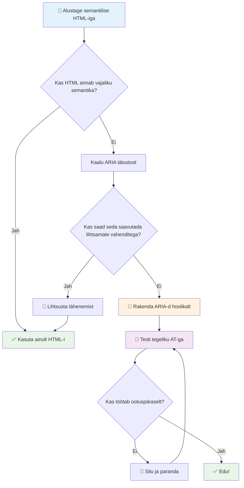
1. **Semantiline HTML esimesena**: Eelista alati `<button>` üle `<div role="button">`
2. **Ära riku semantikat**: Ära muuda olemasoleva HTML tähendust (väldi `<h1 role="button">`)
3. **Hoolitse klaviatuuri ligipääsetavuse eest**: Kõik interaktiivsed ARIA elemendid peavad olema täielikult klaviatuuriga juhitavad
4. **Testi päris kasutajatega**: ARIA tugi varieerub oluliselt abitehnoloogiate vahel
5. **Alusta lihtsast**: Keerulised ARIA rakendused on tõenäolisemalt vigased

**🔍 Testimisprotsess:**

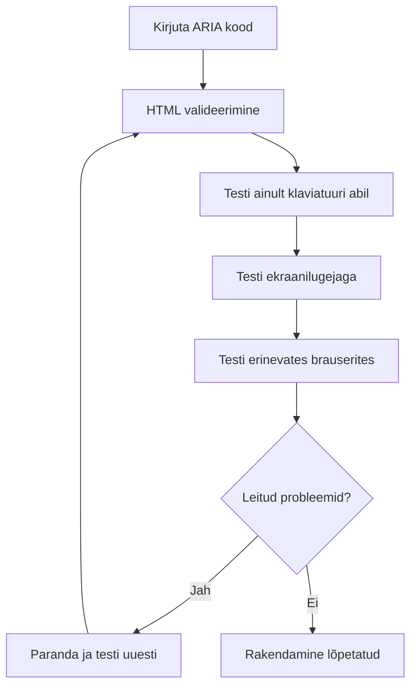
**🚫 Levinud ARIA vead, mida vältida:**

- **Vastuoluline info**: Ära ütle otseselt vastuolus olevat HTML semantikaga
- **Liigne märgistamine**: Liigne ARIA info võib kasutajaid üle koormata
- **Staatiline ARIA**: Unusta ARIA seisundite uuendamine sisumuutuste korral
- **Katsetamata rakendused**: ARIA, mis teoorias töötab, aga praktikas mitte
- **Puuduv klaviatuuri tugi**: ARIA rollid ilma vastavate klaviatuuri interaktsioonideta

> 💡 **Testimisvahendid**: Kasuta automaatseks ARIA valideerimiseks näiteks [accessibility-checker](https://www.npmjs.com/package/accessibility-checker), kuid testi alati päris ekraanilugejatega parima kogemuse saamiseks.

### 🎭 **ARIA oskuste kontroll: Kas oled valmis keerukateks interaktsioonideks?**

**Hinda oma ARIA usaldust:**
- Millal eelistaksid ARIA-d semantilisele HTML-ile? (Vihje: peaaegu kunagi!)
- Kas oskad selgitada, miks `<div role="button">` on tavaliselt halvem kui `<button>`?
- Mis on ARIA testimise juures kõige olulisem meeles pidada?

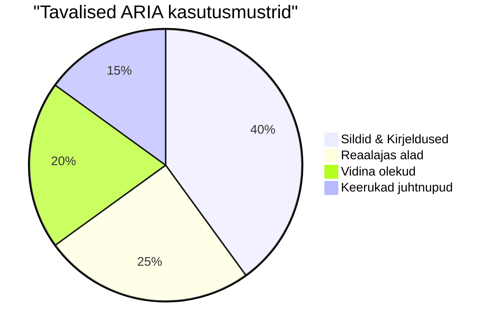
> **Oluline tähelepanek**: Suurem osa ARIA kasutusest on elementide märgistamiseks ja kirjeldamiseks. Keerukad vidinate mustrid on oluliselt harvemad kui võid arvata!

✅ **Õpi ekspertidelt**: Uuri [ARIA Authoring Practices Guide](https://w3c.github.io/aria-practices/), kus on läbi katsetatud mustrid ja keerukate interaktiivsete vidinate rakendused.

## Piltide ja meedia ligipääsetavuse tagamine

Visuaalne ja helisisu on kaasaegsete veebikogemuste olulised osad, kuid need võivad tekitada tõkkeid, kui neid ei tehta hoolikalt. Eesmärk on tagada, et sinu meedia info ja emotsionaalne mõju jõuaks iga kasutajani. Kui selgeks saada, muutub see teiseks loomuseks.

Erinevat tüüpi meedia vajab erinevaid ligipääsetavusmeetodeid. See on nagu kokkamine — sa ei kohtle õrnat kala samamoodi nagu jõulist steiki. Nende erinevuste mõistmine aitab sobiva lahenduse valida igas olukorras.

### Strateegiline piltide ligipääsetavus

Iga pilt sinu veebilehel täidab eesmärki. Selle eesmärgi mõistmine aitab paremini kirjutada alternatiivteksti ja luua kaasavamaid kogemusi.

**Neli pilditüüpi ja nende alt-teksti strateegiad:**

**Informatiivsed pildid** – edastavad olulist infot:
```html

```

**Dekoratiivsed pildid** – puhtalt visuaalsed, informatsioonivabad:
```html

```

**Funktsionaalsed pildid** – toimivad nuppude või kontrolleritena:
```html
<button>
  
</button>
```

**Keerukad pildid** – graafikud, diagrammid, infograafikud:
```html

<div id="chart-description">
  <p>Detailed description: Sales data shows a steady increase across all quarters...</p>
</div>
```

### Video ja heli ligipääsetavus

**Video nõuded:**
- **Subtiitrid**: Tekstiversioon räägitavast sisust ja heliefektidest
- **Audio kirjeldused**: Visuaalsete elementide kirjeldus pimedatele kasutajatele
- **Transkriptsioonid**: Kõigi heliliste ja visuaalsete elementide täielik tekstiversioon

```html
<video controls>
  <source src="video.mp4" type="video/mp4">
  <track kind="captions" src="captions.vtt" srclang="en" label="English">
  <track kind="descriptions" src="descriptions.vtt" srclang="en" label="Audio descriptions">
</video>
```

**Heli nõuded:**
- **Transkriptsioonid**: Kõne sisu tekstiversioon
- **Visuaalsed indikaatorid**: Ainult helisisu puhul visuaalsed vihjed

### Kaasaegsed pilditehnikad

**CSS-iga dekoratiivsete piltide kasutamine:**
```css
.hero-section {
  background-image: url('decorative-hero.jpg');
  /* Decorative images in CSS don't need alt text */
}
```

**Ligipääsetavad responsiivsed pildid:**
```html
<picture>
  <source media="(min-width: 800px)" srcset="large-chart.png">
  <source media="(min-width: 400px)" srcset="medium-chart.png">
  
</picture>
```

✅ **Testi piltide ligipääsetavust**: Kasuta ekraanilugejat ja navigeeri lehel piltidega. Kas saad piisavalt infot, et sisu mõista?

## Klaviatuuriga navigeerimine ja fookuse haldamine

Paljud kasutajad kasutavad veebis navigeerimiseks ainult klaviatuuri. See hõlmab motoorsete puudega inimesi, jõukasutajaid, kes leiavad klaviatuuri hiirest kiiremaks ja kõiki, kelle hiir lakkab töötamast. Veendumine, et sinu sait toimib hästi klaviatuuri kaudu, on oluline ning muudab tihti saidi efektiivsemaks kõigile.

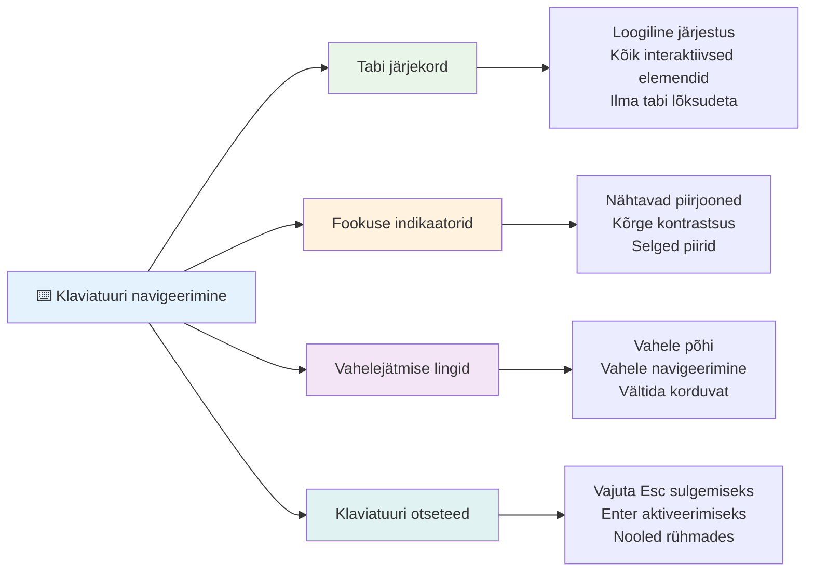
### Olulised klaviatuuri navigeerimise mustrid

**Standardsed klaviatuuri interaktsioonid:**
- **Tab**: Fookuse liigutamine edasi interaktiivsete elementide vahel
- **Shift + Tab**: Fookuse liigutamine tagasi
- **Enter**: Nuppude ja linkide aktiveerimine
- **Space**: Nuppude aktiveerimine, märkeruutude märkimine
- **Nooleklahvid**: Navigeerimine komponendirühmas (raadio nupud, menüüd)
- **Escape**: Modaalide, rippmenüüde sulgemine või operatsioonide tühistamine

### Fookuse haldamise parimad tavad

**Nähtavad fookuse indikaatorid:**
```css
/* Ensure focus is always visible */
button:focus-visible {
  outline: 2px solid #4A90A4;
  outline-offset: 2px;
}

/* Custom focus styles for different components */
.card:focus-within {
  box-shadow: 0 0 0 3px rgba(74, 144, 164, 0.5);
}
```

**Vahelejätmise lingid mugavaks navigeerimiseks:**
```html
<a href="#main-content" class="skip-link">Skip to main content</a>
<a href="#navigation" class="skip-link">Skip to navigation</a>

<nav id="navigation">
  <!-- navigation content -->
</nav>
<main id="main-content">
  <!-- main content -->
</main>
```

**Õige tab järjestus:**
```html
<!-- Use semantic HTML for natural tab order -->
<form>
  <label for="name">Name:</label>
  <input type="text" id="name" tabindex="0">
  
  <label for="email">Email:</label>
  <input type="email" id="email" tabindex="0">
  
  <button type="submit" tabindex="0">Submit</button>
</form>
```

### Fookuse lõks modaalides

Modaalakende avamisel tuleb fookus lõksu võtta modaalis:

```javascript
// Moodne fookuse püünise rakendus
function trapFocus(element) {
  const focusableElements = element.querySelectorAll(
    'button, [href], input, select, textarea, [tabindex]:not([tabindex="-1"])'
  );
  
  const firstElement = focusableElements[0];
  const lastElement = focusableElements[focusableElements.length - 1];

  element.addEventListener('keydown', (e) => {
    if (e.key === 'Tab') {
      if (e.shiftKey && document.activeElement === firstElement) {
        e.preventDefault();
        lastElement.focus();
      } else if (!e.shiftKey && document.activeElement === lastElement) {
        e.preventDefault();
        firstElement.focus();
      }
    }
    
    if (e.key === 'Escape') {
      closeModal();
    }
  });
  
  // Fokusseeri esimene element, kui moodal avaneb
  firstElement.focus();
}
```

✅ **Testi klaviatuuri navigeerimist**: Proovi navigeerida oma veebilehte ainult Tab-klahviga. Kas suudad jõuda kõigi interaktiivsete elementideni? Kas fookuse järjekord on loogiline? Kas fookuse indikaatorid on selgelt nähtavad?

## Vormide ligipääsetavus

Vormid on kriitilised kasutajate interaktsiooniks ning vajavad eritähelepanu ligipääsetavuse osas.

### Sildid ja vormikontrolli seos

**Igal vormikontrollil peab olema silt:**
```html
<!-- Explicit labeling (preferred) -->
<label for="username">Username:</label>
<input type="text" id="username" name="username" required>

<!-- Implicit labeling -->
<label>
  Password:
  <input type="password" name="password" required>
</label>

<!-- Using aria-label when visual label isn't desired -->
<input type="search" aria-label="Search products" placeholder="Search...">
```

### Vigade käsitlemine ja valideerimine

**Ligipääsetavad veateated:**
```html
<label for="email">Email Address:</label>
<input type="email" id="email" name="email" 
       aria-describedby="email-error" 
       aria-invalid="true" required>
<div id="email-error" role="alert">
  Please enter a valid email address
</div>
```

**Vormide valideerimise parimad tavad:**
- Kasuta `aria-invalid`, et näidata vigaseid välju
- Paku selged, spetsiifilised veateated
- Kasuta `role="alert"` tähtsate veateadete teatamiseks
- Kuva vead koheselt ning vormi esitamisel

### Väljade rühmitamine

**Rühmita seotud vormikontrollid:**
```html
<fieldset>
  <legend>Shipping Address</legend>
  <label for="street">Street Address:</label>
  <input type="text" id="street" name="street">
  
  <label for="city">City:</label>
  <input type="text" id="city" name="city">
</fieldset>

<fieldset>
  <legend>Preferred Contact Method</legend>
  <input type="radio" id="contact-email" name="contact" value="email">
  <label for="contact-email">Email</label>
  
  <input type="radio" id="contact-phone" name="contact" value="phone">
  <label for="contact-phone">Phone</label>
</fieldset>
```

## Sinu ligipääsetavuse teekond: Peamised võtmed

Palju õnne! Sa oled just omandanud alused tõeliselt kaasavate veebikogemuste loomiseks. See on päris põnev! Veebi ligipääsetavus ei seisne ainult nõuetele vastamise kontrollimises — see on selle mõistmine, kuidas inimesed digitaalse sisuga mitmekesiselt suhtlevad ja selle imelise keerukusega arvestamine.

Sa oled nüüd osa kasvavast arendajate kogukonnast, kes mõistavad, et suurepärane disain töötab kõigi jaoks. Tere tulemast klubisse!

**🎯 Sinu ligipääsetavusvahendite komplekt sisaldab nüüd:**

| Põhiprintsiip | Rakendamine | Mõju |
|----------------|----------------|---------|
| **Semantiline HTML alus** | Kasuta õigesti mõeldud HTML elemente | Ekraanilugejad suudavad efektiivselt navigeerida, klaviatuurid töötavad automaatselt |
| **Kaasaegne visuaalne disain** | Piisav kontrastsus, tähenduslik värvide kasutus, nähtavad fookuse indikaatorid | Selge kõigile mis tahes valgustingimustes |
| **Kirjeldav sisu** | Mõtestatud linkide tekstid, alt tekstid, pealkirjad | Kasutajad saavad sisu mõista ilma visuaalse kontekstita |
| **Klaviatuuri ligipääsetavus** | Tab järjekord, kiirklahvid, fookuse haldamine | Motoorne ligipääsetavus ja jõukasutajate efektiivsus |
| **ARIA täiendused** | Strateegiline kasutus semantiliste puudujääkide täitmiseks | Keerulised rakendused töötavad abitehnoloogiatega |
| **Üleüldine testimine** | Automaatilised tööriistad + käsitsi kontroll + päriskasutajate testid | Veatuvastus enne kasutajate mõjutamist |

**🚀 Sinu järgmised sammud:**

1. **Lisa ligipääsetavus oma tööprotsessi**: Tee testimine loomulikuks osaks arendusprotsessist
2. **Õpi päris kasutajatelt**: Kogu tagasisidet abivahendeid kasutavatelt inimestelt
3. **Ole kursis uuendustega**: Ligipääsetavuse tehnikad arenevad koos uute tehnoloogiate ja standarditega
4. **Eesti kaasavuse eest**: Jaga oma teadmisi ja muuda ligipääsetavus meeskonna prioriteediks

> 💡 **Pea meeles:** Ligipääsetavuse piirangud viivad sageli innovaatiliste ja elegantsete lahendusteni, mis aitavad kõigil. Kõnniteede kaldteed, subtiitrid ja hääljuhtimine algasid ligipääsetavuse funktsioonidena ja said tavakasutuseks.

**Äriline põhjus on selge:** Ligipääsetavad veebisaidid jõuavad rohkemate kasutajateni, on otsingumootorites paremini leitavad, hoolduskulud on madalamad ja juriidilisi riske vähem. Aga ausalt? Tõeline põhjus ligipääsetavuse eest hoolida on palju sügavam. Ligipääsetavad saidid kehastavad veebipõhiseid parimaid väärtusi — avatust, kaasavust ja ideed, et kõigil peab olema võrdne ligipääs infole.

Sa oled nüüd varustatud tuleviku kaasava veebiloome oskustega. Iga ligipääsetav sait, mida lood, teeb internetti kõigile sõbralikumaks paigaks. See on päris hämmastav, kui sellele mõelda!

## Lisamaterjalid

Jätka oma ligipääsetavuse õpiteekonda nende oluliste ressurssidega:

**📚 Ametlikud standardid ja juhendid:**
- [WCAG 2.1 juhendid](https://www.w3.org/WAI/WCAG21/quickref/) – ametlik ligipääsetavuse standard, kiirviited
- [ARIA Authoring Practices Guide](https://w3c.github.io/aria-practices/) – põhjalikud interaktiivsete vidinate mustrid
- [WebAIM juhendid](https://webaim.org/) – praktilised, algajale sõbralikud ligipääsetavuse soovitused

**🛠️ Tööriistad ja testimisvahendid:**
- [axe DevTools](https://www.deque.com/axe/devtools/) – tööstusharu standard ligipääsetavuse testimiseks
- [A11y Project Checklist](https://www.a11yproject.com/checklist/) – samm-sammult ligipääsetavuse kontroll
- [Accessibility Insights](https://accessibilityinsights.io/) – Microsofti põhjalik testimisplatvorm
- [Color Oracle](https://colororacle.org/) – värvipimeduse simulaator disainikontrolliks

**🎓 Õpe ja kogukond:**
- [WebAIM ekraanilugejate uuring](https://webaim.org/projects/screenreadersurvey9/) – päriskasutajate eelistused ja käitumine
- [Inclusive Components](https://inclusive-components.design/) – kaasaegsed ligipääsetavad komponendi mustrid
- [A11y Coffee](https://a11y.coffee/) – kiired ligipääsetavuse näpunäited ja teadmised
- [Web Accessibility Initiative (WAI)](https://www.w3.org/WAI/) – W3C põhjalikud ligipääsetavuse ressursid

**🎥 Praktiline õpe:**
- [Accessibility Developer Guide](https://www.accessibility-developer-guide.com/) – praktilised rakendamisjuhised
- [Deque University](https://dequeuniversity.com/) – professionaalsed ligipääsetavuse koolituskursused

## GitHub Copilot Agendi väljakutse 🚀

Kasuta Agent režiimi, et täita järgmine väljakutse:

**Kirjeldus:** Loo ligipääsetav modaalakna komponent, mis demonstreerib õiget fookuse haldust, ARIA atribuute ja klaviatuuriga navigeerimise mustreid.

**Ülesanne:** Ehita täielik modaalakna komponent HTML, CSS ja JavaScriptiga, mis sisaldab õiget fookuse lõksu, ESC klahviga sulgemist, välisklikiga sulgemist, ARIA atribuute ekraanilugejatele ja nähtavaid fookuse indikaatoreid. Modaal sisaldab vormi koos korrektsete siltide ja veakäsitlusega. Veendu, et komponent vastab WCAG 2.1 AA standarditele.


## 🚀 Väljakutse

Võta see HTML ja kirjuta see ümber nii ligipääsetavaks kui võimalik, kasutades õpitud strateegiaid.

```html
<!DOCTYPE html>
<html lang="en">
  <head>
    <meta charset="UTF-8">
    <meta name="viewport" content="width=device-width, initial-scale=1.0">
    <title>Turtle Ipsum - The World's Premier Turtle Fan Club</title>
    <link href='../assets/style.css' rel='stylesheet' type='text/css'>
  </head>
  <body>
    <header class="site-header">
      <h1 class="site-title">Turtle Ipsum</h1>
      <p class="site-subtitle">The World's Premier Turtle Fan Club</p>
    </header>
    
    <nav class="main-nav" aria-label="Main navigation">
      <h2 class="nav-header">Resources</h2>
      <ul class="nav-list">
        <li><a href="https://www.youtube.com/watch?v=CMNry4PE93Y">"I like turtles" video</a></li>
        <li><a href="https://en.wikipedia.org/wiki/Turtle">Basic turtle information</a></li>
        <li><a href="https://en.wikipedia.org/wiki/Turtles_(chocolate)">Chocolate turtles candy</a></li>
      </ul>
    </nav>
    
    <main class="main-content">
      <article>
        <h1>Welcome to Turtle Ipsum</h1>
        <p class="intro">
          <a href="/about">Learn more about our turtle community</a> and discover fascinating facts about these amazing creatures.
        </p>
        <p class="article-text">
          Turtle ipsum dolor sit amet, consectetur adipiscing elit, sed do eiusmod tempor incididunt ut labore et dolore magna aliqua. Ut enim ad minim veniam, quis nostrud exercitation ullamco laboris nisi ut aliquip ex ea commodo consequat. Duis aute irure dolor in reprehenderit in voluptate velit esse cillum dolore eu fugiat nulla pariatur. Excepteur sint occaecat cupidatat non proident, sunt in culpa qui officia deserunt mollit anim id est laborum.
        </p>
      </article>
    </main>
    
    <footer class="footer">
      <section class="newsletter-signup">
        <h2>Stay Updated</h2>
        <button type="button" onclick="showNewsletterForm()">Sign up for turtle news</button>
      </section>
      
      <nav class="footer-nav" aria-label="Footer navigation">
        <h2>Site Pages</h2>
        <ul>
          <li><a href="../">Home</a></li>
          <li><a href="../semantic">Semantic HTML example</a></li>
        </ul>
      </nav>
      
      <p class="footer-copyright">&copy; 2024 Instrument. All rights reserved.</p>
    </footer>
  </body>
</html>
```

**Peamised tehtud parandused:**
- Lisatud korrektne semantiline HTML struktuur
- Parandatud pealkirjade hierarhia (üksnes üks h1, loogiline järjekord)
- Lisatud tähenduslik linkide tekst "kliki siia" asemel
- Lisatud navigeerimise jaoks korrektne ARIA sildistus
- Lisatud lang atribuudi ja korrektsed meta märgendid
- Interaktiivsete elementidena kasutatud button-elementi
- Jaluse sisu korraldatud korrektselt tähtsate piirkondadega

## Lektuuri järeltest
[Lektuuri järeltest](https://ff-quizzes.netlify.app/web/en/)

## Ülevaade & Iseteemaks õppimine

Paljudel valitsustel on seadused ligipääsetavuse nõuete kohta. Loe oma kodumaa ligipääsetavusseadustest. Mis on kaetud ja mis mitte? Näiteks [see valitsuse veebisait](https://accessibility.blog.gov.uk/).

## Kodune ülesanne

[Analüüsi mitte-ligipääsetavat veebisaiti](assignment.md)

Tänud: [Turtle Ipsum](https://github.com/Instrument/semantic-html-sample) autor Instrument

---

## 🚀 Sinu ligipääsetavuse meisterlikkuse ajakava

### ⚡ **Mida saad teha järgmise 5 minutiga**
- [ ] Paigalda brauserisse axe DevTools laiendus
- [ ] Käivita Lighthouse ligipääsetavuse audit oma lemmik veebisaidil
- [ ] Proovi navigeerida mõnel veebisaidil ainult Tab-klahvi abil
- [ ] Testi oma brauseri sisseehitatud ekraanilugejat (Narrator/VoiceOver)

### 🎯 **Mida saad saavutada selle tunni jooksul**
- [ ] Tsemini lektuurijärgne test ja mõtiskle ligipääsetavuse teemadel
- [ ] Harjuta tähendusliku alt-teksti kirjutamist 10 erineva pildi kohta
- [ ] Audit eelnimetatud veebisaidi pealkirjastruktuur HeadingsMap laiendiga
- [ ] Paranda väljakutse HTML-is leitud ligipääsetavusprobleeme
- [ ] Testi oma praeguse projekti värvikontrasti WebAIM vahendiga

### 📅 **Sinu nädala pikkune ligipääsetavuse teekond**
- [ ] Täida ülesanne mitte-ligipääsetava veebisaidi analüüsiks
- [ ] Sea üles oma arenduskeskkond ligipääsetavuse testimise tööriistadega
- [ ] Harjuta klaviatuuriga navigeerimist 5 erineval keerukal veebisaidil
- [ ] Loo lihtne vorm õige märgistuse, veahalduse ja ARIAGA
- [ ] Liitu ligipääsetavuse kogukonnaga (A11y Slack, WebAIM foorum)
- [ ] Vaata, kuidas tõelised puudega kasutajad veebis navigeerivad (YouTube'is on suurepäraseid näiteid)

### 🌟 **Sinu kuuajaline muutumine**
- [ ] Integreeri ligipääsetavuse testimine arendusvoogu
- [ ] Panusta avatud lähtekoodi projekti ligipääsetavusprobleemide parandamisega
- [ ] Viige läbi kasutatavuse testimine koos kellelegi, kes kasutab abitehnoloogiat
- [ ] Loo oma meeskonnale ligipääsetav komponentide teek
- [ ] Too ligipääsetavuse eest seismine oma töökohal või kogukonnas
- [ ] Ole mentor kellelegi, kes on ligipääsetavuse mõistete uus õppija

### 🏆 **Lõplik ligipääsetavuse meistri tagasiside**

**Tähista oma ligipääsetavuse teekonda:**
- Mis on kõige üllatavam asi, mida õppisid inimeste veebikasutuse kohta?
- Milline ligipääsetavuse põhimõte kõnetab sind enim sinu arendusstiilis?
- Kuidas on ligipääsetavuse õppimine muutnud sinu disainivaadet?
- Millise esimese ligipääsetavuse paranduse soovid teha reaalsel projektil?

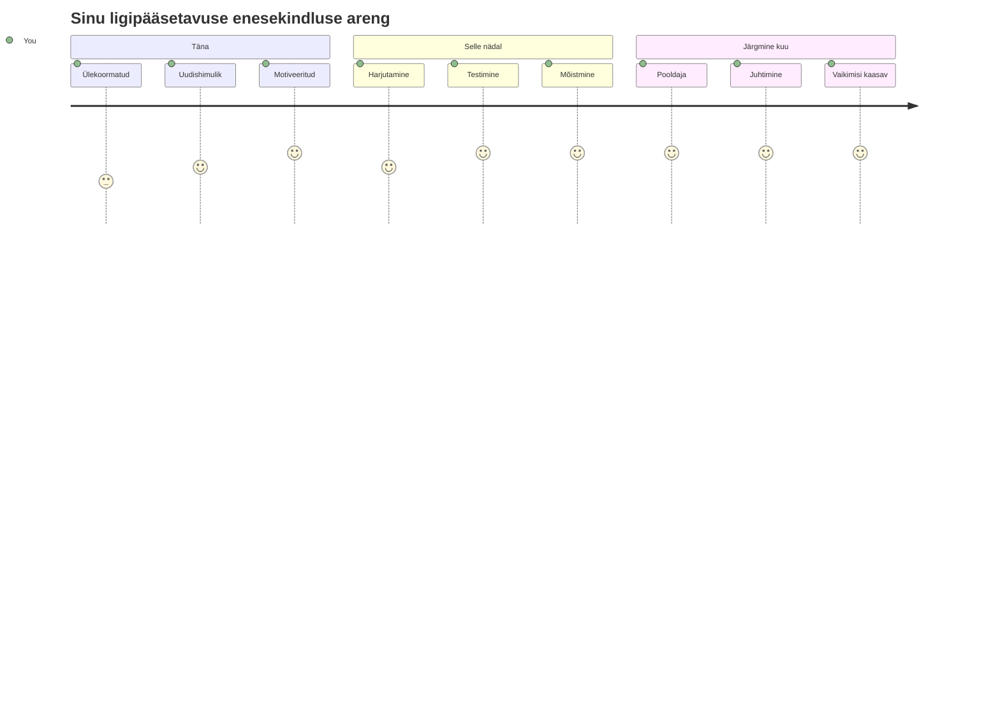
> 🌍 **Sa oled nüüd ligipääsetavuse meister!** Sa mõistad, et suurepärased veebikogemused toimivad kõigi jaoks, sõltumata sellest, kuidas nad veebi kasutavad. Iga ligipääsetav funktsioon, mida ehitad, teeb interneti kaasavamaks. Veeb vajab arendajaid nagu sina, kes näevad ligipääsetavust mitte piiranguna, vaid võimalusena luua paremaid kogemusi kõigile kasutajatele. Tere tulemast liikumisse! 🎉

---

<!-- CO-OP TRANSLATOR DISCLAIMER START -->
**Hoiatus**:  
See dokument on tõlgitud kasutades tehisintellekti tõlketeenust [Co-op Translator](https://github.com/Azure/co-op-translator). Kuigi püüame täpsust, palun arvestage, et automatiseeritud tõlked võivad sisaldada vigu või ebatäpsusi. Originaaldokument selle algkeeles peaks olema autoriteetne allikas. Olulise info puhul soovitatakse kasutada professionaalset inimtõlget. Me ei vastuta ühegi arusaamatuse või valesti mõistmise eest, mis võib tekkida selle tõlke kasutamisest.
<!-- CO-OP TRANSLATOR DISCLAIMER END -->