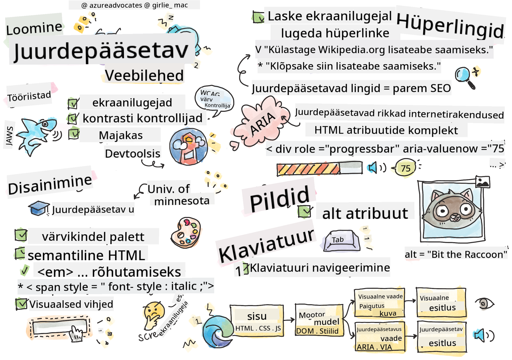

<!--
CO_OP_TRANSLATOR_METADATA:
{
  "original_hash": "f0c88c3e2cefa8952d356f802b1e47ca",
  "translation_date": "2025-10-11T11:51:31+00:00",
  "source_file": "1-getting-started-lessons/3-accessibility/README.md",
  "language_code": "et"
}
-->
# Ligipääsetavate veebilehtede loomine


> Sketchnote autor [Tomomi Imura](https://twitter.com/girlie_mac)

## Loengu-eelne viktoriin
[Loengu-eelne viktoriin](https://ff-quizzes.netlify.app/web/)

> Veebi jõud peitub selle universaalsuses. Ligipääs kõigile, olenemata puudest, on oluline aspekt.
>
> \- Sir Timothy Berners-Lee, W3C direktor ja veebi leiutaja

See tsitaat rõhutab suurepäraselt ligipääsetavate veebilehtede loomise tähtsust. Rakendus, millele kõik ei pääse ligi, on oma olemuselt välistav. Veebiarendajatena peaksime alati ligipääsetavust silmas pidama. Kui keskendume sellele juba algusest peale, oleme õigel teel, et tagada kõigile juurdepääs meie loodud lehtedele. Selles õppetükis õpid tundma tööriistu, mis aitavad tagada, et sinu veebivarad oleksid ligipääsetavad, ja kuidas ehitada neid ligipääsetavust silmas pidades.

> Selle õppetüki saad läbida [Microsoft Learnis](https://docs.microsoft.com/learn/modules/web-development-101/accessibility/?WT.mc_id=academic-77807-sagibbon)!

## Kasutatavad tööriistad

### Ekraanilugejad

Üks tuntumaid ligipääsetavuse tööriistu on ekraanilugejad.

[Ekraanilugejad](https://en.wikipedia.org/wiki/Screen_reader) on tavaliselt kasutatavad kliendid nägemispuudega inimestele. Kui me kulutame aega, et tagada brauseri korrektne teabe edastamine, peame samuti tagama, et ekraanilugeja teeks seda sama.

Ekraanilugeja loeb lehe kõige lihtsamal kujul ülevalt alla kuuldavalt. Kui sinu leht on ainult tekst, edastab lugeja teabe sarnaselt brauserile. Loomulikult on veebilehed harva ainult tekst; need sisaldavad linke, graafikat, värve ja muid visuaalseid komponente. Tuleb hoolitseda selle eest, et ekraanilugeja loeks seda teavet õigesti.

Iga veebiarendaja peaks tutvuma ekraanilugejaga. Nagu eespool rõhutatud, on see klient, mida sinu kasutajad kasutavad. Samamoodi nagu oled tuttav brauseri toimimisega, peaksid õppima, kuidas ekraanilugeja töötab. Õnneks on ekraanilugejad enamikus operatsioonisüsteemides sisse ehitatud.

Mõned brauserid sisaldavad ka sisseehitatud tööriistu ja laiendusi, mis suudavad teksti ette lugeda või pakkuda mõningaid põhilisi navigeerimisfunktsioone, näiteks [Edge'i brauseri ligipääsetavuse tööriistad](https://support.microsoft.com/help/4000734/microsoft-edge-accessibility-features). Need on samuti olulised ligipääsetavuse tööriistad, kuid toimivad väga erinevalt ekraanilugejatest ja neid ei tohiks segamini ajada ekraanilugeja testimise tööriistadega.

✅ Proovi ekraanilugejat ja brauseri tekstilugejat. Windowsis on vaikimisi kaasas [Narrator](https://support.microsoft.com/windows/complete-guide-to-narrator-e4397a0d-ef4f-b386-d8ae-c172f109bdb1/?WT.mc_id=academic-77807-sagibbon), samuti saab paigaldada [JAWS](https://webaim.org/articles/jaws/) ja [NVDA](https://www.nvaccess.org/about-nvda/). macOS-is ja iOS-is on vaikimisi paigaldatud [VoiceOver](https://support.apple.com/guide/voiceover/welcome/10).

### Suumimine

Teine tööriist, mida nägemispuudega inimesed sageli kasutavad, on suumimine. Kõige lihtsam suumimise tüüp on staatiline suum, mida juhitakse `Control + plussmärk (+)` või ekraani eraldusvõime vähendamisega. See suumimise tüüp muudab kogu lehe suurust, seega on [responsiivne disain](https://developer.mozilla.org/docs/Learn/CSS/CSS_layout/Responsive_Design) oluline, et pakkuda head kasutajakogemust suurendatud suumitasemetel.

Teine suumimise tüüp tugineb spetsiaalsele tarkvarale, mis suurendab ekraani ühte ala ja liigutab seda, sarnaselt päris suurendusklaasi kasutamisele. Windowsis on sisseehitatud [Magnifier](https://support.microsoft.com/windows/use-magnifier-to-make-things-on-the-screen-easier-to-see-414948ba-8b1c-d3bd-8615-0e5e32204198), ja [ZoomText](https://www.freedomscientific.com/training/zoomtext/getting-started/) on kolmanda osapoole suurendustarkvara, millel on rohkem funktsioone ja suurem kasutajaskond. Nii macOS-is kui iOS-is on sisseehitatud suurendustarkvara nimega [Zoom](https://www.apple.com/accessibility/mac/vision/).

### Kontrasti kontrollijad

Veebilehtede värvid tuleb hoolikalt valida, et vastata värvipimedate kasutajate või madala kontrastsusega värve raskesti nägevate inimeste vajadustele.

✅ Testi mõnda veebilehte, mida naudid, värvikasutuse osas brauserilaiendiga, näiteks [WCAG-i värvikontrollija](https://microsoftedge.microsoft.com/addons/detail/wcag-color-contrast-check/idahaggnlnekelhgplklhfpchbfdmkjp?hl=en-US&WT.mc_id=academic-77807-sagibbon). Mida sa õpid?

### Lighthouse

Sinu brauseri arendustööriistade alal leiad Lighthouse'i tööriista. See tööriist on oluline, et saada esmane ülevaade veebilehe ligipääsetavusest (samuti muudest analüüsidest). Kuigi on oluline mitte tugineda ainult Lighthouse'ile, on 100% skoor väga kasulik lähtepunkt.

✅ Leia Lighthouse oma brauseri arendustööriistade paneelilt ja tee analüüs mõnel veebilehel. Mida sa avastad?

## Ligipääsetavuse disainimine

Ligipääsetavus on suhteliselt suur teema. Et sind aidata, on saadaval palju ressursse.

- [Accessible U - Minnesota Ülikool](https://accessibility.umn.edu/your-role/web-developers)

Kuigi me ei suuda katta kõiki ligipääsetavate lehtede loomise aspekte, on allpool mõned põhialused, mida soovid rakendada. Ligipääsetava lehe disainimine algusest peale on **alati** lihtsam kui olemasoleva lehe tagasiulatuv ligipääsetavaks muutmine.

## Head kuvamisprintsiibid

### Värvikindlad paletid

Inimesed näevad maailma erinevalt, sealhulgas värve. Kui valid oma lehe jaoks värviskeemi, peaksid tagama, et see oleks kõigile ligipääsetav. Üks suurepärane [tööriist värvipalettide genereerimiseks on Color Safe](http://colorsafe.co/).

✅ Tuvasta veebileht, mille värvikasutus on väga problemaatiline. Miks?

### Kasuta õiget HTML-i

CSS-i ja JavaScripti abil on võimalik muuta iga element mis tahes tüüpi juhtnupuks. `<span>` võiks kasutada `<button>` loomiseks ja `<b>` võiks muutuda hüperlingiks. Kuigi seda võib pidada lihtsamaks stiilimiseks, ei edasta see ekraanilugejale midagi. Kasuta lehe juhtnuppude loomisel sobivat HTML-i. Kui soovid hüperlinki, kasuta `<a>`. Õige HTML-i kasutamist õige juhtnupu jaoks nimetatakse semantilise HTML-i kasutamiseks.

✅ Mine mõnele veebilehele ja vaata, kas disainerid ja arendajad kasutavad HTML-i õigesti. Kas leiad nupu, mis peaks olema link? Vihje: klõpsa parema hiireklahviga ja vali 'Vaata lehe allikat' oma brauseris, et näha aluseks olevat koodi.

### Loo kirjeldav pealkirjade hierarhia

Ekraanilugeja kasutajad [tuginevad tugevalt pealkirjadele](https://webaim.org/projects/screenreadersurvey8/#finding), et leida teavet ja navigeerida lehel. Kirjeldava pealkirja sisu kirjutamine ja semantiliste pealkirjasiltide kasutamine on oluline, et luua ekraanilugeja kasutajatele kergesti navigeeritav leht.

### Kasuta häid visuaalseid vihjeid

CSS pakub täielikku kontrolli mis tahes elemendi välimuse üle lehel. Sa võid luua tekstikaste ilma kontuurita või hüperlinke ilma allajooneta. Kahjuks nende vihjete eemaldamine võib muuta keerulisemaks nende äratundmise neile, kes sõltuvad neist.

## Linkide teksti tähtsus

Hüperlingid on veebi navigeerimise tuum. Seetõttu tagades, et ekraanilugeja suudab linke korralikult lugeda, võimaldab kõigil kasutajatel sinu lehel navigeerida.

### Ekraanilugejad ja lingid

Nagu arvata võib, loevad ekraanilugejad linkide teksti samamoodi nagu mis tahes muud teksti lehel. Seda silmas pidades võib allpool näidatud tekst tunduda täiesti vastuvõetav.

> Väike pingviin, keda mõnikord tuntakse haldja pingviinina, on maailma väikseim pingviin. [Klõpsa siia](https://en.wikipedia.org/wiki/Little_penguin), et saada rohkem teavet.

> Väike pingviin, keda mõnikord tuntakse haldja pingviinina, on maailma väikseim pingviin. Külastage https://en.wikipedia.org/wiki/Little_penguin, et saada rohkem teavet.

> **NOTE** Nagu sa kohe loed, ei tohiks sa **kunagi** luua linke, mis näevad välja nagu ülaltoodud näited.

Pea meeles, et ekraanilugejad on erinev liides brauseritest, millel on erinev funktsioonide komplekt.

### Probleem URL-i kasutamisega

Ekraanilugejad loevad teksti. Kui tekstis ilmub URL, loeb ekraanilugeja URL-i. Üldiselt ei edasta URL tähenduslikku teavet ja võib kõlada tüütult. Sa võid seda kogeda, kui su telefon on kunagi kuuldavalt lugenud tekstisõnumit, mis sisaldab URL-i.

### Probleem "klõpsa siia" kasutamisega

Ekraanilugejatel on ka võime lugeda ainult hüperlinke lehel, sarnaselt sellele, kuidas nägijad skaneerivad lehte linkide otsimiseks. Kui lingitekst on alati "klõpsa siia", kuuleb kasutaja ainult "klõpsa siia, klõpsa siia, klõpsa siia, klõpsa siia, klõpsa siia, ..." Kõik lingid on nüüd üksteisest eristamatud.

### Hea lingitekst

Hea lingitekst kirjeldab lühidalt, mis on lingi teisel poolel. Ülaltoodud näites, mis räägib väikestest pingviinidest, viitab link Wikipedia lehele selle liigi kohta. Fraas *väike pingviin* oleks ideaalne lingitekst, kuna see teeb selgeks, mida keegi lingile klõpsates teada saab - väikesed pingviinid.

> [Väike pingviin](https://en.wikipedia.org/wiki/Little_penguin), keda mõnikord tuntakse haldja pingviinina, on maailma väikseim pingviin.

✅ Sirvi veebi mõne minuti jooksul, et leida lehti, mis kasutavad ebaselgeid linkimisstrateegiaid. Võrdle neid teiste, paremini lingitud lehtedega. Mida sa õpid?

#### Märkused otsingumootorite kohta

Lisaboonusena, tagades, et sinu leht on kõigile ligipääsetav, aitad otsingumootoritel sinu lehel navigeerida. Otsingumootorid kasutavad lingiteksti, et õppida lehtede teemasid. Seega aitab hea lingiteksti kasutamine kõiki!

### ARIA

Kujuta ette järgmist lehte:

| Toode         | Kirjeldus          | Tellimus      |
| ------------- | ------------------ | ------------- |
| Vidin         | [Kirjeldus](../../../../1-getting-started-lessons/3-accessibility/')   | [Tellimus](../../../../1-getting-started-lessons/3-accessibility/') |
| Supervidin    | [Kirjeldus](../../../../1-getting-started-lessons/3-accessibility/')   | [Tellimus](../../../../1-getting-started-lessons/3-accessibility/') |

Selles näites on mõistlik, et brauserit kasutav inimene näeb korduvat teksti "kirjeldus" ja "tellimus". Kuid ekraanilugejat kasutav inimene kuuleks ainult sõnu *kirjeldus* ja *tellimus* ilma kontekstita.

Selliste olukordade toetamiseks toetab HTML atribuute, mida tuntakse kui [Ligipääsetavad rikkad internetirakendused (ARIA)](https://developer.mozilla.org/docs/Web/Accessibility/ARIA). Need atribuudid võimaldavad ekraanilugejatele lisateavet anda.

> **NOTE**: Nagu paljude HTML-i aspektide puhul, võib brauseri ja ekraanilugeja tugi varieeruda. Kuid enamik peamisi kliente toetab ARIA atribuute.

Sa saad kasutada `aria-label`, et kirjeldada linki, kui lehe formaat seda ei võimalda. Vidina kirjeldus võiks olla määratud järgmiselt:

``` html
<a href="#" aria-label="Widget description">description</a>
```

✅ Üldiselt ületab semantilise märgistuse kasutamine eespool kirjeldatud ARIA kasutamise, kuid mõnikord pole erinevate HTML-i vidinate jaoks semantilist ekvivalenti. Hea näide on puu. HTML-is pole puu ekvivalenti, seega identifitseerid selle elemendi üldise `<div>` abil, määrates sellele sobiva rolli ja ARIA väärtused. [MDN-i dokumentatsioon ARIA kohta](https://developer.mozilla.org/docs/Web/Accessibility/ARIA) sisaldab rohkem kasulikku teavet.

```html
<h2 id="tree-label">File Viewer</h2>
<div role="tree" aria-labelledby="tree-label">
  <div role="treeitem" aria-expanded="false" tabindex="0">Uploads</div>
</div>
```

## Pildid

On iseenesestmõistetav, et ekraanilugejad ei suuda automaatselt lugeda, mis on pildil. Piltide ligipääsetavaks muutmine ei nõua palju tööd - selleks ongi `alt` atribuut. Kõigil tähenduslikel piltidel peaks olema `alt`, mis kirjeldab, mis need on.
Puhtalt dekoratiivsetel piltidel peaks `alt` atribuut olema määratud tühjaks stringiks: `alt=""`. See takistab ekraanilugejatel dekoratiivset pilti tarbetult teatamast.

✅ Nagu arvata võib, ei suuda otsingumootorid samuti aru saada, mis on pildil. Nad kasutavad samuti alt-teksti. Seega, tagades, et sinu leht on ligipääsetav, saad täiendavaid eeliseid!

## Klaviatuur

Mõned kasutajad ei saa kasutada hiirt või puuteplaati, vaid tuginevad klaviatuuri interaktsioonidele, et liikuda ühelt elemendilt teisele. On oluline, et sinu veebileht esitaks sisu loogilises järjekorras, et klaviatuuri kasutaja saaks liikuda iga interaktiivse elemendi juurde, kui ta liigub dokumendis alla. Kui ehitad oma veebilehed semantilise märgistusega ja kasutad CSS-i nende visuaalse paigutuse kujundamiseks, peaks sinu leht olema klaviatuuriga navigeeritav, kuid on oluline seda aspekti käsitsi testida. Loe rohkem [klaviatuuri navigeerimise strateegiate kohta](https://webaim.org/techniques/keyboard/).

✅ Mine mõnele veebilehele ja proovi navigeerida ainult klaviatuuri abil. Mis töötab, mis ei tööta? Miks?

## Kokkuvõte

Veeb, mis on ligipääsetav ainult osadele, ei ole tõeliselt 'maailma-võrk'. Parim viis tagada, et sinu loodud lehed on ligipääsetavad, on rakendada ligipääsetavuse parimaid tavasid algusest peale. Kuigi see nõuab lisasamme, tähendab nende oskuste integreerimine sinu töövoogu nüüd, et kõik lehed, mida sa lood, on ligipääsetavad.

---

## 🚀 Väljakutse

Võta see HTML ja kirjuta see ümber nii ligipääsetavaks kui võimalik, kasutades õpitud strateegiaid.

```html
<!DOCTYPE html>
<html>
  <head>
    <title>
      Example
    </title>
    <link href='../assets/style.css' rel='stylesheet' type='text/css'>
  </head>
  <body>
    <div class="site-header">
      <p class="site-title">Turtle Ipsum</p>
      <p class="site-subtitle">The World's Premier Turtle Fan Club</p>
    </div>
    <div class="main-nav">
      <p class="nav-header">Resources</p>
      <div class="nav-list">
        <p class="nav-item nav-item-bull"><a href="https://www.youtube.com/watch?v=CMNry4PE93Y">"I like turtles"</a></p>
        <p class="nav-item nav-item-bull"><a href="https://en.wikipedia.org/wiki/Turtle">Basic Turtle Info</a></p>
        <p class="nav-item nav-item-bull"><a href="https://en.wikipedia.org/wiki/Turtles_(chocolate)">Chocolate Turtles</a></p>
      </div>
    </div>
    <div class="main-content">
      <div>
        <p class="page-title">Welcome to Turtle Ipsum. 
            <a href="">Click here</a> to learn more.
        </p>
        <p class="article-text">
          Turtle ipsum dolor sit amet, consectetur adipiscing elit, sed do eiusmod tempor incididunt ut labore et dolore magna aliqua. Ut enim ad minim veniam, quis nostrud exercitation ullamco laboris nisi ut aliquip ex ea commodo consequat. Duis aute irure dolor in reprehenderit in voluptate velit esse cillum dolore eu fugiat nulla pariatur. Excepteur sint occaecat cupidatat non proident, sunt in culpa qui officia deserunt mollit anim id est laborum
        </p>
      </div>
    </div>
    <div class="footer">
      <div class="footer-section">
        <span class="button">Sign up for turtle news</span>
      </div><div class="footer-section">
        <p class="nav-header footer-title">
          Internal Pages
        </p>
        <div class="nav-list">
          <p class="nav-item nav-item-bull"><a href="../">Index</a></p>
          <p class="nav-item nav-item-bull"><a href="../semantic">Semantic Example</a></p>
        </div>
      </div>
      <p class="footer-copyright">&copy; 2016 Instrument</p>
    </div>
  </body>
</html>
```

## Loengu-järgne viktoriin
[Loengujärgne viktoriin](https://ff-quizzes.netlify.app/web/en/)

## Ülevaade ja iseseisev õpe

Paljudel valitsustel on seadused, mis käsitlevad ligipääsetavuse nõudeid. Uuri oma koduriigi ligipääsetavuse seadusi. Mis on kaetud ja mis mitte? Näiteks [see valitsuse veebisait](https://accessibility.blog.gov.uk/).

## Ülesanne

[Analüüsi mitte-ligipääsetavat veebisaiti](assignment.md)

Autorid: [Turtle Ipsum](https://github.com/Instrument/semantic-html-sample) by Instrument

---

**Lahtiütlus**:  
See dokument on tõlgitud AI tõlketeenuse [Co-op Translator](https://github.com/Azure/co-op-translator) abil. Kuigi püüame tagada täpsust, palume arvestada, et automaatsed tõlked võivad sisaldada vigu või ebatäpsusi. Algne dokument selle algses keeles tuleks pidada autoriteetseks allikaks. Olulise teabe puhul soovitame kasutada professionaalset inimtõlget. Me ei vastuta selle tõlke kasutamisest tulenevate arusaamatuste või valesti tõlgenduste eest.