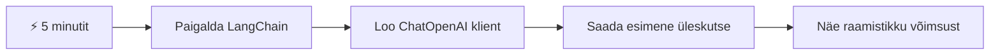
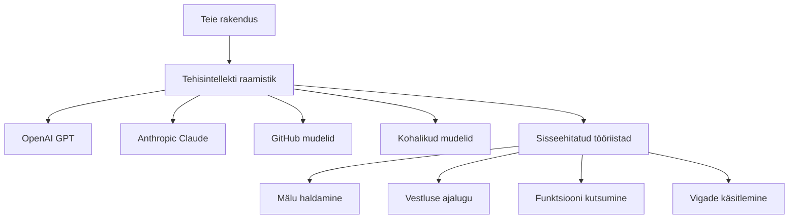
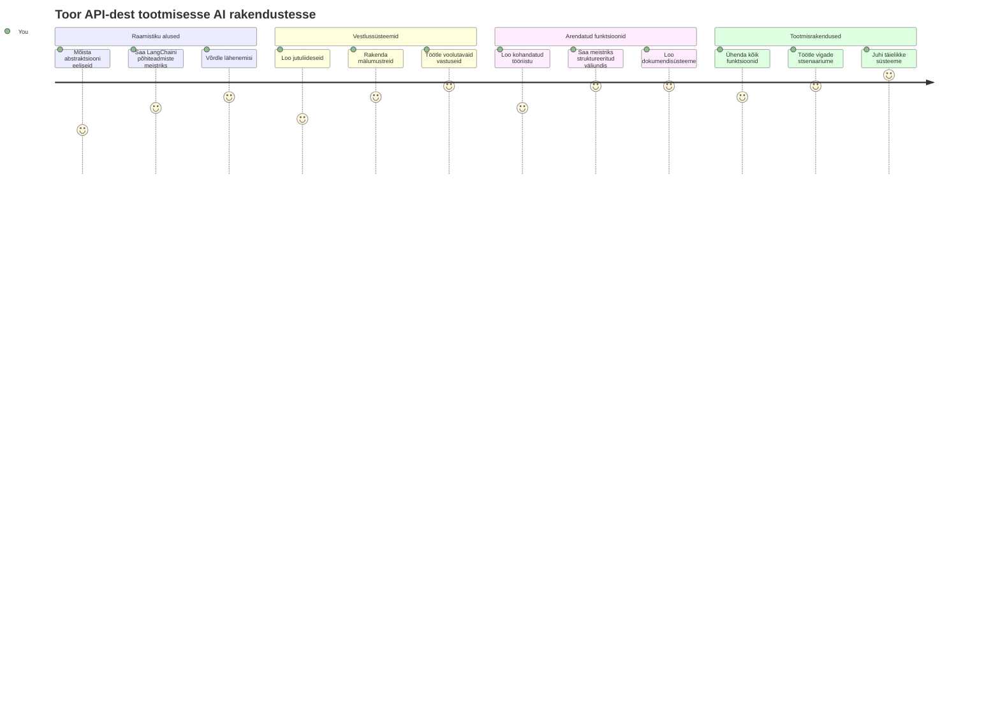
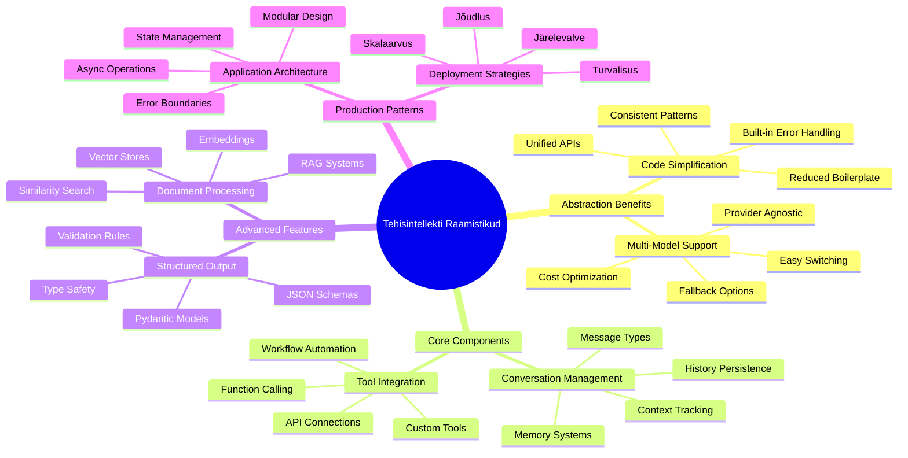
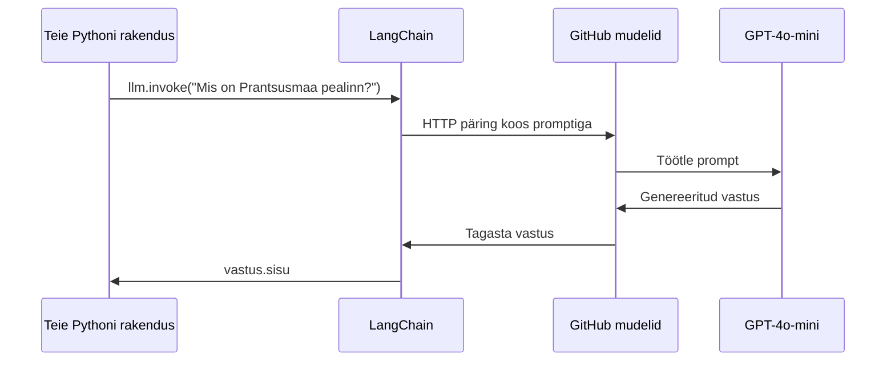
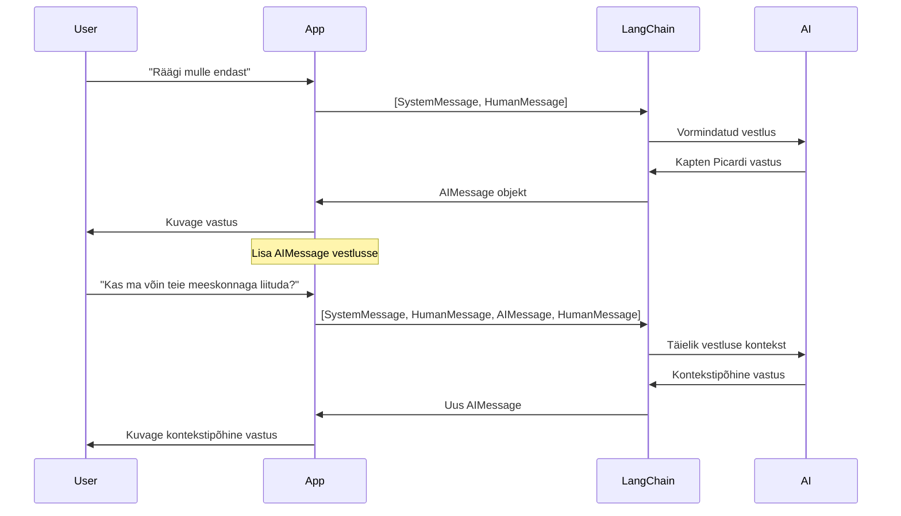
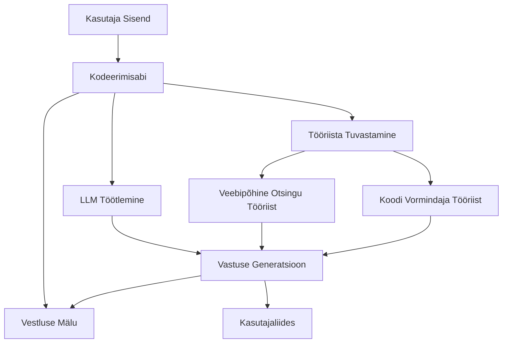
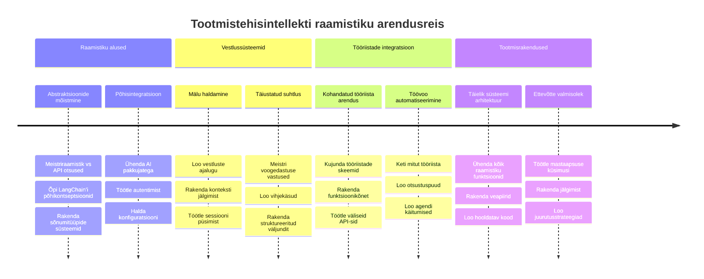
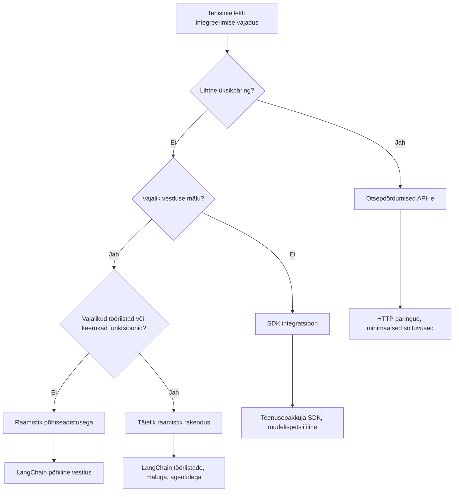

<!--
CO_OP_TRANSLATOR_METADATA:
{
  "original_hash": "3925b6a1c31c60755eaae4d578232c25",
  "translation_date": "2026-01-08T08:41:40+00:00",
  "source_file": "10-ai-framework-project/README.md",
  "language_code": "et"
}
-->
# AI raamistik

Kas oled kunagi tundnud end ülekoormatuna, püüdes AI-rakendusi nullist ehitada? Sa ei ole üksi! AI raamistikud on nagu Šveitsi taskunuga AI arendusele – need on võimsad tööriistad, mis säästavad aega ja peavalu nutikate rakenduste loomisel. Mõtle AI raamistikule kui hästi korraldatud raamatukogule: see pakub eelvalmisteid komponente, standardiseeritud API-sid ja nutikaid abstraktsioone, et saaksid keskenduda probleemide lahendamisele, mitte rakenduse detailide kallal rabelemisele.

Selles õppetükis uurime, kuidas raamistikud nagu LangChain muudavad kunagised keerulised AI integreerimise ülesanded puhtaks ja loetavaks koodiks. Sa õpid, kuidas lahendada päriselu väljakutseid nagu vestluste jälgimine, tööriistakõnede rakendamine ja erinevate AI mudelite haldamine ühtse liidese kaudu.

Kui me lõpetame, tead, millal haarata raamistikule mitte aga põhilähedale API-kõnedele, kuidas kasutada nende abstraktsioone efektiivselt ja kuidas ehitada AI-rakendusi, mis on valmis päriselu kasutuseks. Vaatame, mida AI raamistikud sinu projektidele teha saavad.

## ⚡ Mida saad teha järgmise 5 minutiga

**Kiire algus hõivatud arendajatele**


- **1. minut**: Installi LangChain: `pip install langchain langchain-openai`
- **2. minut**: Sea üles oma GitHub token ja impordi ChatOpenAI klient
- **3. minut**: Loo lihtne vestlus süsteemi ja inimese sõnumitega
- **4. minut**: Lisa põhiline tööriist (näiteks liitmistehe) ja vaata AI tööriistakõnede toimimist
- **5. minut**: Koge vahet nõtmete API-kõnede ja raamistikupõhise abstraktsiooni vahel

**Kiire testikood**:
```python
from langchain_openai import ChatOpenAI
from langchain_core.messages import SystemMessage, HumanMessage

llm = ChatOpenAI(
    api_key=os.environ["GITHUB_TOKEN"],
    base_url="https://models.github.ai/inference",
    model="openai/gpt-4o-mini"
)

response = llm.invoke([
    SystemMessage(content="You are a helpful coding assistant"),
    HumanMessage(content="Explain Python functions briefly")
])
print(response.content)
```

**Miks see oluline on**: 5 minutiga saad kogemuse, kuidas AI raamistikud muudavad keerulise AI integreerimise lihtsate meetodikõnedeks. See on alus, mis aitab käivitada tööstuslikke AI rakendusi.

## Miks valida raamistik?

Nüüd oled valmis AI rakendust ehitama – tubli! Aga siin on asi: sul on mitu erinevat teed, mida mööda minna, ning igaühel on omad plussid ja miinused. See on nagu valida, kas jala käia, rattaga sõita või autoga minna – kõik viivad kohale, aga kogemus (ja pingutus) on täiesti erinev.

Vaatame kolme peamist viisi, kuidas AI-d oma projektidesse integreerida:

| Lähenemine | Eelised | Sobib | Mõtted |
|------------|---------|-------|--------|
| **Otsekohesed HTTP päringud** | Täielik kontroll, pole sõltuvusi | Lihtsad päringud, fundamentide õppimine | Rohkem koodi, käsitsi veahaldus |
| **SDK integratsioon** | Vähem tülikat koodi, mudelispetsiifiline optimeerimine | Ühe mudeli rakendused | Piiratud konkreetsete pakkujatega |
| **AI raamistikud** | Ühtne API, sisseehitatud abstraktsioonid | Mitme mudeliga rakendused, keerulised töövood | Õppimiskõver, võimalik ülearune abstraktsioon |

### Raamistike eelised praktikas


**Miks raamistikud on olulised:**
- **Ühendavad** mitmed AI pakkujad ühe liidese alla
- **Haldavad** automaatselt vestluse mälu
- **Pakuvad** valmis tööriistu levinud ülesanneteks nagu manused ja funktsioonide kutsumine
- **Juhtivad** veahaldust ja taasingutuse loogikat
- **Muutvad** keerulised töövood loetavaks meetodikõnedeks

> 💡 **Pro näpunäide**: Kasuta raamistikku, kui vahetad AI mudeleid või ehitad keerukaid funktsioone nagu agendid, mälu või tööriistakõned. Kasuta otse API-sid, kui õpid algtõdesid või ehitad lihtsaid spetsiifilisi rakendusi.

**Järeldus**: Nagu valida spetsialiseeritud käsitööriistade ja täisvarustusega töökoja vahel, on oluline valida tööriist vastavalt ülesandele. Raamistikud on parimad keerukate ja funktsiooniderikaste rakenduste jaoks, otse API-d sobivad lihtsate kasutusjuhtude jaoks hästi.

## 🗺️ Sinu õppimise teekond AI raamistike meistriks


**Sinu sihtkoht**: Selle õppetüki lõpuks valdad AI raamistike arendamist ja suudad luua keerukaid, tootmisklassi AI rakendusi, mis konkureerivad kommertslike AI assistentidega.

## Sissejuhatus

Selles õppetükis õpid:

- Kasutama tavalist AI raamistikku.
- Lahendama tavalisi probleeme nagu vestlused, tööriistade kasutus, mälu ja kontekst.
- Kasutama seda AI rakenduste ehitamiseks.

## 🧠 AI raamistiku arendusökosüsteem


**Põhiprintsiip**: AI raamistikud abstraktseerivad keerukust, pakkudes võimsaid abstraktsioone vestluste haldamiseks, tööriistade integreerimiseks ja dokumentide töötlemiseks, võimaldades arendajatel luua keerukaid AI rakendusi puhta ja hooldatava koodiga.

## Sinu esimene AI päring

Alustame põhialustest, luues oma esimese AI rakenduse, mis saadab küsimuse ja saab vastuse tagasi. Nagu Archimedes oma vannis avastas nihkumise printsiibi, mõnikord viivad lihtsad tähelepanekud kõige võimsamate teadmiste juurde – raamistikud teevad need teadmised kättesaadavaks.

### LangChaini seadistamine GitHubi mudelitega

Kasutan LangChaini ühendamaks end GitHubi mudelitega, mis on päris vahva, sest annab sulle tasuta ligipääsu erinevatele AI mudelitele. Parim osa? Alguseks piisab vaid mõnest lihtsast konfiguratsiooniparameetrist:

```python
from langchain_openai import ChatOpenAI
import os

llm = ChatOpenAI(
    api_key=os.environ["GITHUB_TOKEN"],
    base_url="https://models.github.ai/inference",
    model="openai/gpt-4o-mini",
)

# Saada lihtne päring
response = llm.invoke("What's the capital of France?")
print(response.content)
```

**Vaatame, mis siin toimub:**
- **Loo** LangChain klient `ChatOpenAI` klassi abil – see on su tee AI-sse!
- **Sea** ühendus GitHubi mudelitega oma autentimistornega
- **Määra**, millist AI mudelit kasutada (`gpt-4o-mini`) – mõtle sellele kui oma AI assistendi valikule
- **Saada** küsimus `invoke()` meetodi kaudu – siin sünnib võlu
- **Võta** vastus ja kuva see – voilà, sa suhtled AI-ga!

> 🔧 **Seadistamisnõuanne**: Kui kasutad GitHub Codespaces, on sul vedanud – `GITHUB_TOKEN` on juba seadistatud! Töötad lokaalselt? Pole probleemi, pead lihtsalt looma isikliku ligipääsutokeni õige õigusega.

**Oodatav väljund:**
```text
The capital of France is Paris.
```


## Vestlusliku AI ehitamine

See esimene näide näitab põhialuseid, aga see on ainult üks vahetus – sa küsid, saad vastuse ja see ongi kõik. Tõelistes rakendustes tahad, et su AI mäletaks, mida olete arutanud, nagu Watson ja Holmes ehitasid oma uurimisvestlusi aja jooksul.

Siin tuleb mängu LangChain. See pakub erinevaid sõnumitüüpe, mis aitavad vestlusi struktureerida ja lubavad anda AI-le iseloomu. Sa ehitad vestluskogemusi, mis hoiavad konteksti ja karakterit.

### Sõnumitüüpide mõistmine

Mõtle sellele, et need sõnumitüübid on nagu erinevad "mütsid", mida vestlusosalistel on peas. LangChain kasutab erinevaid sõnumiklasse, et jälgida, kes mida ütleb:

| Sõnumitüüp | Eesmärk | Näide kasutusest |
|------------|---------|-----------------|
| `SystemMessage` | Määrab AI isiksuse ja käitumise | "Sa oled abivalmis programmeerimisassistent" |
| `HumanMessage` | Esindab kasutaja sisendit | "Selgita, kuidas funktsioonid toimivad" |
| `AIMessage` | Salvestab AI vastuseid | Varasemad AI vastused vestluses |

### Loo oma esimene vestlus

Loome vestluse, kus meie AI võtab kindla rolli. Anname talle Kapten Picardi iseloomu – tegelane, kes on tuntud oma diplomaatilise tarkuse ja juhtimisoskuse poolest:

```python
messages = [
    SystemMessage(content="You are Captain Picard of the Starship Enterprise"),
    HumanMessage(content="Tell me about you"),
]
```

**Vestluse seadistuse lahtimurdmine:**
- **Määrab** AI rolli ja iseloomu läbi `SystemMessage`
- **Sisestab** algse kasutajaküsimuse `HumanMessage` kaudu
- **Loomulikult** rajab mitme vooru vestluse aluse

Siin on kogu kood selle näite jaoks:

```python
from langchain_core.messages import HumanMessage, SystemMessage
from langchain_openai import ChatOpenAI
import os

llm = ChatOpenAI(
    api_key=os.environ["GITHUB_TOKEN"],
    base_url="https://models.github.ai/inference",
    model="openai/gpt-4o-mini",
)

messages = [
    SystemMessage(content="You are Captain Picard of the Starship Enterprise"),
    HumanMessage(content="Tell me about you"),
]


# töötab
response  = llm.invoke(messages)
print(response.content)
```

Peaksid nägema tulemust, mis näeb välja umbes nii:

```text
I am Captain Jean-Luc Picard, the commanding officer of the USS Enterprise (NCC-1701-D), a starship in the United Federation of Planets. My primary mission is to explore new worlds, seek out new life and new civilizations, and boldly go where no one has gone before. 

I believe in the importance of diplomacy, reason, and the pursuit of knowledge. My crew is diverse and skilled, and we often face challenges that test our resolve, ethics, and ingenuity. Throughout my career, I have encountered numerous species, grappled with complex moral dilemmas, and have consistently sought peaceful solutions to conflicts.

I hold the ideals of the Federation close to my heart, believing in the importance of cooperation, understanding, and respect for all sentient beings. My experiences have shaped my leadership style, and I strive to be a thoughtful and just captain. How may I assist you further?
```

Vestluse järjepidevuse säilitamiseks (konteksti vaikimisi parandamise asemel) pead hoidma vastuseid oma sõnumite loendis. Nii nagu suuline traditsioon säilitas lugusid põlvest põlve, loob see meetod kestva mälu:

```python
from langchain_core.messages import HumanMessage, SystemMessage
from langchain_openai import ChatOpenAI
import os

llm = ChatOpenAI(
    api_key=os.environ["GITHUB_TOKEN"],
    base_url="https://models.github.ai/inference",
    model="openai/gpt-4o-mini",
)

messages = [
    SystemMessage(content="You are Captain Picard of the Starship Enterprise"),
    HumanMessage(content="Tell me about you"),
]


# töötab
response  = llm.invoke(messages)

print(response.content)

print("---- Next ----")

messages.append(response)
messages.append(HumanMessage(content="Now that I know about you, I'm Chris, can I be in your crew?"))

response  = llm.invoke(messages)

print(response.content)

```

Päris lahe, eks? Siin toimub see, et kutsume LLM-i kaks korda – esmalt kahe algse sõnumiga, siis kogu vestluse looga. See on nagu AI jälgiks tahtlikult meie jutuajamist!

Kui jooksutad seda koodi, saad teise vastuse, mis kõlab ligikaudu nii:

```text
Welcome aboard, Chris! It's always a pleasure to meet those who share a passion for exploration and discovery. While I cannot formally offer you a position on the Enterprise right now, I encourage you to pursue your aspirations. We are always in need of talented individuals with diverse skills and backgrounds. 

If you are interested in space exploration, consider education and training in the sciences, engineering, or diplomacy. The values of curiosity, resilience, and teamwork are crucial in Starfleet. Should you ever find yourself on a starship, remember to uphold the principles of the Federation: peace, understanding, and respect for all beings. Your journey can lead you to remarkable adventures, whether in the stars or on the ground. Engage!
```


Ma võtan seda kui "võib-olla" ;)

## Voogedastuse vastused

Kas oled märganud, kuidas ChatGPT "tüübid" oma vastuseid reaalajas? See on voogedastus toimimas. Nagu vaadata oskuslikku kaligraafe tööl, nägid tähemärke ilmumas haru haaval, mitte korraga – voogedastus teeb suhtluse loomulikumaks ja annab kohese tagasiside.

### Voogedastuse rakendamine LangChainiga

```python
from langchain_openai import ChatOpenAI
import os

llm = ChatOpenAI(
    api_key=os.environ["GITHUB_TOKEN"],
    base_url="https://models.github.ai/inference",
    model="openai/gpt-4o-mini",
    streaming=True
)

# Voogedasta vastus
for chunk in llm.stream("Write a short story about a robot learning to code"):
    print(chunk.content, end="", flush=True)
```

**Miks voogedastus on lahe:**
- **Näitab** sisu samal ajal, kui see valmib – enam pole piinlikku ootamist!
- **Paneb** kasutajad tundma, et midagi toimub
- **Tundub** kiirem, kuigi sisuliselt ei pruugi olla
- **Lubab** kasutajatel hakata lugema, kui AI veel "mõtleb"

> 💡 **Kasutajakogemuse näpunäide**: Voogedastus särab eriti pikemate vastuste puhul nagu koodi selgitused, loominguline kirjutamine või üksikasjalikud juhendid. Kasutajad armastavad näha edenemist, mitte vahtida tühja ekraani!

### 🎯 Pedagoogiline hetk: Raamistike abstraktsioonide eelised

**Peatu ja mõtiskle**: Sa said kogemuse AI raamistike abstraktsioonide võimsusest. Võrdle seda seniste õppetükkide otseste API-kõnedega.

**Kiire enesehindamine**:
- Kas suudad selgitada, kuidas LangChain lihtsustab vestluste haldust võrreldes käsitsi sõnumite jälgimisega?
- Mis vahe on `invoke()` ja `stream()` meetoditel ning millal kumbagi kasutada?
- Kuidas parandab raamistik sõnumitüüpide süsteem koodi organiseerimist?

**Päriselu seos**: Need abstraktsioonimustrid (sõnumitüübid, voogedastusliidesed, vestluse mälu) on kasutusel kõigis suuremates AI rakendustes – alates ChatGPT liidesest kuni GitHub Copiloti koodi abini. Sa valdad samu arhitektuurilisi mustreid, mida kasutavad professionaalsed AI meeskonnad.

**Väljakutsuva küsimus**: Kuidas kavandaksid raamistikulahenduse erinevate AI mudelipakkujate (OpenAI, Anthropic, Google) haldamiseks ühe liidese kaudu? Mõtle selle eelistele ja puudustele.

## Pärandmallid

Pärandmallid töötavad nagu retoorilised struktuurid klassikalises kõnemeisterlikkuses – mõtle, kuidas Cicero kohandas oma kõnemustreid erinevate publikute jaoks, hoides samal ajal veenvat raamistikku. Neil on võimalik luua taaskasutatavaid pärandeid, kus saab erinevaid info tükke vahetada, ilma et peaks kõike nullist ümber kirjutama. Kui mall on loodud, täidad vaid muutujad vajalikuga.

### Taaskasutatavate pärandite loomine

```python
from langchain_core.prompts import ChatPromptTemplate

# Määra koodi selgituste mall
template = ChatPromptTemplate.from_messages([
    ("system", "You are an expert programming instructor. Explain concepts clearly with examples."),
    ("human", "Explain {concept} in {language} with a practical example for {skill_level} developers")
])

# Kasuta malli erinevate väärtustega
questions = [
    {"concept": "functions", "language": "JavaScript", "skill_level": "beginner"},
    {"concept": "classes", "language": "Python", "skill_level": "intermediate"},
    {"concept": "async/await", "language": "JavaScript", "skill_level": "advanced"}
]

for question in questions:
    prompt = template.format_messages(**question)
    response = llm.invoke(prompt)
    print(f"Topic: {question['concept']}\n{response.content}\n---\n")
```

**Miks sa armastad malli kasutamist:**
- **Hoia** oma pärandid ühtsete kõigis rakenduse osades
- **Pole enam** segadust teksti jupidena liitmisega – lihtsalt puhased muutujad
- **Sinu AI** käitub ennustatavalt, sest struktuur jääb samaks
- **Uuendused** on lihtsad – muudad malli kord ja see kehtib kõigis kohtades

## Struktureeritud väljund

Kas oled kunagi tüdinenud AI vastuste töötlemisest, mis tulevad tagasi struktureerimata tekstina? Struktureeritud väljund on nagu õpetada oma AI-l süsteemselt järgima, nagu Linnaeus kasutas bioloogilist klassifikatsiooni – organiseeritud, ennustatav ja hõlpsasti kasutatav. Sa võid nõuda JSON-i, kindlaid andmestruktuure või mis tahes vajalikku vormingut.

### Väljundskeemide määratlemine

```python
from langchain_core.prompts import ChatPromptTemplate
from langchain_core.output_parsers import JsonOutputParser
from pydantic import BaseModel, Field

class CodeReview(BaseModel):
    score: int = Field(description="Code quality score from 1-10")
    strengths: list[str] = Field(description="List of code strengths")
    improvements: list[str] = Field(description="List of suggested improvements")
    overall_feedback: str = Field(description="Summary feedback")

# Seadista parser
parser = JsonOutputParser(pydantic_object=CodeReview)

# Loo prompt koos vormingu juhistega
prompt = ChatPromptTemplate.from_messages([
    ("system", "You are a code reviewer. {format_instructions}"),
    ("human", "Review this code: {code}")
])

# Vorminda prompt juhistega
chain = prompt | llm | parser

# Saa struktureeritud vastus
code_sample = """
def calculate_average(numbers):
    return sum(numbers) / len(numbers)
"""

result = chain.invoke({
    "code": code_sample,
    "format_instructions": parser.get_format_instructions()
})

print(f"Score: {result['score']}")
print(f"Strengths: {', '.join(result['strengths'])}")
```

**Miks on struktureeritud väljund läbimurre:**
- **Pole enam** pead murda, mis vormingut saad – iga kord on see ühtlane
- **Sobitub** otse sinu andmebaaside ja API-dega ilma lisatööta
- **Püüab kinni** AI imelikke vastuseid enne, kui need rakendust rikuvad
- **Teevab** su koodi puhtamaks, sest tead täpselt, millega töötad

## Tööriistakõned

Jõuame ühe võimsama funktsioonini: tööriistad. Nii annad oma AI-le praktilisi võimalusi, mis ületavad pelga vestluse. Nagu keskaegsed gildid arendasid spetsiaalseid tööriistu konkreetsete käsitööde jaoks, saad varustada AI fookustatud instrumendiga. Kirjeldad, millised tööriistad on saadaval, ja kui keegi soovib midagi vastavat, saab AI tegutseda.

### Pythoniga kasutamine

Lisame tööriistu nii:

```python
from typing_extensions import Annotated, TypedDict

class add(TypedDict):
    """Add two integers."""

    # Märgenditel peab olema tüüp ning need võivad vabatahtlikult sisaldada vaikeväärtust ja kirjeldust (sel järjekorras).
    a: Annotated[int, ..., "First integer"]
    b: Annotated[int, ..., "Second integer"]

tools = [add]

functions = {
    "add": lambda a, b: a + b
}
```

Mis siin toimub? Loome tööriista `add` sinise trüki. Tüübist `TypedDict` pärandamine ja `Annotated` tüüpide kasutamine `a` ja `b` jaoks annab LLM-ile selge ülevaate, mida see tööriist teeb ja mida ta vajab. `functions` sõnastik on nagu meie tööriistakast – see ütleb koodile täpselt, mida teha, kui AI otsustab konkreetset tööriista kasutada.

Järgmine samm: vaadata, kuidas kutsume LLM-i koos selle tööriistaga:

```python
llm = ChatOpenAI(
    api_key=os.environ["GITHUB_TOKEN"],
    base_url="https://models.github.ai/inference",
    model="openai/gpt-4o-mini",
)

llm_with_tools = llm.bind_tools(tools)
```

Siin kutsume `bind_tools` koos `tools` massiiviga ja seeläbi on LLM `llm_with_tools` nüüd selle tööriista tundmisega.

Selle uue LLM-i kasutamiseks saame kirjutada järgmise koodi:

```python
query = "What is 3 + 12?"

res = llm_with_tools.invoke(query)
if(res.tool_calls):
    for tool in res.tool_calls:
        print("TOOL CALL: ", functions[tool["name"]](../../../10-ai-framework-project/**tool["args"]))
print("CONTENT: ",res.content)
```

Kui nüüd käivitame `invoke` sellel uuel tööriistadega llm-il, on ehk omadus `tool_calls` täidetud. Kui jah, siis iga tuvastatud tööriistal on `name` ja `args` omadused, mis määravad, millist tööriista kutsuda ja mis argumentidega. Kogu kood näeb välja nii:

```python
from langchain_core.messages import HumanMessage, SystemMessage
from langchain_openai import ChatOpenAI
import os
from typing_extensions import Annotated, TypedDict

class add(TypedDict):
    """Add two integers."""

    # Anotatsioonidel peab olema tüüp ning need võivad valikuliselt sisaldada vaikimisi väärtust ja kirjeldust (selles järjekorras).
    a: Annotated[int, ..., "First integer"]
    b: Annotated[int, ..., "Second integer"]

tools = [add]

functions = {
    "add": lambda a, b: a + b
}

llm = ChatOpenAI(
    api_key=os.environ["GITHUB_TOKEN"],
    base_url="https://models.github.ai/inference",
    model="openai/gpt-4o-mini",
)

llm_with_tools = llm.bind_tools(tools)

query = "What is 3 + 12?"

res = llm_with_tools.invoke(query)
if(res.tool_calls):
    for tool in res.tool_calls:
        print("TOOL CALL: ", functions[tool["name"]](../../../10-ai-framework-project/**tool["args"]))
print("CONTENT: ",res.content)
```

Kui jooksutad seda koodi, peaksid nägema väljundit, mis sarnaneb:

```text
TOOL CALL:  15
CONTENT: 
```

AI uuris küsimust "Mis on 3 + 12" ja tuvastas selle kui töö `add` jaoks. Nagu osav raamatukoguhoidja teab, millist viidet küsida vastavalt küsimuse tüübile, tegi ta otsuse tööriista nime, kirjelduse ja välja spetsifikatsioonide põhjal. Tulemus 15 tuli meie `functions` sõnastiku tööriista täitmisest:

```python
print("TOOL CALL: ", functions[tool["name"]](../../../10-ai-framework-project/**tool["args"]))
```

### Huvitavam tööriist, mis kutsub veebipõhist API-d üles
Numbrite lisamine demonstreerib kontseptsiooni, kuid päris tööriistad teostavad tavaliselt keerulisemaid toiminguid, näiteks veebirakenduste API-de kutsumist. Laiendame oma näidet nii, et tehisintellekt otsiks internetist sisu – sarnaselt sellele, kuidas telegraafipostitajad kunagi ühendasid kaugeid kohti:

```python
class joke(TypedDict):
    """Tell a joke."""

    # Märgenditel peab olema tüüp ning need võivad vabatahtlikult sisaldada vaikeväärtust ja kirjeldust (selles järjekorras).
    category: Annotated[str, ..., "The joke category"]

def get_joke(category: str) -> str:
    response = requests.get(f"https://api.chucknorris.io/jokes/random?category={category}", headers={"Accept": "application/json"})
    if response.status_code == 200:
        return response.json().get("value", f"Here's a {category} joke!")
    return f"Here's a {category} joke!"

functions = {
    "add": lambda a, b: a + b,
    "joke": lambda category: get_joke(category)
}

query = "Tell me a joke about animals"

# ülejäänud kood on sama
```

Nüüd, kui selle koodi käivitate, saate vastuse, mis ütleb midagi sellist:

```text
TOOL CALL:  Chuck Norris once rode a nine foot grizzly bear through an automatic car wash, instead of taking a shower.
CONTENT:  
```

```mermaid
flowchart TD
    A[Kasutaja päring: "Räägi mulle loomade kohta nali"] --> B[LangChain analüüs]
    B --> C{Tööriist saadaval?}
    C -->|Jah| D[Vali nali tööriist]
    C -->|Ei| E[Genereeri otsene vastus]
    
    D --> F[Parameetrite eraldamine]
    F --> G[Kutsu nali(category="animals")]
    G --> H[API päring chucknorris.io-le]
    H --> I[Tagasta nali sisu]
    I --> J[Kuva kasutajale]
    
    E --> K[Tehisintellekti genereeritud vastus]
    K --> J
    
    subgraph "Tööriista definitsiooni kiht"
        L[TypedDict skeem]
        M[Funktsiooni teostus]
        N[Parameetri valideerimine]
    end
    
    D --> L
    F --> N
    G --> M
```
Siin on kood tervikuna:

```python
from langchain_openai import ChatOpenAI
import requests
import os
from typing_extensions import Annotated, TypedDict

class add(TypedDict):
    """Add two integers."""

    # Märgenditel peab olema tüüp ja need võivad valikuliselt sisaldada vaikimisi väärtust ja kirjeldust (järjekorras).
    a: Annotated[int, ..., "First integer"]
    b: Annotated[int, ..., "Second integer"]

class joke(TypedDict):
    """Tell a joke."""

    # Märgenditel peab olema tüüp ja need võivad valikuliselt sisaldada vaikimisi väärtust ja kirjeldust (järjekorras).
    category: Annotated[str, ..., "The joke category"]

tools = [add, joke]

def get_joke(category: str) -> str:
    response = requests.get(f"https://api.chucknorris.io/jokes/random?category={category}", headers={"Accept": "application/json"})
    if response.status_code == 200:
        return response.json().get("value", f"Here's a {category} joke!")
    return f"Here's a {category} joke!"

functions = {
    "add": lambda a, b: a + b,
    "joke": lambda category: get_joke(category)
}

llm = ChatOpenAI(
    api_key=os.environ["GITHUB_TOKEN"],
    base_url="https://models.github.ai/inference",
    model="openai/gpt-4o-mini",
)

llm_with_tools = llm.bind_tools(tools)

query = "Tell me a joke about animals"

res = llm_with_tools.invoke(query)
if(res.tool_calls):
    for tool in res.tool_calls:
        # print("TÖÖRIISTA KUTSE: ", tool)
        print("TOOL CALL: ", functions[tool["name"]](../../../10-ai-framework-project/**tool["args"]))
print("CONTENT: ",res.content)
```

## Embeddingud ja dokumentide töötlemine

Embeddingud on üks elegantsemaid lahendusi moodsas tehisintellektis. Kujutage ette, et suudaksite võtta mis tahes teksti ja muuta selle numbrilisteks koordinaatideks, mis hõlmavad selle tähendust. Just seda embeddingud teevad – nad teisendavad teksti punktideks mitmemõõtmelises ruumis, kus sarnased mõisted koonduvad kokku. See on nagu ideede koordinaatsüsteem, mis meenutab Mendeleevi viisigi perioodiliselt tabelit aatomiliste omaduste järgi organiseerida.

### Embeddingute loomine ja kasutamine

```python
from langchain_openai import OpenAIEmbeddings
from langchain_community.vectorstores import FAISS
from langchain_community.document_loaders import TextLoader
from langchain.text_splitter import CharacterTextSplitter

# Algatage manused
embeddings = OpenAIEmbeddings(
    api_key=os.environ["GITHUB_TOKEN"],
    base_url="https://models.github.ai/inference",
    model="text-embedding-3-small"
)

# Laadige ja jagage dokumendid
loader = TextLoader("documentation.txt")
documents = loader.load()

text_splitter = CharacterTextSplitter(chunk_size=1000, chunk_overlap=0)
texts = text_splitter.split_documents(documents)

# Looge vektoripood
vectorstore = FAISS.from_documents(texts, embeddings)

# Tehke sarnasuse otsing
query = "How do I handle user authentication?"
similar_docs = vectorstore.similarity_search(query, k=3)

for doc in similar_docs:
    print(f"Relevant content: {doc.page_content[:200]}...")
```

### Erinevate vormingute dokumentide laadijad

```python
from langchain_community.document_loaders import (
    PyPDFLoader,
    CSVLoader,
    JSONLoader,
    WebBaseLoader
)

# Laadi erinevaid dokumenditüüpe
pdf_loader = PyPDFLoader("manual.pdf")
csv_loader = CSVLoader("data.csv")
json_loader = JSONLoader("config.json")
web_loader = WebBaseLoader("https://example.com/docs")

# Töötle kõiki dokumente
all_documents = []
for loader in [pdf_loader, csv_loader, json_loader, web_loader]:
    docs = loader.load()
    all_documents.extend(docs)
```

**Mida embeddingutega teha saab:**
- **Loo** otsing, mis tõeliselt mõistab sinu mõtet, mitte ainult märksõnade sobitust
- **Loo** tehisintellekt, mis suudab vastata küsimustele sinu dokumentide kohta
- **Tee** soovitussüsteeme, mis pakuvad tõeliselt asjakohast sisu
- **Korralda** ja kategooriseeri oma sisu automaatselt

```mermaid
flowchart LR
    A[Dokumendid] --> B[Teksti Lõhkuja]
    B --> C[Sisendite Loomine]
    C --> D[Vektori Pood]
    
    E[Kasutaja Päring] --> F[Päringu Sisend]
    F --> G[Sarnasuse Otsing]
    G --> D
    D --> H[Asjakohased Dokumendid]
    H --> I[AI Vastus]
    
    subgraph "Vektori Ruumi"
        J[Dokument A: [0.1, 0.8, 0.3...]]
        K[Dokument B: [0.2, 0.7, 0.4...]]
        L[Päring: [0.15, 0.75, 0.35...]]
    end
    
    C --> J
    C --> K
    F --> L
    G --> J
    G --> K
```
## Täieliku tehisintellekti rakenduse ehitamine

Nüüd integreerime kõik, mida õppisid, laiahaardeliseks rakenduseks – kodeerimisabimeheks, mis suudab vastata küsimustele, kasutada tööriistu ja hoida vestlusmälu. Nii nagu trükipress ühendas olemasolevad tehnoloogiad (liigutatav trükk, tind, paber ja surve) millegi muutvaks, ühendame meie AI komponendid millegi praktiliseks ja kasulikuks.

### Täieliku rakenduse näide

```python
from langchain_openai import ChatOpenAI, OpenAIEmbeddings
from langchain_core.prompts import ChatPromptTemplate
from langchain_core.messages import HumanMessage, SystemMessage, AIMessage
from langchain_community.vectorstores import FAISS
from typing_extensions import Annotated, TypedDict
import os
import requests

class CodingAssistant:
    def __init__(self):
        self.llm = ChatOpenAI(
            api_key=os.environ["GITHUB_TOKEN"],
            base_url="https://models.github.ai/inference",
            model="openai/gpt-4o-mini"
        )
        
        self.conversation_history = [
            SystemMessage(content="""You are an expert coding assistant. 
            Help users learn programming concepts, debug code, and write better software.
            Use tools when needed and maintain a helpful, encouraging tone.""")
        ]
        
        # Määra tööriistad
        self.setup_tools()
    
    def setup_tools(self):
        class web_search(TypedDict):
            """Search for programming documentation or examples."""
            query: Annotated[str, "Search query for programming help"]
        
        class code_formatter(TypedDict):
            """Format and validate code snippets."""
            code: Annotated[str, "Code to format"]
            language: Annotated[str, "Programming language"]
        
        self.tools = [web_search, code_formatter]
        self.llm_with_tools = self.llm.bind_tools(self.tools)
    
    def chat(self, user_input: str):
        # Lisa kasutaja sõnum vestlusse
        self.conversation_history.append(HumanMessage(content=user_input))
        
        # Saa tehisintellekti vastus
        response = self.llm_with_tools.invoke(self.conversation_history)
        
        # Töötle tööriista kutsed, kui neid on
        if response.tool_calls:
            for tool_call in response.tool_calls:
                tool_result = self.execute_tool(tool_call)
                print(f"🔧 Tool used: {tool_call['name']}")
                print(f"📊 Result: {tool_result}")
        
        # Lisa tehisintellekti vastus vestlusse
        self.conversation_history.append(response)
        
        return response.content
    
    def execute_tool(self, tool_call):
        tool_name = tool_call['name']
        args = tool_call['args']
        
        if tool_name == 'web_search':
            return f"Found documentation for: {args['query']}"
        elif tool_name == 'code_formatter':
            return f"Formatted {args['language']} code: {args['code'][:50]}..."
        
        return "Tool execution completed"

# Kasutusnäide
assistant = CodingAssistant()

print("🤖 Coding Assistant Ready! Type 'quit' to exit.\n")

while True:
    user_input = input("You: ")
    if user_input.lower() == 'quit':
        break
    
    response = assistant.chat(user_input)
    print(f"🤖 Assistant: {response}\n")
```

**Rakenduse arhitektuur:**


**Põhifunktsioonid, mida oleme ellu viinud:**
- **Mäletab** kogu sinu vestlust konteksti järjepidevuse tagamiseks
- **Teostab toiminguid** tööriistade kutsumise kaudu, mitte ainult vestlust
- **Järgib** prognoositavaid suhtlusmustreid
- **Haldab** vigade käsitlemist ja keerukaid töövooge automaatselt

### 🎯 Pedagoogiline kontroll: tootmistaseme tehisintellekti arhitektuur

**Arhitektuuri mõistmine**: Sa oled loonud täieliku AI rakenduse, mis ühendab vestluse halduse, tööriistade kutsumise ja struktureeritud töövood. See esindab tootmistaseme AI rakenduste loomist.

**Olulised omandatud kontseptsioonid**:
- **Klassipõhine arhitektuur**: organiseeritud, hooldatav AI rakenduse struktuur
- **Tööriistade integreerimine**: kohandatud funktsionaalsus lisaks vestlusele
- **Mälu haldus**: püsiv vestluse kontekst
- **Vigade käitlemine**: robustne rakenduse käitumine

**Tööstuse seos**: Sinu kasutatud arhitektuuri mustrid (vestluse klassid, tööriistade süsteemid, mälu haldus) on samad, mida kasutatakse ettevõtte tasemel AI-rakendustes nagu Slacki ai-abiline, GitHub Copilot ja Microsoft Copilot. Sa ehitad professionaalse taseme arhitektuurilise mõtlemisega.

**Mõtisklusküsimus**: Kuidas laiendaksid seda rakendust mitme kasutaja, püsiva andmesalvestuse või väliste andmebaaside integratsiooniga? Mõtle skaleerimisele ja olekuhalduse väljakutsetele.

## Kodutöö: Ehita oma AI-põhine õpiabiline

**Eesmärk**: Loo tehisintellekti rakendus, mis aitab õpilastel programmeerimisalaseid mõisteid õppida, pakkudes selgitusi, koodinäiteid ja interaktiivseid teste.

### Nõuded

**Põhifunktsioonid (kohustuslikud):**
1. **Vestlusliides**: rakenda vestlussüsteem, mis säilitab konteksti mitmete küsimuste vahel
2. **Hariduslikud tööriistad**: loo vähemalt kaks tööriista, mis aitavad õppimisel:
   - koodi seletamise tööriist
   - mõistepõhine testide generaator
3. **Isikupärastatud õppimine**: kasuta süsteemiteateid, et kohandada vastuseid erinevatele oskustasemetele
4. **Vastuse vormindus**: rakenda struktureeritud väljund testiküsimuste jaoks

### Rakendusetapid

**Samm 1: Seadista oma keskkond**
```bash
pip install langchain langchain-openai
```

**Samm 2: Põhivestluse funktsionaalsus**
- Loo klass `StudyAssistant`
- Rakenda vestlusmälu
- Lisa isiksuse konfiguratsioon haridusliku toe jaoks

**Samm 3: Lisa hariduslikud tööriistad**
- **Koodi seletaja**: jaotab koodi arusaadavateks osadeks
- **Testide generaator**: loob küsimusi programmeerimiskontseptsioonide kohta
- **Edenemise jälgija**: hoiab silma peal käsitletud teemadel

**Samm 4: Täiendavad funktsioonid (valikuline)**
- Rakenda voogedastuslikke vastuseid paremaks kasutajakogemuseks
- Lisa dokumentide laadimine kursuse materjalide kaasamiseks
- Loo embeddingud sisuga sarnaste dokumentide otsimiseks

### Hindamiskriteeriumid

| Funktsioon | Suurepärane (4) | Hea (3) | Rahuldav (2) | Vajab parandust (1) |
|------------|-----------------|---------|--------------|---------------------|
| **Vestluse voog** | Loomulik, kontekstitundlikud vastused | Hea konteksti säilitamine | Põhiline vestlus | Mälu puudumine vestluse vahel |
| **Tööriistade integratsioon** | Mitmed kasulikud tööriistad töötavad sujuvalt | 2+ tööriista korrektselt | 1-2 põhifunktsiooni | Tööriistad ei tööta |
| **Koodi kvaliteet** | Puhas, hästi dokumenteeritud, vigade käitlemine | Hea struktuur, natuke dokumentatsiooni | Põhiline funktsionaalsus | Kehv struktuur, puudub vigade haldus |
| **Hariduslik väärtus** | Tõeliselt abistav õppimiseks, kohanduv | Hea õppimise tugi | Põhilised seletused | Piiratud hariduslik kasu |

### Näidiskoodi struktuur

```python
class StudyAssistant:
    def __init__(self, skill_level="beginner"):
        # Initsialiseeri LLM, tööriistad ja vestluse mälu
        pass
    
    def explain_code(self, code, language):
        # Tööriist: Selgita, kuidas kood töötab
        pass
    
    def generate_quiz(self, topic, difficulty):
        # Tööriist: Loo harjutusküsimused
        pass
    
    def chat(self, user_input):
        # Põhivestluse liides
        pass

# Näidiskasutus
assistant = StudyAssistant(skill_level="intermediate")
response = assistant.chat("Explain how Python functions work")
```

**Boonusväljakutsed:**
- Lisa hääl-sisendi / väljundi võimekus
- Loo veebiliides Streamliti või Flaski abil
- Loo teadmiste baas kursuse materjalidest embeddingute abil
- Lisa edenemise jälgimine ja isikupärastatud õpiteed

## 📈 Su AI raamistu arendamise meistriklassi ajajoon


**🎓 Lõputunnistus**: Oled edukalt valdanud AI raamistu arendamist, kasutades samu tööriistu ja mustreid, mis toidavad kaasaegseid AI rakendusi. Need oskused esindavad AI rakenduste arendamise tippsaavutust ja valmistavad sind ette ettevõtte taseme intelligentsete süsteemide loomiseks.

**🔄 Järgmise taseme võimed**:
- Valmis uurima keerukamaid AI arhitektuure (agentid, mitmeagendilised süsteemid)
- Võimeline ehitama RAG-süsteeme vektorandmebaasidega
- Võimeline looma mitme režiimiga AI rakendusi
- Vundament AI rakenduste skaleerimiseks ja optimeerimiseks

## Kokkuvõte

🎉 Oled nüüd valdanud AI raamistu arendamise põhialuseid ja õppinud, kuidas luua keerukaid AI rakendusi, kasutades LangChainit. Just nagu põhjaliku õpipoisiameti lõpetamine, oled omandanud ulatusliku oskustekogu. Vaatame, mida oled saavutanud.

### Mida oled õppinud

**Põhiramistu kontseptsioonid:**
- **Raamistute eelised**: mõistmine, millal valida raamistikud otseteede asemel
- **LangChain põhialused**: AI mudelite ühenduste seadistamine ja konfiguratsioon
- **Sõnumitüübid**: `SystemMessage`, `HumanMessage` ja `AIMessage` kasutamine struktureeritud vestluseks

**Täpsemad funktsioonid:**
- **Tööriistade kutsumine**: kohandatud tööriistade loomine AI võimete laiendamiseks
- **Vestlusmälu**: konteksti säilitamine mitmete vestlussammaste vältel
- **Voogedastuse vastused**: reaalajas vastuste kohaletoimetamine
- **Promptide mallid**: korduvkasutatavad dünaamilised päringud
- **Struktureeritud väljund**: järjepidev ja parsitav AI vastuste formaadis kohaletoimetamine
- **Embeddingud**: semantiline otsing ja dokumentide töötlemine

**Praktilised rakendused:**
- **Täielike rakenduste ehitamine**: mitme funktsiooni kombineerimine tootmiseks valmis lahendusteks
- **Vigade haldus**: usaldusväärne vigade käsitlemine ja valideerimine
- **Tööriistade integreerimine**: kohandatud tööriistade loomine AI võimete laiendamiseks

### Peamised õppetunnid

> 🎯 **Meelespea**: AI raamistikud nagu LangChain on sinu keerukust varjavad ja funktsiooniderohked parimad sõbrad. Need sobivad suurepäraselt, kui vajad vestlusmälu, tööriistade kutsumist või tahad töötada paljude AI mudelitega, ilma meelt kaotamata.

**AI integratsiooni otsustusraamistik:**


### Kuhu edasi minna?

**Alusta kohe ehitamist:**
- Võta need kontseptsioonid ja loo midagi, mis SIND erutab!
- Katseta erinevaid AI mudeleid läbi LangChaini – see on nagu AI mudelite mänguväli
- Loo tööriistu, mis lahendavad päriselt sinu töö või projektide probleeme

**Valmis järgmisele tasemele?**
- **AI agendid**: loo AI süsteeme, mis suudavad ise keerukaid ülesandeid planeerida ja täita
- **RAG (Retrieval-Augmented Generation)**: ühenda AI oma teadmistebaasidega ülivõimsate rakenduste jaoks
- **Mitme režiimiga AI**: tööta koos tekstide, piltide ja heliga – võimalused on lõputud!
- **Tootmiskeskkonna juurutus**: õpi, kuidas skaleerida oma AI rakendusi ja neid pärismaailmas jälgida

**Liitu kogukonnaga:**
- LangChaini kogukond on suurepärane koht, et olla kursis viimaste uudistega ja õppida parimaid praktikaid
- GitHub Models annab ligipääsu tipptasemel AI võimekustele – ideaalne katsetamiseks
- Harjuta erinevate kasutusjuhtudega – iga projekt õpetab midagi uut

Sul on nüüd teadmised luua intelligentseid, vestluspõhiseid rakendusi, mis aitavad inimestel reaalseid probleeme lahendada. Nagu renessansiaja meistrid, kes ühendasid kunstilise nägemuse tehnilise oskusega, suudad sina nüüd ühendada AI võimekuse praktilise rakendusega. Küsimus on: mida sina lood? 🚀

## GitHub Copilot Agent väljakutse 🚀

Kasuta agentrežiimi, et täita järgmine väljakutse:

**Kirjeldus:** Loo arenenud AI-põhine koodikontrolli assistent, mis ühendab mitmeid LangChaini funktsioone, sh tööriistade kutsumine, struktureeritud väljund ning vestlusmälu, et pakkuda põhjalikku tagasisidet koodiesitustele.

**Üleskutse:** Loo klass CodeReviewAssistant, mis rakendab:
1. Tööriista koodi keerukuse analüüsimiseks ja parendusettepanekute tegemiseks
2. Tööriista, mis kontrollib koodi parimate tavade nõuete vastu
3. Struktureeritud väljundit Pydantic mudelite abil ühtse ülevaate vormistamiseks
4. Vestlusmälu ülevaatussessioonide jälgimiseks
5. Peamist vestlusliidest, mis suudab hallata koodiesitusi ja pakkuda detailset, teostatavat tagasisidet

Assistent peaks suutma üle vaadata koodi mitmes programmeerimiskeeles, säilitama konteksti mitme koodiesituse vältel sessiooni ajal ning pakkuma nii kokkuvõtlikke hindepunkte kui üksikasjalikke täiustuste soovitusi.

Lisateave [agentrežiimi](https://code.visualstudio.com/blogs/2025/02/24/introducing-copilot-agent-mode) kohta.

---

<!-- CO-OP TRANSLATOR DISCLAIMER START -->
**Vastutusest loobumine**:
See dokument on tõlgitud tehisintellekti tõlketeenuse [Co-op Translator](https://github.com/Azure/co-op-translator) abil. Kuigi püüame täpsust, palun pidage meeles, et automatiseeritud tõlgetes võib esineda vigu või ebatäpsusi. Originaaldokument selle emakeeles tuleks lugeda autoriteetse allikana. Tähtsa teabe puhul soovitatakse kasutada professionaalset inimtõlget. Me ei vastuta käesoleva tõlke kasutamisest tulenevate arusaamatuste või valesti mõistmiste eest.
<!-- CO-OP TRANSLATOR DISCLAIMER END -->