<!--
CO_OP_TRANSLATOR_METADATA:
{
  "original_hash": "672b0bb6e8b431075f3bdb7130590d2d",
  "translation_date": "2026-01-08T08:54:10+00:00",
  "source_file": "2-js-basics/1-data-types/README.md",
  "language_code": "et"
}
-->
# JavaScripti põhialused: andmetüübid


> Sketchnote autorilt [Tomomi Imura](https://twitter.com/girlie_mac)

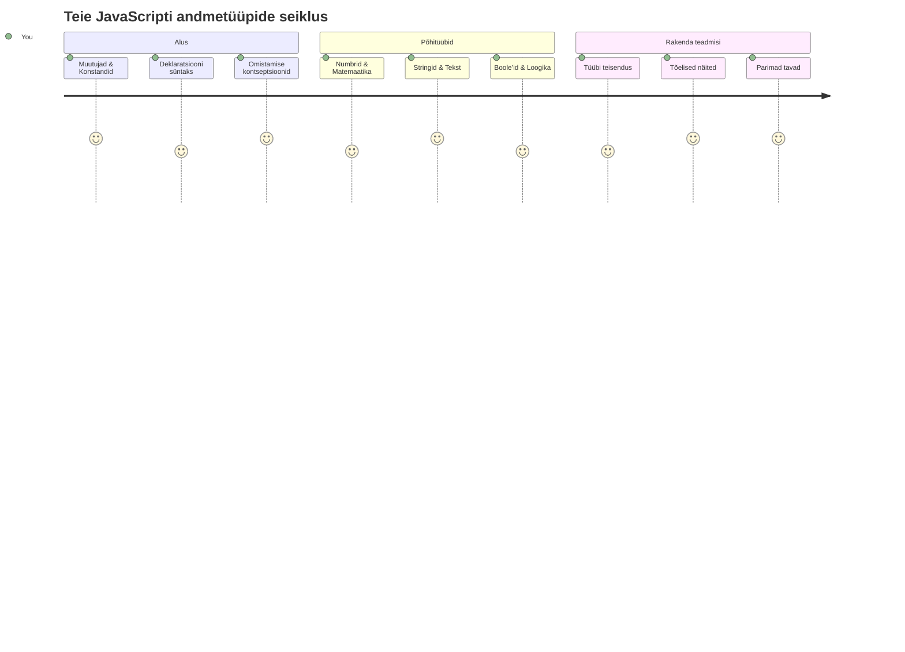
Andmetüübid on üks JavaScripti põhikontseptsioone, millega kohtud igas programmis, mida kirjutad. Mõtle andmetüüpidele nagu Alexandria iidsete raamatukoguhoidjate kasutatud arhiveerimissüsteemile – nad omasid kindlaid kohti rullraamatutele, mis sisaldasid luulet, matemaatikat ja ajaloolisi andmeid. JavaScript korraldab teavet sarnaselt, erinevate kategooriate kaupa erinevate andmetüüpide jaoks.

Selles tunnis uurime JavaScripti tööd võimaldavaid põhianumitreid. Õpid, kuidas käsitleda numbreid, teksti, tõeväärtusi ning mõistad, miks õige tüübi valimine on sinu programmide jaoks oluline. Need mõisted võivad alguses tunduda abstraktsed, kuid praktiseerides saavad neist sinu teine loomus.

Andmetüüpide mõistmine teeb kõike muud JavaScriptis märksa selgemaks. Nii nagu arhitektid peavad enne katedraali ehitamist tundma erinevaid ehitusmaterjale, toetavad need alused kõike, mida edaspidi ehitad.

## Loengu-eelne viktoriin
[Loengu-eelne viktoriin](https://ff-quizzes.netlify.app/web/)

See tund katab JavaScripti aluseid, mis on veebis interaktiivsuse võimaldamise keel.

> Saad selle tunni läbida ka [Microsoft Learn’is](https://docs.microsoft.com/learn/modules/web-development-101-variables/?WT.mc_id=academic-77807-sagibbon)!

[](https://youtube.com/watch?v=JNIXfGiDWM8 "Muutujad JavaScriptis")

[](https://youtube.com/watch?v=AWfA95eLdq8 "Andmetüübid JavaScriptis")

> 🎥 Klõpsa ülalolevatel piltidel, et vaadata muutujaid ja andmetüüpe käsitlevaid videoid

Alustame muutujatest ja andmetüüpidest, mis neid täidavad!

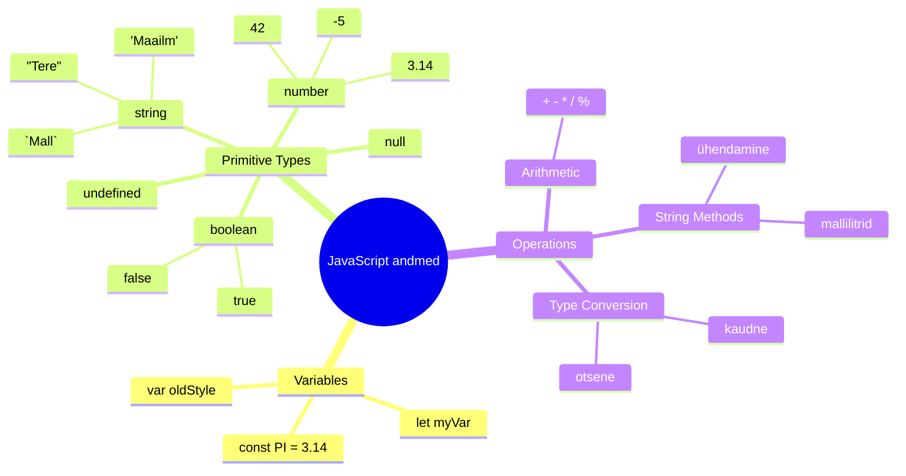
## Muutujad

Muutujad on programmeerimise põhielemendid. Nagu märgistatud purgid, mida keskaegsed alkeemikud kasutasid erinevate ainete talletamiseks, võimaldavad muutujad sul hoida teavet ja anda sellele kirjeldav nimi, et saaksid sellele hiljem viidata. Pead kellegi vanust meeles pidama? Säilita see muutujas nimega `age`. Tahad kasutaja nime jälgida? Hoia seda muutujas nimega `userName`.

Keskendume JavaScriptis muutujate loomise kaasaegsele lähenemisele. Siin õpitavad tehnikad põhinevad aastaid kestnud keele arengul ja programmeerimiskogukonnas välja kujunenud parimatel tavadel.

Muuttuja loomisel ja **deklareerimisel** on süntaks järgmine: **[võti] [nimi]**. See koosneb kahest osast:

- **Võti**. Kasuta `let` muutujate jaoks, mis võivad muutuda, või `const` väärtuste jaoks, mis püsivad samadena.
- **Muuttuja nimi**, see on kirjeldav nimi, mille valid ise.

✅ Võti `let` toodi sisse ES6-s ja annab muutujale nn _plokiruumi ulatuse_. Soovitatav on kasutada `let` või `const` vanema `var` asemel. Plokiruume käsitleme tulevastes osades põhjalikumalt.

### Ülesanne – muutujatega töötamine

1. **Dekleeri muutuja**. Alustame esimese muutuja loomisega:

    ```javascript
    let myVariable;
    ```

   **Mida see teeb:**
   - See ütleb JavaScriptile, et luua muutujale nimetusega `myVariable` salvestuskoht
   - JavaScript reserveerib muutujale ruumi mälus
   - Muutujal pole praegu väärtust (undefined)

2. **Anna väärtus**. Paneme nüüd muutujasse midagi:

    ```javascript
    myVariable = 123;
    ```

   **Kuidas väärtuse määramine töötab:**
   - Operaator `=` määrab muutujale väärtuseks 123
   - Muutuja sisaldab nüüd seda väärtust, mitte enam undefined
   - Saad kogu koodis sellele väärtusele viidata nimega `myVariable`

   > Märkus: tšunksis `=` tähendab, et kasutame "määramisoperaatorit", mis määrab muutujale väärtuse. See ei tähista võrdust.

3. **Tee seda targalt**. Kombineerime need kaks sammu:

    ```javascript
    let myVariable = 123;
    ```

    **See lähenemine on tõhusam:**
    - Deklareerid muutujad ja määrad väärtuse ühes lauses
    - See on tavapraktika arendajate seas
    - Vähendab koodi pikkust ja säilitab selguse

4. **Muuda meelt**. Mis siis, kui tahame talletada teise numbri?

   ```javascript
   myVariable = 321;
   ```

   **Taasesituse mõistmine:**
   - Muutuja hoiab nüüd väärtust 321, varasema 123 asemel
   - Varasem väärtus asendatakse – muutujad hoiavad korraga ainult ühte väärtust
   - See muutuvus on `let`-ga deklareeritud muutujate võtmetunnus

   ✅ Proovi! Saad kirjutada JavaScripti otse oma brauseris. Ava arendaja tööriistad ja mine konsooli. Kirjuta `let myVariable = 123`, vajuta Enter, siis kirjuta `myVariable`. Mis juhtub? Mõisted saavad sulle selgemaks järgnevate tundide jooksul.

### 🧠 **Muutujate valdamise kontroll: mugavuse saavutamine**

**Vaatame, kuidas sul muutujatega läheb:**
- Kas oskad selgitada muutujate deklareerimise ja väärtuse määramise vahet?
- Mis juhtub, kui püüad kasutada muutujat enne selle deklareerimist?
- Millal valid muutuja jaoks `let` asemel `const`?

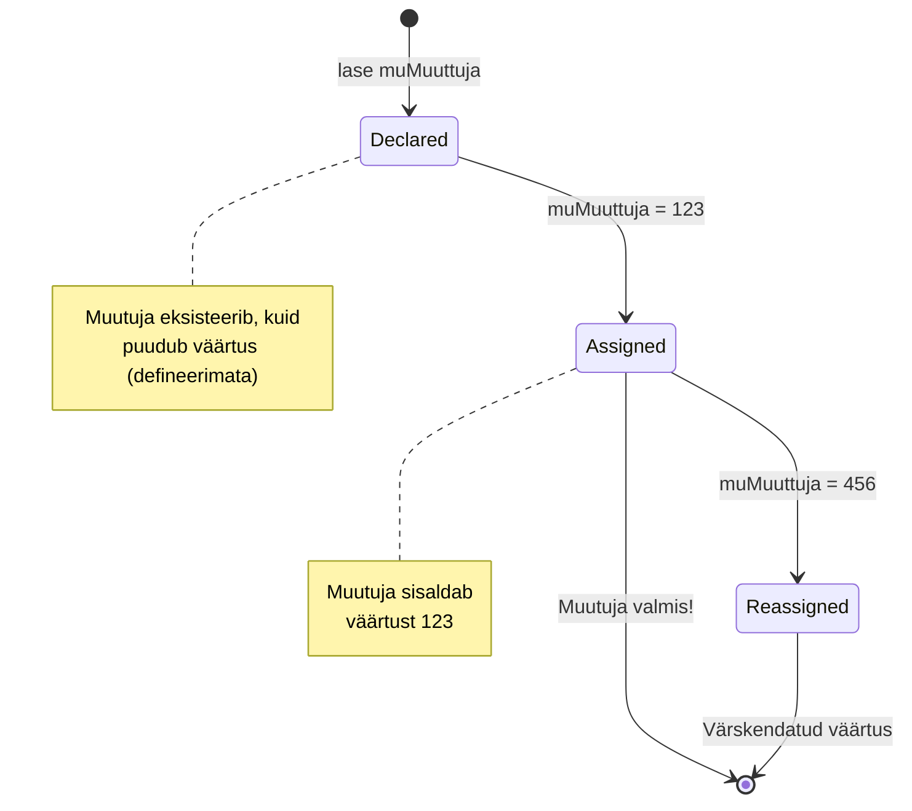
> **Nipp**: Mõtle muutujatele kui märgistatud hoiukastidele. Sa lood kasti (`let`), paned sellesse midagi (`=`) ja vajadusel vahetad sisu hiljem!

## Konstandid

Mõnikord tuleb talletada teavet, mis programmi jooksutamise ajal ei tohiks muutuda. Mõtle konstandidele nagu matemaatilised printsiibid, mille Eukleides iidse Kreeka ajal kehtestas – kui need on tõestatud ja dokumenteeritud, püsivad need muutumatuna igaveseks.

Konstandid töötavad sarnaselt muutujatega, kuid olulise piiranguga: kui väärtus on määratud, ei saa seda enam muuta. See muutumatuse omadus aitab vältida kriitiliste väärtuste tahtmatut muutmist programmis.

Konstandi deklareerimine ja initsialiseerimine järgib samu põhimõtteid nagu muutujal, ainult et kasutatakse võtmesõna `const`. Konstande kirjutatakse tavaliselt suurte tähtedega.

```javascript
const MY_VARIABLE = 123;
```

**See kood teeb järgmist:**
- **Loomine** konstandile nimega `MY_VARIABLE` väärtusega 123
- **Suurtähtede** kasutamine konstandi nimena
- **Keelamine** tulevastel väärtuse muutmistel

Konstandidel on kaks peamist reeglit:

- **Nendele tuleb kohe anda väärtus** – tühjad konstandid pole lubatud!
- **Väärtust ei tohi kunagi muuta** – JavaScript viskab vea, kui proovid. Vaata, mida ma mõtlen:

   **Lihtne väärtus** - Alljärgnev EI OLE lubatud:
   
      ```javascript
      const PI = 3;
      PI = 4; // ei ole lubatud
      ```

   **Mida meeles pidada:**
   - **Püüdlused** konstanti uuesti määrata põhjustavad vea
   - **Kaitseb** olulisi väärtusi juhuslike muutuste eest
   - **Tagab**, et väärtus on kogu programmi jooksul püsiv

   **Objekti viide on kaitstud** - Alljärgnev EI OLE lubatud:
   
      ```javascript
      const obj = { a: 3 };
      obj = { b: 5 } // ei ole lubatud
      ```

   **Neid mõisteid mõistes:**
   - **Takistab** kogu objekti asendamist uuega
   - **Kaitseb** algse objekti viidet
   - **Säilitab** objekti identiteedi mälus

    **Objekti väärtus ei ole kaitstud** - Alljärgnev ON lubatud:
    
      ```javascript
      const obj = { a: 3 };
      obj.a = 5;  // lubatud
      ```

      **Mis siin juhtub:**
      - **Muudab** objekti sees olevaid omaduse väärtusi
      - **Hoiab** sama objekti viide
      - **Näitab**, et objekti sisu võib muutuda, kuigi viide jääb samaks

   > Märkus: `const` tähendab, et viide on kaitstud uuesti määramise eest. Väärtus ei ole aga _muutumatu_ ja võib muutuda, eriti kui tegemist on keeruka konstruktsiooniga nagu objekt.

## Andmetüübid

JavaScript korraldab info erinevatesse kategooriatesse, mida nimetatakse andmetüüpideks. See mõiste peegeldab seda, kuidas iidsetel teadlastel oli teadmiste liigistamine – Aristoteles eristas erinevaid mõtlemise liike, teades, et loogilisi põhimõtteid ei saa ühtemoodi rakendada luulele, matemaatikale ja loodusteadustele.

Andmetüübid on olulised, sest erinevad operatsioonid töötavad eri tüüpi informatsiooniga. Nagu ei saa kellegi nime kallal aritmeetikat teha ega matemaatilist võrrandit tähestikulises järjekorras paigutada, nõuab JavaScript iga operatsiooni jaoks sobival andmetüübil põhinevat lähenemist. Selle mõistmine aitab vältida vigu ja muudab koodi usaldusväärsemaks.

Muutujad võivad hoida erinevat tüüpi väärtusi nagu numbrid ja tekst. Neid erinevaid väärtuste tüüpe nimetatakse **andmetüüpideks**. Andmetüübid on tarkvaraarenduse oluline osa, kuna aitavad arendajatel otsuseid vastu võtta, kuidas koodi kirjutada ja kuidas tarkvara töö peab käituma. Lisaks on mõnel andmetüübil unikaalsed omadused, mis aitavad väärtuses teisendada või ekstraheerida täiendavat teavet.

✅ Andmetüübid on tuntud ka kui JavaScripti andmeprimitiivid, kuna need on keele pakutavad madalaima taseme andmetüübid. On 7 primitiivset andmetüüpi: string, number, bigint, boolean, undefined, null ja symbol. Võta hetk ja kujutle, mida iga primitiiv võiks kujutada. Mis on `sebra`? Kuidas oleks `0`? `true`?

### Numbrid

Numbrid on JavaScriptis kõige lihtsam andmetüüp. Olgu tegemist täisarvudega nagu 42, komakohalistega nagu 3.14 või negatiivsete arvudega nagu -5, JavaScript käsitleb neid kõiki ühtsel viisil.

Pea meeles meie varasemat muutujat? See 123, mille seal hoidsime, oli tegelikult numbri andmetüüp:

```javascript
let myVariable = 123;
```

**Peamised omadused:**
- JavaScript tunneb numbrilise väärtuse automaatselt ära
- Nendega saad teha matemaatilisi tehteid
- Tüüpi ei ole vaja eksplicitseerida

Muutujad võivad hoida kõiki arvutüüpe, kaasa arvatud komad ja negatiivsed numbrid. Numbreid saab kasutada ka aritmeetiliste operaatoritega, mida käsitleme [järgmises jaos](../../../../2-js-basics/1-data-types).

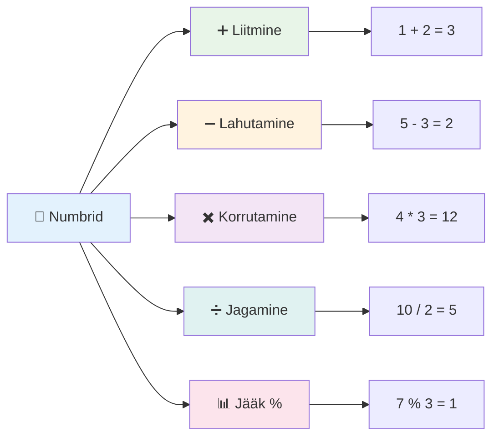
### Aritmeetilised operaatorid

Aritmeetilised operaatorid võimaldavad teha matemaatilisi arvutusi JavaScriptis. Need operaatorid järgivad samu põhimõtteid, mida matemaatikud on sajandeid kasutanud – samu märke, mis esinesid teadlaste nagu Al-Hvārazmī kirjutistes, kes töötas välja algebra notatsiooni.

Operaatorid toimivad nii, nagu traditsiooniline matemaatika eeldab: pluss liitmiseks, miinus lahutamiseks jne.

Siin on mõned aritmeetilised operaatorid:

| Sümbol | Kirjeldus                                                              | Näide                                |
| ------ | ---------------------------------------------------------------------- | ----------------------------------- |
| `+`    | **Liitmine**: kahe numbri summa arvutamine                            | `1 + 2 //oodatud vastus on 3`       |
| `-`    | **Lahutamine**: kahe numbri vahe arvutamine                           | `1 - 2 //oodatud vastus on -1`      |
| `*`    | **Korrutamine**: kahe numbri korrutis                                  | `1 * 2 //oodatud vastus on 2`       |
| `/`    | **Jagamine**: kahe numbri jagatis                                    | `1 / 2 //oodatud vastus on 0.5`     |
| `%`    | **Jääk**: kahe numbri jagamisel jäägi väärtus                         | `1 % 2 //oodatud vastus on 1`       |

✅ Proovi! Tee aritmeetiline tehe oma brauseri konsoolis. Kas tulemused üllatavad?

### 🧮 **Matemaatikatest: arvutamiskindlus**

**Testi oma arvutusteadmisi:**
- Mis vahe on operaatoritel `/` (jagamine) ja `%` (jääk)?
- Kas suudad ennustada, mis on `10 % 3`? (Vihje: see ei ole 3.33...)
- Milleks võiks programmeerimises jääkoperattor kasulik olla?

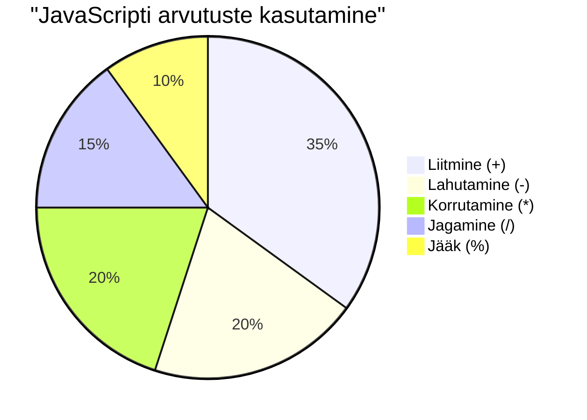
> **Praktiline nipp**: jääkoperatorit (%) kasutatakse väga tihti paarisarvude ja paaritute kontrollimiseks, mustrite loomiseks või massiivide tsükliliseks läbimiseks!

### Stringid

JavaScriptis esitatakse tekstilist andmestikku stringidena. Mõiste "string" tuleb sellest, et tähemärke on järjestikku ritta pandud, nagu keskaegsete kloostrite kirjanikud ühendasid tähti sõnadeks ja lauseteks oma käsikirjades.

Stringid on veebiarenduse aluseks. Kõik veebisaidil kuvatav tekst – kasutajanimed, nupusildid, veateated, sisu – käsitletakse stringandmetena. Stringide mõistmine on funktsionaalsete kasutajaliideste loomisel hädavajalik.

Stringid on tähemärkide kogumid, mis on ümbritsetud ühekordsete või kahekordsete jutumärkidega.

```javascript
'This is a string'
"This is also a string"
let myString = 'This is a string value stored in a variable';
```

**Põhimõistete selgitus:**
- **Kasutab** kas ühekordseid `'` või kahekordseid `"` jutumärke stringide määramiseks
- **Säilitab** tekstilist andmestikku, mis võib sisaldada tähti, numbreid ja sümboleid
- **Määrab** muutujatele stringväärtusi edasiseks kasutamiseks
- **Nõuab** jutumärkide kasutamist, et tekst eristuks muutuja nimest

Mäleta jutumärke kasutada stringi kirjutamisel, vastasel juhul võtab JavaScript seda muutujanimena.

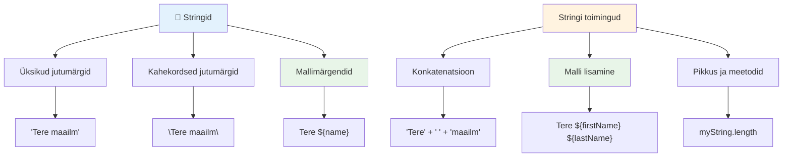
### Stringide vormindamine

Stringide manipuleerimisega saad kombineerida tekstielemente, lisada muutujad ja luua dünaamilist sisu, mis reageerib programmi olekule. See võimaldab teksti programmeeritult koostada.

Tihti tuleb kokku liita mitu stringi – seda nimetatakse konkateneerimiseks.
Kahe või enama stringi **ühendamiseks** või kokku liitmiseks kasuta operaatorit `+`.

```javascript
let myString1 = "Hello";
let myString2 = "World";

myString1 + myString2 + "!"; //Tere, maailm!
myString1 + " " + myString2 + "!"; //Tere Maailm!
myString1 + ", " + myString2 + "!"; //Tere, Maailm!
```

**Samm-sammult, siin toimub:**
- **Ühendab** mitut stringi operaatoriga `+`
- **Liidab** stringid otse kokku ilma tühikuteta esimeses näites
- **Lisab** lugemise hõlbustamiseks stringide vahele tühikuid `" "`
- **Sisestab** kirjavahemärke nagu komad, et luua korrektne vormindus

✅ Miks on JavaScriptis `1 + 1 = 2`, kuid `'1' + '1' = 11?` Mõtle sellele. Aga mis juhtub, kui `'1' + 1`?

**Malliliteraalid** on teine viis stringide vormindamiseks, välja arvatud see, et jutumärkide asemel kasutatakse tagurpidi kriipse. Kõik, mis ei ole tava tekst, peab olema paigutatud kohatäitjate `${ }` sisse. See hõlmab ka kõiki muutujaid, mis võivad olla stringid.

```javascript
let myString1 = "Hello";
let myString2 = "World";

`${myString1} ${myString2}!` //Tere, maailm!
`${myString1}, ${myString2}!` //Tere, maailm!
```

**Mõistame iga osa:**
- **Kasutab** malliliteraalide loomiseks tavapäraste jutumärkide asemel tagurpidi kriipse `` ` ``
- **Sisestab** muutujaid otse kasutades kohatäitjat `${}`
- **Säilitab** tühikud ja vormingu täpselt nagu kirjutatud
- **Pakku** puhast viisi keerukate stringide loomisel koos muutujatega

Sa võid saavutada oma vorminduse eesmärgid mõlemal meetodil, kuid malliliteraalid austavad kõiki tühikuid ja reavahetusi.

✅ Millal kasutaksid malliliteraali ja millal tavalist stringi?

### 🔤 **Stringi valdamise kontroll: Teksti manipuleerimise kindlus**

**Hinda oma stringioskusi:**
- Kas oskad selgitada, miks `'1' + '1'` võrdub `'11'`, mitte `2`?
- Millist stringimeetodit pead lugemise hõlbustamiseks paremaks: järjestamine või malliliteraalid?
- Mis juhtub, kui unustad stringi ümber jutumärgid?

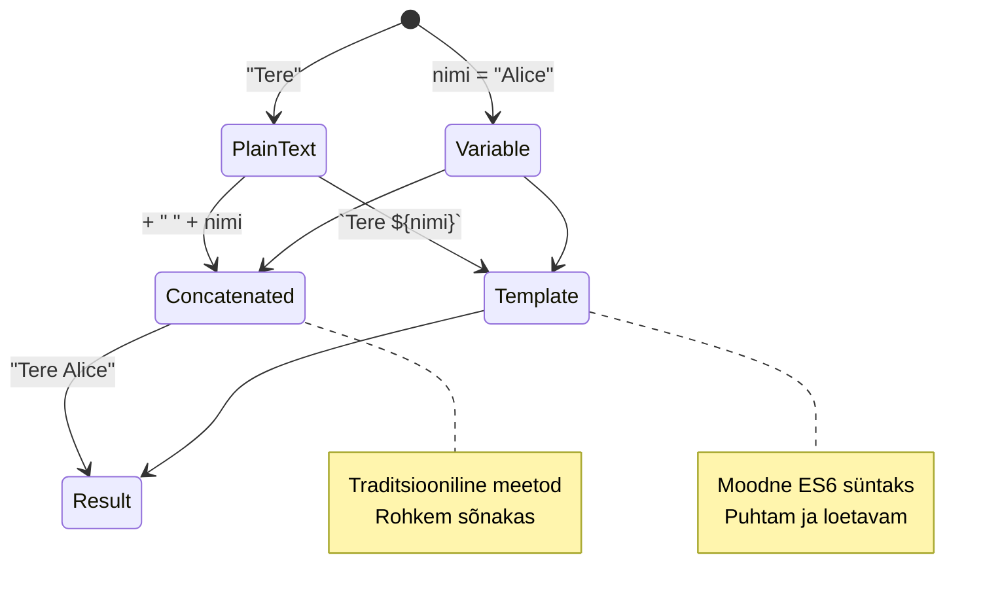
> **Nõuandeid proffidelt**: Malliliteraalid on üldiselt eelistatumad keerukate stringide loomisel, sest need on loetavamad ja käsitlevad ilusti mitmerealisi stringe!

### Boole’id

Boole’id esindavad andmete kõige lihtsamat vormi: nad saavad võtta vaid kahte väärtust – `true` (tõene) või `false` (valeh). See binaarlogika süsteem viitab 19. sajandi matemaatiku George Boole tööle, kes töötas välja Boole algebra.

Vaatamata nende lihtsusele on boole’id olulised programmi loogikas. Nad võimaldavad koodil teha otsuseid tingimuste alusel – kas kasutaja on sisse logitud, kas nuppu vajutati, või kas teatud tingimused on täidetud.

Boole’id võivad olla vaid kaks väärtust: `true` või `false`. Boole’id aitavad teha otsuseid, milliseid koodiridu täita, kui mattud tingimused on täidetud. Paljudel juhtudel aitavad [operaatorid](../../../../2-js-basics/1-data-types) boole väärtust määrata ning sul on tihti märgata ja kirjutada muutujaid, millele väärtused on operaatoriga määratud või uuendatud.

```javascript
let myTrueBool = true;
let myFalseBool = false;
```

**Ülaltoodud näites oleme:**
- **Loonud** muutuja, mis salvestab boole väärtuse `true`
- **Näidanud** kuidas salvestada boole väärtuse `false`
- **Kasutanud** täpseid võtmesõnu `true` ja `false` (jutumärke ei ole vaja)
- **Valmistanud** need muutujad tingimuslauseteks kasutamiseks

✅ Muutujat võib pidada 'tõeseks', kui see hindamisel annab boole `true`. Huvitaval kombel on JavaScriptis [kõik väärtused tõesed, välja arvatud need, mida on defineeritud valetena](https://developer.mozilla.org/docs/Glossary/Truthy).

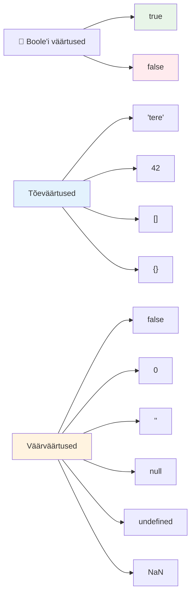
### 🎯 **Boole loogika test: Otsuste tegemise oskused**

**Testi oma boole arusaamist:**
- Miks arvad, et JavaScriptil on "tõed" ja "valed" väärtused lisaks ainult `true` ja `false`?
- Kas saad ennustada, milline neist on vale: `0`, `"0"`, `[]`, `"false"`?
- Kuidas võivad boole’id olla kasulikud programmi töökorra juhtimisel?

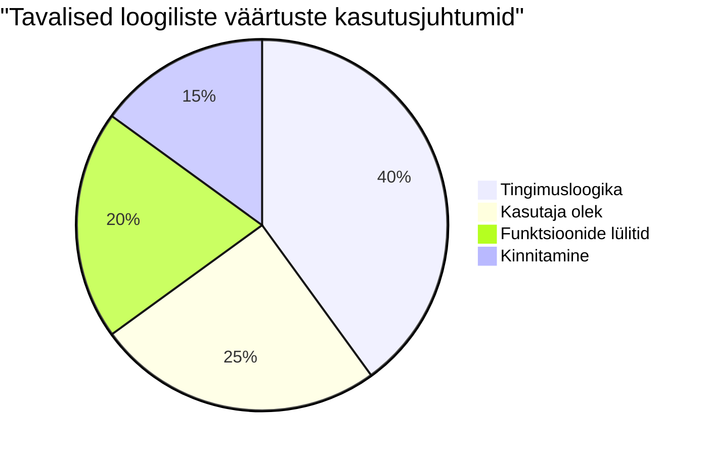
> **Pea meeles**: JavaScriptis on vaid 6 valet (falsy) väärtust: `false`, `0`, `""`, `null`, `undefined` ja `NaN`. Kõik muu on tõene (truthy)!

---

## 📊 **Sinu andmetüüpide tööriistakasti kokkuvõte**

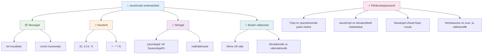
## GitHub Copilot Agendi väljakutse 🚀

Kasuta Agendi režiimi järgneva väljakutse lõpetamiseks:

**Kirjeldus:** Loo isikuandmete haldur, mis demonstreerib kõiki selle õppetunni jooksul JavaScripti andmetüüpe, käsitledes pärismaailma andmejuhtumeid.

**Ülesanne:** Koosta JavaScript programm, mis loob kasutajaprofiili objekti sisaldades: inimese nime (string), vanust (number), õpilase staatust (boolean), lemmikvärvide loendit ja aadressi objekti, mis sisaldab tänavat, linna ja postiindeksit. Lisa funktsioonid profiili kuvamiseks ja üksikute väljade uuendamiseks. Näita kindlasti stringide ühendamist, malliliteraale, aritmeetilisi operatsioone vanusega ning boole loogikat õpilase staatuse kohta.

Loe rohkem [agent mode’i kohta](https://code.visualstudio.com/blogs/2025/02/24/introducing-copilot-agent-mode).

## 🚀 Väljakutse

JavaScriptil on mitmeid käitumisviise, mis võivad arendajaid ootamatult tabada. Siin on klassikaline näide uurimiseks: proovi oma brauseri konsoolis sisestada: `let age = 1; let Age = 2; age == Age` ja vaata tulemust. See annab `false` – suudad välja selgitada, miks?

See on üks paljudest JavaScripti käitumistest, mida tasub mõista. Nende eripärade tundmine aitab sul kirjutada kindlamat koodi ja tõrkeid paremini lahendada.

## Loengujärgne test
[Loengujärgne test](https://ff-quizzes.netlify.app)

## Kordamine ja iseseisev õpe

Vaata [seda JavaScripti harjutuste nimekirja](https://css-tricks.com/snippets/javascript/) ja proovi midagi. Mida sa õppisid?

## Kodune ülesanne

[Andmetüüpide harjutus](assignment.md)

## 🚀 Sinu JavaScripti andmetüüpide valdamise ajakava

### ⚡ **Mida saad teha järgmise 5 minutiga**
- [ ] Ava oma brauseri konsool ja loo 3 muutujat eri andmetüüpidega
- [ ] Proovi väljakutset: `let age = 1; let Age = 2; age == Age` ja leia, miks tulemus on false
- [ ] Harjuta stringide ühendamist oma nime ja lemmiknumbriga
- [ ] Testi, mis juhtub, kui lisad numbrile stringi

### 🎯 **Mida saad selle tunni jooksul saavutada**
- [ ] Täida loengujärgne test ja korda ebamääraseid kontseptsioone
- [ ] Koosta mini-kalkulaator, mis liidab, lahutab, korrutab ja jagab kahte arvu
- [ ] Loo lihtne nimenormeerija kasutades malliliteraale
- [ ] Uuri `==` ja `===` võrdlusoperaatorite erinevusi
- [ ] Harjuta andmetüüpide vahel teisendamist

### 📅 **Sinu nädala pikkune JavaScripti põhioskete programm**
- [ ] Täida ülesanne kindlusega ja loovusega
- [ ] Loo isikuprofiili objekt kõigi õpitud andmetüüpidega
- [ ] Harjuta JavaScripti harjutustega CSS-Tricksist [https://css-tricks.com/snippets/javascript/](https://css-tricks.com/snippets/javascript/)
- [ ] Loo lihtne vormikontroll kasutades boole loogikat
- [ ] Katseta massiivide ja objektide andmetüüpe (tulevaste õppetükkide eelvaade)
- [ ] Liitu JavaScripti kogukonnaga ja küsi andmetüüpide kohta

### 🌟 **Sinu kuuajaline areng**
- [ ] Integreeri andmetüüpide teadmised suurematesse programmeerimisprojektidesse
- [ ] Mõista, millal ja miks kasutada iga andmetüüpi pärismaailma rakendustes
- [ ] Aita teisi algajaid JavaScripti aluste mõistmisel
- [ ] Loo väike rakendus, mis haldab erinevaid kasutajaandmetüüpe
- [ ] Uuri täpsemaid andmetüüpide kontseptsioone nagu tüübisundimine ja range võrdus
- [ ] Panusta avatud lähtekoodiga JavaScripti projektidesse dokumentatsiooni täiustamisega

### 🧠 **Lõplik andmetüüpide valdamise kontroll**

**Tähista oma JavaScripti alust:**
- Milline andmetüüp üllatas sind kõige rohkem oma käitumise poolest?
- Kui kindlalt tunned end muutujate ja konstantide seletamisel sõbrale?
- Mis on kõige huvitavam asi, mida sa avastasid JavaScripti tüübiesüsteemi kohta?
- Millise pärismaailma rakenduse suudaksid nende alustega ehitada?

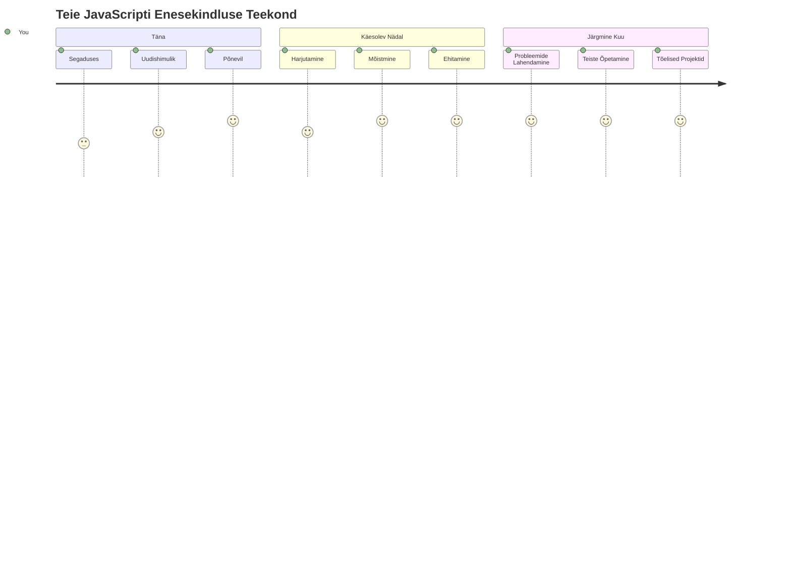
> 💡 **Oled loonud vundamendi!** Andmetüüpide mõistmine on nagu tähestiku õppimine enne lugude kirjutamist. Iga JavaScripti programm, mida kunagi kirjutad, kasutab neid põhikontseptsioone. Sul on nüüd alus, millega luua interaktiivseid veebilehti, dünaamilisi rakendusi ja lahendada pärismaailma probleeme koodiga. Tere tulemast imelisse JavaScripti maailma! 🎉

---

<!-- CO-OP TRANSLATOR DISCLAIMER START -->
**Vastutusest loobumine**:
See dokument on tõlgitud AI tõlketeenuse [Co-op Translator](https://github.com/Azure/co-op-translator) abil. Kuigi püüame tagada täpsust, tuleb arvestada, et automaatsetes tõlgetes võib esineda vigu või ebatäpsusi. Originaaldokument selle emakeeles tuleks pidada autoriteetseks allikaks. Kriitilise tähtsusega teabe puhul soovitame kasutada professionaalset inimtõlget. Me ei vastuta tõlke kasutamisest tulenevate arusaamatuste ega valesti mõistmiste eest.
<!-- CO-OP TRANSLATOR DISCLAIMER END -->