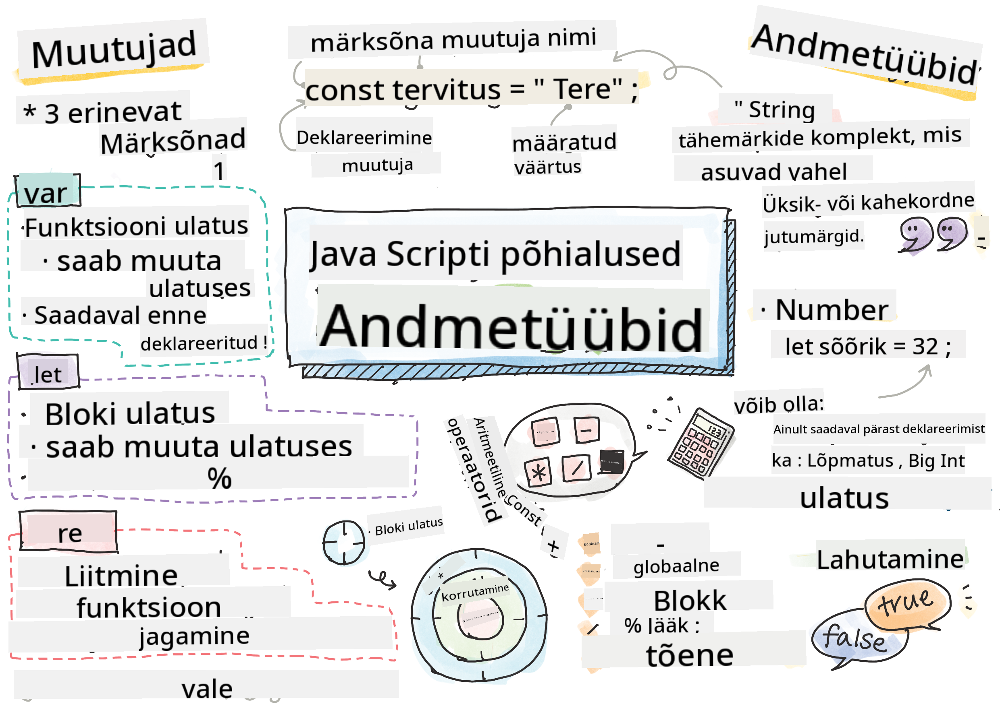

<!--
CO_OP_TRANSLATOR_METADATA:
{
  "original_hash": "b95fdd8310ef467305015ece1b0f9411",
  "translation_date": "2025-10-11T11:42:29+00:00",
  "source_file": "2-js-basics/1-data-types/README.md",
  "language_code": "et"
}
-->
# JavaScript'i põhialused: Andmetüübid


> Sketšimärkmed: [Tomomi Imura](https://twitter.com/girlie_mac)

## Eelloengu viktoriin
[Eelloengu viktoriin](https://ff-quizzes.netlify.app/web/)

See õppetund käsitleb JavaScript'i põhialuseid, keelt, mis lisab veebile interaktiivsust.

> Selle õppetunni leiad [Microsoft Learnist](https://docs.microsoft.com/learn/modules/web-development-101-variables/?WT.mc_id=academic-77807-sagibbon)!

[](https://youtube.com/watch?v=JNIXfGiDWM8 "Muutujad JavaScript'is")

[](https://youtube.com/watch?v=AWfA95eLdq8 "Andmetüübid JavaScript'is")

> 🎥 Klõpsa ülalolevatel piltidel, et vaadata videoid muutujate ja andmetüüpide kohta.

Alustame muutujatest ja andmetüüpidest, mis neid täidavad!

## Muutujad

Muutujad salvestavad väärtusi, mida saab koodis kasutada ja muuta.

Muutuja **loomine** ja **deklareerimine** toimub järgmise süntaksiga **[märksõna] [nimi]**. See koosneb kahest osast:

- **Märksõna**. Märksõnadeks võivad olla `let` või `var`.  

✅ Märksõna `let` tutvustati ES6-s ja see annab muutujale nn _bloki ulatuse_. Soovitatav on kasutada `let` märksõna `var` asemel. Bloki ulatust käsitleme põhjalikumalt tulevastes osades.
- **Muutuja nimi**, mille valid ise.

### Ülesanne - töötamine muutujatega

1. **Deklareeri muutuja**. Deklareerime muutuja, kasutades märksõna `let`:

    ```javascript
    let myVariable;
    ```

   `myVariable` on nüüd deklareeritud, kasutades märksõna `let`. Sellel pole hetkel väärtust.

1. **Omista väärtus**. Salvestame väärtuse muutujasse, kasutades `=` operaatorit, millele järgneb oodatav väärtus.

    ```javascript
    myVariable = 123;
    ```

   > Märkus: `=` kasutamine selles õppetunnis tähendab, et kasutame "omistamisoperaatorit", mida kasutatakse väärtuse määramiseks muutujale. See ei tähenda võrdsust.

   `myVariable` on nüüd *initsialiseeritud* väärtusega 123.

1. **Refaktoreeri**. Asenda oma kood järgmise lausega.

    ```javascript
    let myVariable = 123;
    ```

    Ülaltoodut nimetatakse _selgesõnaliseks initsialiseerimiseks_, kui muutuja deklareeritakse ja sellele määratakse väärtus samal ajal.

1. **Muuda muutuja väärtust**. Muuda muutuja väärtust järgmiselt:

   ```javascript
   myVariable = 321;
   ```

   Kui muutuja on deklareeritud, saab selle väärtust igal ajal koodis muuta, kasutades `=` operaatorit ja uut väärtust.

   ✅ Proovi ise! Sa saad kirjutada JavaScript'i otse oma brauseris. Ava brauseri aken ja navigeeri arendustööriistadesse. Konsoolis leiad käsuviiba; sisesta `let myVariable = 123`, vajuta Enter, seejärel sisesta `myVariable`. Mis juhtub? Märkus: õpid neid kontseptsioone rohkem järgnevates õppetundides.

## Konstandid

Konstandi deklareerimine ja initsialiseerimine järgib samu põhimõtteid nagu muutuja puhul, välja arvatud märksõna `const`. Konstandid deklareeritakse tavaliselt suurte tähtedega.

```javascript
const MY_VARIABLE = 123;
```

Konstandid on sarnased muutujatega, kuid neil on kaks erandit:

- **Peab olema väärtus**. Konstandid peavad olema initsialiseeritud, vastasel juhul tekib koodi käivitamisel viga.
- **Viidet ei saa muuta**. Konstandi viidet ei saa pärast initsialiseerimist muuta, vastasel juhul tekib koodi käivitamisel viga. Vaatame kahte näidet:
   - **Lihtne väärtus**. Järgmine EI ole lubatud:
   
      ```javascript
      const PI = 3;
      PI = 4; // not allowed
      ```
 
   - **Objekti viide on kaitstud**. Järgmine EI ole lubatud.
   
      ```javascript
      const obj = { a: 3 };
      obj = { b: 5 } // not allowed
      ```

    - **Objekti väärtus ei ole kaitstud**. Järgmine ON lubatud:
    
      ```javascript
      const obj = { a: 3 };
      obj.a = 5;  // allowed
      ```

      Ülaltoodud näites muudad objekti väärtust, kuid mitte viidet ennast, mis teeb selle lubatuks.

   > Märkus: `const` tähendab, et viide on kaitstud ümbermääramise eest. Väärtus ei ole siiski _muutumatu_ ja võib muutuda, eriti kui tegemist on keeruka konstruktsiooniga nagu objekt.

## Andmetüübid

Muutujad võivad salvestada mitmesuguseid väärtusi, nagu numbrid ja tekst. Need erinevad väärtuste tüübid on tuntud kui **andmetüübid**. Andmetüübid on tarkvaraarenduse oluline osa, kuna need aitavad arendajatel otsustada, kuidas koodi kirjutada ja kuidas tarkvara peaks töötama. Lisaks on mõnel andmetüübil unikaalsed omadused, mis aitavad väärtusest lisainfot tuletada või seda muuta.

✅ Andmetüüpe nimetatakse ka JavaScript'i andmeprimitiivideks, kuna need on keele poolt pakutavad madalaimad andmetüübid. Primitiiive on 7: string, number, bigint, boolean, undefined, null ja symbol. Võta hetk, et visualiseerida, mida igaüks neist primitiividest võiks esindada. Mis on `zebra`? Aga `0`? `true`?

### Numbrid

Eelmises osas oli `myVariable` väärtus andmetüüp number.

`let myVariable = 123;`

Muutujad võivad salvestada igasuguseid numbreid, sealhulgas kümnendmurde või negatiivseid numbreid. Numbrid võivad olla kasutusel ka aritmeetiliste operaatoritega, mida käsitletakse [järgmises osas](../../../../2-js-basics/1-data-types).

### Aritmeetilised operaatorid

Aritmeetiliste funktsioonide teostamiseks on mitut tüüpi operaatoreid, millest mõned on siin loetletud:

| Sümbol | Kirjeldus                                                               | Näide                           |
| ------ | ----------------------------------------------------------------------- | ------------------------------- |
| `+`    | **Liitmine**: Arvutab kahe arvu summa                                   | `1 + 2 //oodatav vastus on 3`   |
| `-`    | **Lahutamine**: Arvutab kahe arvu vahe                                  | `1 - 2 //oodatav vastus on -1`  |
| `*`    | **Korrutamine**: Arvutab kahe arvu korrutise                            | `1 * 2 //oodatav vastus on 2`   |
| `/`    | **Jagamine**: Arvutab kahe arvu jagatise                                | `1 / 2 //oodatav vastus on 0.5` |
| `%`    | **Jääk**: Arvutab kahe arvu jagamise jäägi                              | `1 % 2 //oodatav vastus on 1`   |

✅ Proovi ise! Katseta aritmeetilist operatsiooni oma brauseri konsoolis. Kas tulemused üllatavad sind?

### Stringid

Stringid on tähemärkide kogumid, mis asuvad ühekordsete või kahekordsete jutumärkide vahel.

- `'See on string'`
- `"See on samuti string"`
- `let myString = 'See on stringi väärtus, mis on salvestatud muutujasse';`

Pea meeles kasutada jutumärke stringi kirjutamisel, vastasel juhul eeldab JavaScript, et tegemist on muutuja nimega.

### Stringide vormindamine

Stringid on tekstilised ja vajavad aeg-ajalt vormindamist.

Stringide **ühendamiseks** või nende kokkuliitmiseks kasuta `+` operaatorit.

```javascript
let myString1 = "Hello";
let myString2 = "World";

myString1 + myString2 + "!"; //HelloWorld!
myString1 + " " + myString2 + "!"; //Hello World!
myString1 + ", " + myString2 + "!"; //Hello, World!

```

✅ Miks on `1 + 1 = 2` JavaScript'is, aga `'1' + '1' = 11?` Mõtle sellele. Aga `'1' + 1`?

**Malliliteralid** on teine viis stringide vormindamiseks, kus jutumärkide asemel kasutatakse tagurpidi jutumärke. Kõik, mis ei ole lihttekst, tuleb paigutada kohatäidete `${ }` sisse. See hõlmab ka stringideks muutuvaid muutujaid.

```javascript
let myString1 = "Hello";
let myString2 = "World";

`${myString1} ${myString2}!` //Hello World!
`${myString1}, ${myString2}!` //Hello, World!
```

Sa võid saavutada oma vormindamise eesmärgid mõlemal viisil, kuid malliliteralid austavad kõiki tühikuid ja reavahetusi.

✅ Millal kasutaksid malliliteralit tavalise stringi asemel?

### Booleans

Booleans võib olla ainult kaks väärtust: `true` või `false`. Booleans aitab otsustada, millised koodiread peaksid teatud tingimuste täitumisel käivituma. Paljudel juhtudel aitavad [operaatorid](../../../../2-js-basics/1-data-types) booleani väärtuse määramisel ja sageli näed ning kirjutad muutujaid, mida initsialiseeritakse või mille väärtusi uuendatakse operaatoriga.

- `let myTrueBool = true`
- `let myFalseBool = false`

✅ Muutuja võib olla 'tõene', kui see hindab booleani `true`. Huvitaval kombel on JavaScript'is [kõik väärtused tõene, välja arvatud juhul, kui need on määratletud kui väär](https://developer.mozilla.org/docs/Glossary/Truthy).

---

## 🚀 Väljakutse

JavaScript on kurikuulus oma üllatavate viiside poolest, kuidas ta aeg-ajalt andmetüüpe käsitleb. Uuri veidi nende 'üllatuste' kohta. Näiteks: tõstutundlikkus võib tekitada probleeme! Proovi seda oma konsoolis: `let age = 1; let Age = 2; age == Age` (tulemus `false` -- miks?). Milliseid teisi üllatusi leiad?

## Järelloengu viktoriin
[Järelloengu viktoriin](https://ff-quizzes.netlify.app)

## Ülevaade ja iseseisev õppimine

Vaata [seda JavaScript'i harjutuste nimekirja](https://css-tricks.com/snippets/javascript/) ja proovi ühte. Mida õppisid?

## Ülesanne

[Andmetüüpide harjutamine](assignment.md)

---

**Lahtiütlus**:  
See dokument on tõlgitud AI tõlketeenuse [Co-op Translator](https://github.com/Azure/co-op-translator) abil. Kuigi püüame tagada täpsust, palume arvestada, et automaatsed tõlked võivad sisaldada vigu või ebatäpsusi. Algne dokument selle algses keeles tuleks pidada autoriteetseks allikaks. Olulise teabe puhul soovitame kasutada professionaalset inimtõlget. Me ei vastuta selle tõlke kasutamisest tulenevate arusaamatuste või valesti tõlgenduste eest.