# JavaScripti alused: meetodid ja funktsioonid

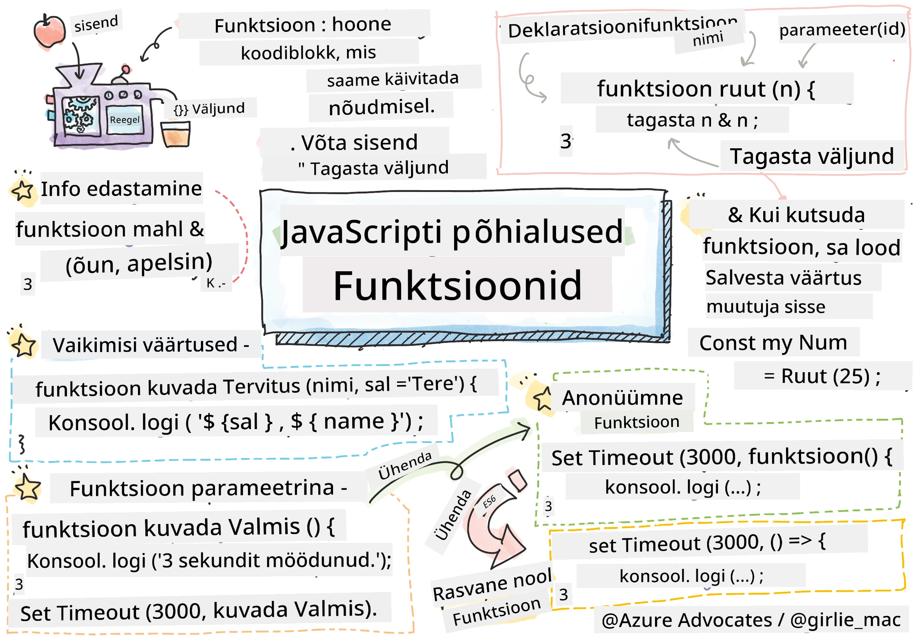
> Sketchnote autorilt [Tomomi Imura](https://twitter.com/girlie_mac)

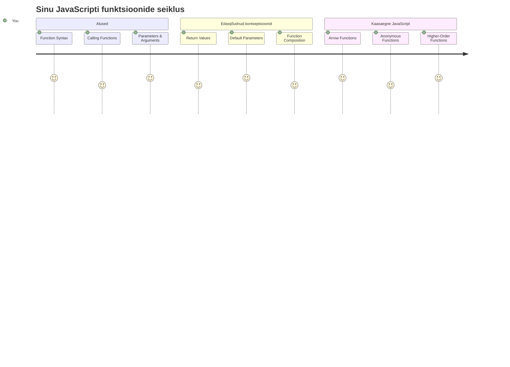
## Eel-loengu viktoriin
[Eel-loengu viktoriin](https://ff-quizzes.netlify.app)

Sama koodi korduvalt kirjutamine on programmeerimise üks levinumaid frustratsioone. Funktsioonid lahendavad selle probleemi, võimaldades sul pakendada koodi taaskasutatavatesse plokkidesse. Mõtle funktsioonidele nagu Henry Fordi liinikesksetele standardsetele osadele – kui sa lood usaldusväärse komponendi, saad seda kasutada kõikjal, ilma et peaksid iga kord nullist ehitama.

Funktsioonid võimaldavad sul grupeerida koodiosi, et saaksid neid oma programmis korduvalt kasutada. Selle asemel, et iga kord sama loogikat kopeerida ja kleepida, saad luua funktsiooni ühe korra ja kutsuda seda välja siis, kui vaja. See lähenemine hoiab su koodi organiseerituna ja muudab uuendamise palju lihtsamaks.

Selles õppetükis õpid, kuidas luua oma funktsioone, saata neile infot ja saada kasulikke tulemusi tagasi. Saad teada erinevuse funktsioonide ja meetodite vahel, õpid kaasaegseid süntaksipraktikaid ning näed, kuidas funktsioonid saavad töötada koos teiste funktsioonidega. Need kontseptsioonid ehitame samm-sammult üles.

[](https://youtube.com/watch?v=XgKsD6Zwvlc "Meetodid ja funktsioonid")

> 🎥 Klõpsa ülaloleval pildil videoks meetodite ja funktsioonide kohta.

> Seda õppetundi saad võtta [Microsoft Learn’is](https://docs.microsoft.com/learn/modules/web-development-101-functions/?WT.mc_id=academic-77807-sagibbon)!

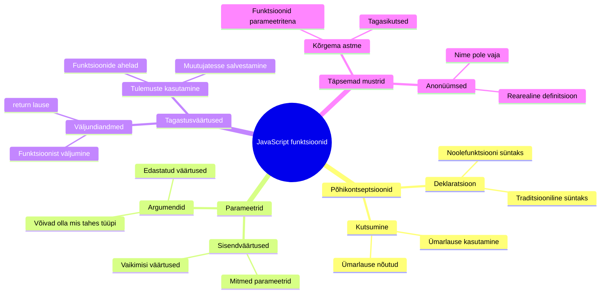
## Funktsioonid

Funktsioon on iseseisev koodiplokk, mis täidab konkreetset ülesannet. See kapseldab loogika, mida saad käivitada alati, kui vaja.

Selle asemel, et kirjutada sama koodi mitmel korral kogu oma programmis, saad selle panna funktsiooni ja kutsuda seda välja siis, kui vaja. See muudab su koodi puhtamaks ja uuendamine palju lihtsamaks. Mõtle ainult sellele hooldusprobleemile, kui peaksid muutma loogikat, mis on laiali 20 erinevas kohas koodibaasis.

Funktsioonide nimed peaksid olema kirjeldavad. Hästi nimetatud funktsioon ütleb kohe, mis selle eesmärk on – kui näed `cancelTimer()`, mõistad kohe, mida see teeb, just nagu märgistatud nupp ütleb täpselt, mis juhtub, kui sellele klõpsad.

## Funktsiooni loomine ja kutsumine

Vaadakem, kuidas funktsiooni luua. Süntaks järgib ühtset mustrit:

```javascript
function nameOfFunction() { // funktsiooni definitsioon
 // funktsiooni definitsioon/korpus
}
```

Selgitame seda:
- Märksõna `function` ütleb JavaScriptile: "Hei, ma loon funktsiooni!"
- `nameOfFunction` on koht, kus annad oma funktsioonile kirjeldava nime
- Sulud `()` on kohad, kuhu saad lisada parameetrid (siinkohal varsti sellest räägime)
- Kõverad sulud `{}` sisaldavad tegelikku koodi, mis jooksutab funktsiooni väljakutsumisel

Loome lihtsa tervitusfunktsiooni, et näha seda praktikas:

```javascript
function displayGreeting() {
  console.log('Hello, world!');
}
```

See funktsioon prindib konsooli "Hello, world!" Kui oled selle määratlenud, saad seda kasutada nii sagedasti kui soovid.

Funktsiooni käivitamiseks (ehk "väljakutsumiseks") kirjuta selle nimi koos sulgudega. JavaScript laseb sul defineerida funktsiooni enne või pärast selle kutsumist – JavaScripti mootor korraldab täitmise järjekorra ise.

```javascript
// kutsume meie funktsiooni
displayGreeting();
```

Kui jooksutad selle rea, täidab see kogu koodi funktsioonis `displayGreeting`, kuvades brauseri konsoolis "Hello, world!". Sa võid seda funktsiooni kutsuda korduvalt.

### 🧠 **Funktsioonide põhitõed: esimeste funktsioonide loomine**

**Vaata, kuidas sul funktsioonidega läheb:**
- Miks kasutame funktsioonide määratluses kõveraid sulgusid `{}`?
- Mis juhtub, kui kirjutad `displayGreeting` ilma sulgudeta?
- Miks võiks soovida kutsuda sama funktsiooni mitu korda?

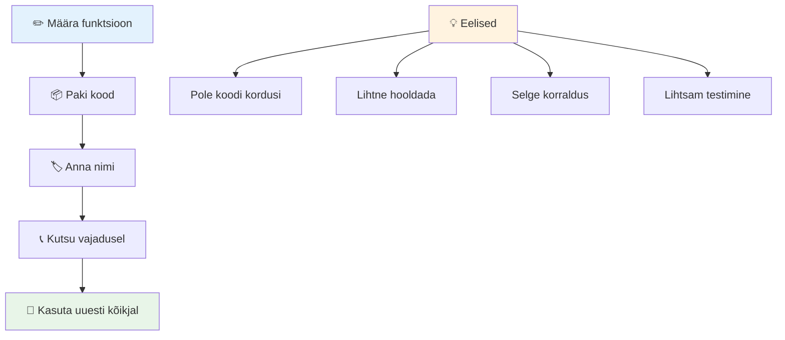
> **Märkus:** Sa oled neid õppetükke läbides kasutanud ka **meetodeid**. `console.log()` on meetod – sisuliselt funktsioon, mis kuulub `console` objektile. Peamine erinevus on see, et meetodid on seotud objektiga, funktsioonid töötavad iseseisvalt. Paljud arendajad kasutavad neid termineid igapäevases kõnes vaheldumisi.

### Parimad tavad funktsioonidega

Siin on mõned nipid, mis aitavad sul kirjutada häid funktsioone:

- Anna funktsioonidele selged, kirjeldavad nimed – su tulevane mina tänab sind!
- Kasuta mitmesõnalistes nimedes **camelCase** stiili (nt `calculateTotal` asemel `calculate_total`)
- Hoia iga funktsioon keskendunud ühe asja korraldamisele hästi

## Info edastamine funktsioonile

Meie `displayGreeting` funktsioon on piiratud – ta suudab kuvada alati ainult "Hello, world!" Parameetrid võimaldavad funktsioone paindlikumaks ja kasulikumaks muuta.

**Parameetrid** toimivad nagu kohatäited, kuhu saad iga funktsiooni kutsumise korral erinevad väärtused panna. Nii saab üks ja seesama funktsioon töötada erineva infoga sõltuvalt kutsest.

Kirjutad parameetrid sulgude vahele funktsiooni definitsioonis, mitmed parameetrid eraldatakse komadega:

```javascript
function name(param, param2, param3) {

}
```

Iga parameeter toimib kohatäitjana – kui keegi sinu funktsiooni kutsub, annab ta tegelikud väärtused, mis asetuvad nendele kohtadele.

Värskendame meie tervitusfunktsiooni, et see võtaks vastu nime:

```javascript
function displayGreeting(name) {
  const message = `Hello, ${name}!`;
  console.log(message);
}
```

Pane tähele, et kasutame tagurpidi jutumärke (`` ` ``) ja `${}` süntaksit, et panna nimi otse sõnumisse – seda nimetatakse mallitekstiks, ja see on väga mugav viis stringidesse muutujaid lisada.

Nüüd, kui kutsume funktsiooni, võime anda suvalise nime:

```javascript
displayGreeting('Christopher');
// kuvab "Tere, Christopher!" käivitamisel
```

JavaScript võtab stringi `'Christopher'`, määrab selle `name` parameetrile ja loob personaalse sõnumi "Hello, Christopher!"

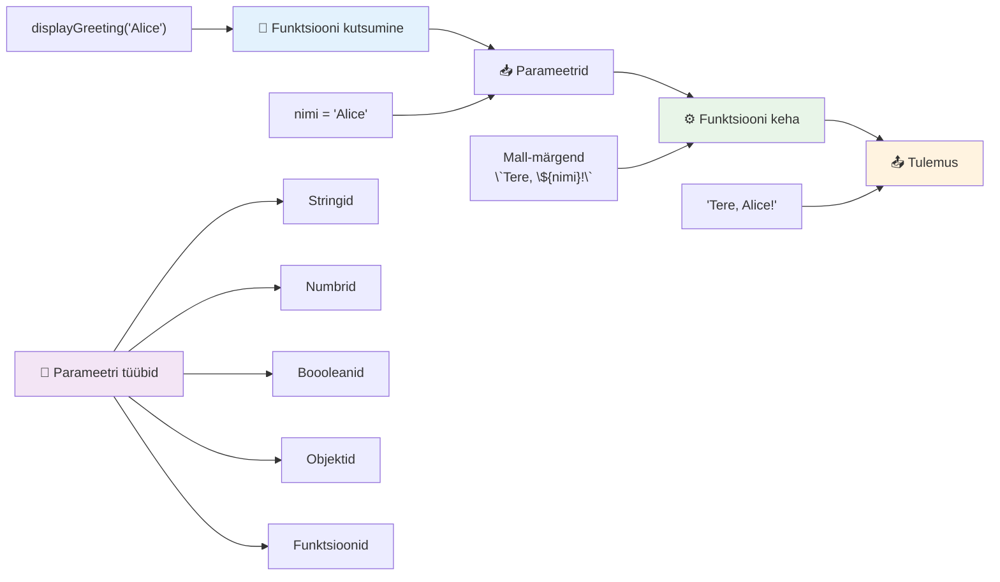
## Vaikesätted

Mis saab siis, kui tahame teha mõningad parameetrid vabatahtlikuks? Just siin tulevad mängu vaikeväärtused!

Oletame, et tahame lubada inimestel tervitusvormingut muuta, aga kui nad seda ei määra, kasutame lihtsalt vaikimisi "Hello". Saad vaikeväärtuseid määrata võrdusmärgiga, nagu muutuja määramisel:

```javascript
function displayGreeting(name, salutation='Hello') {
  console.log(`${salutation}, ${name}`);
}
```

Siin on `name` endiselt kohustuslik, aga `salutation` on varuväärtuseks `'Hello'`, kui keegi ei määra teist tervitust.

Nüüd võime seda funktsiooni kutsuda kahel erineval viisil:

```javascript
displayGreeting('Christopher');
// kuvab "Tere, Christopher"

displayGreeting('Christopher', 'Hi');
// kuvab "Tere, Christopher"
```

Esimesel kutsumisel kasutab JavaScript vaikeväärtust "Hello", kuna ei määra tervitust. Teisel kutsumisel kasutab meie kohandatud "Hi" tervitust. See paindlikkus muudab funktsioonid kohanemisvõimeliseks erinevate stsenaariumide jaoks.

### 🎛️ **Parameetrite valdamise kontroll: funktsioonide kohandamine**

**Testi oma teadmisi parameetritest:**
- Mis vahe on parameetril ja argumendil?
- Miks on vaikeväärtused reaalses programmeerimises kasulikud?
- Mida arvad, mis juhtub, kui anda argumendid rohkem kui parameetreid?

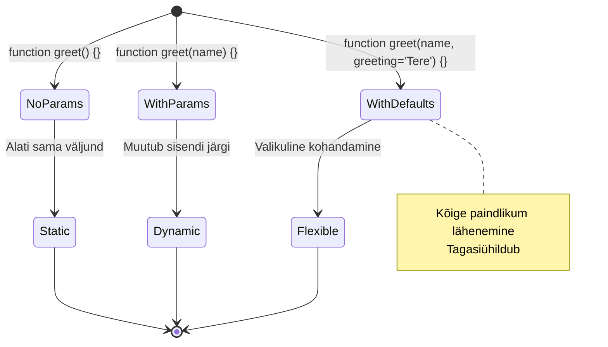
> **Profi nipp**: Vaikeparameetrid muudavad su funktsioonid kasutajasõbralikumaks. Kasutajad saavad kiiresti alustada mõistlike vaikeseadetega, aga saavad vajadusel ise kohandada!

## Tagastatavad väärtused

Senini on meie funktsioonid ainult sõnumeid konsoolis kuvavd, aga mis siis, kui tahad, et funktsioon arvutab midagi välja ja annab tulemuse tagasi?

Siin tulevad mängu **tagastatavad väärtused**. Funktsioon võib sulle väärtuse anda, mida saad hiljem muutuja sees hoida või kasutada muudes osades oma koodi.

Tagastamiseks kasutad märksõna `return`, millele järgneb tagastatav väärtus:

```javascript
return myVariable;
```

Oluline asi: kui funktsioon jõuab `return` lausesse, peatab ta kohe täitmise ja saadab selle väärtuse üle funktsiooni välja kutsujale.

Muudame meie tervitusfunktsiooni nii, et see tagastaks sõnumi mitte ei trükiks seda:

```javascript
function createGreetingMessage(name) {
  const message = `Hello, ${name}`;
  return message;
}
```

Nüüd selle asemel, et sõnumit kuvada, loob funktsioon selle ja annab meile tagasi.

Tagastatud väärtust saab hoida muutuja sees nagu mis tahes teist väärtust:

```javascript
const greetingMessage = createGreetingMessage('Christopher');
```

Nüüd sisaldab `greetingMessage` stringi "Hello, Christopher" ja me saame seda kasutada kus iganes oma koodis – kuvada veebilehel, lisada e-kirja või anda teisele funktsioonile.

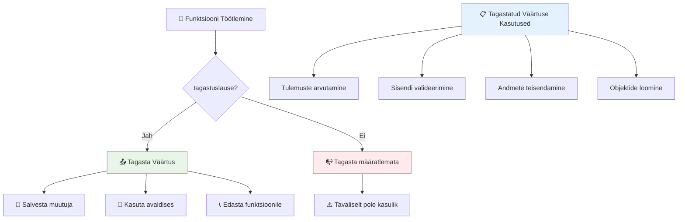
### 🔄 **Tagastatavate väärtuste kontroll: tulemuste saamine**

**Hinda oma arusaamist tagastustest:**
- Mis juhtub funktsioonis olevate ridadega pärast `return` lauset?
- Miks on tihti parem väärtused tagasi tagastada, mitte lihtsalt konsooli printida?
- Kas funktsioon saab tagastada erinevat tüüpi väärtusi (string, number, boolean)?

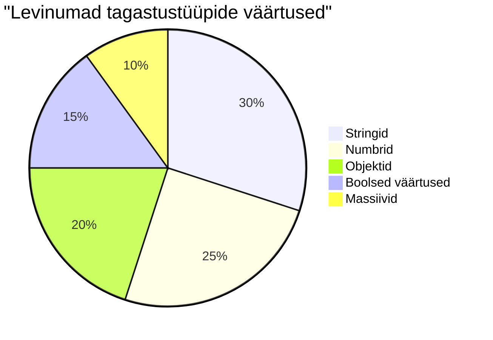
> **Oluline mõte**: Funktsioonid, mis tagastavad väärtusi, on paindlikumad, sest helistaja otsustab, mida tulemustega teha. See teeb su koodi modulaarsemaks ja taaskasutatavamaks!

## Funktsioonid parameetritena teiste funktsioonide jaoks

Funktsioone saab edasi anda parameetritena teistele funktsioonidele. See võiks esmapilgul tunduda keeruline, aga see on võimas omadus, mis võimaldab paindliku programmeerimisstiili.

See muster on väga levinud, kui tahad öelda "kui midagi juhtub, tee seda teist asja". Näiteks "kui taimer lõpeb, käivita see kood" või "kui kasutaja vajutab nuppu, kutsu see funktsioon".

Vaatame `setTimeouti`, mis on sisseehitatud funktsioon, mis ootab kindla aja ja siis täidab mingit koodi. Me peame ütlema, millist koodi täita – selleks ongi funktsiooni edasiandmine ideaalne!

Proovi seda koodi – 3 sekundi pärast näed sõnumit:

```javascript
function displayDone() {
  console.log('3 seconds has elapsed');
}
// taimeri väärtus on millisekundites
setTimeout(displayDone, 3000);
```

Pane tähele, et anname `setTimeoutile` edasi `displayDone` (ilma sulgudeta). Me ei kutsu seda funktsiooni ise, vaid anname selle `setTimeoutile` ja ütleme: "käivita see 3 sekundi pärast."

### Anonüümsed funktsioonid

Mõnikord vajad funktsiooni ainult ühe asja jaoks ja sa ei taha sellele nime anda. Mõtle sellele – kui kasutad funktsiooni ainult kord, miks segada oma kood nimedega?

JavaScript lubab luua **anonüümseid funktsioone** – funktsioonid ilma nimesideta, mida saad defineerida seal, kus neid vajad.

Siin on, kuidas võiksime muuta meie taimerinäite anonüümseks funktsiooniks:

```javascript
setTimeout(function() {
  console.log('3 seconds has elapsed');
}, 3000);
```

See annab sama tulemuse, aga funktsioon on defineeritud otse `setTimeout` kutses, ilma eraldi funktsiooni deklaratsioonita.

### Ümarnoole funktsioonid

Kaasaegses JavaScriptis on olemas veelgi lühem viis funktsioonide kirjutamiseks – **noolefunktsioonid**. Need kasutavad `=>` sümbolit (mis näeb välja nagu nool) ja on arendajate seas väga populaarsed.

Noolefunktsioonid võimaldavad jätta ära sõna `function` ja kirjutada koodi palju kompaktsemalt.

Siin on meie taimeri näide noolefunktsiooni kasutades:

```javascript
setTimeout(() => {
  console.log('3 seconds has elapsed');
}, 3000);
```

Tühjad sulud `()` tähistavad parameetreid (siin tühjad), seejärel tuleb nool `=>` ja lõpuks funktsiooni keha kõverates sulgudes. See annab sama funktsionaalsuse lühema süntaksiga.

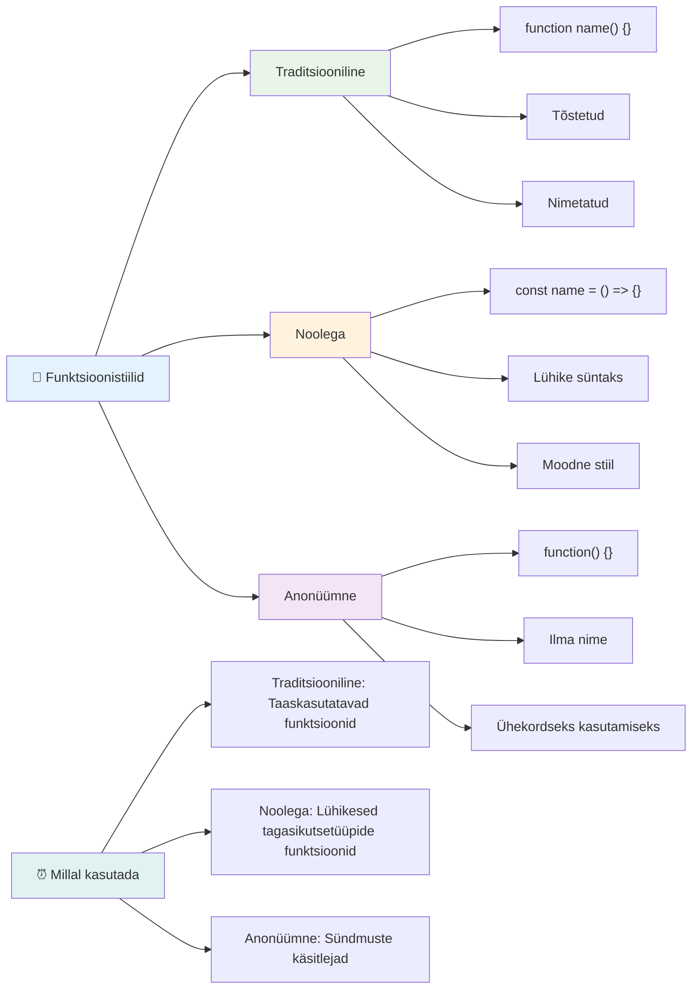
### Millal kasutada millist lähenemist

Millal siis kumbagi kasutada? Praktiline reegel: kui kutsud funktsiooni mitu korda, anna sellele nimi ja defineeri see eraldi. Kui kasutad funktsiooni ainult korra, kaalu anonüümset funktsiooni. Nii noolefunktsioonid kui traditsiooniline süntaks on kehtivad valikud, kuigi noolefunktsioonid on tänapäeva koodibaasides domineerivad.

### 🎨 **Funktsioonistiilide valdamise kontroll: õige süntaksi valimine**

**Testi oma süntaksiteadmisi:**
- Millal eelistad noolefunktsioone traditsioonilise funktsioonisüntaksi asemel?
- Mis on anonüümsete funktsioonide suurim eelis?
- Kas oskad mõelda olukorda, kus nimetatud funktsioon on anonüümse asemel parem?

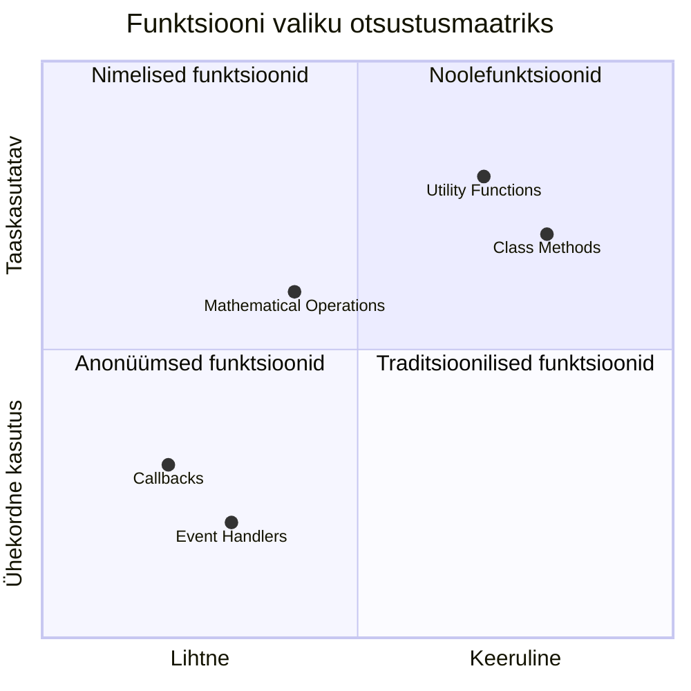
> **Moodne trend**: Noolefunktsioonid on paljude arendajate esimene valik tänu lühidusele, aga traditsioonilistel funktsioonidel on endiselt oma koht!

---


## 🚀 Väljakutse

Kas suudad ühes lauses sõnastada funktsioonide ja meetodite erinevuse? Proovi järele!

## GitHub Copilot Agent'i väljakutse 🚀

Kasuta Agent režiimi, et täita järgmine väljakutse:

**Kirjeldus:** Loo matemaatiliste funktsioonide abiteek, mis demonstreerib selle õppetüki käsitletud funktsioonide kontseptsioone, sealhulgas parameetreid, vaikeväärtusi, tagastusi ja noolefunktsioone.

**Prompt:** Loo JavaScripti fail nimega `mathUtils.js`, mis sisaldab järgmisi funktsioone:
1. Funktsioon `add`, mis võtab kaks parameetrit ja tagastab nende summa
2. Funktsioon `multiply` vaikeväärtustega parameetritel (teine parameeter vaikimisi 1)
3. Noolefunktsioon `square`, mis võtab numbri ja tagastab selle ruudu
4. Funktsioon `calculate`, mis võtab parameetrina teise funktsiooni ja kaks numbrit, seejärel rakendab seda funktsiooni nendele numbritele
5. Näita iga funktsiooni kutsumist sobivate testjuhtudega

Loe agent režiimi kohta rohkem siit: [agent mode](https://code.visualstudio.com/blogs/2025/02/24/introducing-copilot-agent-mode).

## Pärast loengut viktoriin
[Pärast loengut viktoriin](https://ff-quizzes.netlify.app)

## Ülevaade ja iseseisev õppimine

Tasub [lugeda natuke rohkem noolefunktsioonide kohta](https://developer.mozilla.org/docs/Web/JavaScript/Reference/Functions/Arrow_functions), kuna neid kasutatakse üha rohkem koodibaasides. Harjuta funktsiooni kirjutamist ja seejärel sama funktsiooni ümberkirjutamist selle süntaksi abil.

## Kodune ülesanne

[Fun with Functions](assignment.md)

---

## 🧰 **Sinu JavaScripti funktsioonide tööriistakasti kokkuvõte**

```mermaid
graph TD
    A["🎯 JavaScripti funktsioonid"] --> B["📋 Funktsiooni deklaratsioon"]
    A --> C["📥 Parameetrid"]
    A --> D["📤 Tagastatud väärtused"]
    A --> E["🎨 Moodne süntaks"]
    
    B --> B1["function name() {}"]
    B --> B2["Kirjeldav nimetamine"]
    B --> B3["Taaskasutatavad koodiplokid"]
    
    C --> C1["Sisendandmed"]
    C --> C2["Vaikimisi väärtused"]
    C --> C3["Mitmed parameetrid"]
    
    D --> D1["return lause"]
    D --> D2["Funktsioonist väljumine"]
    D --> D3["Andmete tagastamine"]
    
    E --> E1["Noolefunktsioonid: () =>"]
    E --> E2["Anonüümsed funktsioonid"]
    E --> E3["Kõrgemad järgu funktsioonid"]
    
    F["⚡ Peamised eelised"] --> F1["Koodi taaskasutus"]
    F --> F2["Parem organiseerimine"]
    F --> F3["Lihtsam testimine"]
    F --> F4["Mooduldisain"]
    
    style A fill:#e3f2fd
    style B fill:#e8f5e8
    style C fill:#fff3e0
    style D fill:#f3e5f5
    style E fill:#e0f2f1
    style F fill:#fce4ec
```
---

## 🚀 Sinu JavaScripti funktsioonide meistriaja ajakava

### ⚡ **Mida saad teha järgmise 5 minutiga**
- [ ] Kirjuta lihtne funktsioon, mis tagastab su lemmiknumbri
- [ ] Loo funktsioon kahel parameetril, mis liidab need kokku
- [ ] Proovi traditsioonilise funktsiooni teisendamist noolefunktsiooni süntaksiks
- [ ] Harjuta ülesannet: selgita, mis vahe on funktsioonidel ja meetoditel

### 🎯 **Mida saad selle tunni jooksul saavutada**
- [ ] Lõpeta õppetunni järgne viktoriin ja vaata üle kõik segased teemad
- [ ] Ehita matemaatika utiliitide teek GitHub Copilot väljakutse põhjal
- [ ] Loo funktsioon, mis kasutab teist funktsiooni parameetrina
- [ ] Harjuta funktsioonide kirjutamist vaikimisi parameetritega
- [ ] Katseta mallstringe funktsioonide tagastatavates väärtustes

### 📅 **Sinu nädalane funktsioonide meisterlikkus**
- [ ] Täida loominguliselt ülesanne „Põnevad funktsioonid“
- [ ] Refaktoreeri mõni korduv kood, mille oled kirjutanud, taaskasutatavateks funktsioonideks
- [ ] Ehita väike kalkulaator, kasutades ainult funktsioone (ilma globaalseid muutujaid)
- [ ] Harjuta noolefunktsioone massiivimeetoditega nagu `map()` ja `filter()`
- [ ] Loo kogu kasulikke funktsioone tavapäraste ülesannete jaoks
- [ ] Õpi kõrgema taseme funktsioone ja funktsionaalset programmeerimist

### 🌟 **Sinu kuu pikkune muutus**
- [ ] Valda keerukamaid funktsioonide kontseptsioone nagu sulgemine ja ulatus
- [ ] Ehita projekt, mis tugevalt kasutab funktsioonide kompositsiooni
- [ ] Panusta avatud lähtekoodile, parandades funktsioonide dokumentatsiooni
- [ ] Õpeta kedagi teist funktsioonidest ja erinevatest süntaksistiilidest
- [ ] Uuri JavaScripti funktsionaalse programmeerimise paradigmasid
- [ ] Loo isiklik teek taaskasutatavatest funktsioonidest tulevasteks projektideks

### 🏆 **Lõplik funktsioonide meistrivõistluse kokkuvõte**

**Tähista oma funktsioonide valdamist:**
- Milline on kõige kasulikum funktsioon, mida oled seni loonud?
- Kuidas on funktsioonidest õppimine muutnud sinu mõtlemist koodi organiseerimise kohta?
- Millist funktsiooni süntaksit eelistad ja miks?
- Millise päriselu probleemi lahendaksid funktsiooni kirjutamisega?

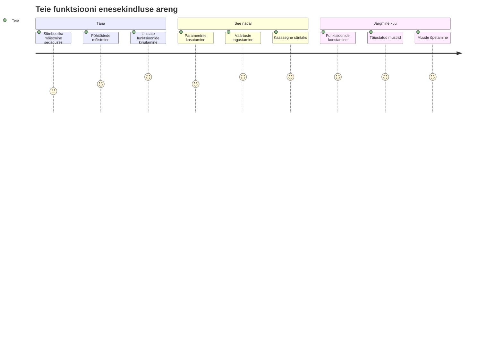
> 🎉 **Oled valdanud üht programmeerimise võimsamatest kontseptsioonidest!** Funktsioonid on suuremate programmide põhikomponendid. Iga rakendus, mida ehitad, kasutab funktsioone koodi organiseerimiseks, taaskasutamiseks ja struktureerimiseks. Sa mõistad nüüd, kuidas pakendada loogikat taaskasutatavatesse komponentidesse, mis teeb sinust tõhusama ja tulemuslikuma programmeerija. Tere tulemast modulaarse programmeerimise maailma! 🚀

---

<!-- CO-OP TRANSLATOR DISCLAIMER START -->
**Tähelepanek**:  
See dokument on tõlgitud tehisintellekti tõlketeenuse [Co-op Translator](https://github.com/Azure/co-op-translator) abil. Kuigi püüame tagada täpsust, pidage meeles, et automaatsed tõlked võivad sisaldada vigu või ebatäpsusi. Algne dokument selle emakeeles tuleks võtta autoriteetse allikana. Kriitilise teabe puhul soovitatakse kasutada professionaalset inimtõlget. Me ei vastuta käesoleva tõlke kasutamisest tingitud arusaamatuste või valesti tõlgenduste eest.
<!-- CO-OP TRANSLATOR DISCLAIMER END -->