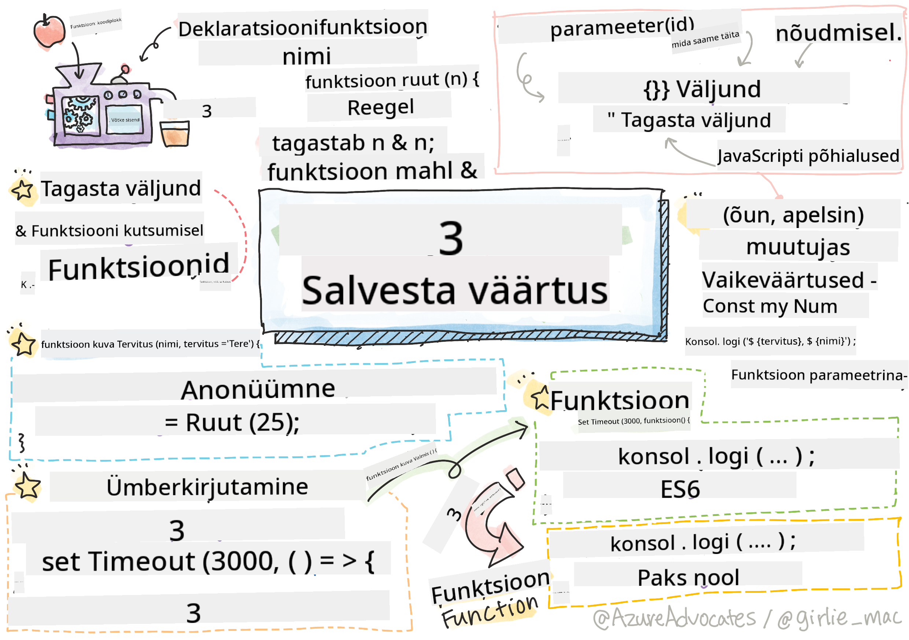

<!--
CO_OP_TRANSLATOR_METADATA:
{
  "original_hash": "92e136090efc4341b1d51c37924c1802",
  "translation_date": "2025-10-11T11:43:39+00:00",
  "source_file": "2-js-basics/2-functions-methods/README.md",
  "language_code": "et"
}
-->
# JavaScript'i põhialused: meetodid ja funktsioonid


> Sketchnote autor: [Tomomi Imura](https://twitter.com/girlie_mac)

## Eelloengu viktoriin
[Eelloengu viktoriin](https://ff-quizzes.netlify.app)

Kui mõtleme koodi kirjutamisele, tahame alati tagada, et meie kood oleks loetav. Kuigi see võib tunduda vastupidine, loetakse koodi palju rohkem kui seda kirjutatakse. Üks arendaja tööriistakasti põhivahenditest, mis aitab tagada hooldatavat koodi, on **funktsioon**.

[](https://youtube.com/watch?v=XgKsD6Zwvlc "Meetodid ja funktsioonid")

> 🎥 Klõpsa ülaloleval pildil, et vaadata videot meetoditest ja funktsioonidest.

> Selle õppetunni leiad [Microsoft Learnist](https://docs.microsoft.com/learn/modules/web-development-101-functions/?WT.mc_id=academic-77807-sagibbon)!

## Funktsioonid

Funktsioon on sisuliselt koodiplokk, mida saame käivitada vastavalt vajadusele. See sobib ideaalselt olukordadesse, kus peame sama ülesannet täitma mitu korda; selle asemel, et loogikat mitmes kohas dubleerida (mis muudaks hilisema uuendamise keeruliseks), saame selle tsentraliseerida ühte kohta ja kutsuda seda üles, kui operatsiooni on vaja teha - funktsioone saab isegi teistest funktsioonidest kutsuda!

Samavõrd oluline on funktsiooni nime andmine. Kuigi see võib tunduda tühine, pakub nimi kiiret viisi koodilõigu dokumenteerimiseks. Võid mõelda sellele kui nupule pandud sildile. Kui klõpsan nupul, millel on kirjas "Tühista taimer", tean, et see peatab kella käimise.

## Funktsiooni loomine ja kutsumine

Funktsiooni süntaks näeb välja järgmine:

```javascript
function nameOfFunction() { // function definition
 // function definition/body
}
```

Kui tahaksin luua funktsiooni tervituse kuvamiseks, võiks see välja näha nii:

```javascript
function displayGreeting() {
  console.log('Hello, world!');
}
```

Kui tahame oma funktsiooni kutsuda (või käivitada), kasutame funktsiooni nime, millele järgneb `()`. Tasub märkida, et meie funktsioon võib olla defineeritud enne või pärast selle kutsumist; JavaScript'i kompilaator leiab selle üles.

```javascript
// calling our function
displayGreeting();
```

> **NOTE:** On olemas eriline funktsiooni tüüp, mida nimetatakse **meetodiks**, mida oled juba kasutanud! Tegelikult nägime seda oma demos, kui kasutasime `console.log`. Mis eristab meetodit funktsioonist, on see, et meetod on seotud objektiga (meie näites `console`), samas kui funktsioon on vaba ja ei kuulu ühegi objekti alla. Paljud arendajad kasutavad neid termineid vaheldumisi.

### Funktsiooni parimad tavad

Funktsioonide loomisel tasub meeles pidada mõningaid parimaid tavasid:

- Kasuta alati kirjeldavaid nimesid, et teaksid, mida funktsioon teeb
- Kasuta **camelCase**'i sõnade ühendamiseks
- Hoia oma funktsioonid keskendunud konkreetsele ülesandele

## Informatsiooni edastamine funktsioonile

Funktsiooni muutmiseks paindlikumaks tahad sageli sellele informatsiooni edastada. Kui vaatame meie ülaltoodud `displayGreeting` näidet, kuvab see ainult **Hello, world!**. See pole just kõige kasulikum funktsioon, mida võiks luua. Kui tahame seda veidi paindlikumaks muuta, näiteks võimaldada kellelgi määrata tervitatava inimese nime, saame lisada **parameetri**. Parameeter (mõnikord nimetatakse seda ka **argumendiks**) on lisainformatsioon, mis saadetakse funktsioonile.

Parameetrid loetletakse definitsiooni osas sulgudes ja eraldatakse komadega, näiteks:

```javascript
function name(param, param2, param3) {

}
```

Saame uuendada oma `displayGreeting` funktsiooni, et see aktsepteeriks nime ja kuvaks selle.

```javascript
function displayGreeting(name) {
  const message = `Hello, ${name}!`;
  console.log(message);
}
```

Kui tahame oma funktsiooni kutsuda ja parameetri edastada, määrame selle sulgudes.

```javascript
displayGreeting('Christopher');
// displays "Hello, Christopher!" when run
```

## Vaikeväärtused

Saame muuta oma funktsiooni veelgi paindlikumaks, lisades rohkem parameetreid. Aga mis siis, kui me ei taha, et iga väärtus oleks kohustuslik? Jätkates meie tervituse näidet, võiksime jätta nime kohustuslikuks (meil on vaja teada, keda tervitame), kuid tahame võimaldada tervitust ise kohandada. Kui keegi ei soovi seda kohandada, pakume selle asemel vaikeväärtuse. Vaikeväärtuse määramiseks parameetrile seadistame selle samamoodi nagu määrame väärtuse muutujale - `parameterName = 'defaultValue'`. Täieliku näite nägemiseks:

```javascript
function displayGreeting(name, salutation='Hello') {
  console.log(`${salutation}, ${name}`);
}
```

Kui kutsume funktsiooni, saame otsustada, kas tahame `salutation` jaoks väärtuse määrata.

```javascript
displayGreeting('Christopher');
// displays "Hello, Christopher"

displayGreeting('Christopher', 'Hi');
// displays "Hi, Christopher"
```

## Tagastusväärtused

Siiani on meie loodud funktsioon alati väljastanud tulemuse [konsoolile](https://developer.mozilla.org/docs/Web/API/console). Mõnikord võib see olla täpselt see, mida otsime, eriti kui loome funktsioone, mis kutsuvad teisi teenuseid. Aga mis siis, kui tahan luua abifunktsiooni, mis teeb arvutuse ja tagastab väärtuse, et saaksin seda mujal kasutada?

Saame seda teha, kasutades **tagastusväärtust**. Tagastusväärtus tagastatakse funktsiooni poolt ja seda saab salvestada muutujasse samamoodi nagu saaksime salvestada literaalväärtuse, näiteks stringi või numbri.

Kui funktsioon midagi tagastab, kasutatakse märksõna `return`. Märksõna `return` eeldab väärtust või viidet sellele, mida tagastatakse, näiteks:

```javascript
return myVariable;
```  

Saaksime luua funktsiooni, mis loob tervitussõnumi ja tagastab väärtuse kutsujale.

```javascript
function createGreetingMessage(name) {
  const message = `Hello, ${name}`;
  return message;
}
```

Funktsiooni kutsumisel salvestame väärtuse muutujasse. See on väga sarnane sellele, kuidas määraksime muutujale staatilise väärtuse (näiteks `const name = 'Christopher'`).

```javascript
const greetingMessage = createGreetingMessage('Christopher');
```

## Funktsioonid funktsioonide parameetritena

Kui edened oma programmeerimiskarjääris, kohtad funktsioone, mis aktsepteerivad funktsioone parameetritena. See nutikas trikk on sageli kasutusel, kui me ei tea, millal midagi juhtub või lõppeb, kuid teame, et peame sellele vastuseks operatsiooni tegema.

Näiteks [setTimeout](https://developer.mozilla.org/docs/Web/API/WindowOrWorkerGlobalScope/setTimeout), mis alustab taimerit ja käivitab koodi, kui see lõppeb. Peame ütlema, millist koodi tahame käivitada. Tundub ideaalne töö funktsioonile!

Kui käivitad alloleva koodi, näed 3 sekundi pärast sõnumit **3 sekundit on möödunud**.

```javascript
function displayDone() {
  console.log('3 seconds has elapsed');
}
// timer value is in milliseconds
setTimeout(displayDone, 3000);
```

### Anonüümsed funktsioonid

Vaatame uuesti, mida oleme ehitanud. Loome funktsiooni nimega, mida kasutatakse ainult üks kord. Kui meie rakendus muutub keerukamaks, näeme, et loome palju funktsioone, mida kutsutakse ainult üks kord. See pole ideaalne. Selgub, et me ei pea alati nime andma!

Kui edastame funktsiooni parameetrina, saame vältida selle eelnevat loomist ja selle asemel ehitada selle parameetri osana. Kasutame sama märksõna `function`, kuid ehitame selle parameetrina.

Kirjutame ülaltoodud koodi ümber, et kasutada anonüümset funktsiooni:

```javascript
setTimeout(function() {
  console.log('3 seconds has elapsed');
}, 3000);
```

Kui käivitad meie uue koodi, märkad, et tulemused on samad. Oleme loonud funktsiooni, kuid ei pidanud sellele nime andma!

### Fat arrow funktsioonid

Üks lühend, mis on levinud paljudes programmeerimiskeeltes (sealhulgas JavaScript'is), on võimalus kasutada nn **noole** või **fat arrow** funktsiooni. See kasutab spetsiaalset sümbolit `=>`, mis näeb välja nagu nool - seega nimi! Kasutades `=>`, saame vahele jätta märksõna `function`.

Kirjutame oma koodi veel kord ümber, et kasutada fat arrow funktsiooni:

```javascript
setTimeout(() => {
  console.log('3 seconds has elapsed');
}, 3000);
```

### Millal kasutada iga strateegiat

Oled nüüd näinud, et meil on kolm viisi funktsiooni parameetrina edastamiseks ja võid mõelda, millal kasutada igaüht. Kui tead, et kasutad funktsiooni rohkem kui üks kord, loo see tavapäraselt. Kui kasutad seda ainult ühes kohas, on üldiselt parim kasutada anonüümset funktsiooni. Kas kasutada fat arrow funktsiooni või traditsioonilist `function` süntaksit, on sinu otsustada, kuid märkad, et enamik kaasaegseid arendajaid eelistab `=>`.

---

## 🚀 Väljakutse

Kas suudad ühe lausega selgitada funktsioonide ja meetodite erinevust? Proovi järele!

## Järelloengu viktoriin
[Järelloengu viktoriin](https://ff-quizzes.netlify.app)

## Ülevaade ja iseseisev õppimine

Tasub [lugeda veidi rohkem noolefunktsioonide kohta](https://developer.mozilla.org/docs/Web/JavaScript/Reference/Functions/Arrow_functions), kuna neid kasutatakse üha enam koodibaasides. Harjuta funktsiooni kirjutamist ja seejärel selle ümberkirjutamist selle süntaksiga.

## Ülesanne

[Lõbu funktsioonidega](assignment.md)

---

**Lahtiütlus**:  
See dokument on tõlgitud AI tõlketeenuse [Co-op Translator](https://github.com/Azure/co-op-translator) abil. Kuigi püüame tagada täpsust, palume arvestada, et automaatsed tõlked võivad sisaldada vigu või ebatäpsusi. Algne dokument selle algses keeles tuleks pidada autoriteetseks allikaks. Olulise teabe puhul soovitame kasutada professionaalset inimtõlget. Me ei vastuta selle tõlke kasutamisest tulenevate arusaamatuste või valesti tõlgenduste eest.