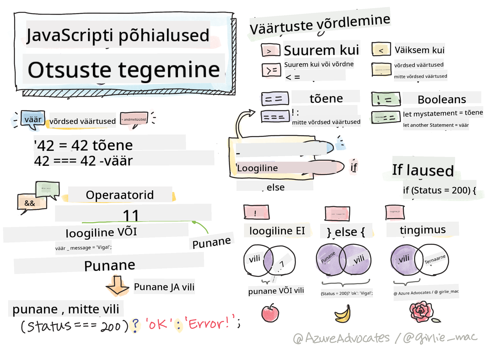

<!--
CO_OP_TRANSLATOR_METADATA:
{
  "original_hash": "f7009631b73556168ca435120a231c98",
  "translation_date": "2025-10-11T11:46:01+00:00",
  "source_file": "2-js-basics/3-making-decisions/README.md",
  "language_code": "et"
}
-->
# JavaScripti põhialused: Otsuste tegemine



> Sketšimärkus: [Tomomi Imura](https://twitter.com/girlie_mac)

## Loengu-eelne viktoriin

[Loengu-eelne viktoriin](https://ff-quizzes.netlify.app/web/quiz/11)

Otsuste tegemine ja koodi täitmise järjekorra kontrollimine muudab sinu koodi taaskasutatavaks ja vastupidavaks. Selles osas käsitletakse JavaScripti andmevoo kontrollimise süntaksit ja selle olulisust, kui seda kasutatakse koos Boole'i andmetüüpidega.

[](https://youtube.com/watch?v=SxTp8j-fMMY "Otsuste tegemine")

> 🎥 Klõpsa ülaloleval pildil, et vaadata videot otsuste tegemise kohta.

> Saad selle õppetunni läbida [Microsoft Learnis](https://docs.microsoft.com/learn/modules/web-development-101-if-else/?WT.mc_id=academic-77807-sagibbon)!

## Lühike ülevaade Boole'i väärtustest

Boole'i väärtused võivad olla ainult kaks: `true` või `false`. Boole'i väärtused aitavad otsustada, millised koodiread peaksid täituma, kui teatud tingimused on täidetud.

Määra oma Boole'i väärtus `true` või `false` järgmiselt:

`let myTrueBool = true`  
`let myFalseBool = false`

✅ Boole'i väärtused on nime saanud inglise matemaatiku, filosoofi ja loogiku George Boole'i (1815–1864) järgi.

## Võrdlusoperaatorid ja Boole'i väärtused

Operaatorid aitavad tingimusi hinnata, tehes võrdlusi, mis loovad Boole'i väärtuse. Järgnevalt on loetelu sageli kasutatavatest operaatoritest.

| Sümbol | Kirjeldus                                                                                                                                                   | Näide              |
| ------ | ----------------------------------------------------------------------------------------------------------------------------------------------------------- | ------------------ |
| `<`    | **Väiksem kui**: Võrdleb kahte väärtust ja tagastab Boole'i väärtuse `true`, kui vasakpoolne väärtus on väiksem kui parempoolne                              | `5 < 6 // true`    |
| `<=`   | **Väiksem või võrdne**: Võrdleb kahte väärtust ja tagastab Boole'i väärtuse `true`, kui vasakpoolne väärtus on väiksem või võrdne parempoolsega              | `5 <= 6 // true`   |
| `>`    | **Suurem kui**: Võrdleb kahte väärtust ja tagastab Boole'i väärtuse `true`, kui vasakpoolne väärtus on suurem kui parempoolne                                | `5 > 6 // false`   |
| `>=`   | **Suurem või võrdne**: Võrdleb kahte väärtust ja tagastab Boole'i väärtuse `true`, kui vasakpoolne väärtus on suurem või võrdne parempoolsega                | `5 >= 6 // false`  |
| `===`  | **Range võrdsus**: Võrdleb kahte väärtust ja tagastab Boole'i väärtuse `true`, kui parempoolne ja vasakpoolne väärtus on võrdsed JA sama andmetüübiga        | `5 === 6 // false` |
| `!==`  | **Ebaühtlus**: Võrdleb kahte väärtust ja tagastab vastupidise Boole'i väärtuse sellele, mida range võrdsusoperaator tagastaks                               | `5 !== 6 // true`  |

✅ Kontrolli oma teadmisi, kirjutades mõned võrdlused oma brauseri konsooli. Kas mõni tagastatud väärtus üllatab sind?

## If-lause

If-lause täidab koodi oma plokkide vahel, kui tingimus on tõene.

```javascript
if (condition) {
  //Condition is true. Code in this block will run.
}
```
  
Loogilisi operaatoreid kasutatakse sageli tingimuse moodustamiseks.

```javascript
let currentMoney;
let laptopPrice;

if (currentMoney >= laptopPrice) {
  //Condition is true. Code in this block will run.
  console.log("Getting a new laptop!");
}
```
  

## If..Else-lause

`else`-lause täidab koodi oma plokkide vahel, kui tingimus on väär. See on valikuline koos `if`-lausega.

```javascript
let currentMoney;
let laptopPrice;

if (currentMoney >= laptopPrice) {
  //Condition is true. Code in this block will run.
  console.log("Getting a new laptop!");
} else {
  //Condition is false. Code in this block will run.
  console.log("Can't afford a new laptop, yet!");
}
```
  
✅ Kontrolli oma arusaamist sellest koodist ja järgnevast koodist, käivitades selle brauseri konsoolis. Muuda `currentMoney` ja `laptopPrice` muutujate väärtusi, et muuta tagastatud `console.log()`.

## Switch-lause

`switch`-lause abil saab täita erinevaid tegevusi, lähtudes erinevatest tingimustest. Kasuta `switch`-lauset, et valida täitmiseks üks paljudest koodiplokkidest.

```javascript
switch (expression) {
  case x:
    // code block
    break;
  case y:
    // code block
    break;
  default:
  // code block
}
```
  
```javascript
// program using switch statement
let a = 2;

switch (a) {
  case 1:
    a = "one";
    break;
  case 2:
    a = "two";
    break;
  default:
    a = "not found";
    break;
}
console.log(`The value is ${a}`);
```
  
✅ Kontrolli oma arusaamist sellest koodist ja järgnevast koodist, käivitades selle brauseri konsoolis. Muuda muutuja `a` väärtusi, et muuta tagastatud `console.log()`.

## Loogilised operaatorid ja Boole'i väärtused

Otsused võivad nõuda rohkem kui ühte võrdlust ja neid saab siduda loogiliste operaatoritega, et luua Boole'i väärtus.

| Sümbol | Kirjeldus                                                                                     | Näide                                                                 |
| ------ | --------------------------------------------------------------------------------------------- | --------------------------------------------------------------------- |
| `&&`   | **Loogiline JA**: Võrdleb kahte Boole'i avaldist. Tagastab `true` **ainult**, kui mõlemad pooled on tõesed | `(5 > 6) && (5 < 6 ) //Üks pool on väär, teine tõene. Tagastab false` |
| `\|\|` | **Loogiline VÕI**: Võrdleb kahte Boole'i avaldist. Tagastab `true`, kui vähemalt üks pool on tõene | `(5 > 6) \|\| (5 < 6) //Üks pool on väär, teine tõene. Tagastab true` |
| `!`    | **Loogiline EI**: Tagastab Boole'i avaldise vastupidise väärtuse                              | `!(5 > 6) // 5 ei ole suurem kui 6, kuid "!" tagastab true`           |

## Tingimused ja otsused loogiliste operaatoritega

Loogilisi operaatoreid saab kasutada tingimuste moodustamiseks if..else-lause sees.

```javascript
let currentMoney;
let laptopPrice;
let laptopDiscountPrice = laptopPrice - laptopPrice * 0.2; //Laptop price at 20 percent off

if (currentMoney >= laptopPrice || currentMoney >= laptopDiscountPrice) {
  //Condition is true. Code in this block will run.
  console.log("Getting a new laptop!");
} else {
  //Condition is true. Code in this block will run.
  console.log("Can't afford a new laptop, yet!");
}
```
  

### Eitusoperaator

Oled seni näinud, kuidas `if...else`-lause abil saab luua tingimuslikku loogikat. Kõik, mis läheb `if`-lause sisse, peab hinduma tõene/väär. Kasutades `!`-operaatorit, saad avaldist _eitada_. See näeks välja järgmiselt:

```javascript
if (!condition) {
  // runs if condition is false
} else {
  // runs if condition is true
}
```
  

### Ternaaravaldised

`if...else` ei ole ainus viis otsustusloogika väljendamiseks. Võid kasutada ka midagi, mida nimetatakse ternaaroperaatoriks. Selle süntaks näeb välja selline:

```javascript
let variable = condition ? <return this if true> : <return this if false>
```
  
Allpool on konkreetsem näide:

```javascript
let firstNumber = 20;
let secondNumber = 10;
let biggestNumber = firstNumber > secondNumber ? firstNumber : secondNumber;
```
  
✅ Võta hetk, et seda koodi paar korda lugeda. Kas saad aru, kuidas need operaatorid töötavad?

Ülaltoodu ütleb, et

- kui `firstNumber` on suurem kui `secondNumber`
- siis omista `firstNumber` väärtus `biggestNumber`-ile
- muidu omista `secondNumber`.

Ternaaravaldis on lihtsalt kompaktne viis alloleva koodi kirjutamiseks:

```javascript
let biggestNumber;
if (firstNumber > secondNumber) {
  biggestNumber = firstNumber;
} else {
  biggestNumber = secondNumber;
}
```
  

---

## 🚀 Väljakutse

Loo programm, mis on algselt kirjutatud loogiliste operaatoritega, ja kirjuta see seejärel ümber, kasutades ternaaravaldisi. Milline süntaks sulle rohkem meeldib?

---

## Loengu-järgne viktoriin

[Loengu-järgne viktoriin](https://ff-quizzes.netlify.app/web/quiz/12)

## Ülevaade ja iseseisev õppimine

Loe rohkem paljude operaatorite kohta, mis on kasutajale saadaval, [MDN-is](https://developer.mozilla.org/docs/Web/JavaScript/Reference/Operators).

Tutvu Josh Comeau suurepärase [operaatorite otsinguga](https://joshwcomeau.com/operator-lookup/)!

## Ülesanne

[Operaatorid](assignment.md)

---

**Lahtiütlus**:  
See dokument on tõlgitud AI tõlketeenuse [Co-op Translator](https://github.com/Azure/co-op-translator) abil. Kuigi püüame tagada täpsust, palume arvestada, et automaatsed tõlked võivad sisaldada vigu või ebatäpsusi. Algne dokument selle algses keeles tuleks pidada autoriteetseks allikaks. Olulise teabe puhul soovitame kasutada professionaalset inimtõlget. Me ei vastuta selle tõlke kasutamisest tulenevate arusaamatuste või valesti tõlgenduste eest.