# JavaScripti alused: otsuste tegemine

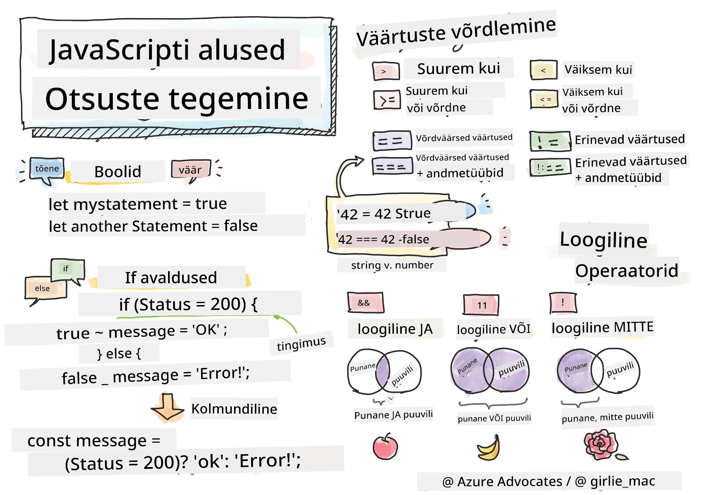

> Sketchnote autorilt [Tomomi Imura](https://twitter.com/girlie_mac)

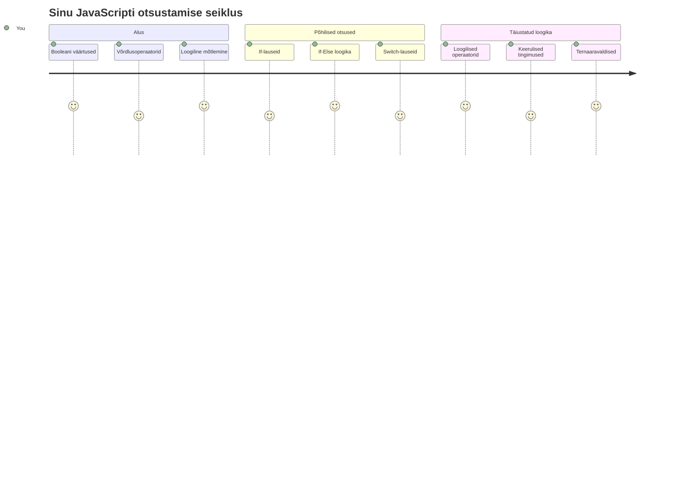
Kas oled kunagi mõelnud, kuidas rakendused teevad nutikaid otsuseid? Näiteks kuidas navigatsioonisüsteem valib kiireima marsruudi või kuidas termostaat otsustab, millal kütte sisse lülitada? See on programmeerimise otsustamise põhikontseptsioon.

Nii nagu Charles Babbage’i Analüütiline Masin oli loodud erinevaid toimingujadasid tingimustest lähtuvalt järgnema, peavad ka tänapäeva JavaScripti programmid tegema valikuid erinevate olukordade põhjal. See võime haruneda ja teha otsuseid muudab staatilise koodi vastutulelikeks ja intelligentseteks rakendusteks.

Selles õppetükis õpid, kuidas oma programmidesse tingimusloogikat rakendada. Uurime tingimuslauseid, võrdlusoperaatoreid ja loogilisi avaldisi, mis lubavad su koodil olukordi hinnata ja sobivalt reageerida.

## Enne loengut test

[Enne loengut test](https://ff-quizzes.netlify.app/web/quiz/11)

Võime otsuseid teha ja programmi voogu juhtida on programmeerimise aluseks. Selles osas käsitletakse, kuidas juhtida oma JavaScripti programmide täitmisteed, kasutades Boole väärtusi ja tingimusloogikat.

[](https://youtube.com/watch?v=SxTp8j-fMMY "Otsuste tegemine")

> 🎥 Klõpsa ülaloleval pildil, et vaadata videot otsuste tegemisest.

> Võid selle õppetüki läbida ka [Microsoft Learn'is](https://docs.microsoft.com/learn/modules/web-development-101-if-else/?WT.mc_id=academic-77807-sagibbon)!

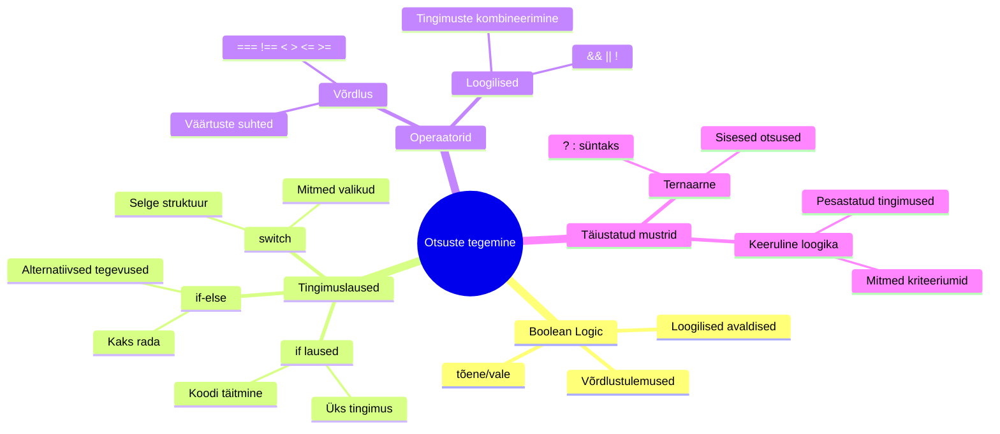
## Lühike ülevaade Boole'idest

Enne kui otsustamise juurde asume, meenutame eelmise õppetüki Boolean-väärtusi. Need väärtused, mille nimes on mõjuva matemaatik George Boole’i järgi, esindavad binaarseid olekuid – kas `true` ehk tõene või `false` ehk väär. Pole mingit kahtlust ega keskteed.

Need binaarsed väärtused on kogu arvutusloogika aluseks. Iga otsus, mida su programm teeb, lõppeb Boolean-hinnanguga.

Boolean-muutuja loomine on lihtne:

```javascript
let myTrueBool = true;
let myFalseBool = false;
```

See loob kaks muutujat, millel on selgelt määratud Boolean-väärtused.

✅ Boole'id on nimetatud inglise matemaatiku, filosoofi ja loogiku George Boole’i (1815–1864) järgi.

## Võrdlusoperaatorid ja Boole’id

Praktikas ei määra Boolean-väärtusi tavaliselt käsitsi, vaid loome need tingimusi hinnates: „Kas see number on suurem kui see?“ või „Kas need väärtused on võrdsed?“

Võrdlusoperaatorid võimaldavad neid hinnanguid teha. Nad võrdlevad väärtusi ja tagastavad Boolean-tulemuse, tuginedes operandide omavahelisele suhtele.

| Sümbol | Kirjeldus                                                                                                                                                   | Näide             |
| ------ | ----------------------------------------------------------------------------------------------------------------------------------------------------------- | ----------------- |
| `<`    | **Väiksem kui**: Võrdleb kahte väärtust ja tagastab `true` kui vasak pool on parem kui parem pool                                                        | `5 < 6 // true`   |
| `<=`   | **Väiksem või võrdne**: Võrdleb kahte väärtust ja tagastab `true`, kui vasak pool on väiksem või võrdne parema poolega                                   | `5 <= 6 // true`  |
| `>`    | **Suurem kui**: Võrdleb kahte väärtust ja tagastab true, kui vasak pool on suurem kui parem pool                                                          | `5 > 6 // false`  |
| `>=`   | **Suurem või võrdne**: Võrdleb kahte väärtust ja tagastab true, kui vasak pool on suurem või võrdne parema poolega                                        | `5 >= 6 // false` |
| `===`  | **Range võrdsus**: Võrdleb kahte väärtust ja tagastab true ainult siis, kui mõlemad pooled on võrdsed JA sama tüüpi                                     | `5 === 6 // false`|
| `!==`  | **Mittetäielik võrdsus**: Võrdleb kahte väärtust ja tagastab Boolean-väärtuse, mis on range võrdsuse vastand                                           | `5 !== 6 // true` |

✅ Kontrolli oma teadmisi kirjutades brauseri konsoolis mõningaid võrdlusi. Kas mõni tagastatud tulemus üllatab sind?

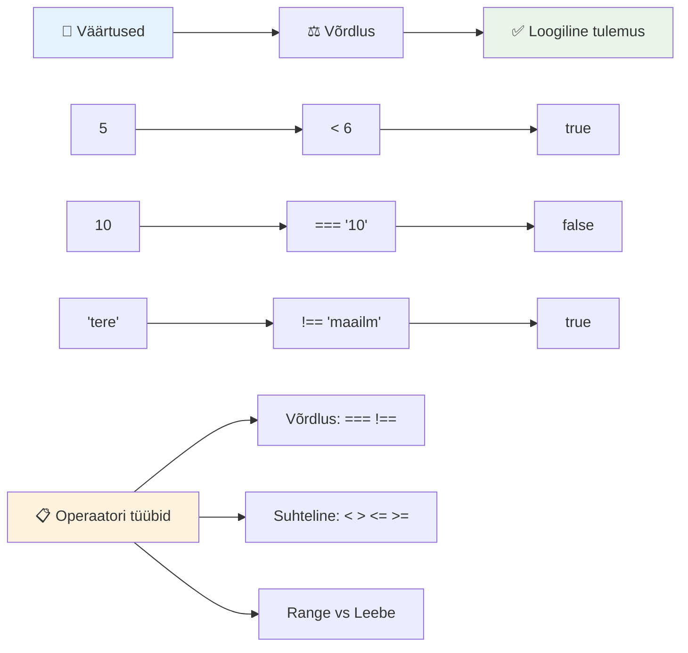
### 🧠 **Võrdluse valdamise kontroll: Boolean-loogika mõistmine**

**Testi oma võrdlusoskust:**
- Miks arvad, et `===` (range võrdsus) on üldiselt eelistatum `==` (ülevalt leebem võrdsus) asemel?
- Mida teeb `5 === '5'`? Ent `5 == '5'`?
- Milline on vahe `!==` ja `!=` vahel?

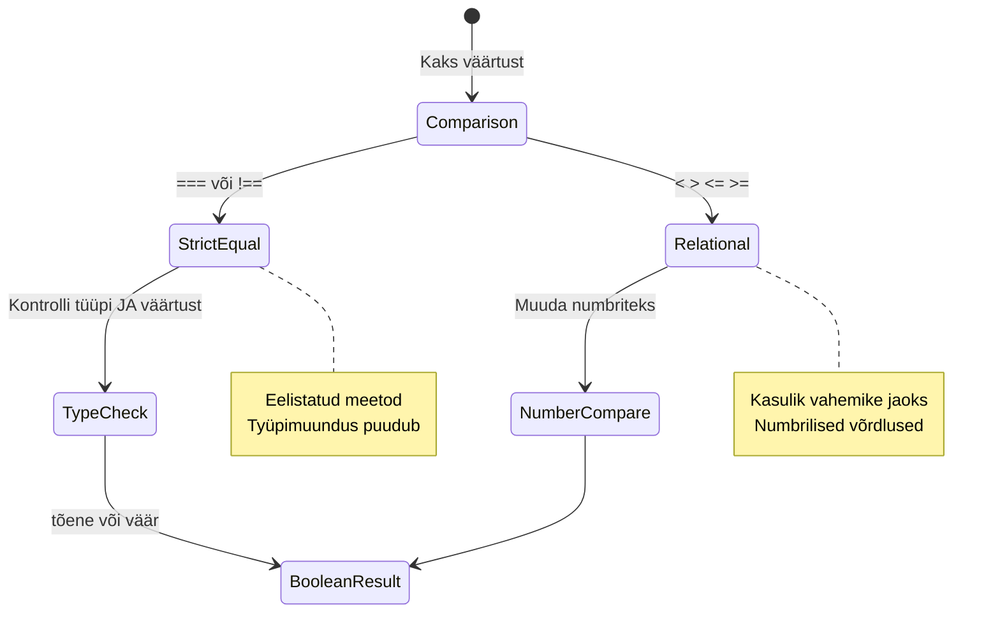
> **Näpunäide**: Kasuta alati `===` ja `!==` võrdluse tegemiseks, välja arvatud juhul, kui soovid just tüübi teisendust. See aitab vältida ootamatuid käitumisi!

## If lause

`if` lause on nagu koodis küsimuse esitamist: „Kui see tingimus on tõene, siis tee seda.“ See on ilmselt kõige olulisem vahend otsuste tegemisel JavaScriptis.

Näide, kuidas see töötab:

```javascript
if (condition) {
  // Tingimus on tõene. Selle ploki kood käivitatakse.
}
```

Tingimus pannakse sulgudes, ja kui see on `true`, täidab JavaScript koodi koolonite sees. Kui see on `false`, siis see plokk jäetakse vahele.

Tingimuste loomiseks kasutatakse tihti võrdlusoperaatoreid. Praktikas näeb see välja nii:

```javascript
let currentMoney = 1000;
let laptopPrice = 800;

if (currentMoney >= laptopPrice) {
  // Tingimus on tõene. Selle ploki kood käivitatakse.
  console.log("Getting a new laptop!");
}
```

Kuna `1000 >= 800` on `true`, täidetakse ploki sees olev kood ja konsooli kuvatakse "Getting a new laptop!".

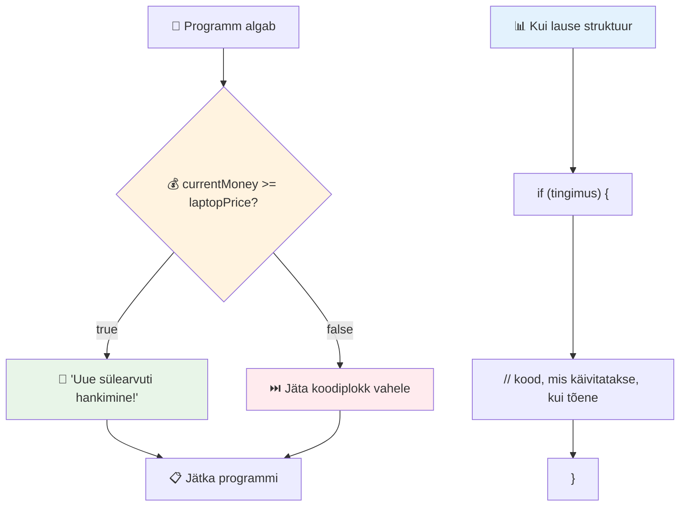
## If..Else lause

Aga mis sa teed, kui soovid programmi lasta teha midagi muud, kui tingimus on väär? Täpselt selle jaoks ongi `else` – see on nagu varuplaan.

`else` lause lubab öelda: „kui see tingimus ei pea paika, tee hoopis see teine asi.“

```javascript
let currentMoney = 500;
let laptopPrice = 800;

if (currentMoney >= laptopPrice) {
  // Tingimus on tõene. Selles plokis olev kood käivitatakse.
  console.log("Getting a new laptop!");
} else {
  // Tingimus on väär. Selles plokis olev kood käivitatakse.
  console.log("Can't afford a new laptop, yet!");
}
```

Kuna `500 >= 800` on `false`, siis esimene plokk jäetakse vahele ja käivitatakse `else` plokk. Konsoolis kuvatakse "Can't afford a new laptop, yet!".

✅ Testi selle ja järgneva koodi toimimist brauseri konsoolis. Muuda muutuja currentMoney ja laptopPrice väärtusi, et muuta konsooli poolt tagastatud `console.log()` sõnumit.

### 🎯 **If-Else loogika kontroll: harunemisteed**

**Hinda oma tingimusloogika mõistmist:**
- Mis juhtub, kui `currentMoney` on täpselt `laptopPrice` võrdne?
- Kas oskad välja mõelda mõne reaalse stsenaariumi, kus if-else loogika oleks kasulik?
- Kuidas võiksid laiendada seda, et katta mitu hinnaklassi?

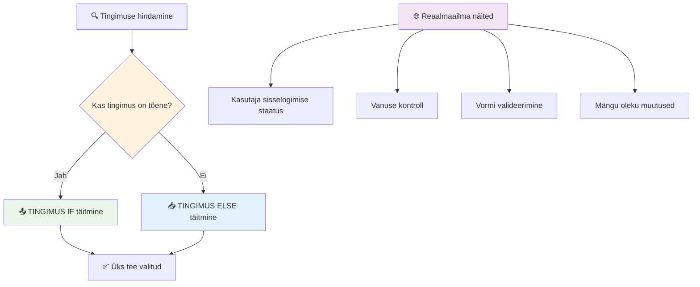
> **Oluline mõte**: If-else tagab, et valitakse täpselt üks tee. See garanteerib, et su programm reageerib igale tingimusele!

## Switch lause

Mõnikord pead võrdlema ühte väärtust mitme võimalusega. Kuigi võiksid kasutada mitut `if..else` lauset, muutub see kiiresti keeruliseks. `switch` lause pakub puhtamat struktuuri mitme konkreetse väärtuse käsitlemiseks.

See kontseptsioon meenutab varasemaid mehaanilisi vahetussüsteeme telefonikeskustes – üks sisendväärtus määrab, millist konkreetset teed täitmine järgib.

```javascript
switch (expression) {
  case x:
    // koodiplokk
    break;
  case y:
    // koodiplokk
    break;
  default:
    // koodiplokk
}
```

Struktuur näeb välja järgmiselt:
- JavaScript hindab avaldist ühe korra
- Otsib kõikidest `case`-idest sobivat juhust
- Kui sobiv leitakse, täidetakse selle plokk
- `break` käsib JavaScriptil switch lausest väljuda
- Kui ühtki sobivat pole, täidetakse `default` plokk (kui see on olemas)

```javascript
// Programm, mis kasutab nädalapäeva jaoks switch-lauset
let dayNumber = 2;
let dayName;

switch (dayNumber) {
  case 1:
    dayName = "Monday";
    break;
  case 2:
    dayName = "Tuesday";
    break;
  case 3:
    dayName = "Wednesday";
    break;
  default:
    dayName = "Unknown day";
    break;
}
console.log(`Today is ${dayName}`);
```

Selles näites näeb JavaScript, et `dayNumber` on `2`, leiab sobiva `case 2`, määrab `dayName` väärtuseks "Tuesday" ning katkestab switch-lausendi. Tulemuseks logitakse konsooli "Today is Tuesday".

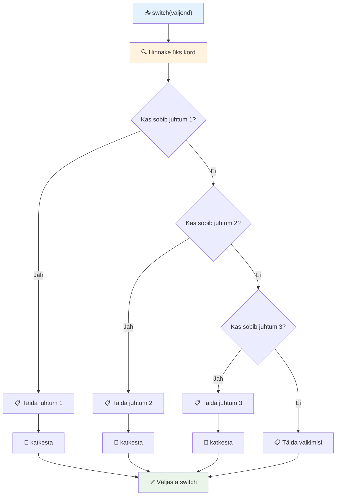
✅ Testi selle ja järgnevate koodide toimimist brauseri konsoolis. Muuda muutuja a väärtust, et muuta konsoolis välja toodud `console.log()`.

### 🔄 **Switch-lausendi valdamise kontroll: mitu valikut**

**Testi switch-lausendi mõistmist:**
- Mis juhtub, kui unustad `break`?
- Millal kasutaksid `switch` lauset mitme `if-else` asemel?
- Miks on `default` plokk kasulik ka siis, kui arvad, et kõik juhtumid on kaetud?

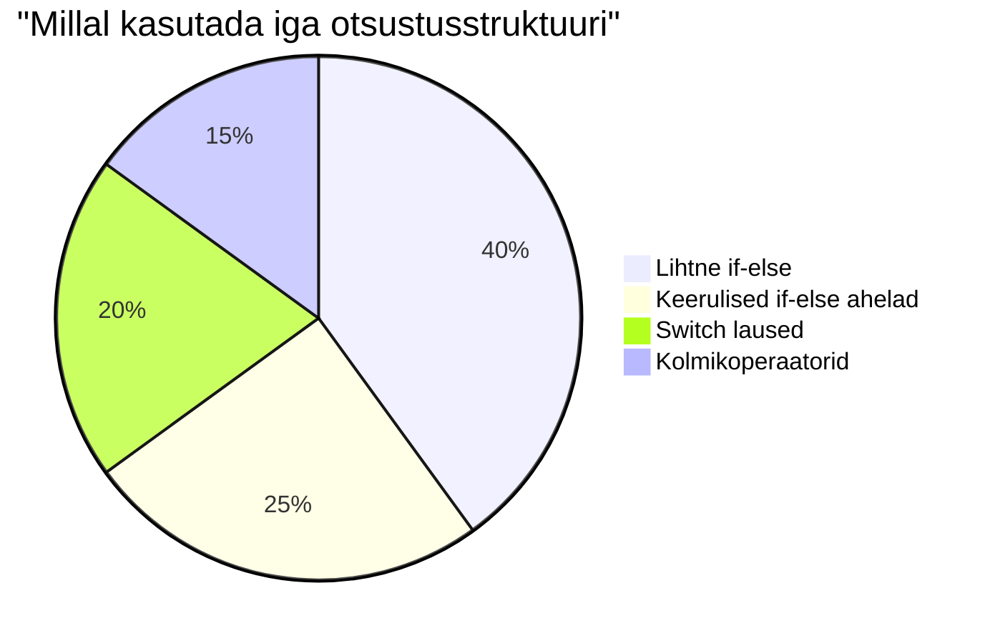
> **Parim praktika**: Kasuta `switch` lauset ühe muutuja võrdlemiseks mitme konkreetse väärtusega. Kasuta `if-else` vahemike või keerukamate tingimuste jaoks!

## Loogilised operaatorid ja Boole’id

Keerulised otsused nõuavad tihti mitme tingimuse samaaegset hindamist. Nii nagu Boole algebra võimaldab matemaatikutel loogilisi avaldisi kombineerida, pakub programmeerimine loogilisi operaatorid mitme Boolean-tingimuse ühendamiseks.

Need operaatorid lubavad keerukat tingimusloogikat, ühendades lihtsaid tõeväärtuste hinnanguid.

| Sümbol | Kirjeldus                                                                                       | Näide                                                                    |
| ------ | ----------------------------------------------------------------------------------------------- | -------------------------------------------------------------------------|
| `&&`   | **Loogiline JA**: Võrdleb kahte Boole avaldist. Tagastab true **ainult** siis, kui mõlemad on tõesed | `(5 > 3) && (5 < 10) // Mõlemad on tõesed. Tagastab true`               |
| `\|\|` | **Loogiline VÕI**: Võrdleb kahte Boole avaldist. Tagastab true, kui vähemalt üks pool on tõene  | `(5 > 10) \|\| (5 < 10) // Üks pool väär, teine tõene. Tagastab true`   |
| `!`    | **Loogiline MITTE**: Tagastab Boolean-avaldise vastandtõeväärtuse                                   | `!(5 > 10) // 5 ei ole suurem kui 10, seega "!" teeb selle tõeks`       |

Need operaatorid võimaldavad tingimusi kasulikult ühendada:
- JA (`&&`) tähendab, et mõlemad tingimused peavad olema tõesed
- VÕI (`||`) tähendab, et vähemalt üks tingimus peab olema tõene  
- MITTE (`!`) pöörab tõeväärtuse ümber

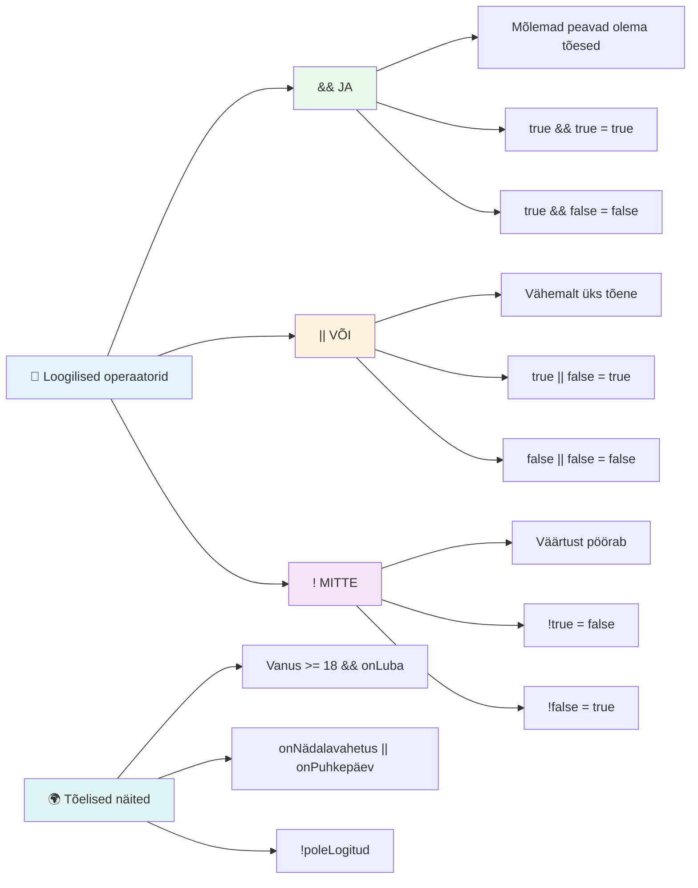
## Tingimused ja otsused loogiliste operaatoritega

Vaatame neid loogilisi operaatorid praktilises näites:

```javascript
let currentMoney = 600;
let laptopPrice = 800;
let laptopDiscountPrice = laptopPrice - (laptopPrice * 0.2); // Sülearvuti hind 20 protsenti soodsam

if (currentMoney >= laptopPrice || currentMoney >= laptopDiscountPrice) {
  // Tingimus on tõene. Selle ploki kood käivitatakse.
  console.log("Getting a new laptop!");
} else {
  // Tingimus on väär. Selle ploki kood käivitatakse.
  console.log("Can't afford a new laptop, yet!");
}
```

Selles näites arvutatakse 20% soodushinnaga hind (640), seejärel kontrollitakse, kas meil on kas täielikult või soodushinnaga piisavalt raha katmiseks. Kuna 600 täidab soodushinna künnise 640 (st tingimus on tõene), hinnatakse tingimus tõeseks.

### 🧮 **Loogika operaatoreid kontroll: tingimuste kombineerimine**

**Testi enda arvamist loogiliste operaatorite kohta:**
- Avaldises `A && B`, mis juhtub, kui A on väär? Kas B-d hinnatakse üldse?
- Kas oskad mõelda olukorrale, kus kõik kolm operaatorit (&&, ||, !) on korraga vajalikud?
- Milline on vahe `!user.isActive` ja `user.isActive !== true` vahel?

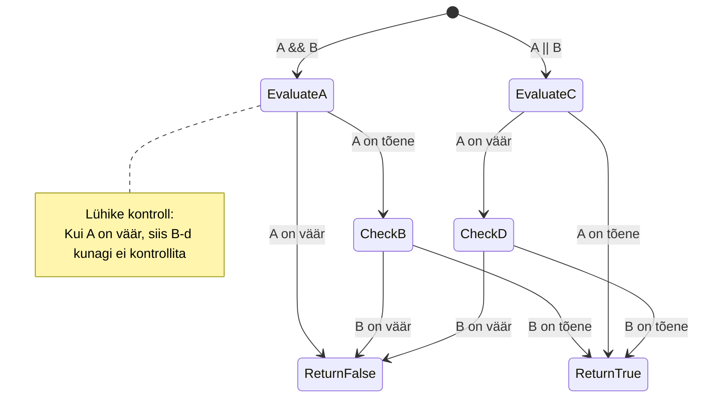
> **Tõhususe nipp**: JavaScript kasutab „lühikese tsükli hindamist“ – kui `A && B` juures on A väär, siis B-d ei hinnata. Kasuta seda enda kasuks!

### Negatsiooni operaator

Mõnikord on lihtsam mõelda, millal midagi EI OLE tõene. Näiteks selle asemel, et küsida „Kas kasutaja on sisse logitud?“, võiks küsida „Kas kasutaja EI OLE sisse logitud?“ Kutseis (`!`) pöörab loogika ümber.

```javascript
if (!condition) {
  // käivitub, kui tingimus on vale
} else {
  // käivitub, kui tingimus on tõene
}
```

`!` operaator tähendab "vastand...“ – kui midagi on `true`, teeb `!` selle `false` ja vastupidi.

### Tingimusavaldised (ternary)

Lihtsate tingimuslike väärtuste määramiseks pakub JavaScript **ternary operaatorit**. See lühike süntaks võimaldab ükskord tingimusavaldis kirjutada ühel real, mis sobib hästi olukordadesse, kus tuleb valida kahe väärtuse vahel.

```javascript
let variable = condition ? returnThisIfTrue : returnThisIfFalse;
```

See loeb nagu küsimus: „Kas see tingimus kehtib? Jah? Kasuta seda väärtust. Ei? Kasuta teist väärtust.“

Järgnevalt on konkreetsem näide:

```javascript
let firstNumber = 20;
let secondNumber = 10;
let biggestNumber = firstNumber > secondNumber ? firstNumber : secondNumber;
```

✅ Võta hetk, et seda koodi mõne korra lugeda. Kas mõistad, kuidas need operaatorid töötavad?

See rida ütleb: „Kas `firstNumber` on suurem kui `secondNumber`? Kui jah, paneb `firstNumber` muutujasse `biggestNumber`. Kui ei, siis paneb sinna `secondNumber`."

Ternary operaator on lihtsalt lühem klassikalisest `if..else` lausest:

```javascript
let biggestNumber;
if (firstNumber > secondNumber) {
  biggestNumber = firstNumber;
} else {
  biggestNumber = secondNumber;
}
```

Mõlemad meetodid annavad identse tulemuse. Ternary operaator on lühem ja kompaktsem, samas tavapärane if-else struktuur võib keerukamate tingimuste puhul olla loetavam.

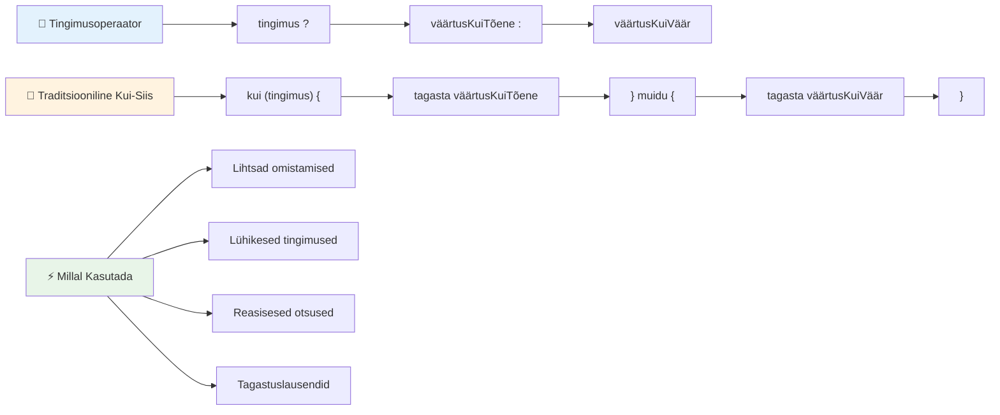
---


## 🚀 Väljakutse

Loo programm, mis on esmalt kirjutatud loogiliste operaatoritega, seejärel kirjuta see ümber, kasutades ternary avaldist. Milline süntaks meeldib sulle rohkem?

---

## GitHub Copilot Agent väljakutse 🚀

Kasuta Agent režiimi, et järgmist ülesannet lahendada:

**Kirjeldus:** Loo põhjalik hindekuulaja, mis demonstreerib mitmeid selle õppetüki otsustusmõisteid, sealhulgas if-else lauseid, switch lauseid, loogilisi operaatorid ja ternary avaldisi.

**Sisend:** Kirjuta JavaScripti programm, mis võtab õpilase numbrilise skoori (0-100) ja määrab tema tähthinde järgmisel alusel:
- A: 90-100
- B: 80-89  
- C: 70-79
- D: 60-69
- F: Alla 60

Nõuded:
1. Kasuta tähthinde määramiseks if-else lauset
2. Kasuta loogilisi operaatorid, et kontrollida, kas õpilane läbib (hinne >= 60) JA omab kiitust (hinne >= 90)
3. Kasuta switch-lauset, et anda konkreetset tagasisidet iga tähehinde kohta
4. Kasuta ternaarset operaatorit, et määrata, kas õpilane on järgmise kursuse jaoks sobilik (hinne >= 70)
5. Lisa sisendi valideerimine, et veenduda, et hinne jääb vahemikku 0 kuni 100

Testeeri oma programmi erinevate hinnetega, kaasa arvatud äärmuslikud juhtumid nagu 59, 60, 89, 90 ja väärad sisendid.

Lisateavet leiad siit: [agent mode](https://code.visualstudio.com/blogs/2025/02/24/introducing-copilot-agent-mode).

## Loengu järel test

[Loengu järel test](https://ff-quizzes.netlify.app/web/quiz/12)

## Kordamine ja iseseisev õpe

Loe rohkem kasutajale kättesaadavate operaatorite kohta [MDN-is](https://developer.mozilla.org/docs/Web/JavaScript/Reference/Operators).

Tutvu Josh Comeau imelise [operaatorite ülevaatega](https://joshwcomeau.com/operator-lookup/)!

## Kodutöö

[Operaatorid](assignment.md)

---

## 🧠 **Sinu otsustusvahendite tööriistakasti kokkuvõte**

```mermaid
graph TD
    A["🎯 JavaScript Otsused"] --> B["🔍 Boole'i Loogika"]
    A --> C["📊 Tingimuslause"]
    A --> D["🔗 Loogilised Operaatorid"]
    A --> E["⚡ Täiustatud Mustrid"]
    
    B --> B1["tõene/väär väärtused"]
    B --> B2["Võrdlusoperaatorid"]
    B --> B3["Tõeväärtuse kontseptsioonid"]
    
    C --> C1["if laused"]
    C --> C2["if-else ahelad"]
    C --> C3["switch laused"]
    
    D --> D1["&& (JA)"]
    D --> D2["|| (VÕI)"]
    D --> D3["! (MITTE)"]
    
    E --> E1["Kolmikhargne operaator"]
    E --> E2["Lühilõikeline hindamine"]
    E --> E3["Kompleksed tingimused"]
    
    F["💡 Võtmeprintsiibid"] --> F1["Selged loetavad tingimused"]
    F --> F2["Järjepidev võrdlusstiil"]
    F --> F3["Õige operaatori eelnevus"]
    F --> F4["Tõhus hindamiskord"]
    
    style A fill:#e3f2fd
    style B fill:#e8f5e8
    style C fill:#fff3e0
    style D fill:#f3e5f5
    style E fill:#e0f2f1
    style F fill:#fce4ec
```
---

## 🚀 Sinu JavaScripti otsustusoskuse ajatelg

### ⚡ **Mida saad teha järgmise 5 minutiga**
- [ ] Harjuta võrdlusoperaatoreid oma brauseri konsoolis
- [ ] Kirjuta lihtne if-else lause, mis kontrollib sinu vanust
- [ ] Proovi väljakutset: kirjuta if-else ümber kasutades ternaarset operaatorit
- [ ] Testi, mis juhtub erinevate "tõeväärtuslike" ja "ebatõeväärtuslike" väärtustega

### 🎯 **Mida saad selle tunni jooksul saavutada**
- [ ] Täida järeltest ja vaata üle segased kontseptsioonid
- [ ] Ehita täielik hinde arvutaja GitHub Copiloti väljakutse põhjal
- [ ] Loo lihtne otsustuspuu reaalse maailma stsenaariumile (näiteks riietuse valik)
- [ ] Harjuta mitme tingimuse ühendamist loogiliste operaatoritega
- [ ] Katseta erinevaid kasutusjuhtumeid switch-lausetega

### 📅 **Sinu nädalane loogika meisterlikkus**
- [ ] Täida operaatorite kodutöö loovate näidetega
- [ ] Loo väike testirakendus, kasutades erinevaid tingimusstruktuure
- [ ] Loo vormi valideerija, mis kontrollib mitut sisendtingimust
- [ ] Harjuta Josh Comeau [operaatorite otsingut](https://joshwcomeau.com/operator-lookup/)
- [ ] Refaktoreeri olemasolevat koodi sobivamate tingimusstruktuuride kasutamiseks
- [ ] Õpi lühitsükli hindamist ja selle mõju jõudlusele

### 🌟 **Sinu kuu pikkune areng**
- [ ] Valda keerukaid pesastatud tingimusi ja hoia koodi loetavus
- [ ] Ehita rakendus keeruka otsustusloogikaga
- [ ] Panusta avatud lähtekoodi, parandades tingimusloogikat olemasolevates projektides
- [ ] Õpeta kedagi teist erinevate tingimusstruktuuride kohta ja nende kasutusajal
- [ ] Uuri funktsionaalprogrammeerimise lähenemisi tingimusloogikale
- [ ] Loo isiklik viide tingimuste parimatele praktikatele

### 🏆 **Lõplik otsustusoskuse meistrikontroll**

**Tähista oma loogilise mõtlemise valdamist:**
- Millise kõige keerukama otsustusloogika oled edukalt rakendanud?
- Milline tingimusstruktuur tundub sulle kõige loomulikum ja miks?
- Kuidas on õppimine loogiliste operaatorite kohta muutnud sinu probleemide lahendamise lähenemist?
- Milline reaalmaailma rakendus võiks kasu saada keerukast otsustusloogikast?

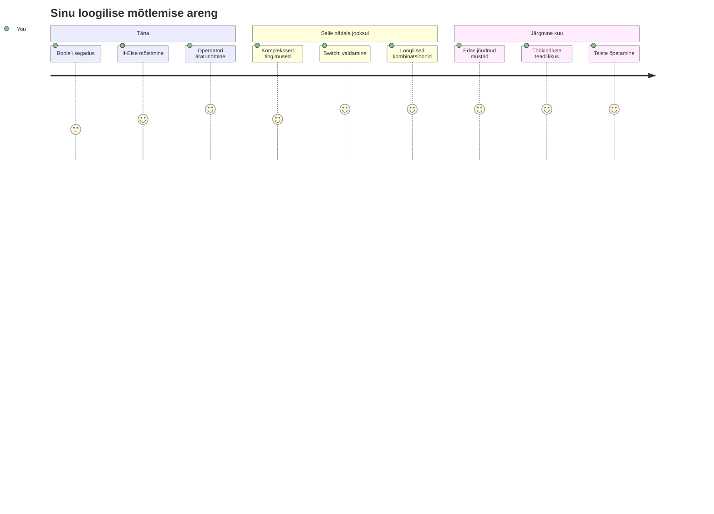
> 🧠 **Oled valdanud digitaalse otsustamise kunsti!** Iga interaktiivne rakendus tugineb tingimusloogikale, et targalt reageerida kasutaja tegevustele ja muutuvale olukorrale. Nüüd mõistad, kuidas panna oma programmid mõtlema, hindama ja valima sobivaid vastuseid. See loogiline alus annab jõu kõigile dünaamilistele rakendustele, mida ehitad! 🎉

---

<!-- CO-OP TRANSLATOR DISCLAIMER START -->
**Vastutusest loobumine**:
See dokument on tõlgitud tehisintellekti tõlketeenuse [Co-op Translator](https://github.com/Azure/co-op-translator) abil. Kuigi me püüame täpsust, tuleb arvestada, et automaatsetes tõlgetes võib esineda vigu või ebatäpsusi. Originaaldokument selle algkeeles tuleb pidada autoriteetseks allikaks. Kriitilise informatsiooni puhul soovitatakse professionaalset inimtõlget. Me ei vastuta selle tõlke kasutamisest tingitud arusaamatuste või väärinterpreteerimiste eest.
<!-- CO-OP TRANSLATOR DISCLAIMER END -->